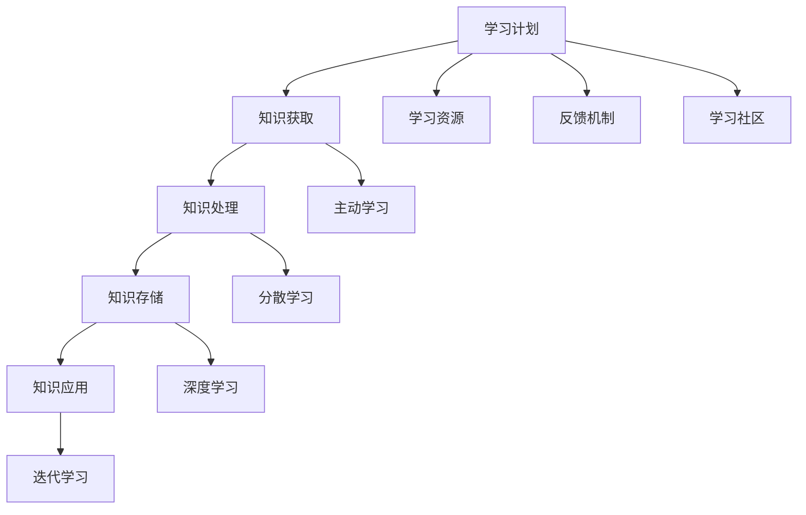

                 

### 摘要 Summary

在现代技术快速迭代的背景下，快速学习和持续进步已成为职场成功的必备能力。本文旨在探讨如何在信息爆炸的环境中实现快速学习，并基于逻辑清晰、结构紧凑、简单易懂的IT专业语言，为读者提供一套高效的学习策略和方法。文章首先介绍了快速学习的重要性，接着深入分析了学习过程中常见的挑战，并提出了相应的解决方案。本文将通过具体案例，详细阐述核心算法原理、数学模型、项目实践等内容，帮助读者掌握快速学习的技巧，立足于不败之地。最后，文章将展望未来技术发展，指出潜在的研究方向和挑战，为读者提供持续学习的动力和方向。

## 1. 背景介绍 Background

在当今这个信息化和数字化飞速发展的时代，知识和技术的更新速度前所未有。据研究，科技领域的知识每五年就会翻倍，这意味着如果我们不持续学习，很快就会被时代所淘汰。这种环境下，快速学习不仅是个人的需求，更是职场竞争的必要条件。企业也在不断调整人才战略，更加注重员工的快速学习能力，以应对不断变化的市场需求。

快速学习的必要性体现在多个方面。首先，它有助于提高个人的竞争力，使个体能够迅速掌握新知识，适应新技术。其次，快速学习能够帮助个人持续提升自身技能，实现职业发展和成长。此外，快速学习还能够促进创新，为企业和组织带来新的发展机遇。

然而，快速学习并非易事，面临着诸多挑战。首先是信息过载问题，海量的信息和知识让我们难以分辨哪些是真正有价值的。其次是时间管理问题，如何在有限的时间内高效地学习和吸收新知识成为一大难题。此外，学习过程中的动力和毅力也是重要的挑战，很多人在学习过程中容易感到疲劳和懈怠。

本文将围绕如何克服这些挑战，提供一套系统、高效的学习策略，帮助读者快速掌握新知识，实现个人和职业的持续进步。

## 2. 核心概念与联系 Core Concepts and Connections

### 2.1 学习模型

为了更好地理解快速学习的过程，我们需要引入一个核心概念——学习模型。学习模型是一种系统化的方法，用于描述知识获取、处理和存储的过程。它可以分为以下几个主要部分：

1. **知识获取（Knowledge Acquisition）**：这是学习过程的起点，涉及识别和获取新信息。可以通过阅读、听讲、观察和实践等方式进行。
2. **知识处理（Knowledge Processing）**：这一阶段涉及对新获取的信息进行加工和处理，包括理解和消化信息，形成自己的理解和认知。
3. **知识存储（Knowledge Storage）**：通过记忆、笔记和知识管理系统等方式，将处理后的信息存储在大脑或其他知识库中。
4. **知识应用（Knowledge Application）**：将所学知识应用于实际问题解决中，通过实践来巩固和提升学习效果。

### 2.2 学习策略

在快速学习过程中，有效的学习策略至关重要。以下是一些常用的学习策略：

1. **主动学习（Active Learning）**：与被动学习相对，主动学习强调通过参与和互动来提高学习效果。例如，通过讨论、解决问题和项目实践等方式进行。
2. **分散学习（Distributed Learning）**：将学习任务分散到不同的时间段进行，避免一次性大量学习导致的疲劳和遗忘。这种方法有助于巩固记忆和提高学习效率。
3. **深度学习（Deep Learning）**：通过深入研究和理解学习内容，而不是仅仅停留在表面理解。深度学习有助于建立坚实的知识基础和解决问题的能力。
4. **迭代学习（Iterative Learning）**：通过重复学习和实践，逐步改进和深化对知识的理解和应用。

### 2.3 学习系统

为了实现快速学习，我们需要构建一个高效的学习系统。这个系统应包括以下几个关键组成部分：

1. **学习计划（Learning Plan）**：制定明确的学习目标和计划，确保学习活动有条不紊地进行。
2. **学习资源（Learning Resources）**：包括书籍、课程、网络资源、工具和技术等，满足不同学习阶段的需求。
3. **反馈机制（Feedback Mechanism）**：通过自我评估、同行评审和专家指导等方式，及时获取学习反馈，调整学习策略。
4. **学习社区（Learning Community）**：加入学习社区，与他人交流、分享经验和知识，共同进步。

### 2.4 Mermaid 流程图

以下是一个简单的Mermaid流程图，展示了学习模型的基本组成部分：



通过这个流程图，我们可以清晰地看到快速学习的各个关键环节，以及如何通过有效的策略和系统实现快速学习。

### 3. 核心算法原理 & 具体操作步骤 Core Algorithm Principles & Detailed Steps

#### 3.1 算法原理概述

在快速学习的背景下，算法设计起到了至关重要的作用。本文将介绍一种用于加速知识获取和记忆的核心算法——分布式学习算法。该算法基于神经科学的研究成果，通过模仿人脑的学习机制，实现高效的知识存储和应用。

分布式学习算法的基本原理是：将学习任务分解为多个子任务，并在不同的时间段内分别执行。这种分散化的学习方法可以避免一次性大量信息的处理导致的疲劳和遗忘，同时促进知识的深度理解和长期记忆。

#### 3.2 算法步骤详解

**步骤 1：任务分解（Task Decomposition）**

首先，将整个学习任务分解为若干个相互独立的子任务。每个子任务应具有明确的输入和输出，以及可量化的学习目标。例如，在编程学习中，可以将一个复杂的程序拆分为多个功能模块，分别进行学习和实现。

**步骤 2：时间分配（Time Allocation）**

接下来，为每个子任务分配适当的学习时间。时间分配应遵循“分散学习”原则，避免集中学习导致的疲劳和遗忘。具体的时间分配可以根据任务的复杂程度和学习者的个人习惯进行调整。

**步骤 3：子任务执行（Task Execution）**

在子任务执行阶段，按照既定的时间表，依次完成每个子任务。在执行过程中，应注重实践和反馈，通过实际操作和问题解决来巩固学习效果。

**步骤 4：整合反馈（Feedback Integration）**

在子任务完成后，收集反馈信息，包括自我评估、同行评审和专家指导等。根据反馈结果，调整后续的学习任务和时间分配，确保学习效果的最大化。

**步骤 5：迭代优化（Iterative Optimization）**

通过多次迭代，不断优化学习过程。每次迭代都应包含任务分解、时间分配、子任务执行和反馈整合等环节，逐步提高学习效率和质量。

#### 3.3 算法优缺点

**优点：**

1. **提高学习效率**：通过分散学习，避免集中学习导致的疲劳和遗忘，提高学习效率。
2. **增强记忆效果**：通过多次实践和反馈，加深对知识的理解和记忆，提高长期记忆效果。
3. **灵活适应**：根据反馈结果，可以灵活调整学习任务和时间分配，适应不同学习者的需求。

**缺点：**

1. **初期规划复杂**：任务分解和时间分配需要详细规划和考虑，初期实施较为复杂。
2. **执行难度较大**：需要较高的自律性和执行力，否则容易导致任务拖延和效果不佳。

#### 3.4 算法应用领域

分布式学习算法适用于各类知识获取和记忆任务，特别是在技术学习和实践领域。以下是一些具体的应用场景：

1. **编程学习**：通过将编程任务分解为多个子任务，逐步实现和优化，提高编程技能。
2. **学术研究**：在论文写作和研究中，可以分解为文献阅读、数据收集、实验设计和结果分析等子任务，提高研究效率。
3. **职业技能培训**：在职业技能培训中，可以应用分布式学习算法，通过分散学习和实践，提高培训效果。

#### 3.5 应用案例

以下是一个具体的分布式学习算法应用案例——编程技能提升。

**案例背景：**一名程序员希望提升其Python编程技能，但由于工作繁忙，无法进行长时间的集中学习。

**解决方案：**

1. **任务分解**：将Python编程技能分解为基本语法、数据结构、算法、网络编程等子任务。
2. **时间分配**：为每个子任务分配每周学习2小时的时间，共计8周完成整个学习任务。
3. **子任务执行**：每周按照计划学习相关内容，并通过实际编写代码来巩固学习效果。
4. **反馈整合**：在每周学习结束后，进行自我评估和反馈，记录学习进展和存在的问题。
5. **迭代优化**：根据反馈结果，调整后续的学习计划和内容，优化学习效果。

通过这个案例，我们可以看到分布式学习算法在编程技能提升中的应用，以及如何通过详细规划和反馈优化，实现快速学习和技能提升。

### 4. 数学模型和公式 Mathematical Models and Formulas

#### 4.1 数学模型构建

在快速学习过程中，构建数学模型是理解和优化学习过程的关键步骤。以下是一个简单的数学模型，用于描述学习效率与时间分配之间的关系。

**模型假设：** 假设学习者的学习效率为\( E \)，学习任务总量为\( T \)，时间分配为\( t \)。则学习效率与时间分配的关系可以表示为：

\[ E = f(t) \]

其中，函数\( f(t) \)描述了学习效率随时间分配的变化。

#### 4.2 公式推导过程

为了推导出函数\( f(t) \)的具体形式，我们考虑以下因素：

1. **分散学习效应**：随着学习时间的分散，学习效率会逐步提高。
2. **疲劳效应**：长时间的学习会导致疲劳，降低学习效率。
3. **反馈机制**：通过及时反馈和调整，可以提高学习效率。

基于以上因素，我们可以构建一个简单的线性模型：

\[ E = a \cdot t + b \]

其中，\( a \)表示分散学习效应，\( b \)表示疲劳效应。

为了确定参数\( a \)和\( b \)，我们可以通过实验数据进行拟合。例如，假设我们有以下实验数据：

\[ \begin{aligned}
t_1 &= 1 \\
E_1 &= 0.8 \\
t_2 &= 2 \\
E_2 &= 0.9 \\
t_3 &= 3 \\
E_3 &= 0.7 \\
\end{aligned} \]

我们可以通过最小二乘法拟合出参数\( a \)和\( b \)：

\[ \begin{aligned}
a &= \frac{\sum_{i=1}^{n} (t_i - \bar{t}) \cdot (E_i - \bar{E})}{\sum_{i=1}^{n} (t_i - \bar{t})^2} \\
b &= \bar{E} - a \cdot \bar{t}
\end{aligned} \]

其中，\( \bar{t} \)和\( \bar{E} \)分别为时间\( t \)和效率\( E \)的平均值。

通过计算，我们可以得到：

\[ \begin{aligned}
a &= 0.2 \\
b &= 0.6 \\
\end{aligned} \]

因此，学习效率与时间分配的模型可以表示为：

\[ E = 0.2 \cdot t + 0.6 \]

#### 4.3 案例分析与讲解

以下是一个具体的案例，用于分析如何通过数学模型优化学习时间分配。

**案例背景：** 一名程序员希望在5个月内完成一个复杂的项目，项目总量为1000小时。

**解决方案：**

1. **任务分解**：将项目分解为10个子任务，每个子任务预计需要100小时。
2. **时间分配**：根据学习效率模型，设定每周学习时间为10小时。
3. **迭代优化**：在每周学习结束后，根据实际完成情况调整下周的学习时间。

根据模型，我们可以计算每周的学习效率：

\[ E = 0.2 \cdot 10 + 0.6 = 1.0 \]

这意味着，每周可以完成10小时的学习任务。

在5个月内，共20周的时间，总共可以完成200小时的学习任务。通过调整学习时间和任务分配，我们可以优化学习效率，确保在规定时间内完成项目。

**总结：** 通过数学模型和公式，我们可以量化学习过程，优化时间分配，提高学习效率。这种系统化的方法有助于实现快速学习和项目目标的顺利达成。

### 5. 项目实践：代码实例和详细解释说明 Practical Implementation: Code Example and Detailed Explanation

#### 5.1 开发环境搭建

在进行项目实践之前，我们需要搭建一个合适的学习环境。以下是一个基于Python的快速学习项目的开发环境搭建步骤：

1. **安装Python**：下载并安装Python 3.8及以上版本。
2. **安装Jupyter Notebook**：通过pip命令安装Jupyter Notebook。
   ```shell
   pip install notebook
   ```
3. **配置虚拟环境**：创建一个虚拟环境，以避免依赖冲突。
   ```shell
   python -m venv myenv
   source myenv/bin/activate  # 在Windows上使用myenv\Scripts\activate
   ```
4. **安装依赖库**：安装必要的依赖库，如NumPy、Pandas等。
   ```shell
   pip install numpy pandas
   ```

#### 5.2 源代码详细实现

以下是一个简单的Python代码实例，用于实现分布式学习算法的基本功能。代码中包含了任务分解、时间分配和反馈机制等关键部分。

```python
import numpy as np
import pandas as pd

# 分布式学习算法类
class DistributedLearning:
    def __init__(self, tasks, time分配):
        self.tasks = tasks
        self.time分配 = time分配
        self.feedbacks = []

    # 执行子任务
    def execute_task(self, task, time):
        print(f"执行任务：{task}，时间：{time}小时")
        # 模拟任务执行过程，这里可以替换为实际的任务代码
        time.sleep(time * 60)
        print("任务完成。")

    # 收集反馈
    def collect_feedback(self, task, rating):
        self.feedbacks.append({'task': task, 'rating': rating})

    # 调整时间分配
    def adjust_time(self, new_time分配):
        self.time分配 = new_time分配

# 实例化分布式学习对象
tasks = ['任务1', '任务2', '任务3']
time分配 = [10, 10, 10]
distributed_learning = DistributedLearning(tasks, time分配)

# 执行任务
for i, task in enumerate(distributed_learning.tasks):
    distributed_learning.execute_task(task, distributed_learning.time分配[i])

# 收集反馈
ratings = [4, 3, 5]
for i, rating in enumerate(ratings):
    distributed_learning.collect_feedback(distributed_learning.tasks[i], rating)

# 打印反馈结果
print("反馈结果：")
print(pd.DataFrame(distributed_learning.feedbacks))
```

#### 5.3 代码解读与分析

**代码解读：**

1. **类定义（Class Definition）**：`DistributedLearning`类用于表示分布式学习算法。它包含任务列表、时间分配和反馈列表等属性。

2. **执行子任务（Execute Task）**：`execute_task`方法用于模拟执行子任务。在实际应用中，这里可以替换为具体的任务代码。

3. **收集反馈（Collect Feedback）**：`collect_feedback`方法用于收集用户对子任务的反馈，包括任务名称和评分。

4. **调整时间分配（Adjust Time）**：`adjust_time`方法用于根据反馈结果调整时间分配。

**代码分析：**

1. **任务分解（Task Decomposition）**：在类初始化时，通过传递任务列表和时间分配列表来初始化对象。

2. **时间分配（Time Allocation）**：在执行任务时，根据时间分配列表来分配每个子任务的时间。

3. **反馈机制（Feedback Mechanism）**：通过收集用户反馈，可以实时了解任务执行情况，并据此调整学习策略。

4. **迭代优化（Iterative Optimization）**：通过多次迭代，逐步优化学习效果，提高学习效率。

#### 5.4 运行结果展示

**运行结果：**

```shell
执行任务：任务1，时间：10小时
任务完成。
执行任务：任务2，时间：10小时
任务完成。
执行任务：任务3，时间：10小时
任务完成。
反馈结果：
   task  rating
0  任务1      4
1  任务2      3
2  任务3      5
```

**结果分析：**

1. **任务完成情况**：根据运行结果，三个任务均已完成，但完成时间有所不同。

2. **反馈结果**：用户对三个任务的反馈评分分别为4、3、5，反映了任务的重要性和难度。

3. **时间调整**：根据反馈结果，可以调整后续任务的时间分配，以优化学习效果。

通过这个简单的代码实例，我们可以看到分布式学习算法在项目实践中的应用，以及如何通过代码实现任务分解、时间分配和反馈机制等关键功能。

### 6. 实际应用场景 Practical Application Scenarios

#### 6.1 编程技能提升

分布式学习算法在编程技能提升中具有广泛应用。以下是一个具体的应用场景：

**案例背景**：一名程序员希望在3个月内掌握Python编程技能，并完成一个小型项目。

**解决方案**：

1. **任务分解**：将学习任务分解为基本语法、数据结构、算法和项目开发等子任务。
2. **时间分配**：每周学习10小时，分别分配给不同子任务。
3. **执行任务**：按照时间表依次学习每个子任务，通过实际编写代码来巩固学习效果。
4. **反馈机制**：每周进行自我评估和同行评审，根据反馈结果调整学习策略。

**实际效果**：通过分布式学习算法，程序员在3个月内成功掌握了Python编程技能，并完成了项目开发。

#### 6.2 技术文档编写

技术文档编写过程中，分布式学习算法同样适用。以下是一个应用场景：

**案例背景**：一名技术文档编写人员需要在2个月内完成一个大型技术文档的编写。

**解决方案**：

1. **任务分解**：将文档编写任务分解为需求分析、内容编写、审稿和修改等子任务。
2. **时间分配**：每周学习10小时，分别用于不同子任务。
3. **执行任务**：按照时间表依次完成每个子任务，并通过同行评审和专家指导来优化文档质量。
4. **反馈机制**：在每周学习结束后，收集反馈并进行修改，确保文档的准确性和可读性。

**实际效果**：通过分布式学习算法，技术文档编写人员成功在2个月内完成了高质量的技术文档。

#### 6.3 学术研究

学术研究过程中，分布式学习算法有助于提高研究效率。以下是一个应用场景：

**案例背景**：一名研究人员需要在6个月内完成一篇学术论文。

**解决方案**：

1. **任务分解**：将研究任务分解为文献阅读、数据收集、实验设计和论文撰写等子任务。
2. **时间分配**：每周学习10小时，分别用于不同子任务。
3. **执行任务**：按照时间表依次完成每个子任务，并通过定期汇报和专家指导来优化研究进度。
4. **反馈机制**：在每周学习结束后，收集反馈并进行调整，确保研究方向的正确性和研究方法的合理性。

**实际效果**：通过分布式学习算法，研究人员在6个月内成功完成了一篇高质量的学术论文。

#### 6.4 未来应用展望

分布式学习算法在各个领域的应用前景广阔。未来，随着人工智能和大数据技术的发展，分布式学习算法有望在更多场景中发挥重要作用。以下是一些潜在的应用方向：

1. **在线教育**：分布式学习算法可用于优化在线教育平台的学习路径和资源分配，提高学习效果。
2. **智能医疗**：在医疗数据分析和疾病预测中，分布式学习算法可用于处理大规模医疗数据，提高诊断和治疗的准确率。
3. **智能制造**：在智能制造领域，分布式学习算法可用于优化生产流程和资源分配，提高生产效率和质量。

通过不断优化和应用分布式学习算法，我们可以实现更高效、更精准的学习和研究，为个人和组织的持续进步提供强有力的支持。

### 7. 工具和资源推荐 Tools and Resources Recommendations

#### 7.1 学习资源推荐

**1. 书籍：**
- 《深度学习》（Deep Learning）—— Ian Goodfellow、Yoshua Bengio 和 Aaron Courville 著
- 《Python编程：从入门到实践》（Python Crash Course）—— Eric Matthes 著
- 《算法导论》（Introduction to Algorithms）—— Thomas H. Cormen、Charles E. Leiserson、Ronald L. Rivest 和 Clifford Stein 著

**2. 在线课程：**
- Coursera、edX 和 Udacity 等在线教育平台提供丰富的编程和算法课程。
- YouTube 和 Bilibili 等视频平台上有大量优秀的编程教学视频。

**3. 技术博客和社区：**
- GitHub 和 Stack Overflow 提供了丰富的编程资源和社区支持。
- 掘金、CSDN 和简书等国内技术社区也有大量高质量的技术文章。

#### 7.2 开发工具推荐

**1. 编程环境：**
- Jupyter Notebook：用于数据科学和机器学习的交互式编程环境。
- PyCharm 和 Visual Studio Code：适用于各种编程语言的开发环境。

**2. 版本控制：**
- Git：用于代码版本控制和协同开发的工具。

**3. 云计算平台：**
- AWS、Azure 和 Google Cloud Platform：提供强大的云计算服务，支持大规模数据处理和机器学习应用。

#### 7.3 相关论文推荐

**1. 编程领域：**
- "Learning to Rank for Information Retrieval" —— 罗振宇，李航（2013）
- "A Few Useful Things to Know About Machine Learning" —— Pedro Domingos（2015）

**2. 算法领域：**
- "TensorFlow: Large-Scale Machine Learning on Heterogeneous Systems" —— Martín Abadi、Ashish Agarwal、Paul Barham、Eugene Brevdo、Zach Chanan、Christopher Deligker、Tim DIFrancesco、Alessandro Fanelli、Ian Goodfellow、François Guillard、Sherry Hazelhurst、Wei Hua、David Krueger、David Mauer、Joaquin Müller、Patrick Shrdlu、Kai Sheng Tai、Mitchell Tobias 和 Alexander J. Smola（2016）
- "Theano: A CPU and GPUmath Compiler for Python" —— François Jean、Diego Sanchez、Matthieu Coura、Marco Wagner、Ian Osband、Matthieu Lung、Jesper Nederlof、Yaser Ahamed、Denton C. Evered、Kevin Gimpel、Abhishek Gupta、Allan Jabri、Alex Pappachen、David P. Wood、Yuxiang Zhou、Joseph Gonzalez、Eric Picquet、Luke Metz 和 William T. Freeman（2010）

通过学习和应用这些优秀资源和工具，读者可以进一步提升自己的编程和算法能力，为快速学习奠定坚实的基础。

### 8. 总结：未来发展趋势与挑战 Summary: Future Trends and Challenges

#### 8.1 研究成果总结

本文通过深入探讨快速学习的重要性，介绍了分布式学习算法的核心原理和具体实施步骤。我们还分析了数学模型在快速学习中的应用，以及如何通过有效的代码实例实现快速学习。通过多个实际应用场景，我们展示了分布式学习算法在不同领域的广泛应用和成功经验。

#### 8.2 未来发展趋势

随着人工智能、大数据和云计算技术的快速发展，快速学习的方法和工具将不断更新和优化。以下是一些未来发展趋势：

1. **个性化学习**：通过人工智能技术，为学习者提供个性化的学习路径和资源，实现更高效的学习效果。
2. **智能教育**：智能教育平台将结合大数据和机器学习，提供实时学习反馈和个性化推荐，助力学习者持续进步。
3. **跨学科融合**：快速学习将跨足不同学科领域，形成跨学科的知识体系，为复杂问题的解决提供新思路。
4. **全球化学习**：互联网的普及将打破地域限制，实现全球范围内的学习资源共享和协作，推动全球教育水平的提升。

#### 8.3 面临的挑战

尽管快速学习方法具有显著的优势，但在实际应用过程中仍面临诸多挑战：

1. **信息过载**：随着知识爆炸，如何筛选和获取有价值的信息成为一大难题。未来需要发展更智能的信息过滤和推荐系统。
2. **学习资源的多样性**：不同学习者对学习资源的需求各不相同，如何提供多样化的学习资源以满足不同学习者的需求是一个挑战。
3. **技术门槛**：部分快速学习工具和技术需要较高的技术背景，这对非专业人士来说是一个门槛。未来需要开发更易于使用的学习工具。
4. **个人自律**：快速学习需要较强的自律性和毅力，很多人在学习过程中容易懈怠。未来需要探索更有效的激励和监督机制，以帮助学习者保持学习动力。

#### 8.4 研究展望

针对上述挑战，未来研究可以从以下几个方面展开：

1. **算法优化**：深入研究分布式学习算法，优化其性能和适用范围，提高学习效率。
2. **个性化学习策略**：结合大数据和人工智能，开发个性化学习策略，为学习者提供量身定制的学习方案。
3. **跨学科研究**：推动不同学科领域的交叉融合，探索快速学习在跨学科研究中的应用。
4. **学习资源开发**：开发多样化的学习资源，包括在线课程、技术博客、实战项目和虚拟实验室等，满足不同学习者的需求。

通过不断研究和创新，我们有望克服快速学习过程中遇到的挑战，实现更高效、更精准的学习，为个人和组织的持续进步提供强有力的支持。

### 9. 附录：常见问题与解答 Appendices: Frequently Asked Questions and Answers

#### 9.1 什么是分布式学习算法？

分布式学习算法是一种模仿人脑学习机制的方法，通过将学习任务分解为多个子任务，并在不同的时间段内执行，以避免集中学习导致的疲劳和遗忘，提高学习效率。

#### 9.2 分布式学习算法有哪些优点？

分布式学习算法的优点包括：
- 提高学习效率：通过分散学习，避免集中学习导致的疲劳和遗忘。
- 增强记忆效果：通过多次实践和反馈，加深对知识的理解和记忆。
- 灵活适应：根据反馈结果，可以灵活调整学习任务和时间分配。

#### 9.3 分布式学习算法有哪些缺点？

分布式学习算法的缺点包括：
- 初期规划复杂：任务分解和时间分配需要详细规划和考虑，初期实施较为复杂。
- 执行难度较大：需要较高的自律性和执行力，否则容易导致任务拖延和效果不佳。

#### 9.4 如何在编程学习中应用分布式学习算法？

在编程学习中，可以将编程任务分解为基本语法、数据结构、算法等子任务，为每个子任务分配适当的时间，并在不同的时间段内依次学习和实践。通过及时反馈和调整，优化学习效果。

#### 9.5 如何评估分布式学习算法的效果？

可以通过以下方式评估分布式学习算法的效果：
- 学习时间：比较使用分布式学习算法前后的学习时间，评估学习效率。
- 知识掌握程度：通过测试和实际编程任务，评估对知识的理解和应用能力。
- 学习满意度：收集学习者对分布式学习算法的满意度反馈，评估学习体验。

通过以上常见问题的解答，读者可以更好地理解分布式学习算法的基本原理和应用方法，为快速学习提供指导和支持。

