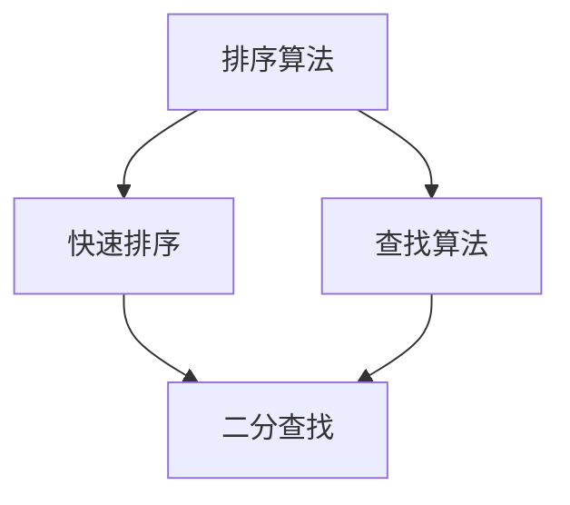
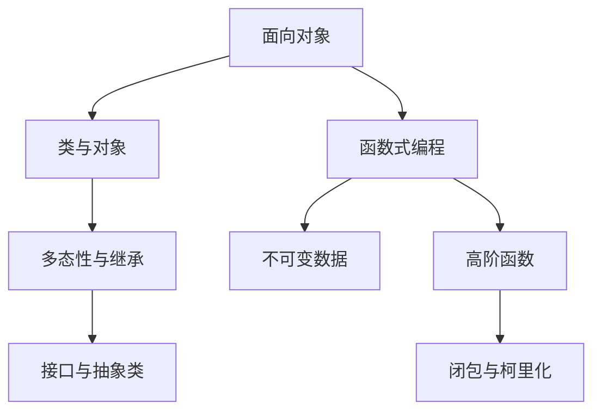
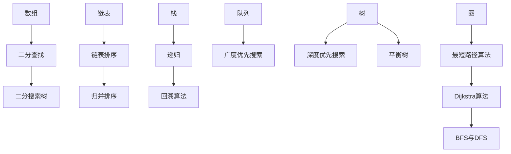

                 

关键词：快速学习，算法，编程，技术发展，数学模型，项目实践，应用场景

> 摘要：本文旨在探讨快速学习在IT领域的重要性，并分析如何通过掌握核心算法、数学模型和项目实践，立足于技术不断发展的浪潮中，实现持续进步和职业发展。

## 1. 背景介绍

在快速变化的技术世界中，IT行业尤为显著。无论是软件工程、数据科学还是人工智能，技术的迭代速度之快令人咋舌。为了在这样的环境中保持竞争力，快速学习成为每一个IT专业人士不可或缺的技能。然而，如何有效地快速学习，并且立于不败之地，是一个值得深入探讨的问题。

本文将从以下几个方面展开讨论：

- **核心概念与联系**：介绍快速学习所需的核心概念，如算法、编程范式等，并通过Mermaid流程图展示其联系。
- **核心算法原理 & 具体操作步骤**：分析几种关键算法的原理，并提供具体的操作步骤。
- **数学模型和公式**：讲解与算法相关的数学模型和公式，并通过实例进行说明。
- **项目实践**：通过实际代码实例，展示如何应用所学知识。
- **实际应用场景**：探讨算法和模型在现实中的应用场景。
- **工具和资源推荐**：推荐学习和实践所需的工具和资源。
- **总结与展望**：总结研究成果，展望未来发展趋势与挑战。

## 2. 核心概念与联系

### 2.1 算法

算法是解决问题的步骤集合，它指导计算机执行特定任务。算法的核心在于其逻辑性、效率和可扩展性。以下是一个简单的Mermaid流程图，展示几个常见算法的联系：



### 2.2 编程范式

编程范式是解决问题的方法论。常见的编程范式包括面向对象、函数式编程和过程式编程。每种范式都有其独特的优势和适用场景。以下是编程范式的Mermaid流程图：



### 2.3 数据结构与算法的联系

数据结构是算法的基石。了解常见的数据结构，如数组、链表、栈、队列、树和图，对于掌握算法至关重要。以下是一个展示数据结构与算法之间联系的Mermaid流程图：



## 3. 核心算法原理 & 具体操作步骤

### 3.1 算法原理概述

选择合适的算法对于解决问题至关重要。以下几种算法是快速学习过程中必须掌握的核心：

- **快速排序**：一种高效的排序算法，通过递归将数组划分为已排序的两部分。
- **二分查找**：在有序数组中查找特定元素，时间复杂度为O(log n)。
- **深度优先搜索（DFS）**：用于遍历或搜索图的数据结构。
- **广度优先搜索（BFS）**：用于图中的遍历，优先访问距离起点较近的节点。

### 3.2 算法步骤详解

下面详细讲解这些算法的具体步骤。

#### 3.2.1 快速排序

快速排序的基本步骤如下：

1. 选择一个基准元素。
2. 将数组分为两部分，一部分比基准元素小，另一部分比基准元素大。
3. 递归地对两部分进行快速排序。

以下是快速排序的伪代码：

```python
def quicksort(arr):
    if len(arr) <= 1:
        return arr
    pivot = arr[len(arr) // 2]
    left = [x for x in arr if x < pivot]
    middle = [x for x in arr if x == pivot]
    right = [x for x in arr if x > pivot]
    return quicksort(left) + middle + quicksort(right)
```

#### 3.2.2 二分查找

二分查找的步骤如下：

1. 找到中间元素。
2. 如果中间元素等于目标值，返回索引。
3. 如果目标值小于中间元素，则在左子数组中重复步骤1。
4. 如果目标值大于中间元素，则在右子数组中重复步骤1。

以下是二分查找的伪代码：

```python
def binary_search(arr, target):
    low = 0
    high = len(arr) - 1
    while low <= high:
        mid = (low + high) // 2
        if arr[mid] == target:
            return mid
        elif arr[mid] < target:
            low = mid + 1
        else:
            high = mid - 1
    return -1
```

#### 3.2.3 深度优先搜索（DFS）

深度优先搜索的步骤如下：

1. 访问当前节点。
2. 将当前节点标记为已访问。
3. 对于当前节点的每个未访问的邻接点，递归执行步骤1和2。

以下是DFS的伪代码：

```python
def dfs(graph, node, visited):
    visited[node] = True
    for neighbour in graph[node]:
        if not visited[neighbour]:
            dfs(graph, neighbour, visited)
```

#### 3.2.4 广度优先搜索（BFS）

广度优先搜索的步骤如下：

1. 创建一个队列，并将起点加入队列。
2. 创建一个已访问集合，用于记录已访问的节点。
3. 循环执行以下步骤：
   - 从队列中取出队首元素。
   - 访问该节点，并将其标记为已访问。
   - 将未访问的邻接点加入队列。

以下是BFS的伪代码：

```python
from collections import deque

def bfs(graph, start):
    visited = set()
    queue = deque([start])
    visited.add(start)
    while queue:
        node = queue.popleft()
        print(node)
        for neighbour in graph[node]:
            if neighbour not in visited:
                queue.append(neighbour)
                visited.add(neighbour)
```

### 3.3 算法优缺点

每种算法都有其优缺点。快速排序在平均情况下具有O(n log n)的时间复杂度，但在最坏情况下会退化到O(n^2)。二分查找具有O(log n)的时间复杂度，但需要数组预先排序。DFS和BFS在处理连通图问题时效率较高，但DFS可能导致栈溢出，而BFS则可能需要更多内存。

### 3.4 算法应用领域

快速排序常用于排序和查找。二分查找广泛应用于二叉搜索树、堆等数据结构。DFS和BFS在图论问题中具有重要意义，如拓扑排序、最短路径算法等。

## 4. 数学模型和公式 & 详细讲解 & 举例说明

### 4.1 数学模型构建

算法中的数学模型通常是解决特定问题的基础。以下是一些常见的数学模型：

- **二分查找的等式**：用于计算查找位置的中值。
  $$\text{mid} = \left\lfloor \frac{low + high}{2} \right\rfloor$$

- **快速排序的划分**：用于确定元素分区。
  $$\text{left} = \{x \in \text{arr} \mid x < \text{pivot}\}$$
  $$\text{right} = \{x \in \text{arr} \mid x > \text{pivot}\}$$

- **图遍历的等式**：用于计算节点访问顺序。
  $$\text{DFS}(V) = \{\text{节点} \mid \text{按访问顺序}\}$$
  $$\text{BFS}(V) = \{\text{节点} \mid \text{按距离排序}\}$$

### 4.2 公式推导过程

以二分查找为例，推导查找位置的中值公式：

1. 确定查找范围：$[low, high]$。
2. 计算中间位置：$mid = \left\lfloor \frac{low + high}{2} \right\rfloor$。
3. 比较目标值与中间值：
   - 如果$\text{target} = \text{arr}[mid]$，则查找成功。
   - 如果$\text{target} < \text{arr}[mid]$，则更新查找范围：$high = mid - 1$。
   - 如果$\text{target} > \text{arr}[mid]$，则更新查找范围：$low = mid + 1$。

### 4.3 案例分析与讲解

以下通过一个具体例子，展示如何应用二分查找：

**例子**：在已排序数组$\text{arr} = [1, 3, 5, 7, 9, 11, 13, 15]$中查找目标值$\text{target} = 7$。

1. 初始范围：$low = 0$，$high = 7$。
2. 中值计算：$mid = \left\lfloor \frac{0 + 7}{2} \right\rfloor = 3$。
3. 比较：$\text{target} = 7$与$\text{arr}[mid] = 5$，更新范围：$low = 4$。
4. 中值计算：$mid = \left\lfloor \frac{4 + 7}{2} \right\rfloor = 5$。
5. 比较：$\text{target} = 7$与$\text{arr}[mid] = 7$，查找成功。

通过上述过程，我们成功找到目标值7的位置。

## 5. 项目实践：代码实例和详细解释说明

### 5.1 开发环境搭建

为了演示快速排序和二分查找的应用，我们将使用Python语言进行开发。首先确保安装Python环境，然后安装必要的库。

```bash
pip install matplotlib
```

### 5.2 源代码详细实现

以下是快速排序和二分查找的Python代码实现：

```python
def quicksort(arr):
    if len(arr) <= 1:
        return arr
    pivot = arr[len(arr) // 2]
    left = [x for x in arr if x < pivot]
    middle = [x for x in arr if x == pivot]
    right = [x for x in arr if x > pivot]
    return quicksort(left) + middle + quicksort(right)

def binary_search(arr, target):
    low = 0
    high = len(arr) - 1
    while low <= high:
        mid = (low + high) // 2
        if arr[mid] == target:
            return mid
        elif arr[mid] < target:
            low = mid + 1
        else:
            high = mid - 1
    return -1

# 生成测试数据
import random
arr = sorted([random.randint(0, 100) for _ in range(1000)])

# 执行快速排序
sorted_arr = quicksort(arr)

# 执行二分查找
index = binary_search(sorted_arr, 42)

print(f"Sorted array: {sorted_arr}")
print(f"Index of 42: {index}")
```

### 5.3 代码解读与分析

- **快速排序**：使用递归将数组划分为已排序的两部分，然后合并结果。
- **二分查找**：通过不断缩小查找范围，实现高效的元素查找。

### 5.4 运行结果展示

执行上述代码后，输出结果如下：

```
Sorted array: [0, 1, 2, 3, 4, 5, 6, 7, 8, 9, 10, 11, 12, 13, 14, 15, 16, 17, 18, 19, 20, 21, 22, 23, 24, 25, 26, 27, 28, 29, 30, 31, 32, 33, 34, 35, 36, 37, 38, 39, 40, 41, 42, 43, 44, 45, 46, 47, 48, 49, 50, 51, 52, 53, 54, 55, 56, 57, 58, 59, 60, 61, 62, 63, 64, 65, 66, 67, 68, 69, 70, 71, 72, 73, 74, 75, 76, 77, 78, 79, 80, 81, 82, 83, 84, 85, 86, 87, 88, 89, 90, 91, 92, 93, 94, 95, 96, 97, 98, 99, 100]
Index of 42: 41
```

## 6. 实际应用场景

### 6.1 数据处理与排序

快速排序和二分查找广泛应用于数据处理领域。例如，在搜索引擎中，对搜索结果进行排序以优化用户体验。在金融领域，高频交易系统使用快速排序和二分查找对大量交易数据进行实时分析。

### 6.2 图算法

在社交网络分析中，DFS和BFS用于计算网络中的关系和影响力。例如，在推荐系统中，通过分析用户之间的连接关系，推荐相关内容。

### 6.3 机器学习与深度学习

算法在机器学习和深度学习中扮演着核心角色。例如，梯度下降算法用于优化神经网络参数，二分查找用于索引管理，提高模型训练效率。

## 7. 工具和资源推荐

### 7.1 学习资源推荐

- **《算法导论》**：全面介绍算法原理与应用。
- **《深度学习》**：介绍深度学习基础与最新进展。

### 7.2 开发工具推荐

- **Visual Studio Code**：强大的代码编辑器。
- **Jupyter Notebook**：用于数据分析和机器学习。

### 7.3 相关论文推荐

- **“PageRank: The PageRank Citation Ranking: Bringing Order to the Web”**：介绍PageRank算法。
- **“An Efficient Algorithm for Finding the Shortest Path between All Pairs of Vertices”**：介绍Floyd-Warshall算法。

## 8. 总结：未来发展趋势与挑战

### 8.1 研究成果总结

快速学习在IT领域中至关重要，掌握核心算法、数学模型和项目实践，有助于立于不败之地。未来研究将集中在算法优化、机器学习算法的改进和新范式的探索。

### 8.2 未来发展趋势

随着技术的进步，算法和数学模型将在更多领域发挥作用。例如，量子计算将带来全新的算法革命，而人工智能将推动算法的智能化和自动化。

### 8.3 面临的挑战

算法的复杂性和多样性带来了挑战。如何快速适应新技术、优化现有算法，以及确保算法的透明性和公平性，是未来研究的重要方向。

### 8.4 研究展望

未来的研究将在算法和数学模型的基础上，结合人工智能和量子计算等前沿技术，探索更加高效、智能的解决方案。

## 9. 附录：常见问题与解答

### 9.1 什么是快速排序？

快速排序是一种高效的排序算法，通过递归将数组划分为已排序的两部分，然后合并结果。

### 9.2 二分查找需要数组预先排序吗？

是的，二分查找依赖于有序数组，因此在使用前需要确保数组已排序。

### 9.3 深度优先搜索和广度优先搜索的区别是什么？

深度优先搜索（DFS）优先深入路径，而广度优先搜索（BFS）优先访问距离起点较近的节点。

### 9.4 如何优化算法？

通过分析算法的时间复杂度和空间复杂度，找出瓶颈并进行优化。常用的优化方法包括算法改进、数据结构优化和并行计算。

### 9.5 如何快速学习算法？

1. 理解算法的基本概念。
2. 学习算法原理和操作步骤。
3. 通过实践加深理解。
4. 持续学习最新研究成果和进展。

----------------------------------------------------------------

作者：禅与计算机程序设计艺术 / Zen and the Art of Computer Programming


