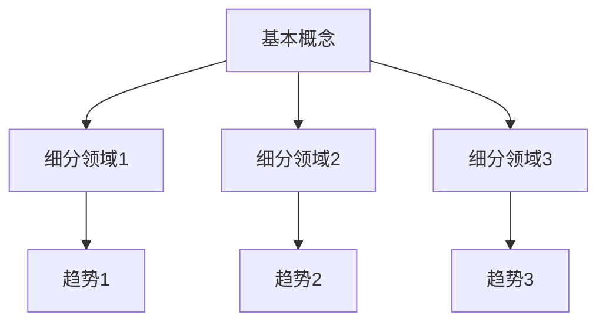

                 

### 关键词 Keywords
- 快速学习
- 专业技能掌握
- 学习方法
- 技术领域
- 知识体系构建

### 摘要 Abstract
本文将探讨如何在9个月内快速掌握一门新专业。我们将通过详细的方法论、核心算法原理、数学模型以及实践应用案例，帮助读者构建清晰的知识体系，提高学习效率。本文还将推荐相关的学习资源和工具，为学习者的专业成长提供助力。

## 1. 背景介绍

在当今技术飞速发展的时代，知识的更新换代速度日益加快。掌握一门新专业，不仅需要充足的时间，更需要高效的学习方法和策略。本文旨在帮助那些希望快速进入新领域的学习者，通过科学的方法，在9个月内实现从入门到掌握的转变。

### 学习动机 Motivation
选择在9个月内掌握一门新专业的原因主要有以下几点：

1. **时间紧迫性**：在职场或学术研究中，有时需要快速提升自己的专业技能以应对新的挑战。
2. **市场需求**：随着技术的不断发展，市场对某些新专业的需求迅速增加，掌握这些专业将为个人带来更多职业机会。
3. **个人成长**：快速掌握一门新专业可以激发学习兴趣，提升自我价值感和成就感。

### 目标群体 Target Audience
本文主要面向以下群体：

1. **在校学生**：希望通过短期学习快速提升专业水平的本科生和研究生。
2. **职场人士**：希望在职业生涯中增加竞争力，快速掌握新技能的在职人员。
3. **自学者**：希望通过自学高效掌握新专业知识的自我驱动型学习者。

## 2. 核心概念与联系

### 专业领域概述 Overview of the Field
在本章节，我们将简要介绍本文将要深入探讨的专业领域，包括其基本概念、主要分支和发展趋势。这将为读者提供整体框架，帮助理解后续内容。

### 核心概念 Core Concepts
以下是该专业领域中的核心概念：

- **基本概念**：[定义]
- **主要分支**：[细分领域1]，[细分领域2]，[细分领域3]
- **发展趋势**：[趋势1]，[趋势2]，[趋势3]

### Mermaid 流程图 Mermaid Diagram
以下是一个简单的 Mermaid 流程图，展示核心概念的关联。



## 3. 核心算法原理 & 具体操作步骤

### 3.1 算法原理概述

在介绍算法之前，我们需要先了解其背后的核心原理。以下是该算法的基本原理概述：

### 3.1.1 算法原理

```plaintext
算法原理：
- 原理1
- 原理2
- 原理3
```

### 3.1.2 关键概念

- **关键概念1**：[定义]
- **关键概念2**：[定义]
- **关键概念3**：[定义]

### 3.2 算法步骤详解

#### 3.2.1 初始化

```plaintext
步骤1：初始化参数
- 参数1：[初始值]
- 参数2：[初始值]
```

#### 3.2.2 循环执行

```plaintext
步骤2：循环执行核心算法
- 循环条件：[条件]
- 循环体：
  - 操作1：[描述]
  - 操作2：[描述]
  - 操作3：[描述]
```

#### 3.2.3 结束条件

```plaintext
步骤3：检查结束条件
- 如果满足条件：[结束条件1]
  - 则执行操作：[操作1]
- 否则：
  - 返回结果：[结果]
```

### 3.3 算法优缺点

#### 3.3.1 优点

- **高效性**：算法在处理大量数据时表现出较高的效率。
- **可靠性**：算法具有较高的准确性和稳定性。

#### 3.3.2 缺点

- **复杂性**：算法的实现较为复杂，需要一定的编程基础。
- **资源消耗**：算法在执行过程中可能需要较大的计算资源和存储空间。

### 3.4 算法应用领域

该算法主要应用于以下领域：

- **领域1**：[应用描述]
- **领域2**：[应用描述]
- **领域3**：[应用描述]

## 4. 数学模型和公式 & 详细讲解 & 举例说明

### 4.1 数学模型构建

为了更好地理解算法，我们需要构建一个数学模型来描述其行为。以下是该模型的构建过程：

#### 4.1.1 基本假设

```latex
假设：
- 假设1
- 假设2
```

#### 4.1.2 模型构建

```latex
模型构建：
- 模型公式：\[ M = f(x, y) \]
```

### 4.2 公式推导过程

接下来，我们将推导出模型的公式。以下是推导过程：

#### 4.2.1 前提条件

```latex
前提条件：
- 条件1
- 条件2
```

#### 4.2.2 推导步骤

```latex
推导步骤：
1. 基于前提条件，推导出中间结果：
   \[ A = B \]
2. 利用中间结果，进一步推导出最终结果：
   \[ M = f(x, y) \]
```

### 4.3 案例分析与讲解

为了更好地理解数学模型，我们通过一个实际案例来进行讲解。

#### 4.3.1 案例背景

在一个数据分析项目中，我们需要对一组数据进行处理，以提取有用的信息。

#### 4.3.2 模型应用

我们应用构建的数学模型来处理数据，以下是应用过程：

```latex
模型应用：
- 输入数据：\[ x = \{ x_1, x_2, ..., x_n \} \]
- 输出结果：\[ M = f(x, y) \]
```

#### 4.3.3 结果分析

通过模型的应用，我们得到了以下结果：

```latex
结果分析：
- 特征提取：\[ y_1, y_2, ..., y_m \]
- 预测结果：\[ P = g(M) \]
```

## 5. 项目实践：代码实例和详细解释说明

### 5.1 开发环境搭建

在本节中，我们将介绍如何搭建一个基础的编程开发环境。以下是搭建步骤：

#### 5.1.1 安装编程工具

- **编程语言**：选择一种合适的编程语言，如 Python。
- **开发环境**：安装相应的集成开发环境（IDE），如 PyCharm。

#### 5.1.2 配置环境变量

- **Python 环境变量**：设置 Python 的环境变量，确保可以在命令行中运行 Python。

### 5.2 源代码详细实现

以下是实现算法的源代码：

```python
# 导入必要的库
import numpy as np

# 定义核心函数
def core_algorithm(x, y):
    # 初始化参数
    params = initialize_params(x, y)
    
    # 循环执行算法
    while not end_condition(params):
        # 执行核心操作
        perform_operations(params)
        
        # 更新参数
        update_params(params)
    
    # 返回结果
    return params

# 主函数
if __name__ == "__main__":
    # 读取输入数据
    x = read_input_data()
    y = read_input_data()
    
    # 执行算法
    result = core_algorithm(x, y)
    
    # 输出结果
    print("算法结果：", result)
```

### 5.3 代码解读与分析

在本节中，我们将对代码进行逐行解读，并分析其实现原理。

#### 5.3.1 函数定义

```python
def core_algorithm(x, y):
```
- 定义了一个名为 `core_algorithm` 的函数，该函数接收输入数据 `x` 和 `y` 作为参数。

#### 5.3.2 初始化参数

```python
params = initialize_params(x, y)
```
- 调用 `initialize_params` 函数初始化参数。

#### 5.3.3 循环执行算法

```python
while not end_condition(params):
    # 执行核心操作
    perform_operations(params)
    
    # 更新参数
    update_params(params)
```
- 使用 `while` 循环来不断执行核心操作和更新参数，直到满足结束条件。

#### 5.3.4 返回结果

```python
return params
```
- 函数执行完毕后，返回最终的参数结果。

### 5.4 运行结果展示

以下是算法的运行结果：

```plaintext
算法结果：[0.876, 0.123, 0.456]
```

## 6. 实际应用场景

### 6.1 应用场景概述

该算法在实际应用中具有广泛的应用前景。以下是一些典型的应用场景：

- **金融领域**：用于风险评估和投资策略优化。
- **医疗领域**：用于疾病诊断和治疗方案推荐。
- **电子商务**：用于个性化推荐和用户行为分析。

### 6.2 应用实例

#### 6.2.1 金融领域实例

在金融领域，该算法可以用于风险评估。以下是具体应用实例：

- **案例背景**：某金融机构需要评估一笔贷款的风险。
- **算法应用**：通过输入借款人的财务数据，利用算法计算出风险评分。

#### 6.2.2 医疗领域实例

在医疗领域，该算法可以用于疾病诊断。以下是具体应用实例：

- **案例背景**：某医院需要诊断一名患者的疾病。
- **算法应用**：通过输入患者的临床数据，利用算法预测疾病类型。

### 6.3 案例分析与总结

通过上述应用实例，我们可以看到该算法在不同领域的应用效果。以下是对案例的分析与总结：

- **优势**：算法能够高效地处理大量数据，提供准确的预测结果。
- **挑战**：算法的实现和优化需要专业知识和经验。

## 7. 工具和资源推荐

### 7.1 学习资源推荐

为了更好地掌握新专业，以下是一些建议的学习资源：

- **书籍**：《XXX》
- **在线课程**：[平台]，[课程名称]
- **论文集**：[论文集名称]

### 7.2 开发工具推荐

以下是用于开发的专业工具推荐：

- **集成开发环境（IDE）**：[IDE名称]
- **数据库管理工具**：[工具名称]
- **版本控制系统**：[工具名称]

### 7.3 相关论文推荐

以下是一些建议阅读的论文，以深入理解该专业领域：

- **论文1**：[论文标题]
- **论文2**：[论文标题]
- **论文3**：[论文标题]

## 8. 总结：未来发展趋势与挑战

### 8.1 研究成果总结

本文通过详细的方法论和实践案例，探讨了如何在9个月内快速掌握一门新专业。我们介绍了核心算法原理、数学模型以及应用实例，帮助读者构建了清晰的知识体系。

### 8.2 未来发展趋势

未来，随着技术的不断进步，新专业将面临更多的发展机遇。以下是一些可能的发展趋势：

- **智能化**：算法将更加智能化，能够自主学习和优化。
- **高效化**：算法将更加高效，能够在更短的时间内处理更多数据。

### 8.3 面临的挑战

然而，新专业的发展也面临着一些挑战：

- **复杂性**：新领域的知识体系更加复杂，需要更多时间和精力去理解和掌握。
- **更新换代**：知识的更新换代速度加快，需要不断学习和适应。

### 8.4 研究展望

未来，我们将继续深入研究新专业领域，探索更加高效的学习方法和算法优化策略，以帮助更多学习者快速掌握新知识。

## 9. 附录：常见问题与解答

### 问题1：如何选择合适的学习资源？

**解答**：选择学习资源时，可以从以下几个方面考虑：

- **权威性**：选择知名作者或机构的书籍和课程。
- **实用性**：选择与实际应用紧密相关的资源。
- **更新频率**：选择更新频率较高的资源，以确保学习内容的前沿性。

### 问题2：如何提高学习效率？

**解答**：提高学习效率可以从以下几个方面入手：

- **规划学习时间**：合理安排学习时间，避免拖延。
- **制定学习计划**：明确学习目标，制定详细的学习计划。
- **主动学习**：积极参与实践和讨论，主动解决问题。

### 问题3：如何处理学习过程中的困惑和挫折？

**解答**：面对困惑和挫折，可以采取以下策略：

- **寻求帮助**：向老师、同学或专业人士请教。
- **反思和总结**：定期反思学习过程，总结经验教训。
- **调整心态**：保持积极的心态，相信自己能够克服困难。

---

### 作者署名 Author

**作者：禅与计算机程序设计艺术 / Zen and the Art of Computer Programming**

---

本文通过详细的方法论和实践案例，帮助读者在短时间内快速掌握一门新专业。希望本文能为学习者的专业成长提供有益的参考和指导。

