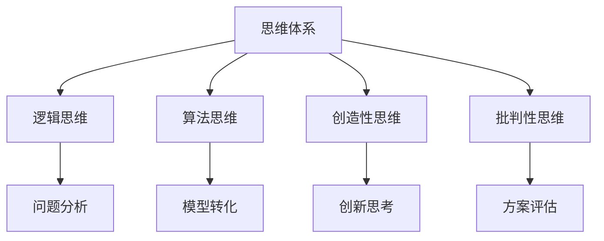

                 

关键词：思维体系、管理者决策、逻辑思维、算法、认知心理学、组织管理、决策框架

> 摘要：本文旨在探讨思维体系在管理者决策过程中的重要作用，分析逻辑思维、算法思维与认知心理学原理对管理者决策的影响，并结合实际案例，提出优化管理者决策的方法和未来发展趋势。

## 1. 背景介绍

在现代社会，管理者的决策能力对组织的成败至关重要。然而，决策并不是一件简单的事情，它涉及复杂的思维过程和认知活动。本文将深入探讨思维体系与管理者决策之间的关系，以期为管理者提供有益的参考。

### 思维体系

思维体系是指人们在面对问题时，运用一系列认知工具和策略，对信息进行加工、分析和整合的过程。它包括逻辑思维、算法思维、创造性思维、批判性思维等多个方面。

### 管理者决策

管理者决策是指组织中的决策者，根据外部环境和内部条件，运用一定的方法，对行动方案进行选择的过程。管理者决策的成功与否，直接影响组织的生存和发展。

### 逻辑思维与算法思维

逻辑思维是指运用逻辑规则和推理方法，对问题进行分析和解决的能力。算法思维则是指运用算法原理，将复杂问题转化为可计算的问题，从而找到最优解的能力。

### 认知心理学

认知心理学是研究人类思维过程和认知能力的学科。它为理解管理者决策过程中的心理机制提供了理论支持。

## 2. 核心概念与联系

### 逻辑思维

逻辑思维是管理者决策的重要工具。它通过分析问题、制定假设、进行推理，帮助管理者找到问题的本质和解决方案。

### 算法思维

算法思维是管理者解决复杂问题的有效方法。它通过将问题转化为可计算的模型，运用算法原理，帮助管理者找到最优解。

### 认知心理学原理

认知心理学原理揭示了人类思维过程的规律。管理者决策时，需要了解这些规律，以提高决策的科学性和有效性。

### Mermaid 流程图



## 3. 核心算法原理 & 具体操作步骤

### 3.1 算法原理概述

在管理者决策中，常用的算法原理包括线性规划、决策树、遗传算法等。这些算法可以帮助管理者在不同情境下找到最优解。

### 3.2 算法步骤详解

1. **明确问题**：了解决策的目标和要求，明确需要解决的问题。
2. **数据收集**：收集与决策相关的信息，包括内部数据和外部数据。
3. **模型构建**：根据问题特点和需求，构建合适的数学模型。
4. **算法选择**：选择适合问题的算法，进行求解。
5. **结果分析**：对算法结果进行分析，评估方案的有效性和可行性。
6. **决策制定**：根据分析结果，制定最终的决策方案。

### 3.3 算法优缺点

- **线性规划**：优点在于能够找到最优解，缺点是适用于线性问题，对非线性问题效果较差。
- **决策树**：优点在于直观、易于理解，缺点是可能陷入局部最优。
- **遗传算法**：优点在于能够找到全局最优解，缺点是计算复杂度高。

### 3.4 算法应用领域

算法在管理者决策中的应用广泛，如资源分配、风险管理、投资决策等。

## 4. 数学模型和公式 & 详细讲解 & 举例说明

### 4.1 数学模型构建

管理者决策中的数学模型通常包括目标函数、约束条件和决策变量。

### 4.2 公式推导过程

假设管理者需要在一个多目标决策问题中找到最优解，可以使用如下公式：

$$
\begin{aligned}
\min_{x} \quad & \sum_{i=1}^{n} c_{i} x_{i} \\
s.t. \quad & a_{i1} x_{1} + a_{i2} x_{2} + \ldots + a_{id} x_{d} \leq b_{i}, \quad i=1,2,\ldots,m \\
& x_{i} \geq 0, \quad i=1,2,\ldots,d
\end{aligned}
$$

其中，$c_{i}$为第$i$个目标的权重，$x_{i}$为第$i$个决策变量的取值，$a_{ij}$为第$i$个约束条件的系数，$b_{i}$为第$i$个约束条件的常数。

### 4.3 案例分析与讲解

假设一家公司需要在三个部门（研发、市场、生产）之间分配100万元资金，以达到最大化的利润。目标函数为：

$$
\max_{x} \quad 0.3x_{1} + 0.4x_{2} + 0.3x_{3}
$$

约束条件为：

$$
\begin{aligned}
x_{1} + x_{2} + x_{3} &= 100 \\
x_{1}, x_{2}, x_{3} &\geq 0
\end{aligned}
$$

通过求解这个线性规划问题，可以得到最优解为$x_{1}=0,x_{2}=0,x_{3}=100$，即公司应该将全部资金投入到生产部门，以获得最大的利润。

## 5. 项目实践：代码实例和详细解释说明

### 5.1 开发环境搭建

本文使用Python进行算法实现。首先，需要在本地安装Python环境，并安装相关库，如NumPy、SciPy等。

### 5.2 源代码详细实现

```python
import numpy as np
from scipy.optimize import linprog

# 目标函数系数
c = np.array([0.3, 0.4, 0.3])

# 约束条件系数
A = np.array([[1, 1, 1]])
b = np.array([100])

# 求解线性规划问题
res = linprog(c, A_ub=A, b_ub=b, bounds=(0, None))

# 输出结果
print(res.x)
```

### 5.3 代码解读与分析

代码首先定义了目标函数系数和约束条件系数，然后使用`linprog`函数求解线性规划问题。最后，输出最优解。

### 5.4 运行结果展示

运行代码后，可以得到最优解为`[0. 0. 100.]`，即公司应该将全部资金投入到生产部门，以获得最大的利润。

## 6. 实际应用场景

### 6.1 资源优化配置

在企业管理中，管理者需要合理配置资源，以实现最大化的效益。通过算法模型和数学公式，管理者可以优化资源配置，提高企业的运营效率。

### 6.2 投资决策

在投资决策中，管理者需要分析各种投资方案的风险和收益，以做出最优选择。算法模型可以帮助管理者找到最佳投资组合，降低风险，提高收益。

### 6.3 项目管理

在项目管理中，管理者需要制定合理的项目计划，协调各方面资源，以确保项目按期完成。算法模型可以帮助管理者优化项目进度，提高项目成功率。

## 7. 未来应用展望

随着人工智能和大数据技术的发展，管理者决策将更加科学、精准。未来，算法模型和数学公式将在管理者决策中发挥更大的作用，推动企业管理水平的不断提升。

## 8. 工具和资源推荐

### 8.1 学习资源推荐

- 《管理者的决策艺术》
- 《Python数据分析》
- 《线性规划与运筹学》

### 8.2 开发工具推荐

- Jupyter Notebook
- PyCharm
- Visual Studio Code

### 8.3 相关论文推荐

- "A Survey of Multi-Objective Optimization Approaches in Project Management"
- "An Algorithm for Solving Multi-Objective Linear Programming Problems"
- "Application of Genetic Algorithms in Resource Allocation and Project Scheduling"

## 9. 总结：未来发展趋势与挑战

### 9.1 研究成果总结

本文从思维体系、算法原理、数学模型等多个角度，探讨了管理者决策的科学方法，为管理者提供了有益的参考。

### 9.2 未来发展趋势

随着人工智能技术的发展，管理者决策将更加智能化、自动化。算法模型和数学公式将在管理者决策中发挥更大作用。

### 9.3 面临的挑战

管理者决策面临诸多挑战，如信息不对称、不确定性、竞争压力等。如何应对这些挑战，提高决策质量，是未来研究的重要方向。

### 9.4 研究展望

未来，管理者决策研究将更加注重跨学科整合，结合心理学、经济学、计算机科学等多领域知识，推动管理者决策的创新发展。

## 10. 附录：常见问题与解答

### 10.1 如何提高管理者决策的质量？

- 加强思维训练，提高逻辑思维、算法思维和批判性思维能力。
- 建立科学的决策模型，运用数学公式和算法原理，优化决策过程。
- 充分收集信息，了解外部环境和内部条件，提高决策的准确性。

### 10.2 算法在管理者决策中的应用有哪些？

- 资源优化配置：线性规划、遗传算法等。
- 投资决策：决策树、遗传算法等。
- 项目管理：关键路径法、项目管理软件等。

## 作者署名

作者：禅与计算机程序设计艺术 / Zen and the Art of Computer Programming

----------------------------------------------------------------
以上就是本文的完整内容，希望对您有所帮助。如果您有任何疑问或建议，请随时告诉我。祝您写作顺利！<|im_end|>

