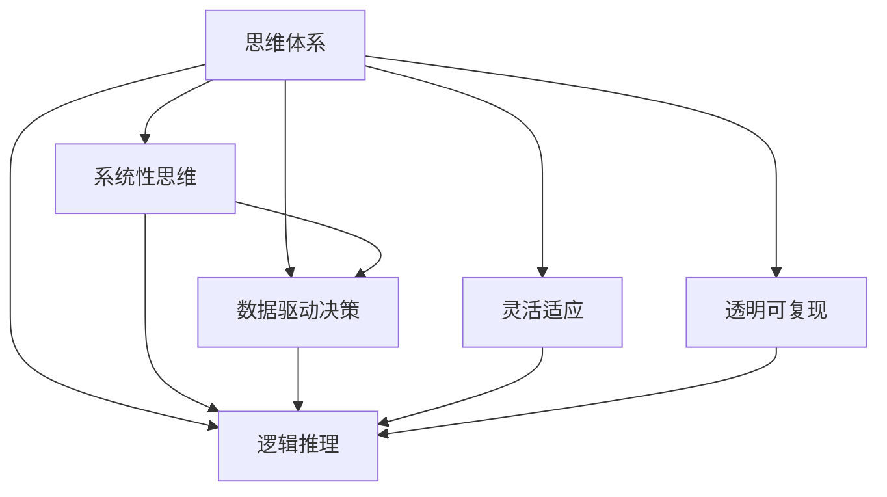

                 

## 1. 背景介绍

### 1.1 问题由来

在当今快速变化的商业环境中，管理者面临着日益复杂的决策问题。从市场扩展到运营优化，从产品创新到员工管理，每一项决策都直接影响着企业的成败。因此，构建一套科学、高效的思维体系，成为管理者提升决策质量的关键。然而，传统决策方法往往依赖直觉和经验，缺乏系统性和可复现性，难以应对多变的市场环境。

### 1.2 问题核心关键点

管理者决策质量的高低，与他们的思维体系密切相关。一个有效的思维体系应具备以下特点：

- **系统性**：能够对决策问题进行全面的分析，涵盖多角度和多层级。
- **数据驱动**：基于可靠的数据和事实，而非凭直觉决策。
- **逻辑严密**：运用严密的逻辑推理，排除情绪和偏见。
- **灵活应变**：能够快速适应市场变化，做出及时调整。
- **透明可复现**：决策过程应透明、可复现，便于事后分析和改进。

本文将围绕这些核心点，探讨如何构建和管理者的思维体系，以提升决策质量。

## 2. 核心概念与联系

### 2.1 核心概念概述

为了更好地理解管理者思维体系与决策质量的关系，我们需要介绍几个关键概念：

- **思维体系**：指管理者用于分析和解决问题的思维框架和逻辑结构。包括问题定义、信息搜集、分析评估、决策制定、执行反馈等多个环节。
- **决策质量**：指管理者在特定情境下做出决策的正确性和有效性。衡量标准包括但不限于目标达成、资源利用效率、风险控制等。
- **系统性思维**：指将问题视为一个系统，全面考虑内部各部分和外部环境之间的关系。
- **数据驱动决策**：基于客观数据和分析结果，而非主观判断做出决策。
- **逻辑推理**：运用形式逻辑和归纳推理，确保决策的严密性和准确性。
- **灵活适应**：根据环境变化灵活调整决策策略，保持系统活力。
- **透明可复现**：保证决策过程的透明度和可重复性，便于追溯和改进。

这些概念之间的逻辑关系可以通过以下Mermaid流程图来展示：



该流程图展示了思维体系如何通过不同的维度和方法，提升决策质量。

## 3. 核心算法原理 & 具体操作步骤

### 3.1 算法原理概述

管理者思维体系的构建和优化，本质上是针对决策质量的系统优化问题。其目标是通过调整思维体系中的各个环节，最大程度地提升决策质量。

具体而言，管理者思维体系的构建包括：
1. **问题定义**：明确决策目标和约束条件。
2. **信息搜集**：获取与决策相关的数据和信息。
3. **分析评估**：运用系统性思维和多维分析方法，评估不同方案的优劣。
4. **决策制定**：结合逻辑推理，选择最优决策方案。
5. **执行反馈**：跟踪决策执行结果，根据反馈进行调整和改进。

### 3.2 算法步骤详解

管理者思维体系的构建和优化，涉及多个步骤，以下将详细介绍：

**Step 1: 问题定义**
- 明确决策目标：明确决策目标和关键绩效指标（KPI）。
- 确定决策边界：确定决策的范围和约束条件。
- 分解问题：将大问题分解为可操作的子问题，便于系统分析。

**Step 2: 信息搜集**
- 识别关键数据源：确定哪些数据对决策有重要影响。
- 收集和整理数据：从内部和外部数据源中收集相关数据，并进行整理和清洗。
- 数据可视化：利用图表、仪表盘等工具，直观展示关键数据。

**Step 3: 分析评估**
- 多维度分析：运用不同维度（如时间、空间、成本等）分析问题。
- 系统性思维：考虑内部各部分和外部环境之间的关系。
- 量化评估：通过数学模型和统计分析，量化评估不同方案的优劣。
- 敏感性分析：评估决策对关键变量的敏感性，识别风险点。

**Step 4: 决策制定**
- 建立决策框架：选择合适的决策模型和逻辑推理方法。
- 方案比较：对比不同方案的优劣，选择最优方案。
- 决策优化：综合考虑多因素，进行决策优化。

**Step 5: 执行反馈**
- 实施决策：将决策方案付诸实施。
- 监控执行：实时监控决策执行情况。
- 反馈调整：根据执行结果和反馈进行调整和改进。

### 3.3 算法优缺点

构建和管理者的思维体系，提升决策质量，具有以下优点：
1. **系统性**：全面分析问题，减少遗漏和偏见。
2. **数据驱动**：基于客观数据，减少主观判断误差。
3. **逻辑严密**：运用逻辑推理，提升决策准确性。
4. **灵活适应**：能够快速调整，适应市场变化。
5. **透明可复现**：保证决策过程的透明度和可重复性，便于事后分析和改进。

同时，该方法也存在一些局限性：
1. **数据获取难度**：高质量数据的获取成本较高，可能影响决策过程。
2. **复杂性**：系统性思维和逻辑推理增加了决策过程的复杂度。
3. **执行难度**：决策实施和监控需要协调多个部门，可能面临执行障碍。
4. **反馈延迟**：决策效果可能存在延迟，影响快速调整。

尽管存在这些局限性，但就目前而言，构建系统化的思维体系，运用数据驱动和逻辑推理的决策方法，是提升管理者决策质量的有效途径。

### 3.4 算法应用领域

基于系统性思维和数据驱动的决策方法，在多个领域得到了广泛应用，例如：

- **企业管理**：用于企业战略规划、运营优化、资源分配等。
- **市场分析**：用于市场趋势预测、竞争分析、客户需求挖掘等。
- **项目管理**：用于项目规划、进度监控、风险管理等。
- **产品开发**：用于新产品构思、设计、测试等。
- **人力资源管理**：用于招聘、培训、绩效评估等。

除了这些经典应用外，基于系统性思维和数据驱动的决策方法，还将被更多创新领域采用，如智慧城市、智能制造、金融风险管理等，推动决策过程的科学化和智能化。

## 4. 数学模型和公式 & 详细讲解

### 4.1 数学模型构建

管理者决策过程，涉及多个环节和数据源，因此可以构建数学模型来描述和分析决策过程。

假设决策问题可以用以下结构表示：
- $P$：决策目标和关键绩效指标。
- $D$：决策所涉及的关键数据和信息。
- $A$：决策过程中的多维度分析方法。
- $C$：不同决策方案。
- $F$：决策执行和反馈。

决策过程可以用以下数学模型描述：
$$
\max \sum_{i=1}^n w_i f_i(C_i) \\
\text{s.t.} \quad A(D, P, C) \leq T
$$

其中：
- $w_i$ 表示各决策指标的权重。
- $f_i(C_i)$ 表示第 $i$ 个方案的第 $f$ 个指标的评分。
- $A(D, P, C)$ 表示决策分析过程，需要考虑数据、目标和方案之间的关系。
- $T$ 表示决策的约束条件。

### 4.2 公式推导过程

以上数学模型中，决策分析过程 $A(D, P, C)$ 是一个复杂的函数，需要通过实际案例来详细推导。以下以企业投资决策为例，进行公式推导：

假设某企业考虑投资新项目，决策目标为最大化收益 $R$。决策过程中需要考虑多个因素，如市场潜力 $M$、技术风险 $T$、资本需求 $C$ 等。根据历史数据，可以建立如下线性模型：

$$
R = \alpha M + \beta T + \gamma C + \epsilon
$$

其中，$\alpha$、$\beta$、$\gamma$ 为模型系数，$\epsilon$ 为随机误差项。

通过对该模型进行优化，可以求得最优投资策略，即：

$$
\max \alpha M + \beta T + \gamma C \\
\text{s.t.} \quad C \leq C_{\max}
$$

其中，$C_{\max}$ 表示企业可投资的最大资本量。

通过求解上述优化问题，可以得到最优投资方案。

### 4.3 案例分析与讲解

以某科技公司投资新项目为例，详细分析决策过程：

**问题定义**：公司计划投资一个新项目，目标是最大化项目的净现值（NPV），同时不超过公司可投资的最大金额。

**信息搜集**：公司收集了市场潜力、技术风险、资本需求等关键数据，并进行初步分析。

**分析评估**：运用线性模型对数据进行分析，评估不同投资方案的收益和风险。

**决策制定**：根据模型结果，选择最优投资方案。

**执行反馈**：跟踪投资项目进展，根据反馈进行调整和改进。

通过这一系列步骤，公司能够在充分分析数据和市场情况的基础上，做出科学合理的投资决策。

## 5. 项目实践：代码实例和详细解释说明

### 5.1 开发环境搭建

在进行决策模型开发前，需要先搭建开发环境。以下是使用Python进行Pandas、Scikit-learn等库的开发环境配置流程：

1. 安装Anaconda：从官网下载并安装Anaconda，用于创建独立的Python环境。

2. 创建并激活虚拟环境：
```bash
conda create -n decision-env python=3.8 
conda activate decision-env
```

3. 安装相关库：
```bash
conda install pandas numpy scikit-learn matplotlib tqdm jupyter notebook ipython
```

完成上述步骤后，即可在`decision-env`环境中开始决策模型开发。

### 5.2 源代码详细实现

下面以企业投资决策为例，给出使用Pandas和Scikit-learn进行决策模型开发的代码实现。

首先，定义决策问题的关键数据：

```python
import pandas as pd
from sklearn.linear_model import LinearRegression

# 投资项目数据
project_data = pd.read_csv('project_data.csv')
```

然后，建立投资决策的线性模型：

```python
# 定义决策目标和关键数据
target = 'NPV'
features = ['MarketPotential', 'TechnicalRisk', 'CapitalDemand']

# 构建线性模型
model = LinearRegression()
model.fit(project_data[features], project_data[target])
```

接着，定义决策问题的约束条件：

```python
# 定义可投资的最大资本量
max_capital = 100000000

# 获取最优投资方案
optimal_investment = project_data[features].min() - max_capital
optimal_investment
```

最后，根据决策模型结果，选择最优投资方案：

```python
# 根据模型结果，选择最优投资方案
optimal_investment = model.predict(project_data[features])
optimal_investment
```

以上就是使用Pandas和Scikit-learn进行企业投资决策模型开发的完整代码实现。可以看到，借助这些库，决策模型的开发和实现变得相对简单和高效。

### 5.3 代码解读与分析

让我们再详细解读一下关键代码的实现细节：

**项目数据处理**：
- 使用Pandas读取投资项目数据，并提取关键特征。

**线性模型建立**：
- 定义决策目标和关键数据。
- 构建线性模型，并通过训练数据拟合模型参数。

**决策约束处理**：
- 定义可投资的最大资本量。
- 根据模型结果，计算最优投资方案。

**决策方案选择**：
- 使用模型预测最优投资方案。

通过这一系列步骤，管理者可以基于数据和模型，科学地制定决策方案，提升决策质量。

## 6. 实际应用场景

### 6.1 企业投资决策

在企业投资决策中，基于系统性思维和数据驱动的方法，可以帮助企业科学评估投资机会，避免盲目决策。具体应用包括：

- **市场潜力评估**：利用市场调研数据，评估市场规模和增长潜力，识别高回报的投资机会。
- **技术风险分析**：通过技术评估和专利分析，识别技术风险和可行性，确保技术创新成功。
- **资本需求计算**：根据项目需求和市场规模，计算所需资本量，控制投资风险。

### 6.2 市场趋势预测

在市场趋势预测中，基于数据驱动的决策方法，可以帮助企业及时调整市场策略。具体应用包括：

- **需求预测**：通过历史销售数据和市场调查，预测未来市场需求变化。
- **竞争分析**：分析竞争对手的策略和市场表现，识别市场机会和威胁。
- **价格优化**：根据市场供需关系和竞争态势，优化产品价格策略，提升市场竞争力。

### 6.3 项目进度监控

在项目进度监控中，基于系统性思维和透明可复现的决策方法，可以帮助企业及时发现问题并调整策略。具体应用包括：

- **项目进度跟踪**：利用项目管理工具，实时跟踪项目进展和关键里程碑。
- **资源优化**：根据项目需求和进度，优化资源分配和利用，提高项目效率。
- **风险预警**：根据项目数据和历史经验，识别潜在的风险点，提前采取应对措施。

### 6.4 未来应用展望

随着数据驱动决策方法的发展，基于系统性思维和数据驱动的决策系统将广泛应用，推动决策过程的科学化和智能化。

在智慧城市治理中，决策系统可以用于智能交通管理、公共服务优化、城市规划设计等，提升城市管理的效率和智能化水平。

在智能制造领域，决策系统可以用于生产流程优化、设备维护管理、供应链优化等，提升制造业的智能化和自动化水平。

在金融风险管理中，决策系统可以用于信用评估、风险预警、投资组合管理等，提升金融市场的稳定性和透明度。

此外，在更多领域，基于数据驱动和系统性思维的决策方法也将得到应用，推动各行各业实现智能化转型。

## 7. 工具和资源推荐

### 7.1 学习资源推荐

为了帮助管理者掌握系统性思维和数据驱动的决策方法，以下是几款优质的学习资源：

1. 《系统性思维与决策》系列书籍：系统介绍系统性思维的理论基础和实践应用，提供丰富的案例分析。
2. 《数据驱动的决策》在线课程：介绍数据驱动决策的原理和方法，适合初学者和中级管理者。
3. 《企业决策分析》课程：涵盖企业决策的各个环节，包括问题定义、信息搜集、分析评估、决策制定等。
4. 《决策模型与算法》学术论文：介绍多种决策模型的原理和应用，帮助管理者理解和应用决策方法。
5. 《复杂系统建模》课程：介绍复杂系统的建模方法和工具，帮助管理者构建系统性思维框架。

通过对这些资源的学习，管理者可以系统掌握系统性思维和数据驱动的决策方法，提升决策质量。

### 7.2 开发工具推荐

高效的管理者决策系统开发，离不开优秀的工具支持。以下是几款常用的决策系统开发工具：

1. Python：基于Python的决策系统开发环境，具有丰富的数据处理和建模库。
2. R语言：适合统计分析和建模，支持多种决策模型和算法。
3. Tableau：数据可视化工具，帮助管理者直观展示关键数据和分析结果。
4. Jupyter Notebook：支持代码编写和交互式分析，便于管理者快速迭代和优化决策模型。
5. Microsoft Power BI：实时数据监控和分析工具，适合大型企业的决策系统部署。

合理利用这些工具，可以显著提升管理者决策系统的开发效率，加快决策方法的创新迭代。

### 7.3 相关论文推荐

系统性思维和数据驱动决策方法的发展，源于学界的持续研究。以下是几篇奠基性的相关论文，推荐阅读：

1. "Thinking, Fast and Slow" by Daniel Kahneman：介绍人类思维的两种模式及其对决策的影响。
2. "Decision Making: Theory and Practice" by Walter Klein：系统介绍决策理论的各个环节和模型。
3. "Data-Driven Decision Making" by George Mason University：介绍数据驱动决策的原理和应用。
4. "System Thinking for a Sustainable Future" by Peter Senge：系统介绍系统性思维的理论基础和实践应用。
5. "Modeling Decision Making with Markov Decision Processes" by Richard S. Sutton：介绍马尔科夫决策过程在决策中的应用。

这些论文代表了大数据驱动决策方法的发展脉络，帮助管理者理解和应用决策模型和工具。

## 8. 总结：未来发展趋势与挑战

### 8.1 总结

本文对系统性思维和数据驱动的决策方法进行了全面系统的介绍。首先阐述了决策质量与管理者思维体系的关系，明确了决策体系的系统性、数据驱动性和逻辑严密性等特点。其次，从原理到实践，详细讲解了决策体系的构建和优化步骤，给出了决策模型开发的完整代码实例。同时，本文还广泛探讨了决策方法在多个行业领域的应用前景，展示了决策体系的巨大潜力。此外，本文精选了决策系统的各类学习资源，力求为管理者提供全方位的技术指引。

通过本文的系统梳理，可以看到，基于系统性思维和数据驱动的决策方法，已经成为提升管理者决策质量的关键。这些方法的运用，不仅能够帮助管理者在复杂多变的市场环境中做出科学决策，还能够提升企业竞争力和市场响应速度。

### 8.2 未来发展趋势

展望未来，系统性思维和数据驱动的决策方法将呈现以下几个发展趋势：

1. **多维度分析**：结合多种数据源和分析方法，进行更全面、多维度的决策分析。
2. **实时数据处理**：利用大数据和流处理技术，实现实时数据处理和决策支持。
3. **自动化决策**：引入人工智能和机器学习技术，实现自动化决策和智能辅助。
4. **区块链技术**：利用区块链技术，提升决策过程的透明性和可追溯性。
5. **跨领域融合**：结合不同领域的数据和方法，进行跨领域融合决策。

这些趋势将进一步提升决策体系的科学性和智能化，帮助管理者在复杂多变的市场环境中，做出更准确、更高效的决策。

### 8.3 面临的挑战

尽管系统性思维和数据驱动的决策方法已经取得了显著进展，但在实际应用中仍面临诸多挑战：

1. **数据质量**：高质量数据获取和处理成本较高，影响决策模型的准确性和可靠性。
2. **复杂度**：系统性思维和数据驱动的决策方法，增加了决策过程的复杂度和难度。
3. **技术门槛**：管理者需要具备一定的技术背景和知识储备，才能有效应用决策模型。
4. **实施难度**：决策系统的部署和实施需要跨部门协作，可能面临执行障碍。
5. **反馈延迟**：决策效果可能存在延迟，影响快速调整和改进。

这些挑战需要管理者不断探索和优化，才能真正实现决策过程的系统化和智能化。

### 8.4 研究展望

面对系统性思维和数据驱动决策方法所面临的挑战，未来的研究需要在以下几个方面寻求新的突破：

1. **数据治理**：建立数据治理体系，确保数据质量和安全。
2. **自动化决策**：研发自动化决策引擎，提升决策效率和准确性。
3. **技术普及**：推动决策技术的普及和应用，降低技术门槛。
4. **跨领域融合**：推动不同领域的数据和方法融合，实现跨领域决策。
5. **伦理和合规**：在决策过程中引入伦理和合规机制，确保决策的合法性和道德性。

这些研究方向将进一步推动决策体系的优化和提升，为管理者提供更科学、更高效、更智能的决策工具。

## 9. 附录：常见问题与解答

**Q1：如何构建管理者思维体系？**

A: 构建管理者思维体系，需要明确决策目标、收集关键数据、进行多维度分析、制定决策方案、实施和反馈。具体步骤包括：

1. **问题定义**：明确决策目标和关键绩效指标。
2. **信息搜集**：识别关键数据源，收集和整理数据。
3. **分析评估**：运用系统性思维和多维分析方法，评估不同方案的优劣。
4. **决策制定**：综合考虑多因素，选择最优方案。
5. **执行反馈**：跟踪执行情况，根据反馈进行调整和改进。

**Q2：数据驱动的决策方法有哪些？**

A: 数据驱动的决策方法包括但不限于：
1. **回归分析**：通过线性回归、逻辑回归等方法，分析变量之间的关系。
2. **统计分析**：利用均值、方差、协方差等统计量，分析数据特征。
3. **机器学习**：利用分类、聚类、回归等算法，进行数据建模和预测。
4. **数据可视化**：利用图表、仪表盘等工具，直观展示数据和分析结果。

**Q3：系统性思维和数据驱动的决策方法有哪些优点？**

A: 系统性思维和数据驱动的决策方法具有以下优点：
1. **全面分析**：全面考虑多维度和层级关系，减少遗漏和偏见。
2. **客观数据**：基于可靠数据，减少主观判断误差。
3. **逻辑严密**：运用逻辑推理，提升决策准确性。
4. **灵活调整**：能够快速调整，适应市场变化。
5. **透明可复现**：保证决策过程的透明度和可重复性，便于事后分析和改进。

**Q4：如何提高决策系统的执行效果？**

A: 提高决策系统的执行效果，需要从多个环节进行优化：
1. **项目管理**：利用项目管理工具，跟踪项目进展和关键里程碑。
2. **资源优化**：根据项目需求和进度，优化资源分配和利用，提高项目效率。
3. **风险预警**：根据项目数据和历史经验，识别潜在的风险点，提前采取应对措施。
4. **技术支持**：引入自动化决策引擎和智能辅助工具，提升决策效率和准确性。
5. **跨部门协作**：建立跨部门协作机制，确保决策的顺利实施。

**Q5：如何评估决策系统的效果？**

A: 评估决策系统的效果，可以从以下几个方面进行：
1. **目标达成度**：评估决策方案是否达成预设目标。
2. **资源利用效率**：评估决策方案对资源的利用效率。
3. **风险控制能力**：评估决策方案对风险的控制能力。
4. **反馈速度**：评估决策系统对反馈的响应速度和处理能力。
5. **可解释性**：评估决策过程的可解释性和可复现性。

通过对这些问题的回答，管理者可以更好地理解和应用系统性思维和数据驱动的决策方法，提升决策质量，推动企业发展。

---

作者：禅与计算机程序设计艺术 / Zen and the Art of Computer Programming

