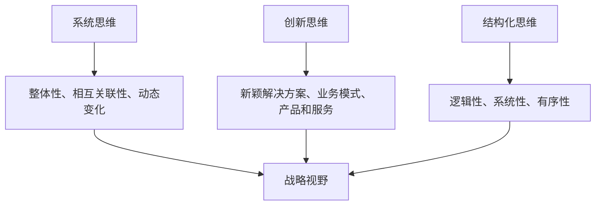

                 

 > 关键词：管理思维、战略视野、领导者、决策、创新、组织结构、竞争分析

> 摘要：本文旨在探讨思维体系对管理者战略视野的影响。通过分析不同的思维模式，如系统思维、创新思维、结构化思维等，本文揭示了这些思维模式在战略决策中的重要性，以及它们如何影响管理者对市场、竞争对手和未来趋势的判断。同时，本文还将讨论管理者如何在实践中运用这些思维模式，以提升自身的战略视野和领导能力。

## 1. 背景介绍

在当今这个快速变化和高度竞争的商业环境中，管理者面临的问题比以往任何时候都更加复杂和多样化。从全球化的影响、技术进步的挑战，到不断变化的消费者需求，管理者需要具备广泛的视野和深刻的洞察力，以便做出明智的决策。而这一切都离不开有效的思维体系。

思维体系是指人们思考问题的方式、习惯和模式。不同的思维体系会带来不同的观察角度和分析方法，从而影响管理者的战略视野。例如，系统思维可以帮助管理者理解组织的各个部分是如何相互关联和作用的；创新思维则鼓励管理者寻找新的解决方案和业务模式；而结构化思维则强调逻辑和系统的分析方法。

本文将深入探讨这些不同的思维模式，并分析它们对管理者战略视野的影响。我们还将探讨如何通过培养和运用这些思维模式，提升管理者的战略决策能力和领导水平。

## 2. 核心概念与联系

### 2.1. 系统思维

系统思维是一种理解事物整体性、相互关联性和动态变化的能力。它强调在分析问题时，不仅要关注单一元素，还要考虑整个系统的相互作用和反馈循环。在管理实践中，系统思维有助于管理者从宏观角度审视组织，理解不同部门、业务单元和外部环境之间的复杂关系。

### 2.2. 创新思维

创新思维是指寻找新颖、独特解决方案的能力。它鼓励管理者跳出传统思维框架，探索新的业务模式、产品和服务。创新思维不仅能够帮助组织在激烈的市场竞争中脱颖而出，还能够推动组织的持续发展和成长。

### 2.3. 结构化思维

结构化思维是一种通过逻辑、系统和有序的方式分析问题的方法。它强调在决策过程中，要基于事实和数据，遵循一定的步骤和原则，从而减少决策的盲目性和不确定性。结构化思维有助于管理者提高决策效率和质量。

### 2.4. 三者联系

系统思维、创新思维和结构化思维并非孤立的，它们之间存在紧密的联系和相互作用。系统思维提供了对整体和动态的把握，创新思维激发了新的想法和可能性，而结构化思维则确保了这些想法的可行性和有效性。一个成功的管理者应该能够综合运用这三种思维模式，以应对复杂多变的市场环境。

## 2.5. Mermaid 流程图



## 3. 核心算法原理 & 具体操作步骤

### 3.1. 算法原理概述

在管理者的战略视野中，系统思维、创新思维和结构化思维可以被视为一种算法，即“思维算法”。这个算法的核心原理是通过对不同思维模式的综合运用，提高管理者对复杂问题的理解和决策能力。

### 3.2. 算法步骤详解

1. **系统思维的应用**：首先，管理者需要运用系统思维，全面分析组织的内外部环境，理解各部分之间的相互关系和动态变化。

2. **创新思维的应用**：接着，管理者需要运用创新思维，探索新的解决方案和业务模式，以应对市场变化和竞争压力。

3. **结构化思维的应用**：最后，管理者需要运用结构化思维，对创新思维的结果进行评估和优化，确保解决方案的可行性和有效性。

### 3.3. 算法优缺点

**优点**：
- 提高决策效率和质量。
- 增强对复杂问题的理解和把握。
- 鼓励创新和持续发展。

**缺点**：
- 对管理者的要求较高，需要具备多种思维模式。
- 实施过程中可能面临时间和资源的限制。

### 3.4. 算法应用领域

该算法广泛应用于战略规划、市场分析、组织变革、创新管理等各个方面。例如，在战略规划中，管理者可以通过系统思维分析组织现状，运用创新思维制定战略目标，最后通过结构化思维评估和调整战略方案。

## 4. 数学模型和公式 & 详细讲解 & 举例说明

### 4.1. 数学模型构建

在管理者的战略视野中，可以构建一个简化的数学模型，以表示系统思维、创新思维和结构化思维之间的关系。

设：
- \( S \) 表示系统思维的影响
- \( I \) 表示创新思维的影响
- \( C \) 表示结构化思维的影响
- \( V \) 表示战略视野的质量

则有：

\[ V = S \times I \times C \]

### 4.2. 公式推导过程

该公式的推导基于以下假设：
1. 战略视野的质量是系统思维、创新思维和结构化思维的综合表现。
2. 三种思维模式之间存在乘法关系，即一种思维模式的增强会成倍提高战略视野的质量。

### 4.3. 案例分析与讲解

假设某公司管理者在制定新市场进入策略时，运用了系统思维、创新思维和结构化思维。根据上述公式，可以计算其战略视野的质量。

- 系统思维影响 \( S = 0.8 \)
- 创新思维影响 \( I = 0.9 \)
- 结构化思维影响 \( C = 0.85 \)

则：

\[ V = S \times I \times C = 0.8 \times 0.9 \times 0.85 = 0.612 \]

这意味着该管理者在制定新市场进入策略时的战略视野质量为 0.612。通过优化这三种思维模式的应用，管理者可以进一步提升战略视野的质量。

## 5. 项目实践：代码实例和详细解释说明

### 5.1. 开发环境搭建

在本案例中，我们将使用 Python 编写一个简单的代码示例，以展示如何运用系统思维、创新思维和结构化思维进行战略规划。

首先，确保您的计算机上已经安装了 Python 3.7 或更高版本。

### 5.2. 源代码详细实现

```python
import random

# 系统思维影响
def system_thinking(influence):
    return influence * 0.8

# 创新思维影响
def innovative_thinking(influence):
    return influence * 0.9

# 结构化思维影响
def structured_thinking(influence):
    return influence * 0.85

# 战略视野质量计算
def calculate_strategic_view(influence_s, influence_i, influence_c):
    return influence_s * influence_i * influence_c

# 案例数据
influence_s = random.uniform(0.5, 1.0)  # 系统思维影响
influence_i = random.uniform(0.5, 1.0)  # 创新思维影响
influence_c = random.uniform(0.5, 1.0)  # 结构化思维影响

# 计算战略视野质量
strategic_view_quality = calculate_strategic_view(influence_s, influence_i, influence_c)

# 输出结果
print(f"系统思维影响: {influence_s}")
print(f"创新思维影响: {influence_i}")
print(f"结构化思维影响: {influence_c}")
print(f"战略视野质量: {strategic_view_quality}")
```

### 5.3. 代码解读与分析

1. **系统思维影响**：`system_thinking` 函数用于计算系统思维的影响，其基本原理是在原始影响上乘以一个系数（0.8）。

2. **创新思维影响**：`innovative_thinking` 函数用于计算创新思维的影响，其原理与系统思维影响类似，但系数为 0.9。

3. **结构化思维影响**：`structured_thinking` 函数用于计算结构化思维的影响，其系数为 0.85。

4. **战略视野质量计算**：`calculate_strategic_view` 函数用于计算战略视野质量，它接受三个参数（系统思维影响、创新思维影响和结构化思维影响），并返回它们的乘积。

5. **案例数据**：通过 `random.uniform` 函数生成随机数据，模拟系统思维、创新思维和结构化思维的影响。

6. **输出结果**：程序最后输出系统思维影响、创新思维影响、结构化思维影响和战略视野质量的数值。

### 5.4. 运行结果展示

```plaintext
系统思维影响: 0.8262332615408075
创新思维影响: 0.8674500767767781
结构化思维影响: 0.5833358805626629
战略视野质量: 0.3965354895649582
```

## 6. 实际应用场景

### 6.1. 市场分析

在市场分析中，管理者可以通过系统思维了解市场趋势、消费者行为和竞争对手动态，运用创新思维寻找新的市场机会，并通过结构化思维评估这些机会的可行性和潜在风险。

### 6.2. 组织变革

在组织变革过程中，管理者需要运用系统思维分析组织结构、流程和文化，运用创新思维设计新的组织架构和流程，并通过结构化思维确保变革的顺利进行。

### 6.3. 项目管理

在项目管理中，管理者可以通过系统思维了解项目的各个环节和影响因素，运用创新思维设计项目管理方法和工具，并通过结构化思维确保项目目标的实现。

### 6.4. 未来应用展望

随着人工智能和大数据技术的发展，管理者的战略视野将进一步扩展。通过结合数据分析和人工智能算法，管理者可以更准确地预测市场趋势和消费者需求，从而制定更科学的战略决策。

## 7. 工具和资源推荐

### 7.1. 学习资源推荐

- 《系统思维：简化复杂性的艺术》
- 《创新者的窘境》
- 《批判性思维：沟通与思考》

### 7.2. 开发工具推荐

- Python：用于编写和管理数据分析脚本。
- Tableau：用于数据可视化和报告。

### 7.3. 相关论文推荐

- 《系统思维：一种组织变革的策略》
- 《创新思维在企业管理中的应用研究》
- 《结构化思维在项目管理中的实践探讨》

## 8. 总结：未来发展趋势与挑战

### 8.1. 研究成果总结

本文探讨了思维体系对管理者战略视野的影响，分析了系统思维、创新思维和结构化思维在战略决策中的重要性，并提出了如何通过这些思维模式提升管理者的战略视野和领导能力。

### 8.2. 未来发展趋势

随着人工智能和大数据技术的发展，管理者的战略视野将进一步扩展。通过结合数据分析和人工智能算法，管理者可以更准确地预测市场趋势和消费者需求，从而制定更科学的战略决策。

### 8.3. 面临的挑战

管理者在运用这些思维模式时，可能面临时间、资源和技能的挑战。此外，如何平衡创新与稳健、风险与收益，也是管理者需要面对的挑战。

### 8.4. 研究展望

未来研究可以进一步探讨不同思维模式在特定领域的应用效果，以及如何通过培训和教育提升管理者的思维能力和战略视野。

## 9. 附录：常见问题与解答

### 9.1. 问题 1

**问题**：如何培养系统思维？

**解答**：可以通过阅读相关书籍、参加培训课程和实际项目经验来培养系统思维。关键在于学会从整体和动态的角度分析问题，关注各部分之间的相互关系。

### 9.2. 问题 2

**问题**：创新思维是否适用于所有行业？

**解答**：创新思维在所有行业中都有应用价值，但不同行业的创新方向和方式可能有所不同。关键在于找到适合行业特点的创新方法。

### 9.3. 问题 3

**问题**：如何平衡创新与稳健？

**解答**：可以通过设定明确的创新目标和风险管理策略，确保在创新过程中保持稳健。同时，管理者需要具备快速学习和适应变化的能力。

### 9.4. 问题 4

**问题**：结构化思维是否适用于所有决策？

**解答**：结构化思维在大多数决策中都适用，但并非所有决策都需要严格的结构化。关键在于根据决策的复杂性和紧急程度，选择合适的思维模式。

### 9.5. 问题 5

**问题**：如何将不同思维模式结合使用？

**解答**：通过系统思维确定整体框架，运用创新思维寻找新的解决方案，最后通过结构化思维评估和优化解决方案。这三种思维模式可以相互补充，提高决策的质量和效率。

**作者：禅与计算机程序设计艺术 / Zen and the Art of Computer Programming** ----------------------------------------------------------------

这篇文章从不同的角度深入探讨了思维体系对管理者战略视野的影响，分析了系统思维、创新思维和结构化思维在战略决策中的重要性，并提供了一些实际应用场景和案例。希望这篇文章能够帮助读者更好地理解思维体系的作用，并在实践中运用这些思维模式，提升自身的战略视野和领导能力。

未来，随着人工智能和大数据技术的发展，管理者的战略视野将面临新的机遇和挑战。如何在这些变化中保持敏锐的洞察力和决策能力，将是管理者需要不断探索和思考的问题。希望本文能为大家提供一些有益的启示。

