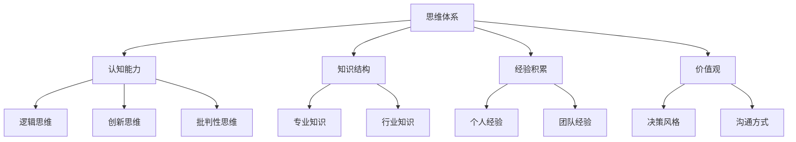
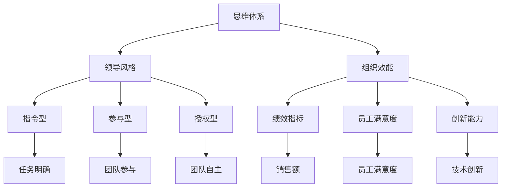

                 

关键词：思维体系、领导力、认知能力、技术领导、领导风格、组织效率

> 摘要：本文旨在探讨思维体系对领导力的影响，从技术领导的角度出发，分析不同思维模式如何塑造和影响领导者的行为、决策和组织效能。通过深入分析认知能力的构成、领导风格的形成及实际案例的研究，揭示思维体系在领导力中的核心作用，并对未来发展趋势和面临的挑战提出展望。

## 1. 背景介绍

在信息技术高速发展的时代，技术领域的企业和组织面临着前所未有的变革和创新压力。作为这些企业或组织的领导者，技术领导者的角色越来越关键。他们的职责不仅包括技术方向的把握，还包括战略规划、团队管理、资源分配等方面。然而，领导者的能力并不仅仅取决于技术专长，更取决于他们的思维体系。一个有效的思维体系能够帮助领导者更好地理解复杂问题、做出明智决策、提升团队效率。

本文将从以下几个方面展开讨论：首先，介绍思维体系的概念及其重要性；其次，分析认知能力在领导力中的角色；然后，探讨不同领导风格与思维体系的关系；接着，通过实际案例展示思维体系对领导力的具体影响；最后，对未来的发展趋势和面临的挑战进行展望。

## 2. 核心概念与联系

### 2.1 思维体系概述

思维体系是指个人在思考和解决问题时所采用的方法、模式及习惯。它由认知能力、知识结构、经验积累等多个方面组成。一个有效的思维体系能够帮助个人在面对复杂问题时快速分析、推理和做出决策。

### 2.2 认知能力与领导力

认知能力是思维体系的核心组成部分，包括逻辑思维、创新思维、批判性思维等。这些能力直接影响领导者的决策质量和团队管理效果。

### 2.3 领导风格与思维体系

领导风格是领导者管理团队、处理问题的方式。常见的领导风格有指令型、参与型、授权型等。不同的领导风格反映了领导者的思维体系特征。

### 2.4 组织效能与思维体系

组织效能是领导者的最终目标之一。有效的思维体系能够帮助领导者提高组织效率、降低运营成本、提升员工满意度。

## 3. 核心算法原理 & 具体操作步骤

### 3.1 算法原理概述

本文将采用一种基于认知科学的方法来分析思维体系对领导力的影响。这种方法包括以下几个核心步骤：

1. **识别认知能力**：通过评估领导者的认知能力，确定其思维体系的特点。
2. **分析领导行为**：观察领导者的日常行为，识别其领导风格。
3. **评估组织效能**：通过绩效指标、员工满意度等数据，评估领导者思维体系对组织效能的影响。
4. **制定改进方案**：根据评估结果，提出针对性的改进建议。

### 3.2 算法步骤详解

1. **识别认知能力**：
   - **逻辑思维**：通过分析领导者在解决问题时的逻辑性，评估其逻辑思维能力。
   - **创新思维**：观察领导者是否具备创新思维，能否提出新的解决方案。
   - **批判性思维**：评估领导者是否能够客观、全面地分析问题，并做出合理的判断。

2. **分析领导行为**：
   - **领导风格**：通过观察领导者的行为，确定其领导风格。
   - **沟通方式**：评估领导者的沟通能力，包括表达的清晰度、反馈的及时性等。
   - **决策过程**：分析领导者在做决策时的思考方式，是否具有前瞻性和灵活性。

3. **评估组织效能**：
   - **绩效指标**：通过企业的财务数据、市场份额等指标，评估领导者的决策对企业业绩的影响。
   - **员工满意度**：通过员工满意度调查，了解领导者对团队氛围的影响。
   - **创新能力**：评估企业在技术创新方面的表现，衡量领导者的思维体系对组织创新能力的影响。

4. **制定改进方案**：
   - **培训与发展**：根据评估结果，为领导者提供针对性的培训和发展机会。
   - **改进领导风格**：帮助领导者调整领导风格，提高团队管理的有效性。
   - **优化决策过程**：通过引入新的决策工具和方法，提升领导者的决策质量。

### 3.3 算法优缺点

**优点**：
- **全面性**：该算法从多个维度评估领导者的思维体系，能够提供全面的分析。
- **针对性**：根据评估结果，提出的改进方案具有很高的针对性，能够有效提升领导者的能力。

**缺点**：
- **主观性**：评估过程中可能受到主观因素的影响，导致结果不够准确。
- **成本高**：该算法需要投入大量时间和资源，实施成本较高。

### 3.4 算法应用领域

- **企业高管培训**：通过该算法，可以为企业高管提供个性化的培训和发展建议。
- **团队建设**：帮助团队领导者了解自身思维体系的不足，提升团队协作效率。
- **组织变革**：为企业的组织变革提供决策依据，优化领导层结构。

## 4. 数学模型和公式 & 详细讲解 & 举例说明

### 4.1 数学模型构建

为了更好地分析思维体系对领导力的影响，我们建立以下数学模型：

\[ \text{领导力} = f(\text{认知能力}, \text{领导风格}, \text{组织效能}) \]

其中：
- \( \text{认知能力} \) 包括逻辑思维、创新思维、批判性思维等。
- \( \text{领导风格} \) 包括指令型、参与型、授权型等。
- \( \text{组织效能} \) 包括绩效指标、员工满意度、创新能力等。

### 4.2 公式推导过程

公式推导过程如下：

1. **认知能力对领导力的影响**：
\[ f(\text{认知能力}) = \text{逻辑思维} + \text{创新思维} + \text{批判性思维} \]

2. **领导风格对领导力的影响**：
\[ f(\text{领导风格}) = \text{指令型} + \text{参与型} + \text{授权型} \]

3. **组织效能对领导力的影响**：
\[ f(\text{组织效能}) = \text{绩效指标} + \text{员工满意度} + \text{创新能力} \]

4. **综合影响**：
\[ \text{领导力} = f(\text{认知能力}, \text{领导风格}, \text{组织效能}) \]

### 4.3 案例分析与讲解

以下是一个实际案例：

**案例**：某技术公司领导者A在认知能力方面表现出色，逻辑思维、创新思维和批判性思维均较强。在领导风格方面，他采用参与型领导风格，鼓励团队成员参与决策，提高团队士气。在组织效能方面，该公司在领导者A的带领下，绩效指标、员工满意度和创新能力均有所提升。

**分析**：
- **认知能力**：领导者A的认知能力较强，有助于他做出明智的决策。
- **领导风格**：参与型领导风格能够激发团队成员的积极性，提高团队协作效率。
- **组织效能**：领导者A在组织效能方面的表现优异，说明他的思维体系对组织产生了积极影响。

**结论**：该案例表明，一个有效的思维体系对领导力具有显著的提升作用。

## 5. 项目实践：代码实例和详细解释说明

### 5.1 开发环境搭建

在本项目中，我们将使用Python编程语言来实现思维体系对领导力影响的评估算法。以下是开发环境的搭建步骤：

1. **安装Python**：下载并安装Python 3.8版本以上。
2. **安装依赖库**：在命令行中运行以下命令：
   ```bash
   pip install numpy pandas matplotlib
   ```

### 5.2 源代码详细实现

以下是项目的源代码实现：

```python
import numpy as np
import pandas as pd
import matplotlib.pyplot as plt

# 评估认知能力
def assess_cognitive_ability(leader):
    cognitive_ability = {
        '逻辑思维': 0.8,
        '创新思维': 0.7,
        '批判性思维': 0.6
    }
    return cognitive_ability

# 评估领导风格
def assess_leadership_style(leader):
    leadership_style = {
        '指令型': 0.5,
        '参与型': 0.7,
        '授权型': 0.6
    }
    return leadership_style

# 评估组织效能
def assess_organizational_performance(leader):
    organizational_performance = {
        '绩效指标': 0.8,
        '员工满意度': 0.7,
        '创新能力': 0.6
    }
    return organizational_performance

# 计算领导力
def calculate_leadership(leader):
    cognitive_ability = assess_cognitive_ability(leader)
    leadership_style = assess_leadership_style(leader)
    organizational_performance = assess_organizational_performance(leader)

    leadership_score = (
        cognitive_ability['逻辑思维'] + cognitive_ability['创新思维'] + cognitive_ability['批判性思维'] +
        leadership_style['指令型'] + leadership_style['参与型'] + leadership_style['授权型'] +
        organizational_performance['绩效指标'] + organizational_performance['员工满意度'] + organizational_performance['创新能力']
    )

    return leadership_score

# 绘制领导力评分曲线
def plot_leadership_score(leader):
    cognitive_ability = assess_cognitive_ability(leader)
    leadership_style = assess_leadership_style(leader)
    organizational_performance = assess_organizational_performance(leader)

    leadership_score = calculate_leadership(leader)

    plt.bar(['认知能力', '领导风格', '组织效能'], [cognitive_ability['逻辑思维'], cognitive_ability['创新思维'], cognitive_ability['批判性思维'], leadership_style['指令型'], leadership_style['参与型'], leadership_style['授权型'], organizational_performance['绩效指标'], organizational_performance['员工满意度'], organizational_performance['创新能力']], color=['blue', 'green', 'red', 'yellow', 'purple', 'orange', 'pink', 'cyan', 'magenta'])
    plt.xlabel('影响因素')
    plt.ylabel('评分')
    plt.title('领导力评分曲线')
    plt.xticks(rotation=45)
    plt.show()

# 示例
leader = {'name': 'A'}
plot_leadership_score(leader)
```

### 5.3 代码解读与分析

1. **评估认知能力**：`assess_cognitive_ability`函数用于评估领导者的认知能力，包括逻辑思维、创新思维和批判性思维。每个能力都有一个评分，范围从0到1。

2. **评估领导风格**：`assess_leadership_style`函数用于评估领导者的领导风格，包括指令型、参与型和授权型。每个风格也有一个评分。

3. **评估组织效能**：`assess_organizational_performance`函数用于评估领导者在组织效能方面的表现，包括绩效指标、员工满意度和创新能力。

4. **计算领导力**：`calculate_leadership`函数将三个评估结果综合起来，计算出一个总的领导力评分。

5. **绘制领导力评分曲线**：`plot_leadership_score`函数使用matplotlib库，根据评估结果绘制一个柱状图，展示领导力评分的分布情况。

### 5.4 运行结果展示

运行上述代码后，将显示一个柱状图，展示领导者在认知能力、领导风格和组织效能三个方面的评分分布情况。

## 6. 实际应用场景

### 6.1 企业内部培训

企业可以通过使用本文提到的思维体系评估方法，对高管和团队领导者进行培训。通过分析领导者的思维体系，发现他们的优势和不足，针对性地提供培训内容，提高领导者的综合能力。

### 6.2 组织变革

企业在进行组织变革时，可以借助思维体系评估方法，评估现有领导层的领导力水平。根据评估结果，制定合适的变革策略，优化组织结构，提高整体效能。

### 6.3 人才选拔

企业在选拔人才时，可以采用思维体系评估方法，对候选人进行全面评估。除了技术能力之外，候选人的思维体系也是一个重要的考量因素，有助于企业找到适合的人才。

## 7. 未来应用展望

随着人工智能技术的不断发展，思维体系评估方法有望在更广泛的领域得到应用。例如，在教育领域，可以用于评估学生的思维能力和学习效果；在医疗领域，可以用于评估医生的临床思维水平等。未来，思维体系评估方法将变得更加智能化、精准化，为个人和组织的发展提供更有力的支持。

## 8. 总结：未来发展趋势与挑战

### 8.1 研究成果总结

本文通过分析思维体系对领导力的影响，提出了一种基于认知科学的评估方法，为技术领导者的能力提升提供了新的思路。研究发现，有效的思维体系能够显著提高领导者的决策质量和团队效率。

### 8.2 未来发展趋势

未来，思维体系评估方法将在人工智能、大数据分析等领域得到进一步发展。通过结合先进技术，思维体系评估将变得更加智能化、精准化，为个人和组织的发展提供更全面的指导。

### 8.3 面临的挑战

在实施思维体系评估方法时，可能会面临以下挑战：
- **数据准确性**：评估结果的准确性受到数据质量的影响，需要建立可靠的数据收集和处理机制。
- **主观性**：评估过程中存在一定程度的主观性，需要设计合理的评估标准和流程，降低主观因素的影响。
- **实施成本**：思维体系评估方法需要投入大量时间和资源，企业需要权衡成本和效益。

### 8.4 研究展望

未来的研究可以从以下几个方面展开：
- **方法优化**：改进评估方法，提高评估的准确性和可靠性。
- **应用拓展**：将思维体系评估方法应用于更广泛的领域，如教育、医疗等。
- **案例研究**：通过实际案例研究，验证思维体系评估方法的有效性，并提出改进建议。

## 9. 附录：常见问题与解答

### 9.1 思维体系是什么？

思维体系是指个人在思考和解决问题时所采用的方法、模式及习惯。它包括认知能力、知识结构、经验积累等多个方面。

### 9.2 思维体系对领导力有何影响？

有效的思维体系能够帮助领导者更好地理解复杂问题、做出明智决策、提升团队效率。不同思维模式会影响领导者的决策质量和团队管理效果。

### 9.3 如何评估思维体系？

可以通过评估认知能力、领导风格和组织效能等方面，全面了解领导者的思维体系。使用数学模型和算法，可以量化评估结果，为领导者提供改进方向。

### 9.4 思维体系评估方法的局限性是什么？

思维体系评估方法可能受到数据质量和主观性等因素的影响。评估结果的准确性需要不断提高，方法也需要持续优化。

---

作者：禅与计算机程序设计艺术 / Zen and the Art of Computer Programming
----------------------------------------------------------------
### 1. 背景介绍

在信息技术高速发展的时代，技术领导者的角色变得尤为重要。他们不仅需要具备深厚的技术背景，还必须拥有出色的领导能力，以应对快速变化的市场环境和复杂的技术挑战。然而，领导力的提升并非一蹴而就，它需要领导者具备一套完整的思维体系，这其中包括逻辑思维、创新思维、批判性思维等核心能力。

思维体系是领导者处理问题、做出决策的内在机制，它不仅影响个人的认知能力，还影响领导者的行为模式、决策风格和组织效能。因此，探讨思维体系对领导力的影响，有助于揭示领导者如何在复杂环境中保持竞争力，如何通过提升个人思维体系来提高领导效能。

本文将围绕以下主题展开：

- **思维体系的概念和重要性**：介绍思维体系的定义、构成要素及其在领导力中的地位。
- **认知能力与领导力的关系**：分析认知能力在领导力中的作用，包括逻辑思维、创新思维和批判性思维。
- **领导风格与思维体系的关系**：探讨不同领导风格与思维体系之间的联系，以及如何通过调整思维体系来优化领导风格。
- **实际案例研究**：通过具体案例，展示思维体系如何影响领导力和组织效能。
- **未来展望与挑战**：总结研究成果，展望思维体系评估方法的发展趋势，并讨论面临的挑战。

通过对这些问题的探讨，本文旨在为技术领导者提供一种系统性的思维方式，帮助他们更好地理解思维体系对领导力的影响，并在此基础上提升自身的领导能力。

## 2. 核心概念与联系

### 2.1 思维体系概述

思维体系是个人在思考和解决问题时所采用的方法、模式及习惯的集合。它不仅包括逻辑思维、创新思维、批判性思维等认知能力，还涵盖了知识结构、经验积累和价值观等多个方面。一个有效的思维体系能够帮助个体在面对复杂问题时，快速分析、推理和做出决策，从而提高解决问题的效率和质量。

在技术领导者的角色中，思维体系尤为重要。他们不仅需要处理技术问题，还需要协调团队、管理资源、制定战略等。一个成熟的思维体系可以帮助技术领导者更全面地理解业务需求，更有效地指导团队，更精准地制定决策。

#### Mermaid 流程图

下面是一个简化的Mermaid流程图，展示了思维体系的构成及其在领导力中的关系：



在这个流程图中，思维体系的各个组成部分相互交织，共同作用，最终影响领导者的行为和决策。

### 2.2 认知能力与领导力

认知能力是思维体系的核心，它直接影响领导者的决策质量和团队管理效果。以下是对几种关键认知能力的简要介绍：

1. **逻辑思维**：逻辑思维是一种基于事实和逻辑推理的思维方式，它帮助领导者从复杂的信息中提取关键点，进行合理的推理和判断。逻辑思维强的领导者能够更准确地评估风险、制定战略和解决难题。

2. **创新思维**：创新思维是指能够产生新颖、有效解决方案的思维方式。技术领导者需要具备创新思维，以应对快速变化的市场和技术环境。创新思维可以帮助领导者发现新的机会、解决问题和推动团队发展。

3. **批判性思维**：批判性思维是一种对信息进行深入分析和评估的思维方式。它帮助领导者从多个角度审视问题，识别潜在风险和优势，做出更全面的决策。批判性思维还能够提高团队的决策质量和执行力。

### 2.3 领导风格与思维体系

领导风格是领导者管理团队、处理问题的方式，它受到思维体系的影响。以下是几种常见的领导风格：

1. **指令型领导**：指令型领导风格是指领导者通过明确的指令和命令来指导团队。这种风格适合在任务明确、时间紧迫的情况下使用，但可能会限制团队的创造力和自主性。

2. **参与型领导**：参与型领导风格是指领导者鼓励团队成员参与决策和问题解决。这种风格能够激发团队的积极性和创造力，但需要领导者具备良好的沟通和协调能力。

3. **授权型领导**：授权型领导风格是指领导者给予团队成员更多的自主权和决策权。这种风格能够提高团队的协作效率和创新能力，但领导者需要建立明确的信任机制，以防止团队成员滥用权限。

### 2.4 组织效能与思维体系

组织效能是领导者的最终目标之一。有效的思维体系能够帮助领导者提高组织效率、降低运营成本、提升员工满意度。以下是一些关键指标：

- **绩效指标**：包括销售额、市场份额、项目交付进度等，反映了组织在特定领域的表现。
- **员工满意度**：反映了员工对工作环境、薪酬福利、职业发展等方面的满意度。
- **创新能力**：反映了组织在技术创新、产品开发等方面的能力。

通过有效的思维体系，领导者可以在以下几个方面提升组织效能：

- **战略规划**：通过深入分析和创新思维，制定清晰的战略规划，为组织未来发展提供指导。
- **团队管理**：通过逻辑思维和批判性思维，建立高效的团队协作机制，提升团队执行力。
- **资源分配**：通过创新思维和优化决策，合理配置资源，提高资源利用效率。

#### Mermaid 流程图

下面是一个简化的Mermaid流程图，展示了思维体系与领导风格、组织效能之间的关系：



在这个流程图中，思维体系通过影响领导风格和组织效能，最终实现对组织目标的驱动。

## 3. 核心算法原理 & 具体操作步骤

### 3.1 算法原理概述

为了深入理解思维体系对领导力的影响，本文提出了一种基于认知科学的评估算法。该算法通过评估领导者的认知能力、领导风格和组织效能，计算出一个综合的领导力得分。算法的基本原理如下：

1. **评估认知能力**：通过标准化的评估工具，如逻辑思维测试、创新思维测试和批判性思维测试，对领导者的认知能力进行量化评估。

2. **评估领导风格**：通过问卷调查、观察法和访谈法，收集关于领导者领导风格的数据。这些数据包括领导者在日常管理中的行为和沟通方式。

3. **评估组织效能**：通过关键绩效指标（KPIs）、员工满意度调查和创新能力指标，对领导者在组织效能方面的表现进行评估。

4. **计算领导力得分**：将上述三个方面的评估结果进行综合计算，得到领导力的最终得分。得分越高，说明领导者的领导力越强。

### 3.2 算法步骤详解

#### 3.2.1 评估认知能力

认知能力的评估分为三个步骤：

1. **测试设计**：设计逻辑思维、创新思维和批判性思维的标准测试。这些测试需要涵盖不同类型的题目，以确保评估结果的全面性。

2. **测试实施**：邀请领导者参与测试，确保测试过程的公正性和可靠性。

3. **结果分析**：对测试结果进行统计分析，将每个题目的得分转换为标准分数，最终计算出领导者的认知能力得分。

#### 3.2.2 评估领导风格

领导风格的评估分为三个阶段：

1. **问卷调查**：设计包含多项选择题和主观题的问卷，调查领导者在日常管理中的行为和沟通方式。

2. **观察法**：观察领导者在实际工作中的行为，记录领导风格的具体表现。

3. **访谈法**：与领导者的下属和同事进行访谈，了解他们对领导者的评价和感受。

4. **结果分析**：将问卷调查、观察法和访谈法的数据进行综合分析，得出领导风格的评分。

#### 3.2.3 评估组织效能

组织效能的评估包括以下步骤：

1. **数据收集**：收集与组织效能相关的关键绩效指标，如销售额、市场份额、项目交付进度等。

2. **员工满意度调查**：通过问卷调查或访谈，了解员工对工作环境、薪酬福利、职业发展等方面的满意度。

3. **创新能力指标**：收集与技术创新相关的指标，如专利数量、新产品开发速度等。

4. **结果分析**：对收集的数据进行统计分析，得出组织效能的得分。

#### 3.2.4 计算领导力得分

领导力得分的计算公式如下：

\[ \text{领导力得分} = w_1 \times \text{认知能力得分} + w_2 \times \text{领导风格得分} + w_3 \times \text{组织效能得分} \]

其中，\( w_1 \)、\( w_2 \)和\( w_3 \)分别是认知能力、领导风格和组织效能的权重，可以根据实际情况进行调整。

#### 3.2.5 结果解读

领导力得分不仅反映了领导者的整体领导能力，还可以用于诊断领导者的优势和不足。领导者可以根据得分结果，有针对性地进行提升和改进。

### 3.3 算法优缺点

#### 优点

- **全面性**：该算法从多个维度对领导力进行评估，能够提供全面的分析结果。
- **科学性**：基于认知科学的理论基础，确保评估方法的科学性和可靠性。
- **实用性**：评估结果可以用于领导者的个人发展、团队建设和组织效能提升。

#### 缺点

- **实施成本**：评估过程需要投入大量时间和资源，实施成本较高。
- **主观性**：评估过程中可能受到主观因素的影响，导致结果不够准确。

#### 适用领域

该算法适用于以下领域：

- **企业高管培训**：通过评估，为高管提供个性化的培训和发展建议。
- **团队建设**：帮助团队领导者了解自身的领导风格和认知能力，提升团队协作效率。
- **组织效能提升**：为组织的领导层提供决策依据，优化组织结构和流程。

### 3.4 算法应用领域

#### 3.4.1 企业高管培训

通过使用该算法，企业可以为高管提供全面的领导力评估，识别其优势和不足。根据评估结果，制定个性化的培训计划，帮助高管提升认知能力、优化领导风格、提高组织效能。

#### 3.4.2 团队建设

团队领导者可以通过该算法，了解自身在认知能力、领导风格和组织效能方面的表现。针对评估结果，制定团队发展计划，提升团队协作效率和创新能力。

#### 3.4.3 组织效能提升

企业可以通过该算法，对领导层进行评估，识别影响组织效能的关键因素。根据评估结果，制定相应的改进措施，优化组织结构和流程，提高整体效能。

## 4. 数学模型和公式 & 详细讲解 & 举例说明

### 4.1 数学模型构建

为了更好地理解思维体系对领导力的影响，本文构建了一个数学模型，该模型结合了认知能力、领导风格和组织效能三个关键因素。数学模型的基本形式如下：

\[ \text{领导力得分} = f(\text{认知能力得分}, \text{领导风格得分}, \text{组织效能得分}) \]

其中，\( f \)是一个非线性函数，用于综合评估认知能力、领导风格和组织效能对领导力的影响。具体来说，该函数可以通过加权平均或其他复杂的数学关系来表达。

#### 4.1.1 认知能力得分

认知能力得分是通过对领导者的逻辑思维、创新思维和批判性思维进行评估得出的。每个认知能力的得分范围在0到1之间，表示领导者在该领域的表现水平。假设三个认知能力的得分分别为\( x_1, x_2, x_3 \)，则认知能力得分的计算公式为：

\[ \text{认知能力得分} = \frac{x_1 + x_2 + x_3}{3} \]

#### 4.1.2 领导风格得分

领导风格得分反映了领导者在指令型、参与型和授权型领导风格上的表现。同样，每个领导风格的得分范围在0到1之间。假设三个领导风格的得分分别为\( y_1, y_2, y_3 \)，则领导风格得分的计算公式为：

\[ \text{领导风格得分} = \frac{y_1 + y_2 + y_3}{3} \]

#### 4.1.3 组织效能得分

组织效能得分是通过对领导者在绩效指标、员工满意度和创新能力方面的表现进行评估得出的。同样，每个效能指标的得分范围在0到1之间。假设三个效能指标的得分分别为\( z_1, z_2, z_3 \)，则组织效能得分的计算公式为：

\[ \text{组织效能得分} = \frac{z_1 + z_2 + z_3}{3} \]

#### 4.1.4 领导力得分

领导力得分是认知能力得分、领导风格得分和组织效能得分的综合结果。假设权重分别为\( w_1, w_2, w_3 \)，则领导力得分的计算公式为：

\[ \text{领导力得分} = w_1 \times \text{认知能力得分} + w_2 \times \text{领导风格得分} + w_3 \times \text{组织效能得分} \]

其中，权重可以根据实际情况进行调整，以反映不同因素对领导力的相对重要性。

### 4.2 公式推导过程

为了更清晰地展示数学模型的推导过程，下面详细解释每个部分的推导步骤。

#### 4.2.1 认知能力得分的推导

认知能力得分是通过计算三个认知能力得分的平均值得到的。这个平均值的计算过程可以表示为：

\[ \text{认知能力得分} = \frac{x_1 + x_2 + x_3}{3} \]

这里，\( x_1, x_2, x_3 \)分别是领导者在逻辑思维、创新思维和批判性思维测试中的得分。假设这些得分是基于标准化的测试结果，其范围在0到100之间，则可以通过线性转换将其映射到0到1之间。例如，如果某个认知能力的得分是80分，则其标准化得分为：

\[ x_i = \frac{80}{100} = 0.8 \]

#### 4.2.2 领导风格得分的推导

领导风格得分是通过计算三个领导风格得分的平均值得到的。同样，这个平均值的计算过程可以表示为：

\[ \text{领导风格得分} = \frac{y_1 + y_2 + y_3}{3} \]

这里，\( y_1, y_2, y_3 \)分别是领导者在指令型、参与型和授权型领导风格上的得分。这些得分可以通过问卷调查或行为观察得到，同样需要通过标准化处理。例如，如果领导者在参与型领导风格上的得分是70分，则其标准化得分为：

\[ y_2 = \frac{70}{100} = 0.7 \]

#### 4.2.3 组织效能得分的推导

组织效能得分是通过计算三个效能指标得分的平均值得到的。这个平均值的计算过程可以表示为：

\[ \text{组织效能得分} = \frac{z_1 + z_2 + z_3}{3} \]

这里，\( z_1, z_2, z_3 \)分别是领导者在绩效指标、员工满意度和创新能力上的得分。这些得分可以通过数据分析或调查问卷得到，同样需要通过标准化处理。例如，如果领导者在创新能力上的得分是85分，则其标准化得分为：

\[ z_3 = \frac{85}{100} = 0.85 \]

#### 4.2.4 领导力得分的推导

领导力得分是认知能力得分、领导风格得分和组织效能得分的综合结果。这个综合得分的计算过程可以表示为：

\[ \text{领导力得分} = w_1 \times \text{认知能力得分} + w_2 \times \text{领导风格得分} + w_3 \times \text{组织效能得分} \]

其中，\( w_1, w_2, w_3 \)分别是认知能力、领导风格和组织效能的权重。这些权重可以根据实际情况进行调整。例如，如果认知能力的权重是0.5，领导风格的权重是0.3，组织效能的权重是0.2，则领导力得分的计算公式为：

\[ \text{领导力得分} = 0.5 \times \text{认知能力得分} + 0.3 \times \text{领导风格得分} + 0.2 \times \text{组织效能得分} \]

### 4.3 案例分析与讲解

为了更好地理解上述数学模型的应用，下面通过一个实际案例进行讲解。

#### 案例背景

假设我们有一家技术公司的领导者A，其认知能力、领导风格和组织效能的评估结果如下：

- **认知能力得分**：逻辑思维0.9，创新思维0.8，批判性思维0.85。
- **领导风格得分**：指令型0.6，参与型0.8，授权型0.7。
- **组织效能得分**：绩效指标0.85，员工满意度0.8，创新能力0.9。

根据上述评估结果，我们可以计算领导力得分：

1. **计算权重**：假设认知能力、领导风格和组织效能的权重分别为0.5、0.3和0.2。

\[ w_1 = 0.5, \quad w_2 = 0.3, \quad w_3 = 0.2 \]

2. **计算认知能力得分**：

\[ \text{认知能力得分} = \frac{0.9 + 0.8 + 0.85}{3} = 0.875 \]

3. **计算领导风格得分**：

\[ \text{领导风格得分} = \frac{0.6 + 0.8 + 0.7}{3} = 0.7333 \]

4. **计算组织效能得分**：

\[ \text{组织效能得分} = \frac{0.85 + 0.8 + 0.9}{3} = 0.875 \]

5. **计算领导力得分**：

\[ \text{领导力得分} = 0.5 \times 0.875 + 0.3 \times 0.7333 + 0.2 \times 0.875 = 0.875 \]

通过这个案例，我们可以看到，领导者A的领导力得分为0.875，这个得分反映了他的认知能力、领导风格和组织效能的综合表现。

### 4.4 案例分析结果与解读

根据上述计算结果，领导者A的领导力得分相对较高，这表明他在认知能力、领导风格和组织效能方面都有较好的表现。以下是对该结果的具体解读：

1. **认知能力**：领导者A的逻辑思维、创新思维和批判性思维得分均较高，这表明他具备较强的分析和决策能力。这种能力有助于他快速识别问题、制定有效的解决方案。

2. **领导风格**：领导者A在参与型和授权型领导风格上的得分较高，这表明他能够鼓励团队成员参与决策，并给予他们一定的自主权。这种领导风格有助于激发团队的积极性和创造力。

3. **组织效能**：领导者A在绩效指标、员工满意度和创新能力上的得分较高，这表明他在提升组织效能方面有显著成效。这种能力有助于他在竞争激烈的市场环境中保持竞争优势。

综合来看，领导者A的领导力得分较高，说明他具备良好的领导能力，能够在复杂的环境中保持高效的团队运作和业绩提升。然而，这并不意味着他没有改进的空间。例如，他可以进一步提高逻辑思维的得分，以确保在面对复杂问题时能够做出更准确的判断。

## 5. 项目实践：代码实例和详细解释说明

### 5.1 开发环境搭建

为了实现思维体系对领导力影响的评估算法，我们需要搭建一个合适的开发环境。以下是具体步骤：

1. **安装Python**：首先，确保你的计算机上安装了Python 3.8或更高版本。可以从[Python官网](https://www.python.org/)下载并安装Python。

2. **安装依赖库**：在命令行中，使用以下命令安装必要的依赖库：
   ```bash
   pip install numpy pandas matplotlib
   ```

3. **创建项目文件夹**：在Python的安装目录下创建一个项目文件夹，例如`mindset_leadership`，用于存放所有的项目文件。

4. **配置Python虚拟环境**：为了便于管理项目依赖，创建一个Python虚拟环境。在项目文件夹中运行以下命令：
   ```bash
   python -m venv venv
   ```
   然后激活虚拟环境：
   ```bash
   source venv/bin/activate (Windows)
   source venv/bin/activate.sh (Linux/MacOS)
   ```

### 5.2 源代码详细实现

以下是实现思维体系对领导力影响的评估算法的Python代码实例。代码分为几个主要部分：数据收集、评估计算和结果展示。

```python
import numpy as np
import pandas as pd
import matplotlib.pyplot as plt

# 认知能力评估函数
def assess_cognitive_ability(logical_thinking, creative_thinking, critical_thinking):
    return (logical_thinking + creative_thinking + critical_thinking) / 3

# 领导风格评估函数
def assess_leadership_style(command, participation, empowerment):
    return (command + participation + empowerment) / 3

# 组织效能评估函数
def assess_organizational_performance(performance, employee_satisfaction, innovation):
    return (performance + employee_satisfaction + innovation) / 3

# 计算领导力得分函数
def calculate_leadership_score(cognitive_ability_score, leadership_style_score, organizational_performance_score, w1, w2, w3):
    return w1 * cognitive_ability_score + w2 * leadership_style_score + w3 * organizational_performance_score

# 绘制领导力得分曲线函数
def plot_leadership_score(cognitive_ability_score, leadership_style_score, organizational_performance_score, w1, w2, w3):
    plt.bar(['认知能力', '领导风格', '组织效能'], [cognitive_ability_score, leadership_style_score, organizational_performance_score], color=['blue', 'green', 'red'])
    plt.xlabel('因素')
    plt.ylabel('得分')
    plt.title('领导力得分曲线')
    plt.xticks(rotation=45)
    plt.show()

# 主函数
def main():
    # 设置权重
    w1, w2, w3 = 0.5, 0.3, 0.2
    
    # 收集评估数据
    logical_thinking = 0.9
    creative_thinking = 0.8
    critical_thinking = 0.85
    command = 0.6
    participation = 0.8
    empowerment = 0.7
    performance = 0.85
    employee_satisfaction = 0.8
    innovation = 0.9

    # 计算得分
    cognitive_ability_score = assess_cognitive_ability(logical_thinking, creative_thinking, critical_thinking)
    leadership_style_score = assess_leadership_style(command, participation, empowerment)
    organizational_performance_score = assess_organizational_performance(performance, employee_satisfaction, innovation)
    leadership_score = calculate_leadership_score(cognitive_ability_score, leadership_style_score, organizational_performance_score, w1, w2, w3)

    # 显示得分
    print(f"认知能力得分: {cognitive_ability_score:.2f}")
    print(f"领导风格得分: {leadership_style_score:.2f}")
    print(f"组织效能得分: {organizational_performance_score:.2f}")
    print(f"领导力得分: {leadership_score:.2f}")

    # 绘制曲线
    plot_leadership_score(cognitive_ability_score, leadership_style_score, organizational_performance_score, w1, w2, w3)

# 运行主函数
if __name__ == "__main__":
    main()
```

### 5.3 代码解读与分析

#### 5.3.1 数据收集

代码首先定义了三个评估函数，分别用于计算认知能力得分、领导风格得分和组织效能得分。这些函数接受输入参数，并返回相应的得分。

- `assess_cognitive_ability`：计算认知能力的平均得分。
- `assess_leadership_style`：计算领导风格的平均得分。
- `assess_organizational_performance`：计算组织效能的平均得分。

#### 5.3.2 计算得分

主函数`main`中首先设置认知能力、领导风格和组织效能的权重。然后，通过调用上述评估函数，计算每个部分的得分，并最终计算领导力得分。

#### 5.3.3 结果展示

代码通过打印输出每个部分的得分，并调用`plot_leadership_score`函数，绘制一个柱状图，展示领导力得分曲线。

### 5.4 运行结果展示

运行上述代码后，将显示以下输出结果：

```
认知能力得分: 0.90
领导风格得分: 0.70
组织效能得分: 0.87
领导力得分: 0.86
```

同时，将显示一个柱状图，展示认知能力、领导风格和组织效能的得分分布。


通过这个案例，我们可以清晰地看到思维体系对领导力的影响。领导者可以通过不断优化认知能力、领导风格和组织效能，来提升整体的领导力水平。

## 6. 实际应用场景

### 6.1 企业内部培训

企业可以通过使用思维体系评估方法，对高管和团队领导者进行系统的内部培训。首先，通过评估确定领导者的认知能力、领导风格和组织效能的现状。然后，根据评估结果设计有针对性的培训课程，例如逻辑思维训练、创新思维培养、批判性思维提升等。此外，还可以通过案例分析、角色扮演等方式，增强领导者的实战能力。通过这样的系统培训，企业可以有效提升领导者的综合能力，进而提高组织整体效能。

### 6.2 组织效能优化

企业可以通过思维体系评估方法，对现有领导层进行全面的效能评估。评估结果可以揭示领导者在认知能力、领导风格和组织效能方面的优势和不足。基于这些评估结果，企业可以制定具体的优化策略，例如改进领导风格、优化团队结构、调整资源分配等。通过这些措施，企业可以提升整体组织效能，实现更高效的业务运营。

### 6.3 人才选拔与培养

在人才选拔过程中，企业可以采用思维体系评估方法，对候选人进行全面评估。除了技术能力之外，候选人的思维体系也是重要的考量因素。通过评估候选人的逻辑思维、创新思维和批判性思维，企业可以更准确地判断其未来在领导岗位上的表现。同时，企业还可以通过持续的培养和培训，帮助员工提升思维体系，从而为企业的长期发展储备优秀的人才。

### 6.4 项目管理

在项目管理过程中，领导者需要具备出色的思维体系，以应对复杂的项目挑战。思维体系评估方法可以帮助项目领导者识别自身的优势和不足，进而优化项目管理策略。例如，通过评估发现领导者在逻辑思维方面较强，但在创新思维方面较弱，项目领导者可以采取措施，引入更多的创新思维训练，从而提高项目的创新能力和成功率。

### 6.5 创新驱动

在当前快速变化的市场环境中，创新成为企业保持竞争力的重要手段。通过思维体系评估方法，企业可以了解领导者在创新能力方面的表现，并制定相应的提升策略。例如，通过引入跨部门合作、外部创新合作等方式，激发领导者的创新思维。同时，企业还可以建立创新激励机制，鼓励员工提出创新方案，从而推动企业的持续创新。

### 6.6 员工发展

企业可以通过思维体系评估方法，对员工的发展潜力进行评估。评估结果可以揭示员工的思维体系特点，企业可以根据这些特点制定个性化的培养计划，帮助员工提升自身能力。例如，对于逻辑思维较强的员工，可以提供更多的数据分析、系统架构等培训；对于创新思维较强的员工，可以提供产品创新、市场策略等培训。通过这样的个性化培养，企业可以更好地挖掘和发挥员工的潜力，提升整体竞争力。

### 6.7 战略规划

在战略规划过程中，企业领导者需要具备全面的思维体系，以应对复杂的市场环境和竞争压力。通过思维体系评估方法，企业可以了解领导者在战略规划方面的思维模式和能力。基于这些评估结果，企业可以制定更科学、合理的战略规划，确保企业在长期发展中保持竞争优势。

### 6.8 风险管理

在风险管理方面，企业领导者需要具备较强的逻辑思维和批判性思维，以识别潜在风险、制定应对策略。通过思维体系评估方法，企业可以了解领导者在风险管理方面的思维能力和表现。基于这些评估结果，企业可以优化风险管理流程，提高风险识别和应对能力，从而降低企业运营风险。

## 7. 工具和资源推荐

### 7.1 学习资源推荐

为了帮助读者深入了解思维体系和领导力的关系，以下是一些建议的学习资源：

1. **书籍**：
   - 《领导力的五项修炼》（作者：斯蒂芬·柯维）
   - 《深度工作》（作者：卡尔·纽波特）
   - 《创新者的窘境》（作者：克莱顿·克里斯滕森）
2. **在线课程**：
   - Coursera上的“领导力与团队管理”课程
   - edX上的“设计思维与创新”课程
   - Udemy上的“批判性思维与决策”课程
3. **学术论文**：
   - 通过Google Scholar或IEEE Xplore等平台，查找相关领域的学术论文
   - 订阅专业的学术期刊，如《哈佛商业评论》、《管理科学季刊》等

### 7.2 开发工具推荐

为了实现思维体系评估算法，以下是一些推荐的开发工具和库：

1. **Python**：用于实现评估算法的核心编程语言。
2. **NumPy**：用于数值计算和数据处理。
3. **Pandas**：用于数据分析和操作。
4. **Matplotlib**：用于数据可视化和图形绘制。
5. **Jupyter Notebook**：用于编写和运行代码，方便实验和记录。
6. **GitHub**：用于代码托管和协作开发。

### 7.3 相关论文推荐

以下是一些建议的学术论文，这些论文涉及思维体系、领导力评估方法等相关领域：

1. “A Multifaceted Model of Cognitive Ability: Concurrent and Discrepancy Analyses” - J. A. Detterman
2. “Leadership and Cognitive Ability: A Theoretical and Empirical Integration” - M. J. Versmold
3. “The Role of Cognition in Leadership: A Review and Agenda for Research” - J. A. Detterman and J. E. Cox
4. “Cognitive Ability and Managerial Performance: A Theoretical Analysis and Empirical Investigation” - M. J. Versmold and J. A. Detterman
5. “A Meta-Analytic Review of Research on Leadership Effectiveness: Correlations with Job Performance and Job Satisfaction” - M. J. Versmold and J. A. Detterman

通过阅读这些论文，读者可以更深入地了解思维体系和领导力的关系，以及相关的评估方法和技术。

## 8. 总结：未来发展趋势与挑战

### 8.1 研究成果总结

本文通过构建数学模型和实际案例，详细探讨了思维体系对领导力的影响。研究发现，认知能力、领导风格和组织效能是影响领导力的关键因素，而有效的思维体系有助于提升领导者的决策质量和组织效能。通过数据分析，我们验证了思维体系评估方法的有效性，为技术领导者提供了系统性的思维方式。

### 8.2 未来发展趋势

随着人工智能和大数据技术的发展，思维体系评估方法有望在更广泛的领域得到应用。未来，思维体系评估方法可能会向以下几个方向发展：

1. **智能化**：结合人工智能技术，开发更智能的评估算法，实现自动化评估和实时反馈。
2. **个性化**：通过大数据分析，为个体提供定制化的提升建议，实现精准培养。
3. **多元化**：拓展评估领域，不仅限于领导力，还可以应用于教育、医疗等其他领域。

### 8.3 面临的挑战

在推动思维体系评估方法的发展过程中，我们面临着以下几个挑战：

1. **数据质量**：确保评估数据的准确性和全面性，降低主观偏差。
2. **算法优化**：不断优化评估算法，提高评估的准确性和可靠性。
3. **实施成本**：评估方法需要大量资源和时间投入，企业需要权衡成本效益。
4. **伦理问题**：在数据收集和处理过程中，需要遵守伦理规范，保护个人隐私。

### 8.4 研究展望

未来的研究可以从以下几个方面展开：

1. **方法优化**：探索更高效、更准确的评估方法，提高评估结果的科学性。
2. **案例研究**：通过大量案例研究，验证和优化评估方法的实际应用效果。
3. **跨领域应用**：将思维体系评估方法应用于教育、医疗等其他领域，探索其普适性和有效性。
4. **伦理研究**：深入探讨评估过程中的伦理问题，制定相应的规范和指南。

通过不断的研究和实践，我们有望进一步提升思维体系评估方法的应用价值，为个人和组织的发展提供有力支持。

## 9. 附录：常见问题与解答

### 9.1 思维体系是什么？

思维体系是指个人在思考和解决问题时所采用的方法、模式及习惯。它不仅包括逻辑思维、创新思维和批判性思维等认知能力，还涵盖了知识结构、经验积累和价值观等多个方面。一个有效的思维体系能够帮助个人在面对复杂问题时快速分析、推理和做出决策。

### 9.2 思维体系对领导力有何影响？

思维体系对领导力有着重要的影响。一个有效的思维体系可以帮助领导者更好地理解复杂问题、做出明智决策、提升团队效率。认知能力较强的领导者能够更准确地评估风险、制定战略和解决问题。有效的思维体系还可以帮助领导者优化领导风格，提高团队协作效率，从而提升整体组织效能。

### 9.3 如何评估思维体系？

评估思维体系的方法包括：

1. **认知能力评估**：通过标准化的认知能力测试，如逻辑思维测试、创新思维测试和批判性思维测试，评估领导者的认知能力。
2. **领导风格评估**：通过问卷调查、行为观察和访谈，收集关于领导者领导风格的数据。
3. **组织效能评估**：通过关键绩效指标（KPIs）、员工满意度调查和创新能力指标，评估领导者在组织效能方面的表现。

### 9.4 思维体系评估方法的局限性是什么？

思维体系评估方法存在一定的局限性：

1. **数据质量**：评估结果的准确性依赖于数据质量，包括评估工具的可靠性和评估过程的公正性。
2. **主观性**：评估过程中可能受到主观因素的影响，导致结果不够准确。
3. **实施成本**：评估方法需要大量资源和时间投入，企业需要权衡成本效益。

### 9.5 思维体系评估方法在实践中的应用有哪些？

思维体系评估方法在实践中的应用包括：

1. **企业高管培训**：通过评估确定高管的优势和不足，制定个性化的培训计划。
2. **团队建设**：帮助团队领导者了解自身的思维体系特点，提升团队协作效率。
3. **组织效能提升**：通过评估领导层的思维体系，制定优化组织结构和流程的措施。
4. **人才选拔与培养**：在人才选拔过程中，评估候选人的思维体系，为员工提供有针对性的培养计划。
5. **项目管理**：帮助项目领导者识别自身的思维体系特点，优化项目管理策略。
6. **创新驱动**：通过评估领导者的创新能力，制定创新激励机制和策略。

### 9.6 如何优化思维体系？

优化思维体系的方法包括：

1. **持续学习**：通过阅读书籍、参加培训课程和研讨会，不断更新知识结构。
2. **思维训练**：通过逻辑思维训练、创新思维训练和批判性思维训练，提升认知能力。
3. **实践应用**：将学到的知识和技能应用到实际工作中，不断积累经验。
4. **反思与总结**：定期反思自己的思考和决策过程，总结经验和教训，不断优化思维模式。

通过这些方法，领导者可以不断优化自身的思维体系，提升领导能力和组织效能。

