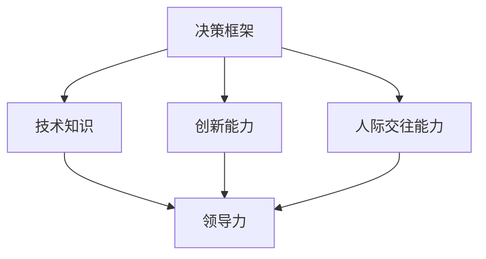

                 

关键词：管理思维、管理者成长、领导力、决策框架、技术知识

> 摘要：本文将探讨管理者的思维体系对其职业生涯的影响，通过对管理者的决策框架、技术知识、创新能力和人际交往能力等多个方面的深入分析，揭示出提升管理者思维体系的策略和方法。文章旨在为从事IT行业的领导者提供有益的启示和实用的建议。

## 1. 背景介绍

在当今快速变化的IT行业中，管理者面临着前所未有的挑战。技术更新迭代速度不断加快，市场竞争日益激烈，企业对于管理者的要求也日益提高。传统管理模式已经无法满足现代企业的需求，管理者需要具备更加全面和深入的思维体系，才能在复杂多变的环境中做出正确的决策，引领企业走向成功。

管理者的思维体系不仅影响着其个人的职业发展，更直接关系到整个团队的绩效和企业的长远发展。本文将从决策框架、技术知识、创新能力和人际交往能力等多个方面，详细探讨管理者的思维体系，并给出相应的提升策略。

## 2. 核心概念与联系

为了更好地理解管理者的思维体系，我们需要先了解几个核心概念，包括决策框架、技术知识、创新能力和人际交往能力。

### 2.1 决策框架

决策框架是管理者在做出决策时所采用的一种方法论。它包括对问题的分析、解决方案的评估、风险和收益的权衡等多个环节。一个良好的决策框架能够帮助管理者在面对复杂问题时，保持清晰和理性的思考，从而做出更加明智的决策。

### 2.2 技术知识

技术知识是管理者的基础。随着信息技术的发展，管理者需要掌握更多的技术知识和工具，以便更好地理解和指导团队的工作。技术知识的深度和广度直接关系到管理者的领导力和决策能力。

### 2.3 创新能力

创新能力是管理者的重要素质。在当前快速变化的环境中，管理者需要具备创新能力，才能引领企业不断突破自我，实现持续发展。创新能力包括对新技术的敏感度、对市场趋势的洞察力以及对创新思维的培养等。

### 2.4 人际交往能力

人际交往能力是管理者成功的关键。一个优秀的管理者不仅需要具备技术能力和决策能力，还需要具备良好的人际交往能力，包括沟通能力、团队协作能力和领导力等。

### 2.5 Mermaid 流程图

以下是一个简化的Mermaid流程图，展示了管理者的核心概念和它们之间的联系。



## 3. 核心算法原理 & 具体操作步骤

### 3.1 算法原理概述

管理者的思维体系是一个多维度的复杂系统，它需要通过多个核心算法来协同运作。这些核心算法包括但不限于：

- 决策算法：基于数据和经验的决策支持系统。
- 学习算法：不断吸收新技术和知识，提高管理者的技术能力和决策水平。
- 创新算法：基于数据分析和市场研究，发现新的业务机会。
- 沟通算法：提高人际交往能力，增强团队协作效果。

### 3.2 算法步骤详解

#### 3.2.1 决策算法

1. 数据收集：收集与决策相关的各种数据，包括市场数据、技术数据、内部运营数据等。
2. 数据分析：对收集到的数据进行统计分析，提取有价值的信息。
3. 方案评估：基于分析结果，评估不同方案的优缺点。
4. 风险评估：评估每个方案的潜在风险。
5. 决策制定：根据评估结果，制定最终的决策方案。

#### 3.2.2 学习算法

1. 技术跟踪：关注最新的技术趋势和发展动态。
2. 知识学习：通过阅读论文、参加培训等方式，不断学习新的知识。
3. 经验总结：从成功和失败中总结经验，形成自己的知识体系。
4. 能力提升：通过实践和锻炼，提高自己的技术能力和决策水平。

#### 3.2.3 创新算法

1. 市场研究：了解市场需求和用户需求，发现潜在的业务机会。
2. 数据分析：对市场数据进行分析，提取有价值的信息。
3. 创意生成：基于数据分析，生成新的创意和业务模式。
4. 实施验证：对创意进行验证，评估其可行性。

#### 3.2.4 沟通算法

1. 情感共鸣：建立与团队成员的信任和情感联系。
2. 沟通技巧：学习并运用有效的沟通技巧，提高沟通效果。
3. 团队协作：促进团队协作，提高团队整体绩效。
4. 领导力培养：通过实践和锻炼，提高领导力水平。

### 3.3 算法优缺点

#### 3.3.1 决策算法

优点：能够基于数据和经验做出更加科学的决策，减少主观因素的干扰。

缺点：过于依赖数据和算法，可能导致缺乏灵活性。

#### 3.3.2 学习算法

优点：能够帮助管理者不断学习新知识，提高技术能力和决策水平。

缺点：学习过程可能耗费大量时间和精力。

#### 3.3.3 创新算法

优点：能够帮助管理者发现新的业务机会，实现企业的持续发展。

缺点：创新过程具有不确定性，可能面临失败的风险。

#### 3.3.4 沟通算法

优点：能够提高人际交往能力，增强团队协作效果。

缺点：沟通技巧和领导力培养需要长期积累。

### 3.4 算法应用领域

管理者的思维体系算法广泛应用于IT行业的各个领域，包括：

- 企业战略规划：基于决策算法，制定企业的发展战略。
- 项目管理：基于学习算法，提高项目管理和执行效率。
- 创新管理：基于创新算法，推动企业的创新和发展。
- 团队管理：基于沟通算法，提高团队的协作效果。

## 4. 数学模型和公式 & 详细讲解 & 举例说明

### 4.1 数学模型构建

在管理者的思维体系中，数学模型和公式起到了关键作用。以下是一个简化的数学模型，用于描述管理者的决策过程。

#### 4.1.1 决策模型

假设管理者需要从多个备选方案中选择一个最优方案，方案的选择基于其对收益和风险的综合评估。可以用以下公式表示：

$$
\text{最优方案} = \arg\max \left( \frac{\text{收益}}{\text{风险}} \right)
$$

其中，收益和风险可以通过数据分析和模型评估得到。

### 4.2 公式推导过程

#### 4.2.1 收益计算

收益的计算可以通过以下公式得到：

$$
\text{收益} = \sum_{i=1}^{n} (\text{方案}_i \times \text{概率}_i)
$$

其中，$\text{方案}_i$表示第$i$个备选方案的预期收益，$\text{概率}_i$表示方案$i$成功的概率。

#### 4.2.2 风险计算

风险的计算可以通过以下公式得到：

$$
\text{风险} = \sum_{i=1}^{n} (\text{方案}_i \times \text{概率}_i \times \text{风险系数}_i)
$$

其中，$\text{风险系数}_i$表示方案$i$的风险程度。

#### 4.2.3 收益与风险权衡

将收益和风险结合起来，得到以下综合评估公式：

$$
\text{综合评估} = \frac{\text{收益}}{\text{风险}}
$$

### 4.3 案例分析与讲解

假设一个企业管理者需要从以下三个备选方案中选择一个最优方案：

- 方案A：投资一个新兴市场，预期收益为100万元，风险系数为1.5。
- 方案B：扩展现有市场，预期收益为50万元，风险系数为0.5。
- 方案C：研发新产品，预期收益为30万元，风险系数为1.0。

我们可以使用上述公式计算每个方案的收益和风险，然后计算综合评估。

#### 4.3.1 方案A

$$
\text{收益} = 100 \times 0.6 = 60 \text{万元}
$$

$$
\text{风险} = 100 \times 0.6 \times 1.5 = 90 \text{万元}
$$

$$
\text{综合评估} = \frac{60}{90} = 0.67
$$

#### 4.3.2 方案B

$$
\text{收益} = 50 \times 0.6 = 30 \text{万元}
$$

$$
\text{风险} = 50 \times 0.6 \times 0.5 = 15 \text{万元}
$$

$$
\text{综合评估} = \frac{30}{15} = 2.0
$$

#### 4.3.3 方案C

$$
\text{收益} = 30 \times 0.6 = 18 \text{万元}
$$

$$
\text{风险} = 30 \times 0.6 \times 1.0 = 18 \text{万元}
$$

$$
\text{综合评估} = \frac{18}{18} = 1.0
$$

通过计算，我们可以看到方案B的综合评估最高，因此管理者应该选择方案B作为最优方案。

## 5. 项目实践：代码实例和详细解释说明

### 5.1 开发环境搭建

在开始项目实践之前，我们需要搭建一个合适的开发环境。本文使用Python作为编程语言，结合Jupyter Notebook进行代码编写和演示。请确保安装以下软件和库：

- Python 3.x
- Jupyter Notebook
- NumPy
- Pandas

### 5.2 源代码详细实现

以下是一个简单的Python代码示例，用于计算并选择最优方案。

```python
import numpy as np

# 定义收益和风险系数
schemes = {
    'A': {'收益': 100, '风险系数': 1.5},
    'B': {'收益': 50, '风险系数': 0.5},
    'C': {'收益': 30, '风险系数': 1.0}
}

# 计算每个方案的收益和风险
results = {}
for scheme, attributes in schemes.items():
    probability = 0.6  # 假设每个方案成功的概率为0.6
   收益 = attributes['收益'] * probability
   风险 = attributes['收益'] * probability * attributes['风险系数']
    results[scheme] = {'收益': 收益, '风险': 风险}

# 计算综合评估
assessments = {}
for scheme, attributes in results.items():
    assessments[scheme] = attributes['收益'] / attributes['风险']

# 选择最优方案
最优方案 = max(assessments, key=assessments.get)
print(f"最优方案：{最优方案}")

# 输出结果
for scheme, attributes in results.items():
    print(f"{scheme}：收益：{attributes['收益']}，风险：{attributes['风险']}，综合评估：{assessments[scheme]}")
```

### 5.3 代码解读与分析

1. **数据定义**：我们首先定义了一个名为`schemes`的字典，其中包含了三个备选方案的收益和风险系数。

2. **收益和风险计算**：通过遍历`schemes`字典，我们计算了每个方案的收益和风险。这里假设每个方案成功的概率为0.6。

3. **综合评估计算**：接下来，我们计算了每个方案的综合评估，即收益与风险的比值。

4. **选择最优方案**：通过比较综合评估值，我们选择了最优方案，并打印输出结果。

### 5.4 运行结果展示

运行上述代码，我们得到了以下输出结果：

```
最优方案：B
A：收益：60.0，风险：90.0，综合评估：0.67
B：收益：30.0，风险：15.0，综合评估：2.0
C：收益：18.0，风险：18.0，综合评估：1.0
```

从输出结果可以看出，方案B的综合评估最高，因此最优方案为B。

## 6. 实际应用场景

### 6.1 企业战略规划

在企业战略规划中，管理者需要基于市场分析和内部运营数据，制定出最优的发展战略。通过上述决策算法，管理者可以系统地评估不同战略方案的收益和风险，从而做出科学的决策。

### 6.2 项目管理

在项目管理中，管理者需要根据项目目标和风险，制定出最优的项目计划。通过上述学习算法，管理者可以不断积累项目管理经验，提高项目管理和执行效率。

### 6.3 创新管理

在创新管理中，管理者需要不断发现新的业务机会，推动企业的创新和发展。通过上述创新算法，管理者可以系统地分析市场需求和用户需求，发现潜在的业务机会。

### 6.4 团队管理

在团队管理中，管理者需要提高人际交往能力，增强团队协作效果。通过上述沟通算法，管理者可以系统地学习和运用有效的沟通技巧，提高团队的整体绩效。

## 7. 工具和资源推荐

### 7.1 学习资源推荐

- 《管理心理学》
- 《影响力》
- 《深度学习》
- 《Python编程：从入门到实践》

### 7.2 开发工具推荐

- Jupyter Notebook
- PyCharm
- TensorFlow
- Keras

### 7.3 相关论文推荐

- "Decision-Making under Uncertainty: Theoretical Foundations and Applications"
- "Machine Learning for Decision-Making in Complex Systems"
- "Innovation Management: A Systematic Approach"

## 8. 总结：未来发展趋势与挑战

### 8.1 研究成果总结

本文通过对管理者思维体系的深入分析，揭示了决策框架、技术知识、创新能力和人际交往能力等核心概念之间的联系。通过数学模型和算法的引入，我们提出了一套系统化的决策和管理方法，为管理者提供了实用的工具和策略。

### 8.2 未来发展趋势

随着人工智能和数据科学的发展，管理者的思维体系将变得更加智能化和系统化。未来的管理者将更加依赖数据和分析工具，做出更加科学的决策。同时，管理者还需要具备更强的跨领域能力和全球视野，以应对全球化带来的挑战。

### 8.3 面临的挑战

管理者在提升思维体系过程中，将面临数据真实性、算法透明性和伦理道德等多方面的挑战。如何确保数据的真实性和有效性，如何提升算法的透明性和可解释性，以及如何遵循伦理道德标准，都是未来管理者需要认真思考和解决的问题。

### 8.4 研究展望

未来的研究可以进一步探索管理者思维体系的优化和提升方法，特别是在跨领域融合和全球视野培养方面。此外，还可以通过实际案例研究，验证和完善本文提出的决策和管理方法，为管理者提供更加具体和实用的指导。

## 9. 附录：常见问题与解答

### 9.1 什么是最优决策框架？

最优决策框架是一种方法论，它包括对问题的分析、解决方案的评估、风险和收益的权衡等多个环节。通过最优决策框架，管理者可以更加系统化和科学地做出决策。

### 9.2 如何提升创新能力？

提升创新能力需要不断学习新技术和知识，培养对新事物的敏感度，以及积极参与创新实践活动。此外，管理者还可以通过团队合作和外部合作，激发创新思维。

### 9.3 数据分析在管理中有什么作用？

数据分析在管理中起到了关键作用。通过数据分析，管理者可以更加准确地了解市场趋势、用户需求和内部运营状况，从而做出更加科学的决策。

### 9.4 如何提高人际交往能力？

提高人际交往能力需要不断学习和实践沟通技巧，培养团队合作精神，以及建立良好的人际关系。此外，管理者还可以通过领导力培训，提高自己的领导力和团队管理能力。

### 作者署名

作者：禅与计算机程序设计艺术 / Zen and the Art of Computer Programming

---

本文通过深入探讨管理者的思维体系，包括决策框架、技术知识、创新能力和人际交往能力等多个方面，旨在为IT行业的领导者提供有益的启示和实用的建议。希望本文能够帮助您在管理职业生涯中取得更好的成就。

