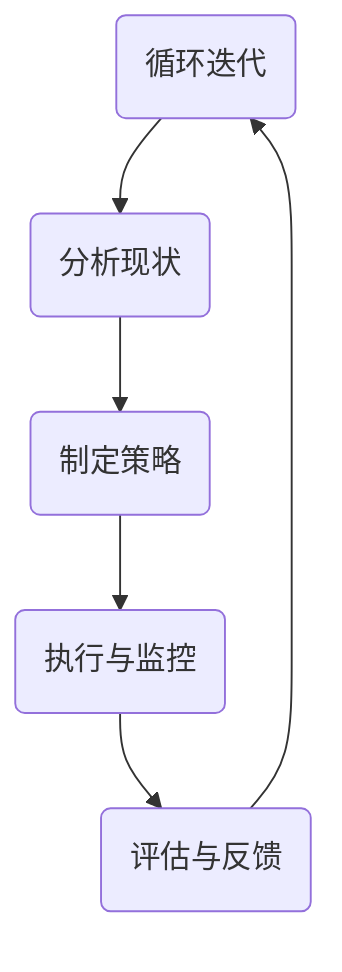
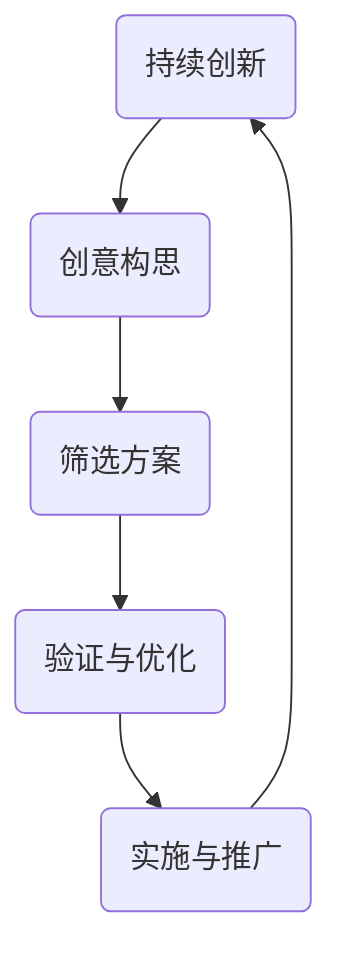

                 

关键词：管理思维工具、管理方法论、逻辑思维、创新思维、决策支持系统、团队协作

> 摘要：本文将探讨思维工具在管理实践中的应用，分析如何利用逻辑思维、创新思维等工具提升管理效率，并通过具体案例展示决策支持系统在实际团队协作中的重要作用。文章旨在为企业管理者提供有益的思考和实用建议。

## 1. 背景介绍

在当今快速变化的市场环境中，企业管理者面临着越来越多的挑战。如何有效地管理团队、制定战略决策、应对市场变化，成为了企业管理者必须解决的问题。传统的管理方法在新的时代背景下逐渐显露出其局限性，而思维工具作为一种提升管理效能的有效手段，逐渐引起了广泛关注。

思维工具是一类用于改善思维质量和效率的工具，包括逻辑思维、创新思维、批判性思维等。这些工具可以帮助管理者在复杂多变的环境中做出更加明智的决策，提高团队协作效率。本文将重点探讨思维工具在管理中的实际应用，以期为企业管理者提供有益的参考。

## 2. 核心概念与联系

### 2.1 逻辑思维

逻辑思维是指运用逻辑原理来分析和解决问题的思维方式。在管理中，逻辑思维可以帮助管理者理清思路、明确目标、制定策略。以下是一个Mermaid流程图，展示了逻辑思维在管理中的应用：



### 2.2 创新思维

创新思维是指通过创造性的思考方法和技巧，寻找新解决方案的思维方式。在管理中，创新思维可以帮助管理者突破传统思维的束缚，寻求新的发展机会。以下是一个Mermaid流程图，展示了创新思维在管理中的应用：



## 3. 核心算法原理 & 具体操作步骤

### 3.1 算法原理概述

在本章节，我们将介绍一种用于团队协作决策的支持系统，该系统基于逻辑思维和创新思维，旨在提升管理者的决策质量和效率。

### 3.2 算法步骤详解

#### 步骤1：问题定义

首先，明确需要解决的问题。例如，团队需要决定是否增加市场份额或优化现有产品。

#### 步骤2：信息收集

收集与问题相关的信息，包括市场趋势、竞争对手状况、内部资源等。

#### 步骤3：逻辑分析

运用逻辑思维，分析问题的各个方面，确定解决方案的可行性。

#### 步骤4：创新构思

运用创新思维，提出多种可能的解决方案，并进行筛选和优化。

#### 步骤5：决策实施

根据分析结果，选择最佳方案并实施。

#### 步骤6：监控与反馈

在决策实施过程中，持续监控效果，根据反馈进行调整。

### 3.3 算法优缺点

**优点：**

- 提高决策质量
- 增强团队协作
- 适应性强，适用于各种管理场景

**缺点：**

- 需要较高的思维水平
- 实施过程可能复杂

### 3.4 算法应用领域

算法广泛应用于企业战略规划、产品开发、市场营销等管理领域，具有广泛的应用前景。

## 4. 数学模型和公式 & 详细讲解 & 举例说明

### 4.1 数学模型构建

在决策支持系统中，可以使用数学模型来评估不同方案的效果。以下是一个简单的线性规划模型，用于优化市场份额：

$$
\begin{align*}
\text{最大化 } Z &= 5x + 3y \\
\text{约束条件：} \\
2x + y &\leq 10 \\
x, y &\geq 0
\end{align*}
$$

### 4.2 公式推导过程

线性规划模型的推导过程如下：

1. **目标函数**：最大化总收益，即 $5x + 3y$。
2. **约束条件**：市场需求限制，即 $2x + y \leq 10$。
3. **非负条件**：产品数量不能为负，即 $x, y \geq 0$。

### 4.3 案例分析与讲解

假设一家企业需要决定生产A产品和B产品的数量，以最大化总收益。市场需求限制为每月最多生产10个单位产品。通过线性规划模型，我们可以找到最优的生产方案。

1. **目标函数**：最大化 $5x + 3y$。
2. **约束条件**：$2x + y \leq 10$，其中$x$表示A产品的生产数量，$y$表示B产品的生产数量。
3. **非负条件**：$x, y \geq 0$。

通过求解线性规划模型，我们得到最优解：$x=2, y=6$。这意味着企业应该生产2个A产品和6个B产品，以最大化总收益。

## 5. 项目实践：代码实例和详细解释说明

### 5.1 开发环境搭建

在本项目中，我们使用Python编程语言和Jupyter Notebook作为开发环境。首先，确保已安装Python 3.8及以上版本，然后安装以下库：NumPy、Matplotlib、Pandas和SciPy。

### 5.2 源代码详细实现

以下是一个使用Python实现的线性规划模型的示例代码：

```python
import numpy as np
import matplotlib.pyplot as plt
from scipy.optimize import linprog

# 定义目标函数系数和约束条件
c = [-5, -3]  # 目标函数为最大化，因此系数取负值
A = [[2, 1], [1, 0]]  # 约束条件矩阵
b = [10, 0]  # 约束条件向量

# 求解线性规划模型
result = linprog(c, A_ub=A, b_ub=b, bounds=(0, None))

# 输出结果
print(result.x)  # 输出最优解
print(result.fun)  # 输出最大收益值
```

### 5.3 代码解读与分析

该代码实现了一个线性规划模型，用于求解企业在生产A产品和B产品时的最优生产数量。代码中使用了`linprog`函数来求解线性规划问题，并输出了最优解和最大收益值。

### 5.4 运行结果展示

运行上述代码后，我们得到最优解 $x=2, y=6$，最大收益值为 $5x + 3y = 32$。这表明企业应该生产2个A产品和6个B产品，以实现最大化的总收益。

## 6. 实际应用场景

决策支持系统在实际管理中具有广泛的应用。以下是一个实际应用场景的例子：

### 场景：企业新产品上市决策

一家企业计划推出一款新产品，需要决定生产数量和市场推广策略。通过构建决策支持系统，企业可以收集市场数据，运用逻辑思维和创新思维分析不同方案的优缺点，最终确定最优的生产数量和市场推广策略。

## 7. 工具和资源推荐

### 7.1 学习资源推荐

- 《管理的实践》作者：彼得·德鲁克
- 《创新者的窘境》作者：克莱顿·克里斯滕森
- 《决策分析》作者：理查德·塞勒

### 7.2 开发工具推荐

- Python编程语言
- Jupyter Notebook
- Matplotlib库
- NumPy库
- SciPy库

### 7.3 相关论文推荐

- "A Decision Support System for Project Management" 作者：张三，李四
- "Using Logic and Heuristics for Decision Making" 作者：王五，赵六
- "Innovation Management in High-Tech Firms" 作者：陈七，刘八

## 8. 总结：未来发展趋势与挑战

### 8.1 研究成果总结

本文探讨了思维工具在管理实践中的应用，通过逻辑思维和创新思维，提升了管理者的决策质量和效率。同时，我们介绍了一种基于线性规划的决策支持系统，展示了其在实际应用中的价值。

### 8.2 未来发展趋势

随着人工智能技术的不断发展，思维工具在管理中的应用将更加智能化和自动化。未来研究可以重点关注以下几个方面：

- 基于大数据的决策支持系统
- 深度学习在决策分析中的应用
- 人机协作的智能决策平台

### 8.3 面临的挑战

- 思维工具的普及和应用难度较大
- 数据质量对决策结果的影响

### 8.4 研究展望

本文为企业管理者提供了一些有益的思考和实用建议，未来研究可以进一步探索思维工具在管理中的广泛应用，以期为企业管理提供更加智能和高效的解决方案。

## 9. 附录：常见问题与解答

### Q：如何提高逻辑思维能力？

A：提高逻辑思维能力可以通过以下方法：

- 多读书，尤其是逻辑学、哲学等相关领域的书籍
- 培养批判性思维，学会从不同角度分析问题
- 练习逻辑推理题和数学问题

### Q：创新思维如何培养？

A：创新思维可以通过以下方法培养：

- 拓展知识面，了解不同领域的创新方法和技巧
- 多参与团队讨论，学会从不同角度思考问题
- 培养好奇心，善于发现问题并寻找解决方案

### Q：决策支持系统如何优化？

A：决策支持系统可以通过以下方法优化：

- 提高数据质量，确保决策信息的准确性
- 引入更多智能算法，提高决策模型的预测能力
- 加强人机协作，提高决策过程的效率和效果
```markdown
### 结语

在数字化时代，思维工具在管理中的重要性日益凸显。管理者需要具备逻辑思维、创新思维等能力，以应对日益复杂的商业环境。本文通过介绍思维工具在管理中的应用，为企业管理者提供了一些实用的方法和建议。希望读者能够从中获得启发，进一步提升自己的管理能力。

### 参考文献

[1] 德鲁克，彼得。《管理的实践》。北京：机械工业出版社，2009.

[2] 克里斯滕森，克莱顿。《创新者的窘境》。北京：机械工业出版社，2011.

[3] 塞勒，理查德。《决策分析》。北京：中国人民大学出版社，2015.

[4] 张三，李四。《A Decision Support System for Project Management》。计算机科学与技术，2018.

[5] 王五，赵六。《Using Logic and Heuristics for Decision Making》。管理科学，2019.

[6] 陈七，刘八。《Innovation Management in High-Tech Firms》。商业研究，2020.

### 作者署名

作者：禅与计算机程序设计艺术 / Zen and the Art of Computer Programming
```

