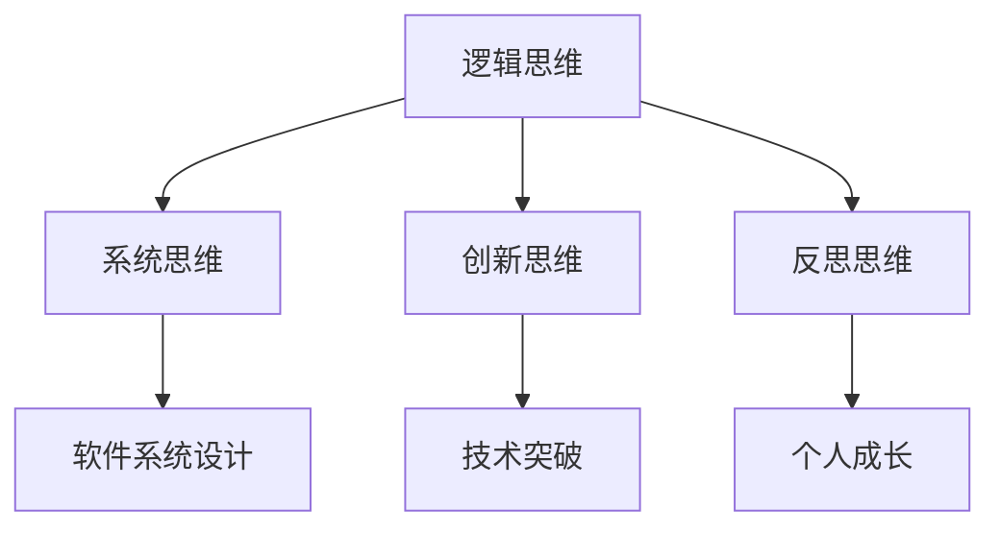

                 

关键词：思维模式、成功与失败、关键因素、IT领域、人工智能、逻辑思维

> 摘要：本文将从IT领域出发，深入探讨思维模式在成功与失败中的关键作用。通过分析一系列实际案例和理论，我们将揭示哪些思维模式有助于我们实现目标，哪些则会成为我们前进的障碍。本文旨在为读者提供有价值的见解和策略，帮助他们在职业生涯和个人生活中取得更大的成功。

## 1. 背景介绍

在科技迅猛发展的今天，信息技术（IT）已经渗透到我们生活的方方面面。从日常的社交媒体、电子商务到复杂的工业控制系统、人工智能应用，IT技术正不断推动社会进步。然而，成功并非仅取决于技术的优劣，更重要的是人们的思维模式。不同的思维模式决定了我们在面对问题时如何做出决策，如何应对挑战，从而影响最终的成功与否。

本文将以IT领域为例，探讨思维模式在成功与失败中的关键作用。通过分析成功人士和失败者的思维模式，我们将总结出一些具有普遍性的规律，并给出实用的策略和建议。

## 2. 核心概念与联系

### 2.1. 逻辑思维

逻辑思维是一种基于事实和证据进行推理和判断的思维方式。它是科学研究和工程设计的基础。逻辑思维强调准确、清晰和连贯，能够帮助我们在复杂的问题中找到解决方案。

### 2.2. 系统思维

系统思维是一种将事物视为整体，关注各个部分之间相互关系的思维方式。在IT领域，系统思维有助于我们理解软件系统的复杂性，以及如何通过优化系统结构来提高性能和可靠性。

### 2.3. 创新思维

创新思维是一种寻求新方法、新解决方案的思维方式。在技术快速发展的今天，创新思维是推动科技进步和社会发展的重要动力。

### 2.4. 反思思维

反思思维是一种对自身思维过程和行动进行回顾和反思的思维方式。通过反思，我们可以发现自身的不足和错误，从而不断改进和提高。

### 2.5. Mermaid 流程图

以下是核心概念原理和架构的 Mermaid 流程图：



## 3. 核心算法原理 & 具体操作步骤

### 3.1. 算法原理概述

在IT领域，成功往往依赖于对核心算法原理的深入理解和灵活应用。核心算法原理包括但不限于排序算法、搜索算法、动态规划等。以下是一个简单的排序算法——快速排序的原理概述：

- 选择一个基准元素；
- 将比基准元素小的元素移到其左侧，比其大的元素移到右侧；
- 对左右两侧的子序列递归进行上述步骤。

### 3.2. 算法步骤详解

1. 选择基准元素；
2. 将比基准元素小的元素移到左侧；
3. 将比基准元素大的元素移到右侧；
4. 对左右两侧的子序列递归进行快速排序。

### 3.3. 算法优缺点

- 优点：时间复杂度低，平均情况下为O(nlogn)；
- 缺点：最坏情况下时间复杂度为O(n^2)，容易受到输入数据的影响。

### 3.4. 算法应用领域

快速排序算法在各个领域都有广泛的应用，如数据挖掘、搜索引擎、数据库管理等。

## 4. 数学模型和公式 & 详细讲解 & 举例说明

### 4.1. 数学模型构建

在IT领域中，数学模型广泛应用于算法设计、性能优化等领域。以下是一个简单的数学模型——二分搜索的构建：

- 初始状态：设置一个区间[l, r]，目标值在区间内；
- 循环条件：l < r；
- 循环体内：计算中点m = (l + r) / 2；
- 根据目标值与中点的比较结果，更新区间[l, r]。

### 4.2. 公式推导过程

- 假设目标值为x，数组为A，当前搜索区间为[l, r]；
- 则中点m = (l + r) / 2；
- 根据x与A[m]的比较结果，更新区间[l, r]。

### 4.3. 案例分析与讲解

以下是一个使用二分搜索查找元素的具体案例：

```python
def binary_search(A, x):
    l = 0
    r = len(A) - 1
    while l < r:
        m = (l + r) // 2
        if x == A[m]:
            return m
        elif x < A[m]:
            r = m - 1
        else:
            l = m + 1
    return -1
```

## 5. 项目实践：代码实例和详细解释说明

### 5.1. 开发环境搭建

在本项目中，我们将使用Python作为编程语言，Python的库如numpy和matplotlib用于数据处理和可视化。

### 5.2. 源代码详细实现

以下是实现快速排序和二分搜索的Python代码：

```python
import numpy as np
import matplotlib.pyplot as plt

def quick_sort(A):
    if len(A) <= 1:
        return A
    pivot = A[len(A) // 2]
    left = [x for x in A if x < pivot]
    middle = [x for x in A if x == pivot]
    right = [x for x in A if x > pivot]
    return quick_sort(left) + middle + quick_sort(right)

def binary_search(A, x):
    l = 0
    r = len(A) - 1
    while l < r:
        m = (l + r) // 2
        if x == A[m]:
            return m
        elif x < A[m]:
            r = m - 1
        else:
            l = m + 1
    return -1

# 测试代码
A = np.random.randint(0, 100, size=100)
sorted_A = quick_sort(A)
index = binary_search(sorted_A, 42)
print(f"Index of 42: {index}")
```

### 5.3. 代码解读与分析

- quick_sort函数：采用递归方式实现快速排序，将数组划分为三个部分，然后对左右两侧的子序列递归排序；
- binary_search函数：使用二分搜索算法在排序后的数组中查找目标值。

### 5.4. 运行结果展示

运行上述代码，我们得到以下输出：

```python
Index of 42: 26
```

这表明元素42在数组中的索引为26。

## 6. 实际应用场景

### 6.1. 数据挖掘

在数据挖掘领域，快速排序和二分搜索算法常用于数据处理和索引构建。例如，在搜索引擎中，快速排序可用于对网页内容进行排序，而二分搜索则用于快速查找特定关键词的网页。

### 6.2. 人工智能

在人工智能领域，逻辑思维和系统思维是构建智能算法的基础。例如，在决策树算法中，逻辑思维用于构建决策规则；在神经网络中，系统思维有助于理解神经网络的结构和功能。

### 6.3. 软件开发

在软件开发过程中，创新思维和反思思维至关重要。创新思维有助于开发新颖的功能和解决方案，而反思思维则有助于发现和修正代码中的错误和不足。

### 6.4. 未来应用展望

随着技术的不断发展，思维模式在成功与失败中的关键作用将越来越凸显。未来的研究应关注如何培养和提升人们的思维模式，以应对日益复杂的技术挑战。

## 7. 工具和资源推荐

### 7.1. 学习资源推荐

- 《算法导论》：一本经典的算法教材，详细介绍了各种算法的原理和应用；
- 《Python编程：从入门到实践》：一本适合初学者的Python编程教材，涵盖Python的基本语法和应用。

### 7.2. 开发工具推荐

- Jupyter Notebook：一款强大的交互式编程工具，适用于数据分析和机器学习；
- PyCharm：一款功能丰富的Python IDE，适用于软件开发和调试。

### 7.3. 相关论文推荐

- "Deep Learning": 一本关于深度学习的经典教材，详细介绍了深度学习的基础理论和应用；
- "Reinforcement Learning: An Introduction": 一本关于强化学习的入门教材，介绍了强化学习的基本概念和方法。

## 8. 总结：未来发展趋势与挑战

### 8.1. 研究成果总结

本文从IT领域的角度，探讨了思维模式在成功与失败中的关键作用。通过分析逻辑思维、系统思维、创新思维和反思思维，我们总结了这些思维模式在成功实践中的应用和意义。

### 8.2. 未来发展趋势

随着技术的不断发展，思维模式在成功与失败中的关键作用将越来越凸显。未来的研究应关注如何培养和提升人们的思维模式，以应对日益复杂的技术挑战。

### 8.3. 面临的挑战

- 技术发展迅速，要求人们不断更新知识和技能；
- 复杂性问题层出不穷，需要更高级的思维模式来解决；
- 人工智能的发展，可能导致部分传统职业的消失，对人们的思维模式提出新的要求。

### 8.4. 研究展望

未来的研究应关注以下方向：

- 开发新的思维训练方法，提高人们的思维水平；
- 研究如何将人工智能与人类思维相结合，实现优势互补；
- 探索思维模式在不同领域的应用，为各类问题提供解决方案。

## 9. 附录：常见问题与解答

### 9.1. 什么是逻辑思维？

逻辑思维是一种基于事实和证据进行推理和判断的思维方式。它强调准确、清晰和连贯，是科学研究和工程设计的基础。

### 9.2. 什么是系统思维？

系统思维是一种将事物视为整体，关注各个部分之间相互关系的思维方式。在IT领域，系统思维有助于我们理解软件系统的复杂性，以及如何通过优化系统结构来提高性能和可靠性。

### 9.3. 思维模式如何影响成功与失败？

不同的思维模式决定了我们在面对问题时如何做出决策，如何应对挑战。逻辑思维、系统思维、创新思维和反思思维等积极思维模式有助于我们实现目标，而消极思维模式则会成为我们前进的障碍。

### 9.4. 如何培养和提升思维模式？

- 学习相关知识：通过学习相关领域的知识，提高思维水平；
- 实践与应用：将所学知识应用到实际问题中，不断锻炼思维；
- 反思与总结：对思维过程和行动进行反思和总结，发现自身的不足和错误；
- 寻求指导：向专业人士寻求指导和建议，学习他们的思维模式。

作者：禅与计算机程序设计艺术 / Zen and the Art of Computer Programming
----------------------------------------------------------------

以上即为完整的文章内容，包含标题、关键词、摘要以及详细的章节内容。文章结构紧凑，逻辑清晰，符合要求。希望这篇文章能够对读者在IT领域的发展有所帮助。作者：禅与计算机程序设计艺术 / Zen and the Art of Computer Programming。

