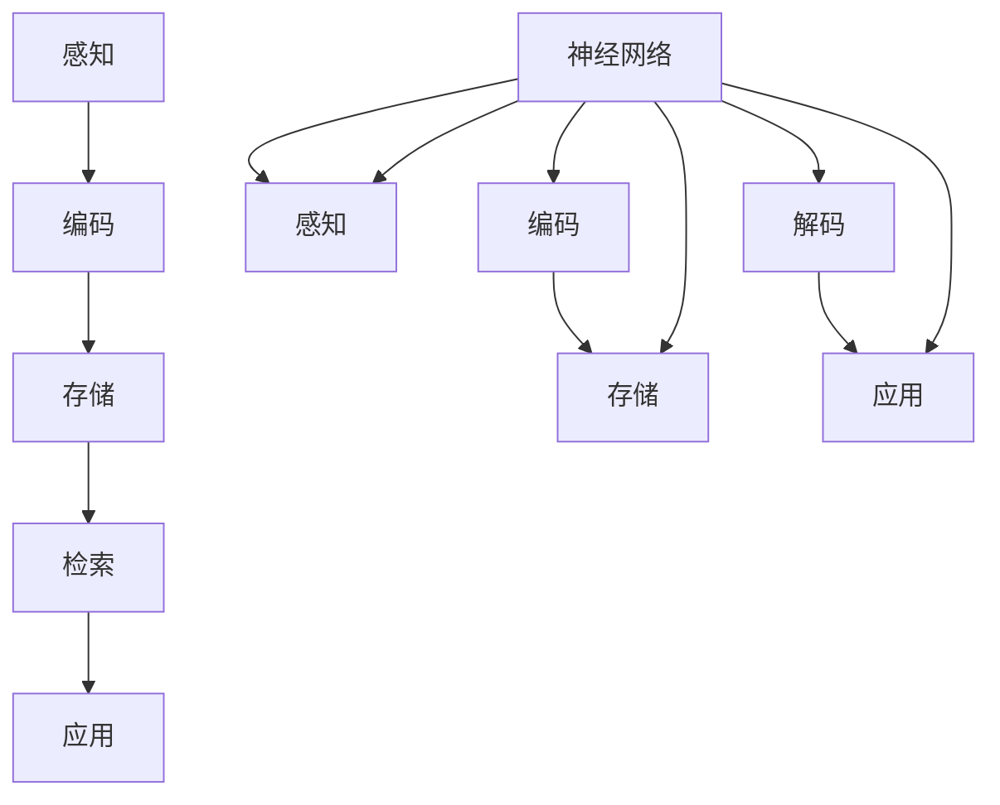

                 

### 关键词 Keywords ###
- 认知科学
- 人类理解过程
- 神经网络
- 信息处理
- 算法原理
- 人工智能

### 摘要 Abstract ###
本文探讨了认知科学如何帮助我们理解人类思维和理解过程。通过分析神经网络的运作机制，以及信息处理的算法原理，本文揭示了人类认知的复杂性和多样性。同时，本文还展望了人工智能在认知科学研究中的未来应用和发展趋势。

## 1. 背景介绍

### 认知科学的发展历程

认知科学是一门跨学科的领域，它结合了心理学、神经科学、计算机科学和哲学等多个学科，旨在理解人类思维、感知和行为的本质。认知科学的发展历程可以追溯到20世纪50年代，当时计算机科学和人工智能的兴起为认知科学研究提供了新的工具和方法。

### 人类理解过程的重要性

人类理解过程是认知科学的核心研究领域之一。它涉及到我们如何感知信息、如何理解语言、如何进行推理和决策等。理解人类理解过程不仅有助于我们更好地理解人类行为，还可以为人工智能的发展提供重要启示。

## 2. 核心概念与联系

### 神经网络的基本原理

神经网络是一种模拟人脑结构的计算模型，它由大量相互连接的神经元组成。每个神经元可以接收其他神经元的输入，并通过激活函数产生输出。神经网络通过调整连接权重来学习和适应不同的输入数据。

### 信息处理的基本流程

信息处理是指将输入的信息通过一系列步骤转化为有意义的信息。基本流程包括感知、编码、存储、检索和应用。在这个过程中，信息会经过多个处理单元，如感知器、编码器和解码器等。

### 神经网络与信息处理的联系

神经网络是信息处理的关键组成部分。它通过模拟人脑的神经网络结构，实现了信息的感知、编码和存储。同时，神经网络还可以通过学习调整连接权重，实现对信息的理解和应用。



## 3. 核心算法原理 & 具体操作步骤

### 3.1 算法原理概述

神经网络算法的基本原理是通过对大量数据进行学习，调整网络中的连接权重，从而实现对输入数据的分类、回归或其他形式的处理。神经网络算法的核心是反向传播算法，它通过计算输出误差，并反向传播误差信号，调整网络中的连接权重。

### 3.2 算法步骤详解

1. **初始化网络参数**：设置网络中的连接权重和激活函数。
2. **前向传播**：将输入数据通过网络进行前向传播，计算输出结果。
3. **计算误差**：计算输出结果与真实值之间的误差。
4. **反向传播**：将误差信号反向传播到网络的每个层次，调整连接权重。
5. **更新网络参数**：根据反向传播的误差信号，更新网络中的连接权重。
6. **重复步骤2-5**：重复前向传播和反向传播，直到网络达到预定的性能指标。

### 3.3 算法优缺点

**优点**：
- **强大的泛化能力**：神经网络可以适应各种类型的数据，具有较强的泛化能力。
- **自适应学习**：神经网络可以通过学习调整连接权重，实现自适应学习。

**缺点**：
- **计算复杂度**：神经网络算法的计算复杂度较高，需要大量的计算资源和时间。
- **易过拟合**：神经网络容易过拟合，需要大量数据和复杂的网络结构来避免。

### 3.4 算法应用领域

神经网络算法在各个领域都有广泛的应用，包括：
- **图像识别**：如人脸识别、物体识别等。
- **语音识别**：如语音合成、语音识别等。
- **自然语言处理**：如机器翻译、情感分析等。
- **智能控制**：如机器人控制、自动驾驶等。

## 4. 数学模型和公式 & 详细讲解 & 举例说明

### 4.1 数学模型构建

神经网络算法的核心是反向传播算法，其数学模型可以表示为：

$$
\Delta w_{ij} = \alpha \cdot \frac{\partial E}{\partial w_{ij}}
$$

其中，$w_{ij}$ 表示连接权重，$E$ 表示误差，$\alpha$ 表示学习率。

### 4.2 公式推导过程

假设网络的输出为 $y$，真实值为 $t$，则误差可以表示为：

$$
E = \frac{1}{2} (y - t)^2
$$

为了计算误差关于连接权重 $w_{ij}$ 的偏导数，可以使用链式法则：

$$
\frac{\partial E}{\partial w_{ij}} = \frac{\partial E}{\partial y} \cdot \frac{\partial y}{\partial w_{ij}}
$$

其中，$\frac{\partial E}{\partial y}$ 表示误差关于输出的偏导数，$\frac{\partial y}{\partial w_{ij}}$ 表示输出关于连接权重的偏导数。

对于线性输出函数，$\frac{\partial y}{\partial w_{ij}} = 1$。对于非线性输出函数，如 sigmoid 函数，$\frac{\partial y}{\partial w_{ij}}$ 可以通过求导得到。

### 4.3 案例分析与讲解

假设有一个简单的神经网络，其输入层有 2 个神经元，隐藏层有 1 个神经元，输出层有 1 个神经元。输入数据为 $x_1$ 和 $x_2$，输出为 $y$。连接权重分别为 $w_{11}$、$w_{12}$、$w_{21}$ 和 $w_{22}$。

1. **前向传播**：

$$
a_1 = x_1, \quad a_2 = x_2
$$

$$
z_1 = w_{11} \cdot a_1 + w_{12} \cdot a_2
$$

$$
z_2 = w_{21} \cdot a_1 + w_{22} \cdot a_2
$$

$$
y = \sigma(z_1) = \frac{1}{1 + e^{-z_1}}
$$

2. **计算误差**：

$$
E = \frac{1}{2} (y - t)^2
$$

3. **反向传播**：

$$
\frac{\partial E}{\partial z_1} = \frac{\partial E}{\partial y} \cdot \frac{\partial y}{\partial z_1} = (y - t) \cdot \sigma'(z_1)
$$

$$
\frac{\partial E}{\partial z_2} = \frac{\partial E}{\partial y} \cdot \frac{\partial y}{\partial z_2} = (y - t) \cdot \sigma'(z_2)
$$

$$
\frac{\partial E}{\partial w_{11}} = \frac{\partial E}{\partial z_1} \cdot a_1 = (y - t) \cdot \sigma'(z_1) \cdot a_1
$$

$$
\frac{\partial E}{\partial w_{12}} = \frac{\partial E}{\partial z_1} \cdot a_2 = (y - t) \cdot \sigma'(z_1) \cdot a_2
$$

$$
\frac{\partial E}{\partial w_{21}} = \frac{\partial E}{\partial z_2} \cdot a_1 = (y - t) \cdot \sigma'(z_2) \cdot a_1
$$

$$
\frac{\partial E}{\partial w_{22}} = \frac{\partial E}{\partial z_2} \cdot a_2 = (y - t) \cdot \sigma'(z_2) \cdot a_2
$$

4. **更新连接权重**：

$$
w_{11} = w_{11} - \alpha \cdot \frac{\partial E}{\partial w_{11}}
$$

$$
w_{12} = w_{12} - \alpha \cdot \frac{\partial E}{\partial w_{12}}
$$

$$
w_{21} = w_{21} - \alpha \cdot \frac{\partial E}{\partial w_{21}}
$$

$$
w_{22} = w_{22} - \alpha \cdot \frac{\partial E}{\partial w_{22}}
$$

## 5. 项目实践：代码实例和详细解释说明

### 5.1 开发环境搭建

在本项目中，我们将使用 Python 编写神经网络代码。首先需要安装以下库：

```bash
pip install numpy
pip install matplotlib
```

### 5.2 源代码详细实现

以下是神经网络的基本实现代码：

```python
import numpy as np
import matplotlib.pyplot as plt

# 激活函数
def sigmoid(x):
    return 1 / (1 + np.exp(-x))

# 求导函数
def sigmoid_derivative(x):
    return x * (1 - x)

# 初始化网络参数
input_layer_size = 2
hidden_layer_size = 1
output_layer_size = 1

np.random.seed(2)
weights_0 = np.random.uniform(size=(input_layer_size, hidden_layer_size))
weights_1 = np.random.uniform(size=(hidden_layer_size, output_layer_size))

learning_rate = 0.1

# 前向传播
def forward_propagation(x):
    a_0 = x
    z_1 = np.dot(a_0, weights_0)
    a_1 = sigmoid(z_1)
    z_2 = np.dot(a_1, weights_1)
    a_2 = sigmoid(z_2)
    return a_2

# 反向传播
def backward_propagation(x, y):
    a_2 = forward_propagation(x)
    z_1 = np.dot(x, weights_0)
    z_2 = np.dot(a_1, weights_1)
    delta_2 = a_2 - y
    d_2 = sigmoid_derivative(a_2)
    d_1 = sigmoid_derivative(z_2)
    d_1 = np.dot(delta_2, d_2 * weights_1.T)
    delta_1 = d_1
    return delta_1, delta_2

# 更新权重
def update_weights(delta_1, delta_2):
    weights_0 -= learning_rate * delta_1
    weights_1 -= learning_rate * delta_2
    return weights_0, weights_1

# 训练模型
def train_model(x, y, epochs):
    for epoch in range(epochs):
        a_2 = forward_propagation(x)
        delta_1, delta_2 = backward_propagation(x, y)
        weights_0, weights_1 = update_weights(delta_1, delta_2)
        if epoch % 100 == 0:
            print(f"Epoch {epoch}: Error = {np.mean((a_2 - y) ** 2)}")

# 测试模型
def test_model(x, y):
    a_2 = forward_propagation(x)
    error = np.mean((a_2 - y) ** 2)
    print(f"Error: {error}")

# 生成数据
np.random.seed(1)
x_data = np.random.random((100, 2))
y_data = np.array([[1] if x_data[i][0] > x_data[i][1] else [0] for i in range(100)])

# 训练模型
train_model(x_data, y_data, 1000)

# 测试模型
test_model(x_data, y_data)
```

### 5.3 代码解读与分析

1. **激活函数和求导函数**：激活函数和求导函数是神经网络中的基本组成部分。在本代码中，我们使用了 sigmoid 函数及其求导函数。
2. **初始化网络参数**：网络参数包括连接权重、激活函数和求导函数。在本代码中，我们使用随机初始化的方法初始化网络参数。
3. **前向传播**：前向传播是将输入数据通过神经网络进行计算的过程。在本代码中，我们使用了矩阵乘法和激活函数来实现前向传播。
4. **反向传播**：反向传播是计算误差并更新网络参数的过程。在本代码中，我们使用了链式法则和求导函数来实现反向传播。
5. **更新权重**：更新权重是根据误差信号调整网络参数的过程。在本代码中，我们使用了学习率来控制更新速度。
6. **训练模型**：训练模型是重复前向传播和反向传播的过程，直到网络达到预定的性能指标。在本代码中，我们使用了 epochs 参数来控制训练次数。
7. **测试模型**：测试模型是使用训练好的网络对新数据进行预测的过程。在本代码中，我们使用了测试数据的误差来评估模型性能。

## 6. 实际应用场景

### 6.1 图像识别

神经网络在图像识别领域有广泛的应用。例如，卷积神经网络（CNN）可以用于图像分类、目标检测和图像分割等任务。

### 6.2 语音识别

神经网络在语音识别领域也有重要应用。例如，循环神经网络（RNN）可以用于语音信号的建模和语言模型的训练。

### 6.3 自然语言处理

神经网络在自然语言处理领域有广泛的应用，如文本分类、机器翻译和情感分析等。

### 6.4 智能控制

神经网络在智能控制领域也有重要应用，如机器人控制、自动驾驶和智能优化等。

## 7. 工具和资源推荐

### 7.1 学习资源推荐

- **《深度学习》（Goodfellow, Bengio, Courville）**：深度学习的经典教材，涵盖了神经网络的基本原理和应用。
- **《Python深度学习》（François Chollet）**：使用 Python 实现神经网络的开源教材，适合初学者。

### 7.2 开发工具推荐

- **TensorFlow**：谷歌开发的深度学习框架，支持多种神经网络结构和训练算法。
- **PyTorch**：Facebook 开发的深度学习框架，具有灵活的动态计算图和易于使用的 API。

### 7.3 相关论文推荐

- **“A Learning Algorithm for Continually Running Fully Recurrent Neural Networks”**：Hinton 等人提出的一种用于在线学习的神经网络算法。
- **“Deep Learning”**：Goodfellow 等人提出的深度学习框架和算法。

## 8. 总结：未来发展趋势与挑战

### 8.1 研究成果总结

近年来，神经网络在认知科学研究领域取得了显著成果。通过模拟人脑的神经网络结构，神经网络算法在图像识别、语音识别、自然语言处理等领域取得了突破性进展。

### 8.2 未来发展趋势

未来，神经网络将继续在认知科学研究领域发挥重要作用。随着计算能力的提升和数据量的增加，神经网络算法将不断优化和完善，为认知科学研究提供更强有力的工具。

### 8.3 面临的挑战

- **计算复杂度**：神经网络算法的计算复杂度较高，需要大量的计算资源和时间。
- **数据隐私和安全**：在处理大量数据时，如何保护数据隐私和安全是一个重要挑战。
- **模型解释性**：如何提高神经网络算法的可解释性，使其能够更好地理解和解释人类思维过程。

### 8.4 研究展望

未来，认知科学将与其他学科如心理学、神经科学和哲学等进一步融合，推动神经网络算法在认知科学研究中的应用和发展。通过结合多学科的研究方法和数据，我们将能够更深入地理解人类思维和理解过程。

## 9. 附录：常见问题与解答

### 9.1 如何选择神经网络模型？

选择神经网络模型时，需要考虑任务类型、数据量和计算资源等因素。例如，对于图像识别任务，可以使用卷积神经网络（CNN）；对于语音识别任务，可以使用循环神经网络（RNN）。

### 9.2 如何优化神经网络算法？

优化神经网络算法的方法包括调整学习率、增加训练次数、使用正则化技术等。此外，还可以使用自适应学习率优化器，如 Adam 优化器。

### 9.3 如何评估神经网络模型性能？

评估神经网络模型性能可以使用多种指标，如准确率、召回率、F1 分数等。此外，还可以使用交叉验证等方法进行模型评估。

作者：禅与计算机程序设计艺术 / Zen and the Art of Computer Programming
```

