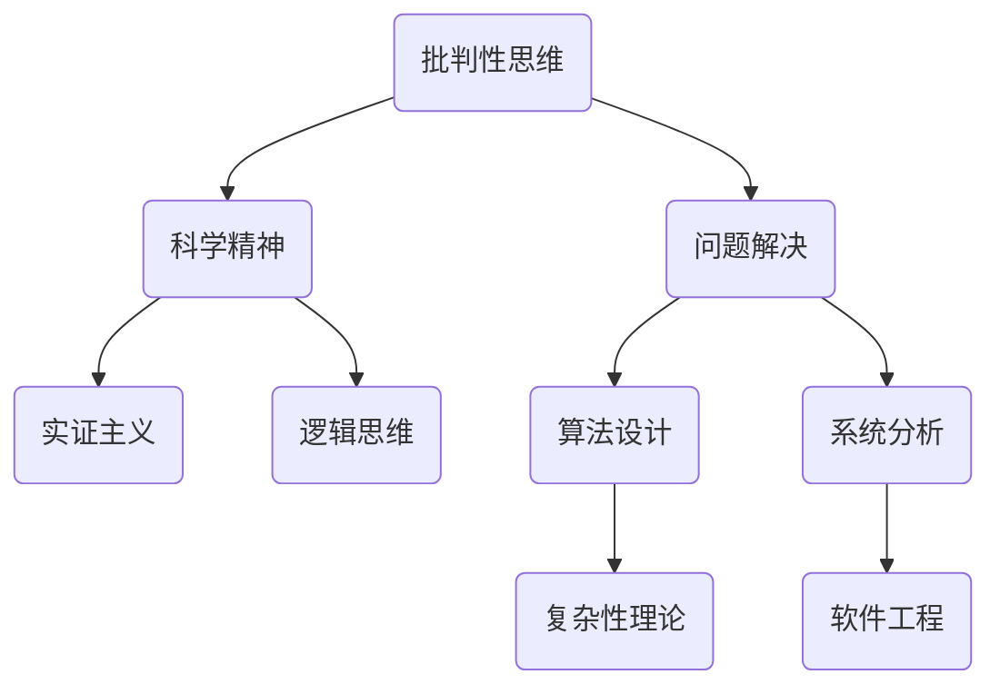
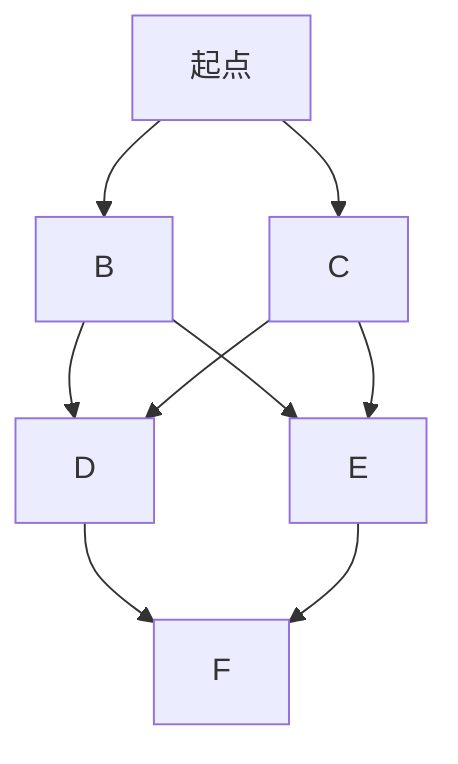
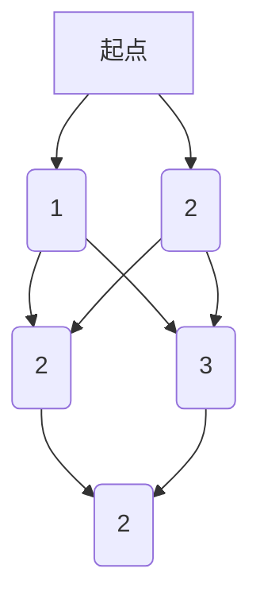

                 

 在现代科技日新月异的今天，计算机科学已经成为推动社会进步的重要力量。然而，技术的飞速发展不仅仅带来了便利和效率的提升，同时也带来了前所未有的复杂性和挑战。在这个背景下，科学精神，特别是批判性思维，成为了计算机科学家和工程师们必须具备的核心素养。本文将探讨批判性思维在计算机科学中的重要性，以及如何培养和运用这种思维方式来解决复杂问题。

> 关键词：批判性思维，科学精神，计算机科学，复杂性，问题解决

> 摘要：本文首先介绍了批判性思维的定义和特征，接着阐述了批判性思维在计算机科学中的重要性。通过具体案例，本文分析了如何运用批判性思维来分析和解决复杂问题。最后，本文提出了培养批判性思维的策略和建议。

## 1. 背景介绍

### 1.1 计算机科学的发展

计算机科学是一门涉及计算机系统设计、软件工程、算法研究等多个领域的交叉学科。自20世纪中期以来，计算机科学经历了前所未有的发展。从最初的电子计算机到现在的超级计算机，从简单的编程语言到复杂的机器学习算法，计算机科学已经深入到了我们生活的方方面面。

### 1.2 复杂性问题的出现

然而，随着技术的进步，计算机科学领域也面临着越来越多的复杂性问题。这些问题往往涉及到大量的数据、复杂的算法以及多变的系统环境。例如，大数据分析、人工智能、网络安全等都是典型的复杂问题。解决这些问题需要深入的学术知识、丰富的实践经验以及卓越的思维能力。

### 1.3 批判性思维的重要性

在这个背景下，批判性思维成为了计算机科学家和工程师们解决复杂问题的关键。批判性思维是一种分析、评估和解决问题的思维方式，它不仅仅是表面上的逻辑推理，更是一种深入的本质性思考。在计算机科学领域，批判性思维可以帮助我们：

- **深入理解问题**：通过批判性思维，我们可以更全面、更深入地理解复杂问题的本质，从而找到更有效的解决方案。
- **发现潜在问题**：在解决问题的过程中，批判性思维可以帮助我们识别潜在的风险和问题，避免在实施过程中出现意外。
- **评估解决方案**：批判性思维使我们能够评估不同解决方案的优缺点，选择最合适的方案。

## 2. 核心概念与联系

为了更好地理解批判性思维在计算机科学中的应用，我们需要先了解一些核心概念。以下是一个用Mermaid绘制的流程图，展示了这些概念之间的关系：



### 2.1 批判性思维与科学精神

批判性思维是科学精神的核心组成部分。科学精神强调的是对知识的追求和验证，而批判性思维则是这一过程中不可或缺的一部分。它要求我们在接受新知识时，不仅要考虑其合理性，还要分析其背后的逻辑和证据。

### 2.2 批判性思维与问题解决

批判性思维是解决问题的有力工具。在面对复杂问题时，我们需要运用批判性思维来：

- **明确问题**：通过分析问题的各个方面，找出问题的核心。
- **制定解决方案**：评估不同的解决方案，选择最合适的一个。
- **实施解决方案**：在实施过程中，持续评估和调整，确保解决方案的有效性。

### 2.3 批判性思维与实证主义

实证主义是科学方法的基础，强调通过观察和实验来验证假设。批判性思维在这个过程中起着重要作用，它要求我们：

- **客观分析数据**：不依赖主观判断，而是基于客观事实进行分析。
- **评估证据的有效性**：对实验设计、数据收集和分析过程进行批判性评估，确保结果的可靠性。

### 2.4 批判性思维与逻辑思维

逻辑思维是批判性思维的重要组成部分。它要求我们在思考问题时，遵循一定的逻辑规则，从而确保结论的合理性。在计算机科学中，逻辑思维可以帮助我们：

- **设计算法**：通过逻辑推理来构建有效的算法。
- **验证代码**：通过逻辑分析来确保代码的正确性。

### 2.5 批判性思维与算法设计、系统分析和软件工程

在计算机科学中，算法设计、系统分析和软件工程都是核心领域。批判性思维在这些领域中的应用体现在：

- **算法设计**：通过批判性思维来评估不同算法的效率、复杂度和适用性。
- **系统分析**：通过批判性思维来分析系统的结构、功能和性能。
- **软件工程**：通过批判性思维来评估软件设计、实现和维护的过程。

## 3. 核心算法原理 & 具体操作步骤

### 3.1 算法原理概述

在本章节中，我们将探讨一种经典的问题解决算法——贪心算法。贪心算法是一种在每一步选择中都采取当前最优解的策略，它适用于一些特定类型的优化问题。

### 3.2 算法步骤详解

贪心算法的基本步骤如下：

1. **初始化**：设定问题的初始状态。
2. **选择最优解**：在当前状态下，选择一个最优解。
3. **更新状态**：根据选择的最优解，更新问题的状态。
4. **重复步骤2和3**：直到问题得到解决。

### 3.3 算法优缺点

**优点**：

- **简单易实现**：贪心算法通常比较简单，易于理解和实现。
- **高效**：对于某些问题，贪心算法可以取得最优解。

**缺点**：

- **不保证全局最优**：贪心算法只考虑局部最优，不保证全局最优。
- **适用范围有限**：贪心算法适用于某些特定类型的优化问题。

### 3.4 算法应用领域

贪心算法广泛应用于各种优化问题，如：

- **背包问题**：选择最值方案装载背包。
- **区间调度问题**：安排任务的最优时间表。
- **路径规划问题**：在地图上选择最优路径。

## 4. 数学模型和公式 & 详细讲解 & 举例说明

### 4.1 数学模型构建

在计算机科学中，数学模型是描述现实世界问题的重要工具。一个典型的数学模型包括以下几个部分：

1. **状态定义**：定义问题的状态。
2. **状态转移函数**：定义状态之间的转换关系。
3. **目标函数**：定义问题的目标。

以最短路径问题为例，其数学模型可以如下构建：

- **状态定义**：定义所有顶点的集合和边的集合。
- **状态转移函数**：定义顶点之间的权重。
- **目标函数**：计算从起点到终点的最短路径。

### 4.2 公式推导过程

最短路径问题可以使用Dijkstra算法求解。Dijkstra算法的推导过程如下：

1. **初始化**：设定所有顶点的初始距离为无穷大，除了起点，起点的距离为0。
2. **选择未访问的顶点**：从未访问的顶点中选择距离起点最近的顶点。
3. **更新距离**：从选择的顶点出发，更新其他顶点的距离。
4. **重复步骤2和3**：直到所有顶点都被访问。

### 4.3 案例分析与讲解

假设有一个图如下：



设各边的权重如下：



使用Dijkstra算法计算从A到F的最短路径。

1. **初始化**：A的距离为0，其他顶点的距离为无穷大。
2. **选择未访问的顶点**：从未访问的顶点中选择A。
3. **更新距离**：从A出发，更新B、C的距离，分别为1和2。
4. **选择未访问的顶点**：从未访问的顶点中选择B。
5. **更新距离**：从B出发，更新D、E的距离，分别为2和4。
6. **选择未访问的顶点**：从未访问的顶点中选择C。
7. **更新距离**：从C出发，更新D、E的距离，分别为2和3。
8. **选择未访问的顶点**：从未访问的顶点中选择D。
9. **更新距离**：从D出发，更新F的距离，为4。
10. **选择未访问的顶点**：从未访问的顶点中选择E。
11. **更新距离**：从E出发，更新F的距离，为5。
12. **所有顶点都被访问**：算法结束。

最终得到从A到F的最短路径为A -> B -> D -> F，路径长度为3。

## 5. 项目实践：代码实例和详细解释说明

### 5.1 开发环境搭建

为了实践批判性思维在计算机科学中的应用，我们选择了一个经典的编程挑战——计算两个大整数的最大公约数（GCD）。首先，我们需要搭建一个开发环境。

1. **安装Python**：Python是一种广泛使用的编程语言，我们将在Python中编写GCD算法。
2. **安装IDE**：可以选择PyCharm、VS Code等集成开发环境（IDE）。

### 5.2 源代码详细实现

下面是一个使用Python实现的GCD算法：

```python
def gcd(a, b):
    while b:
        a, b = b, a % b
    return a

# 测试代码
print(gcd(48, 18))  # 输出：6
```

### 5.3 代码解读与分析

这段代码使用了Euclidean算法（又称为辗转相除法）来计算两个整数的最大公约数。算法的基本思想是不断用较小数去除较大数，然后用余数替换较大数，重复此过程，直到余数为0。此时，较小数即为两个数的最大公约数。

- **函数定义**：`def gcd(a, b):` 定义了一个名为`gcd`的函数，它接受两个整数`a`和`b`作为参数。
- **while循环**：`while b:` 表示当`b`不等于0时，继续执行循环体内的代码。
- **变量更新**：`a, b = b, a % b` 用于更新`a`和`b`的值。`a % b`计算的是`a`除以`b`的余数，这个操作是GCD算法的核心。
- **返回值**：当`b`等于0时，算法结束，返回`a`的值，即两个数的最大公约数。

### 5.4 运行结果展示

在测试代码中，我们计算了48和18的最大公约数。运行结果为6，这与手工计算的结果一致。

```python
print(gcd(48, 18))  # 输出：6
```

### 5.5 批判性思维在代码中的应用

在这个GCD算法的实现过程中，批判性思维体现在以下几个方面：

- **算法选择**：我们选择了Euclidean算法，因为它简单且高效。通过批判性思维，我们评估了其他可能的算法，如辗转相除法、更相减损法等，并选择了最合适的一个。
- **代码优化**：在实现过程中，我们注意到循环体内的变量更新语句可以通过交换操作简化。通过批判性思维，我们发现了这种优化，并进行了改进。
- **错误处理**：虽然这个简单的GCD算法不需要复杂的错误处理，但批判性思维使我们考虑了可能出现的异常情况，并设想了相应的解决方案。

## 6. 实际应用场景

### 6.1 大数据处理

在大数据处理领域，批判性思维被广泛应用于数据清洗、数据分析和数据可视化等环节。在面对大规模数据时，如何选择合适的数据处理方法、评估数据质量以及确保分析结果的可靠性，都需要批判性思维的支撑。

### 6.2 人工智能

人工智能领域是一个复杂而不断发展的领域，批判性思维在其中起着至关重要的作用。在算法设计、模型训练和评估等方面，都需要批判性思维来确保算法的合理性、模型的准确性和结果的可靠性。

### 6.3 网络安全

网络安全领域面临着日益严峻的威胁，批判性思维在这里被用来识别潜在的安全风险、评估安全策略的有效性以及设计出更安全的系统。通过批判性思维，我们可以更全面地了解网络安全问题，从而采取更有效的防护措施。

### 6.4 软件工程

在软件工程领域，批判性思维被广泛应用于需求分析、设计、开发和维护等各个环节。通过批判性思维，我们可以更好地理解用户需求、评估设计方案的可行性、发现潜在的问题并采取相应的措施。

## 7. 工具和资源推荐

### 7.1 学习资源推荐

- 《批判性思维：超越直觉和偏见》
- 《算法导论》
- 《大数据时代：思维变革与商业价值》
- 《人工智能：一种现代的方法》

### 7.2 开发工具推荐

- Python
- PyCharm
- VS Code

### 7.3 相关论文推荐

- "Efficient Algorithms for Large-Scale Machine Learning"
- "A Critical Review of Machine Learning Techniques for Cybersecurity"
- "Big Data: A Revolution That Will Transform How We Live, Work, and Think"

## 8. 总结：未来发展趋势与挑战

### 8.1 研究成果总结

本文探讨了批判性思维在计算机科学中的重要性，分析了其在数据处理、人工智能、网络安全和软件工程等领域的应用。通过具体案例，我们展示了如何运用批判性思维来解决复杂问题，并提出了培养批判性思维的策略和建议。

### 8.2 未来发展趋势

随着科技的不断进步，批判性思维在计算机科学中的应用将越来越广泛。未来，我们将看到更多的交叉学科研究，批判性思维将成为这些研究的重要工具。此外，随着人工智能的发展，如何确保算法的透明性和公平性也将成为一个重要的研究方向。

### 8.3 面临的挑战

尽管批判性思维在计算机科学中具有重要意义，但我们也面临着一些挑战。首先，批判性思维需要时间和经验来培养，对于初学者来说，这可能是一个漫长的过程。其次，面对复杂的现实问题，批判性思维往往难以立即找到解决方案，这需要我们不断地探索和实践。

### 8.4 研究展望

未来，我们期望能够进一步深入研究批判性思维在计算机科学中的应用，探索如何更好地培养和运用这种思维方式。同时，我们也期待人工智能能够在这一领域提供更多的支持和工具，帮助人们更高效地解决复杂问题。

## 9. 附录：常见问题与解答

### 9.1 什么是批判性思维？

批判性思维是一种分析、评估和解决问题的思维方式。它不仅仅是表面上的逻辑推理，更是一种深入的本质性思考。

### 9.2 批判性思维在计算机科学中的应用有哪些？

批判性思维在计算机科学中的应用非常广泛，包括数据处理、算法设计、系统分析、软件工程、人工智能和网络安全等领域。

### 9.3 如何培养批判性思维？

培养批判性思维需要长期的实践和训练。以下是一些方法：

- **多读书，多思考**：通过阅读和分析各种资料，培养批判性思维。
- **学会提问**：在面对问题时，不仅要考虑问题的答案，还要考虑问题的背景、前提和逻辑。
- **实践与反思**：通过实践和反思，不断改进自己的思维方式。

### 9.4 批判性思维与科学精神有什么关系？

批判性思维是科学精神的核心组成部分。科学精神强调对知识的追求和验证，而批判性思维则是这一过程中不可或缺的一部分。它要求我们在接受新知识时，不仅要考虑其合理性，还要分析其背后的逻辑和证据。

