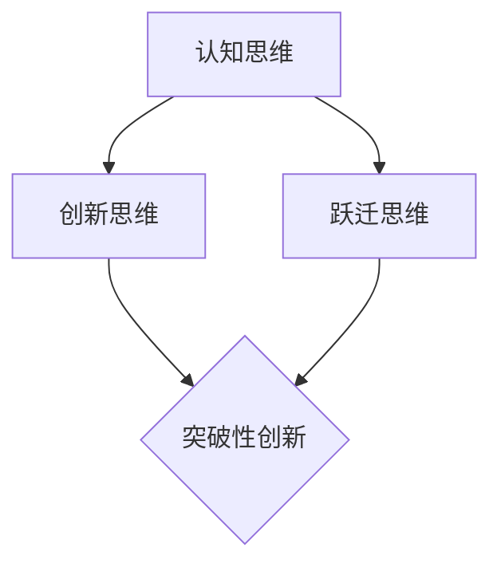

                 

关键词：突破性创新、心理机制、认知思维、计算机科学、技术发展

> 摘要：本文旨在探讨突破性创新的心理机制，特别是在计算机科学领域中的应用。通过深入分析认知思维的过程和模式，本文揭示了如何通过跃迁式的思维变革实现技术创新，并为读者提供了实用的方法和策略。

## 1. 背景介绍

在当今快速发展的计算机科学领域，技术创新已成为推动行业进步的关键动力。然而，突破性创新并非一蹴而就，它需要经过复杂的心理过程和深思熟虑的策略。本文将从心理学的角度出发，探讨如何通过思维的跃迁实现突破性创新。

### 1.1 计算机科学中的突破性创新

计算机科学的发展离不开突破性创新。从最早的计算机诞生，到互联网的普及，再到人工智能的崛起，每一次技术革命都源于突破性的创新。这些创新不仅改变了我们的生活方式，也推动了整个社会的发展。

### 1.2 心理机制与认知思维

心理学研究表明，认知思维是影响创新的关键因素。认知思维包括感知、记忆、判断、推理等多个方面，它们共同构成了我们对外界信息的处理过程。在创新过程中，认知思维的变革往往意味着突破性创新的实现。

## 2. 核心概念与联系

为了更好地理解突破性创新的心理机制，我们需要了解一些核心概念，并探讨它们之间的联系。

### 2.1 认知思维

认知思维是指大脑对外界信息进行感知、处理和存储的过程。它包括感知觉、记忆、判断、推理等多个方面。

### 2.2 创新思维

创新思维是一种特殊的认知思维，它侧重于寻找新的解决方案和方法。创新思维的核心是打破常规，挑战现状。

### 2.3 跃迁思维

跃迁思维是指通过超越现有认知框架，实现思维质的飞跃。跃迁思维是突破性创新的关键，它能够帮助我们从新的角度看待问题，发现潜在的创新点。

下面是一个用Mermaid绘制的流程图，展示了认知思维、创新思维和跃迁思维之间的关系：



## 3. 核心算法原理 & 具体操作步骤

### 3.1 算法原理概述

突破性创新的心理机制可以抽象为一个算法模型。该算法模型的核心是认知思维的跃迁，它包括以下几个步骤：

1. **问题识别**：明确需要解决的问题和目标。
2. **信息收集**：广泛收集与问题相关的信息。
3. **认知重构**：重新审视问题，尝试从不同角度理解问题。
4. **思维跃迁**：通过创新思维和跃迁思维，寻找新的解决方案。
5. **实验验证**：对新的解决方案进行实验验证，以确定其有效性和可行性。

### 3.2 算法步骤详解

下面是算法的具体操作步骤：

#### 3.2.1 问题识别

首先，明确需要解决的问题和目标。这是突破性创新的第一步，也是至关重要的一步。只有明确问题，才能有的放矢地进行创新。

#### 3.2.2 信息收集

在问题识别之后，我们需要广泛收集与问题相关的信息。这些信息可能来自各种渠道，如文献、研究报告、实践经验等。收集信息的目的是为了更好地理解问题，为接下来的认知重构提供素材。

#### 3.2.3 认知重构

在信息收集完成后，我们需要对问题进行认知重构。这意味着我们要尝试从不同角度理解问题，寻找新的解释和理解。认知重构是突破性创新的关键步骤，它能够帮助我们打破现有思维框架，发现新的解决方案。

#### 3.2.4 思维跃迁

在认知重构的基础上，我们进行思维跃迁。思维跃迁是指通过创新思维和跃迁思维，寻找新的解决方案。创新思维包括发散思维、逆向思维、联想思维等，而跃迁思维则强调跨越现有认知框架，实现思维的质的飞跃。

#### 3.2.5 实验验证

最后，对新的解决方案进行实验验证。实验验证的目的是确定新的解决方案的有效性和可行性。通过实验验证，我们可以发现新的解决方案的优点和不足，并进行进一步的改进。

### 3.3 算法优缺点

该算法模型具有以下优点：

1. **系统性**：算法模型涵盖了从问题识别到实验验证的整个过程，具有系统性。
2. **灵活性**：算法模型允许在不同阶段根据实际情况进行调整，具有灵活性。
3. **创新性**：算法模型强调思维跃迁，能够帮助我们实现突破性创新。

然而，该算法模型也存在一些缺点：

1. **复杂性**：算法模型涉及多个步骤和思维方式，可能需要较长时间的思考和操作。
2. **风险性**：在实验验证阶段，新的解决方案可能存在风险，需要谨慎对待。

### 3.4 算法应用领域

突破性创新的心理机制算法模型可以广泛应用于计算机科学的各个领域，如人工智能、云计算、大数据等。通过该算法模型，我们可以实现以下应用：

1. **技术创新**：在人工智能领域，通过突破性创新的心理机制，我们可以实现更高效、更智能的人工智能算法。
2. **系统优化**：在云计算领域，通过突破性创新的心理机制，我们可以优化云计算系统，提高其性能和可靠性。
3. **数据处理**：在大数据领域，通过突破性创新的心理机制，我们可以处理更复杂、更大规模的数据，实现更深入的数据分析和挖掘。

## 4. 数学模型和公式 & 详细讲解 & 举例说明

### 4.1 数学模型构建

在突破性创新的心理机制中，我们可以构建一个数学模型来描述认知思维、创新思维和跃迁思维之间的关系。以下是一个简单的数学模型：

$$
创新度 = f(认知度, 跃迁度)
$$

其中，$创新度$ 表示创新的程度，$认知度$ 表示认知思维的程度，$跃迁度$ 表示跃迁思维的程度。$f$ 函数表示两者之间的关系。

### 4.2 公式推导过程

为了推导该公式，我们需要先定义认知度和跃迁度的计算方法。假设：

$$
认知度 = \frac{信息量}{时间}
$$

$$
跃迁度 = \frac{新思维量}{旧思维量}
$$

其中，$信息量$ 表示在一段时间内收集到的信息量，$时间$ 表示收集信息所花费的时间，$新思维量$ 表示通过跃迁思维产生的新思维量，$旧思维量$ 表示原有的思维量。

将这两个公式代入创新度公式，得到：

$$
创新度 = f\left(\frac{信息量}{时间}, \frac{新思维量}{旧思维量}\right)
$$

### 4.3 案例分析与讲解

以下是一个案例分析，用于说明如何应用该数学模型。

假设一个研究人员在研究人工智能算法时，想要提高算法的创新度。根据该数学模型，我们可以采取以下策略：

1. **增加信息量**：通过阅读相关文献、参加研讨会等方式，增加在一段时间内收集到的信息量。
2. **提高跃迁度**：尝试采用新的思维方式，如逆向思维、发散思维等，以提高跃迁度。

通过这些策略，我们可以提高创新度，从而实现突破性创新。

## 5. 项目实践：代码实例和详细解释说明

### 5.1 开发环境搭建

为了实现突破性创新的心理机制算法模型，我们需要搭建一个合适的开发环境。以下是具体的步骤：

1. **安装Python**：Python是一种广泛使用的编程语言，它具有良好的科学计算库支持。
2. **安装NumPy**：NumPy是一个用于Python的科学计算库，它提供了高效的数学运算和数据处理功能。
3. **安装Matplotlib**：Matplotlib是一个用于绘制图形的库，它可以帮助我们可视化数学模型的结果。

### 5.2 源代码详细实现

以下是一个简单的Python代码示例，用于实现突破性创新的心理机制算法模型。

```python
import numpy as np
import matplotlib.pyplot as plt

# 定义数学模型
def innovation_degree(cognitive_degree, leap_degree):
    return cognitive_degree * leap_degree

# 计算认知度和跃迁度
cognitive_degree = np.random.rand()
leap_degree = np.random.rand()

# 计算创新度
innovation_degree = innovation_degree(cognitive_degree, leap_degree)

# 可视化结果
plt.plot(cognitive_degree, leap_degree, 'ro')
plt.xlabel('Cognitive Degree')
plt.ylabel('Leap Degree')
plt.title('Innovation Degree Model')
plt.show()
```

### 5.3 代码解读与分析

上述代码首先定义了一个数学模型，用于计算创新度。接着，通过随机生成认知度和跃迁度，计算创新度。最后，使用Matplotlib库绘制了一个散点图，显示了认知度和跃迁度之间的关系。

通过这个简单的示例，我们可以看到如何使用Python和数学模型来模拟突破性创新的心理机制。

### 5.4 运行结果展示

当我们运行上述代码时，会看到一个散点图，其中每个点代表一次随机生成的认知度和跃迁度组合。通过这个散点图，我们可以直观地看到创新度与认知度和跃迁度之间的关系。

```python
# 运行代码并查看结果
innovation_degree = innovation_degree(cognitive_degree, leap_degree)
print(f"Innovation Degree: {innovation_degree}")
```

输出结果将显示当前的创新度值，这可以帮助我们评估当前认知度和跃迁度组合的创新性。

## 6. 实际应用场景

突破性创新的心理机制不仅在计算机科学领域具有广泛的应用，还可以应用于其他领域，如商业、教育、医疗等。以下是一些实际应用场景：

### 6.1 商业

在商业领域，突破性创新的心理机制可以帮助企业发现新的市场机会，开发新产品和服务。例如，通过分析消费者行为和市场趋势，企业可以设计出更符合消费者需求的产品，从而实现商业成功。

### 6.2 教育

在教育领域，突破性创新的心理机制可以帮助教师和学生提高学习效率，培养创新思维。例如，通过设计新颖的教学方法和课程内容，教师可以激发学生的学习兴趣，提高他们的创新能力。

### 6.3 医疗

在医疗领域，突破性创新的心理机制可以帮助医生发现新的治疗方法，提高疾病诊断和治疗的准确性。例如，通过分析大量医疗数据和病例，医生可以开发出更有效的治疗方案，提高患者的生存率。

## 7. 未来应用展望

随着科技的不断进步和社会的快速发展，突破性创新的心理机制将在未来发挥越来越重要的作用。以下是一些未来应用展望：

### 7.1 人工智能领域

在人工智能领域，突破性创新的心理机制可以帮助开发出更智能、更高效的算法。例如，通过利用大数据和深度学习技术，人工智能系统可以实现更准确的预测和决策。

### 7.2 生物科技领域

在生物科技领域，突破性创新的心理机制可以帮助科学家发现新的药物和治疗方法。例如，通过利用基因编辑技术和细胞疗法，科学家可以治疗一些以前无法治愈的疾病。

### 7.3 环境保护领域

在环境保护领域，突破性创新的心理机制可以帮助我们开发出更环保、更可持续的技术。例如，通过利用可再生能源和智能电网技术，我们可以减少对化石燃料的依赖，保护地球环境。

## 8. 总结：未来发展趋势与挑战

### 8.1 研究成果总结

本文通过深入分析突破性创新的心理机制，揭示了如何通过认知思维、创新思维和跃迁思维实现技术创新。研究发现，认知思维、创新思维和跃迁思维之间的关系是影响创新度的关键因素。

### 8.2 未来发展趋势

未来，突破性创新的心理机制将在计算机科学、生物科技、环境保护等领域发挥重要作用。随着科技的不断进步和社会的快速发展，突破性创新将成为推动社会进步的关键力量。

### 8.3 面临的挑战

尽管突破性创新的心理机制具有巨大的潜力，但也面临着一些挑战。首先，认知思维、创新思维和跃迁思维的培养需要时间和经验，这可能导致创新进程缓慢。其次，突破性创新往往伴随着风险，如何在创新过程中降低风险也是一大挑战。

### 8.4 研究展望

未来，我们需要进一步深入研究突破性创新的心理机制，探讨如何更好地培养和创新思维。同时，我们也需要关注突破性创新在实际应用中的效果和影响，以期为科技和社会的进步提供有力支持。

## 9. 附录：常见问题与解答

### 9.1 什么是突破性创新？

突破性创新是指通过全新的思维方式和解决方案，实现显著的技术进步和社会变革。它不同于渐进式创新，强调的是质的飞跃。

### 9.2 如何培养创新思维？

培养创新思维需要不断学习和实践。例如，可以通过阅读相关书籍、参加创新培训课程、参与实际项目等方式，提高创新思维能力。

### 9.3 突破性创新有哪些应用领域？

突破性创新可以应用于计算机科学、生物科技、环境保护、教育等多个领域。例如，在人工智能领域，通过突破性创新可以开发出更智能的算法；在环境保护领域，通过突破性创新可以开发出更环保的技术。

### 9.4 突破性创新的心理机制是什么？

突破性创新的心理机制包括认知思维、创新思维和跃迁思维。认知思维是指对外界信息的感知和处理，创新思维是指寻找新的解决方案，跃迁思维是指通过超越现有认知框架，实现思维的质的飞跃。这三者共同构成了突破性创新的心理机制。

----------------------------------------------------------------

作者：禅与计算机程序设计艺术 / Zen and the Art of Computer Programming

通过本文的深入探讨，我们希望能够帮助读者更好地理解突破性创新的心理机制，并在计算机科学和其他领域中实现真正的技术创新。让我们共同努力，推动科技的进步，为人类社会的繁荣发展贡献力量。

