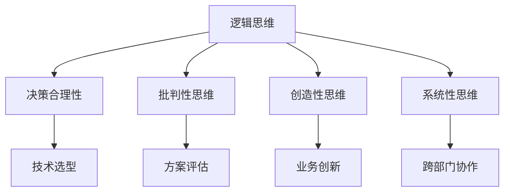

                 

关键词：思维能力、管理决策、IT领域、专业视角、深度思考、框架构建

> 摘要：本文深入探讨了思维能力在管理决策中的重要性，结合IT领域的实际案例，分析了思维能力的不同维度及其对管理决策的影响。文章旨在为IT管理者提供一套有效的思维模型，以提高其决策质量和执行力。

## 1. 背景介绍

在快速发展的信息技术领域，管理者的决策能力直接关系到企业的竞争力和可持续发展。随着技术的不断进步和市场环境的变化，管理者不仅需要掌握传统的管理知识，更需要具备强大的思维能力来应对复杂多变的情况。本文将从以下几个方面展开讨论：

- 思维能力的基本概念及其在管理决策中的重要性。
- 思维能力在不同领域的体现与应用。
- IT领域管理决策中的常见挑战。
- 提升思维能力的策略与实践。

## 2. 核心概念与联系

### 2.1. 思维能力概述

思维能力是指人们通过逻辑、分析、综合、创新等方法对信息进行加工和处理的能力。它包括以下几个方面：

- **逻辑思维**：基于事实和证据，通过推理得出结论。
- **批判性思维**：评估信息的可靠性，判断思维和论证的有效性。
- **创造性思维**：产生新的想法和解决方案。
- **系统性思维**：理解事物之间的相互关系，构建整体框架。

### 2.2. 思维能力与IT管理决策

在IT领域，管理决策通常涉及技术选型、项目规划、团队管理等多个方面。思维能力的不同维度对决策过程产生深远的影响：

- **逻辑思维**：确保决策过程的合理性，避免盲目跟风。
- **批判性思维**：评估技术方案的优缺点，做出更加客观的决策。
- **创造性思维**：发现新的业务机会，推动技术革新。
- **系统性思维**：理解整个IT生态系统，实现跨部门协作。

### 2.3. Mermaid 流程图



## 3. 核心算法原理 & 具体操作步骤

### 3.1. 算法原理概述

在IT管理决策中，核心算法原理主要包括数据分析和机器学习。这些算法可以帮助管理者从海量数据中提取有价值的信息，支持决策。

- **数据分析**：通过统计分析方法，揭示数据中的规律和趋势。
- **机器学习**：通过训练模型，实现数据的自动分析和预测。

### 3.2. 算法步骤详解

1. **数据收集**：收集相关业务数据，如用户行为、市场趋势等。
2. **数据预处理**：清洗数据，处理缺失值和异常值。
3. **特征工程**：提取有助于模型预测的特征。
4. **模型选择**：根据问题类型选择合适的算法。
5. **模型训练**：使用训练数据训练模型。
6. **模型评估**：评估模型性能，调整参数。
7. **决策支持**：根据模型预测结果，制定管理决策。

### 3.3. 算法优缺点

- **优点**：能够处理海量数据，提供精准的预测和决策支持。
- **缺点**：对数据质量和特征工程要求高，模型解释性不强。

### 3.4. 算法应用领域

- **市场分析**：预测市场趋势，制定营销策略。
- **风险管理**：识别潜在风险，制定风险应对措施。
- **人力资源管理**：评估员工绩效，优化团队结构。

## 4. 数学模型和公式 & 详细讲解 & 举例说明

### 4.1. 数学模型构建

在数据分析中，常用的数学模型包括线性回归、逻辑回归等。

### 4.2. 公式推导过程

以线性回归为例，其公式为：

\[ Y = \beta_0 + \beta_1X + \epsilon \]

其中，\( Y \) 是因变量，\( X \) 是自变量，\( \beta_0 \) 和 \( \beta_1 \) 是参数，\( \epsilon \) 是误差项。

### 4.3. 案例分析与讲解

假设我们想分析用户购买行为与年龄的关系，可以使用线性回归模型。

- **数据收集**：收集用户年龄和购买行为数据。
- **数据预处理**：处理缺失值和异常值。
- **特征工程**：将年龄转换为离散特征。
- **模型训练**：使用训练数据训练线性回归模型。
- **模型评估**：评估模型性能，调整参数。
- **决策支持**：根据模型预测结果，制定营销策略。

## 5. 项目实践：代码实例和详细解释说明

### 5.1. 开发环境搭建

- Python 3.8及以上版本
- pandas
- scikit-learn
- matplotlib

### 5.2. 源代码详细实现

```python
import pandas as pd
from sklearn.linear_model import LinearRegression
from sklearn.model_selection import train_test_split
from sklearn.metrics import mean_squared_error
import matplotlib.pyplot as plt

# 数据收集
data = pd.read_csv('user_data.csv')

# 数据预处理
data.dropna(inplace=True)

# 特征工程
data['age_group'] = pd.cut(data['age'], bins=[0, 18, 30, 50, 70, float('inf')],
                          labels=[1, 2, 3, 4, 5])

# 模型训练
X = data[['age_group']]
y = data['purchased']
X_train, X_test, y_train, y_test = train_test_split(X, y, test_size=0.2, random_state=42)
model = LinearRegression()
model.fit(X_train, y_train)

# 模型评估
y_pred = model.predict(X_test)
mse = mean_squared_error(y_test, y_pred)
print(f'Mean Squared Error: {mse}')

# 决策支持
print(model.coef_)
print(model.intercept_)

# 可视化
plt.scatter(X_train['age_group'], y_train)
plt.plot(X_train['age_group'], model.predict(X_train), color='red')
plt.xlabel('Age Group')
plt.ylabel('Purchased')
plt.show()
```

### 5.3. 代码解读与分析

- **数据收集**：使用pandas读取CSV文件。
- **数据预处理**：删除缺失值。
- **特征工程**：将连续的年龄特征转换为离散特征。
- **模型训练**：使用线性回归模型进行训练。
- **模型评估**：计算均方误差。
- **决策支持**：输出模型参数。
- **可视化**：绘制散点图和拟合线。

## 6. 实际应用场景

### 6.1. 用户体验优化

通过分析用户行为数据，管理者可以了解用户偏好，优化产品功能，提升用户体验。

### 6.2. 营销策略制定

基于用户购买数据，管理者可以预测用户需求，制定针对性的营销策略。

### 6.3. 风险管理

通过分析潜在风险数据，管理者可以提前识别风险，制定应对措施。

## 7. 未来应用展望

随着人工智能技术的不断发展，思维能力在管理决策中的应用将更加广泛。未来，我们将看到更加智能化的决策支持系统，帮助管理者做出更加精准的决策。

## 8. 工具和资源推荐

### 8.1. 学习资源推荐

- 《深度学习》（Ian Goodfellow等著）
- 《机器学习实战》（Peter Harrington著）

### 8.2. 开发工具推荐

- Jupyter Notebook
- PyCharm

### 8.3. 相关论文推荐

- “Deep Learning for Natural Language Processing”（Kumar et al., 2016）
- “A Theoretical Framework for Large-Scale Machine Learning”（Bengio et al., 2013）

## 9. 总结：未来发展趋势与挑战

### 9.1. 研究成果总结

本文通过分析思维能力的不同维度，探讨了其在IT管理决策中的应用。研究表明，思维能力对决策质量有显著影响，未来研究应关注如何更好地将思维能力与人工智能技术相结合。

### 9.2. 未来发展趋势

随着技术的进步，人工智能将更好地支持管理决策。未来，我们将看到更加智能化、自动化的决策支持系统。

### 9.3. 面临的挑战

尽管人工智能技术在决策支持中具有巨大潜力，但如何提高数据质量和特征工程效率，确保模型的解释性，是未来面临的挑战。

### 9.4. 研究展望

未来研究应关注以下几个方面：

- **跨学科融合**：将心理学、管理学与人工智能技术相结合。
- **可解释性研究**：提高模型的可解释性，增强管理者对决策过程的理解。
- **决策优化算法**：开发更加高效、智能的决策优化算法。

## 10. 附录：常见问题与解答

### 10.1. 问题一：如何提高思维能力的效率？

**解答**：可以通过以下方式提高思维能力的效率：

- **定期练习**：通过练习提高逻辑思维、批判性思维、创造性思维和系统性思维的能力。
- **学习新技术**：不断学习新的技术和方法，提高自己的知识储备和思维能力。
- **跨学科学习**：学习其他领域的知识，开阔视野，提高思维能力。

### 10.2. 问题二：机器学习模型在决策支持中的应用有哪些局限性？

**解答**：机器学习模型在决策支持中的应用存在以下局限性：

- **数据依赖性**：模型性能依赖于数据质量，数据质量问题可能导致模型失效。
- **解释性不足**：许多模型如深度学习模型难以解释，管理者难以理解决策过程。
- **泛化能力有限**：模型在特定数据集上表现良好，但在新数据集上可能表现不佳。

### 10.3. 问题三：如何确保决策过程的合理性？

**解答**：确保决策过程的合理性可以通过以下方法：

- **证据驱动**：基于事实和证据进行决策，避免主观臆断。
- **多角度评估**：从多个角度评估决策方案，确保决策的全面性。
- **团队协作**：组建跨部门团队，共同参与决策过程，提高决策质量。

---

作者：禅与计算机程序设计艺术 / Zen and the Art of Computer Programming
----------------------------------------------------------------

本文从多个维度分析了思维能力在IT管理决策中的重要性，并结合实际案例，探讨了如何通过提升思维能力来优化决策过程。随着人工智能技术的不断进步，思维能力在管理决策中的应用将更加广泛，未来的研究应关注如何更好地将思维能力与人工智能技术相结合，以实现更加智能化、精准化的决策支持。

