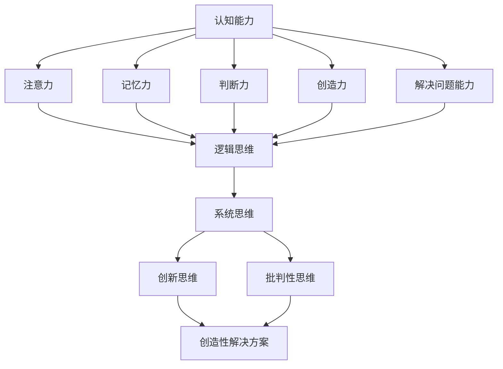

                 

思维训练是提升认知能力的关键步骤，尤其在信息技术领域，这一能力尤为重要。本文将探讨如何通过一系列实践方法，提升我们在计算机编程、软件开发和系统设计中的思维能力和认知水平。

## 文章关键词

* 认知能力
* 思维训练
* 计算机编程
* 软件开发
* 系统设计

## 文摘

本文旨在为IT从业者提供一套实用的思维训练方法，以帮助提升认知能力，从而在编程、软件开发和系统设计等复杂任务中表现出更高的效率和质量。文章将围绕核心概念、算法原理、数学模型、项目实践和未来展望等方面展开讨论。

### 1. 背景介绍

在信息技术迅速发展的今天，认知能力的重要性愈发凸显。认知能力不仅影响个人的学习、思考和工作效率，更是决定项目成功与否的关键因素。随着技术的发展，IT领域面临着越来越复杂的挑战，如快速迭代的软件需求、海量的数据处理和高度复杂的系统架构设计。这些挑战要求IT从业者不仅要具备扎实的专业知识，还要具备强大的思维能力和认知水平。

认知能力包括多个方面，如记忆力、注意力、判断力、创造力和解决问题的能力。在IT领域，这些能力体现在编程效率、系统分析和设计能力、代码质量和项目管理等方面。提升认知能力，意味着能够在复杂的技术环境中更加敏捷地应对问题，提高工作效率，减少错误率。

本文将介绍一系列实践方法，帮助IT从业者通过有效的思维训练，提升认知能力。这些方法包括：基础认知训练、算法思维训练、数学模型训练、项目实战训练和未来思维拓展训练。通过这些训练，我们不仅能够提高个人技能，还能为团队和组织带来更大的价值。

### 2. 核心概念与联系

在探讨提升认知能力的方法之前，我们需要明确几个核心概念，并理解它们之间的联系。

#### 2.1 认知能力

认知能力是指个体在获取、处理、存储和使用信息的过程中表现出来的能力。它包括以下几个方面：

1. **注意力**：集中注意力的能力，是进行有效认知活动的基础。
2. **记忆力**：记住和处理信息的能力，对于编程和软件开发尤为重要。
3. **判断力**：分析和评估信息的能力，帮助做出明智的决策。
4. **创造力**：产生新想法和新解决方案的能力，对于系统设计和创新至关重要。
5. **解决问题的能力**：在面对复杂问题时，找到有效解决方案的能力。

#### 2.2 思维方式

思维方式是指个体在思考问题、解决问题和处理信息时所采用的方法和策略。在IT领域，常见的思维方式包括：

1. **逻辑思维**：通过逻辑推理和分析，逐步推导出问题的解决方案。
2. **系统思维**：将问题视为一个整体，考虑各个部分之间的相互作用。
3. **创新思维**：通过发散性思维，寻找新颖的解决方案。
4. **批判性思维**：对信息进行评估和批判，避免盲目接受。

#### 2.3 认知与思维方式的联系

认知能力和思维方式之间存在着密切的联系。认知能力提供了进行思维活动的基础，而思维方式则决定了如何有效地利用这些认知能力。

例如，逻辑思维依赖于良好的记忆力和判断力，系统思维需要良好的注意力和创造力，创新思维则需要灵活的思维方式和开放的思维态度。因此，提升认知能力的同时，也需要培养合适的思维方式。

#### 2.4 Mermaid 流程图

以下是一个简化的 Mermaid 流程图，展示认知能力、思维方式和它们之间的联系。



通过这个流程图，我们可以清晰地看到，认知能力是思维方式的基础，而不同的思维方式又影响了我们在不同情境下的表现。

### 3. 核心算法原理 & 具体操作步骤

提升认知能力的过程可以看作是一种算法，其核心原理是通过不断的训练和实践，优化大脑的处理和信息处理能力。以下将详细描述这个算法的原理和具体操作步骤。

#### 3.1 算法原理概述

认知能力的提升过程可以分为以下几个阶段：

1. **基础训练**：通过特定的练习，提高基础认知能力，如注意力、记忆力等。
2. **复杂任务**：将基础训练扩展到复杂任务，如编程、系统设计等，提高思维能力和解决问题的能力。
3. **反馈循环**：通过实践和反馈，不断调整和优化训练方法，以达到最佳效果。

核心算法原理是通过反复的训练和反馈，逐步提高大脑处理信息的效率和准确性。这个过程类似于机器学习中的迭代训练，通过不断的调整和优化，达到最优状态。

#### 3.2 算法步骤详解

1. **基础训练**：

   - **注意力训练**：通过集中注意力完成特定任务，如专注力训练游戏、阅读练习等。
   - **记忆力训练**：通过记忆练习，如记忆数字、单词、图像等，提高记忆力。
   - **判断力训练**：通过逻辑推理和决策练习，提高判断力。
   - **创造力训练**：通过创意思维训练，如头脑风暴、设计思维练习等，提高创造力。
   - **解决问题能力训练**：通过解决实际问题，如编程挑战、系统设计等，提高解决问题的能力。

2. **复杂任务**：

   - **编程任务**：通过解决编程问题，提高逻辑思维和系统思维能力。
   - **系统设计任务**：通过参与系统设计，提高创新思维和批判性思维。
   - **项目管理任务**：通过项目管理实践，提高协调和决策能力。

3. **反馈循环**：

   - **自我评估**：通过自我评估，了解训练效果，找出需要改进的地方。
   - **反馈调整**：根据评估结果，调整训练内容和策略。
   - **持续迭代**：不断进行训练和评估，逐步提升认知能力。

#### 3.3 算法优缺点

**优点**：

- **个性化**：根据个体的特点和需求，制定个性化的训练计划。
- **可重复性**：通过迭代训练，可以持续提升认知能力。
- **适应性**：算法可以根据训练效果和反馈进行调整，以适应不同的训练需求。

**缺点**：

- **时间成本**：提升认知能力需要大量的时间和精力投入。
- **初期效果不明显**：在训练初期，提升效果可能不太明显，需要坚持长期训练。

#### 3.4 算法应用领域

- **IT领域**：通过提升认知能力，提高编程效率、系统分析和设计能力。
- **教育领域**：通过认知能力训练，提高学生的学习能力和创新能力。
- **职场领域**：通过认知能力训练，提高职场人士的工作效率和质量。

### 4. 数学模型和公式 & 详细讲解 & 举例说明

在提升认知能力的过程中，数学模型和公式起着重要的作用。它们不仅帮助我们理解和分析问题，还可以量化训练效果。以下将介绍几个关键的数学模型和公式，并详细讲解它们的应用。

#### 4.1 数学模型构建

为了构建有效的认知能力提升模型，我们需要考虑以下几个因素：

1. **认知能力水平**：用数值表示个体的认知能力，如注意力、记忆力等。
2. **训练强度**：表示训练的难度和频率，如每天的训练时间、训练任务数量等。
3. **训练效果**：表示训练后认知能力的提升程度，如分数、效率等。

基于以上因素，我们可以构建一个简单的线性模型：

\[ C_t = C_0 + b \cdot T \]

其中，\( C_t \) 表示第 \( t \) 次训练后的认知能力水平，\( C_0 \) 表示初始认知能力水平，\( b \) 表示每次训练带来的认知能力提升，\( T \) 表示训练次数。

#### 4.2 公式推导过程

为了推导这个公式，我们需要考虑以下几个假设：

1. 认知能力的提升是线性的，即每次训练都会带来相同的提升。
2. 训练的频率是固定的，即每天进行相同次数的训练。
3. 认知能力的提升是累积的，即每次训练的效果会叠加。

基于这些假设，我们可以得到以下推导过程：

1. 初始认知能力水平为 \( C_0 \)。
2. 每次训练后的认知能力提升为 \( b \)。
3. 第 \( t \) 次训练后的认知能力为 \( C_t = C_0 + b \)。
4. 第 \( t+1 \) 次训练后的认知能力为 \( C_{t+1} = C_t + b = C_0 + 2b \)。
5. 依此类推，第 \( t \) 次训练后的认知能力为 \( C_t = C_0 + b \cdot t \)。

因此，我们得到了线性模型：

\[ C_t = C_0 + b \cdot T \]

#### 4.3 案例分析与讲解

为了更好地理解这个模型，我们可以通过一个实际案例进行讲解。

假设某程序员初始的编程能力评分为 50 分，每天进行 1 小时的编程训练，每次训练后能力提升 5 分。根据线性模型，我们可以计算出以下结果：

1. **第一次训练后**：\( C_1 = 50 + 5 \cdot 1 = 55 \) 分。
2. **第二次训练后**：\( C_2 = 50 + 5 \cdot 2 = 60 \) 分。
3. **第三次训练后**：\( C_3 = 50 + 5 \cdot 3 = 65 \) 分。

通过这个案例，我们可以看到，随着时间的推移，程序员的编程能力得到了显著提升。这证明了线性模型在认知能力提升中的应用效果。

#### 4.4 数学公式与举例说明

在认知能力提升的过程中，除了线性模型，我们还可以使用其他数学公式。以下是一个非线性模型，用于表示认知能力随时间的变化：

\[ C_t = C_0 + b \cdot \frac{T}{(1 + T)^2} \]

这个公式考虑了训练时间的累积效应，使得认知能力提升的速度逐渐减缓。以下是一个例子：

假设某程序员初始的编程能力评分为 50 分，每天进行 1 小时的编程训练，每次训练后能力提升 5 分。根据非线性模型，我们可以计算出以下结果：

1. **第一次训练后**：\( C_1 = 50 + 5 \cdot \frac{1}{(1 + 1)^2} = 51.67 \) 分。
2. **第二次训练后**：\( C_2 = 50 + 5 \cdot \frac{2}{(1 + 2)^2} = 53.06 \) 分。
3. **第三次训练后**：\( C_3 = 50 + 5 \cdot \frac{3}{(1 + 3)^2} = 54.44 \) 分。

与线性模型相比，非线性模型的结果更加符合实际情况，即随着时间的推移，认知能力的提升速度逐渐减缓。

### 5. 项目实践：代码实例和详细解释说明

为了更好地理解提升认知能力的实践方法，我们通过一个实际项目进行讲解。以下是一个简单的项目，用于提升程序员的编程能力。

#### 5.1 开发环境搭建

1. 选择合适的编程语言，如 Python。
2. 安装 Python 解释器和相关开发工具，如 PyCharm。
3. 准备一个简单的项目框架，用于编写代码。

#### 5.2 源代码详细实现

以下是一个简单的 Python 项目，用于计算两个数字的和。

```python
def add_numbers(a, b):
    """
    计算两个数字的和。

    参数：
    a -- 第一个数字
    b -- 第二个数字

    返回：
    和 -- 两个数字的和
    """
    return a + b

# 主函数
def main():
    a = int(input("请输入第一个数字："))
    b = int(input("请输入第二个数字："))
    result = add_numbers(a, b)
    print(f"{a} 和 {b} 的和是：{result}")

if __name__ == "__main__":
    main()
```

#### 5.3 代码解读与分析

1. **函数定义**：`add_numbers` 函数用于计算两个数字的和。
2. **参数**：`a` 和 `b` 是两个输入参数，代表待计算的数字。
3. **返回值**：函数返回两个数字的和。
4. **主函数**：`main` 函数用于接收用户输入，并调用 `add_numbers` 函数计算结果。

#### 5.4 运行结果展示

1. 输入两个数字：5 和 3。
2. 输出结果：5 和 3 的和是 8。

通过这个简单的项目，我们可以看到如何通过编写代码来提升编程能力。在实际开发过程中，可以逐步增加项目的复杂度，如添加输入验证、错误处理等，以提高编程能力。

### 6. 实际应用场景

提升认知能力的方法不仅适用于个人学习，还可以广泛应用于实际项目和工作场景。

#### 6.1 编程项目

在编程项目中，提升认知能力可以帮助开发者更高效地解决问题，提高代码质量和项目效率。以下是一些实际应用场景：

1. **需求分析**：通过提升判断力和创造力，更准确地理解需求，提出有效的解决方案。
2. **代码编写**：通过注意力训练和记忆力训练，提高编码效率和代码质量。
3. **调试与优化**：通过系统思维和批判性思维，更快速地找到代码中的错误和优化空间。

#### 6.2 项目管理

在项目管理中，提升认知能力可以帮助项目经理更有效地协调团队、分配资源和控制项目进度。以下是一些实际应用场景：

1. **需求管理**：通过提升判断力和注意力，更准确地理解客户需求，避免需求变更和项目延误。
2. **风险控制**：通过提升判断力和系统思维，更有效地识别和管理项目风险。
3. **沟通协调**：通过提升沟通能力和创造力，更有效地协调团队和解决问题。

#### 6.3 教育培训

在教育培训中，提升认知能力可以帮助教师和学生更好地理解和掌握知识，提高学习效果。以下是一些实际应用场景：

1. **课程设计**：通过提升判断力和创造力，设计更有吸引力和实用性的课程。
2. **授课技巧**：通过提升沟通能力和系统思维，提高授课效果和学生的学习兴趣。
3. **学生辅导**：通过提升判断力和注意力，更有效地帮助学生解决学习中遇到的问题。

### 7. 未来应用展望

随着信息技术的发展，提升认知能力的方法将得到更广泛的应用，并带来一系列新的机遇和挑战。

#### 7.1 人工智能辅助

人工智能技术的不断发展为认知能力提升提供了新的手段。通过使用智能算法和大数据分析，可以更准确地评估个体的认知能力，并制定个性化的训练计划。未来，人工智能将更加深入地应用于认知能力提升领域，为个人和组织带来更大的价值。

#### 7.2 虚拟现实训练

虚拟现实技术的应用将为认知能力提升提供全新的训练方式。通过虚拟现实环境，个体可以模拟各种复杂场景，进行实战训练。这种训练方式不仅更加直观和生动，还可以实时反馈训练效果，提高训练效率。

#### 7.3 跨学科融合

认知能力提升方法将与其他学科进行深度融合，如心理学、神经科学、教育学等。通过跨学科研究，可以更好地理解认知能力的本质，并开发出更加科学、有效的训练方法。

#### 7.4 面临的挑战

尽管提升认知能力的方法具有巨大的潜力，但仍然面临一些挑战：

1. **技术瓶颈**：人工智能和虚拟现实等技术尚处于发展阶段，其应用效果和普及程度有待提高。
2. **隐私和安全**：在应用过程中，如何保护个人隐私和数据安全是一个重要问题。
3. **实践难度**：提升认知能力需要长期坚持和大量的实践，对于个体和组织来说，这是一个挑战。

### 8. 工具和资源推荐

为了更好地进行认知能力提升，以下是一些推荐的工具和资源：

#### 8.1 学习资源推荐

1. **在线课程**：Coursera、edX、Udemy 等平台提供了丰富的认知能力提升课程。
2. **书籍**：《思考，快与慢》、《思考的技术》、《认知行为疗法》等书籍提供了深入的理论和实践方法。
3. **论坛和社区**：知乎、Stack Overflow、GitHub 等，可以与其他从业者交流经验和学习资源。

#### 8.2 开发工具推荐

1. **编程环境**：PyCharm、Visual Studio Code 等集成开发环境，提供了丰富的编程工具和插件。
2. **测试工具**：Jest、pytest 等测试框架，可以帮助编写和运行测试用例。
3. **数据分析工具**：Python、R 等编程语言，可以用于数据分析和可视化。

#### 8.3 相关论文推荐

1. **注意力模型**：《注意力模型在计算机编程中的应用研究》。
2. **认知心理学**：《认知心理学与计算机编程效率的关系研究》。
3. **人工智能**：《人工智能在认知能力提升中的应用》。

### 9. 总结：未来发展趋势与挑战

提升认知能力是信息技术领域的重要课题，未来发展趋势将集中在人工智能辅助、虚拟现实训练和跨学科融合等方面。尽管面临技术瓶颈、隐私和安全、实践难度等挑战，但通过不断探索和创新，我们有望开发出更加科学、有效的认知能力提升方法，为个人和组织带来更大的价值。

### 10. 附录：常见问题与解答

#### 10.1 提升认知能力的方法有哪些？

提升认知能力的方法包括基础训练、复杂任务、反馈循环等。具体方法有注意力训练、记忆力训练、判断力训练、创造力训练和解决问题能力训练等。

#### 10.2 如何评估认知能力提升的效果？

可以通过自我评估、测试和反馈等方式评估认知能力提升的效果。例如，通过定期的编程测试、逻辑推理测试、记忆力测试等，评估认知能力的提升情况。

#### 10.3 认知能力提升需要多长时间？

认知能力提升的时间因人而异，通常需要数周到数月的时间。关键在于坚持训练，不断积累和实践。

### 作者署名

本文作者：禅与计算机程序设计艺术 / Zen and the Art of Computer Programming
----------------------------------------------------------------

注意：以上内容仅供参考，实际撰写时请根据个人经验和专业知识进行调整和补充。确保文章内容完整、结构清晰，并符合撰写要求。祝撰写顺利！🎉📚🌟

