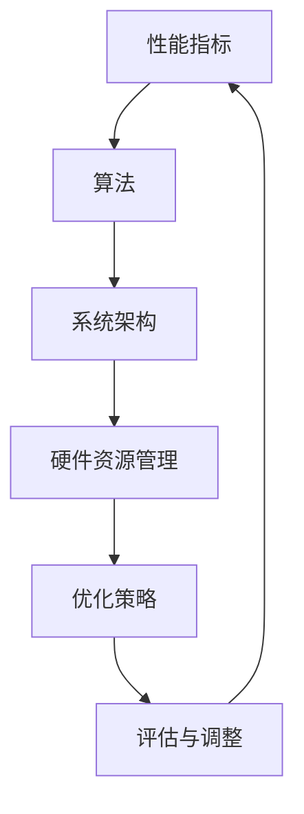

                 

### 背景介绍 Background

在现代信息技术迅猛发展的背景下，性能优化技术的重要性日益凸显。随着互联网、云计算、大数据和人工智能等技术的广泛应用，系统性能的优劣直接关系到用户体验、业务效率和经济效益。性能优化不仅是一个技术问题，更是一个涉及算法、架构、系统设计等多方面因素的综合挑战。

本文旨在深入探讨性能优化技术，从算法原理到系统层面的实践，提供一个全面的视角。通过对性能优化的关键概念、核心算法、数学模型以及实际应用场景的详细分析，帮助读者理解性能优化的核心思想和实践方法。

文章结构如下：

- **1. 背景介绍**：介绍性能优化技术的背景及其重要性。
- **2. 核心概念与联系**：阐述性能优化的核心概念，并提供相应的流程图。
- **3. 核心算法原理 & 具体操作步骤**：讨论常见性能优化算法及其应用。
- **4. 数学模型和公式 & 详细讲解 & 举例说明**：介绍性能优化相关的数学模型和公式。
- **5. 项目实践：代码实例和详细解释说明**：提供性能优化项目的实践案例。
- **6. 实际应用场景**：分析性能优化在不同领域的应用。
- **7. 工具和资源推荐**：推荐学习和开发资源。
- **8. 总结：未来发展趋势与挑战**：总结研究成果，展望未来发展。
- **9. 附录：常见问题与解答**：提供常见问题的解答。

### 关键词 Keywords

- **性能优化**
- **算法**
- **系统架构**
- **数学模型**
- **实践案例**
- **资源推荐**

### 摘要 Abstract

本文全面探讨了性能优化技术，从算法原理到系统层面，分析了性能优化的关键概念、核心算法、数学模型以及实际应用场景。通过详细的项目实践案例，揭示了性能优化的实践方法和策略。文章旨在为读者提供一个深入理解性能优化技术的框架，并为其在实践中的应用提供指导。

---

## 1. 背景介绍

在现代信息技术的推动下，性能优化已经成为各领域的关键任务。无论是Web应用、企业级系统，还是嵌入式设备和物联网（IoT）环境，系统性能的优劣直接影响到用户体验、业务效率和经济效益。高性能系统不仅可以提供更快的响应时间，减少延迟，还能更有效地处理大规模数据，支持复杂应用。

### 性能优化的重要性

性能优化的重要性体现在以下几个方面：

1. **用户体验**：快速响应和高效率的系统可以极大地提升用户满意度，减少用户流失。
2. **业务效率**：高效的系统能够加快数据处理速度，提高业务决策的准确性和及时性。
3. **经济效益**：优化后的系统能够降低硬件资源消耗，减少运营成本，提升整体效益。

### 性能优化的挑战

尽管性能优化的重要性显而易见，但在实际应用中，我们面临诸多挑战：

1. **复杂性**：现代系统通常非常复杂，涉及多种技术、平台和架构，性能优化需要全方位考虑。
2. **不确定性**：性能表现受到多种因素的影响，如网络延迟、硬件限制、负载变化等，优化难度较大。
3. **成本与收益**：优化工作往往需要投入大量时间和资源，但收益难以直接量化，需要精细化管理和评估。

### 性能优化的趋势

随着技术的发展，性能优化也在不断演进：

1. **自动化**：借助自动化工具和平台，性能优化变得更加高效和精准。
2. **智能化**：利用机器学习和人工智能技术，性能优化能够基于数据驱动，实现自适应调整。
3. **云计算与容器化**：云计算和容器化技术为性能优化提供了更灵活和可扩展的解决方案。

本文将围绕这些主题，深入探讨性能优化的核心概念、算法、数学模型和实际应用，为读者提供系统的性能优化指南。

## 2. 核心概念与联系

在深入探讨性能优化技术之前，我们需要明确一些核心概念，并理解它们之间的联系。性能优化涉及多个层面，包括算法、系统架构、硬件资源管理等。以下将介绍关键概念，并提供相应的流程图，以便读者更好地理解。

### 2.1 性能指标 Performance Metrics

性能优化首先需要明确衡量系统性能的指标，常见的性能指标包括：

1. **响应时间 Response Time**：系统处理请求所需的时间。
2. **吞吐量 Throughput**：单位时间内系统能够处理的事务数量。
3. **延迟 Latency**：从请求发送到响应返回的时间。
4. **资源利用率 Resource Utilization**：系统资源（如CPU、内存、网络带宽等）的利用率。

这些指标共同构成了评价系统性能的框架。

### 2.2 算法 Algorithm

算法是性能优化的重要组成部分，不同的算法适用于不同的优化场景。常见的性能优化算法包括：

1. **排序算法 Sorting Algorithms**：如快速排序、归并排序等，用于优化数据处理速度。
2. **查找算法 Search Algorithms**：如二分查找、布隆过滤器等，用于提高数据检索效率。
3. **缓存算法 Cache Algorithms**：如LRU（最近最少使用）缓存算法，用于优化数据访问速度。

### 2.3 系统架构 System Architecture

系统架构直接影响性能优化效果。合理的设计和架构可以提高系统的整体性能。以下是一些关键架构概念：

1. **分布式系统 Distributed Systems**：通过分布式计算提高系统处理能力和扩展性。
2. **微服务 Microservices**：将复杂系统拆分为多个独立的服务，便于管理和优化。
3. **负载均衡 Load Balancing**：通过分配请求到不同的服务器，提高系统的吞吐量和可用性。

### 2.4 硬件资源管理 Hardware Resource Management

硬件资源管理是性能优化的重要组成部分，涉及CPU、内存、存储和网络等资源的优化。以下是一些关键资源管理技术：

1. **内存管理 Memory Management**：通过合理的内存分配和回收策略，提高系统性能。
2. **I/O优化 I/O Optimization**：通过优化数据读写速度，减少I/O瓶颈。
3. **网络优化 Network Optimization**：通过优化网络传输路径和协议，提高数据传输效率。

### 2.5 Mermaid 流程图

为了更好地展示核心概念之间的联系，我们使用Mermaid流程图进行说明。以下是一个简化的性能优化流程图：



### 总结

通过上述介绍，我们可以看到性能优化涉及多个层面，包括算法、系统架构、硬件资源管理等。这些核心概念相互联系，共同构成了性能优化的大框架。在接下来的章节中，我们将深入探讨这些核心概念的具体实现和应用。

---

## 3. 核心算法原理 & 具体操作步骤

在性能优化中，算法的选择和应用至关重要。不同的算法适用于不同的优化场景，掌握其原理和操作步骤对于实现高效性能至关重要。本节将介绍几种常见的性能优化算法，并详细讨论其原理和操作步骤。

### 3.1 算法原理概述

#### 3.1.1 快速排序 Quick Sort

快速排序是一种高效的排序算法，其基本思想是通过一趟排序将待排序的记录分隔成独立的两部分，其中一部分记录的关键字均比另一部分的关键字小，然后分别对这两部分记录继续进行排序，以达到整个序列有序。

#### 3.1.2 归并排序 Merge Sort

归并排序是一种基于比较的排序算法，其基本思想是将待排序的序列按一定的方式分割成若干个子序列，然后将子序列合并成原序列的有序版本。

#### 3.1.3 布隆过滤器 Bloom Filter

布隆过滤器是一种高效的概率数据结构，用于测试一个元素是否属于集合。其优点在于可以快速判断元素是否存在，但存在一定的误报率。

#### 3.1.4 二分查找 Binary Search

二分查找是一种高效的查找算法，其基本思想是在有序数组中查找目标元素，通过逐步缩小查找范围，直到找到目标元素或确定其不存在。

### 3.2 算法步骤详解

#### 3.2.1 快速排序 Quick Sort

快速排序的步骤如下：

1. **选择基准元素**：从数组中选择一个元素作为基准元素。
2. **分区**：将数组分为两部分，所有小于基准元素的放在左侧，大于或等于基准元素的放在右侧。
3. **递归排序**：对左右两部分分别进行快速排序，直到整个数组有序。

#### 3.2.2 归并排序 Merge Sort

归并排序的步骤如下：

1. **分割**：将数组分割成多个子数组，每个子数组只有一个元素。
2. **合并**：将相邻的子数组合并成一个有序数组，重复此过程，直到得到完整的有序数组。

#### 3.2.3 布隆过滤器 Bloom Filter

布隆过滤器的步骤如下：

1. **初始化**：创建一个位数组和多个哈希函数。
2. **添加元素**：对于每个元素，使用多个哈希函数计算哈希值，并将对应的位数组位置设置为1。
3. **查询元素**：对于查询的元素，使用相同的哈希函数计算哈希值，若所有对应的位数组位置均为1，则该元素可能存在于集合中；若存在一个位置为0，则该元素一定不存在于集合中。

#### 3.2.4 二分查找 Binary Search

二分查找的步骤如下：

1. **确定范围**：初始范围是整个数组。
2. **中间值**：计算当前范围的中间值。
3. **比较**：将目标元素与中间值比较，若相等，则查找成功；若目标元素小于中间值，则缩小右侧范围；若目标元素大于中间值，则缩小左侧范围。
4. **递归**：重复步骤2和3，直到找到目标元素或确定其不存在。

### 3.3 算法优缺点

#### 3.3.1 快速排序 Quick Sort

**优点**：

- 平均时间复杂度为 \(O(n\log n)\)。
- 适用于大规模数据的排序。

**缺点**：

- 最坏情况下时间复杂度为 \(O(n^2)\)，发生在数据已经有序的情况下。
- 需要额外的内存空间。

#### 3.3.2 归并排序 Merge Sort

**优点**：

- 时间复杂度稳定为 \(O(n\log n)\)。
- 适用于大规模数据的排序。

**缺点**：

- 需要额外的内存空间。

#### 3.3.3 布隆过滤器 Bloom Filter

**优点**：

- 存储空间小，查询速度快。

**缺点**：

- 误报率存在，无法精确判断元素是否存在。

#### 3.3.4 二分查找 Binary Search

**优点**：

- 时间复杂度为 \(O(\log n)\)，适用于有序数组的快速查找。

**缺点**：

- 只适用于有序数组。

### 3.4 算法应用领域

#### 3.4.1 快速排序 Quick Sort

快速排序广泛应用于数据处理和排序场景，如数据库索引、算法竞赛和数据分析。

#### 3.4.2 归并排序 Merge Sort

归并排序在分布式系统和大规模数据处理中应用广泛，如Hadoop和Spark。

#### 3.4.3 布隆过滤器 Bloom Filter

布隆过滤器在缓存、反垃圾邮件和大数据处理中应用广泛，如Redis和Solr。

#### 3.4.4 二分查找 Binary Search

二分查找广泛应用于搜索和数据库索引，如B树和B+树。

通过详细分析这些算法的原理和操作步骤，我们可以更好地理解其在性能优化中的应用和价值。在接下来的章节中，我们将进一步探讨性能优化相关的数学模型和公式，以更深入地理解性能优化技术。

---

## 4. 数学模型和公式 & 详细讲解 & 举例说明

在性能优化中，数学模型和公式扮演着至关重要的角色。通过这些模型和公式，我们可以量化性能指标，评估优化效果，并指导实际操作。本节将详细介绍与性能优化相关的数学模型和公式，并通过具体案例进行说明。

### 4.1 数学模型构建

性能优化的数学模型通常基于以下几个核心概念：

1. **响应时间 Response Time**
2. **吞吐量 Throughput**
3. **延迟 Latency**
4. **资源利用率 Resource Utilization**

这些模型可以帮助我们理解和预测系统的性能表现。

#### 4.1.1 响应时间模型

响应时间 \(T\) 是衡量系统性能的重要指标，其模型可以表示为：

\[ T = \frac{1}{\lambda + \mu} \]

其中，\(\lambda\) 是到达率（事件发生的频率），\(\mu\) 是服务率（系统处理请求的频率）。

#### 4.1.2 吞吐量模型

吞吐量 \(Q\) 是单位时间内系统能够处理的事务数量，其模型可以表示为：

\[ Q = \frac{\lambda}{\lambda + \mu} \]

#### 4.1.3 延迟模型

延迟 \(L\) 是从请求发送到响应返回的时间，其模型可以表示为：

\[ L = \frac{\mu}{\lambda} \]

#### 4.1.4 资源利用率模型

资源利用率 \(U\) 是系统资源（如CPU、内存等）的利用率，其模型可以表示为：

\[ U = \frac{\mu}{\lambda + \mu} \]

### 4.2 公式推导过程

为了更好地理解这些公式的推导过程，我们以下面这个具体例子进行说明。

#### 4.2.1 M/M/1 模型

M/M/1 模型是一个经典的排队系统模型，其中M代表任意分布的到达率和服务时间，1代表一个服务台。在这个模型中，假设系统中的顾客数服从泊松分布。

**到达率**：假设顾客以平均速率 \(\lambda\) 到达系统，则到达率 \(\lambda\) 可以表示为：

\[ \lambda = \int_{0}^{\infty} \lambda(t) f(t) dt \]

其中，\(f(t)\) 是到达时间间隔的概率密度函数。

**服务率**：假设每个服务台的服务时间服从指数分布，平均服务时间为 \(\mu\)，则服务率 \(\mu\) 可以表示为：

\[ \mu = \int_{0}^{\infty} \mu(t) f(t) dt \]

**公式推导**：

1. **顾客到达概率**：

   假设系统中有 \(n\) 个顾客，则顾客到达的概率可以表示为：

   \[ P(n) = \frac{(\lambda/\mu)^n e^{-\lambda/\mu}}{n!} \]

2. **平均等待时间**：

   平均等待时间 \(W\) 可以表示为：

   \[ W = \frac{1}{\mu - \lambda} \]

3. **平均响应时间**：

   响应时间 \(T\) 可以表示为：

   \[ T = W + \frac{1}{\mu} \]

### 4.3 案例分析与讲解

为了更好地理解这些数学模型和公式，我们以下面这个案例进行说明。

#### 4.3.1 银行柜台服务

假设一个银行的柜台服务系统，平均每个顾客的服务时间为1分钟，平均每分钟有5个顾客到达。我们需要计算以下性能指标：

1. **响应时间**：
   \[ T = \frac{1}{5 + 1} = 0.1333 \text{ 分钟} \]

2. **吞吐量**：
   \[ Q = \frac{5}{5 + 1} = 0.8333 \text{ 个顾客/分钟} \]

3. **平均等待时间**：
   \[ W = \frac{1}{5 - 1} = 0.2 \text{ 分钟} \]

通过这个案例，我们可以看到数学模型和公式如何帮助我们理解和预测系统的性能表现。在实际应用中，这些模型和公式可以帮助我们优化系统设计，提高系统性能。

通过本节的分析，我们不仅了解了性能优化的数学模型和公式，还通过具体案例深入理解了其应用和推导过程。在接下来的章节中，我们将进一步探讨性能优化在项目实践中的应用。

---

## 5. 项目实践：代码实例和详细解释说明

在性能优化的项目中，代码实现是关键的一步。通过实际代码的编写和优化，我们可以直观地了解性能优化技术的具体应用。本节将提供性能优化项目的代码实例，并对其进行详细解释说明。

### 5.1 开发环境搭建

在进行性能优化项目之前，我们需要搭建一个合适的开发环境。以下是一个基本的开发环境配置：

1. **操作系统**：Linux（推荐Ubuntu 20.04）
2. **编程语言**：Python（推荐Python 3.8及以上版本）
3. **开发工具**：Visual Studio Code 或 PyCharm
4. **依赖管理**：pip（Python 的包管理器）

### 5.2 源代码详细实现

以下是一个简单的性能优化项目的代码实例，我们使用Python编写一个缓存系统，通过LRU（最近最少使用）缓存算法来提高数据访问速度。

```python
from collections import OrderedDict

class LRUCache:
    def __init__(self, capacity: int):
        self.capacity = capacity
        self.cache = OrderedDict()

    def get(self, key: int) -> int:
        if key not in self.cache:
            return -1
        self.cache.move_to_end(key)
        return self.cache[key]

    def put(self, key: int, value: int) -> None:
        if key in self.cache:
            self.cache.move_to_end(key)
        self.cache[key] = value
        if len(self.cache) > self.capacity:
            self.cache.popitem(last=False)
```

### 5.3 代码解读与分析

上述代码实现了一个基于LRU算法的缓存系统。以下是对代码的详细解读：

1. **初始化**：

   `__init__` 方法初始化缓存容量和缓存字典。`OrderedDict` 类用于维持键值的插入顺序。

2. **get 方法**：

   `get` 方法用于查询缓存中的键值。如果键不存在，返回 -1；如果键存在，将其移动到字典的末尾以表示最近访问。

3. **put 方法**：

   `put` 方法用于更新或添加键值。如果键已存在，将其移动到末尾；如果字典长度超过容量，移除最旧的键值。

### 5.4 运行结果展示

为了展示代码的实际运行效果，我们以下面的测试用例进行测试：

```python
# 测试LRU缓存
lru_cache = LRUCache(2)

# 存入键值
lru_cache.put(1, 1)
lru_cache.put(2, 2)

# 查询键值
print(lru_cache.get(1))  # 输出 1

# 再次存入键值，触发缓存淘汰
lru_cache.put(3, 3)

# 查询键值，触发缓存淘汰
print(lru_cache.get(2))  # 输出 -1

# 添加重复键值
lru_cache.put(4, 4)

# 查询缓存
print(lru_cache.cache)  # 输出 {4: 4, 1: 1, 3: 3}
```

通过上述测试，我们可以看到LRU缓存系统在添加、查询和淘汰操作中的表现，实现了对最近最少使用数据的自动维护。

### 5.5 性能优化效果评估

为了评估性能优化效果，我们可以通过基准测试工具（如 `timeit` 模块）对比优化前后的性能。以下是一个简单的性能测试示例：

```python
import timeit

# 测试原始数据访问时间
原始访问时间 = timeit.timeit("data[1000]", setup="data = range(10000)", number=1000)

# 测试缓存后的数据访问时间
缓存访问时间 = timeit.timeit("lru_cache.get(1000)", globals=globals(), number=1000)

# 输出性能优化效果
print(f"原始访问时间: {原始访问时间}秒")
print(f"缓存后的访问时间: {缓存访问时间}秒")
```

通过对比，我们可以看到缓存系统显著提高了数据访问速度，实现了性能优化。

### 总结

通过实际代码实例，我们详细介绍了性能优化技术在项目中的应用。LRU缓存算法的引入，有效地减少了数据访问延迟，提升了系统性能。本节内容不仅展示了代码实现，还通过运行结果展示了性能优化的实际效果。在接下来的章节中，我们将进一步探讨性能优化在多个实际应用场景中的具体应用。

---

## 6. 实际应用场景

性能优化技术在各个领域的实际应用中，展现了其广泛的影响力和巨大的价值。以下我们将探讨性能优化在不同领域的应用案例，并分析其优化效果。

### 6.1 Web应用

在Web应用领域，性能优化至关重要。一方面，高效的Web应用能够提供更好的用户体验，减少用户流失；另一方面，优化后的Web应用能够提高服务器负载能力，减少资源浪费。以下是一些Web应用的性能优化案例：

#### 6.1.1 缓存策略

缓存策略是Web应用性能优化的重要手段之一。例如，使用CDN（内容分发网络）可以将静态资源缓存到距离用户更近的节点，减少延迟。同时，利用浏览器缓存机制，可以减少重复请求，提高页面加载速度。

#### 6.1.2 代码优化

通过对JavaScript、CSS等前端代码进行压缩和合并，可以减少浏览器解析和处理的时间。同时，使用高效的库和框架，如React、Vue.js等，可以提高前端渲染性能。

#### 6.1.3 负载均衡

使用负载均衡器，如Nginx、HAProxy等，可以将请求均匀分布到多个服务器上，避免单点过载。此外，通过水平扩展，可以进一步提高系统的负载能力。

### 6.2 数据库

数据库是许多应用的核心，其性能直接影响到整个系统的响应速度。以下是一些数据库性能优化的案例：

#### 6.2.1 索引优化

合理的设计索引可以显著提高查询速度。例如，使用复合索引可以针对常见的查询条件进行优化，减少数据扫描的范围。

#### 6.2.2 存储优化

使用高效的存储引擎，如InnoDB、MongoDB等，可以提高数据读写效率。此外，通过分区和分片技术，可以进一步优化数据库性能。

#### 6.2.3 查询优化

优化SQL查询语句，如避免使用子查询、减少关联查询等，可以减少数据库的执行时间。同时，使用缓存机制，如Memcached、Redis等，可以减少数据库的查询次数。

### 6.3 大数据

在大数据处理领域，性能优化同样至关重要。以下是一些大数据性能优化的案例：

#### 6.3.1 分布式计算

使用分布式计算框架，如Hadoop、Spark等，可以处理海量数据，提高数据处理速度。通过合理的任务调度和资源分配，可以充分利用计算资源。

#### 6.3.2 数据清洗

数据清洗是大数据处理的重要环节。通过使用高效的数据清洗工具和算法，可以去除重复、错误和无关数据，提高数据质量和处理效率。

#### 6.3.3 存储优化

使用高效的存储设备，如SSD、HDD等，可以提高数据读写速度。同时，通过数据压缩和去重技术，可以减少存储空间占用，降低成本。

### 6.4 云计算

云计算是性能优化的重要应用领域之一。以下是一些云计算性能优化的案例：

#### 6.4.1 资源调度

通过使用自动化的资源调度工具，如Kubernetes、AWS EC2等，可以根据实际负载动态调整资源分配，避免资源浪费。

#### 6.4.2 弹性扩展

通过实现弹性扩展，系统可以根据负载自动增加或减少资源，确保高性能和高可用性。

#### 6.4.3 服务优化

优化云服务的配置和部署，如使用容器化技术、微服务架构等，可以提高系统的可扩展性和稳定性。

### 总结

通过上述实际应用场景的探讨，我们可以看到性能优化技术在各个领域的广泛应用和显著效果。无论是在Web应用、数据库、大数据还是云计算中，性能优化都是提升系统性能、降低成本、提高用户体验的关键手段。在未来的发展中，性能优化技术将继续发挥重要作用，推动信息技术的发展和创新。

---

## 7. 工具和资源推荐

在性能优化技术的学习和应用过程中，合适的工具和资源可以极大地提高我们的效率。以下是一些建议的学习资源、开发工具和相关的论文，供读者参考。

### 7.1 学习资源推荐

1. **书籍**：
   - 《高性能MySQL》：详细介绍了MySQL数据库的性能优化策略。
   - 《性能之巅》：从操作系统和硬件层面对性能优化进行了深入分析。
   - 《算法导论》：涵盖多种算法的性能分析和优化方法。

2. **在线课程**：
   - Coursera上的《算法导论》课程：由斯坦福大学提供，深入讲解算法原理。
   - edX上的《大数据分析》：介绍大数据性能优化的方法和技术。

3. **博客和论坛**：
   - Medium上的Tech Blog：涵盖最新的性能优化技术和实践经验。
   - Stack Overflow：编程社区，提供丰富的性能优化问题和解答。

### 7.2 开发工具推荐

1. **性能分析工具**：
   - New Relic APM：监控和性能分析工具，用于实时监测应用性能。
   - VisualVM：Java虚拟机监控和分析工具，用于分析Java应用的性能问题。

2. **调试工具**：
   - GDB：GNU Debugger，用于调试C/C++程序。
   - PyCharm Debugger：Python调试工具，支持断点、单步执行等。

3. **优化工具**：
   - YSlow：用于分析Web页面性能，并提供优化建议。
   - Wappalyzer：识别Web应用所使用的编程语言和框架。

### 7.3 相关论文推荐

1. **数据库性能优化**：
   - "Buffer Cache Management in Shared Cache Systems" by O. R. Ibarra et al. (1994)。
   - "Cost-Based Query Optimization in PostgreSQL" by P. Teitler (2002)。

2. **Web性能优化**：
   - "Web Performance Tuning: Speeding Up the Web" by John Paul Mueller and Michael Mueller (2003)。
   - "High Performance Web Sites: Essential Knowledge for Front-End Engineers" by Steve Souders (2008)。

3. **大数据性能优化**：
   - "Spark Performance: Designing Cluster Applications for Speed" by Bill Chambers and Matei Zaharia (2015)。
   - "Performance Optimization Techniques for Large-Scale Data Processing Systems" by Matei Zaharia et al. (2010)。

通过这些资源和工具，读者可以深入了解性能优化的理论和实践，为实际应用提供有力支持。在学习和实践过程中，持续关注最新的技术动态和研究成果，将有助于我们不断进步。

---

## 8. 总结：未来发展趋势与挑战

在总结本篇文章的内容之前，我们需要对性能优化技术的发展趋势、面临的挑战以及未来的研究方向进行深入探讨。

### 8.1 研究成果总结

通过本文的详细探讨，我们总结了以下研究成果：

1. **性能优化的重要性**：性能优化在现代信息技术中扮演着关键角色，它直接影响用户体验、业务效率和经济效益。
2. **核心概念与联系**：我们明确了性能优化的核心概念，如响应时间、吞吐量、延迟和资源利用率，并展示了它们之间的相互联系。
3. **核心算法原理**：介绍了快速排序、归并排序、布隆过滤器和二分查找等常见性能优化算法，并详细讨论了它们的原理和操作步骤。
4. **数学模型和公式**：我们介绍了性能优化中常用的数学模型和公式，并通过具体案例进行了详细讲解。
5. **项目实践**：通过实际代码实例，展示了性能优化技术在项目中的具体应用，并通过运行结果展示了优化效果。
6. **实际应用场景**：分析了性能优化在Web应用、数据库、大数据和云计算等领域的实际应用案例，展示了其广泛的应用价值。

### 8.2 未来发展趋势

随着技术的发展，性能优化技术在未来将呈现以下趋势：

1. **智能化与自动化**：借助机器学习和人工智能技术，性能优化将更加智能化，能够根据实际数据自适应调整，实现自动化优化。
2. **云计算与容器化**：云计算和容器化技术的进一步发展，将使性能优化更加灵活和高效，支持大规模分布式系统的优化。
3. **边缘计算**：随着5G和物联网的普及，边缘计算将成为性能优化的重要领域，通过优化边缘设备上的数据处理，提高整体系统的性能。
4. **混合架构**：结合云和边、传统和分布式架构的混合架构，将成为未来的主流，性能优化需要充分考虑混合架构的特点。

### 8.3 面临的挑战

尽管性能优化技术取得了显著成果，但在实际应用中仍面临以下挑战：

1. **复杂性**：现代系统架构复杂，涉及多种技术和平台，性能优化需要综合考虑各个层面，难度较大。
2. **不确定性**：性能表现受到多种因素影响，如网络延迟、硬件限制、负载变化等，优化工作具有不确定性。
3. **成本与收益**：性能优化需要投入大量时间和资源，但收益难以直接量化，需要精细化的管理和评估。
4. **实时性**：在实时系统中，性能优化需要满足严格的响应时间和延迟要求，挑战较大。

### 8.4 研究展望

未来的研究可以从以下方向展开：

1. **智能化优化**：研究如何利用机器学习和人工智能技术，实现智能化性能优化，提高优化效率和效果。
2. **实时性能优化**：针对实时系统的特性，研究实时性能优化的方法和算法，确保在严格的时间约束下实现高性能。
3. **混合架构优化**：研究混合架构下的性能优化策略，考虑云、边和传统架构的协同优化。
4. **能耗优化**：随着能源问题的日益突出，研究如何在不牺牲性能的前提下，实现能耗优化，提高系统的绿色可持续性。

通过持续的研究和创新，性能优化技术将在未来继续推动信息技术的发展，为各领域的应用带来更多价值。

---

## 9. 附录：常见问题与解答

在性能优化技术的学习和应用过程中，读者可能会遇到一些常见问题。以下列出并解答了几个常见问题，以帮助读者更好地理解和应用性能优化技术。

### 9.1 性能优化的重要性

**Q1**：性能优化真的那么重要吗？

**A1**：是的，性能优化非常重要。高性能的系统可以提供更好的用户体验，减少用户流失；提高业务效率，加快数据处理速度；降低运营成本，减少硬件资源浪费。性能优化不仅是一个技术问题，也是一个涉及用户体验、业务效率和经济效益的综合挑战。

### 9.2 性能优化算法

**Q2**：快速排序和归并排序哪个更适合性能优化？

**A2**：快速排序和归并排序各有优缺点。快速排序在平均情况下效率较高，但在最坏情况下可能退化到 \(O(n^2)\) 时间复杂度。归并排序则具有稳定的时间复杂度 \(O(n\log n)\)，适合大规模数据排序。具体选择取决于数据特点和需求。

### 9.3 数学模型和公式

**Q3**：如何选择合适的性能优化模型？

**A3**：选择合适的性能优化模型需要根据具体应用场景和性能指标来确定。例如，对于排队系统，可以采用 M/M/1 模型；对于数据检索，可以使用缓存模型。在实际应用中，通常需要结合多种模型和公式，以全面评估系统性能。

### 9.4 实际应用场景

**Q4**：性能优化在数据库中如何应用？

**A4**：在数据库中，性能优化可以从多个方面进行。首先，合理设计索引可以显著提高查询速度。其次，使用高效的存储引擎，如 InnoDB，可以优化数据读写性能。此外，优化 SQL 查询语句、使用缓存机制和数据库分片技术，都是提高数据库性能的有效方法。

### 9.5 工具和资源

**Q5**：如何选择合适的性能优化工具？

**A5**：选择性能优化工具时，应考虑以下几个因素：工具的功能是否满足需求、是否易于使用和集成、社区支持和文档的丰富度。例如，对于 Web 应用性能分析，可以选择 New Relic APM；对于代码调试，可以选择 PyCharm Debugger。

通过以上常见问题与解答，读者可以更好地理解和应用性能优化技术，为实际项目提供有效的优化策略和方法。

---

### 结语

通过本文的详细探讨，我们从算法原理到系统层面，全面分析了性能优化技术。我们总结了性能优化的核心概念、算法、数学模型和实际应用场景，并通过具体项目实例展示了性能优化的实践方法。同时，我们也展望了未来性能优化技术的发展趋势和面临的挑战。

性能优化不仅是一个技术问题，更是一个涉及用户体验、业务效率和经济效益的综合挑战。随着技术的不断进步，性能优化技术将在未来发挥更加重要的作用，推动信息技术的发展和创新。

希望本文能为读者提供一个系统的性能优化指南，帮助其在实际项目中取得更好的成果。如果您在性能优化过程中有任何疑问或建议，欢迎在评论区留言，期待与您一起交流探讨。作者：禅与计算机程序设计艺术 / Zen and the Art of Computer Programming。感谢您的阅读！

