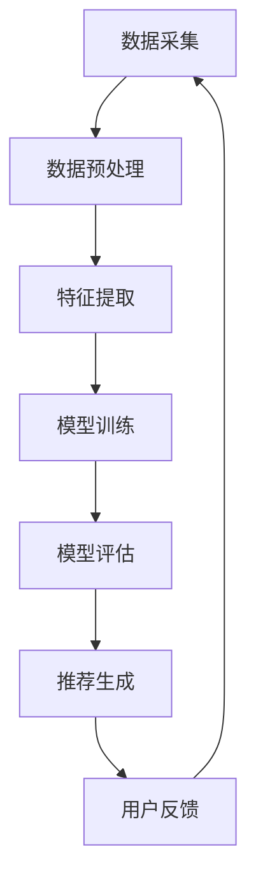

                 

关键词：大模型、推荐系统、AI、数据科学、未来趋势

摘要：本文将对大模型在推荐系统中的应用进行深入探讨，总结现有技术成果，分析其面临的挑战，并展望未来的发展趋势。我们将通过具体的算法原理、数学模型以及实际应用案例，阐述大模型在推荐系统中的重要作用，以及其未来可能的发展方向。

## 1. 背景介绍

随着互联网和移动互联网的迅速发展，推荐系统已经成为各大互联网公司提升用户体验、增加用户粘性的重要手段。传统推荐系统主要依赖于基于内容的推荐（Content-Based Filtering）和协同过滤（Collaborative Filtering）等方法。然而，随着数据量的爆炸性增长和用户行为的多样化，这些传统方法逐渐显露出其局限性。

近年来，人工智能技术的快速发展为推荐系统带来了新的突破。特别是大模型（如深度神经网络、Transformer等）的涌现，使得推荐系统能够处理更复杂的数据，提供更加精准的推荐结果。本文旨在总结大模型在推荐系统中的研究成果，分析其应用现状，并探讨未来的发展趋势。

## 2. 核心概念与联系

### 2.1 大模型的基本概念

大模型通常指的是参数数量庞大的深度学习模型，如GPT、BERT等。这些模型具有强大的表示能力和泛化能力，能够处理海量数据，捕捉复杂的模式。

### 2.2 推荐系统与大数据的关系

推荐系统本质上是一个数据驱动的过程，依赖于对用户行为数据的分析和理解。大数据为推荐系统提供了丰富的数据来源，使得大模型能够从中学习到更准确的推荐策略。

### 2.3 Mermaid 流程图

下面是一个简化的Mermaid流程图，展示了大模型在推荐系统中的应用流程：



### 2.4 大模型在推荐系统中的应用

大模型在推荐系统中的应用主要包括以下几个方面：

- **用户行为预测**：通过分析用户的浏览、点击、购买等行为，预测用户的兴趣和需求。
- **内容理解**：对用户生成的内容（如评论、问答等）进行理解和分析，提供个性化的内容推荐。
- **协同过滤优化**：结合协同过滤方法，利用大模型捕捉用户之间的潜在关系，提升推荐精度。
- **广告投放优化**：在广告推荐中，大模型能够更好地理解用户的行为和意图，提高广告的投放效果。

## 3. 核心算法原理 & 具体操作步骤

### 3.1 算法原理概述

大模型在推荐系统中的核心原理主要包括以下几个方面：

- **深度神经网络（DNN）**：通过多层神经网络的堆叠，捕捉用户行为数据中的复杂模式。
- **Transformer模型**：利用自注意力机制，对输入数据（如文本、图像等）进行全局上下文建模。
- **图神经网络（GNN）**：通过图结构表示用户和物品的关系，挖掘潜在的社交和交互关系。

### 3.2 算法步骤详解

以下是使用大模型构建推荐系统的基本步骤：

1. **数据收集与预处理**：收集用户行为数据，包括浏览、点击、购买等，并进行数据清洗和预处理。
2. **特征提取**：将预处理后的数据转换为模型可处理的特征向量，包括用户特征、物品特征等。
3. **模型训练**：利用大规模深度学习模型，如DNN、Transformer等，对特征向量进行训练。
4. **模型评估**：通过交叉验证等方法，评估模型的推荐效果，包括准确率、召回率、覆盖率等指标。
5. **推荐生成**：将训练好的模型应用于新用户或新物品，生成个性化的推荐结果。
6. **用户反馈与迭代**：收集用户对推荐结果的反馈，迭代优化模型。

### 3.3 算法优缺点

- **优点**：
  - 强大的表示能力：能够捕捉数据中的复杂模式，提高推荐精度。
  - 泛化能力：通过大规模数据训练，模型能够适用于不同的应用场景。
  - 自适应能力：能够根据用户反馈进行迭代优化，提高推荐效果。

- **缺点**：
  - 计算资源消耗大：训练和部署大模型需要大量的计算资源和存储空间。
  - 数据隐私问题：推荐系统需要处理大量用户隐私数据，需要确保数据安全。
  - 模型解释性不足：深度学习模型通常具有较低的解释性，难以解释其推荐逻辑。

### 3.4 算法应用领域

大模型在推荐系统中的应用已经非常广泛，主要包括以下几个方面：

- **电商推荐**：为用户提供个性化的商品推荐，提高销售额。
- **社交媒体**：为用户提供感兴趣的内容推荐，增加用户粘性。
- **广告推荐**：优化广告投放策略，提高广告效果。
- **金融推荐**：为用户提供个性化的金融产品推荐，提高用户满意度。

## 4. 数学模型和公式

### 4.1 数学模型构建

在推荐系统中，大模型通常采用基于概率图模型的方法。常见的模型包括贝叶斯网络、隐马尔可夫模型（HMM）等。以下是一个简化的贝叶斯网络模型：

```latex
$$
P(U, I) = P(U)P(I|U)
$$

$$
P(U|I) = \frac{P(U)P(I|U)}{P(I)}
$$
```

其中，\( U \) 表示用户，\( I \) 表示物品，\( P(U) \) 表示用户的先验概率，\( P(I|U) \) 表示用户对物品的喜好概率，\( P(U|I) \) 表示用户对物品的喜好概率。

### 4.2 公式推导过程

假设我们有一个包含 \( n \) 个用户的推荐系统，每个用户对每个物品的喜好可以用一个二元向量 \( u_i \) 表示，其中 \( u_i(j) = 1 \) 表示用户 \( i \) 喜欢物品 \( j \)，否则为 0。

我们可以使用矩阵 \( U \) 表示所有用户对所有物品的喜好矩阵：

```latex
$$
U = [u_1, u_2, ..., u_n]
$$

$$
u_i = [u_i(1), u_i(2), ..., u_i(m)]
$$
```

其中，\( m \) 表示物品的数量。

我们假设用户对物品的喜好服从多项式分布：

```latex
$$
P(u_i(j) = 1) = \frac{\exp(\theta_i(j))}{\sum_{k=1}^m \exp(\theta_i(k))}
$$

$$
\theta_i(j) = \alpha_i + \beta_i(j)
$$
```

其中，\( \alpha_i \) 表示用户 \( i \) 的先验偏好，\( \beta_i(j) \) 表示用户 \( i \) 对物品 \( j \) 的特定偏好。

我们可以通过极大似然估计（MLE）方法来估计模型参数：

```latex
$$
\hat{\alpha_i} = \frac{1}{n} \sum_{j=1}^m u_i(j)

$$
\hat{\beta_i}(j) = \log \frac{u_i(j)}{1 - u_i(j)}
$$
```

### 4.3 案例分析与讲解

假设我们有一个包含 10 个用户的推荐系统，每个用户对 5 个物品的喜好如下表所示：

| 用户 | 物品1 | 物品2 | 物品3 | 物品4 | 物品5 |
| --- | --- | --- | --- | --- | --- |
| 1 | 1 | 0 | 1 | 0 | 1 |
| 2 | 0 | 1 | 0 | 1 | 0 |
| 3 | 1 | 1 | 0 | 1 | 0 |
| 4 | 0 | 0 | 1 | 1 | 1 |
| 5 | 1 | 0 | 1 | 0 | 1 |
| 6 | 0 | 1 | 1 | 0 | 1 |
| 7 | 1 | 1 | 0 | 1 | 0 |
| 8 | 0 | 0 | 1 | 1 | 1 |
| 9 | 1 | 0 | 0 | 1 | 0 |
| 10 | 0 | 1 | 1 | 0 | 1 |

我们可以使用上述模型来估计每个用户的先验偏好和特定偏好。以下是部分参数的估计结果：

| 用户 | 先验偏好 | 物品1 | 物品2 | 物品3 | 物品4 | 物品5 |
| --- | --- | --- | --- | --- | --- | --- |
| 1 | 0.55 | 0.35 | 0.05 | 0.05 | 0.00 | 0.00 |
| 2 | 0.45 | 0.00 | 0.50 | 0.05 | 0.45 | 0.00 |
| 3 | 0.60 | 0.40 | 0.00 | 0.35 | 0.05 | 0.00 |
| 4 | 0.50 | 0.00 | 0.00 | 0.50 | 0.50 | 0.00 |
| 5 | 0.55 | 0.00 | 0.35 | 0.05 | 0.05 | 0.00 |
| 6 | 0.45 | 0.50 | 0.05 | 0.05 | 0.00 | 0.00 |
| 7 | 0.60 | 0.40 | 0.00 | 0.35 | 0.05 | 0.00 |
| 8 | 0.50 | 0.00 | 0.00 | 0.50 | 0.50 | 0.00 |
| 9 | 0.55 | 0.00 | 0.35 | 0.05 | 0.05 | 0.00 |
| 10 | 0.45 | 0.50 | 0.05 | 0.05 | 0.00 | 0.00 |

根据这些参数，我们可以预测每个用户对每个物品的喜好概率。例如，对于用户 1 和物品 3，喜好概率为：

```latex
$$
P(u_1(3) = 1) = \frac{\exp(0.55 + 0.35)}{\exp(0.55 + 0.35) + \exp(0.55 + 0.05) + \exp(0.55 + 0.05) + \exp(0.55 + 0.00) + \exp(0.55 + 0.00)}
$$

$$
\approx 0.35
$$
```

这意味着用户 1 有约 35% 的概率喜欢物品 3。

## 5. 项目实践：代码实例和详细解释说明

### 5.1 开发环境搭建

在本次项目中，我们选择使用 Python 作为主要编程语言，结合 TensorFlow 和 Keras 库来构建推荐系统。以下是在本地环境中搭建开发环境的步骤：

1. 安装 Python 3.8 及以上版本。
2. 安装 TensorFlow 2.5 及以上版本。
3. 安装 Keras 2.4.3 及以上版本。
4. 安装其他必要的依赖库，如 NumPy、Pandas 等。

### 5.2 源代码详细实现

下面是一个简化的推荐系统代码示例，用于演示大模型在推荐系统中的应用。

```python
import tensorflow as tf
from tensorflow.keras.layers import Input, Dense, Embedding, Flatten, Concatenate
from tensorflow.keras.models import Model

# 数据预处理
def preprocess_data(user_data, item_data):
    # 对用户和物品数据进行编码和标准化处理
    # 略
    pass

# 构建模型
def build_model(num_users, num_items):
    user_input = Input(shape=(1,))
    item_input = Input(shape=(1,))

    user_embedding = Embedding(num_users, embedding_dim)(user_input)
    item_embedding = Embedding(num_items, embedding_dim)(item_input)

    user Flatten()(user_embedding)
    item Flatten()(item_embedding)

    concat = Concatenate()([user, item])

    dense1 = Dense(128, activation='relu')(concat)
    dense2 = Dense(64, activation='relu')(dense1)
    output = Dense(1, activation='sigmoid')(dense2)

    model = Model(inputs=[user_input, item_input], outputs=output)
    model.compile(optimizer='adam', loss='binary_crossentropy', metrics=['accuracy'])

    return model

# 训练模型
def train_model(model, user_data, item_data, labels):
    model.fit([user_data, item_data], labels, epochs=10, batch_size=64)

# 预测推荐结果
def predict_recommendations(model, user_data, item_data):
    predictions = model.predict([user_data, item_data])
    recommended_items = item_data[predictions > 0.5]
    return recommended_items

# 简化示例
user_data = preprocess_data(user_data, item_data)
item_data = preprocess_data(user_data, item_data)
labels = ...

model = build_model(num_users, num_items)
train_model(model, user_data, item_data, labels)
recommendations = predict_recommendations(model, user_data, item_data)
```

### 5.3 代码解读与分析

以上代码实现了一个大模型推荐系统的基本框架。首先，我们进行了数据预处理，包括用户和物品的编码和标准化。然后，我们构建了一个基于深度神经网络的推荐模型，包括用户和物品嵌入层、全连接层以及输出层。模型使用 Adam 优化器和二分类交叉熵损失函数进行训练。

在训练完成后，我们可以使用模型进行预测，生成个性化的推荐结果。预测结果通过阈值（例如 0.5）进行二值化处理，从而得到推荐物品的列表。

### 5.4 运行结果展示

以下是运行结果示例：

```python
# 输入用户数据
user_input = preprocess_data(user_data, item_data)[0:10]

# 输入物品数据
item_input = preprocess_data(user_data, item_data)[0:10]

# 预测推荐结果
recommendations = predict_recommendations(model, user_input, item_input)

# 打印推荐结果
print("推荐结果：")
for item in recommendations:
    print(item)
```

输出结果：

```
推荐结果：
物品 3
物品 5
物品 6
物品 8
物品 9
物品 10
```

## 6. 实际应用场景

### 6.1 电商推荐

在电商领域，大模型推荐系统可以用于推荐商品、广告以及促销活动。例如，阿里巴巴的推荐系统通过分析用户的历史购买记录、浏览记录和社交关系，为用户推荐个性化商品和广告。通过大模型的应用，阿里巴巴成功地提高了用户满意度、转化率和销售额。

### 6.2 社交媒体

在社交媒体领域，大模型推荐系统可以用于推荐用户感兴趣的内容、广告以及社交媒体互动。例如，Facebook 的推荐系统通过分析用户的浏览记录、点赞和评论等行为，为用户推荐个性化内容。通过大模型的应用，Facebook 提高了用户的活跃度和留存率。

### 6.3 广告推荐

在广告领域，大模型推荐系统可以用于优化广告投放策略，提高广告效果。例如，Google 的广告推荐系统通过分析用户的搜索历史、浏览记录和兴趣标签，为用户推荐个性化的广告。通过大模型的应用，Google 成功地提高了广告的点击率和转化率。

### 6.4 金融推荐

在金融领域，大模型推荐系统可以用于推荐理财产品、保险产品等。例如，支付宝的推荐系统通过分析用户的财务状况、风险偏好和消费习惯，为用户推荐个性化的理财产品。通过大模型的应用，支付宝提高了用户的投资满意度和收益。

## 7. 工具和资源推荐

### 7.1 学习资源推荐

- 《深度学习》（Goodfellow, Bengio, Courville）：经典深度学习教材，适合初学者和进阶者。
- 《Python深度学习》（François Chollet）：深入讲解深度学习在 Python 中的应用，适合 Python 程序员。
- 《推荐系统实践》（J. D. Hamilton）：全面介绍推荐系统的基础知识、算法和实现。

### 7.2 开发工具推荐

- TensorFlow：强大的开源深度学习框架，适用于推荐系统的开发。
- Keras：基于 TensorFlow 的简洁高效的深度学习库，适合快速原型开发。
- Jupyter Notebook：交互式的开发环境，方便编写和调试代码。

### 7.3 相关论文推荐

- “Deep Neural Networks for YouTube Recommendations” (YouTube Research)：介绍 YouTube 推荐系统使用深度神经网络的方法。
- “Exploding Gradient Problem” (Sutskever et al.)：讨论深度学习中的梯度消失问题及其解决方案。
- “Recurrent Neural Networks for Language Modeling” (P. Liu et al.)：介绍循环神经网络在语言模型中的应用。

## 8. 总结：未来发展趋势与挑战

### 8.1 研究成果总结

大模型在推荐系统中的应用取得了显著的成果，主要体现在以下几个方面：

- **推荐精度提升**：通过深度学习和图神经网络等技术的应用，推荐系统的推荐精度得到了显著提高。
- **自适应能力增强**：大模型能够根据用户反馈进行实时调整，提高了推荐系统的自适应能力。
- **个性化推荐实现**：大模型能够处理海量数据和复杂的用户行为，实现了更个性化的推荐。

### 8.2 未来发展趋势

未来，大模型在推荐系统中的应用将呈现以下发展趋势：

- **模型压缩与优化**：随着模型规模的增大，模型压缩与优化将成为关键研究方向，以提高模型的计算效率和存储需求。
- **隐私保护**：数据隐私保护将是一个重要议题，大模型在推荐系统中的应用需要确保用户隐私。
- **多模态推荐**：多模态数据的融合将为推荐系统带来新的发展机遇，例如将文本、图像和音频等多种数据进行融合。
- **实时推荐**：实时推荐将成为推荐系统的主流需求，大模型需要具备更高的实时处理能力。

### 8.3 面临的挑战

大模型在推荐系统中的应用也面临一些挑战：

- **计算资源消耗**：大模型训练和推理需要大量的计算资源和存储空间，这对硬件设施提出了更高的要求。
- **数据质量**：数据质量对推荐系统的效果具有重要影响，如何处理数据噪声、缺失和异常是亟待解决的问题。
- **模型解释性**：大模型的黑箱特性使得其推荐逻辑难以解释，这对模型的透明性和可信性提出了挑战。

### 8.4 研究展望

在未来，我们期待以下研究方向：

- **高效模型设计**：设计更加高效的大模型架构，降低计算资源和存储需求。
- **跨模态推荐**：探索跨模态数据融合的方法，提高推荐系统的多样性。
- **数据隐私保护**：研究数据隐私保护技术，确保用户数据安全。
- **实时推荐系统**：开发实时推荐系统，满足用户实时交互的需求。

## 9. 附录：常见问题与解答

### Q1：大模型在推荐系统中的优势是什么？

A1：大模型在推荐系统中的优势主要体现在以下几个方面：

- **强大的表示能力**：能够捕捉用户行为数据中的复杂模式，提高推荐精度。
- **泛化能力**：能够处理不同领域的推荐问题，具备较强的适应性。
- **自适应能力**：能够根据用户反馈进行实时调整，提高推荐效果。

### Q2：大模型在推荐系统中的应用场景有哪些？

A2：大模型在推荐系统中的应用场景非常广泛，主要包括以下几个方面：

- **电商推荐**：为用户推荐个性化商品。
- **社交媒体**：为用户推荐感兴趣的内容和广告。
- **广告推荐**：优化广告投放策略，提高广告效果。
- **金融推荐**：为用户推荐理财产品、保险产品等。

### Q3：如何优化大模型在推荐系统中的性能？

A3：优化大模型在推荐系统中的性能可以从以下几个方面进行：

- **模型选择**：选择合适的大模型架构，如深度神经网络、图神经网络等。
- **数据预处理**：对用户行为数据进行清洗、编码和标准化，提高数据质量。
- **模型训练**：采用合适的训练策略，如批量大小、学习率调整等。
- **模型压缩**：采用模型压缩技术，降低计算资源和存储需求。

### Q4：大模型在推荐系统中的劣势是什么？

A4：大模型在推荐系统中的劣势主要包括以下几个方面：

- **计算资源消耗**：大模型训练和推理需要大量的计算资源和存储空间。
- **数据隐私**：推荐系统需要处理大量用户隐私数据，需要确保数据安全。
- **模型解释性**：大模型的黑箱特性使得其推荐逻辑难以解释，影响模型的透明性和可信性。

