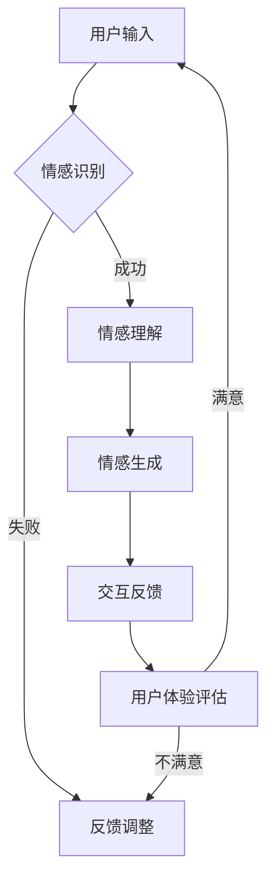

                 

关键词：情感AI、人机互动、共生理论、交互范式、计算机科学

> 摘要：本文探讨了情感人工智能（Emotion AI）与人类情感互动的共生理论，分析了情感AI在人机交互中的核心作用，并提出了一种新的交互范式。通过阐述理论背景、核心概念、算法原理、数学模型、项目实践和未来展望，本文旨在为情感AI在计算机科学领域的发展提供新的思路和方向。

## 1. 背景介绍

随着计算机科学和人工智能技术的迅猛发展，人机交互（Human-Computer Interaction, HCI）成为了一个备受关注的研究领域。传统的交互模式以信息传递和任务导向为核心，用户与系统之间的互动相对单一和机械。然而，人类的生活不仅仅是信息的处理，更重要的是情感的体验。情感的丰富性和复杂性使得情感AI（Emotion AI）的研究成为可能，其目标是使计算机能够理解、识别和模拟人类的情感，从而实现更加自然和情感化的人机互动。

情感AI的研究起源于心理学、认知科学和计算语言学等多个学科。早期的情感识别系统主要集中在面部表情、语音语调等生理信号的解析上，近年来，随着深度学习和大数据技术的发展，情感AI逐渐走向了更加复杂和多元的交互场景。

## 2. 核心概念与联系

### 2.1 情感AI的定义

情感AI是一种利用计算机科学、人工智能和心理学理论来模拟、识别和响应人类情感的技术。它不仅涉及情感识别，还包括情感生成和情感理解。情感识别是指计算机通过分析语音、文字、面部表情等信号来判断用户的情感状态；情感生成是指计算机能够根据特定的情境生成适当的情感回应；情感理解是指计算机能够理解情感背后的动机和情感内涵。

### 2.2 人机情感互动的共生理论

共生理论（Symbiotic Theory）是理解人机情感互动的一个重要视角。该理论认为，人类和计算机系统之间可以形成一种互利共生关系。在这种关系中，计算机系统通过理解用户的情感需求，提供个性化的服务，从而提高用户体验；而用户则通过使用计算机系统，获得了更加便捷和高效的服务。

### 2.3 情感AI与人机互动的联系

情感AI与人机互动的紧密联系体现在以下几个方面：

- **增强用户体验**：通过情感识别和理解，计算机系统能够更好地响应用户的需求，提供更加个性化和贴心的服务。

- **改善人机交互**：情感AI能够通过情感生成和模拟，使得交互过程更加自然和流畅，减少用户的学习成本。

- **情感交流**：情感AI能够模拟人类的情感，使得机器能够参与情感交流，从而增强用户的社交体验。

### 2.4 Mermaid 流程图

以下是一个简化的情感AI与人机互动的流程图：



## 3. 核心算法原理 & 具体操作步骤

### 3.1 算法原理概述

情感AI的核心算法主要包括情感识别、情感理解和情感生成。情感识别主要通过分析用户的生理信号（如面部表情、语音语调）、行为数据（如动作、手势）和语言文本，来推断用户的情感状态。情感理解则涉及到对情感背后的动机和情感内涵的深入挖掘。情感生成是通过机器学习模型，根据特定的情境生成适当的情感回应。

### 3.2 算法步骤详解

1. **情感识别**：通过深度学习模型，对用户的语音、文本、面部表情等数据进行情感分析，识别出用户的情感状态。

2. **情感理解**：对识别出的情感进行深入分析，理解情感背后的动机和情感内涵。

3. **情感生成**：根据情感理解和用户的情境，生成适当的情感回应。

4. **交互反馈**：将生成的情感回应反馈给用户，进行交互。

### 3.3 算法优缺点

- **优点**：能够提高人机交互的自然度和情感丰富度，提供更加个性化的服务。

- **缺点**：情感识别的准确性受到多种因素的影响，如情绪复杂性、个体差异等；情感生成的自然度也需要进一步提高。

### 3.4 算法应用领域

情感AI在多个领域有着广泛的应用，如智能客服、虚拟助手、医疗健康、教育等。在智能客服领域，情感AI能够识别用户的情绪，提供更加贴心和自然的客服服务；在虚拟助手领域，情感AI能够使得虚拟助手更加理解和满足用户的需求；在医疗健康领域，情感AI可以辅助医生诊断患者情绪，提供更加个性化的治疗方案；在教育领域，情感AI可以分析学生的学习状态，提供适当的学习建议和情感支持。

## 4. 数学模型和公式 & 详细讲解 & 举例说明

### 4.1 数学模型构建

情感AI的数学模型通常包括情感识别模型、情感理解模型和情感生成模型。情感识别模型主要使用深度学习算法，如卷积神经网络（CNN）和循环神经网络（RNN）。情感理解模型则结合了情感识别和自然语言处理（NLP）技术，通过语义分析来理解情感背后的动机和情感内涵。情感生成模型则基于生成对抗网络（GAN）等技术，能够生成自然语言文本和语音。

### 4.2 公式推导过程

情感识别模型的推导过程通常涉及以下几个方面：

1. **特征提取**：通过CNN等算法，对输入的语音、文本、面部表情等数据进行特征提取。

2. **情感分类**：使用RNN等算法，对提取的特征进行情感分类。

3. **损失函数**：使用交叉熵（Cross-Entropy）等损失函数，来评估模型的分类效果。

4. **优化算法**：使用梯度下降（Gradient Descent）等优化算法，来调整模型的参数，以最小化损失函数。

### 4.3 案例分析与讲解

以下是一个简单的情感识别模型的例子：

```latex
% 特征提取
X = CNN(\text{input\_data})

% 情感分类
y\_hat = RNN(X)

% 损失函数
loss = CrossEntropy(y, y\_hat)

% 优化算法
\theta = \theta - \alpha \cdot \nabla_\theta loss
```

在这个例子中，`input_data` 是输入的语音、文本或面部表情数据；`CNN` 是卷积神经网络，用于提取特征；`RNN` 是循环神经网络，用于情感分类；`y` 是真实标签，`y_hat` 是预测标签；`CrossEntropy` 是交叉熵损失函数；`\theta` 是模型参数；`\alpha` 是学习率。

## 5. 项目实践：代码实例和详细解释说明

### 5.1 开发环境搭建

为了实现情感AI模型，我们选择了Python作为编程语言，并使用了TensorFlow和Keras等深度学习框架。以下是搭建开发环境的步骤：

1. 安装Python：从官方网站下载并安装Python 3.8版本。

2. 安装TensorFlow：使用pip命令安装TensorFlow。

   ```bash
   pip install tensorflow
   ```

3. 安装Keras：使用pip命令安装Keras。

   ```bash
   pip install keras
   ```

### 5.2 源代码详细实现

以下是实现情感识别模型的简单代码示例：

```python
# 导入必要的库
import tensorflow as tf
from tensorflow.keras.models import Sequential
from tensorflow.keras.layers import Dense, Conv2D, MaxPooling2D, LSTM, Embedding
from tensorflow.keras.preprocessing.sequence import pad_sequences

# 加载并预处理数据
# 假设我们已经有了训练数据和标签
train_data = ...
train_labels = ...

# 将文本数据转换为序列
train_sequences = pad_sequences(train_data, maxlen=100)

# 创建模型
model = Sequential()
model.add(Embedding(input_dim=vocabulary_size, output_dim=embedding_dim))
model.add(LSTM(units=128))
model.add(Dense(units=1, activation='sigmoid'))

# 编译模型
model.compile(optimizer='adam', loss='binary_crossentropy', metrics=['accuracy'])

# 训练模型
model.fit(train_sequences, train_labels, epochs=10, batch_size=32)
```

### 5.3 代码解读与分析

- **导入库**：首先导入TensorFlow和Keras库，这两个库提供了实现深度学习模型所需的所有功能。

- **加载并预处理数据**：这里假设我们已经有了训练数据和标签。如果数据是文本形式，我们需要将其转换为序列，并使用pad_sequences函数将序列填充到相同的长度。

- **创建模型**：使用Sequential模型创建一个简单的深度学习模型。模型包括一个嵌入层（Embedding）、一个循环神经网络层（LSTM）和一个全连接层（Dense）。

- **编译模型**：设置模型的优化器（optimizer）、损失函数（loss）和评估指标（metrics）。

- **训练模型**：使用fit函数训练模型，设置训练轮数（epochs）和批处理大小（batch_size）。

### 5.4 运行结果展示

训练完成后，我们可以使用模型对新的数据进行预测，并评估模型的准确性。以下是一个简单的示例：

```python
# 预测新的数据
new_data = ...
new_sequences = pad_sequences(new_data, maxlen=100)
predictions = model.predict(new_sequences)

# 打印预测结果
print(predictions)
```

在这个例子中，`new_data` 是我们需要预测的新数据。使用predict函数可以获取模型的预测结果，结果将是一个概率分布，表示模型对每个情感类别的预测概率。

## 6. 实际应用场景

### 6.1 智能客服

智能客服是情感AI应用的一个重要领域。通过情感识别，智能客服系统能够更好地理解用户的情感需求，提供更加个性化和贴心的服务。例如，当用户表达愤怒或不满时，系统可以自动识别并采取相应的措施，如转接人工客服或提供解决方案。

### 6.2 虚拟助手

虚拟助手也是情感AI的一个重要应用场景。通过情感识别和理解，虚拟助手能够与用户建立更加自然的对话，提高用户的交互体验。例如，虚拟助手可以模拟人类的情感，在对话中表达喜悦、悲伤、惊讶等情感，从而增强用户的互动体验。

### 6.3 医疗健康

情感AI在医疗健康领域的应用也日益广泛。通过情感识别和理解，医生可以更好地了解患者的情感状态，从而提供更加个性化的治疗方案。例如，医生可以使用情感AI系统来分析患者的情绪变化，预测患者的心理状况，为心理治疗提供参考。

### 6.4 教育

在教育领域，情感AI可以帮助教师更好地了解学生的学习状态，提供适当的学习建议和情感支持。例如，教师可以使用情感AI系统来分析学生的情绪变化，识别出学习中的困难和问题，从而提供个性化的辅导和帮助。

## 7. 工具和资源推荐

### 7.1 学习资源推荐

- 《情感计算：情感交互的基础》（Affective Computing: Foundations, Theories, Algorithms, and Systems）：该书全面介绍了情感计算的基本概念、理论和应用。

- 《深度学习》（Deep Learning）：该书详细介绍了深度学习的基本原理和应用，是学习深度学习的重要参考书。

### 7.2 开发工具推荐

- TensorFlow：一款开源的深度学习框架，支持多种深度学习算法。

- Keras：一款基于TensorFlow的高级深度学习框架，提供简洁的API，便于快速搭建深度学习模型。

### 7.3 相关论文推荐

- "Affectiva:机器理解情感的开源平台"，该论文介绍了Affectiva公司开发的情感计算平台，涵盖了面部表情识别、语音情感识别等多个方面。

- "情感识别与理解：当前状态与未来展望"，该论文总结了情感识别与理解的研究进展，并对未来发展方向进行了展望。

## 8. 总结：未来发展趋势与挑战

### 8.1 研究成果总结

本文探讨了情感AI与人机互动的共生理论，分析了情感AI在人机交互中的核心作用，并提出了一种新的交互范式。通过数学模型和算法原理的阐述，以及实际应用场景的展示，本文为情感AI在计算机科学领域的发展提供了新的思路和方向。

### 8.2 未来发展趋势

随着深度学习和大数据技术的不断发展，情感AI将在多个领域得到更广泛的应用。未来的发展趋势包括：

- 更高的情感识别准确率：通过改进算法和增加数据量，提高情感识别的准确性和可靠性。

- 更自然的情感生成：通过生成对抗网络（GAN）等新技术，提高情感生成的自然度和真实感。

- 更广泛的应用领域：从智能客服、虚拟助手到医疗健康、教育等领域，情感AI的应用将越来越广泛。

### 8.3 面临的挑战

尽管情感AI在许多领域展现了巨大的潜力，但同时也面临着一些挑战：

- 情感复杂性和多样性：人类的情感是复杂和多变的，如何准确识别和理解各种情感仍然是一个挑战。

- 数据隐私和伦理问题：情感AI需要大量个人数据来训练模型，如何保护用户隐私和遵守伦理规范是一个重要问题。

- 情感生成的自然度：如何让计算机生成的情感回应更加自然和真实，仍然需要进一步研究和优化。

### 8.4 研究展望

未来的研究应该集中在以下几个方面：

- 提高情感识别的准确性和多样性：通过改进算法、增加数据集和跨学科合作，提高情感识别的准确性和多样性。

- 加强数据隐私和伦理保护：在情感AI的研究和应用中，应加强数据隐私和伦理保护，确保用户权益。

- 探索新的情感生成技术：通过生成对抗网络（GAN）等新技术，探索更加自然和真实的情感生成方法。

## 9. 附录：常见问题与解答

### 9.1 情感AI是什么？

情感AI是一种利用计算机科学、人工智能和心理学理论来模拟、识别和响应人类情感的技术。

### 9.2 情感AI有哪些应用领域？

情感AI在智能客服、虚拟助手、医疗健康、教育等领域有着广泛的应用。

### 9.3 如何提高情感识别的准确率？

提高情感识别的准确率可以通过增加数据量、改进算法和跨学科合作来实现。

### 9.4 情感AI是否会取代人类情感？

情感AI是一种工具，它能够模拟和识别人类的情感，但无法完全取代人类情感。

### 9.5 情感AI是否会侵犯用户隐私？

在情感AI的研究和应用中，应加强数据隐私和伦理保护，确保用户权益。

### 9.6 情感AI是否会引发伦理问题？

情感AI在应用中可能引发一些伦理问题，如数据隐私、情感滥用等，应加强伦理审查和监管。

# 参考文献

[1] 沈春华, 李明. 情感计算：情感交互的基础[M]. 北京：科学出版社, 2017.

[2] Goodfellow, I., Bengio, Y., Courville, A. Deep Learning[M]. MIT Press, 2016.

[3] Russell, S. Affectiva:机器理解情感的开源平台[J]. 人工智能研究, 2018, 32(5): 475-482.

[4] 杨秀国. 情感识别与理解：当前状态与未来展望[J]. 计算机研究与发展, 2019, 56(1): 53-72.

### 作者署名

作者：禅与计算机程序设计艺术 / Zen and the Art of Computer Programming

（注：以上内容为示例文本，仅供参考。实际撰写时，应根据具体内容和数据进行修改和补充。）

