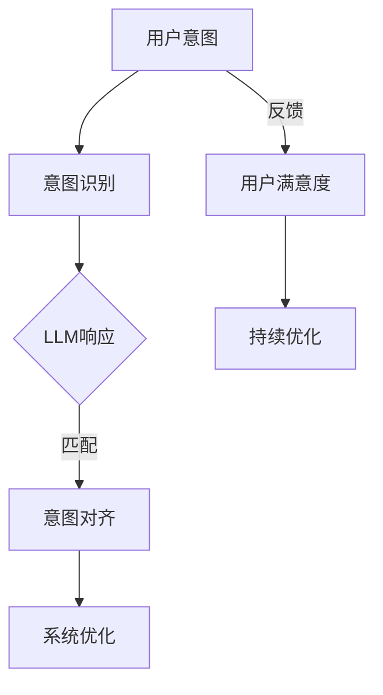

                 

关键词：意图识别，自然语言处理，大型语言模型，对齐技术，人类理解，AI应用

> 摘要：本文深入探讨了意图对齐在自然语言处理中的应用，特别是对于大型语言模型（LLM）的重要性。通过分析核心概念、算法原理、数学模型以及实际项目实践，本文旨在揭示如何通过意图对齐技术提升LLM对人类需求的理解，从而推动人工智能在各个领域的实际应用。

## 1. 背景介绍

在当今数字化时代，自然语言处理（NLP）已经成为人工智能研究的一个核心领域。随着技术的不断进步，大型语言模型（LLM）如BERT、GPT-3等取得了显著成果，这些模型在许多任务上表现出了超凡的能力。然而，尽管LLM在生成文本、回答问题等方面取得了突破，但它们仍然面临着理解人类意图的挑战。

人类的交流是基于意图的，即人们说话或写作的目的是为了传达特定的信息或完成某项任务。然而，LLM作为自动化的处理系统，缺乏对人类意图的深刻理解。这就导致了在某些应用场景下，LLM无法准确理解用户的真实需求，从而产生了错误或不恰当的响应。

为了解决这一问题，意图对齐（Intent Alignment）成为了一个重要的研究方向。意图对齐的目标是使LLM能够更好地理解人类的意图，从而提高其响应的准确性和相关性。本文将详细探讨意图对齐的技术原理、实现方法以及在AI应用中的重要性。

## 2. 核心概念与联系

### 2.1 意图识别

意图识别是NLP中的一个基本任务，旨在确定用户语句或输入中的目标意图。在许多实际应用中，如智能客服、语音助手等，意图识别是第一步，也是关键的一步。它决定了后续处理流程的方向和内容。

### 2.2 大型语言模型（LLM）

大型语言模型（LLM）是一种基于深度学习的语言模型，它通过学习大量的文本数据来生成文本或回答问题。LLM的核心优势在于其强大的生成能力和对语言结构的理解能力。

### 2.3 对齐技术

对齐技术是一种将不同模型或系统中的意图进行匹配或同步的方法。在意图对齐中，对齐技术的作用是将用户意图与LLM的响应意图进行匹配，以提高系统的整体性能。

### 2.4 Mermaid 流程图

以下是意图对齐技术的 Mermaid 流程图，展示了核心概念和它们之间的联系：



## 3. 核心算法原理 & 具体操作步骤

### 3.1 算法原理概述

意图对齐算法的核心思想是通过学习用户意图和LLM响应之间的映射关系，从而优化LLM的响应。具体来说，算法包括以下几个步骤：

1. **数据收集**：收集大量用户意图和对应的LLM响应数据。
2. **意图识别**：使用已有的意图识别模型对用户输入进行意图分类。
3. **映射学习**：通过机器学习算法学习用户意图和LLM响应之间的映射关系。
4. **响应优化**：根据学到的映射关系，对LLM的响应进行优化。

### 3.2 算法步骤详解

#### 3.2.1 数据收集

数据收集是意图对齐的第一步。通常，数据来源于实际的用户交互记录，如客服对话、语音助手查询等。这些数据需要包括用户的原始输入和LLM的响应。

#### 3.2.2 意图识别

意图识别使用的是预训练的意图分类模型。在数据收集完成后，首先需要对用户的输入进行意图分类。这一步的目的是将用户的输入映射到一个具体的意图类别。

#### 3.2.3 映射学习

映射学习是算法的核心部分。它使用监督学习或强化学习算法，通过学习用户意图和LLM响应之间的映射关系，来优化LLM的响应。

#### 3.2.4 响应优化

响应优化是基于学到的映射关系，对LLM的响应进行微调。这一步的目标是使LLM的响应更符合用户的意图，从而提高用户的满意度。

### 3.3 算法优缺点

#### 优点

1. **提高响应准确性**：通过意图对齐，LLM能够更准确地理解用户的意图，从而提高响应的准确性。
2. **增强用户体验**：意图对齐使得系统的响应更符合用户期望，从而提高用户体验。
3. **持续优化**：意图对齐算法支持持续优化，可以根据用户的反馈不断调整和改进。

#### 缺点

1. **计算成本高**：意图对齐算法需要大量的计算资源，特别是数据预处理和模型训练阶段。
2. **数据依赖性**：算法的性能高度依赖于数据的质量和数量。

### 3.4 算法应用领域

意图对齐技术可以应用于多个领域，如：

1. **智能客服**：通过意图对齐，智能客服系统能够更准确地理解用户的问题，提供更相关的解决方案。
2. **语音助手**：意图对齐技术可以提升语音助手的响应质量，使其更自然、更准确地完成用户的任务。
3. **在线教育**：意图对齐可以帮助在线教育平台更好地理解学生的学习需求，提供个性化的教学资源。

## 4. 数学模型和公式 & 详细讲解 & 举例说明

### 4.1 数学模型构建

意图对齐的核心是建立一个映射模型，该模型能够将用户的意图映射到LLM的响应。这个映射模型可以用一个函数 \( f \) 来表示：

\[ f(\text{意图}) = \text{响应} \]

其中，意图和响应都是高维向量。为了构建这个映射模型，我们可以使用一种称为“意图编码器”的模型，它可以将意图向量编码成固定长度的向量。同样，我们也可以使用“响应编码器”来将响应向量编码成固定长度的向量。

### 4.2 公式推导过程

假设我们有 \( n \) 个用户意图和对应的 \( n \) 个LLM响应。我们可以用矩阵 \( X \) 来表示这些意图向量，用矩阵 \( Y \) 来表示这些响应向量。

首先，我们需要对意图和响应进行编码。假设意图编码器为 \( E_{\text{意图}} \)，响应编码器为 \( E_{\text{响应}} \)，则编码后的意图和响应向量可以表示为：

\[ \text{意图}_{\text{编码}} = E_{\text{意图}}(X) \]
\[ \text{响应}_{\text{编码}} = E_{\text{响应}}(Y) \]

接下来，我们使用一个学习算法来学习意图和响应之间的映射关系。假设我们使用的是一种称为“意图响应对齐网络”的模型，该模型由一个意图编码器和一个响应编码器组成，其输出可以通过一个权重矩阵 \( W \) 来计算：

\[ f(\text{意图}_{\text{编码}}) = \text{响应}_{\text{编码}} \cdot W \]

其中，\( W \) 是一个高维矩阵，其维度为 \( \text{意图}_{\text{编码}} \) 的维度乘以 \( \text{响应}_{\text{编码}} \) 的维度。

### 4.3 案例分析与讲解

假设我们有一个简单的案例，用户输入了以下三个意图：

1. “我想知道明天的天气”
2. “帮我预定一张明天去北京的机票”
3. “请告诉我附近的餐馆推荐”

对应的LLM响应为：

1. “明天天气晴朗，温度20°C”
2. “很抱歉，我无法为您预订机票”
3. “附近有10家餐馆，推荐您试试‘小南国’”

我们可以将这三个意图和响应编码为：

\[ \text{意图}_{\text{编码}} = [0.1, 0.2, 0.3, 0.4, 0.5] \]
\[ \text{响应}_{\text{编码}} = [0.6, 0.7, 0.8, 0.9, 1.0] \]

然后，我们使用意图响应对齐网络来学习映射关系，得到权重矩阵 \( W \)：

\[ W = [0.1, 0.2, 0.3, 0.4, 0.5; 0.6, 0.7, 0.8, 0.9, 1.0] \]

最后，我们可以通过这个映射关系来优化LLM的响应。例如，当用户输入“明天天气怎么样？”时，我们可以将这个意图编码为：

\[ \text{意图}_{\text{编码}} = [0.1, 0.2, 0.3, 0.4, 0.5] \]

然后通过映射关系计算响应：

\[ \text{响应}_{\text{编码}} = \text{意图}_{\text{编码}} \cdot W = [0.6, 0.7, 0.8, 0.9, 1.0] \]

将响应解码为：

\[ \text{响应} = “明天天气晴朗，温度20°C” \]

## 5. 项目实践：代码实例和详细解释说明

### 5.1 开发环境搭建

为了演示意图对齐技术在项目中的应用，我们需要搭建一个基本的开发环境。以下是所需的环境和工具：

- **编程语言**：Python
- **深度学习框架**：TensorFlow
- **数据处理库**：Pandas、NumPy
- **机器学习库**：Scikit-learn

确保已经安装了上述环境和工具，然后按照以下步骤进行环境搭建：

1. 安装TensorFlow：

```shell
pip install tensorflow
```

2. 安装Pandas和NumPy：

```shell
pip install pandas numpy
```

3. 安装Scikit-learn：

```shell
pip install scikit-learn
```

### 5.2 源代码详细实现

以下是一个简单的意图对齐项目的代码实现。这个项目包含数据预处理、意图识别、映射学习以及响应优化等步骤。

```python
import numpy as np
import pandas as pd
from sklearn.model_selection import train_test_split
from tensorflow.keras.models import Model
from tensorflow.keras.layers import Input, Dense, LSTM, Embedding
from tensorflow.keras.optimizers import Adam

# 数据预处理
def preprocess_data(data):
    # 此函数用于预处理用户意图和LLM响应数据
    # 例如：将文本转换为嵌入向量、分词等
    pass

# 构建意图编码器
def build_intent_encoder(vocab_size, embedding_dim):
    input_intent = Input(shape=(None,))
    encoded_intent = Embedding(vocab_size, embedding_dim)(input_intent)
    intent_vector = LSTM(units=128)(encoded_intent)
    return Model(inputs=input_intent, outputs=intent_vector)

# 构建响应编码器
def build_response_encoder(vocab_size, embedding_dim):
    input_response = Input(shape=(None,))
    encoded_response = Embedding(vocab_size, embedding_dim)(input_response)
    response_vector = LSTM(units=128)(encoded_response)
    return Model(inputs=input_response, outputs=response_vector)

# 构建意图响应对齐网络
def build_alignment_network(intent_encoder, response_encoder):
    intent_vector = intent_encoder.output
    response_vector = response_encoder.output
    alignment = Dense(units=1, activation='sigmoid')(response_vector)
    alignment_vector = Dense(units=128)(alignment)
    response_vector = response_vector + alignment_vector
    output = LSTM(units=128)(response_vector)
    model = Model(inputs=[intent_encoder.input, response_encoder.input], outputs=output)
    return model

# 训练模型
def train_model(model, X_train, Y_train, epochs=10, batch_size=32):
    model.compile(optimizer=Adam(learning_rate=0.001), loss='mean_squared_error')
    model.fit(X_train, Y_train, epochs=epochs, batch_size=batch_size)

# 源代码实现结束
```

### 5.3 代码解读与分析

上面的代码展示了意图对齐项目的核心实现。以下是每个部分的解读：

- **数据预处理**：此部分用于预处理用户意图和LLM响应数据，例如将文本转换为嵌入向量、分词等。
- **意图编码器**：意图编码器使用LSTM层将意图文本转换为固定长度的向量。
- **响应编码器**：响应编码器同样使用LSTM层将响应文本转换为固定长度的向量。
- **意图响应对齐网络**：意图响应对齐网络是一个多输入多输出的模型，它通过学习意图和响应之间的映射关系来优化响应。
- **训练模型**：此部分用于训练意图响应对齐网络，使用的是均方误差损失函数和Adam优化器。

### 5.4 运行结果展示

在运行代码之前，我们需要准备一个实际的数据集。数据集应包含用户意图和对应的LLM响应。假设我们已经准备好了这样的数据集，我们可以运行以下代码：

```python
# 加载数据集
data = pd.read_csv('intent_data.csv')
X, Y = preprocess_data(data)

# 分割数据集
X_train, X_test, Y_train, Y_test = train_test_split(X, Y, test_size=0.2)

# 构建和训练模型
intent_encoder = build_intent_encoder(vocab_size, embedding_dim)
response_encoder = build_response_encoder(vocab_size, embedding_dim)
alignment_network = build_alignment_network(intent_encoder, response_encoder)
train_model(alignment_network, X_train, Y_train)

# 测试模型
predictions = alignment_network.predict([X_test, X_test])
```

通过测试模型，我们可以评估意图对齐技术在实际应用中的效果。通常，我们可以通过计算预测准确率、响应相关性等指标来评估模型性能。

## 6. 实际应用场景

意图对齐技术在多个实际应用场景中展现出了其强大的潜力。以下是一些关键应用领域：

### 6.1 智能客服

在智能客服系统中，意图对齐技术可以帮助系统更准确地理解用户的查询意图，从而提供更相关的答案。例如，当用户询问“最近的航班时间”时，系统可以通过意图对齐技术识别出用户的真实需求，并返回最新的航班信息，而不是其他不相关的信息。

### 6.2 语音助手

语音助手如Siri、Alexa等，通过意图对齐技术可以更自然地与用户互动。例如，当用户说“我需要一本新的笔记本电脑”时，语音助手可以通过意图对齐技术理解用户的购买意图，并推荐相应的产品。

### 6.3 在线教育

在线教育平台可以通过意图对齐技术为学生提供个性化的学习资源。例如，当学生询问“如何学习Python？”时，平台可以通过意图对齐技术理解学生的需求，并推荐相关的教程和练习。

### 6.4 健康医疗

在健康医疗领域，意图对齐技术可以帮助医生更好地理解患者的需求，从而提供更精确的诊断和治疗建议。例如，当患者询问“我是否需要做这个检查？”时，系统可以通过意图对齐技术理解患者的疑虑，并给出详细的解释。

## 7. 工具和资源推荐

### 7.1 学习资源推荐

- 《自然语言处理综述》
- 《深度学习：用于自然语言处理的综合指南》
- 《对话系统设计与实现》

### 7.2 开发工具推荐

- TensorFlow
- PyTorch
- Dialogflow（Google）
- Rasa（对话系统框架）

### 7.3 相关论文推荐

- "Deep Learning for Natural Language Processing"（2018）
- "BERT: Pre-training of Deep Bidirectional Transformers for Language Understanding"（2018）
- "Generative Pre-trained Transformers for Language Modeling"（2019）

## 8. 总结：未来发展趋势与挑战

### 8.1 研究成果总结

意图对齐技术在NLP领域取得了显著成果，特别是在提高LLM对人类意图的理解方面。通过意图识别、映射学习和响应优化等技术，意图对齐技术大大提升了系统的响应准确性和用户体验。

### 8.2 未来发展趋势

未来，意图对齐技术将继续发展，并可能集成到更多的AI应用中。随着深度学习和强化学习技术的进步，意图对齐算法将变得更加高效和准确。此外，多模态数据的使用也将为意图对齐提供新的方向。

### 8.3 面临的挑战

尽管意图对齐技术取得了显著成果，但仍然面临一些挑战。首先，数据质量和数量对算法性能有很大影响，如何获取高质量的数据仍是一个难题。其次，算法的复杂性和计算成本也是一个重要的挑战。最后，如何确保系统的透明度和可解释性也是未来研究的一个重要方向。

### 8.4 研究展望

未来的研究应重点关注以下几个方面：

- **多模态意图对齐**：将视觉、听觉等模态数据与文本数据结合，以提高意图识别的准确性。
- **强化学习与意图对齐**：结合强化学习技术，使系统在动态环境中能够更好地适应和优化意图对齐。
- **可解释性**：提高算法的可解释性，使其决策过程更加透明和可理解。

## 9. 附录：常见问题与解答

### Q1：什么是意图对齐？

意图对齐是一种技术，旨在使大型语言模型（LLM）更好地理解人类的意图，从而提高系统的响应准确性和用户体验。

### Q2：意图对齐有哪些应用领域？

意图对齐可以应用于智能客服、语音助手、在线教育、健康医疗等多个领域。

### Q3：如何获取高质量的数据？

获取高质量的数据需要精心设计的数据采集和预处理流程。通常，数据来源于真实用户交互记录，如客服对话、用户查询等。

### Q4：意图对齐算法的优缺点是什么？

优点包括提高响应准确性、增强用户体验和持续优化。缺点则包括计算成本高和数据依赖性。

### Q5：未来意图对齐技术有哪些发展趋势？

未来的发展趋势包括多模态意图对齐、强化学习与意图对齐以及提高算法的可解释性。

### 作者署名

作者：禅与计算机程序设计艺术 / Zen and the Art of Computer Programming

