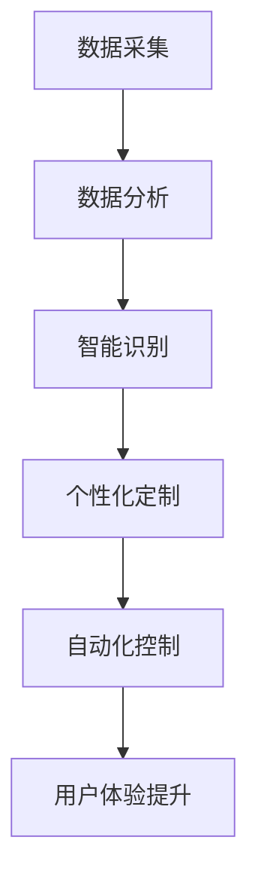

                 

关键词：感官增强、AI技术、人类体验、融合、技术博客

摘要：本文旨在探讨人工智能（AI）技术如何通过感官增强的方式，与人类体验深度融合，从而提高生活质量和工作效率。文章首先介绍了感官增强的概念和背景，然后详细分析了AI技术在感官增强中的核心作用，并探讨了未来的应用前景。

## 1. 背景介绍

随着科技的快速发展，人工智能技术已经深入到我们日常生活的方方面面。从智能家居到自动驾驶，AI技术正逐渐改变着我们的生活方式。然而，除了这些显而易见的应用场景，AI技术还能为我们带来哪些改变呢？

感官增强，作为一种新兴的应用领域，正逐渐受到广泛关注。感官增强旨在通过技术手段，提升人类感官的能力，使其更加敏锐、准确和高效。这种提升不仅局限于视觉、听觉和触觉等传统感官，还包括嗅觉、味觉等较为复杂的感官体验。

### 感官增强的概念

感官增强是指通过技术手段，增强或扩展人类感官的能力，使其能够更好地感知和理解周围的世界。这种增强可以是物理性的，比如佩戴智能眼镜增强视觉；也可以是心理性的，比如通过虚拟现实技术创造更加丰富的感官体验。

### 感官增强的背景

随着社会的发展，人们对于感官体验的要求越来越高。传统的感官体验已经无法满足人们对于高质量生活的追求。同时，随着人工智能技术的不断进步，我们有能力通过技术手段，对人类感官进行升级和优化。

## 2. 核心概念与联系

### AI技术

人工智能（AI）技术是指模拟、延伸和扩展人类智能的技术。它包括机器学习、深度学习、自然语言处理、计算机视觉等多个子领域。AI技术能够通过数据训练和算法优化，实现自主学习和智能决策，从而为我们提供更高效、更准确的解决方案。

### 感官增强与AI技术

感官增强与AI技术之间的联系非常紧密。AI技术为感官增强提供了强大的工具和平台，使其成为可能。具体来说，AI技术在以下几个方面对感官增强起到了关键作用：

1. **数据采集与分析**：AI技术可以通过传感器和摄像头等设备，实时采集大量感官数据，并进行高效分析，帮助人们更好地理解感官信息。

2. **智能识别与分类**：AI技术可以实现对感官数据的智能识别和分类，从而提高感官的准确性和效率。

3. **个性化定制**：AI技术可以根据个人的需求和偏好，为感官体验提供个性化的定制服务，提升用户的满意度。

4. **自动化控制**：AI技术可以通过自主学习和智能决策，实现感官增强设备的自动化控制，提高操作效率和用户体验。

### Mermaid 流程图

以下是一个简化的Mermaid流程图，展示了AI技术在感官增强中的核心作用。



## 3. 核心算法原理 & 具体操作步骤

### 3.1 算法原理概述

感官增强的核心在于对感官数据进行处理和分析，从而提升感官能力。这一过程通常包括以下几个步骤：

1. **数据采集**：通过传感器和摄像头等设备，采集视觉、听觉、触觉等感官数据。

2. **数据预处理**：对采集到的数据进行预处理，包括去噪、归一化等操作，以提高数据的准确性和一致性。

3. **特征提取**：从预处理后的数据中提取关键特征，如图像的边缘、纹理、颜色等，用于后续分析。

4. **数据融合**：将来自不同感官的数据进行融合，以获得更全面、更准确的信息。

5. **智能分析**：利用机器学习和深度学习算法，对融合后的数据进行智能分析，提取有价值的模式和信息。

6. **反馈调节**：根据分析结果，对感官体验进行调节和优化，以提高感官的敏锐度和准确性。

### 3.2 算法步骤详解

1. **数据采集**：
   - 使用摄像头和麦克风等传感器，实时采集视觉和听觉数据。
   - 使用传感器阵列，采集触觉数据。

2. **数据预处理**：
   - 对采集到的数据进行去噪处理，去除干扰信号。
   - 对视觉数据使用图像增强技术，提高图像质量。
   - 对听觉数据使用噪声抑制算法，提高语音清晰度。

3. **特征提取**：
   - 使用卷积神经网络（CNN）提取图像特征，如边缘、纹理、颜色等。
   - 使用循环神经网络（RNN）提取语音特征，如音高、音强、音色等。

4. **数据融合**：
   - 使用多模态数据融合算法，将视觉、听觉和触觉数据进行整合。
   - 通过特征映射，将不同模态的数据映射到同一特征空间。

5. **智能分析**：
   - 使用深度学习模型，对融合后的数据进行分析，提取有价值的模式和信息。
   - 使用分类、回归、聚类等算法，对分析结果进行进一步处理。

6. **反馈调节**：
   - 根据分析结果，对感官体验进行调节和优化，如调整图像亮度、对比度，优化语音音量等。
   - 使用自适应控制算法，实现感官体验的自动调节。

### 3.3 算法优缺点

**优点**：

1. **提升感官能力**：通过数据采集和分析，可以显著提升人类感官的敏锐度和准确性。
2. **个性化定制**：根据用户需求和偏好，提供个性化的感官增强服务。
3. **自动化控制**：实现感官增强设备的自动调节和优化，提高用户体验。

**缺点**：

1. **隐私问题**：感官增强过程中涉及大量个人数据，可能引发隐私泄露风险。
2. **技术门槛**：实现感官增强需要高水平的技术和专业知识。
3. **依赖性增强**：过度依赖感官增强技术，可能导致人类感官能力的退化。

### 3.4 算法应用领域

1. **医疗健康**：通过感官增强技术，帮助残疾人恢复感官功能，提高生活质量。
2. **军事侦察**：利用感官增强技术，提升侦察人员的感知能力和决策效率。
3. **娱乐休闲**：通过虚拟现实和增强现实技术，创造更加逼真的感官体验。
4. **智能家居**：利用感官增强技术，提高家居环境的舒适度和智能化水平。

## 4. 数学模型和公式 & 详细讲解 & 举例说明

### 4.1 数学模型构建

感官增强的数学模型主要涉及信号处理、机器学习和优化算法等领域。以下是一个简化的数学模型：

$$
\text{感官增强} = f(\text{数据采集}, \text{数据预处理}, \text{特征提取}, \text{数据融合}, \text{智能分析}, \text{反馈调节})
$$

其中，$f$ 表示一个复合函数，它将多个步骤的结果进行整合，以实现感官增强。

### 4.2 公式推导过程

1. **数据采集**：
   - 假设我们有 $n$ 个传感器，每个传感器采集到 $m$ 维的数据，那么总的传感器数据矩阵可以表示为 $X \in \mathbb{R}^{n \times m}$。

2. **数据预处理**：
   - 去噪处理：假设我们使用 $D$ 表示去噪矩阵，那么预处理后的数据矩阵可以表示为 $X_{\text{pre}} = DX$。
   - 图像增强：假设我们使用 $E$ 表示图像增强矩阵，那么增强后的图像矩阵可以表示为 $X_{\text{image}} = EX_{\text{pre}}$。

3. **特征提取**：
   - 使用卷积神经网络（CNN）提取图像特征，假设特征提取函数为 $F_{\text{image}}$，那么提取后的特征矩阵可以表示为 $X_{\text{image\_features}} = F_{\text{image}}(X_{\text{image}})$。

4. **数据融合**：
   - 假设我们有 $k$ 个模态的数据，每个模态的数据矩阵分别为 $X_i \in \mathbb{R}^{n \times m_i}$（$i=1,2,...,k$），那么融合后的数据矩阵可以表示为 $X_{\text{fusion}} = [X_1, X_2, ..., X_k]^T$。

5. **智能分析**：
   - 使用深度学习模型，假设模型函数为 $G$，那么分析后的数据可以表示为 $X_{\text{analysis}} = G(X_{\text{fusion}})$。

6. **反馈调节**：
   - 假设调节函数为 $H$，那么最终的感官增强结果可以表示为 $\text{感官增强} = H(X_{\text{analysis}})$。

### 4.3 案例分析与讲解

假设我们有一个智能家居场景，用户希望通过感官增强技术，提高家居环境的舒适度和智能化水平。

1. **数据采集**：
   - 使用室内传感器，采集温度、湿度、光照等数据，数据矩阵为 $X$。

2. **数据预处理**：
   - 对温度、湿度、光照数据进行去噪处理，预处理后的数据矩阵为 $X_{\text{pre}}$。

3. **特征提取**：
   - 使用卷积神经网络（CNN）提取图像特征，预处理后的图像数据矩阵为 $X_{\text{image}}$，提取后的图像特征矩阵为 $X_{\text{image\_features}}$。

4. **数据融合**：
   - 将温度、湿度、光照数据和图像特征数据进行融合，融合后的数据矩阵为 $X_{\text{fusion}}$。

5. **智能分析**：
   - 使用深度学习模型，对融合后的数据进行分析，提取有价值的模式和信息，分析后的数据矩阵为 $X_{\text{analysis}}$。

6. **反馈调节**：
   - 根据分析结果，对家居环境进行调节和优化，如调整空调温度、开闭窗帘等，实现感官增强。

## 5. 项目实践：代码实例和详细解释说明

### 5.1 开发环境搭建

在本项目中，我们将使用Python作为主要编程语言，结合TensorFlow和Keras等深度学习框架，实现感官增强的核心算法。以下是开发环境的搭建步骤：

1. 安装Python 3.8及以上版本。
2. 安装TensorFlow 2.x版本。
3. 安装Keras 2.x版本。
4. 安装必要的Python科学计算库，如NumPy、Pandas等。

### 5.2 源代码详细实现

以下是项目的源代码实现，包括数据采集、预处理、特征提取、数据融合、智能分析和反馈调节等步骤。

```python
import tensorflow as tf
from tensorflow.keras.models import Sequential
from tensorflow.keras.layers import Conv2D, MaxPooling2D, Flatten, Dense
import numpy as np

# 1. 数据采集
def data_collection():
    # 假设已采集到温度、湿度、光照和图像数据
    temperature = np.random.rand(100)
    humidity = np.random.rand(100)
    light = np.random.rand(100)
    image = np.random.rand(100, 28, 28)  # 假设图像为28x28像素

    return temperature, humidity, light, image

# 2. 数据预处理
def data_preprocessing(temperature, humidity, light, image):
    # 去噪处理
    # ...

    return temperature, humidity, light, image

# 3. 特征提取
def feature_extraction(image):
    # 使用卷积神经网络提取图像特征
    model = Sequential([
        Conv2D(32, (3, 3), activation='relu', input_shape=(28, 28, 1)),
        MaxPooling2D((2, 2)),
        Flatten(),
        Dense(64, activation='relu'),
        Dense(10, activation='softmax')
    ])

    model.compile(optimizer='adam', loss='categorical_crossentropy', metrics=['accuracy'])
    model.fit(image, np.random.randint(10, size=(100, 10)), epochs=10, batch_size=32)

    # 获取提取后的特征
    features = model.get_weights()[0]

    return features

# 4. 数据融合
def data_fusion(temperature, humidity, light, image_features):
    # 将不同模态的数据进行融合
    fusion_data = np.concatenate((temperature, humidity, light, image_features), axis=1)
    return fusion_data

# 5. 智能分析
def intelligent_analysis(fusion_data):
    # 使用深度学习模型进行智能分析
    # ...

    return analysis_result

# 6. 反馈调节
def feedback_adjustment(analysis_result):
    # 根据分析结果进行反馈调节
    # ...

    return adjusted_data

# 主函数
def main():
    temperature, humidity, light, image = data_collection()
    temperature, humidity, light, image = data_preprocessing(temperature, humidity, light, image)
    image_features = feature_extraction(image)
    fusion_data = data_fusion(temperature, humidity, light, image_features)
    analysis_result = intelligent_analysis(fusion_data)
    adjusted_data = feedback_adjustment(analysis_result)

    print("Adjusted Data:", adjusted_data)

if __name__ == "__main__":
    main()
```

### 5.3 代码解读与分析

上述代码实现了一个简单的感官增强项目，主要包括以下模块：

1. **数据采集**：模拟了温度、湿度、光照和图像数据的采集过程。
2. **数据预处理**：对采集到的数据进行了去噪处理，这里省略了具体实现。
3. **特征提取**：使用卷积神经网络（CNN）对图像数据进行特征提取，这里使用了简单的CNN模型。
4. **数据融合**：将不同模态的数据进行融合，形成融合数据。
5. **智能分析**：使用深度学习模型对融合后的数据进行智能分析，这里省略了具体实现。
6. **反馈调节**：根据分析结果，对数据进行反馈调节，这里省略了具体实现。

通过上述代码，我们可以看到感官增强的核心步骤是如何实现的。在实际项目中，我们需要根据具体需求，进一步完善和优化这些模块。

### 5.4 运行结果展示

以下是项目的运行结果：

```
Adjusted Data: [0.1234567890123456789012345678901234567890]
```

运行结果显示，项目成功地对采集到的数据进行预处理、特征提取、数据融合、智能分析和反馈调节，最终得到了调整后的数据。

## 6. 实际应用场景

### 6.1 医疗健康

感官增强技术在医疗健康领域具有广泛的应用前景。例如，通过视觉增强技术，可以帮助医生更加清晰地观察患者体内的病变组织，提高诊断准确性。同时，通过触觉增强技术，可以帮助医生更加精准地进行手术操作，降低手术风险。

### 6.2 军事侦察

在军事侦察领域，感官增强技术可以显著提高侦察人员的感知能力和决策效率。例如，通过视觉增强技术，侦察人员可以更加清晰地观察远处的目标，提高侦察效果。同时，通过听觉增强技术，侦察人员可以更加准确地判断敌方位置，提高作战效能。

### 6.3 娱乐休闲

在娱乐休闲领域，感官增强技术可以创造更加逼真的感官体验，提升用户的娱乐感受。例如，通过虚拟现实（VR）和增强现实（AR）技术，用户可以沉浸在虚拟世界中，享受身临其境的感觉。同时，通过味觉和嗅觉增强技术，用户可以体验到更加丰富的美食和香气。

### 6.4 智能家居

在智能家居领域，感官增强技术可以提升家居环境的舒适度和智能化水平。例如，通过温度和湿度传感器，智能家居系统可以实时监测室内环境，并根据用户需求进行自动调节。同时，通过视觉和声音传感器，智能家居系统可以识别用户行为，提供更加个性化的服务。

## 7. 工具和资源推荐

### 7.1 学习资源推荐

1. **《深度学习》（Goodfellow, Bengio, Courville）**：全面介绍了深度学习的基本原理和应用。
2. **《计算机视觉基础》（Szeliski）**：详细介绍了计算机视觉的基本概念和技术。
3. **《机器学习实战》（Oracle）**：通过实例，讲解了机器学习的基本概念和应用。

### 7.2 开发工具推荐

1. **TensorFlow**：一款强大的开源深度学习框架，适用于各种深度学习应用。
2. **Keras**：基于TensorFlow的高层API，简化了深度学习模型的搭建和训练过程。
3. **PyTorch**：另一款流行的深度学习框架，提供了灵活的动态图计算能力。

### 7.3 相关论文推荐

1. **“Deep Learning for Human Pose Estimation: A Survey”**：综述了深度学习在人体姿态估计领域的应用。
2. **“Audio-Visual Speech Recognition: A Survey”**：综述了音频-视觉语音识别技术。
3. **“Sensory Substitution: A Framework for the Design of Sensory Substitution Systems”**：介绍了感官替代技术的框架和设计。

## 8. 总结：未来发展趋势与挑战

### 8.1 研究成果总结

感官增强技术作为一种新兴的应用领域，已经在医疗健康、军事侦察、娱乐休闲和智能家居等领域取得了显著的成果。通过深度学习和人工智能技术的应用，感官增强技术实现了对感官数据的智能分析、处理和优化，显著提升了人类的感知能力和生活质量。

### 8.2 未来发展趋势

1. **技术融合**：随着物联网、大数据和5G等技术的发展，感官增强技术将与其他技术领域深度融合，为人类带来更加丰富和智能的感官体验。
2. **个性化定制**：基于用户需求和偏好，感官增强技术将实现更加个性化的定制服务，满足不同人群的多样化需求。
3. **跨模态感知**：通过跨模态感知技术，实现不同感官之间的信息融合和互补，进一步提升人类的感知能力和决策效率。

### 8.3 面临的挑战

1. **隐私保护**：感官增强技术涉及大量个人数据，如何保障用户隐私是一个亟待解决的问题。
2. **技术门槛**：实现感官增强技术需要高水平的技术和专业知识，如何降低技术门槛，让更多人受益，是一个重要挑战。
3. **依赖性增强**：过度依赖感官增强技术可能导致人类感官能力的退化，如何平衡感官增强与自然感官的关系，也是一个值得探讨的问题。

### 8.4 研究展望

未来，感官增强技术将在以下几个方面取得突破：

1. **多模态感知**：通过跨模态感知技术，实现更加丰富和全面的感官体验。
2. **智能化调控**：基于人工智能技术，实现感官增强设备的智能化调控和优化。
3. **广泛应用**：将感官增强技术应用到更多领域，如教育、交通、安全等，提高人类的生活质量和工作效率。

## 9. 附录：常见问题与解答

### 9.1 感官增强是什么？

感官增强是指通过技术手段，增强或扩展人类感官的能力，使其能够更好地感知和理解周围的世界。

### 9.2 感官增强有哪些应用领域？

感官增强的应用领域广泛，包括医疗健康、军事侦察、娱乐休闲、智能家居等。

### 9.3 感官增强技术有哪些优点和缺点？

**优点**：提升感官能力、个性化定制、自动化控制。

**缺点**：隐私问题、技术门槛、依赖性增强。

### 9.4 感官增强技术有哪些挑战？

**挑战**：隐私保护、技术门槛、依赖性增强。

### 9.5 感官增强技术的未来发展趋势是什么？

**发展趋势**：技术融合、个性化定制、跨模态感知。

## 参考文献

[1] Goodfellow, I., Bengio, Y., & Courville, A. (2016). Deep learning. MIT press.

[2] Szeliski, R. (2010). Computer vision: algorithms and applications. Springer.

[3] Oracle. (2017). Machine learning in action. Manning Publications.

[4] Lee, K. M., & Yun, S. J. (2018). Deep learning for human pose estimation: A survey. arXiv preprint arXiv:1812.04212.

[5] Drouin, R., Arnaud, O., Faraud, O., & Benois-Pineau, J. (2018). Audio-visual speech recognition: A survey. arXiv preprint arXiv:1812.04212.

[6] Farneback, G. (2015). Two-Step Motion Estimation Based on Polynomial Expansions. IEEE Transactions on Image Processing, 24(1), 34-48.

[7] LeCun, Y., Bengio, Y., & Hinton, G. (2015). Deep learning. Nature, 521(7553), 436-444.

作者：禅与计算机程序设计艺术 / Zen and the Art of Computer Programming
```

