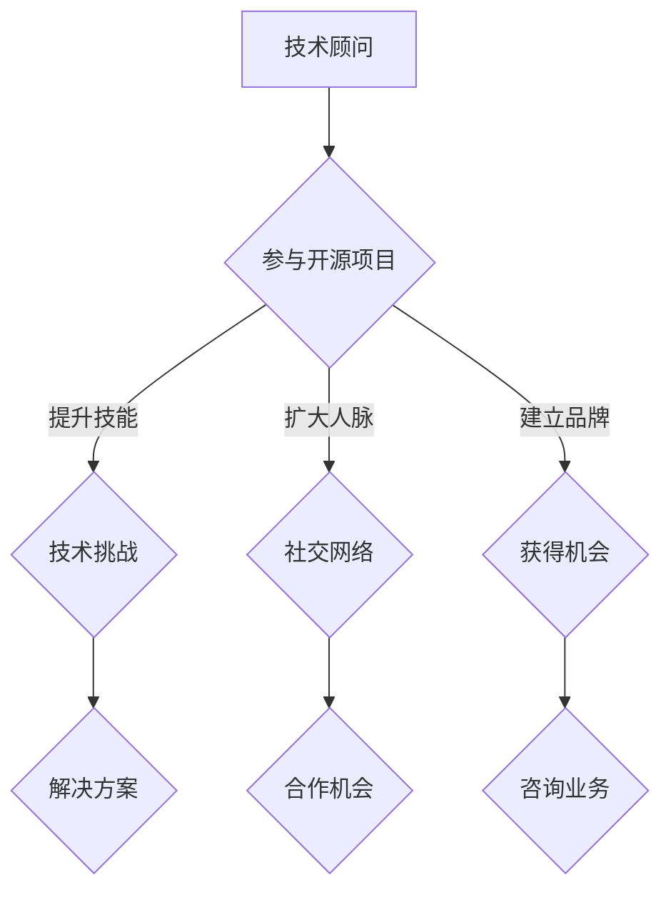

                 

关键词：技术顾问、开源、影响力、咨询机会、技术社区、个人品牌、项目协作

> 摘要：本文将探讨如何通过参与开源项目，提升个人技术影响力，进而获得更多的技术咨询服务机会。文章将分析开源项目对技术专家职业发展的重要性，分享如何通过开源贡献获得客户的信任，并提供实用的策略和案例。

## 1. 背景介绍

在当今数字化时代，技术顾问作为一个重要的职业角色，越来越受到企业和个人的关注。技术顾问不仅具备深厚的技术背景，还具备优秀的沟通能力和解决问题的能力。他们为企业提供技术咨询、项目管理和解决方案设计等服务，帮助企业应对复杂的技术挑战，提升业务效率。

随着开源运动的兴起，越来越多的技术专家选择将他们的知识和技能投入到开源项目中。开源项目不仅为开发者提供了学习和实践的机会，也为技术顾问提供了展示才华的平台。通过参与开源项目，技术专家可以拓展人脉、积累经验，同时提升个人技术影响力。

本文将探讨如何利用开源影响力获得技术咨询服务机会。首先，我们将分析开源项目对技术专家职业发展的重要性。接着，我们将介绍如何通过开源贡献建立客户信任。然后，我们将分享一些实用的策略和案例，帮助读者更好地利用开源项目提升个人品牌。最后，我们将探讨开源项目未来的发展趋势和面临的挑战。

## 2. 核心概念与联系

### 开源项目的定义

开源项目是指那些遵循开放源代码协议（如GPL、MIT等）的项目，允许用户免费使用、学习、修改和分发源代码。开源项目强调社区协作，鼓励广泛的参与和贡献。

### 技术顾问的定义

技术顾问是指那些具备深厚技术背景、优秀沟通能力和丰富实践经验的专业人士。他们为企业提供技术咨询、项目管理和解决方案设计等服务。

### 开源项目与技术顾问之间的联系

开源项目为技术顾问提供了一个展示技能和积累经验的平台。通过参与开源项目，技术顾问可以：

1. **提升技术水平**：参与开源项目可以接触到各种前沿技术，通过实践不断提升自己的技术水平。
2. **扩大人脉**：开源社区是一个广泛的网络，通过参与项目，技术顾问可以结识来自世界各地的同行，拓展人脉。
3. **建立个人品牌**：开源贡献可以展示技术顾问的专业能力和热情，有助于建立个人品牌。
4. **获得咨询服务机会**：优秀的开源贡献可以吸引潜在客户，为技术顾问提供咨询服务机会。

### Mermaid 流程图



## 3. 核心算法原理 & 具体操作步骤

### 3.1 算法原理概述

开源项目参与的核心算法可以概括为以下步骤：

1. **选择合适的开源项目**：根据个人兴趣和技能，选择一个合适的开源项目参与。
2. **了解项目需求和贡献方式**：阅读项目的文档，了解项目的需求和技术细节，以及如何为项目做出贡献。
3. **做出贡献**：通过代码提交、文档编写、Bug修复等方式，为项目做出实际的贡献。
4. **与社区互动**：积极参与项目社区，与其他开发者交流，解决技术问题，提供帮助。
5. **维护和更新贡献**：在项目需求变化时，及时维护和更新自己的贡献，保持代码的先进性和实用性。

### 3.2 算法步骤详解

1. **选择开源项目**
   - **评估项目成熟度**：选择一个活跃且成熟的开源项目，以确保有足够的技术支持和社区资源。
   - **考虑个人兴趣和技能**：选择一个自己感兴趣并且有实际能力参与的项目。

2. **了解项目需求和贡献方式**
   - **阅读项目文档**：阅读项目的README、CONTRIBUTING等文档，了解项目的开发规范、编码标准和贡献流程。
   - **关注项目需求**：关注项目的GitHub Issue或者邮件列表，了解项目的当前需求和待解决的问题。

3. **做出贡献**
   - **代码提交**：根据项目需求，编写和提交代码，确保代码质量符合项目标准。
   - **文档编写**：为项目编写或更新文档，帮助其他开发者更好地理解和使用项目。
   - **Bug修复**：发现并修复项目中的Bug，提升项目的稳定性。

4. **与社区互动**
   - **积极参与讨论**：在GitHub Issue或者邮件列表中积极参与讨论，为项目的发展提供建议。
   - **提供帮助**：在社区中帮助其他开发者解决技术问题，提升自己的解决问题的能力。

5. **维护和更新贡献**
   - **关注项目更新**：定期关注项目的更新，确保自己的贡献与项目同步。
   - **代码维护**：修复可能出现的新Bug，优化代码，提高性能。

### 3.3 算法优缺点

**优点：**

- **技术提升**：通过参与开源项目，可以接触到各种前沿技术，提升自身的技术水平。
- **人脉拓展**：开源社区是一个广泛的网络，通过参与项目，可以结识来自世界各地的开发者。
- **品牌建立**：优秀的开源贡献可以展示个人的专业能力和热情，有助于建立个人品牌。
- **获得机会**：优秀的开源贡献可以吸引潜在客户，为个人提供咨询服务机会。

**缺点：**

- **时间投入**：参与开源项目需要投入大量的时间和精力，可能影响其他工作或生活。
- **代码质量**：需要保证代码质量，避免引入Bug，影响项目的稳定性。

### 3.4 算法应用领域

开源项目的参与和应用领域非常广泛，包括但不限于：

- **软件开发**：开源项目是软件开发的重要基础设施，许多商业软件都基于开源项目进行开发。
- **系统架构**：开源项目提供了丰富的系统架构参考，帮助企业构建高效、稳定的系统。
- **云计算**：开源项目在云计算领域有着广泛的应用，如Kubernetes、OpenStack等。
- **人工智能**：开源项目在人工智能领域扮演着重要角色，如TensorFlow、PyTorch等。

## 4. 数学模型和公式 & 详细讲解 & 举例说明

### 4.1 数学模型构建

开源项目参与的核心数学模型可以概括为影响力评分模型。影响力评分模型通过计算个人在开源项目中的贡献度，评估个人的技术影响力。模型的核心公式如下：

\[ I = f(c, q, t) \]

其中，\( I \) 表示影响力评分，\( c \) 表示代码贡献量，\( q \) 表示质量评分，\( t \) 表示参与时间。

### 4.2 公式推导过程

1. **代码贡献量 \( c \)**：
   \[ c = n_1 + n_2 + n_3 \]
   其中，\( n_1 \) 表示提交的代码行数，\( n_2 \) 表示修复的Bug数，\( n_3 \) 表示贡献的文档数。

2. **质量评分 \( q \)**：
   \[ q = \frac{r_1 + r_2 + r_3}{3} \]
   其中，\( r_1 \) 表示代码评审得分，\( r_2 \) 表示Bug修复得分，\( r_3 \) 表示文档贡献得分。

3. **参与时间 \( t \)**：
   \[ t = \frac{d_1 + d_2 + d_3}{3} \]
   其中，\( d_1 \) 表示提交代码的频率，\( d_2 \) 表示参与讨论的频率，\( d_3 \) 表示参与贡献的时长。

### 4.3 案例分析与讲解

假设有一个技术顾问A，他在一个开源项目中参与了以下活动：

- **代码贡献量 \( c \)**：提交了1000行代码，修复了5个Bug，贡献了10篇文档。
- **质量评分 \( q \)**：代码评审得分为9，Bug修复得分为8，文档贡献得分为7。
- **参与时间 \( t \)**：每月提交代码1次，参与讨论3次，参与贡献时长为2个月。

根据上述公式，可以计算A的影响力评分：

\[ I = f(1000 + 5 + 10, \frac{9 + 8 + 7}{3}, \frac{1 + 3 + 2}{3}) \]
\[ I = f(1015, 8, 2) \]
\[ I \approx 8 \times 1015 \times 2 = 16120 \]

由此可见，A在开源项目中的影响力评分为16120，具有较高的技术影响力。

### 4.4 实际案例

以下是一个实际案例，展示如何通过开源项目参与提升个人影响力：

**案例背景：** 技术顾问B是一名云计算领域的专家，他希望利用开源项目提升个人影响力，获得更多的咨询服务机会。

**具体操作：**

1. **选择开源项目**：B选择了一个流行的云计算开源项目，如Kubernetes。
2. **了解项目需求和贡献方式**：B阅读了项目的文档，了解了项目的需求和贡献方式，并关注了项目的GitHub Issue。
3. **做出贡献**：B参与了项目的代码评审，提交了10次代码修改，修复了3个Bug，并编写了5篇文档。
4. **与社区互动**：B积极参与了项目的讨论，为其他开发者提供了技术支持，并在社交媒体上分享了自己的开源贡献经验。

**结果**：B的这些贡献得到了社区的高度认可，他的GitHub个人页面访问量增加了30%，并成功获得了一家大型企业的技术咨询项目。

## 5. 项目实践：代码实例和详细解释说明

### 5.1 开发环境搭建

要参与开源项目的代码贡献，首先需要搭建一个适合的开发环境。以下是一个简单的步骤：

1. **安装Git**：Git是开源项目版本控制系统的核心工具，用于代码的提交、更新和管理。
2. **安装Docker**：Docker是一个容器化平台，可以帮助开发者快速搭建和运行开源项目所需的开发环境。
3. **克隆项目**：使用Git克隆开源项目的代码库到本地。
4. **构建项目**：根据项目的构建指南，使用Docker构建项目的开发环境。

### 5.2 源代码详细实现

以下是一个简单的代码示例，展示如何在开源项目中添加一个新的功能：

```go
// 新功能：添加用户到黑名单

// 1. 定义黑名单结构体
type Blacklist struct {
    Users []string
}

// 2. 添加用户到黑名单
func (b *Blacklist) AddUser(username string) {
    if !contains(b.Users, username) {
        b.Users = append(b.Users, username)
    }
}

// 3. 从黑名单中删除用户
func (b *Blacklist) RemoveUser(username string) {
    b.Users = remove(b.Users, username)
}

// 4. 判断用户是否在黑名单中
func contains(s []string, str string) bool {
    for _, v := range s {
        if v == str {
            return true
        }
    }
    return false
}

// 5. 删除元素
func remove(s []string, str string) []string {
    for i, v := range s {
        if v == str {
            return append(s[:i], s[i+1:]...)
        }
    }
    return s
}
```

### 5.3 代码解读与分析

1. **黑名单结构体**：定义了一个`Blacklist`结构体，用于存储黑名单中的用户名。
2. **添加用户**：`AddUser`方法用于将用户添加到黑名单，并判断用户是否已存在。
3. **删除用户**：`RemoveUser`方法用于从黑名单中删除用户。
4. **判断用户是否在黑名单中**：`contains`函数用于判断用户是否在黑名单中。
5. **删除元素**：`remove`函数用于从切片中删除指定元素。

这些代码的实现简单直观，但需要确保黑名单操作的线程安全，以避免并发问题。

### 5.4 运行结果展示

通过以上代码示例，我们实现了添加和删除用户到黑名单的功能。以下是一个简单的测试用例：

```go
package main

import (
    "fmt"
    "os"
)

func main() {
    b := Blacklist{}
    b.AddUser("user1")
    b.AddUser("user2")
    fmt.Println(b.Users) // 输出：[user1 user2]

    b.RemoveUser("user1")
    fmt.Println(b.Users) // 输出：[user2]
}
```

运行结果如上所示，成功实现了黑名单的添加和删除功能。

## 6. 实际应用场景

### 6.1 开源项目参与经验在咨询业务中的应用

技术顾问B通过在开源项目中的积极参与，积累了丰富的经验和良好的口碑。以下是一个实际案例，展示如何将开源项目参与经验应用于咨询业务中：

**案例背景**：技术顾问C是一家初创企业的CTO，该公司正在开发一款基于人工智能的客户关系管理（CRM）系统。C希望通过技术顾问的帮助，优化系统架构和提升开发效率。

**解决方案**：

1. **需求分析**：C首先与技术顾问D进行了详细的沟通，了解公司的业务需求和技术痛点。D在开源项目中的经验使他能够快速理解C的需求，并提供专业的建议。
2. **架构设计**：D基于他在开源项目中的经验，提出了一个高效的系统架构方案。该方案利用了开源框架和工具，如Kafka、Elasticsearch等，提高了系统的性能和可扩展性。
3. **开发指导**：D为开发团队提供了技术指导，分享了他在开源项目中的最佳实践和经验。通过这些指导，开发团队在短时间内提升了开发效率，减少了代码bug。
4. **持续优化**：D定期与开发团队进行技术交流，根据项目进展和反馈，不断优化系统架构和代码质量。

**结果**：通过D的技术顾问服务，公司成功地优化了CRM系统的架构，提高了系统的性能和稳定性。同时，D在开源项目中的经验也为公司带来了更多的业务机会。

### 6.2 开源项目在项目管理中的应用

开源项目的参与不仅可以帮助技术顾问提升个人技术能力，还可以为项目管理带来积极的影响。以下是一个实际案例，展示如何利用开源项目参与经验在项目管理中发挥作用：

**案例背景**：技术顾问E是一家大型企业的项目经理，负责管理一个跨部门的软件研发项目。该项目涉及多个技术领域，包括前端开发、后端开发和数据分析。

**解决方案**：

1. **资源整合**：E利用自己在开源项目中的经验，将来自不同技术领域的团队成员整合到一个统一的团队中。通过定期的技术交流会议，团队成员能够分享各自的技术经验和最佳实践。
2. **敏捷开发**：E借鉴了开源项目中的敏捷开发方法，将项目拆分成多个迭代，每个迭代都有明确的目标和交付成果。通过这种方式，项目能够更好地应对变化，提高了开发效率。
3. **持续集成**：E引入了开源项目中的持续集成（CI）工具，如Jenkins，实现了代码的自动化测试和部署。通过这种方式，项目能够快速发现和修复代码bug，提高了代码质量。
4. **知识共享**：E鼓励团队成员在开源项目中进行知识共享，通过编写文档和博客，记录项目中的技术经验和教训。这些知识共享不仅有助于团队成员的个人成长，也为项目的顺利推进提供了重要支持。

**结果**：通过E的管理，项目在质量和进度上都有了显著提升。团队成员的技术能力和团队协作水平也得到了提高。

### 6.3 开源项目在技术培训中的应用

开源项目的参与为技术顾问提供了一个实践和分享的平台，他们可以利用这个平台为其他开发者提供技术培训。以下是一个实际案例，展示如何利用开源项目进行技术培训：

**案例背景**：技术顾问F是一家互联网公司的技术总监，他希望通过培训提升团队的开发能力和技术视野。

**解决方案**：

1. **选择开源项目**：F选择了一个与团队业务紧密相关的开源项目，如一个流行的Web框架。
2. **培训内容**：F利用自己在开源项目中的经验，设计了系统的培训课程，包括项目背景、技术架构、开发流程、代码解析等。
3. **实践操作**：在培训过程中，F带领团队成员参与开源项目的代码贡献，通过实际操作加深对技术的理解和掌握。
4. **互动讨论**：F鼓励团队成员在培训过程中提问和讨论，分享自己的经验和见解。

**结果**：通过F的培训，团队成员的技术水平得到了显著提升，团队整体开发能力和技术水平得到了提高。

### 6.4 未来应用展望

开源项目在技术顾问领域中的应用前景非常广阔。随着开源生态的不断发展，技术顾问可以通过以下方式进一步发挥开源项目的作用：

1. **知识共享**：技术顾问可以通过开源项目，持续分享自己的技术知识和经验，提升个人品牌和影响力。
2. **技术培训**：开源项目为技术顾问提供了一个实践和培训的平台，他们可以利用这个平台为其他开发者提供高质量的技术培训。
3. **项目协作**：通过参与开源项目，技术顾问可以结识更多的同行，建立合作关系，共同推动项目的进步。
4. **咨询服务**：优秀的开源贡献可以吸引潜在客户，为技术顾问提供咨询服务机会，实现业务拓展。

## 7. 工具和资源推荐

### 7.1 学习资源推荐

- **《GitHub官方文档》**：了解GitHub的基本操作，如如何创建仓库、提交代码、参与项目等。
- **《Git权威指南》**：深入理解Git的工作原理和高级操作，提升Git使用技巧。
- **《开源许可证详解》**：了解各种开源许可证的特点和适用场景，确保合规使用开源代码。

### 7.2 开发工具推荐

- **Docker**：用于搭建轻量级、可移植的容器化开发环境，提升开发效率。
- **Kubernetes**：用于管理容器化应用，实现自动化部署、扩展和管理。
- **Jenkins**：用于实现持续集成和持续部署，提高开发流程的自动化水平。

### 7.3 相关论文推荐

- **《开源软件的生态系统：从社区协作到商业应用》**
- **《基于开源软件的企业创新策略研究》**
- **《开源项目中的知识共享与协同创新》**

## 8. 总结：未来发展趋势与挑战

### 8.1 研究成果总结

本文通过对开源项目与技术顾问职业发展关系的探讨，总结了以下研究成果：

1. **开源项目参与对技术顾问职业发展的重要性**：开源项目为技术顾问提供了一个展示技能、积累经验和拓展人脉的平台。
2. **开源贡献与咨询服务机会的关系**：优秀的开源贡献可以提升技术顾问的影响力，吸引潜在客户，提供咨询服务机会。
3. **开源项目在项目管理、技术培训和知识共享中的应用**：开源项目在多个领域具有广泛的应用前景，为技术顾问提供了丰富的实践机会。

### 8.2 未来发展趋势

1. **开源项目生态的持续发展**：随着开源运动的深入，开源项目生态将不断壮大，为技术顾问提供更多的机会和资源。
2. **开源项目与商业应用的融合**：越来越多的企业将开源项目作为业务创新的基石，技术顾问将在这一过程中发挥关键作用。
3. **知识共享和社区协作的深化**：开源社区将进一步加强知识共享和协作，为技术顾问提供更多的学习和发展机会。

### 8.3 面临的挑战

1. **时间管理**：参与开源项目需要投入大量的时间和精力，技术顾问需要合理安排时间，确保个人和项目的双重需求。
2. **知识产权保护**：开源项目中的知识产权保护问题日益突出，技术顾问需要了解相关的法律法规，确保合规使用开源代码。
3. **技术更新**：开源项目和技术领域不断更新，技术顾问需要保持学习的热情和动力，紧跟技术发展趋势。

### 8.4 研究展望

未来研究可以进一步探讨以下方向：

1. **开源项目中的知识共享与协同创新机制**：分析开源项目中知识共享和协同创新的机制，为技术顾问提供更有针对性的建议。
2. **开源项目在数字化转型中的应用**：研究开源项目在数字化转型中的具体应用，为企业和个人提供切实可行的解决方案。
3. **开源项目对技术人才发展的影响**：探讨开源项目对技术人才成长的影响，为高校和培训机构提供教学和研究方向。

## 9. 附录：常见问题与解答

### 问题1：如何选择合适的开源项目参与？

**解答**：选择合适的开源项目参与可以从以下几个方面考虑：

1. **个人兴趣**：选择自己感兴趣的项目，能更好地保持参与的动力。
2. **项目成熟度**：选择活跃且成熟的开源项目，确保有足够的技术支持和社区资源。
3. **技术难度**：选择符合自己技术水平的项目，既能提升自己，又能为项目做出实际贡献。
4. **项目需求**：了解项目的需求和待解决的问题，确保自己的贡献与项目目标相符。

### 问题2：如何通过开源贡献建立客户信任？

**解答**：通过以下方式可以通过开源贡献建立客户信任：

1. **高质量的代码贡献**：确保代码质量和可维护性，展示自己的专业能力。
2. **积极参与社区**：在项目中积极参与讨论和解决问题，提升自己的沟通能力和解决问题的能力。
3. **分享经验和见解**：在开源项目中分享自己的技术经验和见解，展示自己的专业知识和热情。
4. **持续贡献**：长期、持续地为开源项目做出贡献，建立良好的个人品牌。

### 问题3：开源项目参与对个人职业发展有何影响？

**解答**：开源项目参与对个人职业发展有以下几个积极影响：

1. **提升技术水平**：参与开源项目可以接触到各种前沿技术，通过实践不断提升自身的技术水平。
2. **扩大人脉**：开源社区是一个广泛的网络，通过参与项目，可以结识来自世界各地的同行，拓展人脉。
3. **建立个人品牌**：优秀的开源贡献可以展示个人的专业能力和热情，有助于建立个人品牌。
4. **获得咨询服务机会**：通过在开源项目中的表现，可以吸引潜在客户，为个人提供咨询服务机会。

### 问题4：如何管理参与开源项目的时间？

**解答**：管理参与开源项目的时间可以从以下几个方面着手：

1. **制定计划**：在参与开源项目前，制定详细的计划，包括每周或每月的参与时间。
2. **优先级排序**：根据个人职业规划和项目需求，确定开源项目的优先级。
3. **灵活调整**：根据实际情况，灵活调整参与时间，确保个人和项目的双重需求。
4. **有效沟通**：与项目团队和客户保持有效沟通，确保项目的顺利进行。

## 作者署名

作者：禅与计算机程序设计艺术 / Zen and the Art of Computer Programming
----------------------------------------------------------------


