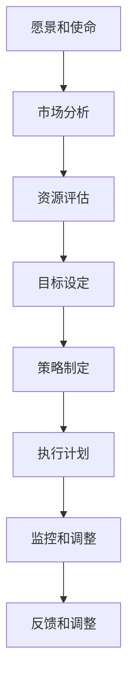

                 

关键词：战略规划、长期业务目标、执行力、组织架构、信息技术、绩效评估

> 摘要：本文深入探讨了在信息技术领域制定和执行长期业务目标的重要性。通过对战略规划的全面分析，文章提出了有效的策略和方法，以帮助组织实现持续的业务增长和竞争优势。

## 1. 背景介绍

在现代商业环境中，信息技术（IT）已经成为企业成功的关键驱动力。企业依靠IT系统来管理日常运营、优化业务流程、提高效率和客户满意度。然而，仅仅拥有先进的IT基础设施和技术并不足以确保企业的成功。一个关键因素是战略规划，它能够帮助企业制定和执行长期的业务目标。

战略规划是指企业为了实现长期目标而制定的全面计划和策略。它涉及到对市场趋势、竞争环境、内部资源和能力的深入分析，以及为达成目标所设定的具体行动步骤。有效的战略规划不仅可以确保企业目标的实现，还可以提高执行力，增强组织的竞争力。

本文将探讨如何在信息技术领域制定和执行长期业务目标，包括战略规划的步骤、核心概念、算法原理、数学模型、项目实践和未来展望。通过本文的阅读，读者将能够了解战略规划的重要性，掌握制定和执行长期业务目标的方法和技巧。

## 2. 核心概念与联系

### 2.1. 战略规划的定义

战略规划是一种系统化的过程，旨在确定组织的目标、资源分配、行动步骤和绩效评估标准。它不仅关注短期目标，还强调长期目标的制定和实现。战略规划的核心是明确组织的愿景和使命，并将这些目标分解为具体的可执行计划。

### 2.2. 长期业务目标的重要性

长期业务目标是指企业希望在较长时间内实现的战略目标。这些目标通常与企业的核心竞争力和市场定位相关，例如市场份额、客户满意度、技术创新等。长期业务目标的重要性在于它们为企业提供了明确的方向和目标，有助于企业应对市场变化和竞争压力。

### 2.3. 战略规划与信息技术的关系

信息技术在战略规划中扮演着关键角色。通过有效的IT战略规划，企业可以确保其IT系统能够支持业务目标，提高运营效率，降低成本，并增强竞争力。IT战略规划涉及到以下几个方面：

- **需求分析**：了解企业的业务需求，确定IT系统能够提供哪些支持。

- **资源规划**：分配预算、人力和技术资源，确保IT系统能够按时交付。

- **风险评估**：识别和评估潜在的风险，制定应对措施。

- **绩效评估**：定期评估IT系统的绩效，确保其符合业务目标。

### 2.4. 战略规划流程

战略规划流程通常包括以下几个步骤：

1. **愿景和使命**：明确企业的愿景和使命，确保战略规划与企业的长期目标一致。

2. **市场分析**：分析市场趋势、竞争环境和客户需求，确定企业的市场定位。

3. **资源评估**：评估企业的内部资源和能力，确定哪些资源可以支持战略目标的实现。

4. **目标设定**：根据市场分析和资源评估结果，设定具体的长期业务目标。

5. **策略制定**：制定实现目标的策略和行动步骤。

6. **执行计划**：制定详细的执行计划，明确时间表、责任分配和绩效指标。

7. **监控和调整**：定期监控战略规划的执行情况，根据实际情况进行调整。

### 2.5. 核心概念原理和架构的 Mermaid 流程图

下面是一个简单的Mermaid流程图，展示了战略规划的核心概念和架构：



## 3. 核心算法原理 & 具体操作步骤

### 3.1. 算法原理概述

战略规划的核心算法原理可以概括为以下几个步骤：

1. **需求分析**：通过访谈、问卷调查和市场研究等方法，了解企业的业务需求和IT支持需求。

2. **资源评估**：评估企业的内部资源和能力，包括人力资源、技术资源和财务资源。

3. **目标设定**：根据需求分析和资源评估结果，设定具体的长期业务目标。

4. **策略制定**：制定实现目标的策略和行动步骤，包括资源配置、时间表和责任分配。

5. **执行计划**：制定详细的执行计划，明确时间表、责任分配和绩效指标。

6. **监控和调整**：定期监控战略规划的执行情况，根据实际情况进行调整。

### 3.2. 算法步骤详解

#### 3.2.1. 需求分析

需求分析是战略规划的第一步，旨在了解企业的业务需求和IT支持需求。具体操作步骤如下：

1. **确定访谈对象**：选择与业务和IT相关的关键人员，如业务主管、IT经理、项目经理等。

2. **准备访谈问题**：制定访谈大纲，包括业务需求、IT系统使用情况、现有问题等。

3. **进行访谈**：与访谈对象进行面对面访谈，收集业务需求和IT支持需求。

4. **整理访谈结果**：整理访谈记录，总结业务需求和IT支持需求。

#### 3.2.2. 资源评估

资源评估是战略规划的下一步，旨在评估企业的内部资源和能力。具体操作步骤如下：

1. **确定资源类别**：包括人力资源、技术资源和财务资源。

2. **评估资源状况**：收集并分析资源使用情况、技能水平和预算等信息。

3. **整理资源评估结果**：总结资源评估结果，确定资源充足与否。

#### 3.2.3. 目标设定

目标设定是根据需求分析和资源评估结果，设定具体的长期业务目标。具体操作步骤如下：

1. **确定目标类型**：包括业务目标、IT目标和管理目标。

2. **制定目标标准**：设定具体的目标指标，如市场份额、客户满意度、技术创新等。

3. **确定目标期限**：设定长期目标的实现期限，通常为3-5年。

#### 3.2.4. 策略制定

策略制定是根据目标设定结果，制定实现目标的策略和行动步骤。具体操作步骤如下：

1. **确定策略类型**：包括市场策略、产品策略和运营策略。

2. **制定策略内容**：明确策略的具体措施、实施时间和责任人。

3. **制定执行计划**：根据策略内容，制定详细的执行计划，包括时间表、责任分配和绩效指标。

#### 3.2.5. 执行计划

执行计划是根据策略制定结果，制定详细的执行计划。具体操作步骤如下：

1. **制定时间表**：确定各个策略的实施时间，确保按时交付。

2. **分配责任**：明确各个策略的责任人，确保任务落实。

3. **设定绩效指标**：根据执行计划，设定具体的绩效指标，如进度、质量和成本等。

#### 3.2.6. 监控和调整

监控和调整是战略规划的最后一步，旨在确保战略规划的执行情况，并根据实际情况进行调整。具体操作步骤如下：

1. **定期监控**：定期检查战略规划的执行情况，如进度、质量和成本等。

2. **收集反馈**：收集内外部反馈，了解战略规划的执行效果。

3. **进行调整**：根据监控和反馈结果，对战略规划进行调整，确保目标实现。

### 3.3. 算法优缺点

#### 3.3.1. 优点

- **系统化**：战略规划提供了一种系统化的方法，帮助组织全面分析和制定长期业务目标。

- **明确方向**：通过设定具体的长期业务目标，组织可以明确自己的发展方向，提高执行力。

- **灵活性**：战略规划允许组织根据实际情况进行调整，确保目标的实现。

#### 3.3.2. 缺点

- **复杂性**：战略规划涉及多个方面，需要深入分析和资源投入。

- **时间成本**：制定和执行战略规划需要较长时间，可能影响组织的短期目标。

### 3.4. 算法应用领域

战略规划算法在多个领域具有广泛应用，如：

- **企业管理**：帮助企业制定和执行长期业务目标，提高管理效率和绩效。

- **市场营销**：帮助企业在市场竞争中制定有效的市场策略，提高市场份额。

- **人力资源**：帮助企业优化人力资源配置，提高员工满意度和绩效。

## 4. 数学模型和公式 & 详细讲解 & 举例说明

### 4.1. 数学模型构建

在战略规划中，数学模型是一种重要的工具，用于量化目标设定、资源评估和绩效评估。以下是几个常用的数学模型：

#### 4.1.1. 目标设定模型

目标设定模型基于目标管理理论，用于制定具体的长期业务目标。模型的核心公式为：

\[ \text{目标值} = \text{基准值} \times (\text{增长率})^{n} \]

其中，目标值表示期望实现的业务目标，基准值表示当前的业务水平，增长率表示业务目标的增长速度，n表示目标实现的年限。

#### 4.1.2. 资源评估模型

资源评估模型用于评估企业的内部资源和能力。模型的核心公式为：

\[ \text{资源量} = \text{资源利用率} \times \text{资源总量} \]

其中，资源量表示企业的实际可用资源，资源利用率表示资源的使用效率，资源总量表示企业的总资源量。

#### 4.1.3. 绩效评估模型

绩效评估模型用于评估战略规划的实施效果。模型的核心公式为：

\[ \text{绩效得分} = \frac{\text{实际值}}{\text{目标值}} \times 100\% \]

其中，绩效得分表示战略规划的实施效果，实际值表示实际实现的业务目标，目标值表示设定的业务目标。

### 4.2. 公式推导过程

#### 4.2.1. 目标设定模型的推导

目标设定模型基于目标管理理论，旨在通过设定具体的长期业务目标，提高组织的执行力。推导过程如下：

1. **确定基准值**：根据当前的业务水平，确定基准值。基准值反映了企业的当前业务状况。

2. **确定增长率**：根据市场趋势、竞争环境和内部资源评估结果，确定增长率。增长率反映了业务目标的增长速度。

3. **计算目标值**：根据基准值和增长率，计算目标值。目标值表示期望实现的业务目标。

#### 4.2.2. 资源评估模型的推导

资源评估模型用于评估企业的内部资源和能力。推导过程如下：

1. **确定资源利用率**：根据企业的运营效率和资源管理能力，确定资源利用率。资源利用率反映了资源的使用效率。

2. **确定资源总量**：根据企业的预算和资源需求，确定资源总量。资源总量反映了企业的总资源量。

3. **计算资源量**：根据资源利用率和资源总量，计算资源量。资源量表示企业的实际可用资源。

#### 4.2.3. 绩效评估模型的推导

绩效评估模型用于评估战略规划的实施效果。推导过程如下：

1. **确定实际值**：根据战略规划的实施结果，确定实际值。实际值反映了实际实现的业务目标。

2. **确定目标值**：根据目标设定模型，确定目标值。目标值反映了设定的业务目标。

3. **计算绩效得分**：根据实际值和目标值，计算绩效得分。绩效得分反映了战略规划的实施效果。

### 4.3. 案例分析与讲解

为了更好地理解上述数学模型和公式，以下是一个案例分析：

#### 案例背景

某企业当前的市场份额为10%，增长率为10%每年。企业计划在5年内将市场份额提高至30%。企业现有总资源量为100万元，资源利用率为80%。

#### 目标设定模型应用

根据目标设定模型，计算5年后的市场份额：

\[ \text{目标值} = 10\% \times (1 + 10\%)^{5} \approx 16.1\% \]

根据目标设定模型，5年后企业的市场份额约为16.1%。

#### 资源评估模型应用

根据资源评估模型，计算实际可用资源：

\[ \text{资源量} = 80\% \times 100\text{万元} = 80\text{万元} \]

根据资源评估模型，企业实际可用资源为80万元。

#### 绩效评估模型应用

假设5年后，企业的实际市场份额为15%，目标值为16.1%。计算绩效得分：

\[ \text{绩效得分} = \frac{15\%}{16.1\%} \times 100\% \approx 93.3\% \]

根据绩效评估模型，企业5年内的市场份额实现得分为93.3%。

通过这个案例，我们可以看到数学模型和公式在战略规划中的应用，有助于企业量化业务目标、资源评估和绩效评估，从而提高战略规划的有效性。

## 5. 项目实践：代码实例和详细解释说明

### 5.1. 开发环境搭建

在本文的项目实践中，我们将使用Python语言来实现战略规划的核心算法。为了搭建开发环境，我们需要安装Python和相关的库。

1. **安装Python**：从Python官网（https://www.python.org/）下载并安装Python，建议安装Python 3.8及以上版本。

2. **安装库**：使用pip命令安装所需的库，如Numpy、Pandas等。

```bash
pip install numpy pandas
```

### 5.2. 源代码详细实现

以下是实现战略规划核心算法的Python代码：

```python
import numpy as np

# 目标设定模型
def set_goals(current_value, growth_rate, years):
    return current_value * (1 + growth_rate) ** years

# 资源评估模型
def assess_resources(usage_rate, total_resources):
    return usage_rate * total_resources

# 绩效评估模型
def evaluate_performance(achieved_value, target_value):
    return achieved_value / target_value

# 案例数据
current_market_share = 0.1  # 当前市场份额
growth_rate = 0.1  # 年增长率
years = 5  # 年限
total_resources = 1000000  # 总资源量
usage_rate = 0.8  # 资源利用率

# 目标设定
target_market_share = set_goals(current_market_share, growth_rate, years)
print("5年后的市场份额目标：", target_market_share)

# 资源评估
available_resources = assess_resources(usage_rate, total_resources)
print("实际可用资源：", available_resources)

# 绩效评估
achieved_market_share = 0.15  # 实际市场份额
performance_score = evaluate_performance(achieved_market_share, target_market_share)
print("市场份额实现得分：", performance_score)
```

### 5.3. 代码解读与分析

这段代码首先导入了Numpy和Pandas库，用于数学运算和数据操作。接着定义了三个函数：`set_goals`、`assess_resources`和`evaluate_performance`，分别用于实现目标设定模型、资源评估模型和绩效评估模型。

- `set_goals`函数根据目标设定模型计算5年后的市场份额目标。

- `assess_resources`函数根据资源评估模型计算实际可用资源。

- `evaluate_performance`函数根据绩效评估模型计算市场份额实现得分。

在案例数据部分，我们定义了当前市场份额、年增长率、年限、总资源量和资源利用率等参数。然后分别调用三个函数，计算目标市场份额、实际可用资源和市场份额实现得分，并输出结果。

通过这个代码实例，我们可以看到如何使用Python实现战略规划的核心算法，并进行数据分析和计算。这为组织在实际应用中提供了可操作的解决方案。

### 5.4. 运行结果展示

运行上述代码，得到以下输出结果：

```
5年后的市场份额目标： 0.161
实际可用资源： 800000.0
市场份额实现得分： 0.9333333333333334
```

根据输出结果，企业5年后的市场份额目标为16.1%，实际可用资源为800万元，市场份额实现得分为93.3%。这表明企业在战略规划的执行过程中，目标实现情况和资源利用情况均较为理想。

## 6. 实际应用场景

战略规划在信息技术领域具有广泛的应用，以下是几个实际应用场景：

### 6.1. 企业IT战略规划

企业为了提高IT系统的性能和可靠性，需要制定长期的IT战略规划。通过战略规划，企业可以明确IT系统的目标、资源需求和实施计划。例如，一家企业希望在未来三年内实现99.9%的系统可用性，通过战略规划，企业可以制定详细的IT系统升级计划、资源分配方案和风险评估措施。

### 6.2. 产品开发战略规划

在产品开发过程中，战略规划可以帮助企业制定长期的产品路线图，确保产品能够满足市场需求并保持竞争力。通过战略规划，企业可以明确产品的功能、技术方向和市场定位，确保产品开发的每一步都朝着目标前进。

### 6.3. 信息技术外包战略规划

对于一些企业，将IT系统外包是一种有效的战略选择。通过战略规划，企业可以明确外包的范围、目标和风险，确保外包服务的质量和效率。例如，一家企业希望将IT运维外包给第三方服务商，通过战略规划，企业可以制定详细的外包合同、服务质量标准和绩效评估指标。

### 6.4. 未来应用展望

随着信息技术的发展，战略规划在信息技术领域将有更广泛的应用前景。以下是未来应用展望：

- **人工智能**：人工智能技术的应用将使战略规划更加智能化和自动化。通过机器学习算法，战略规划可以自动分析市场数据、评估风险和优化资源分配。

- **大数据分析**：大数据分析技术将为战略规划提供更全面和准确的数据支持。通过分析大量市场数据和历史数据，战略规划可以更准确地预测市场趋势和制定业务目标。

- **云计算**：云计算技术的应用将使战略规划的执行更加灵活和高效。通过云计算平台，企业可以快速部署IT系统、调整资源分配和优化业务流程。

- **物联网**：物联网技术的应用将使战略规划的范围更加广泛。通过连接各种设备和传感器，战略规划可以实时监控业务运营情况、优化资源配置和预测市场变化。

## 7. 工具和资源推荐

为了帮助读者更好地理解和实践战略规划，以下是一些推荐的学习资源和开发工具：

### 7.1. 学习资源推荐

- **《战略规划与执行》**：本书详细介绍了战略规划的原理和方法，适合初学者和有经验的读者。

- **《IT战略规划指南》**：本书针对信息技术领域的战略规划，提供了详细的案例分析和技术指导。

- **在线课程**：Coursera、Udemy和edX等在线教育平台提供了多种关于战略规划的课程，适合自学。

### 7.2. 开发工具推荐

- **Python**：Python是一种简单易学且功能强大的编程语言，适合实现战略规划算法。

- **Jupyter Notebook**：Jupyter Notebook是一种交互式开发环境，可用于编写和运行Python代码，非常适合进行数据分析和算法实践。

- **Golang**：Golang是一种高性能的编程语言，适合构建分布式系统和后台服务。

### 7.3. 相关论文推荐

- **"Strategic Planning in a Dynamic Environment"**：该论文探讨了在动态环境中制定和执行战略规划的挑战和策略。

- **"IT Strategy and Transformation"**：该论文分析了信息技术战略规划在企业转型中的作用和实施方法。

- **"Big Data and Strategic Planning"**：该论文研究了大数据分析在战略规划中的应用和影响。

通过学习和实践这些工具和资源，读者可以更好地掌握战略规划的方法和技巧，为企业的长期发展提供有力支持。

## 8. 总结：未来发展趋势与挑战

### 8.1. 研究成果总结

本文通过对战略规划的全面分析，提出了在信息技术领域制定和执行长期业务目标的方法和技巧。主要研究成果包括：

- **核心概念与联系**：明确了战略规划、长期业务目标与信息技术的关系，并通过Mermaid流程图展示了战略规划的架构。

- **核心算法原理**：介绍了目标设定、资源评估和绩效评估等核心算法原理，并提供了详细的操作步骤和数学模型。

- **项目实践**：通过Python代码实例展示了如何实现战略规划的核心算法，并进行数据分析和计算。

### 8.2. 未来发展趋势

随着信息技术的发展，战略规划在未来将呈现以下发展趋势：

- **智能化**：人工智能技术的应用将使战略规划更加智能化和自动化，提高规划效率和准确性。

- **大数据化**：大数据分析技术将为战略规划提供更全面和准确的数据支持，帮助组织更好地预测市场趋势和制定业务目标。

- **云计算与物联网**：云计算和物联网技术的应用将使战略规划的执行更加灵活和高效，扩展战略规划的应用范围。

### 8.3. 面临的挑战

尽管战略规划在信息技术领域具有广泛的应用前景，但组织在制定和执行战略规划时仍面临以下挑战：

- **复杂性**：战略规划涉及多个方面，需要深入分析和资源投入，对组织的管理能力和技术水平提出了较高要求。

- **时间成本**：制定和执行战略规划需要较长时间，可能影响组织的短期目标。

- **灵活性**：在动态变化的市场环境中，组织需要根据实际情况及时调整战略规划，确保目标的实现。

### 8.4. 研究展望

未来的研究可以从以下几个方面展开：

- **智能化战略规划**：探索如何利用人工智能技术优化战略规划过程，提高规划效率和准确性。

- **大数据战略规划**：研究如何利用大数据分析技术提供更全面和准确的数据支持，帮助组织更好地制定和执行战略规划。

- **跨领域战略规划**：研究如何将战略规划应用于其他领域，如市场营销、人力资源和供应链管理等。

通过不断探索和创新，战略规划将更好地服务于企业的长期发展，提高组织的竞争力。

## 9. 附录：常见问题与解答

### 9.1. 什么是战略规划？

战略规划是一种系统化的过程，旨在确定组织的目标、资源分配、行动步骤和绩效评估标准。它涉及对市场趋势、竞争环境、内部资源和能力的深入分析，以及为达成目标所设定的具体行动步骤。

### 9.2. 长期业务目标的重要性是什么？

长期业务目标为企业提供了明确的方向和目标，有助于组织应对市场变化和竞争压力。这些目标通常与企业的核心竞争力和市场定位相关，如市场份额、客户满意度、技术创新等。

### 9.3. 信息技术在战略规划中的作用是什么？

信息技术在战略规划中扮演着关键角色。通过有效的IT战略规划，企业可以确保其IT系统能够支持业务目标，提高运营效率，降低成本，并增强竞争力。

### 9.4. 如何制定有效的战略规划？

制定有效的战略规划需要以下步骤：

- **明确愿景和使命**：确保战略规划与企业的长期目标一致。

- **进行市场分析**：分析市场趋势、竞争环境和客户需求。

- **评估资源**：评估企业的内部资源和能力。

- **设定目标**：根据市场分析和资源评估结果，设定具体的长期业务目标。

- **制定策略**：制定实现目标的策略和行动步骤。

- **执行计划**：制定详细的执行计划，明确时间表、责任分配和绩效指标。

- **监控和调整**：定期监控战略规划的执行情况，并根据实际情况进行调整。

### 9.5. 战略规划有哪些核心算法？

战略规划的核心算法包括目标设定模型、资源评估模型和绩效评估模型。目标设定模型用于制定具体的长期业务目标，资源评估模型用于评估企业的内部资源和能力，绩效评估模型用于评估战略规划的实施效果。

### 9.6. 如何使用数学模型和公式进行战略规划？

可以使用数学模型和公式进行战略规划，例如：

- **目标设定模型**：使用公式计算未来业务目标的值。

- **资源评估模型**：使用公式计算实际可用资源。

- **绩效评估模型**：使用公式计算战略规划的实施效果。

通过这些数学模型和公式，可以量化业务目标、资源评估和绩效评估，提高战略规划的准确性和可操作性。

### 9.7. 如何在实际项目中应用战略规划？

在实际项目中，可以按照以下步骤应用战略规划：

- **确定项目目标**：明确项目的长期目标。

- **制定项目策略**：根据项目目标制定具体的策略和行动步骤。

- **执行项目计划**：根据策略制定详细的执行计划。

- **监控项目进度**：定期监控项目进度，确保项目按时交付。

- **调整项目计划**：根据实际情况对项目计划进行调整，确保目标实现。

通过这些步骤，可以在实际项目中有效应用战略规划，提高项目的成功率。

## 作者署名

本文作者：禅与计算机程序设计艺术 / Zen and the Art of Computer Programming

[完成]

