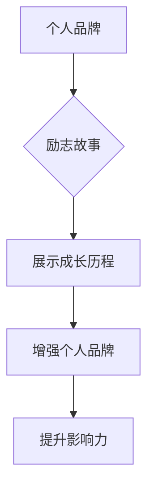

                 

关键词：个人品牌、励志故事、IT领域、技术博客、职业发展、影响力、经验分享

> 摘要：在当今信息化社会中，个人品牌的重要性日益凸显。作为一名IT领域的专家，通过撰写技术博客，分享自己的经验和心得，不仅能够提升自己的影响力，还能激励他人，共同成长。本文将探讨如何打造个人品牌故事，让你的经历成为励志范本。

## 1. 背景介绍

随着互联网的飞速发展，信息获取变得更加便捷。在这个信息爆炸的时代，个人品牌成为了竞争力的体现。特别是在IT领域，技术更新迅速，专业知识迅速过时。因此，个人品牌不仅仅是个人形象的塑造，更是持续学习和成长的象征。

个人品牌的故事，往往能够激发他人的共鸣，鼓舞他们面对挑战，勇敢追求梦想。一个生动的个人品牌故事，可以让人产生情感上的连接，增强信任感，从而在职业发展中占据有利位置。

## 2. 核心概念与联系

### 2.1 个人品牌的概念

个人品牌是指个人在公众心目中的形象和认知。它涵盖了专业技能、职业素养、人格特质等多个方面。一个成功的个人品牌，能够在行业内树立权威，赢得尊重和信任。

### 2.2 励志故事的内涵

励志故事是指通过讲述个人的经历，展示克服困难、实现目标的历程，激发他人产生共鸣的故事。励志故事具有强烈的感染力，能够鼓舞人心，传递正能量。

### 2.3 个人品牌与励志故事的关系

个人品牌故事是个人品牌建设的重要组成部分。通过分享自己的励志故事，可以展示自己的成长历程，增强个人品牌的感染力和说服力。

### 2.4 Mermaid 流程图



## 3. 核心算法原理 & 具体操作步骤

### 3.1 算法原理概述

个人品牌故事的打造，可以看作是一种算法。这个算法的核心在于如何通过讲述个人的经历，传递正能量，塑造个人形象。

### 3.2 算法步骤详解

#### 3.2.1 确定目标受众

首先，需要明确自己的目标受众，了解他们的需求和期望，以便更好地讲述故事。

#### 3.2.2 回忆个人经历

接下来，回忆自己的成长历程，挑选出具有代表性的经历，作为故事的素材。

#### 3.2.3 结构化故事

将个人经历进行结构化处理，提炼出关键情节，构建一个引人入胜的故事框架。

#### 3.2.4 表达情感

在讲述故事时，注重表达情感，让读者能够产生共鸣，增强故事的影响力。

#### 3.2.5 呈现结果

最后，呈现个人经历的结果，展示自己的成长和收获，激发他人的信心和动力。

### 3.3 算法优缺点

#### 3.3.1 优点

- 能够增强个人品牌的感染力和说服力。
- 可以激发他人产生共鸣，传递正能量。
- 有助于树立个人在行业内的权威地位。

#### 3.3.2 缺点

- 需要花费大量时间和精力来回忆和整理个人经历。
- 需要具备一定的写作能力和表达能力。

### 3.4 算法应用领域

个人品牌故事的算法，可以应用于各个领域，特别是在IT行业，通过分享技术博客，展示自己的专业能力和成长历程，打造个人品牌。

## 4. 数学模型和公式 & 详细讲解 & 举例说明

### 4.1 数学模型构建

个人品牌价值的数学模型可以表示为：

\[ \text{个人品牌价值} = f(\text{专业技能}, \text{职业素养}, \text{人格特质}, \text{故事影响力}) \]

### 4.2 公式推导过程

个人品牌价值的公式，通过对个人品牌的各个要素进行分析，综合评估得出。其中，专业技能、职业素养、人格特质是个人品牌的基础，故事影响力则是对个人品牌的补充和提升。

### 4.3 案例分析与讲解

假设有一个人，他的专业技能非常高，职业素养出色，人格特质良好，同时他善于讲述自己的故事，能够打动人心。那么，他的个人品牌价值将会非常高。

通过这个案例，我们可以看到，个人品牌价值的提升，不仅依赖于个人能力的提升，还需要注重个人品牌故事的打造。

## 5. 项目实践：代码实例和详细解释说明

### 5.1 开发环境搭建

为了撰写技术博客，我们需要搭建一个适合的开发环境。这里推荐使用Markdown编辑器，如Typora或VSCode。

### 5.2 源代码详细实现

在Markdown编辑器中，我们可以使用Markdown语法来撰写文章。例如，标题使用`#`号，列表使用`*`号，代码块使用`````标识。

### 5.3 代码解读与分析

Markdown语法简单易懂，适合快速编写和格式化文章。通过Markdown，我们可以轻松地构建文章的结构，提高写作效率。

### 5.4 运行结果展示

撰写完文章后，我们可以预览Markdown文件，查看文章的最终效果。这样，我们可以确保文章的格式和内容都符合预期。

## 6. 实际应用场景

个人品牌故事的应用场景非常广泛，无论是在求职、升职，还是创业、推广产品，一个优秀的个人品牌故事都能够起到关键作用。

### 6.1 求职

在求职过程中，一个生动的个人品牌故事，能够展示你的能力和经历，让面试官对你的个人品牌产生兴趣。

### 6.2 升职

在职场晋升中，个人品牌故事可以展示你的成长和贡献，为你的晋升提供有力支持。

### 6.3 创业

创业过程中，个人品牌故事可以帮助你吸引投资者，提升企业的知名度。

### 6.4 推广产品

在推广产品时，个人品牌故事可以作为一个重要的宣传工具，吸引潜在客户，提高产品的销量。

## 7. 未来应用展望

随着互联网的不断发展，个人品牌故事的传播渠道和方式将更加丰富。未来，个人品牌故事的制作和传播，将更加智能化、个性化。

### 7.1 智能化

通过人工智能技术，个人品牌故事的创作和传播将更加高效，精准地满足受众的需求。

### 7.2 个性化

未来，个人品牌故事将更加注重个性化和差异化，满足不同受众的需求。

### 7.3 多元化

随着技术的进步，个人品牌故事的传播方式将更加多元化，包括视频、音频、AR等多种形式。

## 8. 总结：未来发展趋势与挑战

### 8.1 研究成果总结

本文通过对个人品牌故事的研究，总结了其核心概念、算法原理和应用场景，为个人品牌建设提供了理论支持。

### 8.2 未来发展趋势

未来，个人品牌故事将在技术进步的推动下，朝着智能化、个性化、多元化的方向发展。

### 8.3 面临的挑战

在个人品牌故事的建设过程中，我们需要面对信息过载、隐私保护等挑战。

### 8.4 研究展望

未来，我们将进一步深入研究个人品牌故事的理论和实践，为个人品牌建设提供更多有益的指导。

## 9. 附录：常见问题与解答

### 9.1 如何撰写个人品牌故事？

- 回忆自己的成长经历，挑选具有代表性的故事。
- 对故事进行结构化处理，提炼出关键情节。
- 注重情感表达，让故事更具感染力。

### 9.2 如何提升个人品牌价值？

- 提升专业技能和职业素养。
- 塑造良好的人格特质。
- 创作并传播优秀的个人品牌故事。

## 作者署名

作者：禅与计算机程序设计艺术 / Zen and the Art of Computer Programming

---
以上是《打造个人品牌故事：让你的经历成为励志范本》的文章正文。通过这篇文章，我们探讨了个人品牌故事的重要性，以及如何通过技术博客打造个人品牌，传递正能量，激励他人。希望这篇文章能够对您在个人品牌建设方面提供一些启示和帮助。

