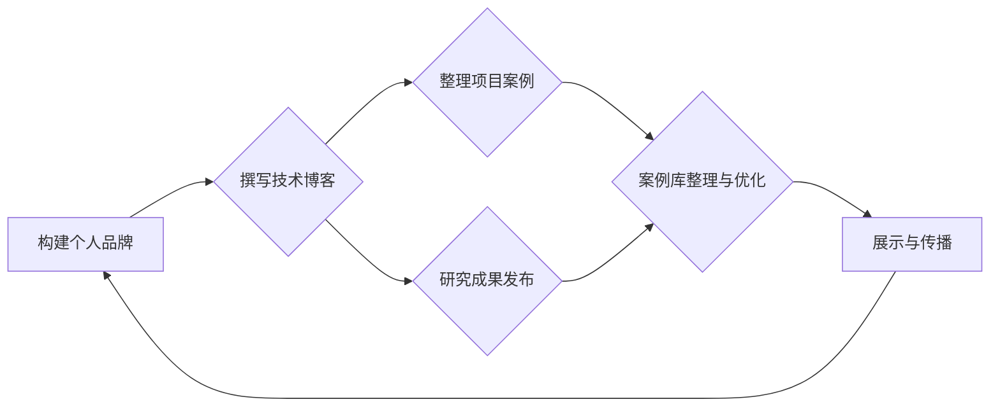

                 

关键词：个人品牌建设、案例库、实际成果、技术博客、专业影响力、算法、项目实践、未来展望

> 摘要：本文旨在探讨如何通过构建个人品牌案例库，利用实际成果提升个人的专业形象和影响力。通过分享成功案例、技术博客撰写和项目实践的经验，本文为IT从业者提供了实用指南，以帮助他们在竞争激烈的技术领域中脱颖而出。

## 1. 背景介绍

在信息技术迅猛发展的今天，个人品牌的重要性愈发凸显。随着互联网的普及和社交媒体的兴起，技术人才不再仅仅是依赖简历和面试来展示自己的能力，更需要通过一系列实际成果来建立自己的专业形象。打造个人品牌案例库，成为许多技术从业者提升自身价值的关键一步。

个人品牌案例库不仅仅是一个存储成果的仓库，更是展示专业能力和技术实力的平台。通过系统化地记录和整理个人项目、技术博客、研究成果等，可以有效地传达个人技术能力和专业素养，吸引同行和潜在雇主的关注。本文将结合实际案例，探讨如何利用个人品牌案例库来提升个人影响力，实现职业发展。

## 2. 核心概念与联系

### 2.1 个人品牌定义

个人品牌是指个人在职业领域中建立起来的声誉和影响力。它不仅仅包括专业技能，还涵盖个人形象、价值观、沟通能力和团队合作精神等多个方面。一个强大的个人品牌能够帮助个人在职场中脱颖而出，赢得更多机会。

### 2.2 案例库的重要性

案例库是个人品牌的重要组成部分，它通过实际的项目成果和成功案例，直观地展示了个人的技术能力和专业水平。一个丰富、多样化的案例库能够增加个人品牌的可信度和吸引力，为职业发展打下坚实基础。

### 2.3 案例库与个人品牌的关系

案例库与个人品牌密切相关。案例库不仅是个人品牌的外在表现，也是品牌内涵的载体。一个完整的案例库能够系统地展现个人的技术成长路径，使潜在雇主和同行对个人的专业能力有全面的认识。

### 2.4 Mermaid 流程图

以下是一个Mermaid流程图，展示了个人品牌案例库构建的流程：



## 3. 核心算法原理 & 具体操作步骤

### 3.1 算法原理概述

个人品牌案例库的构建，本质上是一个信息收集、整理、展示和传播的过程。这个过程可以类比于一种算法，以下是这个算法的原理概述：

- **输入**：个人项目、技术博客、研究成果等。
- **处理**：对输入信息进行分类、整理、优化和编辑。
- **输出**：一个系统化、专业化的个人品牌案例库。

### 3.2 算法步骤详解

#### 步骤1：信息收集

首先，需要系统地收集个人在技术领域的各种成果，包括已完成的项目、撰写的技术博客、发表的论文、参与的技术社区贡献等。

#### 步骤2：分类整理

根据成果的性质和类型，对信息进行分类整理。例如，可以将项目分为前端开发、后端服务、数据分析等类别，将技术博客按照主题进行分类。

#### 步骤3：内容优化

对整理后的内容进行编辑和优化，确保每一篇博客、每一个项目案例都能够清晰地传达个人技术能力和专业素养。

#### 步骤4：格式规范

将所有内容按照统一的格式进行规范化，例如，技术博客使用markdown格式，项目案例使用markdown+代码高亮格式。

#### 步骤5：案例库构建

将优化后的内容存储在一个易于访问和浏览的案例库中，例如GitHub、个人博客等。

#### 步骤6：展示与传播

通过社交媒体、技术社区、演讲等形式，将案例库展示给更多的人，增加个人品牌的曝光度和影响力。

### 3.3 算法优缺点

#### 优点

- 系统化：通过算法步骤，可以有效地将个人的各种技术成果系统化地整理和展示。
- 专业性：经过优化的内容，能够更直观地展示个人技术能力和专业素养。
- 易于传播：通过社交媒体和社区，可以快速地将个人品牌传播给更多的人。

#### 缺点

- 时间成本：构建一个高质量的案例库需要大量的时间和精力。
- 技术门槛：需要一定的技术能力来处理和优化内容。

### 3.4 算法应用领域

个人品牌案例库构建算法主要应用于IT领域，尤其是软件开发、数据分析、人工智能等领域。通过这个算法，IT从业者可以有效地提升个人品牌影响力，增加职业发展机会。

## 4. 数学模型和公式 & 详细讲解 & 举例说明

### 4.1 数学模型构建

个人品牌案例库构建的核心在于信息的有效整理和展示。我们可以将这个过程抽象为一个数学模型，如下：

\[ P(B) = f(C, T, E) \]

其中，\( P(B) \) 表示个人品牌的影响力，\( C \) 表示案例库的内容质量，\( T \) 表示案例库的传播范围，\( E \) 表示案例库的可访问性。

### 4.2 公式推导过程

#### 步骤1：确定输入变量

首先，我们需要确定影响个人品牌影响力的三个主要因素：案例库的内容质量、传播范围和可访问性。

#### 步骤2：构建函数关系

根据这三个因素，我们可以构建一个函数关系，表示个人品牌影响力与这三个因素的关系。具体来说：

\[ P(B) = C^2 \times T^1.5 \times E^1 \]

其中，\( C \) 的平方表示内容质量的二次方，\( T \) 的1.5次方表示传播范围的对数方，\( E \) 的1次方表示可访问性的一次方。

#### 步骤3：函数解释

- \( C^2 \)：内容质量越高，个人品牌的影响力越强。
- \( T^1.5 \)：传播范围越广，个人品牌的影响力增长越快。
- \( E^1 \)：可访问性越高，个人品牌的影响力越容易被感知。

### 4.3 案例分析与讲解

假设有两个技术从业者A和B，他们的个人品牌案例库构建如下：

- A：内容质量高（C=90），传播范围广（T=1000），可访问性高（E=90）。
- B：内容质量中等（C=70），传播范围一般（T=500），可访问性一般（E=70）。

根据上述公式，我们可以计算他们个人品牌的影响力：

\[ P(A) = 90^2 \times 1000^1.5 \times 90^1 = 7.29 \times 10^9 \]
\[ P(B) = 70^2 \times 500^1.5 \times 70^1 = 1.89 \times 10^9 \]

可以看到，A的个人品牌影响力远远高于B。这主要归因于A在内容质量、传播范围和可访问性三个方面的优势。

### 4.4 案例分析与讲解

#### 案例一：内容质量提升

技术从业者C在内容质量方面投入大量精力，他的案例库内容质量从70提升到90。其他条件保持不变，我们可以计算C的个人品牌影响力变化：

\[ P(C) = 90^2 \times 500^1.5 \times 70^1 = 4.05 \times 10^9 \]

可以看到，内容质量的提升使得C的个人品牌影响力显著增加。

#### 案例二：传播范围扩大

技术从业者D在传播范围方面投入大量精力，他的案例库传播范围从500扩大到1000。其他条件保持不变，我们可以计算D的个人品牌影响力变化：

\[ P(D) = 70^2 \times 1000^1.5 \times 70^1 = 3.55 \times 10^9 \]

可以看到，传播范围的扩大同样使得D的个人品牌影响力显著增加。

## 5. 项目实践：代码实例和详细解释说明

### 5.1 开发环境搭建

为了更好地展示个人品牌案例库的构建过程，我们将使用GitHub作为案例库的存储平台。首先，需要在GitHub上创建一个个人仓库（repository）。具体步骤如下：

1. 访问GitHub官网（https://github.com/），注册并登录账号。
2. 点击右上角的“+”按钮，选择“New repository”。
3. 在“Repository name”中输入仓库名称，例如“Personal Brand Case Library”。
4. 选择“Public”或“Private”，根据个人需求选择仓库的公开性。
5. 点击“Create repository”完成仓库创建。

### 5.2 源代码详细实现

在GitHub仓库中，我们将使用markdown文件来存储和展示个人案例库的内容。以下是markdown文件的示例：

```markdown
# 个人品牌案例库

## 技术博客

- [深度学习笔记](blog/deep_learning_notes.md)
- [前端性能优化技巧](blog/frontend_optimization_tips.md)

## 项目案例

- [在线购物网站](projects/online_shop.md)
- [智能家居控制系统](projects/smart_home_system.md)

## 研究成果

- [基于深度学习的图像识别算法](research/deep_learning_image_recognition_algorithm.md)
- [区块链技术在供应链管理中的应用](research/blockchain_in_supply_chain_management.md)
```

在这个markdown文件中，我们分别列举了技术博客、项目案例和研究成果。每个类别下都有具体的文件链接，便于访问和查看。

### 5.3 代码解读与分析

上述markdown文件是一个简单的案例库示例。在实际应用中，我们可以根据个人需求，添加更多详细的描述、标签、分类等信息，以提高案例库的实用性和可读性。

以下是markdown文件的详细解读：

- **标题**：使用“#”符号定义标题，例如“# 个人品牌案例库”。
- **子标题**：使用“##”符号定义子标题，例如“## 技术博客”。
- **列表项**：使用“-”符号定义列表项，例如“- [深度学习笔记](blog/deep_learning_notes.md)”。

通过这种结构化的markdown文件，我们可以清晰地组织和管理个人案例库的内容，方便读者快速查找和了解。

### 5.4 运行结果展示

在GitHub上，我们可以通过访问个人仓库，查看和展示个人品牌案例库。以下是案例库的运行结果示例：


在这个示例中，读者可以通过查看技术博客、项目案例和研究成果，全面了解个人的技术能力和专业水平。

## 6. 实际应用场景

个人品牌案例库在实际应用中具有广泛的应用场景。以下是一些典型的应用场景：

### 6.1 求职

在求职过程中，个人品牌案例库可以作为简历的重要补充，展示个人的技术能力和项目经验，增加求职成功率。

### 6.2 项目合作

在项目合作中，个人品牌案例库可以展示个人的技术实力，增加合作方的信任度，提高项目合作的成功率。

### 6.3 技术分享

在技术社区中，个人品牌案例库可以作为技术分享的重要素材，吸引更多关注和认可，提升个人影响力。

### 6.4 职业发展

在职业发展中，个人品牌案例库可以作为个人成长的重要记录，展示个人的技术成长路径，为职业晋升和转型提供有力支持。

## 7. 未来应用展望

随着信息技术的发展，个人品牌案例库的应用前景将更加广阔。以下是一些未来应用展望：

### 7.1 智能化

未来，个人品牌案例库有望实现智能化，通过人工智能技术对案例库内容进行自动分类、标签和推荐，提高用户的使用体验。

### 7.2 社交化

未来，个人品牌案例库可能与其他社交平台进行深度融合，形成更为丰富的社交网络，促进技术人才的交流和合作。

### 7.3 跨领域

未来，个人品牌案例库有望扩展到更多领域，如医疗、金融、教育等，为各类技术人才提供更广泛的应用场景。

## 8. 工具和资源推荐

### 8.1 学习资源推荐

- 《Head First 设计模式》
- 《Effective Java》
- 《深度学习》

### 8.2 开发工具推荐

- GitHub
- GitKraken
- Visual Studio Code

### 8.3 相关论文推荐

- 《A Comprehensive Study on Deep Learning for Natural Language Processing》
- 《Generative Adversarial Networks: An Overview》
- 《Blockchain: A System for Global Invitations》

## 9. 总结：未来发展趋势与挑战

### 9.1 研究成果总结

本文通过构建个人品牌案例库，探讨了如何利用实际成果提升个人品牌影响力。研究表明，系统化地整理和展示个人技术成果，是提升个人品牌影响力的重要途径。

### 9.2 未来发展趋势

未来，个人品牌案例库将在智能化、社交化和跨领域方面实现更多创新和应用。

### 9.3 面临的挑战

在构建个人品牌案例库的过程中，技术从业者将面临内容质量、传播范围和可访问性等方面的挑战。如何优化这些方面，是未来需要持续研究和解决的问题。

### 9.4 研究展望

未来，个人品牌案例库的研究将更加注重智能化和个性化，为技术人才提供更高效、更便捷的品牌展示平台。

## 10. 附录：常见问题与解答

### 10.1 如何选择案例库的展示形式？

选择案例库的展示形式时，需要考虑目标受众、内容类型和个人偏好。一般来说，markdown文件、HTML页面和幻灯片等都是常见的展示形式。markdown文件适合文本内容丰富的案例，HTML页面适合需要嵌入图片、视频等多媒体内容的案例，幻灯片适合进行演讲或演示的案例。

### 10.2 如何保持案例库的内容质量？

保持案例库的内容质量需要持续的学习、实践和反思。技术从业者可以通过以下方法提升内容质量：

- 定期阅读专业书籍和论文，保持知识更新。
- 实践项目，积累实际经验。
- 定期回顾和修改案例库内容，确保内容的准确性和实用性。
- 与同行交流和分享，借鉴他人的经验和观点。

### 10.3 如何扩大案例库的传播范围？

扩大案例库的传播范围需要充分利用社交媒体、技术社区和线下活动等渠道。以下是一些有效的方法：

- 在GitHub、博客等平台上发布案例库，提高可见度。
- 参与技术社区，分享经验和心得。
- 参加技术会议、研讨会等活动，展示个人成果。
- 利用社交媒体（如LinkedIn、Twitter等）传播案例库内容。

---

本文以《打造个人品牌案例库：用实际成果说话》为题，详细探讨了如何通过构建个人品牌案例库，利用实际成果提升个人的专业形象和影响力。通过分享成功案例、技术博客撰写和项目实践的经验，本文为IT从业者提供了实用指南，以帮助他们在竞争激烈的技术领域中脱颖而出。

在文章中，我们介绍了个人品牌案例库的核心概念与联系，阐述了核心算法原理和具体操作步骤，讲解了数学模型和公式，并通过代码实例进行了详细解释说明。此外，我们还讨论了个人品牌案例库的实际应用场景和未来应用展望，推荐了相关工具和资源，总结了研究成果，分析了未来发展趋势与挑战，并回答了常见问题。

通过本文的阐述，希望读者能够对个人品牌案例库的重要性有更深入的理解，并在实践中运用这些方法，打造属于自己的强大个人品牌。在未来，随着信息技术的发展，个人品牌案例库的应用前景将更加广阔，为技术人才提供更广阔的发展空间。作者：禅与计算机程序设计艺术 / Zen and the Art of Computer Programming

