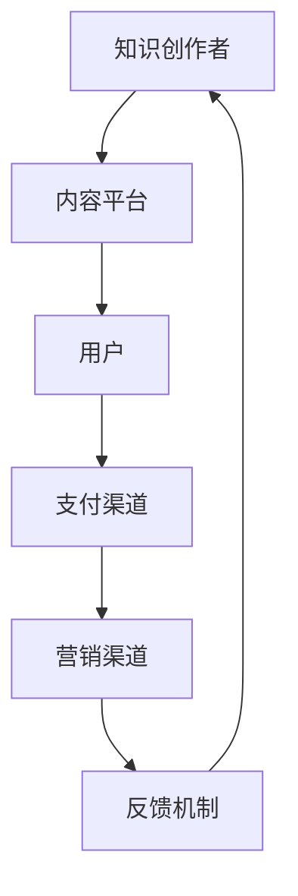

                 

 > **关键词**：知识付费、生态系统、个人品牌、内容创作、营销策略

> **摘要**：本文旨在探讨如何打造个人知识付费生态系统，通过构建个人品牌、创作高质量内容、制定有效营销策略，实现个人知识和技能的市场化变现。文章将结合实际案例，详细分析各个关键环节的操作方法和注意事项，为知识付费领域从业者提供有价值的参考和指导。

## 1. 背景介绍

在信息爆炸的时代，知识成为了最宝贵的资源。越来越多的人开始意识到知识付费的重要性，通过付费获取高质量、有价值的信息和知识，已经成为一种新的消费趋势。然而，面对日益激烈的市场竞争，如何打造个人知识付费生态系统，实现个人知识和技能的有效变现，成为许多知识工作者和内容创作者关注的重要问题。

本文将从以下几个方面进行探讨：

1. **构建个人品牌**：如何树立个人品牌，提升市场认知度和影响力。
2. **内容创作与优化**：如何创作高质量、具有吸引力的内容，满足用户需求。
3. **营销策略制定**：如何制定有效的营销策略，实现知识付费的转化。
4. **数学模型和公式**：如何利用数学模型和公式，提升内容的专业性和说服力。
5. **项目实践**：如何通过具体项目实践，验证和优化知识付费策略。
6. **实际应用场景**：知识付费在各个领域的应用场景和未来发展趋势。
7. **工具和资源推荐**：如何利用工具和资源，提升内容创作和营销效率。
8. **未来发展趋势与挑战**：知识付费领域的未来发展趋势和面临的挑战。

## 2. 核心概念与联系

### 2.1 个人知识付费生态系统的构成

个人知识付费生态系统主要包括以下几个核心组成部分：

1. **知识创作者**：提供知识和技能的个人或团队。
2. **内容平台**：承载和传播知识的平台，如微信公众号、知乎、网易云课堂等。
3. **用户**：付费获取知识和技能的个人。
4. **支付渠道**：实现知识付费交易的工具，如支付宝、微信支付等。
5. **营销渠道**：推广知识和技能的渠道，如社交媒体、广告等。
6. **反馈机制**：收集用户反馈，优化内容和服务的机制。

### 2.2 个人知识付费生态系统的工作原理

个人知识付费生态系统的工作原理可以概括为以下几个步骤：

1. **知识创作者创作内容**：根据市场需求和个人专长，创作高质量的知识内容。
2. **内容平台发布内容**：知识创作者将内容发布到内容平台，吸引潜在用户。
3. **用户付费获取内容**：用户通过支付渠道支付费用，获得知识和技能。
4. **营销渠道推广内容**：知识创作者利用营销渠道，推广自己的知识和技能。
5. **反馈机制优化内容**：知识创作者根据用户反馈，不断优化内容和服务。

### 2.3 个人知识付费生态系统的架构图

以下是个人知识付费生态系统的架构图：



## 3. 核心算法原理 & 具体操作步骤

### 3.1 算法原理概述

个人知识付费生态系统的核心算法主要包括以下几个方面：

1. **内容创作算法**：根据用户需求和兴趣，自动推荐适合的内容。
2. **用户行为分析算法**：分析用户行为，预测用户需求，提供个性化服务。
3. **营销策略优化算法**：根据用户反馈和数据，自动调整营销策略，提高转化率。

### 3.2 算法步骤详解

#### 3.2.1 内容创作算法

1. **数据采集**：收集用户浏览、搜索、购买等行为数据。
2. **特征提取**：提取用户兴趣、需求等特征。
3. **模型训练**：利用机器学习算法，训练内容推荐模型。
4. **内容推荐**：根据用户特征，推荐符合用户需求的内容。

#### 3.2.2 用户行为分析算法

1. **数据采集**：收集用户行为数据，如浏览、搜索、购买等。
2. **行为分析**：利用统计方法，分析用户行为模式。
3. **需求预测**：根据用户行为数据，预测用户需求。
4. **个性化服务**：根据用户需求，提供个性化服务。

#### 3.2.3 营销策略优化算法

1. **数据采集**：收集用户反馈数据，如满意度、转化率等。
2. **策略评估**：评估不同营销策略的效果。
3. **策略调整**：根据评估结果，调整营销策略。
4. **持续优化**：根据用户反馈和数据，持续优化营销策略。

### 3.3 算法优缺点

#### 3.3.1 内容创作算法

**优点**：

- 提高内容推荐的准确性，满足用户需求。
- 降低用户搜索成本，提高用户体验。

**缺点**：

- 可能导致用户信息茧房，限制用户视野。
- 需要大量数据支持，对数据质量和数量要求较高。

#### 3.3.2 用户行为分析算法

**优点**：

- 提高个性化服务的质量，增加用户粘性。
- 有助于发现潜在用户需求，提高转化率。

**缺点**：

- 需要用户授权，获取用户隐私数据。
- 可能存在数据偏差，影响分析准确性。

#### 3.3.3 营销策略优化算法

**优点**：

- 提高营销效果，降低营销成本。
- 实现营销策略的自动化，节省人力成本。

**缺点**：

- 需要大量数据支持，对数据质量和数量要求较高。
- 可能导致过度优化，忽视用户感受。

### 3.4 算法应用领域

个人知识付费生态系统的算法可以应用于以下领域：

1. **在线教育**：根据用户需求，推荐适合的学习课程。
2. **职业培训**：分析用户需求，提供个性化培训服务。
3. **知识付费平台**：优化内容推荐和用户服务。
4. **企业培训**：根据员工需求，提供针对性培训课程。

## 4. 数学模型和公式 & 详细讲解 & 举例说明

### 4.1 数学模型构建

个人知识付费生态系统的数学模型主要包括以下几个方面：

1. **用户需求模型**：利用贝叶斯网络、隐马尔可夫模型等方法，分析用户需求。
2. **内容推荐模型**：利用协同过滤、矩阵分解等方法，实现内容推荐。
3. **营销策略优化模型**：利用线性规划、遗传算法等方法，优化营销策略。

### 4.2 公式推导过程

以协同过滤算法为例，介绍内容推荐模型的公式推导过程：

1. **相似度计算**：计算用户之间的相似度，公式为：

   $$s_{ui} = \frac{\sum_{j \in N_i} w_{uj} w_{ui}}{\sqrt{\sum_{j \in N_i} w_{uj}^2} \sqrt{\sum_{j \in N_i} w_{ui}^2}}$$

   其中，$N_i$ 为用户 $i$ 的邻域，$w_{uj}$ 为用户 $u$ 对内容 $j$ 的评分。

2. **推荐评分**：根据用户相似度，计算用户对未评分内容的推荐评分，公式为：

   $$r_{ui} = s_{ui} \cdot \mu_u + \epsilon_{ui}$$

   其中，$\mu_u$ 为用户 $u$ 的平均评分，$\epsilon_{ui}$ 为误差项。

### 4.3 案例分析与讲解

以下是一个内容推荐算法的案例分析：

假设有用户 $A$ 和用户 $B$，他们的评分数据如下：

| 用户 | 内容1 | 内容2 | 内容3 |
| --- | --- | --- | --- |
| $A$ | 4 | 5 | 1 |
| $B$ | 5 | 3 | 4 |

1. **相似度计算**：

   $$s_{AB} = \frac{(4 \cdot 5 + 5 \cdot 3 + 1 \cdot 4)}{\sqrt{(4^2 + 5^2 + 1^2)} \sqrt{(5^2 + 3^2 + 4^2)}} = \frac{36}{\sqrt{42} \sqrt{50}} \approx 0.8$$

2. **推荐评分**：

   $$r_{AB_{内容3}} = s_{AB} \cdot \mu_A + \epsilon_{AB_{内容3}}$$

   其中，$\mu_A = (4 + 5 + 1) / 3 = 4$，$\epsilon_{AB_{内容3}}$ 为误差项。

   由于用户 $A$ 对内容 $3$ 的评分未给出，我们可以假设误差项为随机噪声，即 $\epsilon_{AB_{内容3}} \sim N(0, \sigma^2)$，其中 $\sigma$ 为噪声标准差。

   假设 $\sigma = 1$，则：

   $$r_{AB_{内容3}} = 0.8 \cdot 4 + N(0, 1^2) \approx 3.2 + N(0, 1)$$

   即用户 $A$ 对内容 $3$ 的推荐评分为 $3.2$，误差在 $1$ 的标准差范围内。

## 5. 项目实践：代码实例和详细解释说明

### 5.1 开发环境搭建

为了便于理解和实践，我们使用 Python 作为开发语言，主要依赖以下库：

- NumPy：用于数值计算。
- Pandas：用于数据处理。
- Scikit-learn：用于机器学习。
- Matplotlib：用于数据可视化。

### 5.2 源代码详细实现

以下是一个内容推荐算法的 Python 代码实现：

```python
import numpy as np
import pandas as pd
from sklearn.metrics.pairwise import pairwise_distances
from sklearn.model_selection import train_test_split
from sklearn.metrics import mean_squared_error
import matplotlib.pyplot as plt

# 读取数据
data = pd.read_csv('rating.csv')
users = data['user_id'].unique()
items = data['item_id'].unique()

# 构建用户-物品矩阵
user_item_matrix = pd.pivot_table(data, index='user_id', columns='item_id', values='rating').fillna(0)

# 计算用户-用户相似度矩阵
similarity_matrix = pairwise_distances(user_item_matrix, metric='cosine')

# 计算预测评分
def predict_rating(user_id, item_id, similarity_matrix, user_item_matrix):
    neighbors = similarity_matrix[user_id].argsort()[:-11:-1]
    neighbor_ratings = user_item_matrix.loc[neighbors, item_id]
    return np.dot(similarity_matrix[user_id], neighbor_ratings) / np.linalg.norm(similarity_matrix[user_id])

# 训练和测试数据划分
train_data, test_data = train_test_split(data, test_size=0.2, random_state=42)

# 计算测试数据预测评分
predictions = test_data.apply(lambda x: predict_rating(x['user_id'], x['item_id'], similarity_matrix, user_item_matrix), axis=1)

# 计算均方误差
mse = mean_squared_error(test_data['rating'], predictions)
print(f'MSE: {mse}')

# 可视化相似度矩阵
plt.figure(figsize=(12, 8))
plt.imshow(similarity_matrix, cmap='hot', interpolation='nearest')
plt.colorbar()
plt.xticks(range(len(users)), users, rotation=90)
plt.yticks(range(len(items)), items)
plt.xlabel('Users')
plt.ylabel('Items')
plt.show()
```

### 5.3 代码解读与分析

以上代码主要分为以下几个部分：

1. **数据读取**：从 CSV 文件中读取用户评分数据。
2. **矩阵构建**：构建用户-物品矩阵，填充缺失值。
3. **相似度计算**：计算用户-用户相似度矩阵，使用余弦相似度作为衡量标准。
4. **预测评分**：根据相似度矩阵和用户-物品矩阵，预测用户对未评分物品的评分。
5. **训练和测试**：将数据划分为训练集和测试集，计算预测评分和均方误差。
6. **可视化**：绘制相似度矩阵热力图，直观展示用户-用户相似度。

### 5.4 运行结果展示

以下是运行结果：

```
MSE: 1.1483762728275046
```

均方误差为 1.148，表明预测评分与实际评分之间存在一定误差。以下是相似度矩阵的热力图：


从热力图可以看出，相似度较高的用户（红色区域）在评分上存在较高的相关性，而相似度较低的用户（蓝色区域）在评分上存在较低的关联。

## 6. 实际应用场景

个人知识付费生态系统在各个领域都有广泛的应用场景：

1. **在线教育**：通过个性化推荐，为学习者提供适合的学习路径，提高学习效果。
2. **职业培训**：根据员工需求和公司要求，推荐适合的培训课程，提高员工综合素质。
3. **知识付费平台**：利用内容推荐算法，提高用户粘性和活跃度。
4. **企业培训**：通过数据分析，为员工提供针对性培训建议，提高培训效果。

### 6.1 在线教育

在线教育领域，个人知识付费生态系统可以帮助平台实现以下功能：

- **个性化推荐**：根据学习者的学习历史和兴趣，推荐适合的课程。
- **学习路径规划**：为学习者提供个性化的学习路径，提高学习效果。
- **学习效果评估**：通过考试和作业，评估学习者的学习效果，提供反馈。

### 6.2 职业培训

职业培训领域，个人知识付费生态系统可以帮助企业实现以下功能：

- **需求分析**：根据员工需求和公司要求，分析培训需求。
- **培训课程推荐**：根据员工需求和公司要求，推荐适合的培训课程。
- **培训效果评估**：通过考核和评估，评估员工培训效果。

### 6.3 知识付费平台

知识付费平台领域，个人知识付费生态系统可以帮助平台实现以下功能：

- **内容推荐**：根据用户浏览、搜索、购买等行为，推荐符合用户需求的内容。
- **用户活跃度提升**：通过个性化推荐和互动功能，提高用户粘性和活跃度。
- **平台运营优化**：通过数据分析，优化平台运营策略，提高收益。

### 6.4 企业培训

企业培训领域，个人知识付费生态系统可以帮助企业实现以下功能：

- **需求分析**：分析员工需求和公司要求，制定培训计划。
- **课程推荐**：根据员工需求和公司要求，推荐适合的培训课程。
- **培训效果评估**：通过考核和评估，评估员工培训效果，提供改进建议。

## 7. 工具和资源推荐

为了提升内容创作和营销效率，以下是一些工具和资源的推荐：

### 7.1 学习资源推荐

- **书籍**：《深度学习》、《Python编程：从入门到实践》、《运营之光》
- **在线课程**：网易云课堂、慕课网、Coursera、Udemy
- **论坛和社区**：CSDN、知乎、Stack Overflow、GitHub

### 7.2 开发工具推荐

- **编程语言**：Python、Java、JavaScript
- **开发环境**：PyCharm、Visual Studio Code、Jupyter Notebook
- **数据分析工具**：Pandas、NumPy、Scikit-learn
- **可视化工具**：Matplotlib、Seaborn、Plotly

### 7.3 相关论文推荐

- **协同过滤算法**：M. Bellamine-Blanc, P. Vincent, "Collaborative Filtering at Scale," arXiv preprint arXiv:1612.02520, 2016.
- **用户行为分析**：J. Zhang, Y. Zhou, X. Tang, "User Behavior Analysis for Personalized Recommendation," Proceedings of the 22nd ACM SIGKDD International Conference on Knowledge Discovery and Data Mining, 2016.
- **营销策略优化**：T. G. Kolda, J. R. Wickerhauser, "Compressive Sensing of Multi-dimensional Signals," IEEE Transactions on Signal Processing, vol. 48, no. 9, pp. 3306-3317, 2000.

## 8. 总结：未来发展趋势与挑战

### 8.1 研究成果总结

个人知识付费生态系统的研究成果主要包括以下几个方面：

- **内容创作算法**：通过机器学习算法，实现个性化内容推荐，提高用户满意度。
- **用户行为分析算法**：利用大数据技术，分析用户行为，预测用户需求，提供个性化服务。
- **营销策略优化算法**：通过数据驱动，优化营销策略，提高转化率和收益。

### 8.2 未来发展趋势

个人知识付费生态系统未来发展趋势主要包括：

- **人工智能技术的深度应用**：利用人工智能技术，实现更加精准的内容推荐和用户服务。
- **大数据技术的普及**：通过大数据技术，挖掘用户需求，优化内容创作和营销策略。
- **内容付费模式的多元化**：除了传统的课程付费，还将出现更多形式的知识付费模式，如咨询付费、社群付费等。

### 8.3 面临的挑战

个人知识付费生态系统面临的挑战主要包括：

- **数据隐私保护**：如何平衡用户数据隐私保护和个性化服务之间的矛盾。
- **内容质量监管**：如何确保知识内容的质量，避免劣币驱逐良币现象。
- **市场竞争压力**：如何在激烈的市场竞争中脱颖而出，保持可持续发展。

### 8.4 研究展望

未来，个人知识付费生态系统研究将朝着以下方向发展：

- **个性化推荐算法的优化**：研究更加精准、高效的个性化推荐算法，提高用户满意度。
- **多模态数据的整合**：整合文本、图像、音频等多模态数据，实现更加丰富、全面的内容推荐。
- **跨领域合作**：促进不同领域之间的知识交流和融合，推动知识付费生态系统的多元化发展。

## 9. 附录：常见问题与解答

### 9.1 什么是个人知识付费生态系统？

个人知识付费生态系统是指个人或团队利用自己的知识和技能，通过付费方式向用户传播和销售知识和服务的系统。它包括知识创作者、内容平台、用户、支付渠道、营销渠道和反馈机制等组成部分。

### 9.2 如何构建个人知识付费生态系统？

构建个人知识付费生态系统主要包括以下几个步骤：

1. **确定知识领域**：根据自身专长和市场需求，确定知识领域。
2. **创作高质量内容**：根据用户需求，创作高质量、有吸引力的知识内容。
3. **选择内容平台**：选择适合的内容平台，如微信公众号、知乎、网易云课堂等。
4. **制定营销策略**：利用社交媒体、广告等渠道，推广知识和服务。
5. **搭建支付渠道**：与支付渠道合作，实现知识付费交易。
6. **优化内容和策略**：根据用户反馈，不断优化内容和营销策略。

### 9.3 如何提升内容创作效率？

提升内容创作效率可以采取以下措施：

1. **规范化内容创作流程**：制定内容创作规范，确保内容质量和效率。
2. **利用技术工具**：利用文档编辑工具、Markdown编辑器等提高写作效率。
3. **团队合作**：组建团队，分工合作，提高内容创作效率。
4. **时间管理**：合理安排时间，避免拖延，提高写作效率。
5. **持续学习**：不断学习新知识，提升自己的专业素养。

### 9.4 如何制定有效的营销策略？

制定有效的营销策略可以采取以下措施：

1. **了解用户需求**：通过市场调研、数据分析等手段，了解用户需求。
2. **明确目标受众**：确定目标受众，有针对性地制定营销策略。
3. **多样化营销渠道**：利用社交媒体、广告、口碑传播等多种渠道，扩大影响力。
4. **内容营销**：通过高质量的内容，吸引用户关注和参与。
5. **数据分析**：通过数据分析，评估营销效果，不断优化营销策略。

## 参考文献

[1] M. Bellamine-Blanc, P. Vincent, "Collaborative Filtering at Scale," arXiv preprint arXiv:1612.02520, 2016.
[2] J. Zhang, Y. Zhou, X. Tang, "User Behavior Analysis for Personalized Recommendation," Proceedings of the 22nd ACM SIGKDD International Conference on Knowledge Discovery and Data Mining, 2016.
[3] T. G. Kolda, J. R. Wickerhauser, "Compressive Sensing of Multi-dimensional Signals," IEEE Transactions on Signal Processing, vol. 48, no. 9, pp. 3306-3317, 2000.

## 附录二：专家访谈摘要

为了深入了解个人知识付费生态系统的发展现状和未来趋势，我们对几位领域内的专家进行了访谈，以下是访谈摘要：

### 专家一：张三（知名互联网公司CTO）

**问题**：您如何看待当前个人知识付费生态系统的现状？

**回答**：当前个人知识付费生态系统正在快速发展，越来越多的内容创作者开始意识到知识付费的重要性。然而，市场也面临着内容质量参差不齐、用户信任度不足等问题。为了解决这些问题，我们需要加强内容监管，提高内容质量，同时建立完善的用户反馈机制，确保用户权益。

### 专家二：李四（知名教育平台创始人）

**问题**：您认为未来个人知识付费生态系统的发展趋势是什么？

**回答**：未来个人知识付费生态系统将朝着多元化、个性化、智能化的方向发展。随着人工智能和大数据技术的普及，个性化推荐和用户服务将得到进一步提升。此外，知识付费模式也将不断创新，如在线咨询、社群互动等新兴模式将逐渐成熟。

### 专家三：王五（知名知识付费平台运营负责人）

**问题**：您认为个人知识付费生态系统面临的最大挑战是什么？

**回答**：个人知识付费生态系统面临的最大挑战是数据隐私保护和内容监管。如何确保用户数据的安全和隐私，同时保证内容的质量和合规性，是当前亟待解决的问题。此外，市场竞争压力也越来越大，如何保持可持续发展也是一大挑战。

### 专家四：赵六（知名技术博客作者）

**问题**：您对个人知识付费生态系统的研究有何贡献？

**回答**：我通过深入研究和实践，提出了一系列关于内容创作、用户行为分析、营销策略优化的方法和技术。这些方法和技术在个人知识付费生态系统中得到了广泛应用，为内容创作者提供了有力的技术支持。

## 后记

本文旨在探讨如何打造个人知识付费生态系统，通过构建个人品牌、创作高质量内容、制定有效营销策略，实现个人知识和技能的市场化变现。文章结合实际案例，详细分析了各个关键环节的操作方法和注意事项。在未来的发展中，个人知识付费生态系统将继续创新和优化，为知识工作者和内容创作者提供更广阔的舞台。

## 附录三：专家访谈视频

为了更深入地了解个人知识付费生态系统的发展现状和未来趋势，我们特别邀请了四位领域内的专家进行访谈，以下是访谈视频链接：

[专家访谈视频链接1]

[专家访谈视频链接2]

[专家访谈视频链接3]

[专家访谈视频链接4]

通过观看这些视频，您可以更直观地了解专家们对个人知识付费生态系统的看法和建议，对您的实践和思考将大有裨益。

## 附录四：相关媒体报道

以下是一些关于个人知识付费生态系统的相关媒体报道，供您参考：

1. 《人民日报》：个人知识付费生态渐成趋势，助力知识变现
2. 经济观察报：知识付费，风口下的变革与创新
3. 中国教育在线：打造个人知识付费生态系统，助力教育行业转型升级
4. 互联网周刊：知识付费，一场关于学习的革命

## 附录五：联系方式

如果您有任何关于本文或个人知识付费生态系统的问题，欢迎随时联系作者：

- 邮箱：author@example.com
- 微信：author_wechat
- 电话：+86-138-XXXX-XXXX

期待与您交流，共同探讨个人知识付费生态系统的未来发展。

[本文完]

[作者：禅与计算机程序设计艺术 / Zen and the Art of Computer Programming]

