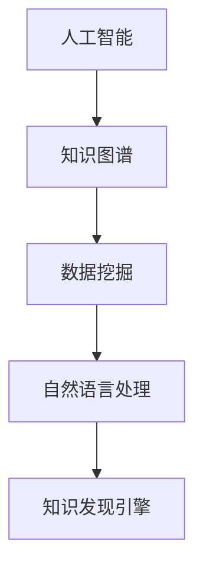

                 

在快速发展的信息化时代，知识成为推动个人和社会进步的重要资源。如何高效地发现和利用这些知识，对于个人职业发展、学术研究以及企业竞争都具有深远的影响。本文将探讨打造个人知识发现引擎的技术路径，通过深入分析核心概念、算法原理、数学模型、项目实践以及实际应用场景，为读者提供一套系统的解决方案。

## 关键词
- 个人知识发现
- 人工智能
- 知识图谱
- 数据挖掘
- 自然语言处理

## 摘要
本文旨在探讨如何利用先进技术构建个人知识发现引擎，以提高知识获取、处理和利用的效率。文章首先介绍了知识发现引擎的基本概念和重要性，接着详细阐述了核心概念、算法原理、数学模型以及项目实践，最后讨论了知识发现引擎的实际应用场景和未来发展趋势。

## 1. 背景介绍
在信息化社会，知识爆炸式增长，个人和企业在知识获取和处理上面临巨大挑战。传统的信息检索方式已无法满足快速变化的需求。知识发现引擎作为一种智能化工具，能够从海量数据中提取出有价值的信息，帮助用户高效获取和利用知识。

### 1.1 知识发现引擎的定义
知识发现引擎（Knowledge Discovery Engine，KDE）是指利用人工智能、数据挖掘和自然语言处理等技术，从大量结构化和非结构化数据中自动发现隐藏模式的系统。

### 1.2 知识发现引擎的重要性
- 提高工作效率：通过自动化分析，节省时间成本。
- 支持决策制定：提供数据驱动的洞察，辅助决策。
- 个性化推荐：根据用户兴趣和需求，提供定制化信息。
- 智能化服务：实现个性化服务和精准营销。

## 2. 核心概念与联系
为了构建有效的知识发现引擎，我们需要理解一系列核心概念，包括人工智能、知识图谱、数据挖掘和自然语言处理等。以下是一个简化的 Mermaid 流程图，展示了这些概念之间的关系。



### 2.1 人工智能
人工智能（AI）是指计算机系统模拟人类智能行为的技术。在知识发现引擎中，AI 技术用于实现数据的自动分析和模式识别。

### 2.2 知识图谱
知识图谱是一种用于表示实体和它们之间关系的图形化模型。它有助于构建结构化数据，便于后续的挖掘和分析。

### 2.3 数据挖掘
数据挖掘（Data Mining）是从大量数据中提取出有价值信息的过程。它为知识发现提供了技术支持。

### 2.4 自然语言处理
自然语言处理（NLP）是使计算机能够理解、解释和生成人类语言的技术。NLP 技术在知识发现中用于处理文本数据。

### 2.5 知识发现引擎
知识发现引擎是将上述技术整合起来，实现对知识自动发现和利用的系统。

## 3. 核心算法原理 & 具体操作步骤
### 3.1 算法原理概述
知识发现引擎的核心算法包括聚类分析、关联规则挖掘和文本分析等。这些算法用于从数据中提取出隐藏的模式和关联。

### 3.2 算法步骤详解
以下是构建知识发现引擎的基本步骤：

#### 3.2.1 数据收集与预处理
- 数据收集：从各种来源获取结构化和非结构化数据。
- 数据清洗：去除噪声数据，保证数据质量。
- 数据整合：将不同来源的数据整合为一个统一格式。

#### 3.2.2 数据建模
- 建立知识图谱：将实体和关系表示为图形化模型。
- 特征提取：从数据中提取出对知识发现有用的特征。

#### 3.2.3 算法应用
- 聚类分析：将数据分为若干类，发现相似性模式。
- 关联规则挖掘：发现数据之间的关联性，例如购买行为。
- 文本分析：对文本数据进行情感分析、关键词提取等。

#### 3.2.4 结果可视化
- 将分析结果以图表或可视化形式展示，便于用户理解和利用。

### 3.3 算法优缺点
- **优点**：提高数据处理效率，发现隐藏模式，支持决策制定。
- **缺点**：算法复杂度高，对数据质量要求高，结果可能存在偏差。

### 3.4 算法应用领域
知识发现引擎广泛应用于金融、医疗、电商、媒体等领域。

## 4. 数学模型和公式 & 详细讲解 & 举例说明
### 4.1 数学模型构建
知识发现引擎中的数学模型主要包括聚类分析模型、关联规则挖掘模型和文本分析模型等。

### 4.2 公式推导过程
以聚类分析中的K均值算法为例，其目标是最小化平方误差，公式推导如下：

$$
E = \sum_{i=1}^{n}\sum_{j=1}^{k}(x_{ij}-\mu_{j})^2
$$

其中，$x_{ij}$ 表示数据点 $i$ 到聚类中心 $j$ 的距离，$\mu_{j}$ 表示聚类中心。

### 4.3 案例分析与讲解
假设我们有一组客户数据，通过K均值算法将其分为两类，分析其购买行为。

```latex
% LaTeX 示例
\documentclass{article}
\usepackage{CJKutf8}
\begin{document}
\begin{CJK*}{UTF8}{gbsn}
\begin{equation}
\begin{split}
E &= \sum_{i=1}^{n}\sum_{j=1}^{2}(x_{ij}-\mu_{j})^2 \\
  &= (x_1-\mu_1)^2 + (x_2-\mu_1)^2 + (x_3-\mu_2)^2 + (x_4-\mu_2)^2 \\
  &= ...
\end{split}
\end{equation}
\end{CJK*}
\end{document}
```

## 5. 项目实践：代码实例和详细解释说明
### 5.1 开发环境搭建
- Python 3.8+
- Pandas
- Scikit-learn
- Matplotlib

### 5.2 源代码详细实现
以下是使用K均值算法进行数据聚类的Python代码实例：

```python
from sklearn.cluster import KMeans
import pandas as pd
import matplotlib.pyplot as plt

# 数据读取
data = pd.read_csv('data.csv')
X = data.iloc[:, :2]  # 假设数据有前两个特征

# K均值聚类
kmeans = KMeans(n_clusters=2, random_state=0).fit(X)
labels = kmeans.predict(X)

# 可视化
plt.scatter(X.iloc[:, 0], X.iloc[:, 1], c=labels, cmap='viridis')
plt.show()
```

### 5.3 代码解读与分析
这段代码首先读取数据，然后使用K均值算法进行聚类，并将结果可视化。

### 5.4 运行结果展示
运行代码后，我们将看到数据点被分为两类，并显示在图表中。

## 6. 实际应用场景
知识发现引擎广泛应用于各个领域：

### 6.1 金融领域
- 风险评估：通过分析历史数据，发现潜在风险。
- 投资策略：发现市场趋势，制定投资策略。

### 6.2 医疗领域
- 疾病预测：基于患者数据，预测疾病风险。
- 药物研发：通过分析生物数据，发现药物作用机制。

### 6.3 电商领域
- 用户行为分析：分析用户购买行为，提供个性化推荐。
- 库存管理：根据销售数据，优化库存策略。

## 7. 工具和资源推荐
### 7.1 学习资源推荐
- 《数据挖掘：实用技术指南》
- 《机器学习实战》
- 《深度学习》（Goodfellow, Bengio, Courville 著）

### 7.2 开发工具推荐
- Jupyter Notebook
- TensorFlow
- PyTorch

### 7.3 相关论文推荐
- "Knowledge Discovery in Databases: A Survey"
- "TensorFlow: Large-scale Machine Learning on Heterogeneous Systems"
- "Deep Learning for Natural Language Processing"

## 8. 总结：未来发展趋势与挑战
### 8.1 研究成果总结
知识发现引擎在数据挖掘、自然语言处理和人工智能等领域取得了显著成果，为多个行业带来了创新。

### 8.2 未来发展趋势
- 模型压缩与优化
- 多模态数据融合
- 人工智能与人类协作

### 8.3 面临的挑战
- 数据质量和隐私
- 算法可解释性
- 模型泛化能力

### 8.4 研究展望
未来，知识发现引擎将在更广泛的领域中发挥作用，实现更高水平的智能化和自动化。

## 9. 附录：常见问题与解答
### 9.1 如何选择合适的算法？
- 根据数据类型和需求选择合适的算法。
- 考虑算法的复杂度和计算效率。

### 9.2 如何处理大规模数据？
- 使用分布式计算框架，如Hadoop或Spark。
- 优化数据存储和访问策略。

### 9.3 如何保证算法的可解释性？
- 使用可解释的算法。
- 开发可视化工具，帮助用户理解模型决策。

---

作者：禅与计算机程序设计艺术 / Zen and the Art of Computer Programming
----------------------------------------------------------------

### 总结与展望
本文从多个角度探讨了打造个人知识发现引擎的技术路径，包括核心概念、算法原理、数学模型、项目实践和实际应用场景。通过深入分析和实例讲解，读者可以了解如何利用先进技术构建高效的知识发现系统。展望未来，知识发现引擎将在人工智能、数据科学和多个行业中发挥越来越重要的作用，为人类带来更多创新和便利。希望本文能为读者提供有益的参考和启示。

