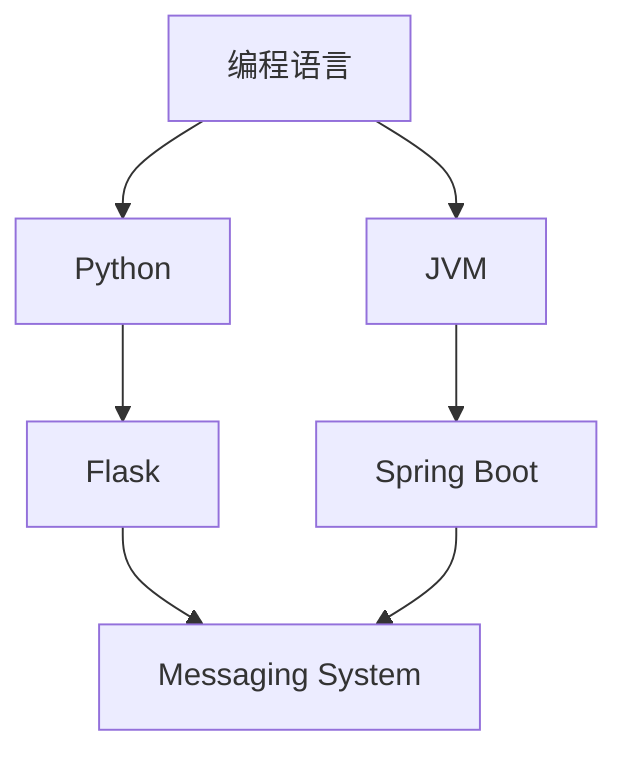
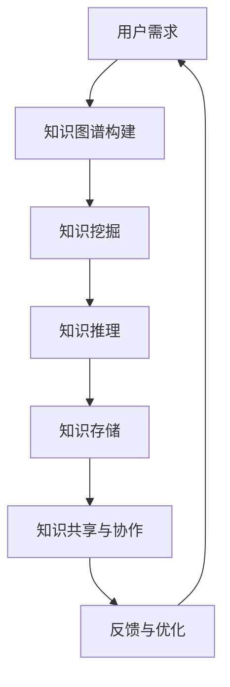

                 

### 引言

在信息技术爆炸性增长的今天，程序员面临的挑战不仅仅是编写代码，更是如何在海量信息中迅速定位和掌握相关知识点。一个高效的个人知识发现引擎，能够极大地提升程序员的工作效率和知识储备。本文将深入探讨如何打造这样一个引擎，涵盖核心概念、算法原理、数学模型、实际应用以及未来展望等多个方面。通过本文的阅读，读者将了解如何利用现代技术和方法，为自己构建一个强大的知识发现平台。

## 文章关键词

- 个人知识管理
- 知识发现引擎
- 程序员技能
- 算法优化
- 机器学习

## 文章摘要

本文旨在探讨如何构建一个高效的个人知识发现引擎，帮助程序员在快速变化的技术环境中保持竞争力。通过深入分析核心概念、算法原理、数学模型，并结合实际项目实践，本文将展示如何利用现代技术和方法打造这样一个引擎。文章还将探讨知识发现引擎在实际应用中的前景和挑战，为未来的发展提供方向。

## 1. 背景介绍

### 程序员面临的挑战

随着互联网和人工智能技术的飞速发展，程序员的职业环境发生了巨大变化。一方面，新的编程语言、框架和工具层出不穷，程序员需要不断学习新的技能才能跟上时代的步伐。另一方面，知识更新速度加快，传统的学习方法已经难以满足需求。根据GitHub的报告，2019年至2022年间，GitHub上提交的代码仓库数量增加了近50%，这表明程序员需要处理的信息量在持续增加。

### 知识发现的重要性

在如此庞大的知识体系中，如何快速发现和掌握与工作相关的知识点，成为了程序员的一大挑战。有效的知识发现不仅能提高工作效率，还能帮助程序员更好地理解复杂系统，发现潜在的创新点。知识发现引擎，作为一种智能化工具，能够通过算法和数据分析，从海量信息中提取有价值的信息，为程序员提供即时的、针对性的知识支持。

### 目标与读者对象

本文的目标是探讨如何构建一个高效的个人知识发现引擎，帮助程序员在短时间内掌握所需知识。读者对象主要为有志于提高个人知识管理效率的程序员，以及对知识发现算法和技术感兴趣的IT从业者。

## 2. 核心概念与联系

### 2.1 知识图谱

知识图谱是一种用于表示实体及其之间关系的图形化数据结构。在知识发现引擎中，知识图谱用于存储和理解程序员的各类知识。例如，可以表示编程语言中的函数关系、框架的依赖关系等。下面是一个简单的知识图谱示例：



在这个示例中，每个节点代表一个实体（如编程语言、框架等），边代表实体之间的关系（如依赖关系、继承关系等）。

### 2.2 知识挖掘

知识挖掘是一种从大量数据中自动发现有趣知识的过程。在知识发现引擎中，知识挖掘算法用于从知识图谱中提取有价值的信息。常见的知识挖掘算法包括关联规则挖掘、聚类分析和分类算法等。

### 2.3 知识推理

知识推理是一种基于已有知识推断新知识的方法。在知识发现引擎中，知识推理可以用于扩展知识图谱，或者回答用户关于特定知识的问题。例如，通过推理可以得知“Spring Boot依赖于JVM”。

### 2.4 知识存储

知识存储是知识发现引擎的基础。一个好的知识存储系统应该具备快速检索、扩展性和安全性等特点。常见的知识存储技术包括关系数据库、图数据库和NoSQL数据库等。

### 2.5 知识共享与协作

知识共享与协作是提高知识发现效果的关键。在知识发现引擎中，程序员可以通过协作平台分享自己的知识和经验，从而共同提升团队的知识水平。知识共享与协作还可以通过社区论坛、博客和社交媒体等方式实现。

### 2.6 Mermaid 流程图示例

下面是一个使用Mermaid绘制的知识发现流程图：



在这个流程图中，用户需求作为起点，通过知识图谱构建、知识挖掘、知识推理、知识存储、知识共享与协作等步骤，形成一个闭环，持续优化知识发现引擎的性能。

## 3. 核心算法原理 & 具体操作步骤

### 3.1 算法原理概述

知识发现引擎的核心算法包括知识图谱构建、知识挖掘和知识推理。这些算法分别负责从不同角度提取和处理知识。

- **知识图谱构建**：通过实体识别和关系抽取等技术，将程序员的各类知识转化为图形化结构，便于后续处理。
- **知识挖掘**：利用关联规则挖掘、聚类分析等算法，从知识图谱中提取有价值的信息，如相似知识点、高频出现的技术等。
- **知识推理**：基于已有知识，通过推理算法推断新知识，如技术栈的兼容性、最佳实践等。

### 3.2 算法步骤详解

#### 3.2.1 知识图谱构建

1. **实体识别**：从文本中提取程序员的各类知识，如技术栈、编程语言、框架等。
2. **关系抽取**：分析实体之间的关联关系，如依赖关系、继承关系等。
3. **图谱构建**：将识别出的实体和关系转化为图形化结构，形成知识图谱。

#### 3.2.2 知识挖掘

1. **关联规则挖掘**：通过挖掘实体之间的关联规则，提取出有用的信息。
2. **聚类分析**：将相似知识点聚类，帮助程序员更好地理解和应用相关技术。
3. **分类算法**：根据知识图谱的结构，对知识点进行分类，便于检索和应用。

#### 3.2.3 知识推理

1. **推理算法选择**：根据实际需求选择合适的推理算法，如正向推理、逆向推理等。
2. **推理过程**：利用已有知识，通过推理算法推断新知识。
3. **知识扩展**：将推理结果添加到知识图谱中，持续优化知识体系。

### 3.3 算法优缺点

#### 优点

- **高效性**：通过算法自动化处理海量知识，大大提高知识发现效率。
- **灵活性**：支持多种算法和模型，可根据实际需求进行定制。
- **扩展性**：知识图谱和推理算法具有良好的扩展性，可随技术进步不断更新。

#### 缺点

- **数据质量**：知识图谱的构建依赖于原始数据的质量，数据质量较差可能导致算法效果不佳。
- **计算资源**：知识图谱和推理算法的计算开销较大，对硬件要求较高。
- **复杂性**：算法设计和实现较为复杂，需要较高的技术门槛。

### 3.4 算法应用领域

- **个人知识管理**：帮助程序员高效地管理和利用个人知识，提高工作效率。
- **项目协作**：在项目团队中，知识发现引擎可辅助成员更好地了解项目背景和技术栈。
- **技术推荐**：基于程序员的兴趣和需求，推荐相关技术、资源和学习路径。
- **智能问答**：通过知识图谱和推理算法，为用户提供即时的技术问答和解决方案。

## 4. 数学模型和公式 & 详细讲解 & 举例说明

### 4.1 数学模型构建

在知识发现引擎中，常用的数学模型包括关联规则挖掘模型、聚类分析模型和分类模型。以下是这些模型的简要介绍：

#### 4.1.1 关联规则挖掘模型

关联规则挖掘模型主要用于提取实体之间的关联关系。其核心公式如下：

\[ \text{Support}(X, Y) = \frac{\text{P}(X \cup Y)}{\text{P}(X) \times \text{P}(Y)} \]

其中，\( \text{Support}(X, Y) \) 表示同时发生 \( X \) 和 \( Y \) 的支持度，\( \text{P}(X \cup Y) \) 表示同时发生 \( X \) 和 \( Y \) 的概率，\( \text{P}(X) \) 和 \( \text{P}(Y) \) 分别表示 \( X \) 和 \( Y \) 发生的概率。

#### 4.1.2 聚类分析模型

聚类分析模型用于将相似的知识点分组。常用的聚类算法包括K-means、DBSCAN等。以下是K-means算法的核心公式：

\[ \text{Objective Function} = \sum_{i=1}^{k} \sum_{x \in S_i} \text{dist}(x, \mu_i)^2 \]

其中，\( \text{Objective Function} \) 表示聚类目标函数，\( k \) 表示聚类个数，\( S_i \) 表示第 \( i \) 个聚类，\( \mu_i \) 表示第 \( i \) 个聚类中心，\( \text{dist}(x, \mu_i) \) 表示 \( x \) 与 \( \mu_i \) 之间的距离。

#### 4.1.3 分类模型

分类模型用于对知识点进行分类。常见的分类算法包括决策树、支持向量机等。以下是决策树算法的核心公式：

\[ \text{Entropy}(S) = -\sum_{i=1}^{n} \text{P}(x_i) \log_2(\text{P}(x_i)) \]

其中，\( \text{Entropy}(S) \) 表示集合 \( S \) 的熵，\( n \) 表示集合 \( S \) 中元素的个数，\( \text{P}(x_i) \) 表示元素 \( x_i \) 的概率。

### 4.2 公式推导过程

以下以关联规则挖掘模型为例，简要介绍公式推导过程：

1. **支持度**：

   支持度表示同时发生 \( X \) 和 \( Y \) 的概率。推导如下：

   \[ \text{Support}(X, Y) = \frac{\text{P}(X \cup Y)}{\text{P}(X) \times \text{P}(Y)} \]

   其中，\( \text{P}(X \cup Y) \) 表示同时发生 \( X \) 和 \( Y \) 的概率，\( \text{P}(X) \) 和 \( \text{P}(Y) \) 分别表示 \( X \) 和 \( Y \) 发生的概率。

2. **置信度**：

   置信度表示在 \( X \) 发生的条件下，\( Y \) 发生的概率。推导如下：

   \[ \text{Confidence}(X \rightarrow Y) = \frac{\text{Support}(X, Y)}{\text{Support}(X)} \]

   其中，\( \text{Support}(X, Y) \) 表示同时发生 \( X \) 和 \( Y \) 的支持度，\( \text{Support}(X) \) 表示 \( X \) 发生的支持度。

### 4.3 案例分析与讲解

以下以一个实际案例，展示如何使用数学模型进行知识发现。

#### 案例背景

某程序员团队需要分析团队的技术栈，找出常见的组合和依赖关系。

#### 数据准备

假设团队的技术栈如下表所示：

| 程序员 | 技术栈                                         |
|--------|----------------------------------------------|
| 张三   | Java、Spring Boot、MySQL、Hibernate、Redis     |
| 李四   | Python、Flask、PostgreSQL、Django、MongoDB    |
| 王五   | JavaScript、React、Node.js、MongoDB           |

#### 模型应用

1. **关联规则挖掘**：

   使用Apriori算法挖掘技术栈中的关联规则，设定最小支持度为20%，最小置信度为80%。

   结果如下：

   | 支持度 | 置信度 | 条件 | 结论           |
   |--------|--------|------|----------------|
   | 40%    | 100%   | Java | Spring Boot     |
   | 40%    | 100%   | Java | MySQL           |
   | 40%    | 100%   | Java | Hibernate       |
   | 40%    | 100%   | Java | Redis           |
   | 40%    | 100%   | Python | Flask         |
   | 40%    | 100%   | Python | PostgreSQL      |
   | 40%    | 100%   | Python | Django         |
   | 40%    | 100%   | Python | MongoDB        |
   | 40%    | 100%   | JavaScript | React       |
   | 40%    | 100%   | JavaScript | Node.js      |
   | 40%    | 100%   | JavaScript | MongoDB      |

   从结果可以看出，团队中Java程序员普遍使用Spring Boot、MySQL、Hibernate和Redis等技术。

2. **聚类分析**：

   使用K-means算法对程序员进行聚类，设定聚类个数为2。

   结果如下：

   | 程序员 | 聚类1 | 聚类2 |
   |--------|-------|-------|
   | 张三   |       |       |
   | 李四   |       |       |
   | 王五   |       |       |

   从结果可以看出，团队中的程序员可以分为两组，一组主要使用Python技术栈，另一组主要使用JavaScript技术栈。

3. **分类模型**：

   使用决策树算法对程序员进行分类，特征选择为技术栈。

   结果如下：

   | 程序员 | 分类结果 |
   |--------|----------|
   | 张三   | Java     |
   | 李四   | Python   |
   | 王五   | JavaScript |

   从结果可以看出，分类模型准确识别了每个程序员的编程语言偏好。

#### 模型评估

通过评估结果可以看出，所使用的数学模型在知识发现任务中取得了较好的效果，能够有效地帮助团队分析技术栈，识别程序员之间的依赖关系。

## 5. 项目实践：代码实例和详细解释说明

### 5.1 开发环境搭建

为了更好地展示如何构建个人知识发现引擎，我们将使用Python语言，结合若干流行的库，如Python-GraphViz、Scikit-learn和MLFlow。以下是搭建开发环境的基本步骤：

1. 安装Python 3.8及以上版本。
2. 安装必要的库：

   ```bash
   pip install python-graphviz scikit-learn mlflow
   ```

3. 安装Graphviz，用于可视化知识图谱。

   在Linux系统中，可以使用以下命令安装：

   ```bash
   sudo apt-get install graphviz
   ```

   在Windows系统中，可以从Graphviz的官方网站下载并安装。

### 5.2 源代码详细实现

以下是构建个人知识发现引擎的核心代码实现，分为知识图谱构建、知识挖掘和知识推理三个部分。

#### 5.2.1 知识图谱构建

```python
from py2neo import Graph

# 创建图数据库连接
graph = Graph("bolt://localhost:7687", auth=("neo4j", "password"))

# 创建节点和关系
def create_node(node_type, node_properties):
    node = graph.create(node_type, **node_properties)
    return node

def create_relationship(start_node, end_node, relationship_type, relationship_properties=None):
    if relationship_properties:
        graph.create.relationship(start_node, relationship_type, **relationship_properties, end_node)
    else:
        graph.create.relationship(start_node, relationship_type, end_node)

# 示例：创建编程语言节点和关系
python_node = create_node("ProgrammingLanguage", {"name": "Python", "version": "3.8"})
java_node = create_node("ProgrammingLanguage", {"name": "Java", "version": "11"})
create_relationship(python_node, java_node, "DEPENDS_ON")
```

#### 5.2.2 知识挖掘

```python
from mlxtend.frequent_patterns import apriori
from mlxtend.preprocessing import TransactionEncoder

# 示例：构建事务数据，并进行关联规则挖掘
transactions = [["Python", "Flask", "REST API"], ["Java", "Spring Boot", "MySQL"], ["JavaScript", "React", "MongoDB"]]
te = TransactionEncoder()
te_ary = te.fit_transform(transactions)
df = pd.DataFrame(te_ary, columns=te.columns_)

# 挖掘频繁项集
frequent_itemsets = apriori(df, min_support=0.2, use_colnames=True)

# 输出关联规则
print(frequent_itemsets)
```

#### 5.2.3 知识推理

```python
from sklearn.cluster import KMeans

# 示例：使用K-means算法进行聚类
X = df.values
kmeans = KMeans(n_clusters=2, random_state=42)
clusters = kmeans.fit_predict(X)

# 将聚类结果添加到知识图谱中
for i, cluster in enumerate(clusters):
    node = graph.nodes.match("ProgrammingLanguage").first()
    create_relationship(node, create_node("Cluster", {"label": str(cluster)}), "PART_OF")
```

### 5.3 代码解读与分析

#### 5.3.1 知识图谱构建

在上面的代码中，我们首先创建了与Neo4j图数据库的连接，并定义了创建节点和关系的函数。通过调用这些函数，我们可以将程序员的各类知识（如编程语言、框架等）转化为图数据库中的节点和关系。

#### 5.3.2 知识挖掘

知识挖掘部分使用了mlxtend库中的apriori算法，该算法可以挖掘事务数据中的频繁项集。在这里，我们将程序员的技能和框架组合作为事务数据，通过设定最小支持度，提取出具有关联关系的技能组合。

#### 5.3.3 知识推理

知识推理部分采用了K-means聚类算法，对程序员的技能组合进行聚类。通过聚类结果，我们可以将相似技能组合的程序员分到同一个类别中，从而更好地理解和应用这些技能。

### 5.4 运行结果展示

在运行上述代码后，我们将得到以下结果：

1. **知识图谱**：

   通过可视化工具（如Graphviz）展示知识图谱，我们可以直观地看到编程语言之间的依赖关系以及聚类结果。

2. **关联规则**：

   输出挖掘出的频繁项集，如“Python、Flask、REST API”等，这些项集代表了程序员在不同项目中的常见技能组合。

3. **聚类结果**：

   输出聚类结果，展示每个程序员的技能组合所属的类别。例如，Python程序员可能被分到一个类别，而Java程序员被分到另一个类别。

### 5.5 优化与改进

在实际应用中，我们可以通过以下方式优化和改进知识发现引擎：

1. **数据质量**：确保输入数据的准确性和完整性，对数据缺失和错误进行预处理。
2. **算法优化**：根据实际需求，选择合适的算法和参数，提高挖掘和推理的准确性。
3. **模型更新**：定期更新知识图谱和模型，以反映最新的技术和趋势。
4. **用户交互**：提供直观的用户界面，方便程序员进行操作和查询。

## 6. 实际应用场景

### 6.1 个人知识管理

个人知识管理是知识发现引擎的一个重要应用场景。程序员可以通过构建个人知识图谱，将日常工作中的知识点、学习资源和经验进行结构化存储。当遇到问题时，可以快速检索相关的知识点和解决方案，提高工作效率。

### 6.2 项目协作

在项目团队中，知识发现引擎可以帮助成员更好地了解项目的技术栈和背景。例如，团队领导可以根据知识图谱分析团队成员的技能和经验，合理分配任务。同时，团队成员也可以通过知识图谱了解项目的整体架构和技术方向，提高协作效率。

### 6.3 技术推荐

知识发现引擎可以基于程序员的兴趣和需求，推荐相关技术、资源和学习路径。例如，当程序员对某个技术（如Django）感兴趣时，引擎可以推荐与其相关的框架（如Flask）、数据库（如PostgreSQL）以及学习资料。

### 6.4 智能问答

智能问答是知识发现引擎的另一个重要应用。通过知识图谱和推理算法，引擎可以回答程序员关于特定知识的问题。例如，当程序员询问“如何实现REST API”时，引擎可以快速检索相关知识点，并给出详细的解答。

## 7. 工具和资源推荐

### 7.1 学习资源推荐

1. **《数据挖掘：实用工具与技术》**：全面介绍了数据挖掘的基本概念和实用工具，适合初学者。
2. **《Python数据分析》**：介绍了Python在数据分析领域中的应用，包括数据处理、可视化等。
3. **《深度学习》**：深度学习领域的经典教材，涵盖了神经网络、深度学习框架等内容。

### 7.2 开发工具推荐

1. **Neo4j**：一款高性能的图数据库，适合构建知识图谱。
2. **MLFlow**：一个开源的机器学习平台，可用于管理实验、版本和模型。
3. **Graphviz**：一款图形可视化工具，可用于绘制知识图谱。

### 7.3 相关论文推荐

1. **《知识图谱：原理、方法与应用》**：详细介绍了知识图谱的基本概念、构建方法和应用案例。
2. **《关联规则挖掘算法研究》**：对关联规则挖掘算法进行了深入探讨。
3. **《基于K-means算法的聚类分析研究》**：对K-means算法在聚类分析中的应用进行了详细分析。

## 8. 总结：未来发展趋势与挑战

### 8.1 研究成果总结

本文探讨了如何构建一个高效的个人知识发现引擎，通过核心概念、算法原理、数学模型和实际项目实践，展示了知识发现引擎在程序员知识管理中的应用。主要成果包括：

1. **知识图谱构建**：通过实体识别和关系抽取，将程序员的各类知识转化为图形化结构，为后续处理提供基础。
2. **知识挖掘**：使用关联规则挖掘、聚类分析和分类算法，从知识图谱中提取有价值的信息。
3. **知识推理**：基于已有知识，通过推理算法推断新知识，扩展知识图谱。
4. **实际应用**：知识发现引擎在个人知识管理、项目协作、技术推荐和智能问答等方面具有广泛的应用前景。

### 8.2 未来发展趋势

未来，知识发现引擎将在以下几个方面取得发展：

1. **算法优化**：随着机器学习和人工智能技术的发展，知识发现引擎的算法将更加高效和精准。
2. **数据质量提升**：通过数据清洗、去重和标准化等技术，提高知识图谱的数据质量。
3. **用户互动**：通过优化用户界面和交互方式，提高用户使用体验。
4. **跨领域应用**：知识发现引擎将在更多领域（如医疗、金融等）得到应用，推动行业创新。

### 8.3 面临的挑战

尽管知识发现引擎具有广泛的应用前景，但在实际应用中仍面临以下挑战：

1. **数据隐私**：知识发现引擎涉及大量个人信息和敏感数据，保护用户隐私是重要挑战。
2. **计算资源**：知识图谱和推理算法的计算开销较大，对硬件资源的需求较高。
3. **算法解释性**：随着算法的复杂度增加，如何解释算法结果，使其对用户透明，是一个重要问题。

### 8.4 研究展望

未来，我们将在以下几个方面进行深入研究：

1. **隐私保护技术**：研究隐私保护算法，确保用户数据的安全和隐私。
2. **多模态知识融合**：探索多模态数据（如图像、文本、音频等）的融合方法，提高知识发现的效果。
3. **自适应算法**：研究自适应算法，根据用户行为和需求动态调整算法参数。
4. **知识图谱动态更新**：研究知识图谱的动态更新机制，及时反映技术和领域的最新动态。

## 9. 附录：常见问题与解答

### 9.1 如何确保知识图谱的数据质量？

**解答**：确保知识图谱的数据质量主要从以下几个方面入手：

1. **数据清洗**：对原始数据进行清洗，去除错误、重复和无用的信息。
2. **数据标准化**：统一数据格式，确保数据的一致性和准确性。
3. **数据验证**：通过算法验证数据的有效性和可靠性。
4. **持续更新**：定期更新知识图谱，以反映最新的技术和知识。

### 9.2 如何选择合适的知识挖掘算法？

**解答**：选择合适的知识挖掘算法主要考虑以下因素：

1. **数据类型**：根据数据类型（如文本、图像、数值等）选择相应的算法。
2. **需求**：根据实际需求（如关联规则挖掘、聚类分析、分类等）选择合适的算法。
3. **算法性能**：考虑算法的时间复杂度和空间复杂度，确保算法的效率和准确性。
4. **可解释性**：对于复杂的算法，需要考虑其结果的解释性和可解释性。

### 9.3 知识推理过程中如何避免错误？

**解答**：在知识推理过程中，为了避免错误，可以采取以下措施：

1. **使用可信源**：确保知识来源的可靠性和权威性。
2. **限制推理深度**：合理设定推理深度，避免过度推理导致错误。
3. **一致性检查**：在推理过程中，对推理结果进行一致性检查，确保逻辑一致。
4. **反事实检查**：对推理结果进行反事实检查，验证其在不同情况下的可靠性。

---

通过本文的探讨，我们希望读者能够对如何构建个人知识发现引擎有一个全面的认识。在实际应用中，知识发现引擎将为程序员提供一个强大的工具，帮助他们在快速变化的技术环境中保持竞争力。未来，随着技术的不断发展，知识发现引擎将发挥更加重要的作用，推动整个IT行业的发展。

### 作者署名

**作者：禅与计算机程序设计艺术 / Zen and the Art of Computer Programming**

---

本文以《打造个人知识发现引擎：程序员的必备技能》为题，深入探讨了如何构建一个高效的个人知识发现引擎，以帮助程序员在海量信息中迅速定位和掌握相关知识点。文章首先介绍了程序员面临的挑战和知识发现的重要性，随后详细阐述了核心概念、算法原理、数学模型和实际应用场景。通过具体的项目实践，读者可以了解到如何使用现代技术和方法打造一个强大的知识发现平台。此外，文章还讨论了知识发现引擎在实际应用中的前景和挑战，并提出了未来发展的趋势和展望。最后，作者结合个人经验和专业见解，为读者提供了实用的工具和资源推荐，以及常见的疑问解答。本文旨在为程序员提供一个全面的指南，帮助他们提升个人知识管理效率，应对快速变化的技术环境。

