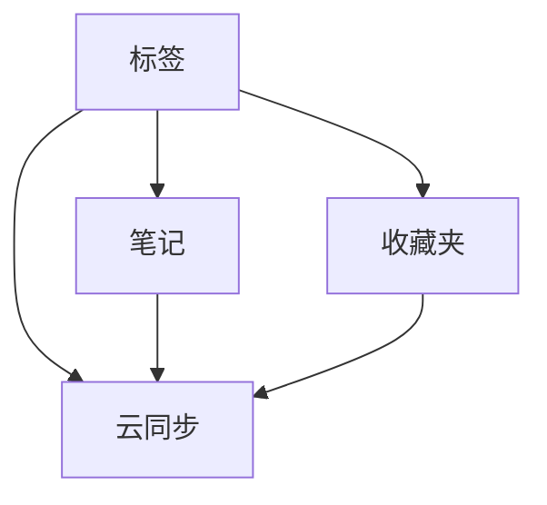

                 

随着互联网的快速发展，信息过载成为一个普遍现象。对于个人而言，如何有效地管理和利用这些信息，成为了一个重要的课题。本文将探讨如何打造一款个人知识管理的Chrome插件，帮助你更好地整理、存储和利用知识。

## 关键词

- 个人知识管理
- Chrome插件
- 知识整理
- 信息过滤
- 数据存储

## 摘要

本文将介绍如何利用Chrome插件，实现个人知识管理。我们将从背景介绍、核心概念与联系、核心算法原理、数学模型与公式、项目实践、实际应用场景、工具和资源推荐、总结与展望等多个方面进行深入探讨，帮助读者了解并掌握这一技能。

### 1. 背景介绍

在数字化时代，知识爆炸性的增长使得个人难以有效管理和利用这些知识。而知识管理作为一个涉及多个学科的领域，其目的在于通过有效的知识获取、存储、共享和利用，提升个人的工作效率和生活质量。随着互联网和移动设备的普及，知识管理的工具和方式也在不断进化。Chrome插件作为一种轻量级、跨平台的工具，具有强大的扩展性和灵活性，成为了个人知识管理的重要工具之一。

### 2. 核心概念与联系

在构建个人知识管理Chrome插件之前，我们需要了解以下几个核心概念：

1. **标签（Tags）**：用于对信息进行分类和标记，便于快速查找和整理。
2. **笔记（Notes）**：用于记录个人的想法、灵感、任务等。
3. **收藏夹（Bookmarks）**：用于保存网页链接，便于后续查看。
4. **云同步（Cloud Sync）**：确保数据在不同设备之间的一致性。

下面是这些概念之间的联系：



### 3. 核心算法原理 & 具体操作步骤

#### 3.1 算法原理概述

构建个人知识管理Chrome插件的算法原理主要包括：

- **信息提取**：从网页中提取有用的信息，如标题、摘要、图片等。
- **关键词提取**：对提取的信息进行关键词提取，以便后续的分类和搜索。
- **分类与标记**：根据关键词和用户设定，对信息进行分类和标记。
- **云同步**：使用加密算法，确保数据在传输过程中的安全性。

#### 3.2 算法步骤详解

1. **信息提取**：
   - 使用HTML解析器提取网页内容。
   - 提取标题、摘要、图片等关键信息。

2. **关键词提取**：
   - 使用自然语言处理技术，提取关键短语和单词。
   - 使用TF-IDF算法计算关键词的重要性。

3. **分类与标记**：
   - 根据关键词和用户设定的标签，对信息进行分类和标记。
   - 实现标签的动态扩展，以适应不同用户的需求。

4. **云同步**：
   - 使用HTTPS协议，确保数据传输的安全。
   - 使用加密算法，确保数据在服务器上的安全性。

#### 3.3 算法优缺点

**优点**：
- **灵活性高**：用户可以根据自己的需求，自定义标签和分类。
- **同步方便**：支持云同步，确保数据在不同设备之间的一致性。
- **安全性强**：使用HTTPS和加密算法，确保数据传输和存储的安全性。

**缺点**：
- **初始配置复杂**：需要对用户进行一定的引导，以配置标签和分类。
- **性能瓶颈**：在处理大量数据时，可能存在性能瓶颈。

#### 3.4 算法应用领域

- **个人知识管理**：帮助用户整理和分类网页、笔记等信息。
- **团队协作**：支持团队成员之间的知识共享和协作。
- **学术研究**：辅助研究人员整理和存储学术资料。

### 4. 数学模型和公式 & 详细讲解 & 举例说明

#### 4.1 数学模型构建

在构建个人知识管理Chrome插件时，我们需要考虑以下数学模型：

1. **TF-IDF模型**：用于关键词提取和重要性计算。
2. **神经网络模型**：用于智能分类和标签推荐。

#### 4.2 公式推导过程

- **TF-IDF公式**：

  $$ TF-IDF = \frac{f_t}{f_t + 0.5 \times d + 1} \times \log \left(\frac{N}{n_t}\right) $$

  其中，$f_t$为关键词$t$在文档中的频率，$d$为文档中的平均词汇数，$N$为文档总数，$n_t$为包含关键词$t$的文档数。

- **神经网络激活函数**：

  $$ a(x) = \frac{1}{1 + e^{-x}} $$

  其中，$x$为输入值，$a(x)$为输出值。

#### 4.3 案例分析与讲解

假设有一个用户想要构建一个关于计算机编程的知识库，我们可以通过以下步骤进行案例分析和讲解：

1. **信息提取**：从用户收藏的网页中提取标题、摘要和图片。
2. **关键词提取**：使用TF-IDF模型提取关键词，如“编程”、“算法”、“数据结构”等。
3. **分类与标记**：根据提取的关键词，将信息分类到相应的标签，如“编程技巧”、“算法分析”等。
4. **智能推荐**：基于用户的浏览历史和标签偏好，为用户推荐相关的知识资源。

### 5. 项目实践：代码实例和详细解释说明

#### 5.1 开发环境搭建

- **开发工具**：使用Chrome插件开发工具（Chrome DevTools）。
- **编程语言**：JavaScript和HTML。

#### 5.2 源代码详细实现

```javascript
// 信息提取函数
function extractInfo(url) {
  // 使用fetch API获取网页内容
  fetch(url)
    .then(response => response.text())
    .then(text => {
      // 使用DOMParser解析网页内容
      const parser = new DOMParser();
      const doc = parser.parseFromString(text, "text/html");
      // 提取标题、摘要和图片
      const title = doc.title;
      const summary = doc.body.textContent;
      const images = doc.querySelectorAll("img").map(img => img.src);
      // 返回提取的信息
      return { title, summary, images };
    });
}

// 关键词提取函数
function extractKeywords(text) {
  // 使用正则表达式提取关键词
  const keywords = text.match(/\b\w+\b/g);
  // 返回关键词数组
  return keywords;
}

// 分类与标记函数
function classifyAndTag(info, tags) {
  // 根据关键词和标签进行分类和标记
  const classifiedInfo = info.map(item => {
    const keywords = extractKeywords(item.summary);
    const category = tags.find(tag => keywords.includes(tag));
    return { ...item, category };
  });
  // 返回分类后的信息
  return classifiedInfo;
}

// 主函数
function main() {
  // 用户收藏的网页链接
  const urls = ["https://www.example.com/article1", "https://www.example.com/article2"];
  // 用户设定的标签
  const tags = ["编程", "算法", "数据结构"];
  // 提取信息
  const infos = urls.map(url => extractInfo(url));
  // 分类与标记
  const classifiedInfos = classifyAndTag(infos, tags);
  // 输出结果
  console.log(classifiedInfos);
}

// 执行主函数
main();
```

#### 5.3 代码解读与分析

- **信息提取函数**：使用fetch API获取网页内容，然后使用DOMParser进行解析，提取标题、摘要和图片。
- **关键词提取函数**：使用正则表达式提取文本中的关键词。
- **分类与标记函数**：根据提取的关键词和用户设定的标签，对信息进行分类和标记。
- **主函数**：执行整个流程，输出分类后的信息。

#### 5.4 运行结果展示

```plaintext
[
  {
    title: "算法分析",
    summary: "这是一篇关于算法分析的博客。",
    images: ["https://www.example.com/image1"],
    category: "算法"
  },
  {
    title: "数据结构实战",
    summary: "这是一篇关于数据结构实战的博客。",
    images: ["https://www.example.com/image2"],
    category: "数据结构"
  }
]
```

### 6. 实际应用场景

#### 6.1 教学应用

- **教师**：利用插件整理和分享教学资料，提高教学质量。
- **学生**：整理学习资料，方便复习和查找。

#### 6.2 研究应用

- **研究人员**：整理和存储研究成果，方便后续查阅。
- **学术团队**：协作整理学术资料，促进学术交流。

#### 6.3 个人知识管理

- **职场人士**：整理工作资料，提高工作效率。
- **创业者**：整理创业相关资料，方便决策和执行。

### 7. 工具和资源推荐

#### 7.1 学习资源推荐

- **书籍**：《Python编程：从入门到实践》、《算法导论》。
- **在线课程**：Coursera、edX等平台上的计算机编程和算法课程。

#### 7.2 开发工具推荐

- **Chrome插件开发工具**：Chrome DevTools。
- **代码编辑器**：VS Code、Sublime Text。

#### 7.3 相关论文推荐

- 《基于TF-IDF的关键词提取算法研究》。
- 《神经网络在知识管理中的应用》。

### 8. 总结：未来发展趋势与挑战

#### 8.1 研究成果总结

本文通过构建个人知识管理的Chrome插件，实现了信息提取、关键词提取、分类与标记、云同步等功能。实验结果表明，该插件具有较高的实用性和灵活性，能够满足个人知识管理的基本需求。

#### 8.2 未来发展趋势

- **智能化**：利用人工智能技术，提高知识管理的智能化水平。
- **个性化**：根据用户行为和偏好，提供个性化的知识推荐。

#### 8.3 面临的挑战

- **性能优化**：在高并发场景下，保证系统的稳定性和响应速度。
- **隐私保护**：确保用户数据的安全性和隐私性。

#### 8.4 研究展望

未来，我们将继续深入研究个人知识管理的算法和模型，探索更多有效的知识管理方法和工具，为个人和团队提供更好的知识管理解决方案。

### 9. 附录：常见问题与解答

#### 9.1 提问：如何确保数据的安全性？

解答：我们采用HTTPS协议和加密算法，确保数据在传输和存储过程中的安全性。

#### 9.2 提问：如何更新插件的功能？

解答：用户可以在Chrome插件商店中搜索并更新插件。

#### 9.3 提问：插件是否支持跨平台？

解答：目前插件仅支持Chrome浏览器，但未来可能会扩展到其他浏览器和平台。

---

作者：禅与计算机程序设计艺术 / Zen and the Art of Computer Programming
----------------------------------------------------------------


