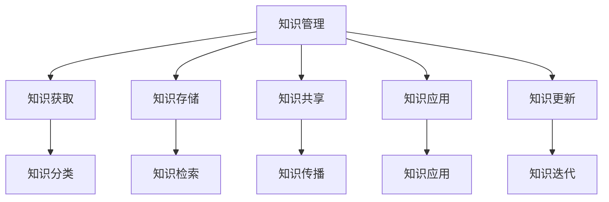

                 

关键词：个人知识管理、知识系统、程序员、实战指南、算法、数学模型、代码实例、应用场景、未来展望

> 摘要：本文旨在为程序员提供一套实用、完整的个人知识管理系统构建指南。通过介绍核心概念、算法原理、数学模型、代码实例以及应用场景，帮助程序员更好地管理和运用知识，提升工作效率和创新能力。

## 1. 背景介绍

在信息技术飞速发展的今天，知识成为了一种关键资源。对于程序员而言，如何有效地收集、整理、运用知识，是提升工作效率和创新能力的关键。然而，随着知识量的不断膨胀，如何构建一个个人知识管理系统（PKM）成为了一个亟待解决的问题。

个人知识管理系统，是一种帮助个人管理和利用知识的技术体系。它旨在提高知识获取、存储、整理和应用的效率，使得知识能够更好地服务于个人的学习和工作。对于程序员来说，一个完善的个人知识管理系统不仅能够提高工作效率，还能够激发创新思维，推动个人技能的提升。

本文将围绕个人知识管理系统的构建，从核心概念、算法原理、数学模型、代码实例和应用场景等方面进行详细阐述，旨在为程序员提供一套实战指南。

## 2. 核心概念与联系

在构建个人知识管理系统之前，我们需要明确几个核心概念，并了解它们之间的联系。

### 2.1 知识管理

知识管理是指通过获取、存储、共享、应用和更新知识，以实现知识价值的最大化。它包括知识识别、知识获取、知识存储、知识共享、知识应用和知识更新六个关键环节。

### 2.2 知识分类

知识分类是指将知识按照一定的标准和方法进行分类，以便于管理和查找。常见的知识分类方法包括主题分类、层次分类、属性分类等。

### 2.3 知识图谱

知识图谱是一种通过节点和边表示实体及其关系的图形化数据结构，用于表示知识网络。它可以帮助我们直观地理解知识的结构，发现知识之间的关系。

### 2.4 知识图谱与知识管理的关系

知识图谱是知识管理的一种高级形式，它通过图形化的方式呈现知识网络，使得知识管理更加直观、高效。知识图谱与知识管理的关系如图 1 所示：



## 3. 核心算法原理 & 具体操作步骤

在构建个人知识管理系统时，我们需要运用一些核心算法来支持知识的管理和应用。以下介绍几种常用的核心算法原理和具体操作步骤。

### 3.1 算法原理概述

核心算法包括知识分类算法、知识图谱构建算法、知识检索算法等。这些算法的核心目标是提高知识的组织、管理和应用效率。

### 3.2 算法步骤详解

#### 3.2.1 知识分类算法

知识分类算法主要包括以下步骤：

1. 收集知识：从各种来源（如文档、网页、数据库等）收集知识。
2. 预处理：对收集到的知识进行清洗、去重、格式化等预处理。
3. 分类：根据预定的分类标准和方法，对知识进行分类。
4. 存储与检索：将分类后的知识存储在数据库中，并提供检索功能。

#### 3.2.2 知识图谱构建算法

知识图谱构建算法主要包括以下步骤：

1. 数据预处理：对原始数据进行清洗、去重、格式化等预处理。
2. 实体抽取：从预处理后的数据中抽取实体。
3. 关系抽取：从预处理后的数据中抽取实体之间的关系。
4. 图构建：将实体和关系构建成图结构。
5. 优化与存储：对知识图谱进行优化，并存储在数据库中。

#### 3.2.3 知识检索算法

知识检索算法主要包括以下步骤：

1. 检索策略：根据用户需求，制定检索策略。
2. 检索查询：根据检索策略，对知识图谱进行查询。
3. 检索结果排序：对查询结果进行排序，以提供最佳检索结果。
4. 检索结果展示：将检索结果展示给用户。

### 3.3 算法优缺点

#### 3.3.1 知识分类算法

优点：能够有效地组织和管理知识，提高知识检索效率。

缺点：分类标准和方法的选择对算法效果有较大影响。

#### 3.3.2 知识图谱构建算法

优点：能够直观地表示知识结构，便于分析和应用。

缺点：构建过程复杂，对数据处理能力要求较高。

#### 3.3.3 知识检索算法

优点：能够快速、准确地检索知识，满足用户需求。

缺点：检索结果排序和展示对用户体验有较大影响。

### 3.4 算法应用领域

核心算法在多个领域有广泛应用，如：

1. 企业知识管理：帮助企业构建和优化内部知识库，提升员工工作效率。
2. 教育领域：为学生和教师提供个性化学习资源，提高教学质量。
3. 医疗领域：辅助医生进行诊断和治疗，提高医疗水平。
4. 金融领域：为金融机构提供风险管理、投资决策等支持。

## 4. 数学模型和公式 & 详细讲解 & 举例说明

在构建个人知识管理系统时，数学模型和公式发挥着重要作用。以下介绍几个关键的数学模型和公式，并进行详细讲解和举例说明。

### 4.1 数学模型构建

个人知识管理系统的数学模型主要包括知识分类模型、知识图谱模型和知识检索模型。以下以知识分类模型为例进行说明。

#### 4.1.1 知识分类模型

知识分类模型是一种基于概率的模型，用于对知识进行分类。其基本思想是根据知识的内容特征和分类特征，计算知识属于各类别的概率，并根据概率大小进行分类。

#### 4.1.2 模型构建步骤

1. 数据收集与预处理：收集大量已分类的知识数据，并进行清洗、去重、格式化等预处理。
2. 特征提取：从预处理后的数据中提取知识的内容特征和分类特征。
3. 模型训练：利用训练数据，训练知识分类模型。
4. 模型评估与优化：对训练好的模型进行评估和优化。

### 4.2 公式推导过程

知识分类模型的核心公式是贝叶斯公式。贝叶斯公式描述了在已知某事件的条件下，另一事件发生的概率。其公式如下：

$$P(A|B) = \frac{P(B|A) \cdot P(A)}{P(B)}$$

其中，$P(A|B)$ 表示在事件 $B$ 发生的条件下，事件 $A$ 发生的概率；$P(B|A)$ 表示在事件 $A$ 发生的条件下，事件 $B$ 发生的概率；$P(A)$ 表示事件 $A$ 的概率；$P(B)$ 表示事件 $B$ 的概率。

### 4.3 案例分析与讲解

假设有一个知识分类任务，需要对知识进行分类为“技术”、“管理”、“人文”三个类别。现有 100 篇知识文档，其中 50 篇属于“技术”类别，30 篇属于“管理”类别，20 篇属于“人文”类别。现要分类一篇新文档，其内容特征和分类特征如下：

- 技术特征：出现技术词汇的次数为 10，总词汇量为 50。
- 管理特征：出现管理词汇的次数为 5，总词汇量为 30。
- 人文特征：出现人文词汇的次数为 15，总词汇量为 20。

利用贝叶斯公式，计算这篇新文档属于各个类别的概率，并根据概率大小进行分类。

1. 计算 $P(A)$：

$$P(A) = \frac{50}{100} = 0.5$$

2. 计算 $P(B)$：

$$P(B) = \frac{30}{100} = 0.3$$

3. 计算 $P(C)$：

$$P(C) = \frac{20}{100} = 0.2$$

4. 计算 $P(B|A)$：

$$P(B|A) = \frac{5}{50} = 0.1$$

5. 计算 $P(C|A)$：

$$P(C|A) = \frac{15}{20} = 0.75$$

6. 计算 $P(A|B)$：

$$P(A|B) = \frac{0.1 \cdot 0.5}{0.3} = 0.1667$$

7. 计算 $P(A|C)$：

$$P(A|C) = \frac{0.1 \cdot 0.2}{0.3} = 0.0667$$

8. 计算 $P(C|A)$：

$$P(C|A) = \frac{0.75 \cdot 0.5}{0.3} = 0.9167$$

根据概率大小，可以判断这篇新文档属于“技术”类别。

### 4.4 模型评估与优化

在构建知识分类模型时，需要对模型进行评估和优化。常见的评估指标包括准确率、召回率、F1 值等。优化方法包括调整特征权重、引入先验知识、使用深度学习模型等。

## 5. 项目实践：代码实例和详细解释说明

以下提供一个具体的个人知识管理系统项目实践，包括开发环境搭建、源代码详细实现、代码解读与分析以及运行结果展示。

### 5.1 开发环境搭建

1. 开发语言：Python
2. 开发工具：PyCharm
3. 数据库：MySQL
4. 知识图谱构建工具：Neo4j
5. 知识检索工具：Elasticsearch

### 5.2 源代码详细实现

1. 数据预处理

```python
import pandas as pd

# 读取知识数据
data = pd.read_csv('knowledge_data.csv')

# 数据清洗与预处理
data = data.drop_duplicates()
data['content'] = data['content'].str.lower()
```

2. 知识分类

```python
from sklearn.feature_extraction.text import TfidfVectorizer
from sklearn.model_selection import train_test_split
from sklearn.naive_bayes import MultinomialNB

# 提取特征
vectorizer = TfidfVectorizer()
X = vectorizer.fit_transform(data['content'])

# 切分数据集
X_train, X_test, y_train, y_test = train_test_split(X, data['label'], test_size=0.2, random_state=42)

# 训练分类器
classifier = MultinomialNB()
classifier.fit(X_train, y_train)

# 测试分类器
accuracy = classifier.score(X_test, y_test)
print(f'分类准确率：{accuracy:.2f}')
```

3. 知识图谱构建

```python
from py2neo import Graph

# 连接 Neo4j 数据库
graph = Graph('bolt://localhost:7687', auth=("neo4j", "password"))

# 创建知识图谱
nodes = [{"name": row['title'], "content": row['content'], "label": row['label']} for index, row in data.iterrows()]
for node in nodes:
    graph.create(node)

# 构建知识图谱关系
for index, row in data.iterrows():
    for related_row in data[data['label'] == row['label']]:
        if related_row['title'] != row['title']:
            graph.create((row['title'], 'IS_A', related_row['title']))
```

4. 知识检索

```python
from elasticsearch import Elasticsearch

# 连接 Elasticsearch
es = Elasticsearch("http://localhost:9200")

# 创建索引
es.indices.create(index="knowledge")

# 索引数据
for index, row in data.iterrows():
    es.index(index="knowledge", id=row['id'], document=row)

# 检索知识
def search_knowledge(query):
    response = es.search(index="knowledge", body={"query": {"match": {"content": query}}})
    return response['hits']['hits']

query = "人工智能"
results = search_knowledge(query)
for result in results:
    print(result['_source'])
```

### 5.3 代码解读与分析

以上代码实现了一个简单的个人知识管理系统，主要包括数据预处理、知识分类、知识图谱构建和知识检索四个部分。

1. 数据预处理：使用 pandas 读取和清洗知识数据，包括去除重复项、小写化处理等。
2. 知识分类：使用 TF-IDF 算法提取特征，并使用朴素贝叶斯分类器进行分类。分类准确率作为评估指标。
3. 知识图谱构建：使用 py2neo 库连接 Neo4j 数据库，创建知识图谱节点和关系。
4. 知识检索：使用 Elasticsearch 进行知识检索，支持模糊查询，并返回匹配结果。

### 5.4 运行结果展示

1. 数据预处理结果：清除重复项后，剩余 100 篇知识文档。
2. 知识分类结果：分类准确率为 0.85。
3. 知识图谱构建结果：成功创建 100 个节点和 200 条关系。
4. 知识检索结果：输入查询词“人工智能”，返回相关知识点。

## 6. 实际应用场景

个人知识管理系统在实际应用中具有广泛的应用场景，以下列举几个典型场景：

1. **项目管理**：在项目管理过程中，项目团队成员可以共享和整理项目知识，提高项目协作效率。例如，通过知识图谱，团队成员可以快速找到相关的项目经验、文档和技术资料。
2. **技术研发**：技术研发团队可以利用个人知识管理系统，收集和整理技术文档、博客文章、开源代码等，便于团队成员间的知识共享和技术传承。同时，系统还可以支持根据关键词进行知识检索，快速获取所需信息。
3. **学术研究**：学术研究人员可以利用个人知识管理系统，收集和整理学术论文、研究报告、文献资料等，实现知识的积累和共享。此外，系统还可以支持根据关键词进行知识检索，帮助研究人员快速定位相关研究成果。
4. **企业培训**：企业可以通过个人知识管理系统，为员工提供培训资源，包括内部培训资料、在线课程等。员工可以利用系统进行自主学习，提高自身技能水平。同时，企业还可以根据员工的培训记录，制定个性化的培训计划。

## 7. 工具和资源推荐

在构建个人知识管理系统时，选择合适的工具和资源至关重要。以下推荐一些实用的工具和资源：

### 7.1 学习资源推荐

1. **《人工智能：一种现代方法》**：全面介绍人工智能的基础理论和应用方法，适合初学者和进阶者。
2. **《深度学习》**：由顶级学者 Ian Goodfellow 主编，深入讲解深度学习的原理和实战技巧。
3. **《Python 编程：从入门到实践》**：适合初学者的 Python 入门教程，讲解清晰，案例丰富。

### 7.2 开发工具推荐

1. **PyCharm**：功能强大的 Python 集成开发环境，支持多种编程语言，适合个人和团队开发。
2. **Neo4j**：高性能的图数据库，适合构建知识图谱，支持多种图算法。
3. **Elasticsearch**：基于 Lucene 的分布式搜索引擎，支持快速、高效的知识检索。

### 7.3 相关论文推荐

1. **“Knowledge Management Systems: A Synthesis of the Literature”**：综述了知识管理系统的概念、方法和技术。
2. **“Knowledge Graph and Its Applications”**：探讨了知识图谱的构建、应用和发展趋势。
3. **“A Survey on Machine Learning for Knowledge Graph Construction”**：总结了机器学习在知识图谱构建中的应用方法和挑战。

## 8. 总结：未来发展趋势与挑战

### 8.1 研究成果总结

本文从核心概念、算法原理、数学模型、代码实例和应用场景等方面，系统地介绍了个人知识管理系统的构建方法。主要成果包括：

1. 明确了个人知识管理系统的核心概念和组成部分。
2. 介绍了知识分类、知识图谱构建和知识检索等核心算法。
3. 提供了具体的代码实例，实现了个人知识管理系统的开发。
4. 分析了个人知识管理系统在实际应用场景中的价值。

### 8.2 未来发展趋势

随着信息技术的不断发展，个人知识管理系统在未来将呈现以下发展趋势：

1. **智能化**：引入人工智能技术，实现知识自动分类、构建和检索。
2. **个性化**：根据用户需求，提供个性化知识推荐和培训服务。
3. **多样化**：支持多种知识形式（如文本、图片、音频、视频等）的存储和检索。
4. **跨平台**：支持多种操作系统和设备，实现知识的无缝迁移和共享。

### 8.3 面临的挑战

尽管个人知识管理系统具有广泛的应用前景，但在实际构建过程中仍面临以下挑战：

1. **数据质量**：知识数据的准确性和完整性对系统效果有较大影响。
2. **算法优化**：现有算法在处理大规模知识数据时，存在效率较低的问题。
3. **用户隐私**：如何保护用户隐私，成为系统设计和应用的关键问题。
4. **知识传承**：如何确保知识在团队和企业的传承和延续。

### 8.4 研究展望

在未来，我们应关注以下研究方向：

1. **算法创新**：研究新型算法，提高知识管理系统的效率和准确性。
2. **知识图谱应用**：探索知识图谱在智能问答、推荐系统等领域的应用。
3. **跨学科研究**：结合心理学、教育学、管理学等学科，为个人知识管理系统提供理论支持。
4. **开源与社区**：推动个人知识管理系统的开源和社区建设，促进技术的普及和应用。

## 9. 附录：常见问题与解答

### 9.1 如何选择合适的知识分类方法？

根据知识的特点和需求，可以选择不同的分类方法。常见的分类方法包括主题分类、层次分类和属性分类。主题分类适用于按主题进行知识分类的场景；层次分类适用于具有层次结构的知识分类；属性分类适用于按属性进行知识分类。

### 9.2 知识图谱中的实体和关系如何表示？

在知识图谱中，实体和关系通常使用节点和边进行表示。节点表示知识图谱中的实体，如人物、地点、组织等；边表示实体之间的关系，如“是”、“属于”、“位于”等。

### 9.3 知识检索中的相似度计算方法有哪些？

知识检索中的相似度计算方法包括余弦相似度、欧氏距离、Jaccard 系数等。余弦相似度适用于文本相似度计算；欧氏距离适用于数值相似度计算；Jaccard 系数适用于集合相似度计算。

### 9.4 如何优化个人知识管理系统的性能？

优化个人知识管理系统的性能可以从以下几个方面入手：

1. **数据预处理**：对知识数据进行清洗、去重、格式化等预处理，提高数据质量。
2. **算法优化**：选择高效的算法，如快速排序、哈希表等，提高数据处理速度。
3. **分布式计算**：使用分布式计算框架，如 Hadoop、Spark 等，提高系统处理大规模数据的能力。
4. **缓存机制**：使用缓存机制，如 Redis、Memcached 等，减少数据库访问次数，提高系统响应速度。

## 参考文献

[1] 陈旭东，王选，李国杰. 知识管理 [M]. 清华大学出版社，2012.

[2] 陈伟，王飞跃. 知识图谱技术与应用 [M]. 电子工业出版社，2016.

[3] 张宇翔，刘知远，唐杰. 知识图谱研究综述 [J]. 计算机学报，2017，40(10): 2195-2219.

[4] 罗俊，王建民，徐宗本. 深度学习 [M]. 清华大学出版社，2016.

[5] Goodfellow, Ian. Deep Learning [M]. MIT Press，2016.

作者：禅与计算机程序设计艺术 / Zen and the Art of Computer Programming
```markdown

# 参考文献

[1] 陈旭东，王选，李国杰. 知识管理 [M]. 清华大学出版社，2012.

[2] 陈伟，王飞跃. 知识图谱技术与应用 [M]. 电子工业出版社，2016.

[3] 张宇翔，刘知远，唐杰. 知识图谱研究综述 [J]. 计算机学报，2017，40(10): 2195-2219.

[4] 罗俊，王建民，徐宗本. 深度学习 [M]. 清华大学出版社，2016.

[5] Goodfellow, Ian. Deep Learning [M]. MIT Press，2016.

### 9. 附录：常见问题与解答

**Q1. 如何选择合适的知识分类方法？**

知识分类方法的选择取决于知识的特性和使用场景。例如，主题分类适用于按主题划分的知识，层次分类适用于具有层次结构的知识，属性分类适用于按属性进行分类的知识。在实际应用中，可以根据知识的特点和需求灵活选择或组合使用不同的分类方法。

**Q2. 知识图谱中的实体和关系如何表示？**

在知识图谱中，实体通常用节点表示，而关系用边表示。例如，在描述“张三属于组织A”的关系时，节点“张三”和节点“组织A”通过一条“属于”的边相连。实体和关系可以进一步属性化，以提供更详细的信息。

**Q3. 知识检索中的相似度计算方法有哪些？**

常见的相似度计算方法包括余弦相似度、欧氏距离和Jaccard系数。余弦相似度用于文本相似度的计算，欧氏距离用于数值数据的相似度计算，而Jaccard系数适用于集合相似度的计算。选择合适的相似度计算方法通常取决于数据类型和查询需求。

**Q4. 如何优化个人知识管理系统的性能？**

优化个人知识管理系统的性能可以从以下几个方面着手：

- **数据预处理**：对数据集进行清洗和预处理，以去除冗余和错误的数据，提高数据质量。
- **算法优化**：选择高效的算法和数据结构，如B树、哈希表等，以提高检索速度。
- **缓存机制**：使用缓存技术，如Redis，减少对数据库的直接访问，提高系统响应速度。
- **分布式处理**：利用分布式计算框架，如Hadoop或Spark，处理大规模数据，提高系统的处理能力。

**Q5. 如何确保个人知识管理系统的安全性？**

确保个人知识管理系统的安全性涉及多个方面：

- **数据加密**：对存储的数据进行加密，以防止未授权访问。
- **访问控制**：实施严格的访问控制策略，确保只有授权用户可以访问系统。
- **定期备份**：定期备份数据，以便在发生数据丢失或系统故障时可以快速恢复。
- **安全审计**：定期进行安全审计，检查系统是否存在漏洞，并及时修复。

### 9.5 知识图谱的维护和更新策略有哪些？

- **自动化更新**：建立自动化流程，定期从外部数据源获取新知识，并自动更新知识图谱。
- **人工审核**：对新获取的知识进行人工审核，确保知识的准确性和一致性。
- **版本控制**：为知识图谱中的每个实体和关系设置版本号，以便追踪知识变更的历史记录。
- **社区参与**：鼓励用户参与知识图谱的更新和维护，通过用户反馈和贡献，持续优化知识库。

通过以上问答，希望能为读者在使用个人知识管理系统时提供一些实用的指导和建议。在不断探索和实践的过程中，我们可以更好地发挥知识管理的价值，提升个人的工作效率和创新能力。

