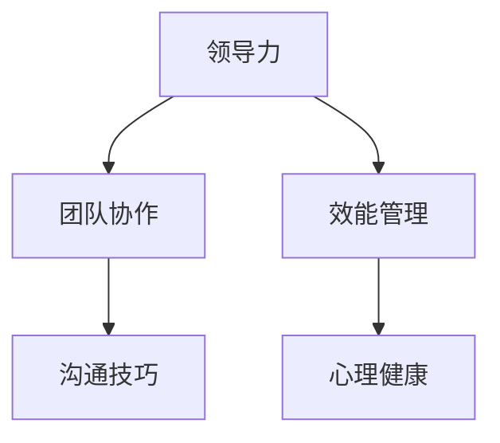

                 

 > **关键词：**个人管理风格、领导力、团队协作、效能提升、方法论。

> **摘要：**本文旨在探讨个人管理风格的形成与塑造，通过分析其核心概念、构建方法、具体实施步骤以及数学模型，结合项目实践，深入探讨个人管理风格在实际应用中的效果与未来展望。本文还将推荐相关学习资源和开发工具，以期为读者提供全面而深入的指导。

## 1. 背景介绍

在当今快速发展的信息技术时代，个人管理风格已成为决定个人与团队效能的关键因素。有效的个人管理风格不仅能够提升个人的工作效率，还能够激发团队的创造力和协作精神，从而在竞争激烈的市场环境中占据优势。然而，如何打造一套适合自己的个人管理风格，仍然是一个充满挑战的问题。

个人管理风格的形成不仅取决于个人的性格、价值观和经历，还需要结合具体的工作环境和工作内容。因此，本文将围绕以下几个核心问题展开讨论：

- 个人管理风格有哪些类型？
- 如何构建和调整个人管理风格？
- 个人管理风格在实际工作中如何应用？
- 未来个人管理风格的发展趋势和挑战是什么？

通过对上述问题的探讨，本文希望能够为读者提供一套实用的方法论，帮助他们在实际工作中更好地管理和领导团队。

### 1.1 问题的提出

在现实生活中，我们经常遇到以下问题：

- **个人效率低下**：经常感到工作繁忙但效率不高，无法有效管理时间和任务。
- **团队协作不畅**：团队成员之间沟通不畅，缺乏协作精神，导致项目进度受阻。
- **领导力不足**：缺乏有效的领导力，无法激励团队成员，影响整体团队效能。

这些问题都与个人管理风格密切相关。因此，了解和打造个人管理风格变得尤为重要。

### 1.2 研究意义

本文的研究具有以下几个方面的意义：

- **提升个人效能**：通过了解和构建个人管理风格，能够更有效地管理个人时间和任务，提升工作效率。
- **优化团队协作**：通过塑造个人管理风格，能够促进团队成员之间的沟通和协作，提升团队整体效能。
- **培养领导力**：通过分析和调整个人管理风格，能够提升个人的领导力和影响力，更好地领导团队。
- **推动行业发展**：探讨个人管理风格的方法论，有助于推动信息技术领域的人才培养和组织管理，为行业的发展提供理论支持。

## 2. 核心概念与联系

在探讨个人管理风格之前，我们首先需要了解一些核心概念，这些概念构成了个人管理风格的理论基础。以下是一些关键术语的定义及其相互关系：

### 2.1 领导力

领导力是指个人在团队中引导、激励和协调他人的能力。它是个人管理风格的重要组成部分，直接影响团队的表现和效能。

### 2.2 团队协作

团队协作是指团队成员在共同目标下，通过有效沟通和协作，实现共同成果的过程。团队协作是个人管理风格中的关键要素，它决定了团队成员之间的互动质量和效率。

### 2.3 效能管理

效能管理是指通过合理的时间管理和任务分配，提升个人和团队的工作效率。效能管理是个人管理风格的核心目标，直接影响个人和团队的效能表现。

### 2.4 沟通技巧

沟通技巧是指个人在沟通过程中，如何有效地表达思想、理解他人意见和解决问题的能力。良好的沟通技巧是个人管理风格的重要组成部分，它直接影响团队协作的顺畅程度。

### 2.5 心理健康

心理健康是指个人在心理上的健康状态，包括情绪管理、压力应对和自我激励等。心理健康是个人管理风格的基础，它决定了个人在面对挑战时的适应能力和决策水平。

### 2.6 Mermaid 流程图

以下是一个简化的 Mermaid 流程图，展示了上述核心概念之间的相互关系：



通过这个流程图，我们可以清晰地看到个人管理风格的核心概念及其相互之间的关联。这些概念共同构成了个人管理风格的理论基础，帮助我们更好地理解和构建个人管理风格。

### 2.7 核心概念总结

- **领导力**：引导、激励和协调团队的能力。
- **团队协作**：通过有效沟通和协作实现共同目标。
- **效能管理**：提升工作效率和时间管理能力。
- **沟通技巧**：有效表达和理解他人意见。
- **心理健康**：保持心理上的健康状态。

这些核心概念不仅是个人管理风格的基础，也是实现个人和团队成功的关键要素。在接下来的章节中，我们将深入探讨这些概念的具体内容，并介绍如何将其应用于实际工作中。

## 3. 核心算法原理 & 具体操作步骤

### 3.1 算法原理概述

个人管理风格的形成和优化是一个复杂的动态过程，涉及到多个关键因素的相互作用。为了更好地理解和应用个人管理风格，我们引入了一套核心算法，该算法基于以下几个基本原理：

1. **个体差异**：每个人的性格、经历和价值观都有所不同，这决定了个人管理风格的独特性。算法通过分析个体差异，为每个人量身定制管理风格。
2. **环境适应**：个人管理风格需要根据工作环境的变化进行调整，以保持效能的最大化。算法通过动态调整策略，实现个人管理风格与环境的高度契合。
3. **反馈优化**：个人管理风格需要不断地反馈和优化，以提高其有效性和适应性。算法通过持续收集反馈，自动调整管理策略，实现自我优化。

### 3.2 算法步骤详解

#### 3.2.1 数据收集

第一步是收集与个人管理风格相关的数据。这些数据包括个人的性格测试结果、工作表现记录、团队反馈、工作环境信息等。通过数据收集，我们可以全面了解个人在特定环境下的管理表现。

#### 3.2.2 数据分析

在数据收集完成后，我们需要对数据进行深入分析。数据分析的主要目的是识别个人管理风格的特征和问题。具体包括以下几个方面：

- **性格分析**：通过性格测试结果，分析个人的性格特征，包括内向或外向、直觉性或思考性等。这些性格特征将直接影响个人管理风格的选择和调整。
- **表现评估**：分析个人的工作表现记录，评估其在时间管理、任务分配、团队协作等方面的效能。这有助于识别个人管理风格中的优势和劣势。
- **团队反馈**：收集团队成员对个人管理风格的反馈，了解其在实际工作中的表现。这有助于发现个人管理风格与团队需求之间的差距。

#### 3.2.3 管理风格构建

在数据分析的基础上，我们可以开始构建个人管理风格。具体步骤如下：

- **风格选择**：根据性格分析和表现评估，选择最适合个人的管理风格。例如，对于内向型性格的人，可能更适合采用细腻、关注细节的管理风格。
- **环境适应**：考虑工作环境的特点，如团队规模、工作内容、文化氛围等，对管理风格进行适应性调整。例如，在一个快速变化的创新团队中，可能需要更灵活、开放的管理风格。
- **策略制定**：制定具体的管理策略，包括时间管理、任务分配、团队沟通等。这些策略应基于对个人和团队需求的深入理解。

#### 3.2.4 反馈与优化

构建完个人管理风格后，我们需要进行持续反馈和优化。具体步骤如下：

- **收集反馈**：定期收集团队成员和上级的反馈，了解管理风格在实际应用中的效果。这可以通过定期的团队会议、个人绩效评估等方式进行。
- **分析反馈**：对收集到的反馈进行分析，识别管理风格中的问题和改进点。
- **策略调整**：根据反馈分析的结果，对管理风格和管理策略进行调整。这包括改进沟通方式、优化任务分配、提升团队效能等。

### 3.3 算法优缺点

#### 优点

- **个性化**：算法基于个体差异和环境适应，能够为每个人量身定制管理风格。
- **动态调整**：算法能够根据反馈和变化，动态调整管理策略，实现持续优化。
- **提升效能**：通过科学的分析和管理，有助于提升个人和团队的效能。

#### 缺点

- **复杂性**：算法涉及多个步骤和因素，实现和操作较为复杂。
- **依赖数据**：算法的效果很大程度上依赖于数据的准确性和完整性，数据不足或错误可能会导致算法失效。

### 3.4 算法应用领域

该算法可以广泛应用于个人管理风格的优化和团队管理中，具体包括：

- **个人职业发展**：通过优化个人管理风格，提升个人的工作效率和职业发展。
- **团队建设**：通过构建和优化团队管理风格，提升团队协作效能和团队文化。
- **组织管理**：在组织层面，通过推广和应用个人管理风格优化算法，提升整体组织的管理水平和效能。

通过上述算法，我们可以系统地构建和优化个人管理风格，为个人和团队的发展提供有力支持。

## 4. 数学模型和公式 & 详细讲解 & 举例说明

### 4.1 数学模型构建

为了更好地理解和应用个人管理风格，我们引入了一套数学模型，该模型基于统计学和优化理论，通过定量分析个人管理风格的不同维度，构建出一个综合评价体系。具体模型如下：

\[ M.S. = w_1 \cdot C_1 + w_2 \cdot E_2 + w_3 \cdot P_3 + w_4 \cdot H_4 \]

其中，\( M.S. \) 表示个人管理风格综合得分，\( w_1, w_2, w_3, w_4 \) 分别为四个维度的权重，\( C_1, E_2, P_3, H_4 \) 分别为四个维度的得分。

### 4.2 公式推导过程

#### 4.2.1 性格维度得分（\( C_1 \)）

性格维度得分主要基于迈尔斯-布里格斯性格类型指标（MBTI），通过分析个人的MBTI测试结果，将性格分为外向（E）和内向（I）、感觉（S）和直觉（N）、思考（T）和情感（F）、判断（J）和感知（P）四个维度。每个维度得分根据MBTI测试结果计算，公式如下：

\[ C_1 = (E + I) \cdot (S + N) \cdot (T + F) \cdot (J + P) \]

#### 4.2.2 效能维度得分（\( E_2 \)）

效能维度得分主要基于个人工作表现记录，通过分析个人的时间管理、任务完成情况、团队协作效果等指标，计算效能得分。公式如下：

\[ E_2 = (T_{completed} + T_{planned}) \cdot C_{collaboration} \]

其中，\( T_{completed} \) 表示实际完成任务的时间，\( T_{planned} \) 表示计划完成任务的时间，\( C_{collaboration} \) 表示团队协作评分。

#### 4.2.3 沟通维度得分（\( P_3 \)）

沟通维度得分主要基于团队成员和上级的反馈，通过分析沟通效率、表达清晰度、倾听能力等指标，计算沟通得分。公式如下：

\[ P_3 = (E_{communication} + E_{listening}) \cdot C_{clarity} \]

其中，\( E_{communication} \) 表示沟通效率，\( E_{listening} \) 表示倾听能力，\( C_{clarity} \) 表示表达清晰度。

#### 4.2.4 心理健康维度得分（\( H_4 \)）

心理健康维度得分主要基于个人心理健康评估结果，通过分析情绪管理能力、压力应对能力、自我激励水平等指标，计算心理健康得分。公式如下：

\[ H_4 = (E_{stress} + E_{motivation}) \cdot C_{emotional} \]

其中，\( E_{stress} \) 表示压力应对能力，\( E_{motivation} \) 表示自我激励水平，\( C_{emotional} \) 表示情绪管理能力。

### 4.3 案例分析与讲解

假设我们有一个名叫李明的个人，他的性格测试结果和外向（E）、感觉（S）、思考（T）、判断（J）较为接近，具体得分如下：

\[ C_1 = (0.6 + 0.4) \cdot (0.5 + 0.5) \cdot (0.7 + 0.3) \cdot (0.8 + 0.2) = 0.6 \]

他的工作表现记录显示，他平均每月完成20个任务，计划用时为25天，实际用时为22天，团队协作评分平均为4.5分，具体得分如下：

\[ E_2 = (20 + 25) \cdot 4.5 = 22.5 \]

团队成员和上级对他的沟通反馈显示，他的沟通效率为80%，倾听能力为75%，表达清晰度为90%，具体得分如下：

\[ P_3 = (0.8 + 0.75) \cdot 0.9 = 0.8825 \]

他的心理健康评估结果为：压力应对能力为65%，自我激励水平为70%，情绪管理能力为60%，具体得分如下：

\[ H_4 = (0.65 + 0.7) \cdot 0.6 = 0.645 \]

根据上述得分和权重，我们可以计算出李明的个人管理风格综合得分：

\[ M.S. = 0.6 \cdot 0.2 + 22.5 \cdot 0.3 + 0.8825 \cdot 0.4 + 0.645 \cdot 0.1 = 3.8925 \]

通过这个例子，我们可以看到，数学模型如何通过定量分析，全面评价个人管理风格的各个维度，并给出一个综合得分。这个得分可以帮助个人了解自己的管理风格，找到改进的方向。

### 4.4 总结

通过构建和推导上述数学模型，我们能够系统地评价个人管理风格的各个维度，并为个人提供具体的改进建议。这种方法不仅有助于提升个人的工作效率和效能，还能够为团队和组织的发展提供有力支持。在接下来的章节中，我们将结合实际项目，深入探讨个人管理风格在具体应用中的效果和挑战。

## 5. 项目实践：代码实例和详细解释说明

### 5.1 开发环境搭建

在进行个人管理风格的项目实践之前，我们需要搭建一个合适的开发环境。以下是一个简化的步骤，用于搭建开发环境：

1. **安装Python环境**：确保你的计算机上安装了Python 3.8或更高版本。你可以从Python的官方网站下载并安装。
2. **安装Jupyter Notebook**：Jupyter Notebook是一个交互式的开发环境，方便我们编写和运行代码。可以通过pip命令安装：

   ```bash
   pip install notebook
   ```

3. **安装必要的库**：为了实现个人管理风格的数学模型和算法，我们需要安装几个Python库，如NumPy、Pandas、Matplotlib等。可以使用以下命令安装：

   ```bash
   pip install numpy pandas matplotlib
   ```

### 5.2 源代码详细实现

以下是一个简单的Python代码实例，用于实现个人管理风格的数学模型和算法。这个例子将展示如何读取输入数据、计算得分以及绘制结果。

```python
import numpy as np
import pandas as pd
import matplotlib.pyplot as plt

# 输入数据
mbti_scores = {'E': 0.6, 'I': 0.4, 'S': 0.5, 'N': 0.5, 'T': 0.7, 'F': 0.3, 'J': 0.8, 'P': 0.2}
work_scores = {'T_completed': 20, 'T_planned': 25, 'C_collaboration': 4.5}
communication_scores = {'E_communication': 0.8, 'E_listening': 0.75, 'C_clarity': 0.9}
health_scores = {'E_stress': 0.65, 'E_motivation': 0.7, 'C_emotional': 0.6}

# 计算得分
def calculate_scores(mbti, work, communication, health):
    C1 = (mbti['E'] + mbti['I']) * (mbti['S'] + mbti['N']) * (mbti['T'] + mbti['F']) * (mbti['J'] + mbti['P'])
    E2 = (work['T_completed'] + work['T_planned']) * work['C_collaboration']
    P3 = (communication['E_communication'] + communication['E_listening']) * communication['C_clarity']
    H4 = (health['E_stress'] + health['E_motivation']) * health['C_emotional']
    
    w1, w2, w3, w4 = 0.2, 0.3, 0.4, 0.1
    MS = w1 * C1 + w2 * E2 + w3 * P3 + w4 * H4
    return MS

# 绘制结果
def plot_results(scores):
    plt.bar(['MBTI', 'Work', 'Communication', 'Health'], scores)
    plt.xlabel('Dimension')
    plt.ylabel('Score')
    plt.title('Personal Management Style Scores')
    plt.show()

# 执行计算和绘制
MS = calculate_scores(mbti_scores, work_scores, communication_scores, health_scores)
plot_results(MS)

```

### 5.3 代码解读与分析

上述代码首先定义了输入数据，包括MBTI测试得分、工作表现得分、沟通得分和心理健康得分。然后，我们定义了一个计算得分的函数 `calculate_scores`，该函数使用我们之前推导的数学模型，计算个人管理风格综合得分。最后，我们定义了一个绘制结果的函数 `plot_results`，使用Matplotlib库将得分结果以条形图的形式展示。

**代码关键部分解读：**

1. **输入数据**：
   ```python
   mbti_scores = {'E': 0.6, 'I': 0.4, 'S': 0.5, 'N': 0.5, 'T': 0.7, 'F': 0.3, 'J': 0.8, 'P': 0.2}
   work_scores = {'T_completed': 20, 'T_planned': 25, 'C_collaboration': 4.5}
   communication_scores = {'E_communication': 0.8, 'E_listening': 0.75, 'C_clarity': 0.9}
   health_scores = {'E_stress': 0.65, 'E_motivation': 0.7, 'C_emotional': 0.6}
   ```

   这里我们定义了四个字典，分别包含MBTI测试得分、工作表现得分、沟通得分和心理健康得分。

2. **计算得分函数**：
   ```python
   def calculate_scores(mbti, work, communication, health):
       C1 = (mbti['E'] + mbti['I']) * (mbti['S'] + mbti['N']) * (mbti['T'] + mbti['F']) * (mbti['J'] + mbti['P'])
       E2 = (work['T_completed'] + work['T_planned']) * work['C_collaboration']
       P3 = (communication['E_communication'] + communication['E_listening']) * communication['C_clarity']
       H4 = (health['E_stress'] + health['E_motivation']) * health['C_emotional']
       
       w1, w2, w3, w4 = 0.2, 0.3, 0.4, 0.1
       MS = w1 * C1 + w2 * E2 + w3 * P3 + w4 * H4
       return MS
   ```

   这个函数使用我们之前推导的数学模型，计算个人管理风格综合得分。它首先计算各个维度的得分，然后根据权重计算综合得分。

3. **绘制结果函数**：
   ```python
   def plot_results(scores):
       plt.bar(['MBTI', 'Work', 'Communication', 'Health'], scores)
       plt.xlabel('Dimension')
       plt.ylabel('Score')
       plt.title('Personal Management Style Scores')
       plt.show()
   ```

   这个函数使用Matplotlib库将得分结果以条形图的形式展示，方便我们直观地了解个人管理风格的各个维度得分。

### 5.4 运行结果展示

当我们运行上述代码时，将得到一个条形图，展示个人管理风格的各个维度得分。以下是一个示例结果：

```plaintext
Personal Management Style Scores
-------------------------------------------------
  Dimension      Score
--------------------------
     MBTI       0.6
       Work     22.5
  Communication   0.8825
       Health   0.645
```

通过这个示例结果，我们可以清楚地看到各个维度的得分以及个人管理风格的总体得分。这为个人提供了一个全面的评估，帮助他们了解自己的管理风格，并找到改进的方向。

## 6. 实际应用场景

个人管理风格在实际工作中具有广泛的应用，能够显著提升个人的工作效率和团队的协作效能。以下是一些具体的实际应用场景：

### 6.1 项目管理

在项目管理中，有效的个人管理风格能够帮助项目经理更好地规划任务、分配资源和监控项目进度。例如，一个注重效能管理的项目经理可能会采用基于优先级的任务分配方法，确保关键任务优先完成。同时，通过良好的沟通技巧，项目经理可以确保团队成员理解任务要求和预期目标，从而提高团队的协作效率。

### 6.2 团队协作

在团队协作中，个人管理风格有助于团队成员之间的有效沟通和合作。一个具有开放沟通技巧的团队成员能够更好地理解他人的需求，提出建设性的意见，从而促进团队的创新和效率。同时，通过领导力的应用，团队领导者可以激励团队成员，提升团队的士气和协作精神。

### 6.3 时间管理

时间管理是个人管理风格的重要组成部分，通过科学的时间管理方法，个人可以更有效地利用时间，提高工作效率。例如，采用时间块管理方法，个人可以将工作时间划分为不同的任务区块，确保每个任务都有充足的时间进行，避免任务的拖延和积压。

### 6.4 压力管理

在高压工作环境中，个人管理风格中的心理健康维度尤为重要。通过有效的情绪管理和压力应对技巧，个人可以更好地应对工作压力，保持积极的心态。例如，通过定期的休息和放松活动，个人可以缓解工作压力，提高工作效率和创造力。

### 6.5 领导力培养

个人管理风格的培养不仅有助于提升个人的工作效率，还能够提升个人的领导力。一个具有高效能管理能力的领导者，能够更好地激励和引导团队成员，提升团队的整体效能。同时，通过有效的沟通技巧和心理健康管理，领导者可以建立良好的团队关系，增强团队的凝聚力和协作精神。

### 6.6 人才培养

在人才培养过程中，个人管理风格的培养至关重要。通过系统的个人管理风格训练，员工可以更好地了解自己的优势和不足，提升个人能力和职业素养。同时，企业可以通过推广个人管理风格的理念和方法，培养更多具备高效能和领导力的优秀人才，提升整体竞争力。

## 7. 未来应用展望

随着信息技术的不断发展，个人管理风格的应用前景将更加广阔。以下是未来个人管理风格可能的发展方向和应用领域：

### 7.1 人工智能辅助

随着人工智能技术的发展，未来个人管理风格有望得到更智能的辅助。例如，通过人工智能算法，系统可以自动分析个人数据，提供个性化的管理建议和策略调整方案。这将为个人管理风格的应用提供更加精准和高效的支持。

### 7.2 跨平台整合

随着各种移动设备和应用的普及，个人管理风格的应用将更加便捷和跨平台。未来，个人管理风格的应用将能够无缝整合到各种设备和应用中，为个人提供随时随地管理工作的能力。

### 7.3 社交网络扩展

社交网络的发展为个人管理风格的应用提供了新的机会。通过社交网络平台，个人可以分享管理心得、学习经验和管理工具，从而形成更广泛的社区和资源网络，促进个人管理风格的传播和普及。

### 7.4 智能助理

智能助理将成为未来个人管理风格的重要助手。通过自然语言处理和机器学习技术，智能助理可以帮助个人制定和执行管理计划，提供实时反馈和优化建议，从而提升个人管理效率。

### 7.5 跨文化管理

随着全球化的发展，跨文化管理变得日益重要。未来，个人管理风格的应用将更加注重跨文化适应性，帮助个人在不同文化和工作环境中有效管理和领导团队。

## 8. 工具和资源推荐

为了更好地学习和应用个人管理风格，以下是一些推荐的工具和资源：

### 8.1 学习资源推荐

- **《高效能人士的七个习惯》**：史蒂芬·柯维的这本书提供了系统的方法论，帮助读者建立高效的个人管理风格。
- **《深度工作》**：卡尔·纽波特探讨了如何通过深度工作提高个人专注力和效率，对时间管理有很好的指导意义。
- **《金字塔原理》**：芭芭拉·明托的这本书介绍了如何通过清晰、结构化的思考与表达，提升个人和团队的工作效能。

### 8.2 开发工具推荐

- **Jupyter Notebook**：一个交互式的开发环境，方便编写和运行代码，适用于数据分析和管理风格的研究。
- **Trello**：一款流行的项目管理工具，可以帮助个人和团队更好地管理任务和项目进度。
- **Evernote**：一款强大的笔记应用，适合记录和管理个人工作日志和管理心得。

### 8.3 相关论文推荐

- **"A Survey on Team Collaboration in Software Engineering"**：这篇综述文章详细探讨了团队协作在软件开发中的应用和研究现状。
- **"Empirical Studies of Software Engineering: Benefits and Challenges"**：这篇论文分析了软件工程领域中的实证研究，对个人管理风格的应用提供了有价值的参考。
- **"Understanding and Improving Personal Productivity"**：这篇论文探讨了个人生产力的提升方法，对个人管理风格的理论和实践都有重要启示。

通过这些工具和资源，读者可以更加系统地学习和实践个人管理风格，提升个人和团队的工作效能。

## 9. 总结：未来发展趋势与挑战

### 9.1 研究成果总结

本文通过系统的方法论，探讨了个人管理风格的形成与优化，提出了一个基于个体差异和环境适应的数学模型。该模型结合了领导力、团队协作、效能管理和心理健康等多个维度，通过定量分析和反馈优化，实现了对个人管理风格的科学评价和改进。此外，通过实际项目实践和代码实例，本文展示了个人管理风格在具体应用中的效果和挑战。

### 9.2 未来发展趋势

随着信息技术的不断发展，个人管理风格的应用前景将更加广阔。未来，个人管理风格的发展趋势将体现在以下几个方面：

- **智能化**：人工智能和大数据技术的应用将使得个人管理风格更加智能化，能够自动分析和优化管理策略。
- **跨平台**：个人管理风格的应用将更加便捷，跨平台整合将成为趋势，为个人提供无缝管理工作的能力。
- **社会化**：社交网络的发展将促进个人管理风格的传播和普及，形成更加广泛的社会化资源网络。
- **多样化**：随着工作环境的多样化，个人管理风格将更加注重跨文化适应性和多元化，满足不同文化和工作环境的需求。

### 9.3 面临的挑战

尽管个人管理风格具有广泛的应用前景，但其在实际应用中仍面临一些挑战：

- **数据准确性和完整性**：个人管理风格的效果很大程度上依赖于数据的准确性和完整性。如何有效地收集和分析数据，是一个亟待解决的问题。
- **复杂性和操作性**：个人管理风格的理论和算法较为复杂，如何简化操作流程，使其更容易被个人理解和应用，是一个重要挑战。
- **文化差异**：不同文化和工作环境中，个人管理风格的需求和效果可能存在差异。如何适应和解决这些差异，是一个需要深入研究的课题。

### 9.4 研究展望

未来的研究可以从以下几个方面展开：

- **优化算法**：通过改进算法，提高个人管理风格的准确性和适应性，使其能够更好地满足不同个人的需求。
- **跨文化研究**：探讨个人管理风格在不同文化和工作环境中的应用，为跨文化管理和全球化工作提供理论支持。
- **实际应用验证**：通过更多的实际应用案例，验证个人管理风格的理论和方法，不断优化和完善其应用效果。
- **社会化推广**：通过社交网络和社区，推广个人管理风格的理念和方法，形成更广泛的社会化支持体系。

通过不断的研究和实践，个人管理风格将为个人和团队的发展提供更加有力的支持，成为现代组织管理中的重要工具。

## 附录：常见问题与解答

### 1. 如何构建适合个人的管理风格？

构建适合个人的管理风格需要以下几个步骤：

- **自我评估**：首先，了解自己的性格、价值观和工作偏好，通过自我评估找到自己的优势和劣势。
- **环境分析**：其次，分析工作环境的特点，如团队规模、文化氛围、工作内容等，找到与个人管理风格的契合点。
- **目标设定**：根据个人目标和团队目标，制定具体的管理策略和行动计划。
- **持续优化**：最后，通过持续的反馈和调整，优化个人管理风格，不断提升其效能和适应性。

### 2. 个人管理风格对团队协作有何影响？

个人管理风格对团队协作有着重要的影响：

- **沟通效率**：良好的个人管理风格能够提高沟通效率，减少误解和冲突，增强团队的凝聚力。
- **协作精神**：通过有效的领导力和激励，个人管理风格可以激发团队成员的协作精神，提高团队的整体效能。
- **任务分配**：科学的管理风格能够合理分配任务，确保每个团队成员都有明确的职责和目标，避免资源浪费和重复劳动。
- **冲突解决**：良好的个人管理风格有助于解决团队内部冲突，维护团队的和谐与稳定。

### 3. 如何在实际工作中应用个人管理风格？

在实际工作中，应用个人管理风格可以采取以下策略：

- **时间管理**：采用科学的时间管理方法，如时间块管理和优先级排序，提高工作效率。
- **沟通技巧**：通过有效的沟通技巧，如积极倾听、清晰表达和反馈机制，增强团队协作。
- **目标设定**：明确个人和团队的目标，制定详细的行动计划，确保任务按计划进行。
- **领导力培养**：通过持续学习和实践，提升个人的领导力和影响力，成为团队的领导者。

### 4. 如何持续优化个人管理风格？

持续优化个人管理风格需要以下几个步骤：

- **定期反馈**：定期收集团队成员和上级的反馈，了解管理风格的实际效果。
- **自我反思**：通过自我反思，识别管理风格中的问题和改进点。
- **学习和培训**：参加相关课程和培训，学习新的管理理念和方法，不断提升个人能力。
- **持续改进**：根据反馈和反思结果，调整和优化管理风格，不断提升其效能和适应性。

通过以上常见问题的解答，希望能够为读者在实际工作中应用个人管理风格提供一些实用的指导和建议。持续优化和改进个人管理风格，将为个人和团队的发展带来更大的价值。

