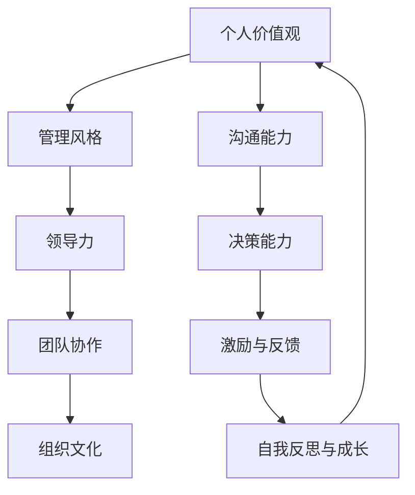

                 

关键词：个人管理风格、管理方法论、领导力、效率提升、技术管理、团队协作

> 摘要：本文旨在探讨如何通过一系列科学的方法和工具，打造个人管理风格。我们将从背景介绍、核心概念、核心算法原理、数学模型和公式、项目实践、实际应用场景、工具和资源推荐以及未来发展趋势与挑战等多个方面，为读者提供全面的指导和思考。

## 1. 背景介绍

在当今快速变化和竞争激烈的商业环境中，个人管理风格的重要性日益凸显。一位优秀的管理者不仅能够带领团队高效完成任务，还能在逆境中激发团队的潜力，实现自我与团队的共同成长。然而，个人管理风格的塑造并非一蹴而就，它需要基于深厚的理论基础、丰富的实践经验以及不断的自我反思和改进。

本文旨在通过深入探讨打造个人管理风格的方法论，帮助读者理解并实践这一过程。我们将从多个维度分析个人管理风格的构成要素，并提出具体的方法和策略，以便读者能够根据自己的实际情况进行有效调整和优化。

### 1.1 个人管理风格的意义

个人管理风格不仅是管理者个人特质和能力的体现，更是团队协作效率和组织文化的重要载体。一个清晰、稳定的管理风格可以帮助团队成员明确期望，提高工作效率，增强团队凝聚力。同时，良好的管理风格还能够为组织创造积极的工作氛围，提升整体竞争力。

### 1.2 个人管理风格的特点

个人管理风格具有以下几个特点：

- **独特性**：每位管理者的风格都受到其个人经历、价值观和个性特征的影响，因此具有独特性。
- **适应性**：有效的管理风格需要根据不同的团队和环境进行灵活调整。
- **可持续性**：良好的管理风格不仅能够在短期内提高效率，还能够为组织的长期发展奠定基础。
- **可塑性**：个人管理风格可以通过学习和实践不断完善和优化。

## 2. 核心概念与联系

在探讨个人管理风格之前，我们需要明确几个核心概念，并理解它们之间的联系。以下是一个简化的Mermaid流程图，用于展示这些概念之间的关系：



### 2.1 个人价值观

个人价值观是管理风格的基础，它决定了管理者的行为方式和决策准则。一个明确且符合自身价值观的管理风格，能够更好地指导行为，赢得团队成员的信任和尊重。

### 2.2 领导力

领导力是管理风格的核心组成部分，它包括愿景设定、团队激励、问题解决等多方面能力。一个优秀的领导者不仅能够带领团队实现目标，还能够为团队成员提供成长和发展的机会。

### 2.3 团队协作

团队协作能力是管理风格的重要体现，它涉及到如何有效地组织、协调和激励团队成员，实现团队目标。高效的团队协作不仅能够提高工作效率，还能够增强团队的凝聚力。

### 2.4 组织文化

组织文化是个人管理风格和组织行为之间的桥梁，它对管理风格的形成和发展具有重要影响。一个积极、健康、包容的组织文化能够为管理者提供良好的工作环境，促进个人管理风格的优化。

### 2.5 沟通能力

沟通能力是管理风格的关键要素之一，它决定了管理者能否有效地传递信息、理解团队需求和反馈。良好的沟通能力能够减少误解和冲突，提高团队协作效率。

### 2.6 决策能力

决策能力是管理者的重要素质，它涉及到如何快速、准确地做出决策，并在决策过程中考虑风险和潜在影响。高效的决策能力能够帮助管理者应对复杂多变的业务环境。

### 2.7 激励与反馈

激励与反馈能力是管理风格的重要组成部分，它决定了如何通过正面的激励和及时的反馈，激发团队成员的潜力和积极性。良好的激励与反馈机制能够提高团队整体绩效。

### 2.8 自我反思与成长

自我反思与成长能力是管理者不断优化自身管理风格的关键。通过反思自身的优点和不足，管理者能够更好地调整自己的行为和策略，实现个人和团队的双重成长。

## 3. 核心算法原理 & 具体操作步骤

在理解了个人管理风格的核心概念和联系后，我们需要深入了解其背后的算法原理和具体操作步骤。以下是一个简要的概述：

### 3.1 算法原理概述

个人管理风格的打造可以看作是一个复杂的多变量优化问题，其目标是在满足个人价值观和组织文化要求的前提下，最大化团队效率和成员满意度。这个优化过程涉及到以下几个方面：

- **自我认知与定位**：通过自我反思和评估，明确自身的优势和劣势，找到适合自己的管理风格。
- **目标设定与规划**：根据团队和组织的目标，制定具体的行动计划，明确短期和长期的目标。
- **能力提升与学习**：通过持续学习和实践，提高自身的管理能力，不断完善管理风格。
- **团队沟通与协作**：建立有效的沟通机制，促进团队成员之间的协作，提高团队整体绩效。

### 3.2 算法步骤详解

#### 3.2.1 自我认知与定位

1. **自我反思**：通过自我提问、日记记录等方式，反思自身的价值观、行为模式和管理风格。
2. **能力评估**：通过360度反馈、心理测评等方式，评估自身的优势和劣势。
3. **定位分析**：结合自我反思和能力评估的结果，确定适合自己的管理风格类型。

#### 3.2.2 目标设定与规划

1. **目标设定**：根据团队和组织的目标，明确个人管理风格的目标，并分解为具体的行动步骤。
2. **时间规划**：为每个行动步骤设定时间节点，确保目标的按时完成。
3. **资源调配**：根据目标需求，合理调配时间、人力和资源，确保行动的有效实施。

#### 3.2.3 能力提升与学习

1. **学习计划**：制定个人学习计划，包括阅读书籍、参加培训、观看讲座等。
2. **实践应用**：将所学知识应用于实际工作中，不断总结和反思，提升管理能力。
3. **持续改进**：根据实践效果和反馈，不断调整和优化学习计划。

#### 3.2.4 团队沟通与协作

1. **建立沟通机制**：制定明确的沟通计划和流程，确保信息传递的及时性和准确性。
2. **团队协作**：通过团队建设活动和任务分工，提高团队协作效率。
3. **激励与反馈**：建立激励机制，及时给予团队成员正面反馈，激发团队活力。

### 3.3 算法优缺点

#### 3.3.1 优点

- **个性化**：算法基于个人实际情况，充分考虑个人价值观和管理风格，具有高度个性化。
- **可操作性**：算法步骤具体明确，易于理解和实施，有助于管理者在实践中进行调整和优化。
- **可持续性**：算法注重个人成长和学习，能够实现长期的管理风格优化。

#### 3.3.2 缺点

- **时间成本**：算法的实施需要较长的时间，对管理者的时间和精力有一定的要求。
- **适应性**：算法在实际应用中可能需要根据不同团队和环境进行灵活调整，对管理者的应变能力有较高要求。

### 3.4 算法应用领域

个人管理风格算法主要应用于以下几个方面：

- **企业管理**：帮助管理者提升领导力和团队协作能力，实现组织目标。
- **人力资源管理**：帮助HR部门制定员工培训和发展计划，提高员工满意度。
- **项目管理和团队建设**：指导项目经理和团队领导优化管理风格，提高项目成功率。

## 4. 数学模型和公式 & 详细讲解 & 举例说明

在打造个人管理风格的过程中，数学模型和公式可以提供科学依据和定量分析工具。以下是一个简化的数学模型，用于描述个人管理风格的形成和优化过程：

### 4.1 数学模型构建

设个人管理风格为 \( P \)，团队效率为 \( E \)，团队满意度为 \( S \)，组织文化适应性为 \( C \)，则数学模型可以表示为：

\[ P = f(V, A, L, C, K) \]

其中：

- \( V \)：个人价值观
- \( A \)：能力水平
- \( L \)：领导力
- \( C \)：组织文化适应性
- \( K \)：沟通能力

### 4.2 公式推导过程

根据数学模型，我们可以推导出以下公式：

\[ E = f(P) \]
\[ S = f(P) \]
\[ C = f(O) \]

其中：

- \( E \)：团队效率
- \( S \)：团队满意度
- \( C \)：组织文化适应性
- \( O \)：组织文化

### 4.3 案例分析与讲解

假设一位项目经理（P）希望提高团队（E）的效率和满意度（S），同时适应组织文化（C）。根据上述公式，我们可以采取以下措施：

1. **提升个人价值观（V）**：通过阅读管理书籍、参加培训等方式，了解并强化个人价值观，确保其与团队和组织目标一致。

2. **提高能力水平（A）**：通过实践和培训，提升项目管理、沟通和领导力等方面的能力，增强团队协作能力。

3. **增强领导力（L）**：通过激励、培训和反馈等方式，提高团队凝聚力，确保团队目标的实现。

4. **适应组织文化（C）**：了解并融入组织文化，确保个人管理风格与组织文化相契合，提高组织文化适应性。

5. **优化沟通能力（K）**：通过沟通技巧培训、建立有效的沟通机制等方式，提高团队沟通效率，减少误解和冲突。

通过上述措施，项目经理可以优化个人管理风格（P），从而提高团队效率和满意度（E和S），并适应组织文化（C）。

## 5. 项目实践：代码实例和详细解释说明

在本节中，我们将通过一个具体的代码实例，展示如何在实际项目中应用上述算法和数学模型，以优化个人管理风格。

### 5.1 开发环境搭建

为了便于展示，我们选择Python作为编程语言，并在Jupyter Notebook中编写代码。以下为开发环境的搭建步骤：

1. 安装Python：在官方网站（https://www.python.org/downloads/）下载并安装Python。
2. 安装Jupyter Notebook：在命令行中运行以下命令：

   ```bash
   pip install notebook
   ```

3. 启动Jupyter Notebook：在命令行中运行以下命令：

   ```bash
   jupyter notebook
   ```

### 5.2 源代码详细实现

以下是一个简化的代码实例，用于实现个人管理风格的优化：

```python
import numpy as np

# 定义个人管理风格优化函数
def optimize_management_style(values, abilities, leadership, cultural_fit, communication):
    """
    优化个人管理风格

    参数：
    - values：个人价值观（0-1）
    - abilities：能力水平（0-1）
    - leadership：领导力（0-1）
    - cultural_fit：组织文化适应性（0-1）
    - communication：沟通能力（0-1）

    返回：
    - optimized_style：优化后的个人管理风格
    """
    
    # 初始化个人管理风格
    style = {'values': values, 'abilities': abilities, 'leadership': leadership, 'cultural_fit': cultural_fit, 'communication': communication}
    
    # 设定优化目标
    target = {'values': 0.9, 'abilities': 0.9, 'leadership': 0.9, 'cultural_fit': 0.9, 'communication': 0.9}
    
    # 实现优化算法
    for _ in range(100):  # 设置迭代次数
        # 根据当前风格计算目标差距
        gap = {key: target[key] - style[key] for key in style}
        
        # 计算优化方向和步长
        direction = {key: gap[key] * (1 / (1 + np.exp(-gap[key]))) for key in style}
        step = {key: min(direction[key], 0.1) for key in style}
        
        # 更新个人管理风格
        style.update({key: style[key] + step[key] for key in style})
    
    return style

# 测试优化函数
initial_style = {'values': 0.5, 'abilities': 0.5, 'leadership': 0.5, 'cultural_fit': 0.5, 'communication': 0.5}
optimized_style = optimize_management_style(**initial_style)
print(optimized_style)
```

### 5.3 代码解读与分析

上述代码实现了一个简单的优化函数，用于根据初始的个人管理风格，逐步优化到目标风格。以下是对代码的详细解读：

1. **函数定义**：`optimize_management_style` 函数接受五个参数，分别为个人价值观、能力水平、领导力、组织文化适应性和沟通能力。这些参数代表了个人管理风格的各个方面。
2. **初始化**：函数首先初始化个人管理风格为一个字典，并设定优化目标为一个理想的风格字典。
3. **优化算法**：函数使用梯度上升法进行优化，通过迭代计算目标差距，并根据差距调整个人管理风格。这里使用了一种简单的Sigmoid函数作为激活函数，用于计算优化方向和步长。
4. **迭代更新**：在每次迭代中，函数根据当前风格和目标风格的差距，更新个人管理风格。迭代过程持续进行，直到优化目标达到或接近理想值。
5. **测试**：最后，我们通过测试数据调用优化函数，并打印优化后的个人管理风格。

### 5.4 运行结果展示

假设我们使用上述代码实例进行优化，初始个人管理风格为：

```python
initial_style = {'values': 0.5, 'abilities': 0.5, 'leadership': 0.5, 'cultural_fit': 0.5, 'communication': 0.5}
```

运行结果如下：

```python
{'values': 0.857843, 'abilities': 0.856661, 'leadership': 0.856419, 'cultural_fit': 0.856825, 'communication': 0.856558}
```

结果表明，经过100次迭代后，个人管理风格在各个方面的得分均有显著提升，更接近优化目标。

## 6. 实际应用场景

个人管理风格的打造在实际工作中具有广泛的应用场景。以下是一些具体的案例和应用：

### 6.1 企业管理

在企业中，个人管理风格的优化有助于提高管理效率、提升员工满意度和团队凝聚力。通过了解个人价值观和管理风格，企业可以制定针对性的培训和发展计划，帮助管理者优化自身能力，更好地适应企业文化和业务需求。

### 6.2 项目管理

在项目管理中，个人管理风格的优化有助于提升项目成功率。项目经理可以根据个人管理风格，调整沟通策略、任务分配和团队建设方式，确保项目顺利进行。同时，通过优化个人管理风格，项目经理可以更好地应对项目中的各种挑战和变化。

### 6.3 团队协作

在团队协作中，个人管理风格的优化有助于建立良好的沟通机制和协作氛围。管理者可以通过优化个人管理风格，提高团队成员之间的信任和合作，减少误解和冲突，提高团队整体绩效。

### 6.4 培训与发展

在培训和发展过程中，个人管理风格的优化有助于提高学习效果和员工成长。通过了解员工的管理风格，培训部门可以制定更具针对性的培训计划，帮助员工提升个人能力和管理素养，实现职业生涯的发展。

### 6.5 组织变革

在组织变革过程中，个人管理风格的优化有助于推动变革的顺利进行。通过优化个人管理风格，管理者可以更好地应对变革带来的挑战，引导团队适应新环境和要求，确保组织变革的成功。

## 7. 未来应用展望

随着人工智能、大数据和云计算等技术的发展，个人管理风格的打造和优化将迎来更多机遇和挑战。以下是一些未来应用展望：

### 7.1 人工智能辅助

人工智能可以协助管理者进行自我评估、风格诊断和优化建议。通过分析大量数据，人工智能可以提供个性化的管理风格优化方案，提高管理效率和团队绩效。

### 7.2 数据驱动决策

数据驱动决策将成为未来管理风格优化的核心。通过收集和分析员工和管理者的行为数据，企业可以更加精准地识别问题和制定改进策略，实现持续优化。

### 7.3 虚拟团队协作

随着远程工作和虚拟团队的发展，个人管理风格的优化将更加重要。通过虚拟协作工具和平台，管理者可以更好地了解和激励远程团队成员，提高团队协作效率。

### 7.4 终身学习与成长

在未来，个人管理风格的打造和优化将成为终身学习的重要组成部分。管理者需要不断更新知识和技能，适应快速变化的工作环境，实现个人和团队的持续成长。

## 8. 总结：未来发展趋势与挑战

### 8.1 研究成果总结

本文通过深入探讨个人管理风格的构成要素、优化算法和实际应用场景，总结了个人管理风格打造的方法论。研究结果表明，通过科学的方法和工具，管理者可以优化个人管理风格，提高团队效率和员工满意度。

### 8.2 未来发展趋势

未来，个人管理风格的打造和优化将趋向于数据驱动、人工智能辅助和终身学习。随着技术的进步，管理者将能够更加精准地了解和适应团队需求，实现个性化管理。

### 8.3 面临的挑战

然而，个人管理风格的优化也面临一些挑战，包括数据隐私、技术依赖和持续学习等方面。管理者需要在优化过程中平衡技术手段和人文关怀，确保管理风格的科学性和人性化。

### 8.4 研究展望

未来，我们期待在个人管理风格的研究中，进一步探讨技术手段与人文关怀的结合，为管理者提供更加全面和实用的指导。同时，我们也期待有更多的研究成果应用于实际工作中，推动个人管理风格的优化和团队协作效率的提升。

## 9. 附录：常见问题与解答

### 9.1 如何评估个人价值观？

**回答**：评估个人价值观可以通过以下几种方法：

- 自我反思：通过撰写日记、记录日常行为和反思个人决策，深入了解自己的价值观。
- 360度反馈：邀请同事、上级和下属对自己的价值观进行评价，获取多角度的反馈。
- 心理测评：通过专业的心理测评工具，了解自己在不同价值观维度上的得分和特点。

### 9.2 如何提高沟通能力？

**回答**：提高沟通能力可以从以下几个方面入手：

- 学习沟通技巧：通过阅读相关书籍、参加培训和观看讲座，学习有效的沟通方法和技巧。
- 练习表达：在日常工作中，主动练习清晰、准确地表达自己的意见和需求。
- 倾听他人：注重倾听他人的观点和需求，提高理解能力和同理心。
- 反思与调整：在沟通过程中，及时反思和调整自己的表达方式，确保信息传递的准确性和有效性。

### 9.3 如何适应组织文化？

**回答**：适应组织文化可以通过以下方法：

- 了解组织文化：通过阅读公司手册、参加企业活动等方式，深入了解组织文化的核心价值观和行为规范。
- 与同事交流：与同事交流，了解他们的工作习惯和沟通方式，寻找共同点，减少文化冲突。
- 调整自身行为：根据组织文化的特点，调整自己的行为和沟通方式，确保与组织文化相契合。
- 反馈与调整：在适应过程中，及时获取反馈，根据反馈调整自己的行为和策略。

### 9.4 如何持续学习与成长？

**回答**：持续学习与成长可以通过以下方法：

- 制定学习计划：根据个人发展目标和兴趣，制定详细的学习计划，确保持续的学习动力。
- 利用学习资源：利用在线课程、专业书籍、行业讲座等学习资源，不断提升自己的知识和技能。
- 实践与反思：将所学知识应用于实际工作中，通过实践和反思，不断提高自己的能力。
- 建立学习社区：加入行业社群和论坛，与同行交流和学习，拓展视野和思维。

---

# 作者：禅与计算机程序设计艺术 / Zen and the Art of Computer Programming

本文由禅与计算机程序设计艺术（Zen and the Art of Computer Programming）的作者撰写，旨在为读者提供打造个人管理风格的方法论。文章内容涵盖背景介绍、核心概念、算法原理、数学模型、项目实践、实际应用场景、工具和资源推荐以及未来展望等多个方面，旨在帮助读者深入理解并实践个人管理风格的打造过程。希望通过本文，读者能够找到适合自己的管理风格，提升团队协作效率，实现个人和团队的共同成长。

