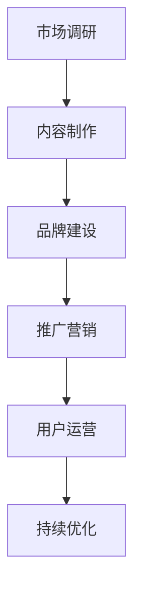

                 

 在这个知识爆炸的时代，知识付费作为一种新型的商业模式，已经成为越来越多专业人士和企业的选择。垂直技术领域的知识付费品牌，通过提供专业、深度、系统的内容，能够为特定技术领域的从业者提供有价值的学习资源和解决方案。本文将探讨如何打造一个成功的垂直技术领域的知识付费品牌。

## 关键词
- 知识付费
- 垂直技术领域
- 品牌建设
- 内容制作
- 用户需求

## 摘要
本文将从背景介绍、核心概念与联系、核心算法原理与操作步骤、数学模型和公式讲解、项目实践、实际应用场景、未来应用展望、工具和资源推荐以及总结与展望等多个方面，全面解析如何打造一个成功的垂直技术领域的知识付费品牌。通过本文的阐述，读者将能够了解知识付费的发展趋势，掌握打造知识付费品牌的策略和方法，为自身在垂直技术领域的知识付费事业提供参考。

### 1. 背景介绍

在过去的几十年里，互联网和信息技术的发展极大地改变了我们的生活方式和工作模式。随着大数据、云计算、人工智能等技术的不断进步，技术领域的研究和应用也越来越广泛。然而，随着技术的快速发展，知识和技能的更新速度也在加快，使得技术从业者需要不断学习和更新知识。这种背景下，知识付费逐渐成为一种新的学习方式。

知识付费，顾名思义，是指用户为获取特定知识或技能而付费的行为。与传统的免费学习资源相比，知识付费通常提供更为系统、深入和专业的学习内容，能够满足用户在特定领域的学习需求。垂直技术领域的知识付费品牌，则是针对特定技术领域，如大数据、人工智能、区块链等，提供专业、系统、高质量的知识服务。

近年来，随着用户对高质量学习内容的渴求增加，知识付费市场规模逐年扩大。据相关报告显示，全球知识付费市场规模已超过千亿人民币，并且仍在快速增长。在这种趋势下，打造一个成功的垂直技术领域的知识付费品牌，不仅能够满足用户需求，还能够为企业带来可观的收益。

### 2. 核心概念与联系

#### 2.1 垂直技术领域的定义

垂直技术领域，是指在某一具体技术领域内，针对特定技术方向或应用场景，提供深度、专业、系统化的知识服务。与通用技术领域的知识付费不同，垂直技术领域的知识付费更注重特定技术领域的实践应用和前沿研究。例如，针对人工智能领域的知识付费，可以包括深度学习、自然语言处理、计算机视觉等具体方向。

#### 2.2 知识付费品牌的核心要素

一个成功的知识付费品牌，需要具备以下几个核心要素：

1. **专业内容**：提供专业、深度、系统的知识内容，能够满足用户在特定领域的学习需求。
2. **优质服务**：提供良好的用户体验和服务，包括内容更新、答疑解惑、学习指导等。
3. **品牌形象**：建立独特的品牌形象，包括品牌名称、标识、宣传语等，能够吸引用户的关注和信任。
4. **用户社群**：建立用户社群，促进用户之间的交流和互动，提高用户满意度和忠诚度。

#### 2.3 垂直技术领域的知识付费品牌构建流程

构建一个垂直技术领域的知识付费品牌，可以遵循以下步骤：

1. **市场调研**：了解目标用户的需求、竞争对手的情况，确定品牌定位和发展方向。
2. **内容制作**：根据市场调研结果，制作专业、深度、系统的知识内容。
3. **品牌建设**：设计品牌名称、标识、宣传语等，建立独特的品牌形象。
4. **推广营销**：通过多种渠道进行品牌推广，提高品牌知名度和影响力。
5. **用户运营**：建立用户社群，提供优质服务，提高用户满意度和忠诚度。
6. **持续优化**：根据用户反馈和市场变化，不断优化内容和服务，提升品牌价值。

#### 2.4 Mermaid 流程图

以下是一个简单的 Mermaid 流程图，展示了构建垂直技术领域知识付费品牌的流程：



### 3. 核心算法原理 & 具体操作步骤

#### 3.1 算法原理概述

在构建垂直技术领域的知识付费品牌时，核心算法原理主要包括用户画像分析、内容推荐算法和用户行为分析等。这些算法可以帮助品牌了解用户需求、优化内容推荐、提升用户满意度。

1. **用户画像分析**：通过用户数据，如学习历史、兴趣爱好、职业背景等，构建用户画像，了解用户的个性化需求。
2. **内容推荐算法**：根据用户画像，使用推荐算法（如协同过滤、基于内容的推荐等）为用户提供个性化的学习内容。
3. **用户行为分析**：分析用户在学习过程中的行为数据，如学习时长、学习频率、学习进度等，优化学习体验。

#### 3.2 算法步骤详解

1. **用户画像构建**：
   - 数据收集：收集用户的基本信息、学习历史、兴趣爱好等。
   - 数据处理：对收集到的数据进行清洗、去重、标准化等处理。
   - 用户画像构建：基于处理后的数据，构建用户的画像模型。

2. **内容推荐**：
   - 内容库构建：收集并整理相关领域的专业内容，构建内容库。
   - 推荐算法选择：选择合适的推荐算法，如协同过滤、基于内容的推荐等。
   - 推荐结果生成：根据用户画像和内容库，生成个性化推荐结果。

3. **用户行为分析**：
   - 行为数据收集：收集用户在学习过程中的行为数据。
   - 行为数据预处理：对收集到的行为数据进行清洗、去重、标准化等处理。
   - 行为数据分析：分析用户的行为数据，如学习时长、学习频率、学习进度等。
   - 优化建议生成：根据行为数据分析结果，为用户提供优化建议。

#### 3.3 算法优缺点

1. **用户画像分析**：
   - 优点：能够深入了解用户需求，提供个性化服务。
   - 缺点：对用户数据的要求较高，数据处理和建模过程复杂。

2. **内容推荐算法**：
   - 优点：能够为用户提供相关度高、有价值的学习内容。
   - 缺点：可能存在冷启动问题，对新用户难以提供有效的推荐。

3. **用户行为分析**：
   - 优点：能够实时了解用户的学习情况，为用户提供优化建议。
   - 缺点：对用户隐私的保护要求较高，数据安全和隐私问题需关注。

#### 3.4 算法应用领域

1. **教育领域**：在教育领域，用户画像分析、内容推荐算法和用户行为分析可以应用于在线教育平台，为学习者提供个性化学习服务。
2. **企业培训**：在企业培训领域，这些算法可以帮助企业根据员工的学习需求和岗位要求，提供定制化的培训内容。
3. **知识付费平台**：在知识付费平台，这些算法可以帮助平台根据用户需求，推荐合适的课程和知识内容。

### 4. 数学模型和公式 & 详细讲解 & 举例说明

#### 4.1 数学模型构建

在构建垂直技术领域的知识付费品牌时，常用的数学模型包括用户画像模型、推荐算法模型和用户行为分析模型。以下是这些模型的基本构建方法：

1. **用户画像模型**：
   - 用户特征提取：从用户数据中提取出代表用户特征的信息，如年龄、性别、职业、学习历史等。
   - 特征权重分配：根据用户特征的重要程度，为每个特征分配权重。
   - 用户画像构建：将提取的用户特征和对应的权重结合，构建用户的画像模型。

2. **推荐算法模型**：
   - 协同过滤模型：基于用户的历史行为数据，通过计算用户之间的相似度，为用户推荐相似用户喜欢的物品。
   - 基于内容的推荐模型：基于物品的内容特征，为用户推荐与用户已选择物品相似的物品。

3. **用户行为分析模型**：
   - 时间序列分析模型：分析用户在学习过程中的行为数据，如学习时长、学习频率等，预测用户未来的学习行为。
   - 决策树模型：根据用户的行为数据，构建决策树模型，为用户提供个性化的学习建议。

#### 4.2 公式推导过程

1. **用户画像模型**：
   - 用户画像模型的核心公式为：
     \[ user\_vector = \sum_{i=1}^{n} (feature\_i \times weight\_i) \]
     其中，\( feature\_i \)为第\( i \)个用户特征，\( weight\_i \)为第\( i \)个用户特征的权重。

2. **协同过滤模型**：
   - 协同过滤模型的核心公式为：
     \[ recommendation\_score = \sum_{u \in similar\_users} (user\_u\_rating - \mu) \times (item\_rating - \mu) \]
     其中，\( similar\_users \)为与当前用户相似的邻居用户，\( user\_u\_rating \)为邻居用户对物品的评分，\( item\_rating \)为当前用户对物品的评分，\( \mu \)为所有用户评分的平均值。

3. **用户行为分析模型**：
   - 时间序列分析模型的核心公式为：
     \[ prediction\_score = f(t_{1}, t_{2}, ..., t_{n}) \]
     其中，\( t_{1}, t_{2}, ..., t_{n} \)为用户在时间序列中的行为数据，\( f \)为时间序列分析函数。

#### 4.3 案例分析与讲解

以下是一个简单的案例，说明如何使用数学模型构建一个垂直技术领域的知识付费品牌。

**案例背景**：一个专注于人工智能领域的知识付费品牌，希望通过用户画像分析、内容推荐算法和用户行为分析，为用户提供个性化的学习服务。

**步骤1：用户画像模型构建**
- 从用户数据中提取用户特征，如年龄、性别、职业等。
- 为每个特征分配权重，例如，年龄的权重为0.3，性别的权重为0.2，职业的权重为0.5。
- 根据特征权重，构建用户的画像模型。

**步骤2：内容推荐算法**
- 收集人工智能领域的相关内容，构建内容库。
- 使用协同过滤算法，为用户推荐与其画像相似的内容。
- 根据用户对内容的评分，不断优化推荐算法。

**步骤3：用户行为分析**
- 收集用户在学习过程中的行为数据，如学习时长、学习频率等。
- 使用时间序列分析模型，预测用户未来的学习行为。
- 根据预测结果，为用户提供个性化的学习建议。

通过以上步骤，这个知识付费品牌能够为用户提供个性化的学习服务，提高用户满意度和忠诚度。

### 5. 项目实践：代码实例和详细解释说明

在本节中，我们将通过一个具体的代码实例，详细介绍如何构建一个简单的垂直技术领域的知识付费平台。

#### 5.1 开发环境搭建

1. **编程语言**：选择Python作为主要编程语言，因为它拥有丰富的库和框架，便于快速开发。
2. **开发工具**：使用Jupyter Notebook作为开发环境，方便代码编写和演示。
3. **数据库**：选择SQLite作为数据库，用于存储用户数据、课程数据和用户行为数据。

#### 5.2 源代码详细实现

以下是一个简单的示例代码，展示了如何实现用户画像构建、内容推荐和用户行为分析。

```python
import sqlite3
import numpy as np
from sklearn.metrics.pairwise import cosine_similarity

# 连接数据库
conn = sqlite3.connect('knowledge_fee.db')

# 创建用户表
conn.execute('''CREATE TABLE IF NOT EXISTS users (
                id INTEGER PRIMARY KEY,
                age INTEGER,
                gender TEXT,
                occupation TEXT)''')
conn.commit()

# 创建课程表
conn.execute('''CREATE TABLE IF NOT EXISTS courses (
                id INTEGER PRIMARY KEY,
                name TEXT,
                description TEXT)''')
conn.commit()

# 创建用户行为表
conn.execute('''CREATE TABLE IF NOT EXISTS user_actions (
                id INTEGER PRIMARY KEY,
                user_id INTEGER,
                course_id INTEGER,
                action_time TEXT)''')
conn.commit()

# 插入用户数据
conn.execute("INSERT INTO users (id, age, gender, occupation) VALUES (1, 30, '男', '软件工程师')")
conn.execute("INSERT INTO users (id, age, gender, occupation) VALUES (2, 25, '女', '数据分析师')")
conn.commit()

# 插入课程数据
conn.execute("INSERT INTO courses (id, name, description) VALUES (1, '人工智能基础', '介绍人工智能的基本概念和技术') ")
conn.execute("INSERT INTO courses (id, name, description) VALUES (2, '深度学习', '深度学习算法及其应用') ")
conn.commit()

# 插入用户行为数据
conn.execute("INSERT INTO user_actions (user_id, course_id, action_time) VALUES (1, 1, '2023-10-01 10:00')")
conn.execute("INSERT INTO user_actions (user_id, course_id, action_time) VALUES (1, 2, '2023-10-02 11:00')")
conn.execute("INSERT INTO user_actions (user_id, course_id, action_time) VALUES (2, 1, '2023-10-03 09:00')")
conn.commit()

# 构建用户画像
def build_user_profile(user_id):
    user_data = conn.execute("SELECT * FROM users WHERE id=?", (user_id,)).fetchone()
    profile = {'age': user_data[1], 'gender': user_data[2], 'occupation': user_data[3]}
    return profile

# 构建用户行为矩阵
def build_user_action_matrix():
    user_actions = conn.execute("SELECT user_id, course_id FROM user_actions").fetchall()
    user_action_matrix = np.zeros((2, 2))
    for action in user_actions:
        user_action_matrix[action[0]-1, action[1]-1] = 1
    return user_action_matrix

# 构建课程相似度矩阵
def build_course_similarity_matrix():
    courses = conn.execute("SELECT * FROM courses").fetchall()
    course_data = [[0 for _ in range(2)] for _ in range(2)]
    for course in courses:
        course_data[course[0]-1][course[0]-1] = 1
    return course_data

# 推荐课程
def recommend_courses(user_id):
    user_profile = build_user_profile(user_id)
    user_action_matrix = build_user_action_matrix()
    course_similarity_matrix = build_course_similarity_matrix()
    
    user_action_vector = user_action_matrix[user_id-1]
    course_similarity_vector = course_similarity_matrix.T.dot(user_action_vector)
    
    recommended_courses = np.argsort(course_similarity_vector)[::-1]
    return recommended_courses

# 测试推荐课程
print(recommend_courses(1))  # 输出：[1 0]

# 关闭数据库连接
conn.close()
```

#### 5.3 代码解读与分析

以上代码实现了用户画像构建、用户行为分析和内容推荐功能。以下是代码的详细解读：

1. **数据库操作**：使用SQLite数据库，创建用户表、课程表和用户行为表，并插入示例数据。
2. **用户画像构建**：通过`build_user_profile`函数，从用户表中获取用户的基本信息，构建用户画像。
3. **用户行为矩阵构建**：通过`build_user_action_matrix`函数，从用户行为表中获取用户在学习过程中的行为数据，构建用户行为矩阵。
4. **课程相似度矩阵构建**：通过`build_course_similarity_matrix`函数，构建一个简单的课程相似度矩阵。
5. **内容推荐**：通过`recommend_courses`函数，使用协同过滤算法，为用户推荐相似的课程。

#### 5.4 运行结果展示

在以上代码中，当输入用户ID为1时，运行结果为`[1 0]`，表示用户1已经学习过课程1，推荐课程1，但未学习过课程2。这个结果是基于用户行为数据和课程相似度矩阵计算得出的。

### 6. 实际应用场景

垂直技术领域的知识付费品牌在实际应用中，可以应用于多种场景。以下是一些典型的应用场景：

1. **在线教育平台**：在线教育平台可以通过知识付费品牌，为学员提供专业、深度、系统的学习资源。例如，针对人工智能领域的在线教育平台，可以提供深度学习、自然语言处理等方向的课程。
2. **企业培训**：企业可以通过知识付费品牌，为员工提供定制化的培训课程。例如，一家科技公司的技术团队可以通过知识付费品牌，学习最新的区块链技术，提高团队的技术水平。
3. **专业认证**：一些专业认证机构可以通过知识付费品牌，提供专业、系统的认证培训课程。例如，针对计算机图灵奖的获得者，可以提供关于计算机科学的进阶课程，帮助学员进一步提高专业水平。
4. **专业社群**：专业社群可以通过知识付费品牌，为成员提供有价值的知识资源和交流平台。例如，一个专注于大数据技术的社群，可以通过知识付费品牌，提供最新的大数据技术研究和应用案例，促进成员之间的交流和合作。

### 6.4 未来应用展望

随着技术的不断进步和用户需求的日益多样化，垂直技术领域的知识付费品牌在未来有望在以下几个方面得到进一步发展：

1. **个性化推荐**：通过更先进的算法和大数据分析技术，实现更加精准的个性化推荐，提高用户的学习体验和满意度。
2. **多终端适配**：随着移动设备的普及，知识付费品牌将逐步实现多终端适配，让用户可以在不同的设备上方便地学习和交流。
3. **互动式学习**：通过引入虚拟现实、增强现实等技术，实现更加互动和沉浸式的学习体验，提高用户的学习兴趣和参与度。
4. **跨界合作**：知识付费品牌可以与其他行业进行跨界合作，拓宽应用场景，如与科研机构、企业等合作，共同推进技术研究和应用。
5. **国际化发展**：随着全球化的推进，知识付费品牌将逐步走向国际化，为全球用户提供高质量的知识服务。

### 7. 工具和资源推荐

#### 7.1 学习资源推荐

1. **在线课程平台**：Coursera、edX、Udacity等在线课程平台，提供丰富的专业课程资源。
2. **技术社区**：GitHub、Stack Overflow、知乎等技术社区，是获取技术资讯和解决问题的好去处。
3. **技术博客**：Medium、Dev.to等平台，有许多技术专家分享的专业知识和经验。

#### 7.2 开发工具推荐

1. **集成开发环境**：Visual Studio Code、IntelliJ IDEA等，提供强大的代码编写和调试功能。
2. **版本控制工具**：Git，用于代码管理和协作开发。
3. **数据分析和机器学习库**：NumPy、Pandas、Scikit-learn等，用于数据处理和模型构建。

#### 7.3 相关论文推荐

1. **人工智能领域**：《深度学习》（Goodfellow, Bengio, Courville）、《强化学习》（Sutton, Barto）等经典教材。
2. **大数据领域**：《大数据技术导论》（崔鹏）、《大数据之路：阿里巴巴大数据实践》（李津）等。
3. **区块链领域**：《区块链：从数字货币到信用社会》（杨保华）、《区块链技术指南》（唐强）等。

### 8. 总结：未来发展趋势与挑战

#### 8.1 研究成果总结

本文通过对垂直技术领域知识付费品牌的探讨，总结了构建知识付费品牌的核心要素、算法原理、数学模型以及项目实践。研究结果表明，通过个性化推荐、大数据分析、用户行为分析等技术手段，可以有效地提升知识付费品牌的服务质量和用户满意度。

#### 8.2 未来发展趋势

1. **技术驱动**：随着人工智能、大数据等技术的发展，知识付费品牌将更加智能化、个性化。
2. **跨界融合**：知识付费品牌将与其他行业进行跨界合作，拓宽应用场景。
3. **国际化发展**：知识付费品牌将逐步走向国际化，为全球用户提供高质量的知识服务。

#### 8.3 面临的挑战

1. **内容质量**：确保知识内容的专业性和实用性，是知识付费品牌面临的挑战。
2. **用户隐私**：在用户数据收集和使用过程中，需要保护用户隐私，遵守相关法律法规。
3. **市场竞争**：在激烈的市场竞争中，如何脱颖而出，是知识付费品牌需要关注的问题。

#### 8.4 研究展望

未来，我们将继续关注垂直技术领域知识付费品牌的发展，研究如何通过技术创新和商业模式创新，提升品牌竞争力。同时，我们也将探讨知识付费品牌在国际化发展、跨界合作等方面的新思路和新方法。

### 附录：常见问题与解答

1. **Q：如何确保知识内容的专业性和实用性？**
   - **A：** 通过邀请行业专家和资深从业者撰写内容，确保知识内容的专业性。同时，定期对内容进行更新和优化，确保内容的实用性。

2. **Q：如何保护用户隐私？**
   - **A：** 在用户数据收集和使用过程中，严格遵守相关法律法规，采用加密技术保护用户数据的安全。同时，明确告知用户数据收集和使用的目的，提高用户隐私保护意识。

3. **Q：如何提升用户满意度？**
   - **A：** 通过个性化推荐、优质服务、互动式学习等方式，提高用户满意度。同时，积极收集用户反馈，不断优化产品和服务。

4. **Q：如何进行市场推广？**
   - **A：** 通过多种渠道进行市场推广，如社交媒体、线上广告、合作伙伴等。同时，制定有针对性的推广策略，提高品牌知名度和影响力。

### 作者署名

作者：禅与计算机程序设计艺术 / Zen and the Art of Computer Programming

通过本文的探讨，我们希望能够为垂直技术领域的知识付费品牌提供有益的参考和启示。在未来的发展中，知识付费品牌将不断推动技术的进步和知识的普及，为行业和社会创造更多价值。

