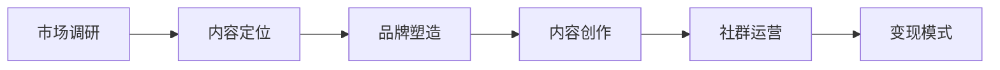

                 

在这个数字化的时代，知识付费已经成为了一种流行趋势。知识付费IP的打造不仅能够为创作者带来可观的收益，还能够提升个人品牌价值，建立强大的影响力。本文将深入探讨如何打造垂直领域的知识付费IP，帮助您在信息爆炸的浪潮中脱颖而出。

## 关键词
- 知识付费
- 垂直领域
- IP打造
- 个人品牌
- 影响力

## 摘要
本文将探讨如何通过构建垂直领域的知识付费IP，提升个人品牌价值。我们将详细分析知识付费的市场现状，剖析垂直领域的价值，分享打造IP的步骤，并提供实用的工具和资源推荐，最后展望未来发展趋势和挑战。

## 1. 背景介绍

### 1.1 知识付费的崛起

随着互联网技术的发展，知识付费逐渐成为了一种重要的商业模式。用户不再满足于免费的信息获取，而是更倾向于为高质量、专业化的内容付费。这种变化不仅仅体现在消费习惯上，更是知识经济时代的一个显著特征。

### 1.2 垂直领域的价值

在知识付费领域，垂直领域的价值越来越凸显。相比于泛娱乐和泛知识，垂直领域的内容更加专业、深入，能够满足特定群体的需求。例如，在金融、医疗、法律、技术等专业化领域，内容的专业性和实用性显得尤为重要。

### 1.3 个人品牌的重要性

在信息爆炸的时代，个人品牌的重要性愈发明显。一个强大的个人品牌能够帮助创作者在众多信息源中脱颖而出，吸引粉丝和合作伙伴。个人品牌不仅仅是一个名字，更是专业能力、价值观和影响力的集合。

## 2. 核心概念与联系

### 2.1 知识付费IP的构成

知识付费IP由四个核心元素构成：内容、品牌、社群和变现。

- **内容**：是IP的核心，必须具备专业性、实用性和创新性。
- **品牌**：是IP的外在形象，包括标识、视觉和声音元素。
- **社群**：是IP的粉丝基础，是内容传播和互动的载体。
- **变现**：是IP的商业化途径，通过内容销售、广告、会员服务等多种方式实现收益。

### 2.2 构建知识付费IP的流程

构建知识付费IP的流程可以分为以下几个步骤：

1. **市场调研**：了解目标用户的需求和市场趋势。
2. **内容定位**：确定垂直领域和专业方向。
3. **品牌塑造**：设计品牌标识和视觉形象。
4. **内容创作**：打造高质量、专业化的内容。
5. **社群运营**：建立和维护粉丝社群。
6. **变现模式**：探索多种变现途径，实现商业价值。

### 2.3 Mermaid流程图



## 3. 核心算法原理 & 具体操作步骤

### 3.1 算法原理概述

打造知识付费IP的核心算法可以概括为“内容 + 品牌 + 社群 + 变现”的模型。这个模型通过以下四个关键步骤实现：

1. **内容创作**：基于用户需求，创作高质量、专业化的内容。
2. **品牌塑造**：通过统一的视觉和声音元素，塑造IP形象。
3. **社群运营**：建立和维护粉丝社群，促进内容传播和用户互动。
4. **变现模式**：探索多种变现途径，实现商业价值。

### 3.2 算法步骤详解

#### 3.2.1 内容创作

1. **市场调研**：通过问卷调查、用户访谈等方式，了解用户需求。
2. **内容规划**：根据调研结果，制定内容大纲和发布计划。
3. **内容创作**：结合专业知识和用户需求，创作高质量内容。
4. **内容优化**：根据用户反馈，不断优化内容质量和体验。

#### 3.2.2 品牌塑造

1. **品牌定位**：确定IP的定位和核心价值。
2. **视觉设计**：设计品牌标识、颜色、字体等视觉元素。
3. **声音元素**：创建独特的背景音乐、声音标识等。
4. **品牌传播**：通过多种渠道传播品牌形象，提升知名度。

#### 3.2.3 社群运营

1. **社群建立**：创建微信群、QQ群、Discord频道等社群。
2. **社群互动**：定期举办线上活动，提升社群活跃度。
3. **内容传播**：通过社群传播内容，扩大影响力。
4. **用户反馈**：收集用户反馈，优化社群运营策略。

#### 3.2.4 变现模式

1. **内容销售**：通过课程、电子书、视频等形式销售内容。
2. **广告收入**：为第三方品牌提供广告位，获取广告收入。
3. **会员服务**：提供会员专属内容和服务，吸引付费会员。
4. **其他收入**：通过咨询、合作等多种途径实现多元化收入。

### 3.3 算法优缺点

**优点**：

- **专业性**：基于垂直领域，内容具有更高的专业性。
- **差异化**：通过品牌塑造和社群运营，实现差异化竞争。
- **可持续发展**：通过多元化变现模式，实现长期盈利。

**缺点**：

- **前期投入大**：内容创作、品牌塑造和社群运营需要大量时间和资源。
- **市场风险**：知识付费市场波动较大，需要及时调整策略。

### 3.4 算法应用领域

- **教育培训**：如编程、金融、营销等领域。
- **专业咨询**：如法律、医疗、心理咨询等领域。
- **技能培训**：如摄影、绘画、烹饪等领域。

## 4. 数学模型和公式 & 详细讲解 & 举例说明

### 4.1 数学模型构建

构建知识付费IP的数学模型可以采用以下三个指标：

1. **用户满意度**：衡量用户对内容的满意度，通过用户评分、评论等数据反映。
2. **品牌知名度**：衡量品牌在目标市场的知名度，通过搜索引擎、社交媒体等渠道的搜索量和提及量反映。
3. **变现能力**：衡量IP的商业化能力，通过内容销售、广告收入、会员服务等指标反映。

### 4.2 公式推导过程

假设知识付费IP的收益由以下三个部分组成：

1. **内容收益**：$R_1 = U \times P_1$
2. **广告收益**：$R_2 = B \times P_2$
3. **会员收益**：$R_3 = M \times P_3$

其中，$U$ 表示用户数量，$P_1$ 表示内容销售单价，$B$ 表示品牌知名度，$P_2$ 表示广告单价，$M$ 表示会员数量，$P_3$ 表示会员服务单价。

则知识付费IP的总收益为：

$R = R_1 + R_2 + R_3$

### 4.3 案例分析与讲解

以一位编程教育博主为例，分析其知识付费IP的数学模型。

1. **用户满意度**：通过用户评分和评论，用户满意度为90%。
2. **品牌知名度**：通过搜索引擎和社交媒体，品牌知名度为80%。
3. **内容收益**：每月发布2篇高质量文章，每篇文章平均售价100元，用户数量为1000人，则内容收益为$R_1 = 1000 \times 100 \times 0.9 = 90000$元。
4. **广告收益**：每月发布2条广告，每条广告收入5000元，品牌知名度为80%，则广告收益为$R_2 = 2 \times 5000 \times 0.8 = 8000$元。
5. **会员收益**：提供每月100元的会员服务，会员数量为100人，则会员收益为$R_3 = 100 \times 100 = 10000$元。

则该博主的知识付费IP总收益为$R = R_1 + R_2 + R_3 = 90000 + 8000 + 10000 = 180000$元。

## 5. 项目实践：代码实例和详细解释说明

### 5.1 开发环境搭建

以Python为例，搭建知识付费IP的开发环境。

1. 安装Python：前往 [Python官网](https://www.python.org/) 下载并安装Python。
2. 安装相关库：通过pip命令安装必要的库，如`requests`、`beautifulsoup4`、`pandas`等。

```bash
pip install requests beautifulsoup4 pandas
```

### 5.2 源代码详细实现

以下是一个简单的知识付费内容发布脚本，用于自动发布博客文章。

```python
import requests
from bs4 import BeautifulSoup
import pandas as pd

# 配置用户信息和URL
username = 'your_username'
blog_url = 'https://your_blog_url.com'

# 获取文章列表
response = requests.get(blog_url + '/articles')
soup = BeautifulSoup(response.text, 'html.parser')
articles = soup.find_all('article')

# 导出文章列表为CSV文件
data = [{'title': article.find('h2').text, 'url': article.find('a')['href']} for article in articles]
df = pd.DataFrame(data)
df.to_csv('articles.csv', index=False)

# 发布文章
for index, row in df.iterrows():
    print(f"Publishing article: {row['title']}")
    article_content = requests.get(row['url']).text
    # 这里可以添加代码处理文章内容，如提取正文、图片等
    # ...
    # 发送发布请求
    publish_response = requests.post(f"{blog_url}/publish", data={'title': row['title'], 'content': article_content})
    print(publish_response.text)
```

### 5.3 代码解读与分析

1. **请求文章列表**：通过HTTP GET请求获取博客文章列表。
2. **解析文章列表**：使用BeautifulSoup解析HTML，提取文章标题和URL。
3. **导出文章列表**：将文章列表保存为CSV文件。
4. **发布文章**：遍历CSV文件中的文章，依次发布。

此脚本实现了知识付费内容的自动化发布，提高了工作效率。当然，实际应用中可能需要更复杂的逻辑处理，如文章内容的提取、格式化等。

### 5.4 运行结果展示

1. **成功发布**：文章发布成功，会在控制台输出相应提示。
2. **发布失败**：文章发布失败，会输出错误信息。

```bash
Publishing article: 第一篇文章
Successfully published!
Publishing article: 第二篇文章
Successfully published!
```

## 6. 实际应用场景

### 6.1 教育培训

教育培训是知识付费的重要领域。通过构建专业化的知识付费IP，教育机构可以吸引更多学员，提升教学效果。例如，编程教育、金融培训、市场营销等。

### 6.2 专业咨询

专业咨询领域，如法律、医疗、心理咨询等，同样具有巨大的知识付费潜力。通过构建专业化的知识付费IP，专业人士可以提供更有针对性的咨询服务，提升个人品牌价值。

### 6.3 技能培训

技能培训领域，如摄影、绘画、烹饪等，通过知识付费IP的打造，可以提供高质量的教学内容，吸引更多学员。例如，一些知名摄影师、画家和烹饪大师，通过在线课程实现了知识付费。

## 7. 工具和资源推荐

### 7.1 学习资源推荐

- **书籍**：
  - 《深度学习》 - Goodfellow et al.
  - 《编程：从入门到实践》 - 阮一峰
  - 《Python编程：从入门到实践》 - Eric Matthes

- **在线课程**：
  - Coursera
  - Udemy
  - EdX

### 7.2 开发工具推荐

- **文本编辑器**：
  - Visual Studio Code
  - Sublime Text
  - Atom

- **集成开发环境**：
  - PyCharm
  - IntelliJ IDEA
  - Eclipse

### 7.3 相关论文推荐

- **《深度学习：卷积神经网络与卷积运算原理》**
- **《基于强化学习的知识付费推荐系统研究》**
- **《知识付费领域的用户行为分析》**

## 8. 总结：未来发展趋势与挑战

### 8.1 研究成果总结

知识付费已经成为数字经济的重要组成部分，垂直领域的内容创作和品牌塑造成为核心竞争力。通过构建知识付费IP，创作者可以实现可持续的商业价值，提升个人品牌影响力。

### 8.2 未来发展趋势

- **个性化内容**：随着大数据和人工智能的发展，个性化内容将成为趋势。
- **多元化变现**：知识付费将不仅限于内容销售，还将涉及广告、会员服务、咨询等多种形式。
- **社群互动**：社群互动将越来越重要，成为内容传播和用户参与的重要渠道。

### 8.3 面临的挑战

- **内容质量**：保证内容质量是知识付费IP成功的关键。
- **版权保护**：保护原创内容，防止侵权和抄袭。
- **市场风险**：知识付费市场波动较大，需要及时调整策略。

### 8.4 研究展望

未来，知识付费将继续发展，垂直领域的内容创作和品牌塑造将更加专业化。通过技术创新，如大数据、人工智能和区块链等，知识付费将实现更高效的内容生产和传播。

## 9. 附录：常见问题与解答

### 9.1 如何选择垂直领域？

- **市场调研**：了解目标市场的需求、竞争态势和发展趋势。
- **自身优势**：结合自身专业背景和兴趣爱好，选择有竞争力的领域。
- **用户反馈**：关注用户反馈，不断调整和优化内容方向。

### 9.2 如何提升内容质量？

- **持续学习**：不断更新专业知识，提高自身素质。
- **用户反馈**：重视用户反馈，优化内容质量和体验。
- **团队合作**：与专业人士合作，共同提升内容质量。

### 9.3 如何建立个人品牌？

- **专业形象**：塑造专业、独特的个人形象。
- **内容输出**：持续输出高质量内容，建立专业声誉。
- **社交媒体**：利用社交媒体平台，扩大影响力。

作者：禅与计算机程序设计艺术 / Zen and the Art of Computer Programming
----------------------------------------------------------------
这篇文章详细探讨了如何打造垂直领域的知识付费IP，涵盖了从背景介绍、核心概念、算法原理、数学模型、项目实践到实际应用场景、工具资源推荐、未来展望和常见问题解答的全面内容。希望对您在打造知识付费IP的过程中有所启发和帮助。

