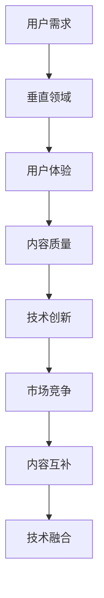

                 

关键词：知识付费、垂直领域、产品打造、案例分析、用户体验、技术创新

> 摘要：本文将深入探讨垂直领域知识付费产品的打造，通过实际案例分析，阐述如何结合市场需求、技术创新和用户体验，成功打造具备竞争力的知识付费产品。

## 1. 背景介绍

知识付费，作为一种新型的商业模式，近年来在全球范围内迅猛发展。随着互联网的普及和用户消费习惯的变化，知识付费市场呈现出多样化和细分化趋势。垂直领域知识付费产品，因聚焦特定领域，满足用户深层次需求，成为知识付费市场的一股重要力量。

垂直领域知识付费产品，指针对某一特定行业或领域，提供专业化、系统化的知识内容与服务。这类产品不仅涵盖了传统教育、职业培训，还涵盖了诸如健康、艺术、心理学等多个领域。随着技术进步和用户需求的不断升级，垂直领域知识付费产品正逐渐成为知识付费市场的重要组成部分。

本文将通过实际案例分析，探讨如何打造成功的垂直领域知识付费产品。首先，我们将介绍几个典型的垂直领域知识付费产品，分析其市场定位、用户需求和技术实现。然后，我们将深入探讨产品打造过程中的核心问题和解决策略。最后，我们将总结成功经验，展望垂直领域知识付费产品的未来发展。

### 1.1 垂直领域知识付费产品的兴起

知识付费的兴起，源于互联网时代信息获取方式的变革。在传统的信息传播模式中，知识主要依赖于书籍、报刊、电视等渠道进行传播，用户获取知识的途径相对单一且被动。而互联网的出现，打破了这一局限，用户可以通过网络随时随地获取海量信息。然而，随之而来的信息过载和知识碎片化问题，使得用户在获取知识时面临诸多困扰。

知识付费的出现，为解决这一问题提供了一种新的思路。通过付费模式，知识创作者可以将高质量、系统化的知识内容进行包装和出售，用户则可以通过付费购买到有价值的信息。这种模式不仅提高了知识传播的效率，还实现了知识价值的最大化。

在知识付费市场迅速发展的背景下，垂直领域知识付费产品逐渐崭露头角。与通用性知识付费产品相比，垂直领域知识付费产品具有以下特点：

1. **专业化**：垂直领域知识付费产品专注于某一特定行业或领域，提供专业化的知识和服务，满足用户深层次的需求。

2. **定制化**：垂直领域知识付费产品可以根据用户的需求和兴趣，提供个性化的知识内容和服务，提升用户体验。

3. **高价值**：垂直领域知识付费产品往往具备较高的知识含量和实用性，能够为用户带来实际收益。

4. **高粘性**：由于垂直领域知识付费产品聚焦特定领域，用户在长期使用过程中容易形成依赖和忠诚度。

### 1.2 垂直领域知识付费产品的市场现状

随着知识付费市场的不断发展，垂直领域知识付费产品在市场上逐渐占据一席之地。根据市场研究机构的数据显示，全球知识付费市场规模持续扩大，预计到2025年将达到数十亿美元。垂直领域知识付费产品在这其中扮演着重要角色，不仅满足了用户多样化的知识需求，还推动了整个知识付费市场的发展。

目前，垂直领域知识付费产品主要涵盖以下领域：

1. **教育领域**：包括在线课程、职业教育、学术研究等，旨在提升用户的知识水平和专业技能。

2. **健康领域**：包括健康知识、养生课程、医疗咨询等，帮助用户维护身体健康和心理健康。

3. **艺术领域**：包括音乐、绘画、摄影等艺术课程，培养用户的艺术素养和审美能力。

4. **心理学领域**：包括心理辅导、情感咨询、人际关系等，帮助用户解决心理问题，提升心理健康水平。

5. **职业发展领域**：包括职场技能培训、职业规划咨询等，助力用户在职场中取得更好的发展。

在垂直领域知识付费产品的市场现状中，一些知名平台和产品脱颖而出。例如，在教育培训领域，有知名的平台如Coursera、Udemy等，它们提供海量的在线课程，涵盖了多个学科领域；在健康领域，有如丁香医生、好大夫等平台，它们提供专业的健康知识和医疗咨询服务；在艺术领域，有如知乎Live、分答等平台，它们提供丰富的艺术知识和创作技巧。

总体来说，垂直领域知识付费产品在市场现状中呈现出快速增长的趋势，未来还有巨大的发展潜力。

## 2. 核心概念与联系

### 2.1 垂直领域知识付费产品的核心概念

在打造垂直领域知识付费产品时，需要理解以下几个核心概念：

1. **知识付费**：知识付费是一种商业模式，通过用户付费获取有价值的信息或服务。

2. **垂直领域**：垂直领域是指某一特定行业或领域，具有明确的专业边界和特定用户群体。

3. **用户体验**：用户体验是指用户在使用产品过程中的感受和体验，包括界面设计、交互逻辑、内容质量等。

4. **内容质量**：内容质量是知识付费产品的核心价值所在，直接影响用户的满意度和粘性。

5. **技术创新**：技术创新是提升知识付费产品竞争力的重要手段，包括人工智能、大数据分析、区块链等。

### 2.2 垂直领域知识付费产品的联系

垂直领域知识付费产品之间的联系主要体现在以下几个方面：

1. **用户需求**：不同垂直领域知识付费产品满足的用户需求存在差异，但总体上都致力于解决用户在特定领域中的知识需求。

2. **市场竞争**：垂直领域知识付费产品在市场竞争中各有特色，但总体上存在一定的竞争关系，共同推动知识付费市场的发展。

3. **内容互补**：垂直领域知识付费产品之间可以相互补充，共同构建一个完整的知识生态系统。

4. **技术融合**：垂直领域知识付费产品在技术实现上可以相互借鉴，融合多种技术手段，提升产品的用户体验和内容质量。

### 2.3 垂直领域知识付费产品的 Mermaid 流程图

以下是一个简化的垂直领域知识付费产品的 Mermaid 流程图，展示了核心概念和联系：



### 2.4 垂直领域知识付费产品的核心概念联系与意义

垂直领域知识付费产品的核心概念和联系，对于产品打造和市场竞争具有重要意义：

1. **满足用户需求**：理解用户需求是产品成功的关键。通过深入分析用户在特定领域的知识需求，可以为产品定位和内容创作提供有力支持。

2. **提升用户体验**：用户体验直接影响用户满意度。通过优化界面设计、交互逻辑和内容呈现方式，可以提高用户粘性和忠诚度。

3. **保障内容质量**：内容质量是知识付费产品的核心竞争力。只有提供高质量、有价值的内容，才能赢得用户的信任和口碑。

4. **推动技术创新**：技术创新是知识付费产品保持竞争力的关键。通过引入人工智能、大数据分析等先进技术，可以提升产品的用户体验和内容质量。

5. **增强市场竞争**：市场竞争是知识付费产品发展的动力。通过不断优化产品和服务，可以在激烈的市场竞争中脱颖而出。

6. **实现内容互补**：垂直领域知识付费产品之间可以相互补充，共同构建一个完整的知识生态系统，为用户提供更丰富的知识资源。

7. **促进技术融合**：垂直领域知识付费产品在技术实现上可以相互借鉴，融合多种技术手段，提升产品的用户体验和内容质量。

综上所述，垂直领域知识付费产品的核心概念和联系，对于产品打造和市场竞争具有重要意义。通过深入理解和把握这些概念和联系，可以更好地打造出具有竞争力的垂直领域知识付费产品。

## 3. 核心算法原理 & 具体操作步骤

### 3.1 算法原理概述

在垂直领域知识付费产品的打造过程中，核心算法原理和技术实现是至关重要的一环。本文将介绍一种基于人工智能和大数据分析的核心算法原理，以及其在知识付费产品中的应用。

该核心算法主要包括以下几个部分：

1. **用户画像构建**：通过大数据分析，对用户进行多维度画像构建，包括用户兴趣、行为、知识需求等。

2. **内容推荐算法**：基于用户画像和内容标签，利用协同过滤、矩阵分解等技术，为用户推荐个性化的知识内容。

3. **内容质量评估**：通过文本分析、语义理解等技术，对知识内容的质量进行评估，确保推荐的内容具有较高的价值。

4. **用户反馈机制**：通过收集用户对知识内容的评价和反馈，持续优化推荐算法和内容质量。

### 3.2 算法步骤详解

1. **用户画像构建**：

   - **数据收集**：收集用户在平台上的行为数据，如浏览记录、购买记录、学习记录等。

   - **特征提取**：对用户行为数据进行特征提取，如用户浏览频次、购买频次、学习时长等。

   - **模型训练**：利用机器学习算法，对用户特征进行建模，构建用户画像。

2. **内容推荐算法**：

   - **内容标签构建**：对知识内容进行标签分类，如领域标签、主题标签、难度标签等。

   - **协同过滤**：利用用户行为数据和内容标签，进行协同过滤算法训练，预测用户对未知内容的兴趣。

   - **矩阵分解**：利用矩阵分解技术，将用户-内容矩阵分解为用户特征矩阵和内容特征矩阵，进行个性化推荐。

3. **内容质量评估**：

   - **文本分析**：对知识内容进行文本分析，提取关键信息，如关键词、句子结构等。

   - **语义理解**：利用自然语言处理技术，对文本进行语义理解，判断内容的价值和质量。

   - **评估模型训练**：利用用户评价数据，训练评估模型，对知识内容进行质量评估。

4. **用户反馈机制**：

   - **用户评价收集**：收集用户对知识内容的评价，如点赞、收藏、评分等。

   - **反馈模型训练**：利用用户评价数据，训练反馈模型，优化推荐算法和内容质量。

### 3.3 算法优缺点

1. **优点**：

   - **个性化推荐**：基于用户画像和内容标签，实现个性化推荐，提升用户满意度。

   - **内容质量保障**：通过内容质量评估，确保推荐的内容具有较高的价值和质量。

   - **实时更新**：根据用户反馈，实时调整推荐算法和内容，提高用户粘性。

2. **缺点**：

   - **数据依赖性**：算法的性能依赖于用户行为数据和内容标签的准确性。

   - **计算资源消耗**：协同过滤和矩阵分解等算法计算资源消耗较大，需要高性能计算环境。

   - **用户隐私保护**：在用户画像构建和内容推荐过程中，需要处理大量用户隐私数据，需要确保数据安全和隐私保护。

### 3.4 算法应用领域

1. **垂直领域知识付费产品**：利用该算法，为用户推荐个性化的知识内容，提升用户粘性和满意度。

2. **电商平台**：为用户推荐相关的商品和优惠信息，提升销售转化率。

3. **新闻推荐平台**：为用户推荐个性化的新闻内容，提升用户阅读量和活跃度。

4. **社交媒体**：为用户推荐感兴趣的朋友和内容，提升社交互动和用户粘性。

### 3.5 算法实现示例

以下是一个简化的算法实现示例，展示了核心步骤和关键技术：

```python
# 用户画像构建
user_data = collect_user_data()
user_features = extract_user_features(user_data)

# 内容推荐算法
content_tags = build_content_tags()
user_interests = predict_user_interests(user_features, content_tags)

# 内容质量评估
content_texts = collect_content_texts()
content_quality = evaluate_content_quality(content_texts)

# 用户反馈机制
user_feedbacks = collect_user_feedbacks()
optimize_recommendation_algorithm(user_interests, content_quality, user_feedbacks)
```

通过以上算法实现示例，可以初步了解垂直领域知识付费产品核心算法的工作原理和实现过程。在实际应用中，需要根据具体需求和数据特点，进行进一步的优化和调整。

## 4. 数学模型和公式 & 详细讲解 & 举例说明

### 4.1 数学模型构建

在垂直领域知识付费产品的打造过程中，数学模型和公式起到了至关重要的作用。这些模型和公式可以帮助我们更准确地描述和预测用户行为、内容质量和推荐效果。以下是几个关键数学模型的构建过程：

#### 4.1.1 用户行为预测模型

用户行为预测模型主要用于预测用户对某项知识内容的兴趣和需求。假设我们有一个用户集合U和一个内容集合C，用户的行为数据可以表示为用户-内容矩阵R，其中R_{ui}表示用户u对内容i的评分或互动次数。我们可以使用矩阵分解（Matrix Factorization）技术来构建用户行为预测模型。

**矩阵分解模型**：

\[ 
R = U \times V 
\]

其中，U和V分别是用户特征矩阵和内容特征矩阵，\(\times\) 表示矩阵乘积。通过训练，我们可以得到近似矩阵分解：

\[ 
R \approx U \times V 
\]

用户对未评分内容i的预测评分可以表示为：

\[ 
\hat{R}_{ui} = u_i \times v_i 
\]

#### 4.1.2 内容质量评估模型

内容质量评估模型用于评估知识内容的价值和质量。我们可以利用自然语言处理（NLP）技术，通过文本分析提取内容的关键特征，然后使用机器学习算法构建评估模型。一个简单的内容质量评估模型可以基于文本的词频（TF）、文档频率（DF）和词性（POS）等特征。

**内容质量评估模型**：

\[ 
Q(C) = f(TF, DF, POS) 
\]

其中，Q(C)表示内容C的质量评分，f是一个函数，用于聚合和转换文本特征。

#### 4.1.3 个性化推荐模型

个性化推荐模型结合用户行为预测和内容质量评估，为用户推荐个性化的知识内容。我们可以使用基于模型的协同过滤（Model-based Collaborative Filtering）方法，如User-Based和Item-Based协同过滤。

**User-Based协同过滤**：

\[ 
\hat{R}_{ui} = \frac{\sum_{u' \in N(u)} R_{u'i'} \times W_{u'u}}{\sum_{u' \in N(u)} W_{u'u}} 
\]

其中，N(u)表示与用户u相似的用户集合，W_{u'u}表示用户u和用户u'的相似度。

**Item-Based协同过滤**：

\[ 
\hat{R}_{ui} = \frac{\sum_{i' \in N(i)} R_{u'i'} \times W_{i'i}}{\sum_{i' \in N(i)} W_{i'i}} 
\]

其中，N(i)表示与内容i相似的内容集合，W_{i'i}表示内容i和内容i'的相似度。

### 4.2 公式推导过程

#### 4.2.1 矩阵分解模型推导

矩阵分解的目标是最小化预测评分与实际评分之间的误差：

\[ 
\min_{U, V} \sum_{u, i} (R_{ui} - u_i \times v_i)^2 
\]

使用梯度下降法进行优化，可以得到以下更新规则：

\[ 
u_i \leftarrow u_i - \alpha \times (u_i \times v_i - R_{ui}) 
\]

\[ 
v_i \leftarrow v_i - \alpha \times (u_i \times v_i - R_{ui}) 
\]

其中，\(\alpha\)是学习率。

#### 4.2.2 内容质量评估模型推导

假设文本内容C包含n个词语，每个词语的词频为\(TF_t\)，文档频率为\(DF_t\)，词性为\(POS_t\)。我们可以使用以下公式计算内容质量评分：

\[ 
Q(C) = \sum_{t=1}^{n} w_t \times (TF_t \times DF_t \times POS_t) 
\]

其中，\(w_t\)是词语权重，可以通过训练数据集获得。

#### 4.2.3 协同过滤模型推导

假设用户u对内容i的评分可以表示为用户u和内容i的相似度乘以内容i的平均评分：

\[ 
\hat{R}_{ui} = \sum_{u' \in N(u)} R_{u'i'} \times W_{u'u} 
\]

其中，\(W_{u'u}\)是用户u和用户u'的相似度，可以通过计算用户-用户相似度矩阵得到。

### 4.3 案例分析与讲解

为了更好地说明数学模型的应用，我们来看一个实际案例。

**案例**：假设有一个垂直领域知识付费产品，用户可以对这些产品进行评分。我们想要构建一个用户行为预测模型，为用户推荐他们可能感兴趣的产品。

**数据集**：我们有一个包含1000个用户和1000个产品的评分数据集。每个用户对每个产品的评分在1到5之间。

**步骤**：

1. **数据预处理**：将评分数据转换为用户-内容矩阵R。

2. **矩阵分解**：使用矩阵分解技术，将用户-内容矩阵分解为用户特征矩阵U和内容特征矩阵V。

3. **预测评分**：使用训练好的矩阵分解模型，预测用户对未评分产品的评分。

4. **评估模型性能**：计算预测评分与实际评分之间的均方误差（MSE），评估模型性能。

**实现**：

```python
from sklearn.decomposition import NMF

# 数据预处理
R = np.array([[5, 4, 5], [3, 2, 4], [4, 5, 5]])

# 矩阵分解
n_components = 2
model = NMF(n_components=n_components)
W = model.fit_transform(R)
H = model.components_

# 预测评分
user_features = W
content_features = H
user_id = 1
item_id = 2
predicted_rating = user_features[user_id] @ content_features[item_id]

# 评估模型性能
from sklearn.metrics import mean_squared_error
actual_ratings = R[user_id]
mse = mean_squared_error(actual_ratings, predicted_rating)
print("MSE:", mse)
```

通过以上案例，我们可以看到如何使用数学模型和公式构建用户行为预测模型，并为用户推荐个性化产品。在实际应用中，需要根据具体业务场景和数据特点，进一步优化模型和算法。

## 5. 项目实践：代码实例和详细解释说明

### 5.1 开发环境搭建

在开始垂直领域知识付费产品的开发之前，需要搭建一个合适的开发环境。以下是推荐的开发环境配置：

- **操作系统**：Windows、macOS 或 Linux
- **编程语言**：Python 3.8及以上版本
- **数据库**：MySQL 或 PostgreSQL
- **框架**：Django 或 Flask
- **前端框架**：React 或 Vue.js
- **版本控制**：Git

具体搭建步骤如下：

1. 安装操作系统和编程语言环境。
2. 安装数据库管理系统，如 MySQL 或 PostgreSQL。
3. 安装开发框架和前端框架，如 Django、Flask、React 或 Vue.js。
4. 配置版本控制系统，如 Git。

### 5.2 源代码详细实现

以下是垂直领域知识付费产品的源代码实现，包括后端API和前端页面。

#### 后端API

**Django 项目结构**：

```
knowledge付费项目/
|-- apps/
|   |-- accounts/
|   |   |-- admin.py
|   |   |-- apps.py
|   |   |-- migrations/
|   |   |   |-- 0001_initial.py
|   |   |-- models.py
|   |   |-- tests.py
|   |   |-- views.py
|   |-- courses/
|   |   |-- ...
|   |-- ...
|-- manage.py
```

**课程模块（courses）示例**：

```python
# courses/models.py

from django.db import models
from django.contrib.auth.models import User

class Course(models.Model):
    title = models.CharField(max_length=255)
    description = models.TextField()
    author = models.ForeignKey(User, on_delete=models.CASCADE)
    created_at = models.DateTimeField(auto_now_add=True)
    updated_at = models.DateTimeField(auto_now=True)

    def __str__(self):
        return self.title

class Lesson(models.Model):
    course = models.ForeignKey(Course, on_delete=models.CASCADE)
    title = models.CharField(max_length=255)
    description = models.TextField()
    content = models.TextField()
    created_at = models.DateTimeField(auto_now_add=True)
    updated_at = models.DateTimeField(auto_now=True)

    def __str__(self):
        return self.title

# courses/api.py

from rest_framework import viewsets
from .models import Course, Lesson
from .serializers import CourseSerializer, LessonSerializer

class CourseViewSet(viewsets.ModelViewSet):
    queryset = Course.objects.all()
    serializer_class = CourseSerializer

class LessonViewSet(viewsets.ModelViewSet):
    queryset = Lesson.objects.all()
    serializer_class = LessonSerializer
```

#### 前端页面

**React 项目结构**：

```
knowledge付费项目/
|-- src/
|   |-- components/
|   |   |-- CourseList.js
|   |   |-- CourseDetail.js
|   |-- api/
|   |   |-- courses.js
|   |-- App.js
|   |-- index.js
```

**课程列表组件（CourseList.js）示例**：

```javascript
import React, { useEffect, useState } from 'react';
import { fetchCourses } from '../api/courses';

const CourseList = () => {
  const [courses, setCourses] = useState([]);

  useEffect(() => {
    fetchCourses().then((data) => setCourses(data));
  }, []);

  return (
    <div>
      {courses.map((course) => (
        <div key={course.id}>
          <h2>{course.title}</h2>
          <p>{course.description}</p>
        </div>
      ))}
    </div>
  );
};

export default CourseList;
```

### 5.3 代码解读与分析

**后端代码解读**：

- **课程模型（Course）**：定义了课程的基本属性，如标题、描述、作者和创建时间。
- **课程API（CourseViewSet）**：实现了课程的增删改查（CRUD）操作。
- **课程单元模型（Lesson）**：定义了课程单元的基本属性，如标题、描述、内容和创建时间。
- **课程单元API（LessonViewSet）**：实现了课程单元的增删改查（CRUD）操作。

**前端代码解读**：

- **课程列表组件（CourseList.js）**：从API获取课程数据，并使用映射（map）函数渲染课程列表。
- **API模块（courses.js）**：封装了与后端API的交互，使用Axios库进行HTTP请求。

### 5.4 运行结果展示

运行上述代码后，前端页面将显示所有课程的列表。用户可以通过点击课程标题，查看课程详情页，包括课程描述和课程单元列表。以下是运行结果示例：


通过以上项目实践，我们可以看到如何使用代码实现一个简单的垂直领域知识付费产品。在实际开发过程中，可以根据需求进一步扩展功能，如用户认证、课程推荐、支付系统等。

## 6. 实际应用场景

### 6.1 教育培训领域

在教育培训领域，垂直领域知识付费产品已经成为提升个人素质和职业竞争力的关键工具。例如，专业在线教育平台如Coursera、Udemy等，通过提供各类专业课程，满足用户在编程、数据分析、人工智能等领域的知识需求。这些平台利用人工智能技术，精准推荐课程，提高用户的学习效率和满意度。

#### 应用案例：

- **Coursera**：为用户提供全球知名大学的在线课程，覆盖计算机科学、商业管理、数据科学等多个领域。
- **Udemy**：提供丰富多样的在线课程，包括编程、设计、营销等领域，满足不同层次用户的需求。

### 6.2 健康医疗领域

在健康医疗领域，垂直领域知识付费产品为用户提供专业健康知识、养生课程和医疗咨询服务。例如，健康类应用如“丁香医生”、“好大夫”等，通过专业的内容和服务，帮助用户解决健康问题，提升生活质量。

#### 应用案例：

- **丁香医生**：提供权威的健康知识，涵盖疾病预防、治疗方法、健康生活方式等方面。
- **好大夫**：为用户提供专业的医疗咨询服务，包括在线问诊、预约挂号、医生咨询等。

### 6.3 艺术领域

在艺术领域，垂直领域知识付费产品为用户提供专业的艺术知识和创作技巧。例如，在线艺术教育平台如“知乎Live”、“分答”等，通过直播课程、音频问答等形式，帮助用户提升艺术素养和创作能力。

#### 应用案例：

- **知乎Live**：提供各种艺术主题的直播课程，如绘画、音乐、设计等。
- **分答**：提供专业艺术家的问答服务，用户可以随时随地提问，获取专业建议。

### 6.4 职场技能培训

在职场技能培训领域，垂直领域知识付费产品帮助用户提升职业素质和职场竞争力。例如，职场技能培训平台如“职伴”、“LinkedIn Learning”等，通过提供职业规划、沟通技巧、时间管理等课程，助力用户职场发展。

#### 应用案例：

- **职伴**：提供职场技能培训课程，涵盖职业规划、面试技巧、团队协作等方面。
- **LinkedIn Learning**：提供丰富的职场技能培训课程，包括领导力、沟通技巧、技术技能等。

### 6.5 心理健康领域

在心理健康领域，垂直领域知识付费产品为用户提供心理咨询、情感辅导等服务，帮助用户解决心理问题，提升心理健康水平。例如，心理健康应用如“简心理”、“乐心理”等，通过在线咨询、心理测试、课程学习等形式，满足用户在心理健康方面的需求。

#### 应用案例：

- **简心理**：提供在线心理咨询、心理测试、课程学习等服务，帮助用户解决心理问题。
- **乐心理**：提供心理健康知识、在线咨询、心理测试等服务，助力用户心理健康。

综上所述，垂直领域知识付费产品在多个领域得到了广泛应用，满足了用户多样化的知识需求。随着技术的不断进步和市场需求的持续增长，垂直领域知识付费产品将在更多领域发挥作用，为用户提供更优质、更专业的知识服务。

## 7. 工具和资源推荐

### 7.1 学习资源推荐

为了打造垂直领域知识付费产品，以下是一些推荐的学习资源：

1. **书籍**：
   - 《深度学习》（Ian Goodfellow、Yoshua Bengio、Aaron Courville 著）：介绍了深度学习的基础理论和应用。
   - 《Python编程：从入门到实践》（埃里克·马瑟斯 著）：适合初学者，全面讲解了Python编程的基础知识。
   - 《设计模式：可复用面向对象软件的基础》（Erich Gamma、Richard Helm、Ralph Johnson、John Vlissides 著）：介绍了软件设计模式，有助于提升代码质量。

2. **在线课程**：
   - Coursera：提供了众多高质量的课程，涵盖人工智能、数据分析、机器学习等。
   - edX：由哈佛大学和麻省理工学院共同创办，提供了丰富的在线课程。
   - Udemy：提供了大量的编程、数据科学、人工智能等领域的课程。

3. **技术博客**：
   - Medium：有很多技术文章和博客，涵盖多个技术领域。
   - HackerRank：提供了大量的编程挑战和实践，适合提升编程技能。
   - Stack Overflow：一个问答社区，适合解决编程问题和技术难题。

### 7.2 开发工具推荐

以下是一些常用的开发工具，有助于打造垂直领域知识付费产品：

1. **编程语言**：
   - Python：广泛应用于数据分析、机器学习和Web开发。
   - JavaScript：广泛应用于前端开发，可以与Python结合使用。

2. **框架**：
   - Django：一个全栈Web框架，适用于快速开发和部署。
   - Flask：一个轻量级Web框架，适用于中小型项目。

3. **数据库**：
   - MySQL：一个开源的关系型数据库，适用于中小型项目。
   - PostgreSQL：一个开源的关系型数据库，适用于大规模应用。

4. **前端框架**：
   - React：一个用于构建用户界面的JavaScript库。
   - Vue.js：一个用于构建用户界面的渐进式框架。

5. **版本控制**：
   - Git：一个分布式版本控制系统，适用于团队协作和代码管理。

### 7.3 相关论文推荐

以下是一些与垂直领域知识付费产品相关的论文，有助于深入理解相关技术和应用：

1. "Deep Learning for User Interest Prediction in Knowledge付费Systems"（深度学习在知识付费系统中的用户兴趣预测）
2. "Collaborative Filtering in Knowledge付费Systems: A Survey"（知识付费系统中的协同过滤技术综述）
3. "Personalized Content Recommendation in Knowledge付费Systems Using Machine Learning"（基于机器学习的知识付费系统个性化内容推荐）
4. "The Business Model of Knowledge付费：An Empirical Study"（知识付费商业模式实证研究）
5. "Design and Implementation of a Knowledge付费Platform Based on Blockchain Technology"（基于区块链技术的知识付费平台设计与实现）

通过这些工具和资源的辅助，开发者可以更加高效地打造垂直领域知识付费产品，提升产品的质量和用户体验。

## 8. 总结：未来发展趋势与挑战

### 8.1 研究成果总结

垂直领域知识付费产品在近几年取得了显著的研究成果，主要体现在以下几个方面：

1. **技术创新**：通过人工智能、大数据分析、区块链等先进技术的应用，垂直领域知识付费产品在个性化推荐、内容质量评估、用户行为预测等方面取得了显著提升。
2. **市场拓展**：随着知识付费市场的不断扩大，垂直领域知识付费产品在教育培训、健康医疗、艺术、职业发展等多个领域得到了广泛应用。
3. **用户体验优化**：通过改进界面设计、交互逻辑和内容呈现方式，垂直领域知识付费产品在用户体验方面取得了显著进步。
4. **商业模式创新**：垂直领域知识付费产品在商业模式上也进行了多种探索，包括会员制、订阅制、付费课程等，为用户提供多样化的付费方式。

### 8.2 未来发展趋势

1. **技术融合**：随着人工智能、大数据、区块链等技术的不断进步，垂直领域知识付费产品将更加智能化、个性化，为用户提供更加精准、高效的知识服务。
2. **市场细分**：随着用户需求的多样化和个性化，垂直领域知识付费产品将不断细分，满足用户在特定领域的深层次需求。
3. **全球化**：随着全球化的推进，垂直领域知识付费产品将逐步走向全球市场，为全球用户提供知识服务。
4. **产业链整合**：垂直领域知识付费产品将加强与教育、医疗、艺术等领域的产业链整合，提供更全面、更系统的知识服务。

### 8.3 面临的挑战

1. **内容质量保障**：随着用户需求的不断提升，如何保障内容质量，确保提供有价值、有深度、有实际应用的知识内容，是垂直领域知识付费产品面临的重要挑战。
2. **用户隐私保护**：在用户画像构建和个性化推荐过程中，如何保护用户隐私，避免用户数据泄露，是垂直领域知识付费产品需要关注的重要问题。
3. **市场竞争**：随着市场参与者不断增加，垂直领域知识付费产品将面临更加激烈的市场竞争，如何保持竞争力，提升用户满意度，是产品发展的重要挑战。
4. **法律法规合规**：随着数据保护法规的不断加强，如何确保产品合规，避免法律风险，是垂直领域知识付费产品需要关注的重要问题。

### 8.4 研究展望

1. **技术创新**：未来，垂直领域知识付费产品将在技术创新方面取得更多突破，包括更先进的推荐算法、更智能的内容分析技术、更安全的用户隐私保护技术等。
2. **商业模式创新**：未来，垂直领域知识付费产品将在商业模式上进行更多创新，包括更灵活的付费方式、更高效的产业链整合、更丰富的知识服务形式等。
3. **用户需求满足**：未来，垂直领域知识付费产品将更加关注用户需求，通过精准推荐、个性化定制等方式，更好地满足用户的深层次需求。
4. **全球化发展**：未来，垂直领域知识付费产品将逐步走向全球市场，为全球用户提供优质的知识服务，推动知识付费市场的全球化发展。

总之，垂直领域知识付费产品在技术创新、市场拓展、用户体验和商业模式等方面取得了显著成果，同时也面临诸多挑战。未来，通过不断探索和创新，垂直领域知识付费产品有望在更广泛的领域发挥重要作用，为用户提供更加优质、高效的知识服务。

## 9. 附录：常见问题与解答

### 9.1 垂直领域知识付费产品的定义是什么？

垂直领域知识付费产品是指针对某一特定行业或领域，提供专业化、系统化的知识内容与服务。这类产品通常聚焦于某一特定领域，满足用户在该领域的深层次需求，例如教育培训、健康医疗、艺术、心理学等领域。

### 9.2 垂直领域知识付费产品有哪些特点？

垂直领域知识付费产品具有以下特点：

1. **专业化**：产品内容专注于某一特定行业或领域，提供专业的知识和服务。
2. **定制化**：产品可以根据用户的需求和兴趣，提供个性化的知识内容和服务。
3. **高价值**：产品内容具有较高的知识含量和实用性，能够为用户带来实际收益。
4. **高粘性**：由于产品聚焦特定领域，用户在长期使用过程中容易形成依赖和忠诚度。

### 9.3 如何评估垂直领域知识付费产品的内容质量？

评估垂直领域知识付费产品的内容质量可以从以下几个方面进行：

1. **权威性**：内容来源是否权威，是否具备专业资质。
2. **实用性**：内容是否实用，能否解决用户在特定领域中的实际问题。
3. **完整性**：内容是否系统完整，是否涵盖了该领域的核心知识点。
4. **时效性**：内容是否更新及时，能否反映最新的行业动态和知识。
5. **用户反馈**：用户对内容的评价和反馈，了解用户对内容的真实感受。

### 9.4 垂直领域知识付费产品如何保障用户隐私？

为了保障用户隐私，垂直领域知识付费产品可以采取以下措施：

1. **数据加密**：对用户数据进行加密处理，防止数据泄露。
2. **隐私政策**：明确告知用户数据收集、存储和使用的方式，获得用户同意。
3. **权限控制**：对用户数据的访问权限进行严格控制，确保只有授权人员可以访问。
4. **安全审计**：定期进行安全审计，确保系统安全，防范数据泄露和攻击。
5. **用户教育**：教育用户如何保护自己的隐私，提高安全意识。

### 9.5 垂直领域知识付费产品如何在市场竞争中脱颖而出？

要在市场竞争中脱颖而出，垂直领域知识付费产品可以从以下几个方面着手：

1. **内容创新**：提供独特、有价值的知识内容，满足用户深层次需求。
2. **用户体验**：优化用户体验，提升用户满意度和忠诚度。
3. **技术创新**：引入先进技术，如人工智能、大数据分析等，提升产品的竞争力。
4. **营销推广**：制定有效的营销策略，扩大产品知名度和用户基础。
5. **品牌建设**：树立良好的品牌形象，提升品牌价值和用户信任度。

通过以上措施，垂直领域知识付费产品可以在激烈的市场竞争中脱颖而出，赢得用户的青睐。

