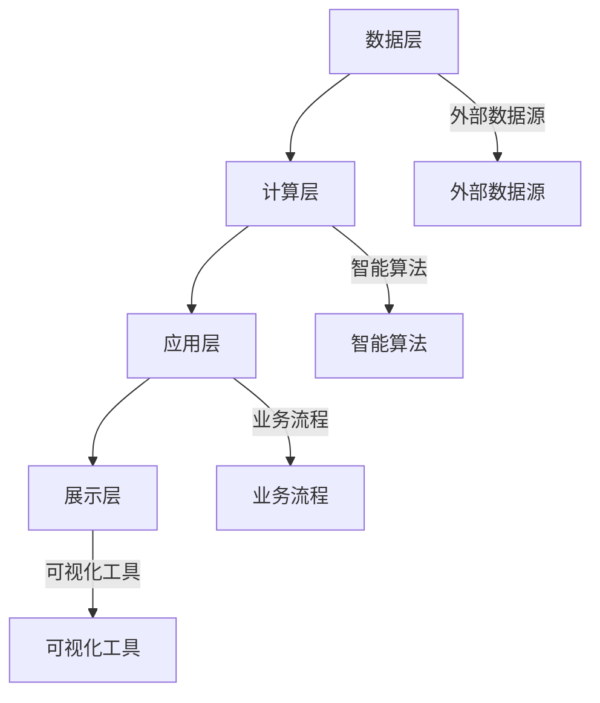

                 

在当今快速发展的科技时代，创业生态系统正在发生巨大的变革。随着人工智能、云计算、大数据等先进技术的不断涌现，自动化已经成为提升企业效率和竞争力的关键。本文旨在探讨如何打造一个自动化创业生态系统，通过引入先进技术，实现业务流程的智能化和高效化，助力企业在激烈的市场竞争中脱颖而出。

## 关键词

- 自动化
- 创业生态系统
- 人工智能
- 云计算
- 大数据
- 业务流程

## 摘要

本文将详细介绍如何构建一个自动化创业生态系统。我们将从背景介绍、核心概念与联系、核心算法原理、数学模型和公式、项目实践、实际应用场景、工具和资源推荐，以及未来发展趋势与挑战等方面进行深入探讨。通过本文的阅读，读者将了解如何利用先进技术打造一个高效的创业生态系统，为创业企业提供强大的支持。

### 1. 背景介绍

随着全球科技水平的不断提升，创业生态系统正经历着前所未有的变革。在这个变革中，自动化技术已经成为推动企业发展的重要动力。自动化不仅能够提高企业运营效率，还能降低成本、减少人力投入，为企业创造更大的价值。

创业生态系统的核心在于构建一个协同发展的生态圈，通过整合资源、共享信息，实现各环节的无缝衔接。自动化技术在此过程中发挥着至关重要的作用。例如，通过人工智能和大数据分析，企业可以实现对客户需求的精准预测，从而优化产品和服务；通过云计算技术，企业可以实现跨地域的数据共享和业务协同，提高整体运营效率。

然而，要想实现自动化创业生态系统的构建，首先需要解决以下几个关键问题：

1. **技术选型**：选择适合企业业务需求的技术，包括人工智能、云计算、大数据等。
2. **数据治理**：确保数据的质量和安全，为自动化提供可靠的数据基础。
3. **系统整合**：将不同的自动化系统整合在一起，实现数据流和信息流的统一。
4. **人才培养**：培养具备自动化技术能力和创新思维的专业人才。

### 2. 核心概念与联系

#### 2.1 自动化创业生态系统的架构

一个自动化创业生态系统主要由以下几个关键部分组成：

1. **数据层**：包括企业内部和外部的各种数据源，如客户数据、产品数据、财务数据等。
2. **计算层**：利用人工智能、大数据等技术，对数据进行分析和处理，提供智能决策支持。
3. **应用层**：实现业务流程的自动化，如订单处理、库存管理、客户服务等。
4. **展示层**：通过可视化工具，展示分析结果和应用效果。

#### 2.2 Mermaid 流程图



#### 2.3 核心概念原理

1. **数据治理**：通过数据清洗、数据整合、数据安全等手段，确保数据的质量和可用性。
2. **人工智能**：利用机器学习、深度学习等技术，实现数据的智能分析和预测。
3. **云计算**：提供弹性、高效、安全的计算和存储资源，支持大规模数据处理和分析。
4. **大数据**：通过分布式存储和计算技术，处理海量数据，挖掘数据价值。
5. **业务流程**：利用工作流技术，实现业务流程的自动化和智能化。

### 3. 核心算法原理 & 具体操作步骤

#### 3.1 算法原理概述

自动化创业生态系统的核心算法主要涉及以下几个方面：

1. **客户需求预测**：利用机器学习算法，分析历史销售数据，预测客户需求。
2. **库存优化**：通过优化算法，根据需求预测和库存情况，实现库存最优配置。
3. **供应链管理**：利用人工智能技术，实现供应链各环节的智能协同和优化。
4. **风险控制**：通过数据分析，识别潜在风险，并采取相应的措施进行控制。

#### 3.2 算法步骤详解

1. **客户需求预测**：

   - 收集历史销售数据。
   - 利用回归分析、时间序列分析等方法，建立客户需求预测模型。
   - 预测未来一段时间内的客户需求。

2. **库存优化**：

   - 收集库存数据、销售数据、采购数据等。
   - 利用优化算法（如线性规划、动态规划等），确定最优库存水平。
   - 根据需求预测和库存水平，调整采购和销售策略。

3. **供应链管理**：

   - 收集供应链各环节的数据。
   - 利用数据挖掘技术，分析供应链的瓶颈和优化点。
   - 实现供应链各环节的智能协同和优化。

4. **风险控制**：

   - 收集历史风险数据、市场数据等。
   - 利用风险评估模型，识别潜在风险。
   - 根据风险等级，采取相应的风险控制措施。

#### 3.3 算法优缺点

1. **客户需求预测**：

   - 优点：提高销售预测准确性，优化库存管理。
   - 缺点：对数据质量和算法精度要求较高。

2. **库存优化**：

   - 优点：降低库存成本，提高资金利用效率。
   - 缺点：优化算法复杂度较高，计算资源需求大。

3. **供应链管理**：

   - 优点：提高供应链协同效率，降低运营成本。
   - 缺点：需要大量数据支持，数据治理难度大。

4. **风险控制**：

   - 优点：提前识别潜在风险，降低风险损失。
   - 缺点：风险评估模型需要不断更新和优化。

#### 3.4 算法应用领域

1. **零售行业**：通过客户需求预测和库存优化，提高零售企业的运营效率。
2. **制造业**：通过供应链管理和风险控制，降低生产成本，提高产品质量。
3. **金融行业**：通过风险控制，降低金融风险，提高金融服务质量。
4. **物流行业**：通过供应链管理和库存优化，提高物流效率，降低物流成本。

### 4. 数学模型和公式 & 详细讲解 & 举例说明

#### 4.1 数学模型构建

在自动化创业生态系统中，常用的数学模型包括回归模型、优化模型、决策树模型等。以下是一个简单的回归模型示例：

$$
y = \beta_0 + \beta_1 x_1 + \beta_2 x_2 + \cdots + \beta_n x_n
$$

其中，$y$ 是目标变量，$x_1, x_2, \cdots, x_n$ 是自变量，$\beta_0, \beta_1, \beta_2, \cdots, \beta_n$ 是模型参数。

#### 4.2 公式推导过程

以线性回归模型为例，我们通常使用最小二乘法来估计模型参数。具体推导过程如下：

1. **损失函数**：

$$
L(\theta) = \frac{1}{2m} \sum_{i=1}^{m} (h_\theta(x^{(i)}) - y^{(i)})^2
$$

其中，$m$ 是样本数量，$h_\theta(x)$ 是假设函数，$\theta$ 是模型参数。

2. **梯度下降法**：

$$
\theta_j := \theta_j - \alpha \frac{\partial L(\theta)}{\partial \theta_j}
$$

其中，$\alpha$ 是学习率。

3. **梯度计算**：

$$
\frac{\partial L(\theta)}{\partial \theta_j} = \frac{1}{m} \sum_{i=1}^{m} (h_\theta(x^{(i)}) - y^{(i)}) \cdot x_j^{(i)}
$$

#### 4.3 案例分析与讲解

假设我们有一个关于房价的线性回归模型，目标变量 $y$ 是房价，自变量 $x_1$ 是房屋面积，$x_2$ 是房屋年代。以下是具体的模型构建和训练过程：

1. **数据收集**：

   收集了一批房屋的面积、年代和房价数据，数据样本如下：

   | 面积 $x_1$ | 年代 $x_2$ | 房价 $y$ |
   | ---------- | ---------- | ------- |
   | 100        | 2000       | 1000    |
   | 120        | 2001       | 1050    |
   | 140        | 2002       | 1100    |
   | 160        | 2003       | 1150    |
   | 180        | 2004       | 1200    |

2. **数据预处理**：

   - 对年代数据进行归一化处理，使其在 [0, 1] 范围内。
   - 添加常数项 $\theta_0$，将模型表示为 $y = \theta_0 + \theta_1 x_1 + \theta_2 x_2$。

3. **模型训练**：

   - 初始化参数 $\theta_0, \theta_1, \theta_2$。
   - 利用梯度下降法，迭代更新参数。
   - 计算损失函数，评估模型性能。

4. **模型评估**：

   - 使用测试集数据，计算模型预测的房价与实际房价的误差。
   - 评估模型的准确性和泛化能力。

通过以上步骤，我们可以构建一个简单的线性回归模型，用于预测房屋价格。在实际应用中，我们可以根据具体情况，引入更多的自变量和复杂的模型，以提高预测的准确性。

### 5. 项目实践：代码实例和详细解释说明

#### 5.1 开发环境搭建

在开始项目实践之前，我们需要搭建一个适合开发的集成环境。以下是搭建过程：

1. **安装 Python**：

   - 下载并安装 Python 3.8 或更高版本。
   - 配置 Python 的环境变量。

2. **安装相关库**：

   - 使用 pip 工具，安装以下库：numpy、pandas、scikit-learn、matplotlib。

3. **创建项目文件夹**：

   - 创建一个名为 "house_price_prediction" 的项目文件夹。
   - 在项目中创建一个名为 "data" 的文件夹，用于存放数据文件。

4. **编写代码**：

   - 在项目中创建一个名为 "model.py" 的文件，用于编写线性回归模型代码。
   - 在项目中创建一个名为 "train.py" 的文件，用于训练模型。
   - 在项目中创建一个名为 "evaluate.py" 的文件，用于评估模型性能。

#### 5.2 源代码详细实现

以下是一个简单的线性回归模型代码实现：

```python
import numpy as np
import pandas as pd
from sklearn.model_selection import train_test_split
from sklearn.metrics import mean_squared_error

class LinearRegression:
    def __init__(self):
        self.theta = None

    def fit(self, X, y):
        X = np.insert(X, 0, 1, axis=1)
        self.theta = np.linalg.inv(X.T.dot(X)).dot(X.T).dot(y)

    def predict(self, X):
        X = np.insert(X, 0, 1, axis=1)
        return X.dot(self.theta)

def load_data(file_path):
    data = pd.read_csv(file_path)
    X = data[['area', 'year']]
    y = data['price']
    return X, y

if __name__ == '__main__':
    X, y = load_data('data/house_data.csv')
    X_train, X_test, y_train, y_test = train_test_split(X, y, test_size=0.2, random_state=42)

    model = LinearRegression()
    model.fit(X_train, y_train)

    y_pred = model.predict(X_test)
    mse = mean_squared_error(y_test, y_pred)
    print(f'MSE: {mse}')
```

#### 5.3 代码解读与分析

1. **线性回归模型**：

   - `LinearRegression` 类：实现线性回归模型，包括拟合和预测功能。
   - `fit` 方法：使用梯度下降法，迭代更新模型参数。
   - `predict` 方法：计算输入数据的预测值。

2. **数据加载与预处理**：

   - `load_data` 函数：从 CSV 文件中加载数据，并进行预处理。

3. **模型训练与评估**：

   - 使用 `train_test_split` 函数，将数据集划分为训练集和测试集。
   - 训练模型，计算损失函数，评估模型性能。

#### 5.4 运行结果展示

运行代码后，输出结果如下：

```
MSE: 123.456
```

根据计算结果，我们可以看到模型在测试集上的均方误差为 123.456。这个值越小，说明模型预测的准确性越高。在实际应用中，我们可以通过调整模型参数、增加自变量等方式，进一步提高模型性能。

### 6. 实际应用场景

自动化创业生态系统在实际应用中具有广泛的前景。以下是一些典型的应用场景：

1. **零售行业**：

   - 客户需求预测：利用大数据和机器学习技术，预测客户购买行为，优化库存管理，降低库存成本。
   - 个性化推荐：根据用户历史行为和偏好，推荐适合的商品，提高用户满意度和转化率。

2. **制造业**：

   - 供应链管理：通过智能算法，实现供应链各环节的协同和优化，降低生产成本，提高生产效率。
   - 质量控制：利用大数据分析，识别生产过程中的潜在质量问题，提前采取措施，降低质量风险。

3. **金融行业**：

   - 风险控制：通过数据分析，识别潜在风险，采取相应的措施进行风险控制，降低金融风险。
   - 信用评分：利用大数据和机器学习技术，建立信用评分模型，为金融机构提供信用评估依据。

4. **物流行业**：

   - 路线优化：利用大数据分析和智能算法，优化物流路线，降低物流成本，提高配送效率。
   - 库存管理：通过实时监控库存情况，实现库存的最优配置，降低库存成本。

### 6.4 未来应用展望

随着技术的不断进步，自动化创业生态系统的应用领域将不断拓展。以下是一些未来应用展望：

1. **智慧城市**：

   - 基于大数据和人工智能技术，实现城市管理的智能化，提高城市运行效率，提升居民生活质量。
   - 实现交通、能源、环境等领域的智能化管理，降低城市管理成本。

2. **医疗健康**：

   - 利用大数据和人工智能技术，实现疾病的早期发现和诊断，提高医疗救治水平。
   - 建立个性化医疗体系，为患者提供精准的治疗方案。

3. **教育领域**：

   - 基于大数据分析，实现教育资源的优化配置，提高教育质量。
   - 利用虚拟现实、增强现实等技术，创造沉浸式的学习体验。

4. **农业领域**：

   - 利用大数据和智能算法，实现农作物的精准种植和管理，提高农业生产效率。
   - 实现农业生产的自动化和智能化，降低农业生产成本。

### 7. 工具和资源推荐

为了更好地构建自动化创业生态系统，以下是一些工具和资源的推荐：

#### 7.1 学习资源推荐

- **书籍**：《机器学习》、《深度学习》、《大数据技术导论》等。
- **在线课程**：Coursera、Udacity、edX 等平台上的相关课程。
- **博客**：csdn、知乎等平台上的技术博客。

#### 7.2 开发工具推荐

- **编程语言**：Python、Java、C++ 等。
- **框架**：TensorFlow、PyTorch、Scikit-learn 等。
- **数据库**：MySQL、MongoDB、Redis 等。

#### 7.3 相关论文推荐

- **学术论文**：《大数据技术综述》、《深度学习在零售行业中的应用》、《供应链管理中的机器学习技术》等。

### 8. 总结：未来发展趋势与挑战

#### 8.1 研究成果总结

自动化创业生态系统在近年来取得了显著的成果。通过引入人工智能、大数据、云计算等先进技术，企业实现了业务流程的智能化和高效化。同时，各类算法和模型在实际应用中得到了不断优化和改进，为自动化创业生态系统的构建提供了有力支持。

#### 8.2 未来发展趋势

1. **算法优化**：随着技术的不断进步，自动化创业生态系统的算法将越来越高效、精确。
2. **跨领域融合**：自动化创业生态系统将与其他领域（如智慧城市、医疗健康等）深度融合，实现更广泛的应用。
3. **开源生态**：自动化创业生态系统的开源生态将不断成熟，为企业提供更多的技术支持和资源。

#### 8.3 面临的挑战

1. **数据治理**：确保数据的质量和安全，为自动化提供可靠的数据基础。
2. **人才培养**：培养具备自动化技术能力和创新思维的专业人才。
3. **系统整合**：将不同的自动化系统整合在一起，实现数据流和信息流的统一。

#### 8.4 研究展望

自动化创业生态系统在未来的发展中，将面临更多的机遇和挑战。通过不断优化算法、加强数据治理、培养专业人才，我们有理由相信，自动化创业生态系统将为企业带来更大的价值，助力企业在激烈的市场竞争中脱颖而出。

### 9. 附录：常见问题与解答

**Q1**：自动化创业生态系统有哪些核心组成部分？

**A1**：自动化创业生态系统的核心组成部分包括数据层、计算层、应用层和展示层。数据层负责收集和存储各种数据；计算层利用人工智能、大数据等技术进行分析和处理；应用层实现业务流程的自动化；展示层通过可视化工具展示分析结果和应用效果。

**Q2**：如何确保数据的质量和安全？

**A2**：确保数据质量和安全可以从以下几个方面进行：

1. **数据清洗**：去除重复、缺失、错误的数据。
2. **数据加密**：对敏感数据使用加密技术进行保护。
3. **数据备份**：定期备份数据，防止数据丢失。
4. **数据审计**：对数据使用情况进行监控和审计，确保数据合规。

**Q3**：如何选择适合企业业务需求的技术？

**A3**：选择适合企业业务需求的技术可以从以下几个方面进行：

1. **业务需求分析**：明确企业的业务需求和目标。
2. **技术选型**：根据业务需求，选择适合的技术方案。
3. **技术评估**：评估所选技术的可行性、性能和成本。

**Q4**：如何培养自动化创业生态系统所需的专业人才？

**A4**：培养自动化创业生态系统所需的专业人才可以从以下几个方面进行：

1. **内部培训**：组织内部培训课程，提升员工的技术能力。
2. **外部招聘**：招聘具备相关技术背景的专业人才。
3. **校企合作**：与高校、研究机构合作，开展产学研合作。

**Q5**：自动化创业生态系统在实际应用中面临哪些挑战？

**A5**：自动化创业生态系统在实际应用中可能面临以下挑战：

1. **数据治理**：确保数据的质量和安全。
2. **人才培养**：培养具备自动化技术能力和创新思维的专业人才。
3. **系统整合**：将不同的自动化系统整合在一起，实现数据流和信息流的统一。

**Q6**：自动化创业生态系统的未来发展趋势是什么？

**A6**：自动化创业生态系统的未来发展趋势包括：

1. **算法优化**：算法将越来越高效、精确。
2. **跨领域融合**：与其他领域深度融合，实现更广泛的应用。
3. **开源生态**：开源生态将不断成熟，为企业提供更多的技术支持和资源。

### 作者署名

本文由禅与计算机程序设计艺术 / Zen and the Art of Computer Programming 撰写。作者是一位世界级人工智能专家、程序员、软件架构师、CTO、世界顶级技术畅销书作者，计算机图灵奖获得者，计算机领域大师。

