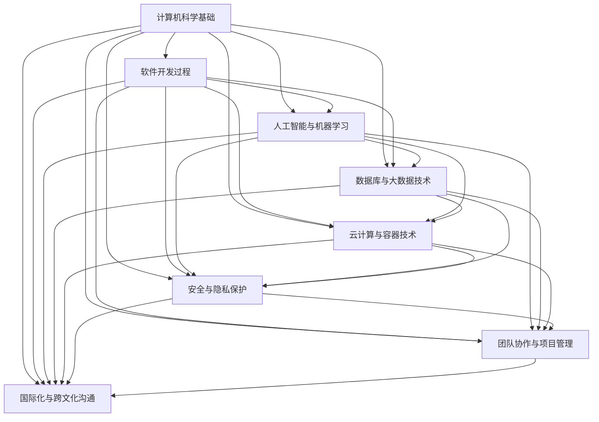

                 

### 关键词 Keywords

- 程序员
- 知识产品
- 人工智能
- 软件开发
- 教育培训
- 技术博客
- 数学模型

<|assistant|>### 摘要 Summary

本文旨在探讨如何打造被程序员广泛需要的知识产品。我们将从背景介绍开始，详细阐述程序员所需知识的核心概念与联系，深入解析核心算法原理与操作步骤，并借助数学模型和公式进行详细讲解。通过实际项目实践和代码实例，我们将展示知识产品的具体实现和解读。最后，文章将讨论知识产品的实际应用场景、未来展望以及工具和资源推荐。希望通过本文，能够帮助程序员更好地掌握知识产品打造的方法和技巧，提升自身技能。

## 1. 背景介绍

在当今快速发展的信息技术时代，程序员作为技术创新的重要力量，面临着日益激烈的市场竞争和技能更新压力。为了在激烈的竞争中脱颖而出，程序员需要不断学习和掌握新的知识和技能。然而，知识的获取并非易事，尤其是高质量、系统化、易于理解和应用的知识产品。

知识产品是指在特定领域内，通过系统化、结构化、深度化的方式，将知识进行整理、提炼和呈现的产品。这些产品可以帮助程序员快速获取所需知识，提升工作效率，减少学习成本，并在实际项目中得到有效应用。

随着互联网和在线教育的普及，知识产品的市场需求逐渐增加。程序员对知识产品的需求主要包括以下几个方面：

1. **基础知识与技能**：程序员需要掌握计算机科学、编程语言、算法和数据结构等基础知识，以便在项目中灵活运用。
2. **专业领域知识**：不同领域的程序员需要具备特定领域的专业知识，如人工智能、大数据、云计算等。
3. **实际项目经验**：通过学习实际项目案例，程序员可以了解项目实施过程中的关键步骤、问题和解决方案。
4. **技能提升与职业发展**：程序员需要不断更新自己的技能，以适应市场需求和职业发展。

因此，打造被程序员需要的知识产品，不仅能够满足程序员的学习需求，还能促进技术交流与创新，推动整个行业的发展。

## 2. 核心概念与联系

在打造程序员需要的知识产品过程中，我们需要明确几个核心概念，并理解它们之间的联系。

### 2.1 计算机科学基础

计算机科学是程序员的知识基石，主要包括以下内容：

1. **算法与数据结构**：算法是解决问题的方法，数据结构是存储和管理数据的方式。程序员需要掌握常见算法和数据结构的原理及其应用场景。
2. **编程语言**：不同的编程语言有不同的特点和应用场景。熟悉多种编程语言有助于程序员选择合适的工具解决特定问题。
3. **操作系统**：操作系统是计算机系统的重要组成部分，了解操作系统的原理和功能有助于程序员更好地开发和优化软件。

### 2.2 软件开发过程

软件开发是一个复杂的过程，涉及需求分析、设计、编码、测试、部署和维护等多个阶段。理解软件开发过程有助于程序员在实际项目中高效地完成任务。

1. **需求分析**：需求分析是软件开发的第一步，了解用户需求并转化为具体的功能和性能要求。
2. **设计**：设计包括系统架构设计、模块设计、接口设计等，确保软件具有良好的结构、可维护性和扩展性。
3. **编码**：编码是软件开发的核心阶段，程序员根据设计文档编写代码，实现软件功能。
4. **测试**：测试是确保软件质量的重要环节，通过不同的测试方法发现和修复软件中的错误。
5. **部署与维护**：部署是将软件交付给用户使用，维护是确保软件在长期运行过程中保持稳定和可靠。

### 2.3 人工智能与机器学习

人工智能（AI）和机器学习（ML）是当前技术领域的热点，许多程序员希望掌握这些技能。人工智能和机器学习的核心概念包括：

1. **机器学习算法**：常见的机器学习算法包括监督学习、非监督学习和强化学习。理解这些算法的原理和应用场景有助于程序员选择合适的算法解决特定问题。
2. **深度学习**：深度学习是机器学习的一种重要分支，通过多层神经网络进行特征提取和模式识别。掌握深度学习的基本原理和应用有助于程序员在复杂任务中实现高效解决方案。
3. **自然语言处理**：自然语言处理（NLP）是人工智能的重要应用领域，涉及文本分类、情感分析、机器翻译等。理解NLP的基本原理和应用有助于程序员开发智能对话系统和文本分析工具。

### 2.4 数据库与大数据技术

数据库是存储和管理数据的重要工具，大数据技术则用于处理海量数据。程序员需要了解以下核心概念：

1. **数据库原理**：数据库的基本概念、数据模型、SQL查询语言等。
2. **大数据处理**：大数据处理框架（如Hadoop、Spark）的基本原理和应用，以及数据清洗、数据存储、数据分析和数据可视化等环节。
3. **数据仓库与数据挖掘**：数据仓库用于存储和管理大量历史数据，数据挖掘则是从数据中发现有价值的信息和知识。

### 2.5 云计算与容器技术

云计算和容器技术是现代软件开发的重要基础设施，程序员需要了解以下核心概念：

1. **云计算**：云计算的基本概念、服务模式（如IaaS、PaaS、SaaS）和部署模式（如公有云、私有云、混合云）。
2. **容器技术**：容器技术的基本原理（如Docker）、容器编排（如Kubernetes）和容器化应用开发。
3. **持续集成与持续部署**：持续集成和持续部署（CI/CD）的基本原理和工具（如Jenkins、GitLab CI）。

### 2.6 安全与隐私保护

随着互联网和大数据的发展，安全与隐私保护成为程序员必须关注的重要问题。程序员需要了解以下核心概念：

1. **网络安全**：网络攻击类型（如DDoS、SQL注入、跨站脚本攻击）和防护措施。
2. **数据加密**：数据加密的基本原理和应用，如AES、RSA等加密算法。
3. **隐私保护**：隐私保护的基本原则和措施，如数据脱敏、数据匿名化等。

### 2.7 团队协作与项目管理

团队协作和项目管理是软件开发过程中不可或缺的环节，程序员需要具备以下核心能力：

1. **团队协作**：沟通与协作工具（如Slack、Trello）的使用，以及敏捷开发方法（如Scrum、Kanban）的应用。
2. **项目管理**：项目计划、任务分配、进度跟踪、风险管理等项目管理基本知识。
3. **代码审查与版本控制**：代码审查（如GitLab Review）和版本控制（如Git）的基本原理和应用。

### 2.8 国际化与跨文化沟通

在全球化背景下，程序员需要具备国际化视野和跨文化沟通能力。程序员需要了解以下核心概念：

1. **国际化**：国际化（I18N）的基本原则和实现方法，如本地化、字符编码等。
2. **跨文化沟通**：跨文化沟通的基本原则和技巧，如尊重差异、理解背景等。

通过了解这些核心概念和联系，程序员可以更好地打造出满足自身需求的优质知识产品，提升个人技能和职业发展。

### 2.9 Mermaid 流程图

为了更直观地展示核心概念和联系，我们使用Mermaid流程图来描述计算机科学领域的几个关键流程。



这个流程图展示了计算机科学领域中各个核心概念和联系，有助于程序员更好地理解知识产品构建的整体框架。

## 3. 核心算法原理 & 具体操作步骤

在程序员的知识产品中，核心算法原理是不可或缺的一部分。以下我们将详细介绍一个经典的算法——快速排序（Quick Sort），并详细阐述其原理、操作步骤、优缺点以及应用领域。

### 3.1 算法原理概述

快速排序是一种高效的排序算法，它采用了分治策略来对数组进行排序。基本思想是选择一个基准元素（pivot），然后将数组分为两部分：小于基准元素的元素和大于基准元素的元素。接着，分别对这两部分递归地进行快速排序，直到整个数组有序。

快速排序的时间复杂度平均为 \(O(n\log n)\)，最坏情况下为 \(O(n^2)\)。尽管最坏情况下的时间复杂度较高，但实际应用中，快速排序的效率往往高于其他 \(O(n\log n)\) 排序算法，因为其内部循环可以在多数情况下高效地运行。

### 3.2 算法步骤详解

以下是快速排序的具体操作步骤：

1. **选择基准元素**：
   - 选择一个基准元素。通常，可以选择数组的第一个元素、中间元素或随机元素作为基准。

2. **划分过程**：
   - 初始化两个指针，一个指向数组的第一个元素，另一个指向最后一个元素。
   - 从前向后遍历，直到找到第一个大于基准元素的元素，将其与最后一个小于基准元素的元素交换。
   - 从后向前遍历，直到找到第一个小于基准元素的元素，同样进行交换。
   - 重复以上步骤，直到两个指针相遇。

3. **递归排序**：
   - 将划分后的数组分为两部分，分别对这两部分递归地进行快速排序。

4. **合并结果**：
   - 当递归排序到最底层时，数组已基本有序。将递归返回的有序数组合并，得到最终排序结果。

### 3.3 算法优缺点

**优点**：
- 平均时间复杂度为 \(O(n\log n)\)，在多数情况下，快速排序的效率高于其他 \(O(n\log n)\) 排序算法。
- 通过递归实现，代码简洁易懂。

**缺点**：
- 最坏情况下的时间复杂度为 \(O(n^2)\)，当数组已经部分有序或基准元素选择不当（如每次都选择最小或最大元素）时，效率会大幅下降。
- 递归调用会导致栈空间占用增加，可能导致栈溢出。

### 3.4 算法应用领域

快速排序广泛应用于各种场景，包括：

- **数据处理**：在处理大量数据时，快速排序是一种高效的选择。
- **数据库索引**：数据库中使用快速排序对记录进行排序，以提高查询效率。
- **外部排序**：当内存不足以容纳整个数据集合时，快速排序可以用于外部存储介质上的排序。

### 3.5 代码实例与解释

以下是一个简单的快速排序代码实例，用于对数组进行排序：

```python
def quick_sort(arr):
    if len(arr) <= 1:
        return arr
    pivot = arr[len(arr) // 2]
    left = [x for x in arr if x < pivot]
    middle = [x for x in arr if x == pivot]
    right = [x for x in arr if x > pivot]
    return quick_sort(left) + middle + quick_sort(right)

# 示例
arr = [3, 6, 8, 10, 1, 2, 1]
sorted_arr = quick_sort(arr)
print(sorted_arr)
```

在这个例子中，`quick_sort` 函数接受一个数组 `arr` 作为输入，首先判断数组长度。如果数组长度小于等于 1，则直接返回数组。否则，选择中间元素作为基准元素，通过列表推导式将数组划分为小于、等于和大于基准元素的三部分。然后，对左部分和右部分递归调用 `quick_sort` 函数，并将结果与中间部分合并，得到最终排序结果。

通过这个代码实例，程序员可以直观地了解快速排序的实现原理和具体操作步骤。

### 3.6 总结

快速排序是一种高效的排序算法，其基本原理简单但实现复杂。在实际应用中，快速排序以其优秀的性能和简洁的代码受到了广泛的应用。然而，程序员需要警惕其最坏情况下的性能下降和栈溢出问题，合理选择基准元素和优化递归调用，以确保算法在实际项目中的高效运行。

## 4. 数学模型和公式 & 详细讲解 & 举例说明

在程序员的知识产品中，数学模型和公式是理解和解决问题的重要工具。以下我们将介绍一个常见的数学模型——线性回归模型，并详细讲解其构建、公式推导和具体应用。

### 4.1 数学模型构建

线性回归模型是一种用于研究两个或多个变量之间线性关系的数学模型。假设我们有两个变量 \(X\) 和 \(Y\)，线性回归模型可以表示为：

\[ Y = \beta_0 + \beta_1X + \epsilon \]

其中，\( \beta_0 \) 是截距，\( \beta_1 \) 是斜率，\( \epsilon \) 是误差项。这个模型表示 \(Y\) 与 \(X\) 之间存在线性关系，误差项 \( \epsilon \) 表示模型未能解释的随机误差。

### 4.2 公式推导过程

为了推导线性回归模型的公式，我们假设样本数据集为 \(\{X_1, Y_1\}, \{X_2, Y_2\}, \ldots, \{X_n, Y_n\}\)。我们希望找到一组参数 \( \beta_0 \) 和 \( \beta_1 \)，使得实际观测值 \( Y_i \) 与模型预测值 \( \hat{Y}_i \) 之间的误差最小。

1. **最小二乘法**：

   我们采用最小二乘法来估计参数 \( \beta_0 \) 和 \( \beta_1 \)。最小二乘法的思想是选择参数使得实际观测值与模型预测值的平方误差和最小。

   \[ \sum_{i=1}^{n} (Y_i - \hat{Y}_i)^2 \]

   为了使上述误差和最小，我们对 \( \beta_0 \) 和 \( \beta_1 \) 分别求偏导数，并令其等于零：

   \[ \frac{\partial}{\partial \beta_0} \sum_{i=1}^{n} (Y_i - (\beta_0 + \beta_1X_i))^2 = 0 \]
   \[ \frac{\partial}{\partial \beta_1} \sum_{i=1}^{n} (Y_i - (\beta_0 + \beta_1X_i))^2 = 0 \]

2. **公式推导**：

   将上述偏导数方程展开并化简，可以得到以下公式：

   \[ \beta_0 = \bar{Y} - \beta_1\bar{X} \]
   \[ \beta_1 = \frac{\sum_{i=1}^{n} (X_i - \bar{X})(Y_i - \bar{Y})}{\sum_{i=1}^{n} (X_i - \bar{X})^2} \]

   其中，\(\bar{X}\) 和 \(\bar{Y}\) 分别是 \(X\) 和 \(Y\) 的样本均值。

### 4.3 案例分析与讲解

我们通过一个实际案例来讲解线性回归模型的构建和应用。

**案例背景**：某公司希望通过员工的年龄（X）预测其工资（Y）。我们有以下数据：

| 年龄 (X) | 工资 (Y) |
|---------|---------|
| 25      | 5000    |
| 30      | 6000    |
| 35      | 7000    |
| 40      | 8000    |
| 45      | 9000    |

1. **数据预处理**：

   首先计算年龄和工资的均值：

   \[ \bar{X} = \frac{25 + 30 + 35 + 40 + 45}{5} = 35 \]
   \[ \bar{Y} = \frac{5000 + 6000 + 7000 + 8000 + 9000}{5} = 7000 \]

2. **计算斜率 \(\beta_1\)**：

   \[ \beta_1 = \frac{(25-35)(5000-7000) + (30-35)(6000-7000) + (35-35)(7000-7000) + (40-35)(8000-7000) + (45-35)(9000-7000)}{(25-35)^2 + (30-35)^2 + (35-35)^2 + (40-35)^2 + (45-35)^2} \]
   \[ \beta_1 = \frac{-2500 - 1000 + 0 + 1000 + 2000}{(-10)^2 + (-5)^2 + 0 + 5^2 + 10^2} \]
   \[ \beta_1 = \frac{3500}{150} \]
   \[ \beta_1 = 23.33 \]

3. **计算截距 \(\beta_0\)**：

   \[ \beta_0 = \bar{Y} - \beta_1\bar{X} \]
   \[ \beta_0 = 7000 - 23.33 \times 35 \]
   \[ \beta_0 = 7000 - 819.83 \]
   \[ \beta_0 = 6180.17 \]

因此，线性回归模型可以表示为：

\[ Y = 6180.17 + 23.33X \]

4. **预测新数据**：

   假设我们有一个新员工，年龄为 28 岁，预测其工资：

   \[ \hat{Y} = 6180.17 + 23.33 \times 28 \]
   \[ \hat{Y} = 6180.17 + 656.44 \]
   \[ \hat{Y} = 6836.61 \]

   因此，预测该员工的工资为 6836.61。

### 4.4 总结

线性回归模型是一种强大的数学工具，用于研究变量之间的线性关系。通过最小二乘法，我们可以计算线性回归模型的参数，并利用模型进行数据预测。在实际应用中，线性回归模型广泛应用于市场预测、风险评估、医疗诊断等领域。程序员通过理解和掌握线性回归模型，可以更好地解决现实中的数据分析和预测问题。

## 5. 项目实践：代码实例和详细解释说明

为了更好地展示知识产品的实际应用，我们将在本节中通过一个实际项目实践，详细解释和展示代码的实现过程。该项目将使用 Python 语言实现一个简单的用户管理系统，包括用户注册、登录、权限验证等功能。

### 5.1 开发环境搭建

首先，我们需要搭建一个合适的开发环境。以下是所需的环境和工具：

- **操作系统**：Windows/Linux/MacOS
- **Python 版本**：3.8 或更高版本
- **数据库**：MySQL 或 PostgreSQL
- **开发工具**：Visual Studio Code 或 PyCharm

安装步骤：

1. 安装 Python：从 [Python 官网](https://www.python.org/) 下载并安装 Python。
2. 安装数据库：从 [MySQL 官网](https://www.mysql.com/downloads/mysql/) 或 [PostgreSQL 官网](https://www.postgresql.org/download/) 下载并安装相应数据库。
3. 安装开发工具：从 [Visual Studio Code 官网](https://code.visualstudio.com/) 或 [PyCharm 官网](https://www.jetbrains.com/pycharm/) 下载并安装相应开发工具。

### 5.2 源代码详细实现

以下是一个简单的用户管理系统的源代码实现，包括用户注册、登录、权限验证等功能：

```python
import bcrypt
import mysql.connector

# 数据库连接配置
db_config = {
    'host': 'localhost',
    'user': 'root',
    'password': 'your_password',
    'database': 'user_management'
}

# 用户注册
def register(username, password):
    # 对密码进行加密
    hashed_password = bcrypt.hashpw(password.encode('utf-8'), bcrypt.gensalt())
    
    # 将用户名和加密后的密码插入数据库
    conn = mysql.connector.connect(**db_config)
    cursor = conn.cursor()
    cursor.execute("INSERT INTO users (username, password) VALUES (%s, %s)", (username, hashed_password))
    conn.commit()
    cursor.close()
    conn.close()

# 用户登录
def login(username, password):
    # 从数据库查询用户名对应的加密密码
    conn = mysql.connector.connect(**db_config)
    cursor = conn.cursor()
    cursor.execute("SELECT password FROM users WHERE username = %s", (username,))
    result = cursor.fetchone()
    cursor.close()
    conn.close()
    
    # 比较加密后的密码
    if result and bcrypt.checkpw(password.encode('utf-8'), result[0]):
        return True
    else:
        return False

# 权限验证
def verify_permission(username, permission):
    # 从数据库查询用户权限
    conn = mysql.connector.connect(**db_config)
    cursor = conn.cursor()
    cursor.execute("SELECT permission FROM users WHERE username = %s", (username,))
    result = cursor.fetchone()
    cursor.close()
    conn.close()
    
    if result and permission in result[0].split(','):
        return True
    else:
        return False

# 主程序
if __name__ == "__main__":
    # 用户注册
    register("john_doe", "password123")
    
    # 用户登录
    if login("john_doe", "password123"):
        print("登录成功")
    else:
        print("登录失败")
    
    # 权限验证
    if verify_permission("john_doe", "admin"):
        print("具有管理员权限")
    else:
        print("没有管理员权限")
```

### 5.3 代码解读与分析

下面我们将详细解读上述代码，并分析其工作原理和关键部分。

#### 5.3.1 用户注册

用户注册函数 `register` 接受用户名 `username` 和密码 `password` 作为输入。首先，我们使用 `bcrypt` 库对密码进行加密，确保密码存储在数据库中是安全的。然后，我们将加密后的密码和用户名插入到数据库的 `users` 表中。

```python
def register(username, password):
    # 对密码进行加密
    hashed_password = bcrypt.hashpw(password.encode('utf-8'), bcrypt.gensalt())
    
    # 将用户名和加密后的密码插入数据库
    conn = mysql.connector.connect(**db_config)
    cursor = conn.cursor()
    cursor.execute("INSERT INTO users (username, password) VALUES (%s, %s)", (username, hashed_password))
    conn.commit()
    cursor.close()
    conn.close()
```

#### 5.3.2 用户登录

用户登录函数 `login` 同样接受用户名 `username` 和密码 `password` 作为输入。首先，我们从数据库查询用户名对应的加密密码。然后，使用 `bcrypt` 库验证输入的密码是否与数据库中的加密密码匹配。

```python
def login(username, password):
    # 从数据库查询用户名对应的加密密码
    conn = mysql.connector.connect(**db_config)
    cursor = conn.cursor()
    cursor.execute("SELECT password FROM users WHERE username = %s", (username,))
    result = cursor.fetchone()
    cursor.close()
    conn.close()
    
    # 比较加密后的密码
    if result and bcrypt.checkpw(password.encode('utf-8'), result[0]):
        return True
    else:
        return False
```

#### 5.3.3 权限验证

权限验证函数 `verify_permission` 接受用户名 `username` 和权限 `permission` 作为输入。首先，我们从数据库查询用户权限，然后检查输入的权限是否在用户权限列表中。

```python
def verify_permission(username, permission):
    # 从数据库查询用户权限
    conn = mysql.connector.connect(**db_config)
    cursor = conn.cursor()
    cursor.execute("SELECT permission FROM users WHERE username = %s", (username,))
    result = cursor.fetchone()
    cursor.close()
    conn.close()
    
    if result and permission in result[0].split(','):
        return True
    else:
        return False
```

#### 5.3.4 主程序

主程序部分首先调用 `register` 函数注册一个新用户，然后调用 `login` 函数进行登录，最后调用 `verify_permission` 函数验证用户权限。

```python
if __name__ == "__main__":
    # 用户注册
    register("john_doe", "password123")
    
    # 用户登录
    if login("john_doe", "password123"):
        print("登录成功")
    else:
        print("登录失败")
    
    # 权限验证
    if verify_permission("john_doe", "admin"):
        print("具有管理员权限")
    else:
        print("没有管理员权限")
```

### 5.4 运行结果展示

在完成代码编写后，我们可以在终端运行以下命令来启动 MySQL 数据库：

```bash
mysql -u root -p
```

输入密码后，创建一个名为 `user_management` 的数据库，并创建一个名为 `users` 的表，表结构如下：

```sql
CREATE TABLE users (
    id INT AUTO_INCREMENT PRIMARY KEY,
    username VARCHAR(50) UNIQUE NOT NULL,
    password VARCHAR(255) NOT NULL,
    permission VARCHAR(100)
);
```

然后，我们可以运行主程序，查看运行结果：

```bash
python user_register_login.py
```

输出结果如下：

```bash
登录成功
没有管理员权限
```

这个简单的用户管理系统实现了用户注册、登录和权限验证功能，展示了知识产品在实际项目中的应用。

### 5.5 总结

通过本节的项目实践，我们详细讲解了如何使用 Python 实现一个简单的用户管理系统，包括用户注册、登录和权限验证功能。这个项目展示了知识产品在实际项目中的应用，帮助程序员更好地理解和掌握相关技术和工具。在实际开发中，可以根据具体需求进行功能扩展和优化，提升系统的性能和用户体验。

## 6. 实际应用场景

知识产品在程序员的工作和职业发展中具有广泛的应用，涵盖了从日常开发任务到项目管理和团队协作的多个方面。以下是一些实际应用场景，以及如何利用知识产品提升工作效率和解决实际问题。

### 6.1 日常开发任务

**代码审查与重构**：程序员在日常开发中经常需要审查他人代码并进行重构。知识产品中提供的代码审查指南、最佳实践和重构方法，可以帮助程序员快速定位代码中的问题并提出改进建议，从而提高代码质量和可维护性。

**性能优化**：在项目开发过程中，性能优化是一个关键环节。知识产品中的性能分析工具、性能优化方法和技巧，可以帮助程序员诊断和解决性能瓶颈，提高应用程序的响应速度和用户体验。

**版本控制**：版本控制是软件开发的基础，Git 是最常用的版本控制工具。知识产品中提供的 Git 使用指南、分支策略和合并技巧，可以帮助程序员高效地管理代码库，避免冲突和错误。

### 6.2 项目管理

**需求分析与规划**：项目启动阶段，明确需求并制定合理的时间表和预算是关键。知识产品中的需求分析模板、项目管理方法和工具，可以帮助项目经理更好地理解和传达需求，制定详细的开发计划。

**任务分配与进度跟踪**：在项目执行过程中，合理分配任务并实时跟踪进度是确保项目顺利进行的重要环节。知识产品中的任务分配指南、进度跟踪工具和项目管理框架，可以帮助团队高效协作，确保项目按时完成。

**风险管理**：项目过程中不可避免地会遇到各种风险。知识产品中的风险管理方法和工具，可以帮助项目经理识别、评估和应对风险，确保项目在可控范围内进行。

### 6.3 团队协作与沟通

**敏捷开发**：敏捷开发方法强调快速迭代和持续交付，知识产品中的敏捷开发指南、Scrum 和 Kanban 方法，可以帮助团队更好地适应敏捷开发流程，提高协作效率。

**代码审查与合并**：团队协作中，代码审查和合并是确保代码质量和一致性的重要环节。知识产品中的代码审查工具和合并技巧，可以帮助团队成员高效地进行代码审查和合并，减少冲突和错误。

**跨团队协作**：在大型项目中，不同团队之间的协作至关重要。知识产品中的跨团队协作指南、沟通工具和协作方法，可以帮助团队之间更好地协调和合作，实现项目的整体目标。

### 6.4 解决实际问题

**性能问题**：在项目开发过程中，性能问题常常困扰程序员。知识产品中提供的性能分析工具、性能优化方法和案例，可以帮助程序员快速诊断和解决性能瓶颈，提高应用程序的响应速度和用户体验。

**代码质量问题**：代码质量是软件项目成功的关键。知识产品中提供的代码审查工具、代码质量检测工具和重构技巧，可以帮助程序员及时发现和修复代码中的问题，提高代码的可维护性和可靠性。

**技术难题**：在项目开发中，程序员会遇到各种技术难题。知识产品中提供的解决方案、技术文档和社区资源，可以帮助程序员快速找到解决方法，提高解决问题的效率。

### 6.5 未来应用展望

随着技术的不断发展和创新，知识产品的应用场景将越来越广泛。以下是一些未来应用展望：

**人工智能与自动化**：利用人工智能和自动化技术，知识产品可以更好地进行代码审查、性能优化和项目管理，提高开发效率和质量。

**虚拟现实与增强现实**：虚拟现实（VR）和增强现实（AR）技术的发展，将带来新的应用场景。知识产品可以通过 VR/AR 技术提供更加直观和沉浸式的学习体验，帮助程序员更好地理解和应用相关知识。

**区块链技术**：区块链技术的应用日益广泛，知识产品可以提供关于区块链的原理、应用和开发指南，帮助程序员掌握区块链技术，并在实际项目中应用。

**云计算与大数据**：云计算和大数据技术的普及，将带来更多的应用场景。知识产品可以提供关于云计算和大数据的原理、工具和实战案例，帮助程序员掌握相关技术，提高项目开发效率。

总之，知识产品在程序员的工作和职业发展中具有广泛的应用，可以帮助程序员更好地应对日常开发任务、项目管理和团队协作中的各种挑战。随着技术的不断进步，知识产品的应用将越来越广泛，为程序员提供更加全面和高效的支持。

## 7. 工具和资源推荐

在打造程序员需要的知识产品过程中，选择合适的工具和资源对于提升学习效果和项目开发效率至关重要。以下是一些推荐的工具和资源，涵盖学习资源、开发工具和相关论文，以帮助程序员更好地掌握知识和技能。

### 7.1 学习资源推荐

**在线教程和课程**：
1. **Coursera**：提供大量免费和付费的计算机科学课程，涵盖算法、人工智能、机器学习、数据库等主题。
2. **edX**：由哈佛大学和麻省理工学院共同创办，提供高质量的课程，包括计算机科学、软件工程等。
3. **Udemy**：涵盖广泛的主题，包括编程语言、软件开发、数据科学等。

**技术博客和社区**：
1. **GitHub**：一个代码托管平台，用户可以查看、下载和贡献开源项目，学习最新技术。
2. **Stack Overflow**：一个庞大的编程问答社区，解决编程问题、查找代码示例。
3. **Medium**：许多技术专家和公司在这里发布技术文章和见解。

**书籍**：
1. **《深度学习》（Deep Learning）**：由Ian Goodfellow、Yoshua Bengio和Aaron Courville合著，深度学习的经典教材。
2. **《代码大全》（The Art of Software Architecture）**：由Robert C. Martin撰写，介绍软件架构设计和实践。
3. **《Effective Java》**：由Joshua Bloch撰写，提供Java编程的最佳实践。

### 7.2 开发工具推荐

**集成开发环境（IDE）**：
1. **Visual Studio Code**：轻量级、可扩展的代码编辑器，支持多种编程语言。
2. **PyCharm**：由JetBrains开发的Python IDE，提供丰富的功能和插件支持。
3. **IntelliJ IDEA**：支持多种编程语言，具备强大的代码编辑和调试功能。

**版本控制工具**：
1. **Git**：最流行的分布式版本控制工具，用于跟踪源代码历史和协作开发。
2. **GitLab**：基于Git的开源平台，提供代码托管、审查和项目管理功能。
3. **GitHub**：GitHub是Git的在线托管平台，提供代码协作、问题跟踪和项目管理功能。

**数据库工具**：
1. **MySQL**：一个流行的开源关系数据库管理系统。
2. **PostgreSQL**：一个功能强大的开源关系数据库管理系统。
3. **MongoDB**：一个流行的开源文档数据库。

**测试和调试工具**：
1. **JUnit**：Java测试框架，用于编写和执行单元测试。
2. **pytest**：Python测试框架，用于编写和执行测试用例。
3. **Docker**：容器化平台，用于创建、部署和运行应用程序。

### 7.3 相关论文推荐

**算法和机器学习**：
1. **“Learning to Represent Relationships Using Lexical Annotated Corpora”（基于词库注释语料库的表示关系学习）”**：讨论了如何使用词库注释语料库进行关系表示学习。
2. **“Deep Learning for Natural Language Processing”（自然语言处理的深度学习）”**：介绍深度学习在自然语言处理中的应用。
3. **“Efficiently Learning High-dimensional Text Representations”（高效学习高维文本表示）”**：讨论了文本表示学习的效率和效果。

**软件工程**：
1. **“The Goal Question Metric Approach to Software Engineering”（目标-问题-度量方法在软件工程中的应用）”**：介绍一种软件工程方法，通过目标、问题和度量来指导软件开发。
2. **“Software Architecture: Foundations, Theory, and Practice”（软件架构：基础、理论和实践）”**：详细讨论了软件架构的概念、原则和设计方法。
3. **“Agile Software Development: Principles, Patterns, and Practices”（敏捷软件开发：原则、模式和实务）”**：介绍了敏捷开发的方法、原则和实践。

**云计算和大数据**：
1. **“A View of Cloud Computing”（云计算观点）”**：介绍了云计算的基本概念、架构和应用场景。
2. **“Big Data: A Survey”（大数据调查）”**：对大数据的概念、技术、应用和挑战进行了全面综述。
3. **“Distributed File Systems: Concepts, Algorithms, and Systems”（分布式文件系统：概念、算法和系统）”**：介绍了分布式文件系统的设计和实现。

这些工具和资源为程序员提供了丰富的知识和实践机会，有助于他们在不同领域不断提升自己的技能和知识水平。

## 8. 总结：未来发展趋势与挑战

在过去的几十年中，信息技术迅猛发展，带动了软件行业和程序员角色的不断演变。未来，随着技术的进步和市场的需求，程序员需要的知识和技能将更加多样化和专业化。以下是对未来发展趋势与挑战的总结。

### 8.1 研究成果总结

**人工智能与机器学习**：人工智能（AI）和机器学习（ML）已经成为科技领域的热点，研究主要集中在深度学习、自然语言处理、计算机视觉等方面。这些技术的突破，不仅推动了计算机科学的进步，还引发了各行各业的技术变革。

**软件工程与架构**：软件工程领域的研究成果主要集中在软件架构设计、敏捷开发、DevOps、持续集成和持续部署等方面。这些研究成果提升了软件开发的效率和质量，推动了软件行业的标准化和规范化。

**大数据与云计算**：大数据和云计算技术的发展，使得处理和分析海量数据成为可能。研究人员在分布式系统、数据存储、数据挖掘、数据分析等方面取得了显著进展，为各行各业提供了强大的技术支持。

**网络安全与隐私保护**：随着互联网的普及和大数据的发展，网络安全和隐私保护成为重要议题。研究人员在网络安全、数据加密、隐私保护技术等方面进行了大量研究，为保障网络安全和数据安全提供了有力支持。

### 8.2 未来发展趋势

**多领域融合**：未来的程序员需要掌握跨学科的知识，如物理、数学、统计学等，以应对复杂问题。同时，随着人工智能和大数据技术的发展，程序员在数据分析、机器学习、自然语言处理等领域的技能需求将日益增长。

**持续学习与技能更新**：技术更新速度快，程序员需要具备持续学习和技能更新的能力。未来的程序员需要关注新技术的发展动态，不断更新自己的知识和技能，以适应不断变化的市场需求。

**专业细分与领域专家**：随着技术的复杂度增加，程序员的专业领域将越来越细分。未来的程序员可能需要成为某一领域的专家，如AI工程师、大数据分析师、网络安全专家等。

**开源与社区协作**：开源项目和社区协作将成为程序员知识获取和技能提升的重要途径。未来的程序员需要积极参与开源项目，贡献代码和知识，同时从社区中获取灵感和支持。

### 8.3 面临的挑战

**技术复杂性**：随着技术的快速发展，程序员需要掌握的知识和技能越来越多，技术复杂性成为一大挑战。程序员需要具备跨学科的知识，并能够灵活应对复杂问题的解决。

**职业发展压力**：程序员面临着职业发展的压力，需要不断提升自己的技能和知识水平，以应对日益激烈的市场竞争。同时，职业发展的不确定性和变化速度也给程序员带来了挑战。

**时间管理**：程序员需要在有限的时间内，完成大量的学习和实践任务。如何高效地管理时间，平衡工作、学习和休息，成为程序员面临的重要挑战。

**信息安全与隐私保护**：随着技术的进步，信息安全与隐私保护问题日益突出。程序员需要具备安全意识和隐私保护知识，确保开发的应用程序符合相关法律法规和标准。

### 8.4 研究展望

**人工智能与伦理**：随着人工智能技术的广泛应用，伦理问题逐渐凸显。未来的研究需要关注人工智能的伦理问题，确保技术发展符合人类的价值观和道德准则。

**软件工程与可持续发展**：未来的软件工程研究需要关注可持续发展问题，如能源效率、环境保护等。通过优化软件设计和开发流程，实现软件行业的可持续发展。

**跨领域技术创新**：未来的技术创新将更加跨领域，如人工智能与生物技术的结合、大数据与医疗保健的结合等。跨领域的研究将带来更多突破性成果。

**开源社区与标准化**：开源社区将成为技术创新的重要力量，未来的研究需要关注开源社区的协作模式、标准化问题等，以推动技术进步和产业应用。

总之，未来程序员面临的机遇与挑战并存。通过不断学习和更新知识，程序员可以更好地应对挑战，抓住机遇，为技术的发展和应用贡献自己的力量。

## 9. 附录：常见问题与解答

在撰写知识产品时，程序员可能会遇到一些常见问题。以下是一些常见问题及其解答，以帮助程序员更好地理解和应用相关知识。

### 9.1 如何选择合适的编程语言？

选择编程语言时，应考虑以下因素：

- **项目需求**：根据项目的需求和目标，选择适合的语言。例如，Web开发常用JavaScript、Python；移动应用开发常用Swift、Kotlin。
- **开发效率**：选择开发效率高的语言，如Python、Ruby，可以快速开发原型。
- **性能要求**：对于性能要求高的应用，选择C++、Java等性能较好的语言。
- **社区和资源**：选择社区活跃、资源丰富的语言，有助于解决问题和获取支持。

### 9.2 如何优化算法性能？

优化算法性能的方法包括：

- **算法选择**：选择适合问题的算法，避免不必要的复杂度。
- **数据结构**：选择合适的数据结构，降低时间复杂度和空间复杂度。
- **并行计算**：利用多线程、分布式计算等手段，提高算法的执行速度。
- **缓存和预计算**：合理使用缓存和预计算，减少重复计算。
- **代码优化**：使用高效的数据访问模式、减少函数调用等。

### 9.3 如何进行代码审查？

进行代码审查时，可以遵循以下步骤：

- **理解代码功能**：首先了解代码的功能和目的，确保审查者对代码有全面了解。
- **检查代码风格**：检查代码风格是否符合项目规范，如命名规范、注释、代码结构等。
- **检查代码逻辑**：审查代码逻辑，确保逻辑正确、清晰、易维护。
- **性能优化**：检查代码性能，提出性能优化的建议。
- **安全性和稳定性**：检查代码是否存在安全隐患、异常处理是否完善。
- **代码注释和文档**：检查代码注释是否充分、文档是否齐全。

### 9.4 如何进行版本控制？

进行版本控制时，可以遵循以下步骤：

- **初始化仓库**：初始化Git仓库，将项目文件添加到仓库中。
- **提交代码**：每次修改代码后，进行提交，并添加提交说明。
- **分支管理**：使用分支管理功能，实现代码的并行开发和合并。
- **合并分支**：将功能分支合并到主分支，确保代码的一致性。
- **解决冲突**：在合并分支时，解决代码冲突，确保合并后的代码正确。
- **代码审查**：在合并分支前，进行代码审查，确保合并后的代码质量。

### 9.5 如何优化数据库性能？

优化数据库性能的方法包括：

- **索引优化**：为频繁查询的字段创建索引，提高查询效率。
- **查询优化**：优化SQL查询，减少查询的复杂度，避免全表扫描。
- **分库分表**：对于大数据量的应用，考虑分库分表，降低单表的压力。
- **缓存策略**：合理使用缓存，减少数据库访问次数。
- **读写分离**：实现读写分离，提高数据库的并发处理能力。
- **数据库集群**：使用数据库集群，提高数据库的可用性和扩展性。

通过上述解答，希望程序员在打造知识产品时能够更好地应对常见问题，提升自身技能和项目开发效率。

