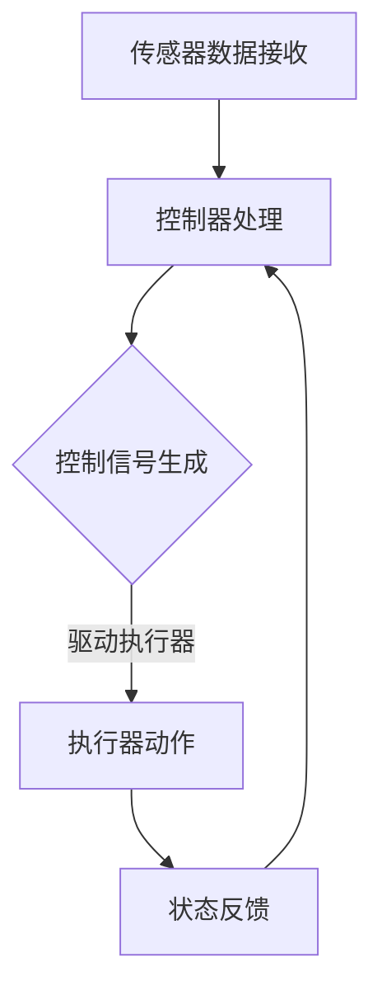

                 

关键词：嵌入式系统，执行器，任务调度，实时控制，性能优化，资源管理，算法原理

> 摘要：本文深入探讨了嵌入式系统中的执行器控制技术，介绍了其核心概念、原理和架构。通过详细阐述执行器控制算法的原理、步骤和优缺点，以及数学模型和公式，我们提供了代码实例和实际应用场景的展示。最后，我们总结了未来发展趋势和面临的挑战，并对相关工具和资源进行了推荐。

## 1. 背景介绍

随着物联网、智能家居、工业自动化等领域的快速发展，嵌入式系统在现代社会的应用越来越广泛。嵌入式系统通常具有资源受限、实时性要求高等特点，这使得执行器控制技术在嵌入式系统中变得尤为重要。执行器控制技术旨在确保嵌入式系统能够高效、可靠地完成预定的任务。

本文将重点介绍执行器控制技术，包括其核心概念、原理和架构，并通过具体案例展示其在实际应用中的重要性。

### 1.1 嵌入式系统概述

嵌入式系统是一种专用计算机系统，通常具有以下特点：

- **资源受限**：嵌入式系统通常需要运行在资源有限的硬件环境中，如有限的内存、处理能力等。
- **实时性要求**：嵌入式系统经常需要处理实时任务，满足严格的时间约束。
- **高可靠性**：嵌入式系统通常在关键应用中运行，如医疗设备、航空系统等，因此需要高可靠性。

### 1.2 执行器控制技术的重要性

执行器控制技术在嵌入式系统中起着至关重要的作用，主要体现在以下几个方面：

- **任务调度**：确保嵌入式系统中的任务能够在规定时间内完成，以满足实时性要求。
- **性能优化**：通过优化执行器的控制策略，提高系统的整体性能。
- **资源管理**：合理分配嵌入式系统中的有限资源，确保系统的稳定运行。

## 2. 核心概念与联系

### 2.1 执行器控制基本概念

执行器控制技术涉及以下核心概念：

- **执行器**：执行器是嵌入式系统中的核心组件，用于驱动实际设备，如电机、阀门等。
- **控制器**：控制器是执行器控制的核心，负责接收输入信号，产生输出信号，控制执行器的动作。
- **任务**：嵌入式系统中的任务是指需要完成的特定工作，如数据采集、数据处理、设备控制等。

### 2.2 执行器控制架构

执行器控制架构通常包括以下几个主要部分：

- **传感器**：用于检测系统的状态，如温度、湿度、压力等。
- **执行器**：接收控制信号，驱动实际设备执行动作。
- **控制器**：处理传感器输入，生成控制信号。
- **通信接口**：实现嵌入式系统与其他系统或设备之间的通信。

### 2.3 Mermaid 流程图

以下是一个简单的执行器控制流程图，展示执行器控制的基本过程：



## 3. 核心算法原理 & 具体操作步骤

### 3.1 算法原理概述

执行器控制算法的核心目标是确保嵌入式系统能够高效、可靠地完成任务。常见的执行器控制算法包括PID控制算法、模糊控制算法等。

- **PID控制算法**：PID控制算法是一种经典的比例-积分-微分控制算法，通过调整比例、积分和微分三个参数，实现对执行器的精确控制。
- **模糊控制算法**：模糊控制算法通过模糊逻辑推理，实现对执行器的控制，具有较强的鲁棒性和适应性。

### 3.2 算法步骤详解

以下是一个简单的PID控制算法的实现步骤：

1. **初始化**：设置PID控制参数，如比例系数Kp、积分系数Ki、微分系数Kd，以及初始误差e0。
2. **采样**：定期采样系统的状态，如传感器输入值。
3. **计算误差**：计算当前采样时刻的误差e(t) = sp(t) - pv(t)，其中sp(t)是期望输出值，pv(t)是实际输出值。
4. **计算控制量**：根据PID控制公式计算控制量u(t) = Kp*e(t) + Ki*\*∫e(t)dt + Kd*(e(t) - e(t-1))，其中e(t-1)是上一采样时刻的误差。
5. **执行控制动作**：将控制量u(t)发送给执行器，驱动执行器执行动作。
6. **更新状态**：更新当前误差e(t)和采样时间t，准备进行下一次采样。

### 3.3 算法优缺点

- **PID控制算法**：

  - 优点：简单易用，适用于大多数线性系统。
  - 缺点：对于非线性系统，性能可能较差。

- **模糊控制算法**：

  - 优点：具有较强的鲁棒性和适应性，适用于非线性系统。
  - 缺点：控制参数较多，需要经验丰富的工程师进行调试。

### 3.4 算法应用领域

执行器控制算法广泛应用于各种嵌入式系统，如：

- **智能家居**：控制温度、湿度、光照等。
- **工业自动化**：控制机械手臂、生产线等。
- **医疗设备**：控制药物剂量、医疗设备参数等。

## 4. 数学模型和公式 & 详细讲解 & 举例说明

### 4.1 数学模型构建

执行器控制的数学模型通常包括以下几个部分：

- **系统方程**：描述执行器与控制器之间的动态关系。
- **输入输出关系**：描述执行器的输入输出关系。
- **性能指标**：用于评估执行器控制效果。

### 4.2 公式推导过程

以下是一个简单的PID控制算法的数学模型推导：

1. **系统方程**：

   - 期望输出值：sp(t) = k*sp(t-1)
   - 实际输出值：pv(t) = k*pv(t-1) + u(t)
   - 其中k是系统的传递函数，u(t)是控制量。

2. **输入输出关系**：

   - 输入：u(t)
   - 输出：pv(t)

3. **性能指标**：

   - 误差：e(t) = sp(t) - pv(t)
   - 偏差：δ(t) = |e(t)|

### 4.3 案例分析与讲解

以下是一个智能家居温控系统的案例：

- **期望温度**：sp(t) = 25°C
- **实际温度**：pv(t) = 23°C + 2*sin(2*pi*t/3600)
- **PID控制参数**：Kp = 1, Ki = 0.1, Kd = 0.01

**步骤**：

1. **初始化**：

   - 设定PID控制参数：Kp = 1, Ki = 0.1, Kd = 0.01
   - 初始误差：e0 = sp(t) - pv(t) = 25 - 23 = 2

2. **采样**：

   - 采样时间：t = 1s
   - 采样时刻的温度：sp(t) = 25°C, pv(t) = 23 + 2*sin(2*pi*t/3600) = 23.5°C

3. **计算误差**：

   - 当前误差：e(t) = sp(t) - pv(t) = 25 - 23.5 = 1.5

4. **计算控制量**：

   - 控制量：u(t) = Kp*e(t) + Ki*\*∫e(t)dt + Kd*(e(t) - e(t-1))
   - u(t) = 1*1.5 + 0.1*\*1.5 + 0.01*(1.5 - 0)
   - u(t) = 1.5 + 0.15 + 0.015 = 1.665

5. **执行控制动作**：

   - 将控制量u(t)发送给暖气设备，调节温度。

6. **更新状态**：

   - 更新当前误差：e(t) = 1.5
   - 更新采样时间：t = 1s

## 5. 项目实践：代码实例和详细解释说明

### 5.1 开发环境搭建

本文使用Python语言实现PID控制算法，开发环境为Python 3.8及以上版本。

### 5.2 源代码详细实现

以下是一个简单的PID控制算法的实现：

```python
import numpy as np
import matplotlib.pyplot as plt

# PID控制参数
Kp = 1
Ki = 0.1
Kd = 0.01

# 初始状态
e0 = 0
u0 = 0

# 采样时间
dt = 1

# 采样点数量
N = 100

# 期望温度
sp = np.full(N, 25)

# 实际温度
pv = np.full(N, 23) + 2*np.sin(np.linspace(0, 2*np.pi*N/3600, N))

# 初始化误差和控制量
e = np.zeros(N)
u = np.zeros(N)

# PID控制算法
for i in range(1, N):
    e[i] = sp[i] - pv[i]
    u[i] = Kp*e[i] + Ki*np.trapz(e[:i+1], dx=dt) + Kd*(e[i] - e[i-1])
    pv[i] = pv[i-1] + u[i]*dt

# 绘制结果
plt.plot(sp, label='期望温度')
plt.plot(pv, label='实际温度')
plt.plot(u, label='控制量')
plt.legend()
plt.show()
```

### 5.3 代码解读与分析

- **导入模块**：本文使用NumPy和matplotlib两个模块，分别用于数值计算和绘图。
- **PID控制参数**：设定比例系数Kp、积分系数Ki、微分系数Kd。
- **初始状态**：设定初始误差e0和控制量u0。
- **采样时间**：设定采样时间dt。
- **采样点数量**：设定采样点数量N。
- **期望温度**：设定期望温度sp。
- **实际温度**：设定实际温度pv，使用正弦函数模拟实际温度的波动。
- **初始化误差和控制量**：初始化误差e和控制量u。
- **PID控制算法**：使用for循环遍历每个采样点，计算误差和控制量，更新实际温度。
- **绘制结果**：使用matplotlib绘制期望温度、实际温度和控制量的曲线图。

## 6. 实际应用场景

执行器控制技术在各种嵌入式系统中有着广泛的应用，以下列举一些实际应用场景：

- **智能家居**：温控系统、照明控制、安防系统等。
- **工业自动化**：机械手臂控制、生产线控制、质量检测等。
- **医疗设备**：药物剂量控制、手术机器人控制、监护设备等。
- **交通运输**：自动驾驶汽车、列车控制、航空系统等。

## 7. 工具和资源推荐

### 7.1 学习资源推荐

- 《嵌入式系统设计与应用》
- 《现代控制理论及其MATLAB实现》
- 《Python编程：从入门到实践》

### 7.2 开发工具推荐

- MATLAB
- Python
- Simulink

### 7.3 相关论文推荐

- "Fuzzy Logic Control of a DC Motor Speed"
- "PID Control of a DC Motor Using MATLAB/Simulink"
- "Implementation of Fuzzy PID Controller for Speed Control of BLDC Motor"

## 8. 总结：未来发展趋势与挑战

### 8.1 研究成果总结

执行器控制技术在嵌入式系统中得到了广泛应用，取得了显著的成果。特别是PID控制和模糊控制算法在实际应用中取得了良好的效果。同时，随着人工智能技术的发展，深度学习算法也逐渐应用于执行器控制领域，为嵌入式系统带来了新的机遇。

### 8.2 未来发展趋势

- **人工智能化**：深度学习、强化学习等人工智能技术将在执行器控制中得到更广泛的应用。
- **自适应性**：执行器控制算法将具有更强的自适应能力，适应不同的应用场景和系统需求。
- **实时性优化**：执行器控制算法将更加注重实时性优化，以满足嵌入式系统的实时性要求。

### 8.3 面临的挑战

- **复杂系统控制**：嵌入式系统的复杂性不断增加，如何设计高效、可靠的执行器控制算法成为一大挑战。
- **资源受限**：嵌入式系统资源受限，如何在有限的资源下实现高效的执行器控制算法成为关键问题。
- **安全性**：随着嵌入式系统在关键应用中的使用越来越广泛，如何保障系统的安全性成为重要挑战。

### 8.4 研究展望

未来执行器控制技术的发展将朝着人工智能化、自适应性和实时性优化的方向前进。同时，研究者应关注复杂系统控制、资源受限和安全性等关键问题，为嵌入式系统的发展提供强有力的支持。

## 9. 附录：常见问题与解答

### 9.1 什么是嵌入式系统？

嵌入式系统是一种专用计算机系统，通常具有资源受限、实时性要求高等特点。

### 9.2 执行器控制技术在嵌入式系统中有什么作用？

执行器控制技术在嵌入式系统中起着任务调度、性能优化和资源管理的重要作用。

### 9.3 常见的执行器控制算法有哪些？

常见的执行器控制算法包括PID控制算法、模糊控制算法、深度学习算法等。

### 9.4 如何优化执行器控制算法的性能？

优化执行器控制算法的性能可以从以下几个方面入手：

- **参数调整**：根据系统特点和需求，合理调整PID控制参数。
- **算法改进**：研究新的控制算法，提高系统的适应性和实时性。
- **硬件优化**：提高嵌入式系统的硬件性能，如增加处理能力、降低延迟等。

----------------------------------------------------------------
作者：禅与计算机程序设计艺术 / Zen and the Art of Computer Programming
----------------------------------------------------------------

[END]

