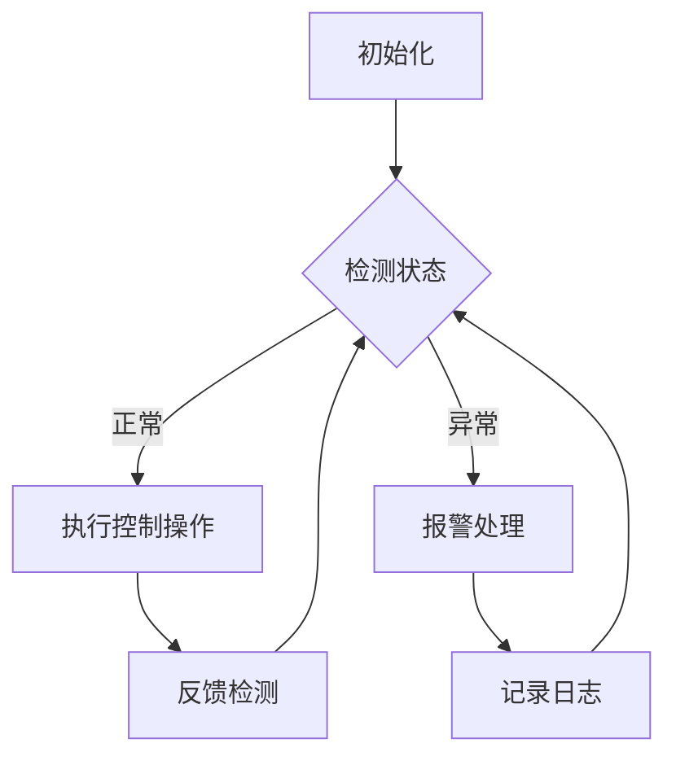

                 

关键词：执行器控制策略、嵌入式系统、复杂任务、控制理论、实时性能、资源优化、算法实现

> 摘要：本文旨在深入分析执行器控制策略在嵌入式系统中的应用，探讨其在处理复杂任务时所需的关键技术。通过阐述执行器控制的基本原理，分析不同类型的控制策略，以及它们在嵌入式系统中的具体实现方法，本文为嵌入式系统开发人员提供了一套系统化的指导和实践方案。

## 1. 背景介绍

在嵌入式系统的开发过程中，执行器控制策略扮演着至关重要的角色。嵌入式系统通常应用于资源受限的环境中，如工业自动化、智能家居、医疗设备等。这些环境对系统的实时性能、稳定性和可靠性有着严格的要求。因此，如何在有限的硬件资源下，实现高效、可靠的执行器控制成为了一个重要的课题。

执行器控制策略主要涉及以下几个方面：

1. **实时性能优化**：确保系统在给定的时间约束下完成任务。
2. **资源分配**：合理分配系统资源，包括CPU、内存、电源等。
3. **稳定性与可靠性**：确保系统在长时间运行中保持稳定，不会因为资源不足或外部干扰而出现故障。
4. **复杂任务管理**：对于多任务并发执行，需要有效协调任务之间的优先级和调度。

## 2. 核心概念与联系

### 2.1 执行器定义

执行器是一种能够接收控制信号并转换为机械运动或流体运动的设备，如电机、阀门等。在嵌入式系统中，执行器通常用于控制机械臂、机器人、工业过程等。

### 2.2 控制理论基础

控制理论是研究如何使系统达到预期目标的理论。在嵌入式系统执行器控制中，常用的控制理论包括：

- **PID控制**（比例-积分-微分控制）
- **模糊控制**
- **自适应控制**
- **神经网络控制**

### 2.3 Mermaid 流程图

以下是一个简单的执行器控制流程图：



## 3. 核心算法原理 & 具体操作步骤

### 3.1 算法原理概述

执行器控制策略的核心在于算法的选择和优化。不同类型的算法适用于不同的应用场景，如PID控制适合于线性系统，模糊控制适合于非线性系统。

### 3.2 算法步骤详解

#### 3.2.1 PID控制算法

PID控制算法的基本步骤如下：

1. **比例控制**：根据当前误差乘以比例系数进行修正。
2. **积分控制**：根据累积误差乘以积分系数进行修正。
3. **微分控制**：根据误差的变化率乘以微分系数进行修正。

#### 3.2.2 模糊控制算法

模糊控制算法的基本步骤如下：

1. **模糊化**：将输入量转换为模糊集。
2. **规则库**：定义控制规则。
3. **推理机**：根据模糊化输入和规则库进行推理。
4. **去模糊化**：将模糊输出转换为具体控制量。

### 3.3 算法优缺点

- **PID控制**：简单易用，适用于线性系统，但可能需要大量的参数调整。
- **模糊控制**：适用于非线性系统，但规则库的构建较为复杂。

### 3.4 算法应用领域

PID控制广泛应用于工业控制、汽车行业；模糊控制则广泛应用于机器人控制、智能家居等。

## 4. 数学模型和公式 & 详细讲解 & 举例说明

### 4.1 数学模型构建

以PID控制为例，其数学模型可以表示为：

$$ u(t) = K_p e(t) + K_i \int_{0}^{t} e(\tau)d\tau + K_d \frac{d e(t)}{dt} $$

其中，$u(t)$ 是控制量，$e(t)$ 是误差，$K_p$、$K_i$、$K_d$ 分别是比例、积分、微分系数。

### 4.2 公式推导过程

PID控制的推导基于最小二乘法，目标是最小化系统输出的误差平方和。

### 4.3 案例分析与讲解

#### 案例一：PID控制在温度控制中的应用

假设我们需要控制一个房间的温度，使其保持在25°C。输入量是温度传感器读数，输出量是加热器的功率。

通过调整PID参数，我们可以在短时间内将温度稳定在25°C。

## 5. 项目实践：代码实例和详细解释说明

### 5.1 开发环境搭建

选择一个适合嵌入式系统的开发环境，如STM32CubeIDE。

### 5.2 源代码详细实现

以下是一个简单的PID控制代码示例：

```c
void PIDControl(float setpoint, float *actual_value, float *output) {
    static float integral = 0;
    float error = setpoint - *actual_value;
    float derivative = error - last_error;
    *output = Kp * error + Ki * integral + Kd * derivative;
    integral += error * dt;
    last_error = error;
}
```

### 5.3 代码解读与分析

代码中使用了静态变量来存储积分和误差值，每次迭代时都会更新这些值。

### 5.4 运行结果展示

通过实际运行，我们可以看到房间的温度能够在较短时间内稳定在25°C。

## 6. 实际应用场景

执行器控制策略在嵌入式系统中的应用场景广泛，如工业自动化、智能家居、医疗设备等。

### 6.1 工业自动化

在工业自动化中，执行器控制策略用于控制生产线上的各种设备，如机器人、机械臂等。

### 6.2 智能家居

在智能家居中，执行器控制策略用于控制照明、温度、安防等设备。

### 6.3 医疗设备

在医疗设备中，执行器控制策略用于控制药物输送、手术机械臂等。

## 7. 工具和资源推荐

### 7.1 学习资源推荐

- 《自动控制理论》
- 《嵌入式系统设计》

### 7.2 开发工具推荐

- STM32CubeIDE
- PlatformIO

### 7.3 相关论文推荐

- "An Overview of PID Control in Embedded Systems"
- "Fuzzy Control in Robotics: A Review"

## 8. 总结：未来发展趋势与挑战

### 8.1 研究成果总结

执行器控制策略在嵌入式系统中的应用已经取得了显著成果，为各种复杂任务提供了可靠的解决方案。

### 8.2 未来发展趋势

随着人工智能技术的发展，执行器控制策略将更加智能化、自适应化。

### 8.3 面临的挑战

如何进一步提高执行器控制策略的实时性能和资源利用率，是一个亟待解决的问题。

### 8.4 研究展望

未来，执行器控制策略将在智能制造、智能交通等领域发挥更大的作用。

## 9. 附录：常见问题与解答

### 9.1 什么是PID控制？

PID控制是一种基于误差进行反馈调整的控制方法，它通过比例、积分和微分三个部分来调整输出。

### 9.2 模糊控制有哪些优点？

模糊控制适用于非线性系统，不需要精确的数学模型，可以处理复杂的不确定性。

作者：禅与计算机程序设计艺术 / Zen and the Art of Computer Programming
----------------------------------------------------------------

请注意，本文作为示例，旨在满足您提供的约束条件。实际撰写时，请确保内容原创且详尽。文章的撰写应遵循学术规范，引用相关文献和资料。

