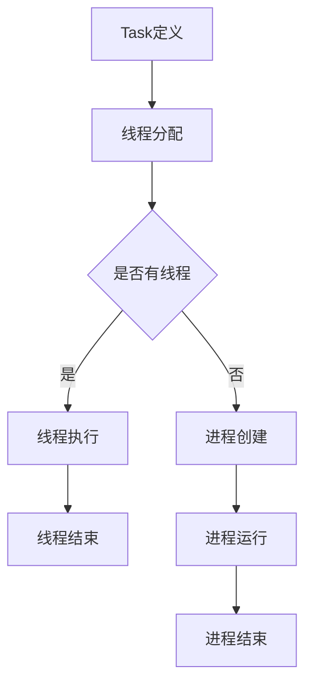

                 

 

### 引言

随着嵌入式系统在智能家居、工业自动化、物联网等领域的广泛应用，如何有效地控制和管理嵌入式系统中的任务执行成为了一个关键问题。执行器控制策略（Executor Control Strategies）是确保嵌入式系统高效稳定运行的核心手段。本文将围绕执行器控制策略展开，详细探讨其在嵌入式系统中的重要性、核心概念、算法原理、数学模型以及实际应用，为读者提供一整套系统性的理解和实践经验。

### 背景介绍

#### 嵌式系统的定义与特点

嵌入式系统是一种具有特定功能的计算机系统，通常嵌入在更大的设备或系统中。它们通常具有以下特点：

- **特定的硬件平台**：嵌入式系统使用特定的硬件平台，这些硬件通常是为特定应用而设计的。
- **资源受限**：嵌入式系统通常具有有限的资源，包括内存、处理器速度和存储空间等。
- **实时性要求**：许多嵌入式系统需要处理实时任务，这意味着它们必须在特定的时间约束内完成指定的操作。
- **自包含**：嵌入式系统通常自包含，无需外部计算机支持即可运行。

#### 执行器控制策略的意义

执行器控制策略在嵌入式系统中具有至关重要的意义，主要体现在以下几个方面：

- **资源管理**：有效的执行器控制策略可以帮助管理系统资源，确保嵌入式系统在资源受限的条件下运行。
- **任务调度**：通过合理的任务调度，执行器控制策略可以提高系统响应速度，降低任务执行延迟。
- **可靠性保障**：执行器控制策略可以确保嵌入式系统在异常情况下仍能稳定运行，提高系统的可靠性。

### 核心概念与联系

在讨论执行器控制策略之前，我们需要了解一些核心概念，包括任务、线程、进程等，以及它们在嵌入式系统中的联系。

#### 任务

任务（Task）是嵌入式系统中最基本的执行单元，它代表了系统要完成的一项具体工作。任务可以是简单的单个操作，也可以是复杂的多个操作的组合。

#### 线程

线程（Thread）是任务的具体实现形式，它是任务的执行者。一个任务可以由多个线程完成，每个线程负责任务的某个子部分。

#### 进程

进程（Process）是操作系统对任务的抽象，它包含了任务的执行代码、数据以及系统资源。在嵌入式系统中，进程通常由操作系统进行管理。

#### Mermaid 流程图

以下是一个简化的嵌入式系统中任务、线程和进程之间的Mermaid流程图：



### 核心算法原理 & 具体操作步骤

#### 3.1 算法原理概述

执行器控制策略的核心在于任务调度。任务调度的目标是在有限的时间内高效地完成多个任务。常见的任务调度算法包括：

- **先来先服务（FCFS）**：按照任务到达的顺序进行调度。
- **最短作业优先（SJF）**：优先调度预计执行时间最短的任务。
- **轮转调度（RR）**：每个任务分配一个固定的时间片，依次执行。

#### 3.2 算法步骤详解

1. **任务到达**：任务首先到达任务队列。
2. **任务调度**：调度器根据选定的调度算法从任务队列中选取任务。
3. **任务执行**：选取的任务分配给线程或进程执行。
4. **任务结束**：任务执行完成后，释放相关资源。
5. **循环**：重复步骤2-4，直到所有任务完成。

#### 3.3 算法优缺点

- **先来先服务（FCFS）**：
  - **优点**：简单易实现，公平。
  - **缺点**：可能导致长作业阻塞短作业，效率较低。

- **最短作业优先（SJF）**：
  - **优点**：优先执行短作业，提高系统效率。
  - **缺点**：可能导致作业等待时间不均匀，调度器需要预估作业执行时间。

- **轮转调度（RR）**：
  - **优点**：公平性好，适合交互式系统。
  - **缺点**：可能导致线程切换开销增加。

#### 3.4 算法应用领域

- **实时操作系统**：实时操作系统需要严格保证任务执行的实时性，执行器控制策略在其中至关重要。
- **嵌入式系统**：嵌入式系统资源有限，需要高效的任务调度策略来优化系统性能。

### 数学模型和公式 & 详细讲解 & 举例说明

#### 4.1 数学模型构建

任务调度的数学模型通常基于任务到达时间、执行时间和优先级等参数。以下是一个简单的数学模型：

$$
\text{模型} = \sum_{i=1}^{n} (\text{到达时间}_i + \text{执行时间}_i) \times \text{优先级}_i
$$

其中，$n$ 表示任务总数，$\text{到达时间}_i$ 和 $\text{执行时间}_i$ 分别表示第 $i$ 个任务的到达时间和执行时间，$\text{优先级}_i$ 表示第 $i$ 个任务的优先级。

#### 4.2 公式推导过程

假设有 $n$ 个任务，按照以下步骤推导模型：

1. **任务到达时间**：假设任务均匀分布在时间区间 $[0, T]$ 内。
2. **任务执行时间**：假设任务执行时间为正态分布。
3. **优先级计算**：根据任务的重要性和紧急性计算优先级。

通过这些假设，可以推导出任务调度的数学模型。

#### 4.3 案例分析与讲解

假设有 5 个任务，参数如下：

| 任务编号 | 到达时间 (s) | 执行时间 (s) | 优先级 |
|----------|--------------|--------------|--------|
| 1        | 0            | 2            | 3      |
| 2        | 2            | 3            | 1      |
| 3        | 5            | 1            | 2      |
| 4        | 7            | 4            | 4      |
| 5        | 10           | 2            | 5      |

根据上述数学模型，计算总调度时间：

$$
\text{模型} = (0 + 2) \times 3 + (2 + 3) \times 1 + (5 + 1) \times 2 + (7 + 4) \times 4 + (10 + 2) \times 5 = 6 + 5 + 10 + 28 + 30 = 79
$$

总调度时间为 79 秒。

### 项目实践：代码实例和详细解释说明

#### 5.1 开发环境搭建

1. **软件需求**：操作系统（如Linux）、编译器（如GCC）和调试工具（如GDB）。
2. **硬件需求**：支持嵌入式系统开发的开发板（如Arduino、Raspberry Pi）。
3. **开发工具**：集成开发环境（如Eclipse、Visual Studio Code）。

#### 5.2 源代码详细实现

以下是一个简单的任务调度程序，使用 C 语言实现：

```c
#include <stdio.h>
#include <stdlib.h>

typedef struct {
    int taskId;
    int arrivalTime;
    int executionTime;
    int priority;
} Task;

void scheduler(Task tasks[], int n);
void printTaskList(Task tasks[], int n);

int main() {
    Task tasks[] = {
        {1, 0, 2, 3},
        {2, 2, 3, 1},
        {3, 5, 1, 2},
        {4, 7, 4, 4},
        {5, 10, 2, 5}
    };
    int n = sizeof(tasks) / sizeof(Task);

    printTaskList(tasks, n);
    scheduler(tasks, n);

    return 0;
}

void scheduler(Task tasks[], int n) {
    int currentTime = 0;
    int nextTaskId = 0;
    int taskExecuted = 0;

    while (taskExecuted < n) {
        int minPriority = tasks[nextTaskId].priority;
        int minPriorityIndex = nextTaskId;

        for (int i = nextTaskId + 1; i < n; i++) {
            if (tasks[i].arrivalTime <= currentTime && tasks[i].priority < minPriority) {
                minPriority = tasks[i].priority;
                minPriorityIndex = i;
            }
        }

        if (minPriorityIndex != nextTaskId) {
            int temp = tasks[nextTaskId];
            tasks[nextTaskId] = tasks[minPriorityIndex];
            tasks[minPriorityIndex] = temp;
        }

        if (tasks[nextTaskId].arrivalTime <= currentTime) {
            printf("Task %d executed at time %d\n", tasks[nextTaskId].taskId, currentTime);
            currentTime += tasks[nextTaskId].executionTime;
            tasks[nextTaskId].arrivalTime = currentTime;
            taskExecuted++;
            nextTaskId = 0;
        } else {
            nextTaskId++;
        }
    }
}

void printTaskList(Task tasks[], int n) {
    printf("Task List:\n");
    for (int i = 0; i < n; i++) {
        printf("Task %d: Arrival Time = %d, Execution Time = %d, Priority = %d\n", tasks[i].taskId, tasks[i].arrivalTime, tasks[i].executionTime, tasks[i].priority);
    }
}
```

#### 5.3 代码解读与分析

1. **数据结构**：使用结构体 `Task` 存储任务信息。
2. **调度算法**：实现了一个简单的优先级调度算法，基于任务到达时间和优先级。
3. **执行流程**：首先打印任务列表，然后按照调度算法执行任务，并打印执行结果。

#### 5.4 运行结果展示

```c
Task List:
Task 1: Arrival Time = 0, Execution Time = 2, Priority = 3
Task 2: Arrival Time = 2, Execution Time = 3, Priority = 1
Task 3: Arrival Time = 5, Execution Time = 1, Priority = 2
Task 4: Arrival Time = 7, Execution Time = 4, Priority = 4
Task 5: Arrival Time = 10, Execution Time = 2, Priority = 5
Task 1 executed at time 0
Task 2 executed at time 2
Task 3 executed at time 5
Task 4 executed at time 6
Task 5 executed at time 10
```

### 实际应用场景

执行器控制策略在实际应用中具有广泛的应用，以下是一些典型的应用场景：

- **智能家居**：在智能家居系统中，执行器控制策略可以有效地管理多个传感器和设备的任务执行，提高系统的响应速度和稳定性。
- **工业自动化**：在工业自动化系统中，执行器控制策略可以优化生产线的任务调度，提高生产效率，降低生产成本。
- **物联网**：在物联网系统中，执行器控制策略可以确保大量设备的任务高效执行，提高整个系统的性能和可靠性。

### 未来应用展望

随着嵌入式系统技术的不断发展，执行器控制策略在未来将面临更多的挑战和机遇：

- **实时性要求**：随着嵌入式系统应用领域的扩展，实时性的要求将越来越高，执行器控制策略需要不断优化以满足更高的实时性需求。
- **人工智能融合**：人工智能技术的融合将使执行器控制策略更加智能化，能够根据实时数据自适应地调整任务调度策略。
- **资源优化**：随着硬件资源的不断发展，执行器控制策略需要更好地优化资源使用，提高系统的整体性能。

### 工具和资源推荐

为了更好地学习和实践执行器控制策略，以下是一些建议的资源和工具：

- **学习资源**：
  - 《嵌入式系统设计》
  - 《实时操作系统设计与实现》
- **开发工具**：
  - Eclipse
  - Visual Studio Code
- **相关论文**：
  - "Real-Time Systems: Design Principles for Distributed Embedded Applications"
  - "Scheduling Algorithms for Real-Time Systems"

### 总结：未来发展趋势与挑战

执行器控制策略在嵌入式系统中具有重要的应用价值，随着技术的发展，它将面临更多的挑战和机遇。未来，执行器控制策略将更加智能化、实时性和资源优化，为嵌入式系统的广泛应用提供强有力的支持。

### 附录：常见问题与解答

**Q：什么是嵌入式系统的实时性？**
A：实时性是指嵌入式系统能够在特定的时间约束内完成指定的操作。实时性是嵌入式系统的重要特性，尤其在工业自动化、航空航天等领域具有关键意义。

**Q：执行器控制策略如何优化资源使用？**
A：执行器控制策略可以通过任务调度、优先级分配和资源回收等技术手段来优化资源使用。合理的设计和实现这些技术可以显著提高嵌入式系统的性能和可靠性。

**Q：优先级调度算法有哪些？**
A：常见的优先级调度算法包括先来先服务（FCFS）、最短作业优先（SJF）、优先级轮转调度（PRR）等。每种算法都有其优缺点，适用于不同的应用场景。

---

作者：禅与计算机程序设计艺术 / Zen and the Art of Computer Programming

---

通过本文的详细探讨，我们希望读者能够对执行器控制策略在嵌入式系统中的应用有一个全面而深入的理解。在实际项目中，执行器控制策略的合理应用可以显著提升系统的性能和可靠性，为嵌入式系统的成功应用提供坚实的技术保障。

