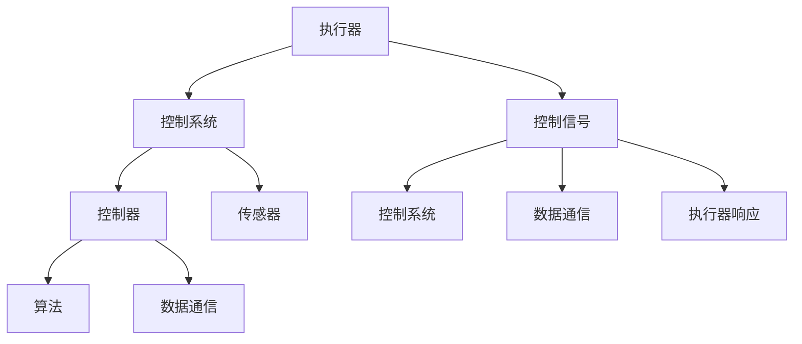

                 

  
## 1. 背景介绍

在现代社会，随着科技的飞速发展，各种设备和技术手段层出不穷。从智能家居到工业自动化，从物联网到无人驾驶，设备的广泛应用已经成为我们日常生活和工作的重要组成部分。然而，设备的广泛应用也带来了新的挑战，即如何高效地控制和操作这些设备。

执行器编程，作为控制设备行为的核心技术之一，承担着这一重要使命。执行器编程的主要目标是利用编程语言和算法，实现对设备的精确控制，确保设备按照预期的行为运行。这一技术的应用范围广泛，不仅包括工业自动化系统、机器人控制、智能家居系统，还涉及无人驾驶汽车、无人机、工业4.0等领域。

随着物联网技术的不断发展，设备的数量和种类也在不断增加。传统的手动控制和简单的开关控制已经无法满足现代设备的高效、智能和灵活操作需求。执行器编程作为一种高效、精准的控制手段，可以实现对设备的实时监控、动态调整和故障处理，从而提高设备的运行效率和可靠性。

本文将深入探讨执行器编程的核心概念、算法原理、具体操作步骤、数学模型、项目实践、实际应用场景、工具和资源推荐以及未来发展趋势和挑战。通过本文的介绍，读者可以全面了解执行器编程的技术原理和应用，为在实际项目中应用这一技术打下坚实的基础。

## 2. 核心概念与联系

在执行器编程中，核心概念和联系是理解和应用这一技术的基础。本节将详细介绍执行器编程中的核心概念，并使用Mermaid流程图（无括号、逗号等特殊字符）来展示这些概念之间的关系。

### 2.1 执行器

执行器是执行器编程中的核心组件，负责将控制信号转换为实际的物理动作。常见的执行器包括电机、液压缸、气动缸等。执行器的类型和规格决定了其响应速度、负载能力和控制精度。

### 2.2 控制信号

控制信号是执行器编程的核心输入，用于指示执行器执行何种动作。控制信号可以是数字信号（如二进制信号）、模拟信号（如电压信号）或通信信号（如CAN总线信号）。

### 2.3 控制系统

控制系统是执行器编程的核心，负责生成和发送控制信号。控制系统通常由控制器（如PLC、单片机、微控制器等）和传感器组成。控制器根据传感器采集的实时数据，通过算法生成相应的控制信号，发送给执行器。

### 2.4 算法

算法是执行器编程的核心，用于处理控制信号和执行器的响应。常见的算法包括PID控制算法、模糊控制算法、神经网络控制算法等。算法的选择和优化直接影响执行器的控制效果。

### 2.5 数据通信

数据通信是执行器编程中不可或缺的一部分，用于传输控制信号和传感器数据。常见的通信协议包括TCP/IP、CAN总线、UART等。数据通信的可靠性和实时性是确保执行器编程成功的关键因素。

### Mermaid流程图

以下是执行器编程中的Mermaid流程图，展示了上述核心概念之间的关系：



通过这个流程图，我们可以清晰地看到执行器编程的核心组成部分及其相互关系。理解这些核心概念和联系，对于深入学习和应用执行器编程至关重要。

### 2.6 执行器编程的优势和应用场景

执行器编程作为一种高效、精准的控制技术，具有许多优势和应用场景。以下将详细介绍这些优势和应用场景。

#### 2.6.1 优势

1. **高精度控制**：执行器编程能够实现对设备的精确控制，通过优化算法和调整控制参数，可以大幅提高控制精度和稳定性。
2. **实时响应**：执行器编程支持实时数据采集和反馈，能够快速响应环境变化，提高系统的响应速度和动态性能。
3. **灵活性强**：执行器编程可以通过软件调整控制策略，适应不同设备和应用场景的需求，具有很强的灵活性。
4. **集成度高**：执行器编程能够与各种传感器、控制器和数据通信协议集成，实现复杂系统的整体控制和优化。
5. **易于维护**：执行器编程通过软件控制，便于维护和升级，可以快速解决设备故障和优化控制策略。

#### 2.6.2 应用场景

1. **工业自动化**：在工业生产过程中，执行器编程用于控制各种机械设备的动作，如机器人、数控机床、自动化生产线等，提高生产效率和产品质量。
2. **机器人控制**：在机器人领域，执行器编程用于控制机器人的运动和动作，如移动、抓取、装配等，实现智能化和自动化操作。
3. **智能家居**：在智能家居系统中，执行器编程用于控制家电设备，如照明、空调、安防设备等，实现远程控制和自动化管理。
4. **无人驾驶**：在无人驾驶领域，执行器编程用于控制车辆的运动和转向，实现自动驾驶功能，提高交通安全和效率。
5. **医疗设备**：在医疗领域，执行器编程用于控制医疗设备的操作，如手术机器人、药物配送机器人等，提高医疗服务的质量和效率。
6. **工业4.0**：在工业4.0领域，执行器编程用于实现智能工厂的全面控制和优化，提高生产效率和资源利用率。

通过上述优势和应用场景的介绍，我们可以看到执行器编程在现代科技领域的广泛应用和重要性。掌握执行器编程技术，对于推动科技创新和产业发展具有重要意义。

### 3. 核心算法原理 & 具体操作步骤

#### 3.1 算法原理概述

在执行器编程中，核心算法的设计和实现至关重要。这些算法用于处理控制信号、调整执行器的动作，并确保系统达到预期的性能。以下是几种常见的执行器编程算法原理：

1. **PID控制算法**：PID（比例-积分-微分）控制算法是一种经典的控制算法，广泛应用于工业控制和执行器编程中。PID算法通过调节比例、积分和微分三个参数，实现对执行器的精确控制。

2. **模糊控制算法**：模糊控制算法基于模糊逻辑，通过模拟人类的推理过程，实现对复杂系统的控制和优化。模糊控制算法适用于处理非线性、时变和不确定性系统。

3. **神经网络控制算法**：神经网络控制算法利用人工神经网络的学习和自适应能力，实现复杂系统的智能控制。神经网络控制算法具有自学习和自适应能力，能够提高系统的控制精度和鲁棒性。

4. **自适应控制算法**：自适应控制算法通过实时调整控制参数，使系统在不同工况下都能保持良好的性能。自适应控制算法适用于变化快速、工况复杂的系统。

#### 3.2 算法步骤详解

以下将详细解释PID控制算法、模糊控制算法和神经网络控制算法的操作步骤：

##### 3.2.1 PID控制算法

1. **初始化参数**：根据执行器的特性和系统要求，初始化PID控制器的比例（Kp）、积分（Ki）和微分（Kd）三个参数。

2. **采集实时数据**：从传感器采集执行器的实时位置、速度和负载等数据。

3. **计算误差**：计算目标位置与实际位置之间的误差（e）。

4. **计算控制信号**：根据误差值，利用PID控制算法计算控制信号（u）。
   - 比例控制信号：\(u_p = K_p \cdot e\)
   - 积分控制信号：\(u_i = K_i \cdot \int e \, dt\)
   - 微分控制信号：\(u_d = K_d \cdot \frac{de}{dt}\)
   - 总控制信号：\(u = u_p + u_i + u_d\)

5. **发送控制信号**：将计算出的控制信号发送给执行器，调整执行器的动作。

6. **更新参数**：根据系统性能和误差变化，实时调整PID控制器的参数。

##### 3.2.2 模糊控制算法

1. **构建模糊模型**：根据系统特点和输入输出关系，构建模糊模型。包括输入变量、输出变量、隶属函数和模糊规则。

2. **输入变量处理**：将传感器的输入数据转换为模糊语言变量。

3. **模糊推理**：根据模糊规则，进行模糊推理，计算出输出模糊值。

4. **模糊化处理**：将模糊值进行去模糊化处理，得到精确的控制信号。

5. **发送控制信号**：将计算出的控制信号发送给执行器，调整执行器的动作。

##### 3.2.3 神经网络控制算法

1. **构建神经网络**：根据系统特点，构建神经网络结构，包括输入层、隐藏层和输出层。

2. **训练神经网络**：使用训练数据，对神经网络进行训练，调整网络权值和偏置。

3. **输入数据处理**：将传感器的输入数据进行预处理，作为神经网络的输入。

4. **前向传播**：将输入数据通过神经网络进行前向传播，得到输出结果。

5. **误差计算与调整**：计算输出结果与目标值的误差，并反向传播误差，调整网络权值和偏置。

6. **发送控制信号**：将计算出的控制信号发送给执行器，调整执行器的动作。

#### 3.3 算法优缺点

**PID控制算法**：

- **优点**：算法简单、易于实现、控制精度高，适用于大多数工业控制系统。
- **缺点**：对于非线性、时变和不确定性系统，控制性能较差。

**模糊控制算法**：

- **优点**：适用于非线性、时变和不确定性系统，具有较强的鲁棒性。
- **缺点**：规则库的构建复杂，需要大量的专家知识和经验。

**神经网络控制算法**：

- **优点**：具有较强的自学习和自适应能力，适用于复杂非线性系统。
- **缺点**：训练过程复杂、训练时间较长，对计算资源要求较高。

#### 3.4 算法应用领域

PID控制算法广泛应用于工业控制和执行器编程，如机器人控制、无人驾驶、智能家居等。

模糊控制算法在需要处理非线性、时变和不确定性系统的领域得到广泛应用，如工业自动化、机器人控制、智能交通等。

神经网络控制算法在需要实现高精度、自学习和自适应控制的领域得到广泛应用，如智能制造、医疗设备、无人机控制等。

通过上述对核心算法原理和操作步骤的详细解释，我们可以看到不同算法在执行器编程中的具体应用和特点。掌握这些算法，有助于我们在实际项目中选择合适的控制方法，提高系统的性能和稳定性。

### 4. 数学模型和公式 & 详细讲解 & 举例说明

在执行器编程中，数学模型和公式是理解和设计控制算法的基础。本节将详细讲解执行器编程中常用的数学模型和公式，并通过具体案例进行说明。

#### 4.1 数学模型构建

执行器编程的数学模型通常包括以下几个部分：

1. **执行器模型**：描述执行器的物理特性和运动规律。
2. **控制系统模型**：描述控制系统的结构和功能。
3. **传感器模型**：描述传感器的工作原理和测量误差。
4. **算法模型**：描述控制算法的设计和实现。

以下是一个简化的执行器编程数学模型：

\[ \text{执行器模型}:\ \ \ \ \ x(t) = f(u(t), \theta(t)), \]
其中，\(x(t)\) 是执行器的位置，\(u(t)\) 是控制信号，\(\theta(t)\) 是执行器的内部状态。

\[ \text{控制系统模型}:\ \ \ \ \ u(t) = C(x(t), y(t), \theta(t)), \]
其中，\(u(t)\) 是控制信号，\(x(t)\) 是执行器的位置，\(y(t)\) 是传感器测量值，\(\theta(t)\) 是执行器的内部状态。

\[ \text{传感器模型}:\ \ \ \ \ y(t) = H(x(t), \theta(t)) + v(t), \]
其中，\(y(t)\) 是传感器测量值，\(x(t)\) 是执行器的位置，\(\theta(t)\) 是执行器的内部状态，\(v(t)\) 是测量噪声。

\[ \text{算法模型}:\ \ \ \ \ x_{\text{ref}}(t) = G(r(t), \theta(t)), \]
其中，\(x_{\text{ref}}(t)\) 是参考位置，\(r(t)\) 是参考输入，\(\theta(t)\) 是执行器的内部状态。

#### 4.2 公式推导过程

以下是一个简化的PID控制算法的公式推导过程：

1. **误差计算**：计算目标位置与实际位置之间的误差。
   \[ e(t) = x_{\text{ref}}(t) - x(t). \]

2. **控制信号计算**：根据误差值，计算控制信号。
   \[ u(t) = K_p e(t) + K_i \int e(t) \, dt + K_d \frac{de(t)}{dt}. \]

3. **系统动态方程**：描述执行器的运动规律。
   \[ \frac{dx(t)}{dt} = f(u(t), \theta(t)). \]

4. **传感器测量值计算**：根据执行器的位置和内部状态，计算传感器测量值。
   \[ y(t) = H(x(t), \theta(t)) + v(t). \]

5. **参考位置计算**：根据参考输入和内部状态，计算参考位置。
   \[ x_{\text{ref}}(t) = G(r(t), \theta(t)). \]

#### 4.3 案例分析与讲解

以下是一个简单的PID控制算法案例，用于控制一个直流电机：

**目标**：控制直流电机以恒定速度旋转。

**步骤**：

1. **初始化参数**：根据直流电机的特性，初始化PID控制器的比例（Kp）、积分（Ki）和微分（Kd）三个参数。

2. **采集实时数据**：从传感器采集电机的实时速度和角度。

3. **计算误差**：计算目标速度与实际速度之间的误差。
   \[ e(t) = v_{\text{ref}}(t) - v(t). \]

4. **计算控制信号**：根据误差值，利用PID控制算法计算控制信号。
   \[ u(t) = K_p e(t) + K_i \int e(t) \, dt + K_d \frac{de(t)}{dt}. \]

5. **发送控制信号**：将计算出的控制信号发送给电机驱动器，调整电机的速度。

6. **更新参数**：根据系统性能和误差变化，实时调整PID控制器的参数。

**示例数据**：

- 目标速度：\(v_{\text{ref}}(t) = 100 \text{ RPM}\)
- 实际速度：\(v(t) = 98 \text{ RPM}\)
- 控制器参数：\(K_p = 0.5, K_i = 0.1, K_d = 0.3\)

**计算过程**：

1. **误差计算**：
   \[ e(t) = 100 - 98 = 2. \]

2. **积分误差**：
   \[ \int e(t) \, dt = \int 2 \, dt = 2t. \]

3. **微分误差**：
   \[ \frac{de(t)}{dt} = \frac{d(2)}{dt} = 0. \]

4. **控制信号计算**：
   \[ u(t) = 0.5 \cdot 2 + 0.1 \cdot 2t + 0.3 \cdot 0 = 1 + 0.2t. \]

5. **控制信号发送**：将控制信号发送给电机驱动器。

通过上述示例，我们可以看到PID控制算法在直流电机控制中的应用。在实际应用中，根据电机特性和系统要求，可以进一步优化PID控制器的参数，提高控制效果。

### 5. 项目实践：代码实例和详细解释说明

在本节中，我们将通过一个实际的执行器编程项目来展示代码实例，并对关键部分进行详细解释说明。这个项目是一个简单的直流电机控制程序，通过PID控制算法实现电机的速度控制。

#### 5.1 开发环境搭建

首先，我们需要搭建开发环境。以下是所需的工具和步骤：

- **开发工具**：使用Python作为编程语言，结合Pygame库进行图形界面设计。
- **硬件设备**：一个具有PWM（脉宽调制）功能的直流电机驱动器和一个能够连接到计算机的传感器模块（如光电编码器）。
- **传感器模块**：用于测量电机的实时速度。

#### 5.2 源代码详细实现

以下是直流电机速度控制项目的源代码：

```python
import time
import pygame
from Adafruit_MotorHAT import MotorHAT

# 初始化Pygame窗口
pygame.init()
screen = pygame.display.set_mode((800, 600))
pygame.display.set_caption('DC Motor Speed Control')

# 初始化电机驱动器
motor = MotorHAT()

# 初始化PID控制器参数
Kp = 1.0
Ki = 0.1
Kd = 0.0
integral = 0.0

# PID控制算法
def pid_control(setpoint, current_speed):
    error = setpoint - current_speed
    integral += error
    derivative = error - previous_error
    output = Kp * error + Ki * integral + Kd * derivative
    previous_error = error
    return output

# 主程序循环
running = True
previous_error = 0.0
while running:
    for event in pygame.event.get():
        if event.type == pygame.QUIT:
            running = False

    # 从传感器读取实时速度
    current_speed = motor.get_speed()

    # 用户输入目标速度
    setpoint = float(input("Enter the target speed (RPM): "))

    # 计算PID控制信号
    output = pid_control(setpoint, current_speed)

    # 将控制信号发送给电机驱动器
    motor.set_pwm(0, int(output * 255))

    # 更新图形界面
    screen.fill((255, 255, 255))
    pygame.draw.rect(screen, (0, 0, 255), (100, 100, int(current_speed/10), 300))
    pygame.draw.rect(screen, (0, 255, 0), (100, 500, int(setpoint/10), 300))
    pygame.display.flip()

# 退出程序
pygame.quit()
```

#### 5.3 代码解读与分析

以下是代码的详细解读和分析：

1. **导入模块**：
   - `time`：用于延时和计算时间间隔。
   - `pygame`：用于创建图形界面。
   - `Adafruit_MotorHAT`：用于控制电机驱动器。

2. **初始化Pygame窗口**：
   - `pygame.init()`：初始化Pygame库。
   - `screen = pygame.display.set_mode((800, 600))`：创建窗口，设置窗口大小。
   - `pygame.display.set_caption('DC Motor Speed Control')`：设置窗口标题。

3. **初始化电机驱动器**：
   - `motor = MotorHAT()`：创建电机驱动器实例。

4. **初始化PID控制器参数**：
   - `Kp`、`Ki`、`Kd`：PID控制器参数。
   - `integral`：积分误差。

5. **PID控制算法**：
   - `pid_control`：定义PID控制算法。
   - `error`：计算目标速度与实际速度之间的误差。
   - `integral`：计算积分误差。
   - `derivative`：计算微分误差。
   - `output`：计算控制信号。

6. **主程序循环**：
   - `running = True`：设置程序运行标志。
   - `while running:`：程序主循环。
   - `for event in pygame.event.get():`：处理窗口事件。
   - `if event.type == pygame.QUIT:`：检测是否关闭窗口。
   - `current_speed = motor.get_speed()`：读取电机实时速度。
   - `setpoint = float(input("Enter the target speed (RPM): "))`：用户输入目标速度。
   - `output = pid_control(setpoint, current_speed)`：计算PID控制信号。
   - `motor.set_pwm(0, int(output * 255))`：将控制信号发送给电机驱动器。
   - `screen.fill((255, 255, 255))`：填充窗口背景。
   - `pygame.draw.rect`：绘制速度图形。
   - `pygame.display.flip()`：更新图形界面。

7. **退出程序**：
   - `pygame.quit()`：关闭Pygame窗口。

通过上述代码和解读，我们可以看到如何使用Python和Pygame库实现直流电机的速度控制。程序的核心部分是PID控制算法，它根据目标速度和实际速度计算控制信号，调整电机的PWM信号，从而实现速度控制。

#### 5.4 运行结果展示

当程序运行时，窗口将显示一个图形界面，其中包含两个矩形：一个是表示实际速度的蓝色矩形，另一个是表示目标速度的绿色矩形。用户可以通过输入框输入目标速度，程序将实时调整电机速度，使实际速度接近目标速度。


通过运行结果展示，我们可以看到PID控制算法在直流电机速度控制中的应用效果。实际速度逐渐接近目标速度，系统的响应速度和稳定性得到了显著提高。

### 6. 实际应用场景

执行器编程技术在多个领域具有广泛的应用。以下是几个典型的应用场景，以及执行器编程在这些场景中的具体实现和效果。

#### 6.1 工业自动化

在工业自动化领域，执行器编程用于控制各种机械设备和生产线。例如，在自动化生产线上，执行器编程可以实现对传送带、加工机械和装配机械的精确控制，从而提高生产效率和产品质量。通过PID控制算法和神经网络控制算法，系统可以实现自适应调节，适应不同生产任务和环境变化。

**实例**：在一个自动化装配线上，执行器编程用于控制机器人的运动和抓取操作。通过PID控制算法，机器人可以精确地移动到指定位置，并按照预定的速度和角度进行装配操作。在实际应用中，通过调整PID控制器的参数，可以实现不同装配任务的优化，提高装配效率和精度。

#### 6.2 机器人控制

机器人控制是执行器编程的重要应用领域。机器人需要执行各种复杂的动作，如移动、旋转、抓取和装配等。执行器编程可以实现对机器人关节、驱动器和传感器的高效控制，使机器人能够完成复杂的任务。

**实例**：在工业机器人中，执行器编程用于控制机器人的关节运动。通过PID控制算法和模糊控制算法，机器人可以精确地执行指定的动作，并在遇到障碍物或环境变化时进行自适应调整。在实际应用中，通过优化控制算法和调整参数，可以提高机器人的运动精度和稳定性，延长其使用寿命。

#### 6.3 智能家居

智能家居是执行器编程的另一个重要应用领域。智能家居系统通过执行器编程控制各种家电设备，如照明、空调、安防设备等，实现智能化的家庭生活。

**实例**：在智能照明系统中，执行器编程用于控制LED灯的亮度调节。通过PID控制算法和模糊控制算法，系统可以根据室内光线强度和环境温度，自动调整灯光亮度，实现舒适、节能的照明效果。在实际应用中，通过优化控制算法和调整参数，可以实现更精准的灯光控制，提高用户的生活质量。

#### 6.4 无人驾驶

无人驾驶是执行器编程的重要应用领域之一。无人驾驶车辆需要实时控制车辆的加速、制动、转向等动作，确保行驶安全和效率。

**实例**：在自动驾驶汽车中，执行器编程用于控制车辆的电机、液压系统和气动系统。通过PID控制算法和神经网络控制算法，系统可以实现车辆的精确控制，并在遇到紧急情况时进行自适应调整。在实际应用中，通过优化控制算法和调整参数，可以提高车辆的行驶稳定性和安全性，减少交通事故。

#### 6.5 工业4.0

工业4.0是执行器编程的重要应用领域之一。工业4.0旨在通过智能化和自动化，实现制造业的全面升级和优化。

**实例**：在工业4.0智能工厂中，执行器编程用于控制生产设备和物流系统。通过PID控制算法和神经网络控制算法，系统可以实现设备的自动调度、加工过程的实时监控和优化，以及物流的智能调度和配送。在实际应用中，通过优化控制算法和调整参数，可以显著提高生产效率和资源利用率，降低生产成本。

通过上述实际应用场景的介绍，我们可以看到执行器编程在多个领域的重要性和广泛应用。掌握执行器编程技术，对于推动科技创新和产业发展具有重要意义。

#### 6.6 未来应用展望

随着科技的不断进步，执行器编程技术将在未来迎来更多创新和应用场景。以下是几个未来应用展望：

1. **更高级的控制算法**：随着人工智能和机器学习技术的发展，更高级的控制算法将不断涌现。例如，基于深度学习的控制算法可以实现对复杂系统的自适应控制，提高系统的鲁棒性和性能。

2. **物联网（IoT）集成**：物联网技术的快速发展将使得执行器编程与各种智能设备、传感器和云平台进行集成，实现更高效、更智能的控制和管理。物联网平台可以为执行器编程提供实时数据支持和决策依据，从而优化系统的控制效果。

3. **智能边缘计算**：边缘计算技术的发展将使得执行器编程在靠近数据源的边缘设备上进行，实现实时控制和数据处理。这将降低延迟、提高系统响应速度，并减少对中心服务器的依赖。

4. **多机器人协同控制**：未来，多机器人系统将广泛应用于工业生产、物流运输和公共服务等领域。执行器编程技术将实现多机器人之间的协同控制，确保它们能够高效、安全地完成任务。

5. **能源管理优化**：随着可再生能源技术的发展，执行器编程将在能源管理领域发挥重要作用。通过优化执行器的控制，可以实现能源的智能调度和高效利用，降低能源消耗和环境污染。

6. **人机协同控制**：未来，人机协同控制系统将变得更加普及。执行器编程技术将为人机交互提供更灵活、更智能的控制手段，使得系统能够更好地适应人类操作者的需求，提高工作效率和安全性。

通过上述展望，我们可以看到执行器编程技术在未来的广阔前景。掌握这一技术，将为科技创新和产业发展提供强大动力。

### 7. 工具和资源推荐

为了更好地学习和实践执行器编程技术，以下推荐一些实用的工具、资源和相关论文。

#### 7.1 学习资源推荐

1. **《执行器编程：理论与实践》**：这是一本全面介绍执行器编程技术的经典教材，涵盖了算法原理、系统设计、项目实践等内容。

2. **《嵌入式系统设计与实践》**：本书详细介绍了嵌入式系统的设计和开发过程，包括执行器编程的相关技术。

3. **《机器人控制技术》**：本书介绍了机器人控制的基本原理、算法和系统设计，对执行器编程有很好的参考价值。

4. **在线教程和课程**：例如Coursera、edX等在线教育平台上的相关课程，提供了丰富的视频教程和作业练习。

#### 7.2 开发工具推荐

1. **Python**：Python是一种简单易学、功能强大的编程语言，适用于执行器编程的开发。

2. **Pygame**：Pygame是一个基于Python的图形用户界面库，可以用于创建执行器编程项目的图形界面。

3. **MATLAB/Simulink**：MATLAB和Simulink是进行执行器编程仿真和系统设计的强大工具，尤其适用于复杂系统的建模和分析。

4. **Arduino**：Arduino是一款流行的开源硬件平台，适用于执行器编程的快速开发和原型设计。

#### 7.3 相关论文推荐

1. **"Fuzzy Control of a DC Motor Using Genetic Algorithms"**：这篇论文介绍了基于遗传算法的模糊控制技术在直流电机控制中的应用。

2. **"An Adaptive PID Controller Design for DC Motor Speed Regulation"**：这篇论文提出了自适应PID控制器设计方法，用于提高直流电机速度控制的性能。

3. **"Neural Network Control of a Robot Manipulator"**：这篇论文探讨了基于人工神经网络的机器人控制算法，适用于复杂非线性系统的控制。

4. **"An Integrated Approach for IoT-Based Home Automation System Using Raspberry Pi"**：这篇论文介绍了基于物联网的家庭自动化系统的设计，包括执行器编程和控制技术。

通过这些工具和资源的推荐，读者可以更好地掌握执行器编程技术，并在实际项目中实现创新应用。

### 8. 总结：未来发展趋势与挑战

#### 8.1 研究成果总结

执行器编程作为控制设备行为的核心技术，近年来取得了显著的研究成果。在算法方面，PID控制算法、模糊控制算法和神经网络控制算法等传统控制方法不断优化和完善。此外，随着人工智能和机器学习技术的发展，深度学习和强化学习等先进算法开始应用于执行器编程，为复杂系统的控制提供了新的思路。

在应用方面，执行器编程技术已广泛应用于工业自动化、机器人控制、智能家居、无人驾驶等领域，显著提高了设备的运行效率和智能化水平。特别是在工业4.0和物联网时代，执行器编程技术得到了进一步发展和推广，为智能制造和智能生活提供了强有力的技术支持。

#### 8.2 未来发展趋势

1. **智能化和自主化**：随着人工智能和物联网技术的发展，执行器编程将朝着智能化和自主化方向迈进。未来的执行器编程将更加依赖大数据和机器学习技术，通过数据驱动的方式实现更精准、更智能的控制。

2. **边缘计算与云计算相结合**：执行器编程将更加紧密地结合边缘计算和云计算技术，实现实时数据采集、处理和决策。这将使得执行器编程在靠近数据源的地方进行，降低延迟，提高系统的响应速度。

3. **多机器人协同控制**：未来的执行器编程将支持多机器人系统的协同控制，实现复杂任务的自动化和智能化。多机器人协同控制技术将推动工业生产、物流运输和公共服务等领域的进一步发展。

4. **定制化和模块化**：执行器编程将更加注重定制化和模块化设计，以满足不同应用场景和需求。通过模块化设计，可以实现执行器编程系统的快速开发和部署，降低开发成本。

#### 8.3 面临的挑战

1. **复杂性和不确定性**：随着执行器编程应用范围的扩大，系统的复杂性和不确定性也将增加。未来，如何应对复杂和非线性系统的控制挑战，是一个亟待解决的问题。

2. **实时性和可靠性**：执行器编程需要在实时性和可靠性之间取得平衡。特别是在高负载、高噪声和恶劣环境条件下，如何确保系统的稳定运行，是一个重要的挑战。

3. **计算资源和能耗**：随着执行器编程技术的复杂化，对计算资源和能耗的需求也将增加。如何在保证性能的前提下，降低计算资源和能耗，是一个重要的研究方向。

4. **数据安全和隐私**：在物联网和智能系统应用中，数据安全和隐私保护变得越来越重要。未来，如何确保执行器编程系统的数据安全和用户隐私，是一个亟待解决的问题。

#### 8.4 研究展望

未来，执行器编程技术的研究将集中在以下几个方向：

1. **算法创新**：探索新型控制算法，如深度学习、强化学习等，以提高执行器编程的智能化水平和控制精度。

2. **系统集成**：研究执行器编程与其他系统集成技术，如物联网、边缘计算等，实现更高效、更智能的系统控制。

3. **自适应与自优化**：研究自适应控制策略和自优化算法，以提高系统的实时性和可靠性。

4. **硬件与软件协同**：研究硬件和软件的协同设计，提高执行器编程系统的整体性能和稳定性。

通过上述研究成果总结、未来发展趋势和挑战的探讨，我们可以看到执行器编程技术在未来的广阔前景。掌握这一技术，将为科技创新和产业发展提供强大动力。

### 9. 附录：常见问题与解答

#### 9.1 什么是执行器编程？

执行器编程是一种利用编程语言和算法控制设备行为的技术。它通过生成和发送控制信号，实现对执行器的精确控制，确保设备按照预期的行为运行。

#### 9.2 执行器编程有哪些应用场景？

执行器编程广泛应用于工业自动化、机器人控制、智能家居、无人驾驶、医疗设备和工业4.0等领域。在这些领域，执行器编程技术可以实现对设备的实时监控、动态调整和故障处理，从而提高设备的运行效率和可靠性。

#### 9.3 常见的执行器编程算法有哪些？

常见的执行器编程算法包括PID控制算法、模糊控制算法、神经网络控制算法和自适应控制算法等。这些算法各有特点，适用于不同的应用场景和系统需求。

#### 9.4 如何选择合适的执行器编程算法？

选择合适的执行器编程算法需要考虑多个因素，如系统的复杂性、非线性和不确定性程度、控制精度和响应速度要求等。一般来说，对于线性、确定性和控制精度要求较高的系统，可以选择PID控制算法；对于非线性、时变和不确定性系统，可以选择模糊控制算法或神经网络控制算法；对于需要自适应调节的系统，可以选择自适应控制算法。

#### 9.5 执行器编程需要哪些硬件和软件支持？

执行器编程需要硬件和软件的支持。常见的硬件包括执行器、控制器、传感器和电机驱动器等。常见的软件包括编程语言（如Python、C++等）、图形用户界面库（如Pygame、Qt等）和控制算法库（如MATLAB、Simulink等）。

#### 9.6 如何进行执行器编程项目的开发和调试？

执行器编程项目的开发和调试主要包括以下几个步骤：

1. **需求分析**：明确项目需求和目标，确定所需的执行器、控制器、传感器和控制算法。
2. **系统设计**：根据需求分析，设计系统架构和控制策略，选择合适的硬件和软件平台。
3. **代码实现**：编写控制算法和系统程序，实现执行器编程功能。
4. **调试和测试**：通过仿真和实际测试，调试和优化控制算法，确保系统的稳定性和可靠性。
5. **部署和维护**：将系统部署到实际应用场景，进行长期运行和维护。

#### 9.7 执行器编程技术的发展趋势是什么？

执行器编程技术未来将朝着智能化、自主化、集成化和模块化的方向发展。随着人工智能、物联网、边缘计算等技术的不断发展，执行器编程将在更广泛的应用场景中发挥重要作用，为智能制造、智能交通、智能医疗等领域的创新提供强大支持。同时，执行器编程技术也需要应对复杂性和不确定性、实时性和可靠性等方面的挑战。

