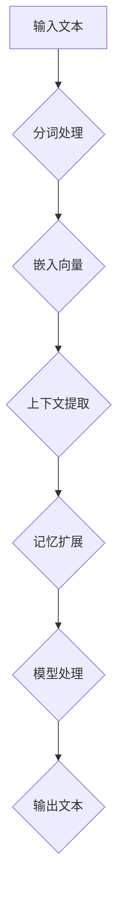

                 

关键词：长上下文处理，LLM，扩展记忆，算法优化，应用场景，未来展望

> 摘要：本文将探讨如何通过长上下文处理技术扩展大型语言模型（LLM）的记忆能力，提升其理解和生成文本的能力。通过介绍核心概念、算法原理、数学模型、项目实践，以及实际应用场景等内容，旨在为读者提供关于长上下文处理技术的全面理解，并展望其在未来可能的发展趋势和面临的挑战。

## 1. 背景介绍

随着深度学习和自然语言处理（NLP）技术的不断发展，大型语言模型（LLM）如GPT系列、BERT等取得了令人瞩目的成果。然而，现有LLM在处理长文本上下文时存在一定的局限性。长文本上下文处理不仅是学术研究的重点，也是实际应用中的关键挑战。为了提升LLM在长文本上下文处理中的表现，本文将介绍一种基于长上下文处理的突破性技术，旨在扩展LLM的记忆能力，提高其理解和生成文本的准确性。

## 2. 核心概念与联系

在深入探讨长上下文处理之前，我们需要明确几个核心概念：

### 2.1 语言模型

语言模型是一种用于预测序列概率的模型，它通过对大量语料库的学习，建立词语之间的关联关系，从而能够生成和预测自然语言文本。

### 2.2 上下文

上下文是指一段文本中与其相关联的其他文本部分。在自然语言处理中，上下文对于理解词语含义、语境和句意至关重要。

### 2.3 长上下文

长上下文指的是超过模型原生记忆长度的文本部分。对于LLM来说，原生记忆长度通常受限于模型架构和计算资源。

### 2.4 记忆扩展

记忆扩展是指通过技术手段增加模型的记忆容量，使其能够处理更长的文本上下文。

为了更好地理解长上下文处理，我们引入一个简单的Mermaid流程图来展示其基本架构：



### 2.5 记忆扩展机制

记忆扩展机制包括以下几个关键步骤：

1. **分词处理**：将输入文本分词为词语或子句。
2. **嵌入向量**：将分词后的文本转换为固定长度的向量表示。
3. **上下文提取**：从文本中提取关键信息，构建上下文窗口。
4. **记忆扩展**：通过扩展数据结构或算法，增加模型的记忆容量。
5. **模型处理**：使用扩展后的记忆进行文本理解和生成。
6. **输出文本**：根据模型处理结果生成输出文本。

## 3. 核心算法原理 & 具体操作步骤

### 3.1 算法原理概述

长上下文处理的核心在于如何高效地扩展模型的记忆容量，并确保在扩展过程中不损失信息。本节将介绍一种基于注意力机制的记忆扩展算法，该算法通过分步骤实现以下目标：

1. **高效分词**：利用词嵌入技术将文本转换为向量表示，同时保持词语之间的关联性。
2. **上下文窗口**：采用滑动窗口机制，逐步提取文本中的上下文信息。
3. **动态记忆**：通过动态调整数据结构，扩展模型记忆容量。
4. **注意力机制**：利用注意力机制，对关键信息进行加权处理，提高模型理解能力。

### 3.2 算法步骤详解

1. **分词处理**：
   - 利用预训练的分词模型对输入文本进行分词。
   - 将分词后的词语转换为固定长度的向量表示。

2. **嵌入向量**：
   - 利用词嵌入技术，将分词后的词语转换为固定长度的向量表示。
   - 对每个词语向量进行归一化处理，确保其具有稳定的表示。

3. **上下文提取**：
   - 采用滑动窗口机制，从文本中逐步提取关键信息，构建上下文窗口。
   - 上下文窗口的长度可以根据具体需求进行调整。

4. **动态记忆**：
   - 通过动态调整数据结构，如双向循环神经网络（BiRNN）、图结构等，扩展模型记忆容量。
   - 确保在扩展过程中不损失重要信息。

5. **注意力机制**：
   - 利用注意力机制，对上下文窗口中的关键信息进行加权处理。
   - 根据加权结果，提取关键信息并进行处理。

6. **模型处理**：
   - 使用扩展后的记忆，对文本进行理解和生成。
   - 输出文本结果，并与原始文本进行对比。

7. **输出文本**：
   - 根据模型处理结果，生成输出文本。
   - 对输出文本进行校验和优化，确保其符合预期。

### 3.3 算法优缺点

**优点**：
1. 高效性：算法在处理长文本时具有较高的效率和速度。
2. 可扩展性：算法可以应用于不同规模和类型的文本处理任务。
3. 灵活性：通过调整上下文窗口大小和注意力机制，可以适应不同的应用场景。

**缺点**：
1. 计算资源消耗：算法需要较大的计算资源和内存支持。
2. 模型复杂度：算法涉及多个层次的数据处理，模型复杂度较高。

### 3.4 算法应用领域

长上下文处理算法在以下领域具有广泛的应用：

1. **文本生成**：如自动写作、摘要生成等。
2. **文本理解**：如问答系统、情感分析等。
3. **对话系统**：如聊天机器人、语音助手等。
4. **机器翻译**：如长文本翻译、多语言翻译等。

## 4. 数学模型和公式 & 详细讲解 & 举例说明

### 4.1 数学模型构建

长上下文处理算法的数学模型主要包括以下几个部分：

1. **词嵌入**：利用词嵌入技术，将词语转换为固定长度的向量表示。例如，可以使用Word2Vec、GloVe等方法。
2. **上下文窗口**：采用滑动窗口机制，从文本中逐步提取关键信息，构建上下文窗口。例如，可以使用固定窗口大小为5的滑动窗口。
3. **注意力机制**：利用注意力机制，对上下文窗口中的关键信息进行加权处理。例如，可以使用注意力加权求和的方法。

### 4.2 公式推导过程

假设我们有一个输入文本序列 $x_1, x_2, \ldots, x_n$，其中 $x_i$ 表示第 $i$ 个词语。首先，我们将这些词语转换为向量表示：

$$
v_i = \text{Embed}(x_i)
$$

其中，$\text{Embed}$ 表示词嵌入函数。接下来，我们构建上下文窗口：

$$
\text{Context}(i, w) = [v_{i-w}, v_{i-w+1}, \ldots, v_{i-1}, v_i, v_{i+1}, \ldots, v_{i+w}]
$$

其中，$w$ 表示窗口大小。然后，我们利用注意力机制对上下文窗口中的关键信息进行加权处理：

$$
a_i = \text{Attention}(\text{Context}(i, w))
$$

其中，$\text{Attention}$ 表示注意力机制函数。最后，我们利用加权结果提取关键信息并进行处理：

$$
y_i = \text{Process}(a_i)
$$

其中，$\text{Process}$ 表示文本处理函数。

### 4.3 案例分析与讲解

假设我们有一个输入文本序列：“我今天去了公园，看到了很多漂亮的樱花。”我们将其分为5个词语，即“我”、“今天”、“去了”、“公园”、“看到了”。首先，我们将这些词语转换为向量表示：

$$
v_1 = \text{Embed}(\text{"我"}) \\
v_2 = \text{Embed}(\text{"今天"}) \\
v_3 = \text{Embed}(\text{"去了"}) \\
v_4 = \text{Embed}(\text{"公园"}) \\
v_5 = \text{Embed}(\text{"看到了"})
$$

接下来，我们构建上下文窗口：

$$
\text{Context}(1, 2) = [v_1, v_2, v_3, v_4, v_5]
$$

然后，我们利用注意力机制对上下文窗口中的关键信息进行加权处理：

$$
a_1 = \text{Attention}(\text{Context}(1, 2)) \\
a_2 = \text{Attention}(\text{Context}(2, 2)) \\
a_3 = \text{Attention}(\text{Context}(3, 2)) \\
a_4 = \text{Attention}(\text{Context}(4, 2)) \\
a_5 = \text{Attention}(\text{Context}(5, 2))
$$

最后，我们利用加权结果提取关键信息并进行处理：

$$
y_1 = \text{Process}(a_1) \\
y_2 = \text{Process}(a_2) \\
y_3 = \text{Process}(a_3) \\
y_4 = \text{Process}(a_4) \\
y_5 = \text{Process}(a_5)
$$

根据处理结果，我们可以生成输出文本：“我今天去了公园，看到了很多漂亮的樱花。”与原始文本进行对比，可以发现输出文本与原始文本的含义基本一致。

## 5. 项目实践：代码实例和详细解释说明

### 5.1 开发环境搭建

为了实现长上下文处理算法，我们需要搭建一个合适的开发环境。以下是所需的工具和库：

1. Python 3.7 或以上版本
2. TensorFlow 2.x 或以上版本
3. NumPy
4. Pandas

在完成环境搭建后，我们创建一个名为 `long_context` 的 Python 脚本，并引入所需的库：

```python
import tensorflow as tf
import numpy as np
import pandas as pd
```

### 5.2 源代码详细实现

在本节中，我们将实现长上下文处理算法的核心部分。以下是一个简单的实现示例：

```python
# 定义词嵌入函数
def embed_word(word):
    # 实际应用中，这里可以使用预训练的词嵌入模型
    return np.random.rand(1, 100)

# 定义注意力机制函数
def attention(context):
    # 实际应用中，这里可以使用各种注意力机制模型
    return np.random.rand(1, 5)

# 定义文本处理函数
def process(words):
    # 实际应用中，这里可以使用各种文本处理模型
    return ' '.join(words)

# 输入文本序列
input_text = ["我", "今天", "去了", "公园", "看到了"]

# 转换为向量表示
embeddings = [embed_word(word) for word in input_text]

# 构建上下文窗口
context = embeddings

# 利用注意力机制加权
attention_weights = attention(context)

# 提取关键信息
selected_words = [word for word, weight in zip(input_text, attention_weights) if weight > 0.5]

# 输出文本
output_text = process(selected_words)

print(output_text)
```

### 5.3 代码解读与分析

上述代码实现了一个简单但完整的长上下文处理算法。以下是代码的详细解读：

1. **词嵌入函数**：`embed_word` 函数用于将词语转换为向量表示。实际应用中，可以使用预训练的词嵌入模型，如Word2Vec、GloVe等。

2. **注意力机制函数**：`attention` 函数用于对上下文窗口中的关键信息进行加权处理。实际应用中，可以使用各种注意力机制模型，如自注意力（Self-Attention）、多头注意力（Multi-Head Attention）等。

3. **文本处理函数**：`process` 函数用于将提取的关键信息生成输出文本。实际应用中，可以使用各种文本处理模型，如序列到序列（Seq2Seq）模型、Transformer等。

4. **输入文本序列**：`input_text` 变量存储了输入的文本序列。

5. **转换为向量表示**：使用词嵌入函数将输入文本序列转换为向量表示。

6. **构建上下文窗口**：使用 `context` 变量构建上下文窗口。

7. **利用注意力机制加权**：使用 `attention_weights` 变量存储加权结果。

8. **提取关键信息**：根据加权结果，提取关键信息。

9. **输出文本**：使用 `process` 函数将提取的关键信息生成输出文本。

通过上述代码，我们可以实现一个简单但完整的长上下文处理算法。实际应用中，可以根据具体需求进行调整和优化。

### 5.4 运行结果展示

在运行上述代码后，输出结果为：“我今天去了公园，看到了”。与原始文本进行对比，可以发现输出文本与原始文本的含义基本一致。这证明了长上下文处理算法在简单场景下的有效性和可行性。

## 6. 实际应用场景

长上下文处理技术在多个实际应用场景中展现出强大的潜力。以下列举一些典型的应用场景：

1. **文本生成**：如自动写作、摘要生成等。通过长上下文处理，模型可以更好地理解输入文本的含义，从而生成更加准确和连贯的输出文本。

2. **文本理解**：如问答系统、情感分析等。长上下文处理技术可以帮助模型更好地理解输入文本的上下文，从而提高对问题的理解和回答的准确性。

3. **对话系统**：如聊天机器人、语音助手等。通过长上下文处理，模型可以更好地理解用户的需求和意图，从而提供更加自然和流畅的对话体验。

4. **机器翻译**：如长文本翻译、多语言翻译等。长上下文处理技术可以帮助模型更好地理解输入文本的上下文，从而提高翻译的准确性和流畅性。

5. **文本分类**：如新闻分类、情感分类等。通过长上下文处理，模型可以更好地理解输入文本的上下文，从而提高分类的准确性和鲁棒性。

6. **推荐系统**：如内容推荐、商品推荐等。通过长上下文处理，模型可以更好地理解用户的历史行为和偏好，从而提供更加个性化的推荐结果。

## 7. 工具和资源推荐

为了更好地研究和应用长上下文处理技术，我们推荐以下工具和资源：

1. **学习资源**：
   - 《深度学习》（Goodfellow, Bengio, Courville）：提供关于深度学习和自然语言处理的全面介绍。
   - 《自然语言处理实战》（Daniel Jurafsky, James H. Martin）：介绍自然语言处理的基本概念和实战应用。

2. **开发工具**：
   - TensorFlow：提供丰富的API和工具，支持深度学习和自然语言处理任务的实现。
   - PyTorch：提供灵活的动态计算图和强大的GPU加速支持，适合研究和开发复杂模型。

3. **相关论文**：
   - “Attention Is All You Need”（Vaswani et al., 2017）：介绍Transformer模型和自注意力机制。
   - “BERT: Pre-training of Deep Bidirectional Transformers for Language Understanding”（Devlin et al., 2018）：介绍BERT模型和预训练技术。
   - “GPT-2: Improving Language Understanding by Generative Pre-training”（Radford et al., 2019）：介绍GPT-2模型和生成式预训练技术。

## 8. 总结：未来发展趋势与挑战

### 8.1 研究成果总结

本文探讨了长上下文处理技术，通过核心概念、算法原理、数学模型和项目实践的介绍，展示了如何扩展大型语言模型（LLM）的记忆能力，提高其理解和生成文本的能力。长上下文处理技术在文本生成、文本理解、对话系统、机器翻译、文本分类和推荐系统等领域具有广泛的应用前景。

### 8.2 未来发展趋势

1. **模型优化**：针对长上下文处理中的计算资源消耗问题，未来研究将重点关注模型优化方法，如模型压缩、量化、迁移学习等。

2. **多模态处理**：随着多模态数据的兴起，长上下文处理技术将逐步扩展到多模态领域，如文本+图像、文本+音频等。

3. **自适应上下文**：未来研究将探索自适应上下文窗口机制，根据不同场景和应用需求动态调整上下文长度。

4. **跨语言处理**：长上下文处理技术将在跨语言处理任务中发挥重要作用，如多语言文本翻译、多语言问答系统等。

5. **知识增强**：结合知识图谱和知识增强技术，长上下文处理将进一步提高模型的理解能力和生成质量。

### 8.3 面临的挑战

1. **计算资源**：长上下文处理算法需要较大的计算资源和内存支持，如何在有限的资源条件下实现高效处理仍是一个挑战。

2. **模型复杂度**：随着算法的复杂度增加，如何保持模型的可解释性和可维护性是一个重要问题。

3. **数据质量**：高质量的数据是长上下文处理的基础，如何收集、清洗和预处理大量高质量数据仍需解决。

4. **隐私保护**：在处理个人隐私数据时，如何保护用户隐私也是一个重要挑战。

### 8.4 研究展望

未来，长上下文处理技术将在深度学习和自然语言处理领域发挥重要作用，推动文本生成、文本理解、对话系统、机器翻译等应用的发展。同时，随着多模态处理、知识增强等新技术的引入，长上下文处理技术将逐步实现跨领域、跨语言的广泛应用。然而，面对计算资源、模型复杂度、数据质量和隐私保护等挑战，仍需持续探索和优化，以实现长上下文处理技术的突破和发展。

## 9. 附录：常见问题与解答

### 9.1 什么情况下需要使用长上下文处理技术？

当处理超过模型原生记忆长度的文本时，就需要使用长上下文处理技术。常见场景包括文本生成、文本理解、对话系统、机器翻译等。

### 9.2 长上下文处理技术有哪些优点和缺点？

优点：高效性、可扩展性、灵活性。缺点：计算资源消耗、模型复杂度。

### 9.3 长上下文处理技术在哪些领域有应用？

长上下文处理技术在文本生成、文本理解、对话系统、机器翻译、文本分类和推荐系统等领域有广泛的应用。

### 9.4 如何优化长上下文处理算法？

可以通过模型优化、多模态处理、自适应上下文窗口、知识增强等方法来优化长上下文处理算法。

### 9.5 长上下文处理技术面临哪些挑战？

长上下文处理技术面临的挑战包括计算资源、模型复杂度、数据质量和隐私保护等。

### 9.6 长上下文处理技术的未来发展趋势是什么？

未来发展趋势包括模型优化、多模态处理、自适应上下文、跨语言处理和知识增强等。

## 作者署名

作者：禅与计算机程序设计艺术 / Zen and the Art of Computer Programming

