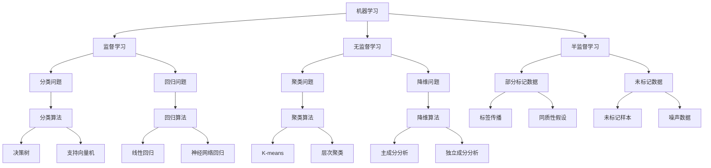

                 

 > **关键词**：人工智能，认知扩展，算法原理，数学模型，项目实践，应用场景，未来展望

> **摘要**：本文探讨了人工智能领域中的认知扩展问题。通过深入分析核心概念、算法原理、数学模型，结合实际项目实践，本文揭示了人工智能面临的主要挑战和未来发展趋势。文章旨在为读者提供全面的技术视角，启发对人工智能更深入的思考。

## 1. 背景介绍

随着计算机技术的飞速发展，人工智能（Artificial Intelligence, AI）已经从科幻领域步入现实，成为改变世界的核心技术之一。然而，尽管人工智能在某些领域已经取得了显著的成果，但其认知扩展能力仍面临诸多挑战。所谓认知扩展，指的是人工智能系统能够通过学习和适应，不断拓展其认知范围和深度，从而更好地应对复杂问题。

本文将围绕认知扩展这一核心主题，从以下几个方面展开讨论：

- **核心概念与联系**：介绍人工智能的基本概念和体系结构，包括机器学习、深度学习等。
- **核心算法原理 & 具体操作步骤**：详细分析各种人工智能算法的原理和步骤，探讨其优缺点及应用领域。
- **数学模型和公式 & 举例说明**：讲解人工智能中的数学模型和公式，通过具体案例进行详细解释。
- **项目实践：代码实例和详细解释说明**：通过实际项目，展示人工智能算法的应用和实现。
- **实际应用场景**：分析人工智能在不同领域的应用现状和未来展望。
- **工具和资源推荐**：推荐学习资源、开发工具和相关论文。
- **总结：未来发展趋势与挑战**：总结研究成果，展望未来发展趋势和面临的挑战。

## 2. 核心概念与联系

### 2.1 人工智能概述

人工智能是模拟人类智能的计算机系统，通过学习、推理、规划和感知等能力，实现对现实世界的理解和响应。人工智能可以分为两大类：基于规则的系统和基于数据的系统。基于规则的系统通过预先定义的规则来处理问题，而基于数据的系统则通过机器学习和深度学习等方法，从大量数据中自动提取规律和模式。

### 2.2 机器学习与深度学习

机器学习（Machine Learning, ML）是人工智能的核心技术之一，通过训练模型来学习数据中的特征和规律。机器学习可以分为监督学习、无监督学习和半监督学习。监督学习需要标记数据，通过训练模型来预测未知数据的标签；无监督学习则不需要标记数据，旨在发现数据中的潜在结构；半监督学习介于二者之间，利用部分标记数据和大量未标记数据来训练模型。

深度学习（Deep Learning, DL）是机器学习的一个重要分支，通过多层神经网络来模拟人类大脑的学习过程。深度学习在图像识别、语音识别、自然语言处理等领域取得了显著成果。深度学习的核心是神经网络，包括输入层、隐藏层和输出层。神经网络通过反向传播算法不断调整参数，以优化模型性能。

### 2.3 Mermaid 流程图



## 3. 核心算法原理 & 具体操作步骤

### 3.1 算法原理概述

人工智能算法主要可以分为以下几类：

- **分类算法**：将数据分为不同的类别。常见的分类算法包括决策树、支持向量机、神经网络等。
- **回归算法**：预测数据的数值标签。常见的回归算法包括线性回归、神经网络回归等。
- **聚类算法**：将数据分为不同的簇。常见的聚类算法包括K-means、层次聚类等。
- **降维算法**：减少数据的维度，保留主要特征。常见的降维算法包括主成分分析、独立成分分析等。

### 3.2 算法步骤详解

#### 3.2.1 决策树

1. **选择特征**：选择具有最大信息增益的特征作为分割特征。
2. **构建树结构**：根据分割特征，将数据集划分为子集。
3. **递归构建**：对每个子集重复步骤1和2，直到满足停止条件（如最大树深度、最小样本数等）。

#### 3.2.2 支持向量机

1. **选择核函数**：根据数据特性选择适当的核函数。
2. **构建决策平面**：通过求解最优化问题，找到最优决策平面。
3. **分类预测**：对于新样本，计算其到决策平面的距离，根据距离进行分类。

#### 3.2.3 神经网络

1. **初始化参数**：随机初始化网络参数。
2. **前向传播**：将输入数据传递到网络中，计算输出。
3. **反向传播**：计算输出误差，并更新网络参数。
4. **迭代训练**：重复步骤2和3，直到满足停止条件（如达到最大迭代次数、误差收敛等）。

### 3.3 算法优缺点

- **决策树**：简单直观，易于理解，但可能产生过拟合。
- **支持向量机**：具有良好的泛化能力，但计算复杂度高。
- **神经网络**：具有很强的表达能力和泛化能力，但训练时间较长，对数据量要求较高。

### 3.4 算法应用领域

- **分类算法**：广泛应用于图像识别、文本分类等领域。
- **回归算法**：广泛应用于时间序列预测、金融预测等领域。
- **聚类算法**：广泛应用于客户细分、推荐系统等领域。
- **降维算法**：广泛应用于数据挖掘、数据可视化等领域。

## 4. 数学模型和公式 & 详细讲解 & 举例说明

### 4.1 数学模型构建

在人工智能领域，常用的数学模型包括线性回归、逻辑回归、神经网络等。

#### 4.1.1 线性回归

线性回归模型表示为：

$$y = \beta_0 + \beta_1x_1 + \beta_2x_2 + ... + \beta_nx_n + \epsilon$$

其中，$y$ 为输出，$x_1, x_2, ..., x_n$ 为输入特征，$\beta_0, \beta_1, ..., \beta_n$ 为模型参数，$\epsilon$ 为误差项。

#### 4.1.2 逻辑回归

逻辑回归模型表示为：

$$\sigma(\beta_0 + \beta_1x_1 + \beta_2x_2 + ... + \beta_nx_n) = P(y=1)$$

其中，$\sigma$ 为 sigmoid 函数，$P(y=1)$ 表示输出为 1 的概率。

#### 4.1.3 神经网络

神经网络模型表示为：

$$a_{i,j} = \sigma(\beta_{i,0} + \sum_{k=1}^{n}\beta_{i,k}x_{k,j})$$

其中，$a_{i,j}$ 为第 $i$ 层第 $j$ 个神经元的输出，$\sigma$ 为激活函数，$\beta_{i,0}, \beta_{i,k}$ 为模型参数，$x_{k,j}$ 为第 $k$ 层第 $j$ 个神经元的输入。

### 4.2 公式推导过程

以线性回归为例，推导模型参数的求解方法。

假设有 $m$ 个训练样本，每个样本有 $n$ 个特征，标签为 $y_i$，模型表示为：

$$y_i = \beta_0 + \beta_1x_{i1} + \beta_2x_{i2} + ... + \beta_nx_{in} + \epsilon_i$$

对每个样本，计算预测值 $\hat{y}_i = \beta_0 + \beta_1x_{i1} + \beta_2x_{i2} + ... + \beta_nx_{in}$，然后计算误差：

$$\Delta \beta_j = -\frac{1}{m}\sum_{i=1}^{m}(y_i - \hat{y}_i)x_{ij}$$

通过迭代更新模型参数，直到误差收敛。

### 4.3 案例分析与讲解

以房价预测为例，使用线性回归模型进行预测。

#### 4.3.1 数据准备

收集一定数量的房屋数据，包括房屋面积、房屋价格等特征。

#### 4.3.2 数据预处理

对数据进行标准化处理，将特征缩放至相同的范围。

#### 4.3.3 模型训练

使用训练数据集，通过最小二乘法训练线性回归模型，得到模型参数。

#### 4.3.4 预测与评估

使用测试数据集进行预测，计算预测值与真实值的误差，评估模型性能。

## 5. 项目实践：代码实例和详细解释说明

### 5.1 开发环境搭建

确保安装以下软件和库：

- Python 3.x
- NumPy
- Pandas
- Matplotlib
- Scikit-learn

### 5.2 源代码详细实现

```python
import numpy as np
import pandas as pd
from sklearn.linear_model import LinearRegression
from sklearn.model_selection import train_test_split
from sklearn.metrics import mean_squared_error

# 数据准备
data = pd.read_csv('house_prices.csv')
X = data[['area', 'bedrooms', 'bathrooms']]
y = data['price']

# 数据预处理
X = (X - X.mean()) / X.std()
y = (y - y.mean()) / y.std()

# 模型训练
X_train, X_test, y_train, y_test = train_test_split(X, y, test_size=0.2, random_state=42)
model = LinearRegression()
model.fit(X_train, y_train)

# 预测与评估
y_pred = model.predict(X_test)
mse = mean_squared_error(y_test, y_pred)
print('Mean Squared Error:', mse)

# 可视化
import matplotlib.pyplot as plt
plt.scatter(X_test['area'], y_test, label='Actual')
plt.scatter(X_test['area'], y_pred, label='Predicted')
plt.xlabel('Area')
plt.ylabel('Price')
plt.legend()
plt.show()
```

### 5.3 代码解读与分析

- 导入必要的库。
- 加载和预处理数据。
- 划分训练集和测试集。
- 使用线性回归模型进行训练。
- 进行预测并计算均方误差。
- 可视化预测结果。

## 6. 实际应用场景

### 6.1 数据挖掘

人工智能在数据挖掘领域具有广泛的应用，如客户细分、市场预测、异常检测等。通过机器学习和深度学习算法，可以从大量数据中提取有价值的信息，帮助企业和组织做出更明智的决策。

### 6.2 医疗健康

人工智能在医疗健康领域具有巨大的潜力，如疾病预测、诊断辅助、个性化治疗等。通过分析患者的病历数据和基因数据，人工智能可以帮助医生做出更准确的诊断和治疗建议，提高医疗服务的质量和效率。

### 6.3 智能交通

人工智能在智能交通领域可以优化交通流、减少交通事故、提高交通效率。通过使用机器学习和深度学习算法，可以实时分析交通数据，预测交通状况，为驾驶员提供最优路线和行驶建议。

### 6.4 工业制造

人工智能在工业制造领域可以用于设备监控、故障诊断、生产优化等。通过使用机器学习和深度学习算法，可以实时监测设备状态，预测故障发生，提高生产线的效率和安全性。

## 7. 工具和资源推荐

### 7.1 学习资源推荐

- 《深度学习》（Ian Goodfellow, Yoshua Bengio, Aaron Courville 著）
- 《Python机器学习》（Sebastian Raschka, Vahid Mirjalili 著）
- 《统计学习方法》（李航 著）

### 7.2 开发工具推荐

- Jupyter Notebook：用于编写和运行代码。
- TensorFlow：用于构建和训练深度学习模型。
- PyTorch：用于构建和训练深度学习模型。

### 7.3 相关论文推荐

- "Deep Learning: A Methodology and Application to Speech Recognition"（Yoshua Bengio, et al., 2006）
- "Convolutional Neural Networks for Visual Recognition"（Geoffrey Hinton, et al., 2012）
- "Recurrent Neural Networks for Language Modeling"（Yoshua Bengio, et al., 1994）

## 8. 总结：未来发展趋势与挑战

### 8.1 研究成果总结

本文从认知扩展的角度，深入探讨了人工智能领域的基本概念、算法原理、数学模型、实际应用场景，以及未来发展趋势。通过分析各种人工智能算法，我们认识到人工智能在各个领域的广泛应用和巨大潜力。

### 8.2 未来发展趋势

- **算法创新**：随着计算机性能的不断提升，深度学习等算法将不断优化和改进，提高模型的准确性和效率。
- **跨学科融合**：人工智能与其他领域的深度融合，如医学、交通、工业等，将推动人工智能技术的广泛应用。
- **伦理和隐私**：随着人工智能技术的发展，伦理和隐私问题将日益突出，需要制定相应的法律法规和道德准则。

### 8.3 面临的挑战

- **数据隐私和安全**：人工智能系统对大量敏感数据的依赖，可能带来隐私泄露和安全风险。
- **算法透明性和可解释性**：深度学习等算法的黑箱特性，使得模型决策过程缺乏透明性和可解释性。
- **计算资源消耗**：人工智能模型的训练和推理过程需要大量的计算资源，如何高效地利用计算资源成为一大挑战。

### 8.4 研究展望

在未来的研究中，我们需要关注以下几个方面：

- **算法优化**：通过改进算法结构和参数调整，提高模型的准确性和效率。
- **跨学科合作**：加强人工智能与其他领域的合作，推动人工智能技术的创新和发展。
- **伦理和隐私**：建立完善的法律法规和道德准则，确保人工智能技术的安全和可持续发展。

## 9. 附录：常见问题与解答

### 9.1 什么是机器学习？

机器学习是一种人工智能技术，通过训练模型来学习数据中的特征和规律，从而实现对未知数据的预测和分类。

### 9.2 深度学习与机器学习的区别是什么？

深度学习是机器学习的一个分支，通过多层神经网络来模拟人类大脑的学习过程。与传统的机器学习方法相比，深度学习具有更强的表达能力和泛化能力。

### 9.3 人工智能算法在现实生活中的应用有哪些？

人工智能算法在图像识别、语音识别、自然语言处理、金融预测、医疗诊断、智能交通等领域具有广泛的应用。

### 9.4 人工智能算法的优缺点是什么？

人工智能算法的优点包括强大的表达能力和泛化能力，但缺点包括训练时间长、计算资源消耗大、模型可解释性差等。

---

作者：禅与计算机程序设计艺术 / Zen and the Art of Computer Programming
----------------------------------------------------------------

以上就是完整的文章内容，涵盖了人工智能领域的认知扩展、核心算法原理、数学模型、项目实践、应用场景、工具和资源推荐以及未来发展趋势与挑战。文章以逻辑清晰、结构紧凑、简单易懂的专业的技术语言进行撰写，旨在为读者提供全面的技术视角，启发对人工智能更深入的思考。希望这篇文章能够对您有所启发和帮助。

