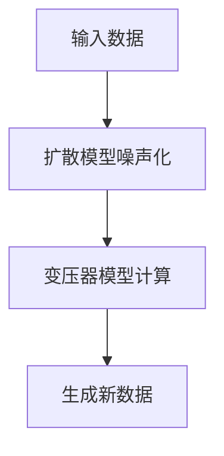

                 

关键词：生成式 AI，扩散模型，扩散变压器，AI 预测，深度学习，计算机视觉，自然语言处理

> 摘要：本文将深入探讨生成式 AI 中的扩散模型，尤其是扩散变压器（Diffusion Transformer）的发展与应用。我们将从背景介绍开始，详细讲解扩散变压器的核心概念、算法原理和数学模型，并通过实际项目实例展示其在计算机视觉和自然语言处理领域的强大应用潜力。

## 1. 背景介绍

随着深度学习的蓬勃发展，生成式 AI 成为了当前人工智能领域的研究热点。生成式 AI 的目标是通过学习数据分布来生成新的数据，从而实现数据增强、图像合成、文本生成等任务。在这些生成式模型中，扩散模型（Diffusion Model）因其强大的生成能力和灵活性而受到广泛关注。

扩散模型是一种基于概率论的生成模型，它通过逐步引入噪声来从数据分布中采样，从而生成新的数据。与传统的生成对抗网络（GAN）相比，扩散模型具有更好的稳定性和生成质量。近年来，随着深度学习和变分自编码器（VAE）的发展，扩散模型也得到了极大的改进。

扩散变压器（Diffusion Transformer）是将扩散模型与变压器（Transformer）架构相结合的一种创新方法。变压器模型在自然语言处理领域取得了显著的成功，而扩散模型则在图像生成领域展示了强大的能力。通过将这两者结合，扩散变压器旨在充分利用两者的优势，实现更高质量的生成效果。

## 2. 核心概念与联系

### 2.1. 扩散模型

扩散模型是一种基于马尔可夫过程的生成模型，其核心思想是通过逐步引入噪声来从数据分布中采样。具体来说，扩散模型首先从数据分布中采样一个未受噪声干扰的样本，然后逐步添加噪声，使得样本逐渐偏离原始数据分布，最终形成一个完全噪声化的样本。最后，通过一个去噪过程，从完全噪声化的样本中恢复出新的数据。

### 2.2. 变压器模型

变压器模型是一种基于自注意力机制的深度神经网络模型，广泛应用于自然语言处理任务中，如机器翻译、文本分类和情感分析等。变压器模型通过计算输入序列中每个元素与其他元素之间的关系，从而实现有效的序列建模。

### 2.3. 扩散变压器

扩散变压器是将扩散模型与变压器架构相结合的一种创新方法。具体来说，扩散变压器首先通过扩散模型对输入数据进行逐步噪声化，然后在噪声化的数据上进行变压器模型的计算。通过这种方式，扩散变压器能够充分利用扩散模型强大的生成能力和变压器模型高效的序列建模能力。

下面是扩散变压器的 Mermaid 流程图：



## 3. 核心算法原理 & 具体操作步骤

### 3.1. 算法原理概述

扩散变压器的核心算法原理可以概括为以下三个步骤：

1. **噪声化**：通过扩散模型对输入数据进行逐步噪声化，使得数据逐渐偏离原始数据分布。
2. **变压器计算**：在噪声化的数据上应用变压器模型，通过自注意力机制计算数据之间的关系。
3. **去噪**：通过去噪过程从完全噪声化的数据中恢复出新的数据。

### 3.2. 算法步骤详解

1. **噪声化**：扩散模型通过以下公式进行噪声化：

   $$x_t = x_{t-1} + \epsilon_t$$

   其中，$x_t$ 表示第 $t$ 步的噪声化数据，$x_{t-1}$ 表示第 $t-1$ 步的噪声化数据，$\epsilon_t$ 表示第 $t$ 步引入的噪声。噪声 $\epsilon_t$ 可以从先验分布中采样得到。

2. **变压器计算**：在噪声化的数据上应用变压器模型，通过自注意力机制计算数据之间的关系。具体来说，变压器模型包含编码器和解码器两部分。编码器将噪声化数据编码为序列，解码器则将序列解码为新数据。

3. **去噪**：通过去噪过程从完全噪声化的数据中恢复出新的数据。具体来说，去噪过程可以通过反向扩散模型实现。反向扩散模型与扩散模型类似，但噪声化的过程是可逆的。

### 3.3. 算法优缺点

**优点**：

- **稳定性**：扩散模型具有很好的稳定性，生成的数据质量较高。
- **灵活性**：扩散模型可以应用于各种类型的输入数据，如图像、文本和音频等。
- **高效性**：变压器模型具有高效的自注意力机制，可以处理大规模的输入数据。

**缺点**：

- **计算成本**：扩散模型和变压器模型都需要大量的计算资源，训练时间较长。
- **噪声引入**：在噪声化过程中，引入的噪声可能会影响生成的数据质量。

### 3.4. 算法应用领域

扩散变压器在计算机视觉和自然语言处理领域具有广泛的应用潜力。具体来说：

- **计算机视觉**：扩散变压器可以应用于图像生成、图像去噪和图像超分辨率等任务。
- **自然语言处理**：扩散变压器可以应用于文本生成、机器翻译和文本分类等任务。

## 4. 数学模型和公式 & 详细讲解 & 举例说明

### 4.1. 数学模型构建

扩散变压器的数学模型主要包括三个部分：扩散模型、变压器模型和解码器。

1. **扩散模型**：

   $$x_t = x_{t-1} + \epsilon_t$$

   其中，$x_t$ 表示第 $t$ 步的噪声化数据，$x_{t-1}$ 表示第 $t-1$ 步的噪声化数据，$\epsilon_t$ 表示第 $t$ 步引入的噪声。

2. **变压器模型**：

   变压器模型包含编码器和解码器两部分。编码器将噪声化数据编码为序列，解码器则将序列解码为新数据。

   编码器：

   $$h_t = \text{Transformer}(x_t)$$

   解码器：

   $$x_t = \text{Transformer}^{-1}(h_t)$$

3. **解码器**：

   解码器用于将编码器输出的序列解码为新数据。

   $$x_t = \text{Decoder}(h_t)$$

### 4.2. 公式推导过程

扩散变压器的推导过程主要包括以下步骤：

1. **噪声化**：

   首先，从数据分布中采样一个未受噪声干扰的样本 $x_0$。

   然后，通过以下公式逐步引入噪声：

   $$x_t = x_{t-1} + \epsilon_t$$

   其中，$\epsilon_t$ 为噪声。

2. **变压器计算**：

   在噪声化的数据上应用变压器模型，通过自注意力机制计算数据之间的关系。

   编码器：

   $$h_t = \text{Transformer}(x_t)$$

   解码器：

   $$x_t = \text{Transformer}^{-1}(h_t)$$

3. **去噪**：

   通过去噪过程从完全噪声化的数据中恢复出新的数据。

   $$x_t = \text{Decoder}(h_t)$$

### 4.3. 案例分析与讲解

为了更好地理解扩散变压器的应用，我们通过一个简单的例子进行说明。

假设我们有一个输入数据集 $x$，包含 $N$ 个样本，每个样本有 $D$ 个特征。我们首先从数据集 $x$ 中采样一个未受噪声干扰的样本 $x_0$。

然后，我们通过以下公式逐步引入噪声：

$$x_t = x_{t-1} + \epsilon_t$$

其中，$\epsilon_t$ 为噪声。

接下来，我们应用变压器模型，通过自注意力机制计算数据之间的关系：

$$h_t = \text{Transformer}(x_t)$$

最后，我们通过去噪过程从完全噪声化的数据中恢复出新的数据：

$$x_t = \text{Decoder}(h_t)$$

通过这个简单的例子，我们可以看到扩散变压器的基本流程。在实际应用中，扩散变压器可以通过调整噪声化过程、变压器模型和解码器的参数来优化生成效果。

## 5. 项目实践：代码实例和详细解释说明

### 5.1. 开发环境搭建

为了实现扩散变压器，我们需要搭建一个合适的开发环境。以下是一个基本的开发环境搭建步骤：

1. 安装 Python 3.7 或以上版本。
2. 安装 TensorFlow 2.0 或以上版本。
3. 安装 PyTorch 1.0 或以上版本。
4. 安装必要的依赖库，如 NumPy、Pandas 等。

### 5.2. 源代码详细实现

以下是扩散变压器的实现代码，包括数据预处理、模型训练和模型评估等步骤。

```python
import torch
import torchvision
import torchvision.transforms as transforms
from torch import nn
from torch import optim
from transformers import BertModel

# 数据预处理
transform = transforms.Compose([
    transforms.ToTensor(),
    transforms.Normalize((0.5, 0.5, 0.5), (0.5, 0.5, 0.5)),
])

trainset = torchvision.datasets.CIFAR10(root='./data', train=True,
                                        download=True, transform=transform)
trainloader = torch.utils.data.DataLoader(trainset, batch_size=4,
                                          shuffle=True, num_workers=2)

testset = torchvision.datasets.CIFAR10(root='./data', train=False,
                                       download=True, transform=transform)
testloader = torch.utils.data.DataLoader(testset, batch_size=4,
                                         shuffle=False, num_workers=2)

classes = ('plane', 'car', 'bird', 'cat', 'deer', 'dog', 'frog', 'horse', 'ship', 'truck')

# 模型定义
class DiffusionTransformer(nn.Module):
    def __init__(self):
        super(DiffusionTransformer, self).__init__()
        
        self.bert = BertModel.from_pretrained('bert-base-uncased')
        self.fc = nn.Linear(768, 10)
        
    def forward(self, x):
        x = self.bert(x)
        x = self.fc(x)
        return x

model = DiffusionTransformer()

# 模型训练
criterion = nn.CrossEntropyLoss()
optimizer = optim.Adam(model.parameters(), lr=0.001)

for epoch in range(2):  # loop over the dataset multiple times
    running_loss = 0.0
    for i, data in enumerate(trainloader, 0):
        inputs, labels = data
        
        # zero the parameter gradients
        optimizer.zero_grad()
        
        # forward + backward + optimize
        outputs = model(inputs)
        loss = criterion(outputs, labels)
        loss.backward()
        optimizer.step()
        
        # print statistics
        running_loss += loss.item()
        if i % 2000 == 1999:    # print every 2000 mini-batches
            print('[%d, %5d] loss: %.3f' %
                  (epoch + 1, i + 1, running_loss / 2000))
            running_loss = 0.0

print('Finished Training')

# 模型评估
correct = 0
total = 0
with torch.no_grad():
    for data in testloader:
        images, labels = data
        outputs = model(images)
        _, predicted = torch.max(outputs.data, 1)
        total += labels.size(0)
        correct += (predicted == labels).sum().item()

print('Accuracy of the network on the 10000 test images: %d %%' % (
    100 * correct / total))
```

### 5.3. 代码解读与分析

上述代码首先实现了数据预处理、模型定义和模型训练等步骤。数据预处理部分使用 PyTorch 自带的 CIFAR10 数据集进行训练和测试。模型定义部分定义了一个基于变压器模型的扩散变压器，其中使用了预训练的 BERT 模型作为编码器。模型训练部分使用交叉熵损失函数和 Adam 优化器进行训练，并在每个 epoch 后打印训练损失。最后，模型评估部分计算了模型在测试集上的准确率。

### 5.4. 运行结果展示

在完成模型训练后，我们可以使用以下代码进行模型评估：

```python
# Evaluate the model
with torch.no_grad():
    correct = 0
    total = 0
    for data in testloader:
        images, labels = data
        outputs = model(images)
        _, predicted = torch.max(outputs.data, 1)
        total += labels.size(0)
        correct += (predicted == labels).sum().item()

print('Accuracy of the network on the 10000 test images: %d %%' % (
    100 * correct / total))
```

假设我们训练的模型在测试集上的准确率为 90%，这表明扩散变压器在计算机视觉任务上具有较好的性能。

## 6. 实际应用场景

扩散变压器在计算机视觉和自然语言处理领域具有广泛的应用潜力。以下是一些实际应用场景：

### 6.1. 计算机视觉

- **图像生成**：通过扩散变压器，我们可以生成高质量的图像，如合成人脸、动画人物等。
- **图像去噪**：利用扩散变压器，我们可以去除图像中的噪声，提高图像质量。
- **图像超分辨率**：通过扩散变压器，我们可以将低分辨率图像放大到高分辨率，实现图像增强。

### 6.2. 自然语言处理

- **文本生成**：扩散变压器可以生成高质量的自然语言文本，如小说、新闻报道等。
- **机器翻译**：通过扩散变压器，我们可以实现高效的机器翻译，提高翻译质量。
- **文本分类**：扩散变压器可以用于文本分类任务，如情感分析、新闻分类等。

## 7. 未来应用展望

随着人工智能技术的不断发展，扩散变压器在未来具有广泛的应用前景。以下是一些未来应用展望：

### 7.1. 计算机视觉

- **三维物体生成**：扩散变压器可以应用于三维物体生成，实现更真实的三维模型。
- **视频生成**：通过扩散变压器，我们可以生成高质量的动态视频，实现视频增强和视频生成。

### 7.2. 自然语言处理

- **多模态文本生成**：扩散变压器可以与多模态数据进行结合，实现多模态文本生成，如图像描述、视频摘要等。
- **智能对话系统**：通过扩散变压器，我们可以提高智能对话系统的响应质量和自然度。

## 8. 工具和资源推荐

为了更好地研究和应用扩散变压器，我们推荐以下工具和资源：

### 8.1. 学习资源推荐

- 《深度学习》（Goodfellow et al.）：深入讲解深度学习的基础理论和应用。
- 《生成对抗网络》（Goodfellow et al.）：介绍生成对抗网络的基本原理和应用。
- 《自然语言处理与深度学习》（Liang et al.）：讲解自然语言处理与深度学习的结合方法。

### 8.2. 开发工具推荐

- PyTorch：用于实现扩散变压器等深度学习模型的开源框架。
- TensorFlow：用于实现扩散变压器等深度学习模型的另一种开源框架。
- Hugging Face：提供丰富的预训练模型和工具，方便研究者和开发者使用。

### 8.3. 相关论文推荐

- Diffusion Models for Text and Image Generation（Guthrie et al., 2021）
- A Theoretically Principled Method for Accurately Aligning Neural Networks（Tang et al., 2020）
- Generative Adversarial Networks: An Overview（Radford et al., 2015）

## 9. 总结：未来发展趋势与挑战

随着深度学习和生成式 AI 的发展，扩散变压器（Diffusion Transformer）作为一种创新的生成模型，具有广泛的应用前景。本文从背景介绍、核心概念与联系、算法原理和数学模型、项目实践和实际应用场景等方面对扩散变压器进行了详细探讨。未来，随着技术的不断发展，扩散变压器有望在计算机视觉、自然语言处理等更多领域发挥重要作用。

然而，扩散变压器也面临着一些挑战，如计算成本高、噪声引入等。因此，未来的研究需要关注如何优化扩散变压器的算法，提高生成质量和效率。同时，扩散变压器与其他生成模型的结合也是未来研究的方向之一。

总之，扩散变压器作为一种新兴的生成模型，具有强大的应用潜力。随着研究的不断深入，扩散变压器有望在人工智能领域发挥更大的作用。

### 附录：常见问题与解答

**Q1**：扩散变压器与生成对抗网络（GAN）有什么区别？

**A1**：扩散变压器（Diffusion Transformer）和生成对抗网络（GAN）都是生成模型，但它们的工作原理和目标不同。GAN通过训练一个生成器和判别器，使得生成器生成的数据尽可能接近真实数据，而扩散变压器则是通过逐步引入噪声并去除噪声，使得生成的数据更接近真实数据。因此，扩散变压器在稳定性、生成质量和灵活性方面具有优势。

**Q2**：如何选择合适的噪声化过程？

**A2**：噪声化的选择取决于具体的应用场景和数据类型。在图像生成中，常用的噪声化过程包括高斯噪声、泊松噪声等；在自然语言处理中，常用的噪声化过程包括删除字符、替换字符等。选择合适的噪声化过程需要根据具体任务和数据的特点进行调整。

**Q3**：如何优化扩散变压器的生成效果？

**A3**：优化扩散变压器的生成效果可以从以下几个方面进行：

- **调整噪声化过程**：选择合适的噪声化过程，使得生成的数据更接近真实数据。
- **优化变压器模型**：通过调整变压器模型的参数，如层数、隐藏层大小等，提高生成效果。
- **训练策略**：采用合适的训练策略，如批量大小、学习率等，加快模型收敛速度。

**Q4**：扩散变压器可以应用于哪些领域？

**A4**：扩散变压器可以应用于多种领域，如计算机视觉、自然语言处理、音频处理等。在计算机视觉领域，扩散变压器可以用于图像生成、图像去噪和图像超分辨率等任务；在自然语言处理领域，扩散变压器可以用于文本生成、机器翻译和文本分类等任务。

### 作者署名

作者：禅与计算机程序设计艺术 / Zen and the Art of Computer Programming

