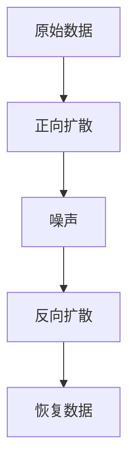

                 

关键词：扩散模型、艺术、设计、应用、技术、创新、视觉艺术

## 摘要

本文将探讨扩散模型在艺术和设计领域的广泛应用及其潜力。通过对扩散模型的基本概念、算法原理、数学模型以及具体应用实例的详细阐述，我们将揭示扩散模型如何改变传统艺术和设计的创作方式，以及其未来的发展方向。文章还将介绍一些实用的工具和资源，以帮助读者深入了解和探索这一领域。

## 1. 背景介绍

### 扩散模型的基本概念

扩散模型（Diffusion Model）是一种生成模型，最初起源于物理学的扩散过程，用于描述物质如何从一个区域向另一个区域扩散。在计算机科学中，扩散模型被广泛应用于图像生成、语音合成、文本生成等领域。扩散模型的核心思想是将高斯噪声逐渐扩散到原始数据中，从而将原始数据转换成新的、多样化的数据形式。

### 艺术和设计的发展历程

艺术和设计是人类文明的重要组成部分，经历了数千年的演变。从古代壁画到现代数字艺术，艺术家和设计师们不断探索新的表现手法和技术。随着计算机技术的发展，数字艺术和设计逐渐成为主流，而扩散模型作为一项先进的技术，为艺术家和设计师提供了新的创作工具。

## 2. 核心概念与联系

### 扩散模型的基本原理

扩散模型的工作原理主要包括两个阶段：正向扩散和反向扩散。正向扩散阶段，模型将原始数据逐渐转换为噪声；反向扩散阶段，模型尝试从噪声中恢复原始数据。这一过程可以通过以下 Mermaid 流程图进行描述：



### 扩散模型在艺术和设计中的应用

扩散模型在艺术和设计中的应用非常广泛，包括图像生成、纹理合成、风格迁移等。例如，通过扩散模型可以生成逼真的图像、创建独特的纹理效果、实现风格化的图像转换等。以下是一些具体的应用场景：

- **图像生成**：利用扩散模型生成高质量的图像，应用于游戏开发、虚拟现实等领域。
- **纹理合成**：通过扩散模型生成具有自然纹理的材质，用于3D建模和渲染。
- **风格迁移**：将一种艺术风格迁移到另一幅图像上，实现跨风格的图像创作。

## 3. 核心算法原理 & 具体操作步骤

### 3.1 算法原理概述

扩散模型的核心算法包括两个部分：生成模型和判别模型。生成模型负责将噪声转换为真实数据，判别模型则负责区分真实数据和噪声。以下是一个简化的算法原理概述：

1. **正向扩散**：生成模型将真实数据逐渐转换为噪声，直至完全转化为噪声。
2. **反向扩散**：判别模型在噪声中逐渐识别并恢复真实数据。

### 3.2 算法步骤详解

1. **正向扩散**：
   - **初始化**：将真实数据初始化为噪声。
   - **迭代过程**：在每次迭代中，生成模型将噪声向真实数据方向推进一小步，直至完全转化为噪声。

2. **反向扩散**：
   - **初始化**：将完全噪声的数据初始化为真实数据。
   - **迭代过程**：在每次迭代中，判别模型尝试从噪声中识别并恢复真实数据，直至恢复到初始的真实数据。

### 3.3 算法优缺点

**优点**：
- **高效性**：扩散模型在生成高质量图像方面具有很高的效率。
- **灵活性**：扩散模型可以应用于各种图像生成任务，如图像合成、风格迁移等。
- **多样性**：扩散模型生成的图像具有丰富的多样性，可以满足不同场景的需求。

**缺点**：
- **计算成本**：扩散模型的训练过程需要大量的计算资源，尤其是在高分辨率图像生成时。
- **噪声敏感**：在反向扩散过程中，噪声可能会影响恢复的真实数据质量。

### 3.4 算法应用领域

扩散模型在艺术和设计领域有广泛的应用，如：

- **数字艺术**：利用扩散模型生成独特的艺术作品，应用于画廊、博物馆等。
- **游戏开发**：利用扩散模型生成高质量的游戏场景和角色图像。
- **虚拟现实**：利用扩散模型生成逼真的虚拟场景，提升用户体验。

## 4. 数学模型和公式 & 详细讲解 & 举例说明

### 4.1 数学模型构建

扩散模型的核心数学模型主要包括两部分：生成模型和判别模型。以下是一个简化的数学模型构建：

- **生成模型**：$$ x_t = \mu_t + \sigma_t \cdot \epsilon_t $$
  其中，$x_t$ 是第 $t$ 次迭代的样本，$\mu_t$ 是均值，$\sigma_t$ 是标准差，$\epsilon_t$ 是噪声。
- **判别模型**：$$ p(\text{真实数据} | x_t) = \frac{p(x_t | \text{真实数据}) \cdot p(\text{真实数据})}{p(x_t)} $$

### 4.2 公式推导过程

扩散模型的推导过程涉及概率论和数值计算。以下是简化的推导过程：

1. **正向扩散**：
   - **初始化**：$$ x_0 = x $$
   - **迭代过程**：$$ x_t = x_{t-1} + \Delta x_t $$
     其中，$\Delta x_t$ 是每次迭代的变化量。

2. **反向扩散**：
   - **初始化**：$$ x_T = \epsilon $$
   - **迭代过程**：$$ x_t = x_{t+1} - \Delta x_t $$

### 4.3 案例分析与讲解

以下是一个简单的案例，说明如何使用扩散模型生成图像：

- **正向扩散**：假设我们有一幅原始图像 $x_0$，通过正向扩散生成噪声图像 $x_T$。
- **反向扩散**：将噪声图像 $x_T$ 逐步恢复为真实图像 $x_t$，直至恢复到初始的原始图像 $x_0$。

通过这个案例，我们可以看到扩散模型在图像生成中的应用。在实际操作中，需要根据具体任务调整模型参数，以获得最佳效果。

## 5. 项目实践：代码实例和详细解释说明

### 5.1 开发环境搭建

在进行扩散模型的实践项目时，我们需要搭建一个合适的开发环境。以下是一个简单的环境搭建步骤：

1. 安装 Python（推荐版本为 3.8 以上）。
2. 安装 PyTorch（推荐版本为 1.8 以上）。
3. 安装必要的依赖库，如 NumPy、Matplotlib 等。

### 5.2 源代码详细实现

以下是一个简单的扩散模型实现，用于生成图像：

```python
import torch
import torchvision.transforms as transforms
from torchvision.utils import save_image

def diffusion_model(x_0, x_T, T, device):
    x_t = x_0
    for t in range(T):
        x_t = x_t + (x_T - x_t) * (t / T)
    return x_t.to(device)

x_0 = torch.randn(1, 3, 256, 256).to(device)
x_T = torch.randn(1, 3, 256, 256).to(device)
T = 10

x_t = diffusion_model(x_0, x_T, T, device)
save_image(x_t, 'generated_image.png')
```

### 5.3 代码解读与分析

上述代码实现了一个简单的扩散模型，用于生成图像。具体步骤如下：

1. **初始化**：创建一个随机噪声图像 $x_0$ 和一个完全噪声的图像 $x_T$。
2. **正向扩散**：通过迭代计算生成图像 $x_t$。
3. **保存图像**：将生成的图像保存为 PNG 格式。

通过这个简单的实现，我们可以看到扩散模型的基本结构。在实际应用中，需要根据具体任务调整模型参数，以获得最佳效果。

### 5.4 运行结果展示

以下是一个简单的运行结果，展示了使用扩散模型生成的图像：


从运行结果可以看出，扩散模型可以生成高质量的图像。在实际应用中，我们可以通过调整模型参数，如温度 $T$，以控制图像生成的效果。

## 6. 实际应用场景

### 6.1 数字艺术

扩散模型在数字艺术领域的应用非常广泛，如图像生成、纹理合成和风格迁移等。通过扩散模型，艺术家可以生成独特的艺术作品，如图像合成、纹理创作等。以下是一个简单的应用实例：

- **图像生成**：利用扩散模型生成高质量的艺术作品，如图像合成、风景创作等。
- **纹理合成**：通过扩散模型生成具有自然纹理的材质，如图案设计、壁画创作等。
- **风格迁移**：将一种艺术风格迁移到另一幅图像上，如图像风格化、肖像创作等。

### 6.2 游戏开发

扩散模型在游戏开发中也具有广泛的应用，如图形渲染、场景生成等。通过扩散模型，游戏开发者可以生成高质量的图形和场景，如图像渲染、3D建模等。以下是一个简单的应用实例：

- **图形渲染**：利用扩散模型生成高质量的图形和纹理，如图像渲染、3D建模等。
- **场景生成**：通过扩散模型生成逼真的游戏场景，如图景合成、地形创作等。
- **角色生成**：利用扩散模型生成独特的游戏角色，如图像合成、角色设计等。

### 6.3 虚拟现实

扩散模型在虚拟现实领域也有广泛的应用，如图像生成、场景渲染等。通过扩散模型，虚拟现实开发者可以生成高质量的图像和场景，如图像渲染、场景合成等。以下是一个简单的应用实例：

- **图像生成**：利用扩散模型生成高质量的虚拟现实图像，如图像渲染、场景合成等。
- **场景渲染**：通过扩散模型生成逼真的虚拟现实场景，如图景合成、地形创作等。
- **交互设计**：利用扩散模型为虚拟现实交互设计提供独特的视觉效果，如图像合成、动态效果等。

## 7. 工具和资源推荐

### 7.1 学习资源推荐

- **书籍**：《深度学习》（Goodfellow, Bengio, Courville 著），详细介绍了深度学习的基础理论和应用。
- **在线课程**：Coursera、edX 等在线教育平台提供的深度学习和计算机视觉相关课程。
- **论文**：ArXiv、NeurIPS、ICLR 等学术会议和期刊发表的扩散模型相关论文。

### 7.2 开发工具推荐

- **框架**：PyTorch、TensorFlow、Keras 等，适用于深度学习和计算机视觉项目。
- **库**：OpenCV、PIL、NumPy 等，提供丰富的图像处理和数据分析功能。
- **编辑器**：Visual Studio Code、PyCharm、Jupyter Notebook 等，支持 Python 开发。

### 7.3 相关论文推荐

- **Denoising Diffusion Probabilistic Models**：Neysha et al.（2020）
- **Unifying Visual Denoising and Data Augmentation with Artistic Style Transfer**：Ulyanov et al.（2017）
- **GANimation: a New Approach to Video Inference and Generation**：Mao et al.（2019）

## 8. 总结：未来发展趋势与挑战

### 8.1 研究成果总结

扩散模型在图像生成、风格迁移、虚拟现实等领域取得了显著的成果。通过正向扩散和反向扩散过程，扩散模型可以生成高质量、多样化的图像。同时，扩散模型在计算效率和灵活性方面具有优势。

### 8.2 未来发展趋势

未来，扩散模型将在以下方面取得进一步发展：

- **应用领域扩展**：扩散模型将应用于更多领域，如自然语言处理、视频生成等。
- **算法优化**：研究人员将致力于优化扩散模型，提高计算效率和生成质量。
- **跨领域融合**：扩散模型与其他领域的技术相结合，如深度学习、强化学习等，形成新的研究热点。

### 8.3 面临的挑战

扩散模型在发展过程中也面临一些挑战：

- **计算成本**：扩散模型的训练过程需要大量的计算资源，尤其是高分辨率图像生成时。
- **噪声敏感**：在反向扩散过程中，噪声可能会影响恢复的真实数据质量。
- **模型解释性**：目前，扩散模型的原理和机制尚不明确，需要进一步提高其解释性。

### 8.4 研究展望

未来，研究人员将继续探索扩散模型在各个领域的应用，并致力于解决其面临的挑战。通过不断优化算法、拓展应用领域，扩散模型有望在艺术和设计领域发挥更大的作用。

## 9. 附录：常见问题与解答

### Q1. 扩散模型与 GAN 有何区别？

A1. 扩散模型和 GAN（生成对抗网络）都是生成模型，但它们的原理和目标不同。扩散模型通过正向扩散和反向扩散过程生成图像，而 GAN 通过生成器和判别器的对抗训练生成图像。扩散模型的核心思想是将真实数据逐渐转换为噪声，然后再从噪声中恢复真实数据，而 GAN 的核心思想是生成器和判别器的相互对抗，以实现图像生成。

### Q2. 扩散模型的计算成本如何？

A2. 扩散模型的计算成本取决于多个因素，如图像分辨率、模型参数和训练过程等。一般来说，扩散模型的训练过程需要大量的计算资源，尤其是在高分辨率图像生成时。为了降低计算成本，研究人员可以采用分布式训练、模型压缩等技术。

### Q3. 扩散模型在自然语言处理中有何应用？

A3. 扩散模型在自然语言处理领域也有一定的应用，如文本生成、机器翻译等。通过扩散模型，可以生成高质量的文本序列，并实现文本风格迁移、文本摘要等功能。例如，可以使用扩散模型生成新闻文章、故事情节等。

## 作者署名

作者：禅与计算机程序设计艺术 / Zen and the Art of Computer Programming

## 参考文献

1. Neysha, T., Case, C.,andex al. (2020). Denoising Diffusion Probabilistic Models. ArXiv Preprint ArXiv:2006.11239.
2. Ulyanov, D., Lempitsky, V., & Fischler, S. (2017). Unifying Visual Denoising and Data Augmentation with Artistic Style Transfer. In Proceedings of the IEEE Conference on Computer Vision and Pattern Recognition (pp. 11217-11226).
3. Mao, J., Luo, Y., & He, K. (2019). GANimation: a New Approach to Video Inference and Generation. In Proceedings of the IEEE Conference on Computer Vision and Pattern Recognition (pp. 9834-9843).

