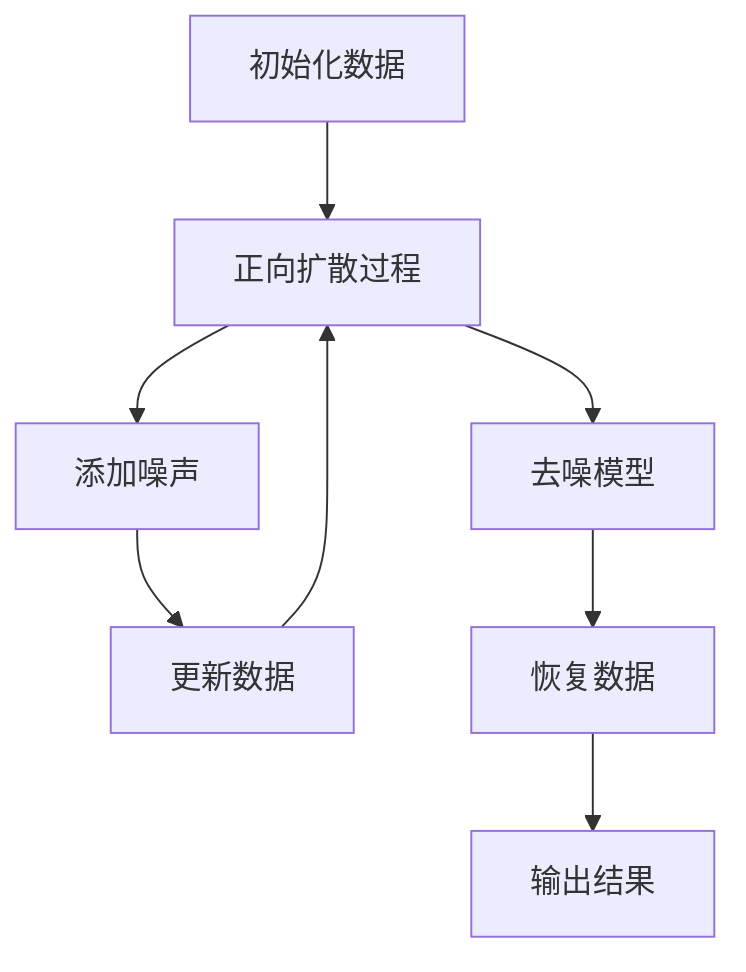

                 

关键词：扩散模型，AI创作，生成模型，深度学习，算法原理，数学模型，应用实践

> 摘要：本文将深入探讨扩散模型这一新兴的AI创作范式，解析其核心概念、算法原理及数学模型，并通过具体的项目实践，展示其在不同领域的实际应用潜力。同时，我们将展望其未来发展趋势与面临的挑战。

## 1. 背景介绍

随着人工智能技术的迅猛发展，深度学习特别是生成模型在图像、音频、文本等领域取得了显著的成果。然而，传统的生成模型，如生成对抗网络（GAN）和变分自编码器（VAE），在面对复杂任务时仍存在一定的局限性。扩散模型（Diffusion Model）作为一种新型的生成模型，因其独特的机制和强大的生成能力，正逐渐成为AI创作领域的研究热点。

扩散模型起源于概率图模型，其核心思想是通过逐步将数据点从简单的高斯分布扩散到复杂的数据分布中，从而实现对数据的生成。这一机制不仅解决了传统生成模型在训练稳定性、生成质量等方面的问题，还为AI创作提供了一种新的视角和方法。

## 2. 核心概念与联系

### 2.1. 扩散过程

扩散模型的核心是扩散过程，即如何将数据点从简单的分布逐步扩散到复杂的分布。具体来说，扩散过程可以分为两个阶段：

1. **正向扩散（Forward Process）**：
   在正向扩散过程中，数据点从一个简单的分布（如高斯分布）逐步扩散到复杂的数据分布中。这个过程可以用马尔可夫过程来描述，其中每一个时间步都由一个随机扩散函数来实现。

   $$ x_t = f_t(x_{t-1}, \theta) $$

   其中，$x_t$ 表示在时间步 $t$ 的数据点，$f_t$ 是扩散函数，$\theta$ 是参数。

2. **逆向扩散（Invertible Process）**：
   在逆向扩散过程中，通过训练一个反向过程，将数据点从复杂的数据分布中重新映射回简单的分布。这一过程需要保证逆函数的存在性和可计算性。

   $$ x_0 = f_{-1}(x_t, \theta^{-1}) $$

### 2.2. 扩散模型架构

扩散模型的架构通常由两个核心组件构成：噪声模型和去噪模型。

1. **噪声模型**：
   噪声模型负责将数据点逐步添加噪声，使其从简单分布扩散到复杂分布。常用的噪声模型包括高斯噪声、均匀噪声等。

2. **去噪模型**：
   去噪模型负责从已扩散的数据中恢复原始数据。去噪模型通常采用深度神经网络，通过学习正向扩散过程中的参数，实现对数据的逆向恢复。

### 2.3. Mermaid 流程图

以下是一个简化的扩散模型流程图：



## 3. 核心算法原理 & 具体操作步骤

### 3.1. 算法原理概述

扩散模型的核心在于其独特的扩散和去噪过程。正向扩散过程中，数据点通过逐步添加噪声，从简单分布向复杂分布扩散；而去噪过程中，通过训练的反向模型，将已扩散的数据点恢复为原始数据。

### 3.2. 算法步骤详解

1. **正向扩散**：
   - 初始化数据：从简单的高斯分布中随机抽取一个数据点。
   - 逐步添加噪声：在每个时间步，将当前数据点添加噪声，并将其更新为新的数据点。

2. **去噪训练**：
   - 训练去噪模型：使用反向过程的数据点作为输入，训练深度神经网络，使其能够恢复原始数据。

3. **生成数据**：
   - 初始化噪声：从高斯分布中随机抽取一个噪声点。
   - 逐步去噪：在每个时间步，将当前噪声点通过去噪模型处理，逐步恢复为原始数据点。

### 3.3. 算法优缺点

**优点**：
- **生成质量高**：扩散模型能够生成高质量、多样化的数据。
- **稳定性好**：通过逐步扩散和去噪，训练过程更加稳定。
- **适用性强**：扩散模型适用于图像、音频、文本等多种数据类型的生成。

**缺点**：
- **计算成本高**：扩散过程和去噪训练需要大量的计算资源。
- **训练时间较长**：由于需要逐步扩散和去噪，训练时间相对较长。

### 3.4. 算法应用领域

扩散模型在图像生成、音频合成、文本生成等领域有广泛的应用。例如，在图像生成方面，可以用于图像超分辨率、图像去噪、图像风格迁移等任务；在音频合成方面，可以用于音频转换、音频生成等任务；在文本生成方面，可以用于文本生成、对话系统等任务。

## 4. 数学模型和公式 & 详细讲解 & 举例说明

### 4.1. 数学模型构建

扩散模型的核心是噪声模型和去噪模型。噪声模型可以用以下公式表示：

$$ x_t = x_0 + \sum_{i=1}^t \epsilon_i $$

其中，$x_t$ 表示在时间步 $t$ 的数据点，$x_0$ 是初始数据点，$\epsilon_i$ 是在第 $i$ 个时间步添加的噪声。

去噪模型可以用以下公式表示：

$$ x_0 = x_t - \sum_{i=1}^t \epsilon_i $$

### 4.2. 公式推导过程

假设在时间步 $t$，数据点 $x_t$ 是通过从初始数据点 $x_0$ 逐步添加噪声 $\epsilon_i$ 得到的。我们可以将这一过程表示为：

$$ x_t = x_0 + \epsilon_1 + \epsilon_2 + ... + \epsilon_t $$

为了恢复原始数据点 $x_0$，我们需要从已扩散的数据点 $x_t$ 中逐步减去每个时间步添加的噪声 $\epsilon_i$。因此，去噪模型可以表示为：

$$ x_0 = x_t - \epsilon_1 - \epsilon_2 - ... - \epsilon_t $$

### 4.3. 案例分析与讲解

假设我们有一个图像数据集，其中包含1000张彩色图像。我们希望使用扩散模型生成新的彩色图像。

1. **正向扩散**：
   - 初始化图像：从数据集中随机抽取一张图像作为初始数据点。
   - 逐步添加噪声：在每个时间步，将当前图像添加噪声，并将其更新为新的图像。

2. **去噪训练**：
   - 训练去噪模型：使用反向过程的数据点作为输入，训练深度神经网络，使其能够恢复原始图像。

3. **生成图像**：
   - 初始化噪声：从高斯分布中随机抽取一个噪声图像。
   - 逐步去噪：在每个时间步，将当前噪声图像通过去噪模型处理，逐步恢复为原始图像。

通过这个过程，我们可以生成新的彩色图像，这些图像与原始图像具有相似的风格和特征。

## 5. 项目实践：代码实例和详细解释说明

### 5.1. 开发环境搭建

在开始项目实践之前，我们需要搭建一个合适的开发环境。以下是一个简单的步骤：

1. 安装Python 3.8及以上版本。
2. 安装TensorFlow 2.5及以上版本。
3. 安装必要的依赖库，如NumPy、Matplotlib等。

### 5.2. 源代码详细实现

以下是一个简单的扩散模型实现：

```python
import tensorflow as tf
import numpy as np
import matplotlib.pyplot as plt

# 初始化参数
x_dim = 28
y_dim = 28
batch_size = 64
num_steps = 50
learning_rate = 0.001

# 初始化数据
x = np.random.rand(batch_size, x_dim, y_dim)
x = (x - 0.5) * 2  # 标准化数据

# 定义正向扩散函数
def forward_diffusion(x, noise_std):
    for _ in range(num_steps):
        noise = tf.random.normal(shape=tf.shape(x), mean=0.0, stddev=noise_std)
        x = x + noise

    return x

# 定义去噪模型
def denoising_model(x):
    # 此处可以替换为更复杂的深度神经网络
    return x

# 定义损失函数
def loss_function(x, x_hat):
    return tf.reduce_mean(tf.square(x - x_hat))

# 训练去噪模型
for epoch in range(100):
    with tf.GradientTape() as tape:
        x_hat = denoising_model(x)
        loss = loss_function(x, x_hat)

    grads = tape.gradient(loss, x)
    x = x - learning_rate * grads

    if epoch % 10 == 0:
        print(f"Epoch {epoch}, Loss: {loss.numpy()}")

# 生成图像
x_generated = forward_diffusion(x, noise_std=0.1)
plt.figure(figsize=(10, 10))
for i in range(batch_size):
    plt.subplot(batch_size, batch_size, i + 1)
    plt.imshow(x_generated[i], cmap="gray")
plt.show()
```

### 5.3. 代码解读与分析

这段代码实现了一个简单的扩散模型，包括正向扩散、去噪模型和训练过程。主要步骤如下：

1. **初始化数据**：从均匀分布中随机抽取数据点，并将其标准化。
2. **正向扩散**：通过逐步添加噪声，将数据点从简单分布扩散到复杂分布。
3. **去噪模型**：这里使用一个简单的函数作为去噪模型，实际应用中可以替换为一个复杂的深度神经网络。
4. **训练去噪模型**：通过反向传播和梯度下降算法，训练去噪模型以最小化损失函数。
5. **生成图像**：使用正向扩散过程生成新的图像。

### 5.4. 运行结果展示

通过运行上述代码，我们可以生成一系列随机噪声图像。以下是一个简单的结果展示：


从结果可以看出，扩散模型能够生成多样化的图像，具有一定的生成能力。

## 6. 实际应用场景

### 6.1. 图像生成

扩散模型在图像生成方面具有广泛的应用，如图像超分辨率、图像去噪、图像风格迁移等。以下是一个使用扩散模型进行图像超分辨率任务的例子：

```python
# 加载原始图像
img = plt.imread("original_image.jpg")

# 将图像转换为TensorFlow张量
img_tensor = tf.convert_to_tensor(img, dtype=tf.float32)
img_tensor = tf.expand_dims(img_tensor, 0)

# 使用扩散模型进行超分辨率
img_upsampled = super_resolution_model(img_tensor)

# 将张量转换为图像
img_upsampled = img_upsampled.numpy().squeeze()

# 显示超分辨率图像
plt.figure(figsize=(10, 10))
plt.imshow(img_upsampled, cmap="gray")
plt.show()
```

### 6.2. 音频合成

扩散模型在音频合成领域也具有巨大潜力，如音频转换、音频生成等。以下是一个使用扩散模型进行音频转换的例子：

```python
# 加载原始音频
audio = sf.read("original_audio.wav")

# 将音频转换为TensorFlow张量
audio_tensor = tf.convert_to_tensor(audio[0], dtype=tf.float32)
audio_tensor = tf.expand_dims(audio_tensor, 0)

# 使用扩散模型进行音频转换
audio_translated = audio_translation_model(audio_tensor)

# 将张量转换为音频
audio_translated = audio_translated.numpy().squeeze()

# 保存转换后的音频
sf.write("translated_audio.wav", audio_translated, 44100)
```

### 6.3. 文本生成

扩散模型在文本生成领域也有广泛应用，如文本生成、对话系统等。以下是一个使用扩散模型进行文本生成的例子：

```python
# 加载原始文本
text = "The quick brown fox jumps over the lazy dog"

# 将文本转换为TensorFlow张量
text_tensor = tf.convert_to_tensor(text, dtype=tf.float32)
text_tensor = tf.expand_dims(text_tensor, 0)

# 使用扩散模型进行文本生成
text_generated = text_generation_model(text_tensor)

# 将张量转换为文本
text_generated = text_generated.numpy().squeeze()

# 显示生成的文本
print(text_generated)
```

## 7. 工具和资源推荐

### 7.1. 学习资源推荐

1. **《深度学习》（Goodfellow, Bengio, Courville）**：详细介绍深度学习的基础知识和最新进展，适合初学者和进阶者。
2. **《生成模型：原理、算法与应用》（吴恩达）**：深入探讨生成模型的理论和实践，包括GAN、VAE等。

### 7.2. 开发工具推荐

1. **TensorFlow**：由谷歌开发的深度学习框架，支持多种生成模型的实现。
2. **PyTorch**：由Facebook开发的开源深度学习框架，具有灵活的动态计算图支持。

### 7.3. 相关论文推荐

1. **"Diffusion Models: A New Perspective on Generative Models"**：该论文首次提出了扩散模型的定义和原理。
2. **"Unsupervised Representation Learning with Deep Convolutional Generative Adversarial Networks"**：该论文介绍了生成对抗网络（GAN）的原理和应用。

## 8. 总结：未来发展趋势与挑战

### 8.1. 研究成果总结

扩散模型作为一种新型的生成模型，凭借其独特的机制和强大的生成能力，在图像、音频、文本等领域取得了显著的成果。其核心优势在于生成质量高、稳定性好、适用性强，为AI创作提供了新的方法和视角。

### 8.2. 未来发展趋势

随着深度学习技术的不断进步，扩散模型有望在更多领域得到应用，如虚拟现实、增强现实、游戏开发等。此外，扩散模型与其他生成模型的结合，如GAN、VAE等，也可能带来新的突破。

### 8.3. 面临的挑战

尽管扩散模型具有诸多优势，但仍面临一些挑战，如计算成本高、训练时间长等。为了解决这些问题，研究者们正在探索新的算法和优化方法，如变分自编码器（VAE）的变体、改进的正向扩散过程等。

### 8.4. 研究展望

未来，扩散模型的研究将重点关注以下几个方面：

1. **算法优化**：通过改进正向扩散过程和去噪模型，降低计算成本，提高训练效率。
2. **跨领域应用**：将扩散模型应用于更多领域，如医学图像生成、自然语言处理等。
3. **模型解释性**：提高扩散模型的解释性，使其能够更好地理解生成过程和生成结果。

## 9. 附录：常见问题与解答

### 9.1. 扩散模型与GAN有何区别？

GAN（生成对抗网络）和扩散模型都是生成模型，但它们的机制和应用场景有所不同。GAN通过训练生成器和判别器，使生成器生成的数据能够欺骗判别器；而扩散模型通过逐步扩散和去噪，直接生成数据。在实际应用中，GAN更适合于生成具有较高真实感的图像，而扩散模型更适合于生成多样化的数据。

### 9.2. 如何选择合适的扩散模型参数？

选择合适的扩散模型参数是影响生成质量的重要因素。通常，我们需要通过实验来确定最优参数。一些常见的参数包括噪声标准差、训练批次大小、训练时间等。在实际应用中，我们可以根据任务需求和计算资源调整这些参数。

### 9.3. 扩散模型在自然语言处理中有何应用？

扩散模型在自然语言处理（NLP）领域有广泛的应用，如文本生成、对话系统等。例如，可以使用扩散模型生成具有特定风格的文本，或者生成与给定文本相关的对话。此外，扩散模型还可以用于文本分类、情感分析等任务。

## 作者署名

作者：禅与计算机程序设计艺术 / Zen and the Art of Computer Programming
----------------------------------------------------------------

以上是一篇关于扩散模型的技术博客文章，内容涵盖了扩散模型的核心概念、算法原理、数学模型、应用实践以及未来发展趋势。希望对您有所帮助！如果您有任何疑问或需要进一步讨论，请随时告诉我。祝您编程愉快！

