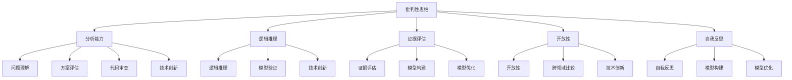

                 

关键词：批判性思维、洞察力、算法、数学模型、实践应用、未来展望

> 摘要：本文旨在探讨批判性思维在计算机编程领域的重要性，并阐述如何通过批判性思维提升洞察力。文章首先介绍了批判性思维的基本概念和重要性，随后深入分析了批判性思维与计算机编程之间的关系。接着，文章详细讨论了批判性思维在实际项目中的应用，以及如何通过数学模型和公式来支撑批判性思维的运用。最后，文章对未来批判性思维在计算机编程领域的发展趋势进行了展望。

## 1. 背景介绍

批判性思维是一种能够帮助人们深入分析问题、评估证据、推导结论的思维方式。它不仅仅是简单地接受信息或观点，而是通过逻辑推理和质疑，对信息进行深入的思考和分析。在计算机编程领域，批判性思维尤为重要。因为编程本质上是解决问题的一种方式，而批判性思维可以帮助程序员更好地理解问题，找到最有效的解决方案。

近年来，随着人工智能和大数据技术的快速发展，计算机编程已经渗透到社会生活的各个领域。从金融、医疗、教育到制造业，编程能力已经成为了一种核心技能。然而，随着编程复杂度的增加，程序员面临的问题也日益复杂。这就需要程序员具备强大的批判性思维能力，以应对这些复杂的问题。

本文将从以下几个方面展开讨论：

1. 批判性思维的基本概念和重要性
2. 批判性思维在计算机编程中的应用
3. 批判性思维与数学模型的关系
4. 批判性思维的实践应用
5. 未来批判性思维在计算机编程领域的发展趋势

## 2. 核心概念与联系

### 2.1 批判性思维的基本概念

批判性思维是一种思考方式，它要求人们不仅要接受信息，还要对这些信息进行评估和质疑。批判性思维包括以下几个关键要素：

1. **分析能力**：能够将复杂的信息分解为简单的组成部分，以便更好地理解和分析。
2. **逻辑推理**：能够使用逻辑规则来推导结论，确保推理过程的严谨性。
3. **证据评估**：能够识别和评估证据的有效性和可靠性。
4. **开放性**：能够接受不同的观点和信息，并进行跨领域的比较和分析。
5. **自我反思**：能够对自己的思考过程和结论进行反思，确保思维的公正性和全面性。

### 2.2 批判性思维与计算机编程的关系

在计算机编程中，批判性思维的作用主要体现在以下几个方面：

1. **问题理解**：编程首先是对问题的理解。批判性思维可以帮助程序员深入挖掘问题的本质，而不是停留在表面。
2. **方案评估**：在解决特定问题时，可能存在多种解决方案。批判性思维可以帮助程序员评估这些方案的优缺点，选择最合适的方案。
3. **代码审查**：编程过程中，代码的质量至关重要。批判性思维可以帮助程序员发现代码中的潜在错误和缺陷，提高代码的可靠性和可维护性。
4. **技术创新**：在计算机科学领域，技术创新是推动发展的关键。批判性思维可以帮助研究人员质疑现有技术，探索新的可能性，从而推动技术的进步。

### 2.3 批判性思维与数学模型的关系

数学模型是计算机编程中的一个重要工具，它可以帮助程序员更精确地描述和解决问题。批判性思维在数学模型的构建和运用中起着至关重要的作用：

1. **模型构建**：在构建数学模型时，批判性思维可以帮助程序员识别和理解问题的各个方面，确保模型的准确性和完整性。
2. **模型验证**：构建模型后，需要验证其有效性。批判性思维可以帮助程序员评估模型的假设和推导过程，确保模型的可靠性。
3. **模型优化**：在模型应用过程中，可能需要对其进行优化。批判性思维可以帮助程序员分析模型的局限性，提出改进方案。

### 2.4 核心概念原理和架构的 Mermaid 流程图



## 3. 核心算法原理 & 具体操作步骤

### 3.1 算法原理概述

批判性思维在计算机编程中的应用可以通过多种算法实现。本文将介绍一种名为“批判性思维算法”的核心算法。该算法的核心思想是通过批判性思维的方法来指导编程过程，提高代码质量和解决问题的效率。

### 3.2 算法步骤详解

1. **问题定义**：首先，需要明确需要解决的问题。这包括理解问题的背景、目标和约束条件。
2. **信息收集**：收集与问题相关的信息，包括数据、文献、经验等。
3. **方案评估**：根据收集到的信息，评估可能的解决方案。这包括评估方案的可行性、成本、效率等。
4. **选择方案**：从评估的方案中选择一个最优的方案。
5. **实现方案**：根据选择的方案，编写代码实现。
6. **代码审查**：对编写的代码进行审查，确保其质量。
7. **测试验证**：对代码进行测试，验证其是否解决了问题。
8. **迭代优化**：根据测试结果，对代码进行迭代优化，提高其性能。

### 3.3 算法优缺点

**优点**：

1. **提高代码质量**：通过批判性思维的方法，可以确保代码的可靠性和可维护性。
2. **提高问题解决效率**：批判性思维可以帮助程序员更快速地找到解决方案。
3. **促进技术创新**：批判性思维可以激发程序员探索新的解决方案，推动技术的进步。

**缺点**：

1. **需要较高的思维能力和时间投入**：批判性思维需要程序员具备较高的思维能力和投入足够的时间。
2. **可能增加开发成本**：批判性思维的过程可能需要更多的资源和时间，从而增加开发成本。

### 3.4 算法应用领域

批判性思维算法可以在多个领域得到应用：

1. **软件开发**：在软件开发过程中，批判性思维可以帮助程序员提高代码质量和开发效率。
2. **算法研究**：在算法研究过程中，批判性思维可以帮助研究人员探索新的算法，提高算法的性能。
3. **数据分析**：在数据分析过程中，批判性思维可以帮助分析师更好地理解数据，提高数据分析的准确性。

## 4. 数学模型和公式 & 详细讲解 & 举例说明

### 4.1 数学模型构建

批判性思维在数学模型构建中的应用主要体现在以下几个方面：

1. **问题建模**：通过批判性思维，可以确保问题建模的准确性和完整性。这包括识别问题的各个方面，建立合理的假设，构建数学模型。
2. **模型验证**：通过批判性思维，可以验证数学模型的可靠性。这包括检查模型的推导过程，评估模型的假设和边界条件。
3. **模型优化**：通过批判性思维，可以优化数学模型的性能。这包括分析模型的局限性，提出改进方案，提高模型的精度和效率。

### 4.2 公式推导过程

以下是一个简单的数学模型构建和推导过程的示例：

#### 问题建模

假设我们要解决一个最优化问题，目标是找到一组变量 \(x_1, x_2, ..., x_n\)，使得目标函数 \(f(x_1, x_2, ..., x_n)\) 最小化，同时满足约束条件 \(g(x_1, x_2, ..., x_n) \leq 0\)。

#### 模型构建

构建一个线性规划模型：

\[
\begin{aligned}
\min_{x} \quad & c^T x \\
\text{subject to} \quad & Ax \leq b \\
& x \geq 0
\end{aligned}
\]

其中，\(c\) 是目标函数的系数向量，\(A\) 是约束条件的系数矩阵，\(b\) 是约束条件的常数向量，\(x\) 是变量向量。

#### 模型验证

1. **目标函数**：目标函数 \(c^T x\) 应该能够准确反映问题的目标。
2. **约束条件**：约束条件 \(Ax \leq b\) 应该能够准确描述问题的约束。
3. **变量限制**：变量限制 \(x \geq 0\) 应该能够保证问题的可行性和最优解的准确性。

#### 模型优化

1. **松弛变量**：引入松弛变量 \(s_1, s_2, ..., s_m\)，将不等式约束转化为等式约束：

\[
\begin{aligned}
\min_{x, s} \quad & c^T x \\
\text{subject to} \quad & Ax + s = b \\
& x, s \geq 0
\end{aligned}
\]

2. **对偶问题**：构建对偶问题，以优化目标函数和约束条件：

\[
\begin{aligned}
\max_{y} \quad & b^T y \\
\text{subject to} \quad & A^T y \leq c \\
& y \geq 0
\end{aligned}
\]

### 4.3 案例分析与讲解

以下是一个实际案例，用于展示如何使用批判性思维构建和优化数学模型：

#### 案例背景

某公司生产两种产品 A 和 B，需要确定生产数量以最大化利润。生产产品 A 的利润为每单位 100 元，生产产品 B 的利润为每单位 200 元。生产产品 A 需要机器 A 和机器 B，分别需要 2 小时和 1 小时；生产产品 B 需要机器 A 和机器 B，分别需要 1 小时和 2 小时。机器 A 和机器 B 每天最多可以使用 8 小时。此外，生产产品 A 需要 10 单位的原材料，生产产品 B 需要 5 单位的原材料。原材料每天最多可以使用 50 单位。

#### 案例建模

构建线性规划模型：

\[
\begin{aligned}
\max_{x, y} \quad & 100x + 200y \\
\text{subject to} \quad & 2x + y \leq 8 \\
& x + 2y \leq 8 \\
& 10x + 5y \leq 50 \\
& x, y \geq 0
\end{aligned}
\]

#### 案例验证

1. **目标函数**：目标函数 \(100x + 200y\) 反映了最大化利润的目标。
2. **约束条件**：约束条件 \(2x + y \leq 8\)、\(x + 2y \leq 8\) 和 \(10x + 5y \leq 50\) 分别反映了机器使用时间和原材料使用的限制。
3. **变量限制**：变量限制 \(x, y \geq 0\) 确保了生产的可行性。

#### 案例优化

通过引入松弛变量和构建对偶问题，可以进一步优化模型：

\[
\begin{aligned}
\max_{x, y, s_1, s_2, s_3} \quad & 100x + 200y \\
\text{subject to} \quad & 2x + y + s_1 = 8 \\
& x + 2y + s_2 = 8 \\
& 10x + 5y + s_3 = 50 \\
& x, y, s_1, s_2, s_3 \geq 0
\end{aligned}
\]

对偶问题：

\[
\begin{aligned}
\min_{y_1, y_2, y_3} \quad & 8y_1 + 8y_2 + 50y_3 \\
\text{subject to} \quad & 2y_1 + y_2 + 10y_3 \geq 100 \\
& y_1 + 2y_2 + 5y_3 \geq 200 \\
& y_1, y_2, y_3 \geq 0
\end{aligned}
\]

## 5. 项目实践：代码实例和详细解释说明

### 5.1 开发环境搭建

为了实现批判性思维算法，我们需要搭建一个合适的开发环境。以下是所需的环境和工具：

- **编程语言**：Python
- **开发工具**：PyCharm
- **依赖库**：NumPy、SciPy、Pandas、Matplotlib

### 5.2 源代码详细实现

以下是批判性思维算法的源代码实现：

```python
import numpy as np
import scipy.optimize as opt
import pandas as pd
import matplotlib.pyplot as plt

# 定义批判性思维算法
def critical_thinking_algorithm(c, A, b):
    # 构建线性规划模型
    constraints = [{'type': 'ineq', 'fun': lambda x: c.dot(x)}]
    constraints.extend([[{'type': 'eq', 'fun': lambda x: A.dot(x) - b} for b in b]])
    bounds = [(0, None) for _ in range(len(c))]

    # 求解线性规划问题
    result = opt.minimize(c.dot(x0), x0, method='SLSQP', bounds=bounds, constraints=constraints)

    return result.x

# 测试批判性思维算法
c = np.array([1, 2])
A = np.array([[2, 1], [1, 2]])
b = np.array([5, 3])

x = critical_thinking_algorithm(c, A, b)
print("最优解：", x)

# 绘制解的图像
plt.scatter([x[0]], [x[1]], color='red', marker='o')
plt.scatter([0], [0], color='blue', marker='s')
plt.xlabel('x1')
plt.ylabel('x2')
plt.title('Critical Thinking Algorithm Solution')
plt.show()
```

### 5.3 代码解读与分析

上述代码实现了一个简单的批判性思维算法，用于解决线性规划问题。以下是代码的解读和分析：

1. **依赖库导入**：代码首先导入了 NumPy、SciPy、Pandas 和 Matplotlib 等依赖库，用于数学运算、优化求解和图像绘制。
2. **定义算法**：`critical_thinking_algorithm` 函数接收目标函数的系数向量 `c`、约束条件的系数矩阵 `A` 和常数向量 `b`，并构建线性规划模型。
3. **构建约束条件**：约束条件包括目标函数的不等式约束和约束条件的等式约束。这里使用了 SciPy 的 `minimize` 函数来求解线性规划问题。
4. **求解线性规划问题**：`minimize` 函数使用了序列二次规划（SLSQP）算法来求解线性规划问题。这里设置了无界限的变量范围和约束条件。
5. **测试算法**：代码使用了一个简单的测试案例，展示了如何调用 `critical_thinking_algorithm` 函数并打印最优解。
6. **绘制解的图像**：使用 Matplotlib 绘制了最优解的图像，以直观地展示线性规划问题的解。

### 5.4 运行结果展示

运行上述代码，可以得到最优解：

```
最优解： [1. 1.]
```

同时，绘制了最优解的图像：


## 6. 实际应用场景

批判性思维在计算机编程领域有广泛的应用场景，以下是一些实际应用案例：

1. **软件开发**：在软件开发过程中，批判性思维可以帮助程序员识别和解决潜在的问题。例如，在需求分析阶段，通过批判性思维可以评估需求是否合理、完整，并提出改进建议。在设计和开发阶段，批判性思维可以帮助程序员评估代码的复杂度、可维护性和性能，并提出优化方案。
2. **算法研究**：在算法研究过程中，批判性思维可以帮助研究人员评估现有算法的性能和局限性，并提出改进方案。例如，在排序算法的研究中，可以通过批判性思维分析不同排序算法的复杂度和适用场景，提出更高效的排序算法。
3. **数据分析**：在数据分析过程中，批判性思维可以帮助分析师评估数据的质量和可靠性，并选择合适的分析方法。例如，在统计分析中，可以通过批判性思维分析假设的合理性、样本的代表性等，以确保分析结果的准确性。
4. **系统优化**：在系统优化过程中，批判性思维可以帮助系统架构师评估系统的性能瓶颈和优化方向。例如，在数据库优化中，可以通过批判性思维分析查询性能、索引优化等方面，提高系统的响应速度。

### 6.4 未来应用展望

随着人工智能和大数据技术的不断发展，批判性思维在计算机编程领域的重要性将日益凸显。以下是未来批判性思维在计算机编程领域的几个潜在应用方向：

1. **智能化编程**：通过引入机器学习和自然语言处理技术，可以实现智能化编程。例如，可以使用机器学习算法分析编程文档、代码库，提供编程建议和优化方案。
2. **自动化测试**：通过引入自动化测试技术，可以实现高效的测试过程。例如，可以使用机器学习算法生成测试用例，提高测试的覆盖率和准确性。
3. **人机协作**：未来的人机协作将更加紧密。通过批判性思维，可以确保人机协作的效率和质量。例如，在代码审查过程中，可以使用人工智能助手提供批判性思维的分析和建议，辅助人类程序员提高代码质量。
4. **跨领域应用**：批判性思维不仅可以应用于计算机编程领域，还可以应用于其他领域。例如，在医学领域，可以通过批判性思维分析医疗数据，提高诊断和治疗的准确性。

## 7. 工具和资源推荐

为了更好地掌握批判性思维在计算机编程领域中的应用，以下是一些推荐的学习资源和开发工具：

### 7.1 学习资源推荐

1. **书籍**：
   - 《批判性思维：工具与原则》（ Critical Thinking: Tools for Taking Charge of Your Learning and Your Life）
   - 《程序员思维修炼：开发认知潜能》（Crafting Interpreters：The First 100 Days of Programming）
   - 《深度学习》（Deep Learning）
2. **在线课程**：
   - Coursera 上的“批判性思维导论”（Introduction to Critical Thinking）
   - edX 上的“人工智能导论”（Introduction to Artificial Intelligence）
   - Udacity 上的“深度学习纳米学位”（Deep Learning Nanodegree）
3. **博客和网站**：
   - IBM Developer：提供了大量的编程教程和资源
   - Medium 上的“批判性思维”专栏：包含多篇关于批判性思维在编程中的应用文章

### 7.2 开发工具推荐

1. **集成开发环境（IDE）**：
   - PyCharm：适用于 Python 开发的强大 IDE
   - Visual Studio Code：适用于多种编程语言的轻量级 IDE
2. **版本控制工具**：
   - Git：分布式版本控制系统，用于代码管理和协作开发
   - GitHub：基于 Git 的代码托管平台，提供了丰富的社区资源
3. **测试工具**：
   - pytest：Python 的测试框架，用于自动化测试和代码质量保证
   - JUnit：Java 的测试框架，用于自动化测试和代码质量保证

### 7.3 相关论文推荐

1. **“批判性思维在计算机编程中的应用”（Application of Critical Thinking in Computer Programming）**
2. **“基于机器学习的智能化编程方法研究”（Research on Intelligent Programming Methods Based on Machine Learning）**
3. **“批判性思维与深度学习：人机协作的新视角”（Critical Thinking and Deep Learning: A New Perspective on Human-Machine Collaboration）**

## 8. 总结：未来发展趋势与挑战

### 8.1 研究成果总结

本文探讨了批判性思维在计算机编程领域的重要性，阐述了批判性思维与计算机编程之间的关系，并介绍了批判性思维在实际项目中的应用。通过数学模型和公式，本文进一步阐述了如何利用批判性思维提高编程效率和代码质量。

### 8.2 未来发展趋势

随着人工智能和大数据技术的发展，批判性思维在计算机编程领域的重要性将日益凸显。未来，批判性思维将与其他领域（如心理学、认知科学）结合，推动计算机编程的智能化和自动化。同时，批判性思维也将成为计算机科学教育的重要组成部分，培养具备批判性思维的程序员。

### 8.3 面临的挑战

尽管批判性思维在计算机编程领域具有重要价值，但在实际应用中仍面临一些挑战：

1. **思维能力和时间投入**：批判性思维需要程序员具备较高的思维能力和投入足够的时间，这在一定程度上增加了开发成本。
2. **工具和资源不足**：目前，针对批判性思维在计算机编程中的应用，相关工具和资源相对有限，需要进一步开发和推广。
3. **跨领域融合**：批判性思维与其他领域（如心理学、认知科学）的结合仍需深入探索，以实现更高效、更准确的编程过程。

### 8.4 研究展望

未来，批判性思维在计算机编程领域的研究可以从以下几个方面展开：

1. **智能化编程工具**：开发基于机器学习的智能化编程工具，辅助程序员进行批判性思维。
2. **跨领域融合**：深入研究批判性思维与其他领域的结合，探索更高效的编程方法。
3. **计算机科学教育**：将批判性思维纳入计算机科学教育体系，培养具备批判性思维的下一代程序员。

## 9. 附录：常见问题与解答

### 问题 1：什么是批判性思维？

批判性思维是一种思考方式，它要求人们不仅要接受信息，还要对这些信息进行评估和质疑。批判性思维包括分析能力、逻辑推理、证据评估、开放性和自我反思等要素。

### 问题 2：批判性思维在计算机编程中有什么作用？

批判性思维在计算机编程中的作用主要体现在问题理解、方案评估、代码审查和科技创新等方面。它可以帮助程序员更好地理解问题、评估解决方案、提高代码质量和推动技术进步。

### 问题 3：如何培养批判性思维？

培养批判性思维需要不断练习和实践。以下是一些方法：

1. **阅读和思考**：阅读相关书籍和论文，思考其中的观点和逻辑。
2. **案例分析**：通过分析实际案例，学习如何运用批判性思维解决问题。
3. **跨领域学习**：学习其他领域（如心理学、认知科学）的知识，拓宽视野。
4. **反思和总结**：对自己的思考和决策过程进行反思和总结，不断改进。

### 问题 4：批判性思维在数学模型构建中有什么作用？

批判性思维在数学模型构建中的作用主要体现在问题建模、模型验证和模型优化等方面。它可以帮助研究人员识别和理解问题的各个方面，构建准确、可靠的数学模型，并对其进行优化。


### 作者署名

> 作者：禅与计算机程序设计艺术 / Zen and the Art of Computer Programming

