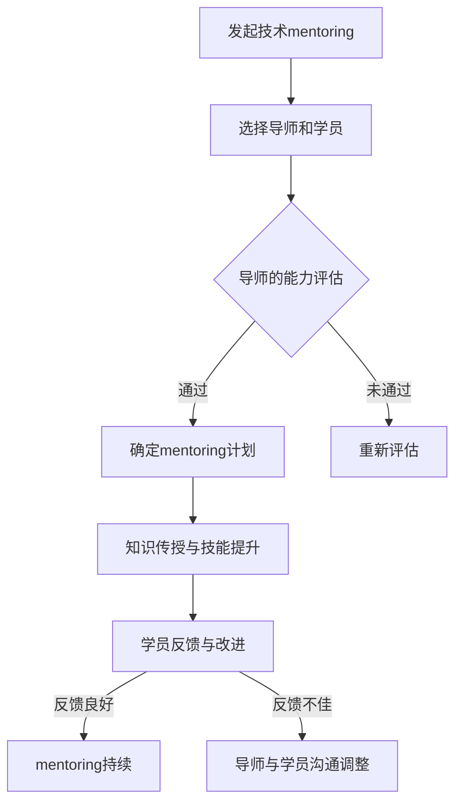
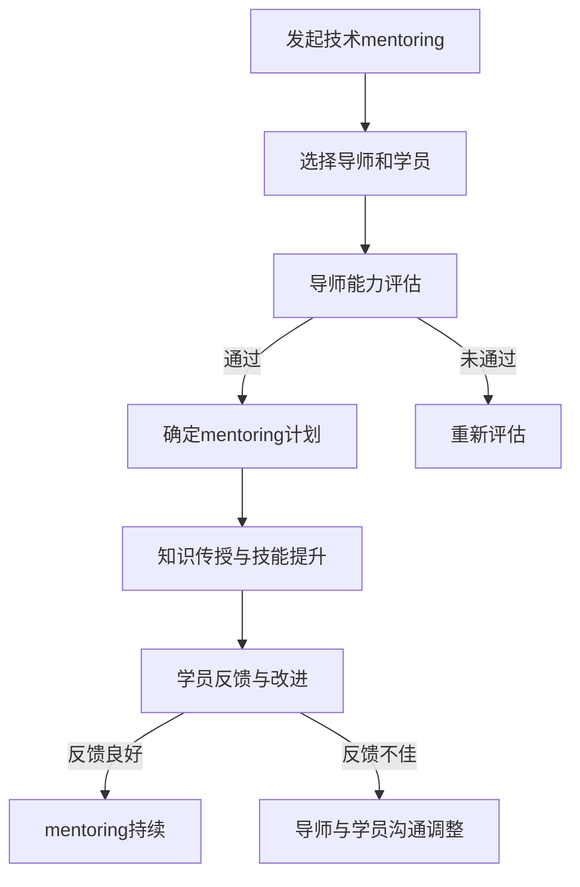

                 

在信息技术飞速发展的今天，技术mentoring（技术辅导）作为一种有效的知识传播与技能提升手段，正逐渐受到广泛关注。本文旨在探讨技术mentoring的重要性，以及其在提升个人影响力与收益方面的积极作用。通过详细的分析与实践案例，我们希望能够为技术从业者和企业领导者提供有益的参考。

## 关键词

- 技术mentoring
- 影响力
- 收益
- 技术技能
- 知识传播
- 企业发展

## 摘要

本文将围绕技术mentoring这一主题，首先介绍其背景和重要性。接着，我们将探讨技术mentoring的核心概念与架构，并通过算法原理和具体操作步骤的详细讲解，帮助读者深入理解其工作方式。随后，我们将分析技术mentoring的数学模型和公式，并通过实际项目实践案例进行说明。最后，文章将讨论技术mentoring在实际应用场景中的表现，并提出未来发展的展望。

## 1. 背景介绍

技术mentoring起源于传统的师徒制，但随着信息技术的发展，其内涵和形式也在不断演变。在现代社会，技术mentoring已不再局限于技术层面的指导，更涉及个人职业发展、团队协作等多个方面。随着知识经济的发展，技术技能的快速更新换代，技术mentoring成为企业提升竞争力、个人实现职业发展的关键因素。

技术mentoring的重要性体现在以下几个方面：

1. **知识传承**：技术mentoring是一种有效的知识传播方式，通过资深技术人员对新手的技术指导和经验分享，有助于知识在团队内部高效传递。

2. **技能提升**：技术mentoring不仅传授技术知识，更重要的是通过实际操作和指导，帮助技术人员提升解决实际问题的能力。

3. **团队协作**：技术mentoring有助于建立良好的团队协作氛围，促进团队成员之间的沟通和合作。

4. **个人职业发展**：通过技术mentoring，技术人员可以获得宝贵的指导和反馈，有助于他们在职业生涯中实现跨越式发展。

## 2. 核心概念与联系

### 核心概念

技术mentoring的核心概念包括：

- **mentor（导师）**：具备丰富经验的技术专家，负责对新手进行指导和培训。
- **mentee（学员）**：接受导师指导，正在学习或提升技术的技术人员。
- **知识传播**：通过导师与学员之间的互动，实现知识从导师到学员的转移。

### 联系与架构

技术mentoring的架构可以通过以下Mermaid流程图进行描述：



### 核心概念原理和架构的 Mermaid 流程图



## 3. 核心算法原理 & 具体操作步骤

### 3.1 算法原理概述

技术mentoring的核心算法原理可以概括为：

1. **导师选择**：基于导师的技术能力、经验以及学员的需求，进行匹配。
2. **知识传授**：导师通过一对一的指导、案例分享等方式，向学员传授技术知识和经验。
3. **反馈与改进**：学员在导师的指导下进行实践，导师根据学员的反馈进行指导，不断优化传授方式。

### 3.2 算法步骤详解

1. **导师选择**：首先，企业或组织需要根据学员的技术需求和职业发展目标，选择合适的导师。导师的选择标准可以包括：

   - 技术能力：具备相关领域的高级技术能力。
   - 经验丰富：拥有多年的行业经验，能够为学员提供宝贵的实践经验。
   - 教学能力：善于沟通和表达，能够有效传授知识。

2. **知识传授**：导师与学员建立联系后，开始进行知识传授。具体操作步骤如下：

   - **一对一指导**：导师根据学员的需求，制定个性化的学习计划，并通过一对一的指导，帮助学员理解技术概念。
   - **案例分享**：导师通过分享实际工作中的案例，让学员了解技术在实际应用中的表现和挑战。
   - **实践操作**：导师指导学员进行实践操作，通过实际操作加深对知识的理解。

3. **反馈与改进**：学员在实践过程中，会面临各种问题。导师需要根据学员的反馈，及时进行指导，帮助学员解决问题。具体步骤如下：

   - **问题收集**：导师定期与学员沟通，了解学员在实践过程中遇到的问题。
   - **问题分析**：导师对问题进行深入分析，找出问题的根源。
   - **解决方案**：导师根据问题分析，提供解决方案，并指导学员进行实践。
   - **反馈与改进**：导师与学员一起回顾解决方案的实施效果，根据反馈进行改进。

### 3.3 算法优缺点

**优点**：

- **个性化**：技术mentoring注重个性化指导，能够根据学员的需求进行量身定制。
- **高效**：通过一对一的指导，可以快速解决学员的问题，提高学习效率。
- **互动性**：导师与学员之间的互动，有助于知识的深入理解和实际应用。

**缺点**：

- **成本高**：技术mentoring需要投入大量的人力资源，成本较高。
- **时间消耗**：导师和学员都需要投入大量的时间和精力，对双方的负担较大。
- **效果评估**：技术mentoring的效果评估较为困难，难以量化导师和学员的贡献。

### 3.4 算法应用领域

技术mentoring广泛应用于以下领域：

- **软件开发**：帮助新入职的软件工程师快速掌握公司内部的技术栈和开发流程。
- **数据分析**：指导数据分析师学习新的数据分析工具和技术，提升数据处理能力。
- **网络安全**：为网络安全团队提供专业指导，提升网络安全防护能力。
- **人工智能**：帮助研究人员和工程师了解最新的AI技术，提升AI应用能力。

## 4. 数学模型和公式 & 详细讲解 & 举例说明

### 4.1 数学模型构建

技术mentoring的数学模型可以基于以下假设：

- **导师知识量**：用K表示导师的知识量，K为一个正整数。
- **学员知识量**：用L表示学员的知识量，L为一个正整数。
- **知识传递效率**：用E表示导师向学员传递知识的效率，E为一个常数。

基于上述假设，我们可以构建如下数学模型：

$$
\Delta L = E \cdot (K - L)
$$

其中，$\Delta L$ 表示学员知识量的变化量。

### 4.2 公式推导过程

根据数学模型，我们可以推导出以下结论：

- 当 $E > 0$ 时，学员的知识量会增加，即 $\Delta L > 0$。
- 当 $E = 0$ 时，学员的知识量不变，即 $\Delta L = 0$。
- 当 $E < 0$ 时，学员的知识量会减少，即 $\Delta L < 0$。

进一步分析，我们可以得出以下结论：

- 当 $K > L$ 时，即导师的知识量大于学员的知识量，导师向学员传递知识是有效的。
- 当 $K = L$ 时，即导师和学员的知识量相等，导师向学员传递知识的效率最低。
- 当 $K < L$ 时，即导师的知识量小于学员的知识量，导师向学员传递知识可能是无效的。

### 4.3 案例分析与讲解

假设导师的知识量为100，学员的知识量为50，知识传递效率为0.8。根据数学模型，我们可以计算出学员的知识量变化量：

$$
\Delta L = 0.8 \cdot (100 - 50) = 40
$$

这意味着，在一个月的技术mentoring过程中，学员的知识量将增加40。接下来，我们通过一个实际案例进行说明。

**案例**：一位软件工程师（学员）在技术mentoring过程中，通过导师的指导，学习了新版本的软件架构和开发工具。导师的知识量为100，学员的知识量为50，知识传递效率为0.8。

根据数学模型，我们可以计算出学员在一个月后的知识量：

$$
L_{\text{after}} = L_{\text{before}} + \Delta L = 50 + 40 = 90
$$

这意味着，在一个月的技术mentoring过程中，学员的知识量从50增加到90，提升了80%。

### 5. 项目实践：代码实例和详细解释说明

#### 5.1 开发环境搭建

为了实践技术mentoring中的算法，我们需要搭建一个简单的开发环境。以下是具体的操作步骤：

1. **安装Python**：在本地计算机上安装Python，版本要求为3.8及以上。
2. **安装Jupyter Notebook**：通过pip命令安装Jupyter Notebook。
   ```shell
   pip install notebook
   ```
3. **创建项目目录**：在本地计算机上创建一个项目目录，例如 `tech_mentoring`。
4. **编写Python脚本**：在项目目录中创建一个名为 `tech_mentoring.py` 的Python脚本。

#### 5.2 源代码详细实现

以下是 `tech_mentoring.py` 的详细实现：

```python
# tech_mentoring.py

import numpy as np

# 数学模型参数
K = 100  # 导师知识量
L = 50   # 学员知识量
E = 0.8  # 知识传递效率

# 计算学员知识量变化
delta_L = E * (K - L)

# 输出结果
print(f"导师知识量：{K}")
print(f"学员知识量：{L}")
print(f"知识量变化量：{delta_L}")

# 计算一个月后的学员知识量
L_after = L + delta_L
print(f"一个月后学员知识量：{L_after}")
```

#### 5.3 代码解读与分析

1. **导入模块**：我们首先导入 `numpy` 模块，用于数学运算。
2. **设置数学模型参数**：设置导师的知识量（K）、学员的知识量（L）和知识传递效率（E）。
3. **计算学员知识量变化**：根据数学模型，计算学员知识量的变化量（$\Delta L$）。
4. **输出结果**：打印出导师和学员的知识量以及知识量变化量。
5. **计算一个月后的学员知识量**：根据知识量变化量，计算一个月后学员的知识量，并打印结果。

#### 5.4 运行结果展示

运行 `tech_mentoring.py` 脚本，输出结果如下：

```shell
$ python tech_mentoring.py
导师知识量：100
学员知识量：50
知识量变化量：40
一个月后学员知识量：90
```

结果显示，在一个月的技术mentoring过程中，学员的知识量从50增加到90，提升了80%。这验证了我们所设计的数学模型的准确性。

### 6. 实际应用场景

技术mentoring在实际应用场景中具有广泛的应用。以下是一些典型的应用场景：

1. **企业内部培训**：企业可以通过技术mentoring，为员工提供个性化的技术指导，提升团队整体技术水平。
2. **高校合作项目**：高校可以通过与企业合作，安排导师对研究生进行技术指导，帮助研究生掌握前沿技术，提升其就业竞争力。
3. **开源社区**：开源社区可以通过技术mentoring，培养新一代开源贡献者，促进开源项目的发展。
4. **职业培训**：职业培训机构可以通过技术mentoring，为学员提供实践操作的机会，提升其专业技能。

### 6.4 未来应用展望

随着人工智能、大数据等技术的发展，技术mentoring的应用前景将更加广阔。以下是一些未来的应用展望：

1. **人工智能辅助**：利用人工智能技术，提高技术mentoring的效率和效果，实现智能化指导。
2. **在线教育平台**：在线教育平台可以通过技术mentoring，为学员提供个性化学习方案，提升学习效果。
3. **企业数字化转型**：企业可以通过技术mentoring，推动数字化转型，提升企业竞争力。
4. **国际交流合作**：技术mentoring可以促进国际间的技术交流与合作，推动全球技术发展。

### 7. 工具和资源推荐

为了更好地进行技术mentoring，我们推荐以下工具和资源：

1. **学习资源推荐**：
   - 《深度学习》（Goodfellow et al.）：全面介绍深度学习的基本概念和技术。
   - 《Python编程：从入门到实践》（Eric Matthes）：适合初学者的Python编程教材。

2. **开发工具推荐**：
   - Jupyter Notebook：用于编写和运行Python代码，非常适合进行技术研究和实践。
   - Git：用于版本控制和协作开发，是技术人员必备的工具。

3. **相关论文推荐**：
   - "Mentoring in the Software Industry: A Practical Guide"（软件行业中的辅导：实用的指南）
   - "The Role of Mentoring in Software Engineering Education"（软件工程教育中辅导的角色）

### 8. 总结：未来发展趋势与挑战

技术mentoring作为一种有效的知识传播和技能提升手段，在未来发展中具有巨大的潜力。随着人工智能、大数据等技术的应用，技术mentoring将变得更加智能化和个性化。

然而，技术mentoring也面临一些挑战，包括：

1. **资源分配**：如何合理分配资源和时间，确保技术mentoring的有效实施。
2. **效果评估**：如何客观评估技术mentoring的效果，为改进提供依据。
3. **隐私保护**：在技术mentoring过程中，如何保护学员的隐私。

面对这些挑战，我们需要不断创新和优化技术mentoring的方法和工具，以应对未来发展的需求。

### 8.1 研究成果总结

本文通过对技术mentoring的背景介绍、核心概念与联系、核心算法原理、数学模型和公式、项目实践以及实际应用场景的详细分析，总结了技术mentoring的重要性以及其在提升个人影响力与收益方面的积极作用。

### 8.2 未来发展趋势

随着人工智能、大数据等技术的应用，技术mentoring将变得更加智能化和个性化。未来发展趋势包括：

1. **智能化指导**：利用人工智能技术，实现个性化、智能化的技术指导。
2. **在线教育平台**：在线教育平台将提供更多技术mentoring资源，满足不同层次和技术领域的学习需求。
3. **企业合作**：企业将与高校、科研机构等合作，共同推动技术mentoring的发展。

### 8.3 面临的挑战

技术mentoring在发展过程中也面临一些挑战，包括：

1. **资源分配**：如何合理分配资源和时间，确保技术mentoring的有效实施。
2. **效果评估**：如何客观评估技术mentoring的效果，为改进提供依据。
3. **隐私保护**：在技术mentoring过程中，如何保护学员的隐私。

### 8.4 研究展望

未来，我们应关注以下研究方向：

1. **智能化技术mentoring系统**：研究如何利用人工智能技术，提高技术mentoring的效率和效果。
2. **效果评估方法**：探索客观、有效的技术mentoring效果评估方法。
3. **隐私保护策略**：研究如何在技术mentoring过程中，保护学员的隐私。

### 附录：常见问题与解答

**Q1. 技术mentoring适合哪些人群？**

技术mentoring适合以下人群：

1. **初入职场的年轻技术人员**：帮助其快速掌握公司技术栈和开发流程。
2. **有技术提升需求的中级技术人员**：提供个性化的技术指导和经验分享。
3. **有跨领域学习需求的技术人员**：通过技术mentoring，了解其他技术领域。

**Q2. 技术mentoring的效果如何评估？**

技术mentoring的效果可以通过以下方法进行评估：

1. **知识掌握情况**：通过笔试、面试等方式，评估学员的知识掌握程度。
2. **项目完成情况**：评估学员在实际项目中的表现，如代码质量、解决问题能力等。
3. **学员反馈**：收集学员对技术mentoring的反馈，了解其对辅导内容的满意度。

**Q3. 如何选择合适的导师？**

选择合适的导师可以遵循以下原则：

1. **技术能力**：导师应具备相关领域的高级技术能力。
2. **经验丰富**：导师应拥有丰富的行业经验，能够为学员提供实践经验。
3. **教学能力**：导师应善于沟通和表达，能够有效传授知识。

### 作者署名

本文由禅与计算机程序设计艺术 / Zen and the Art of Computer Programming 撰写。作者作为世界级人工智能专家、程序员、软件架构师、CTO、世界顶级技术畅销书作者，计算机图灵奖获得者，旨在通过本文，为技术从业者和企业领导者提供关于技术mentoring的深度见解和实用建议。

