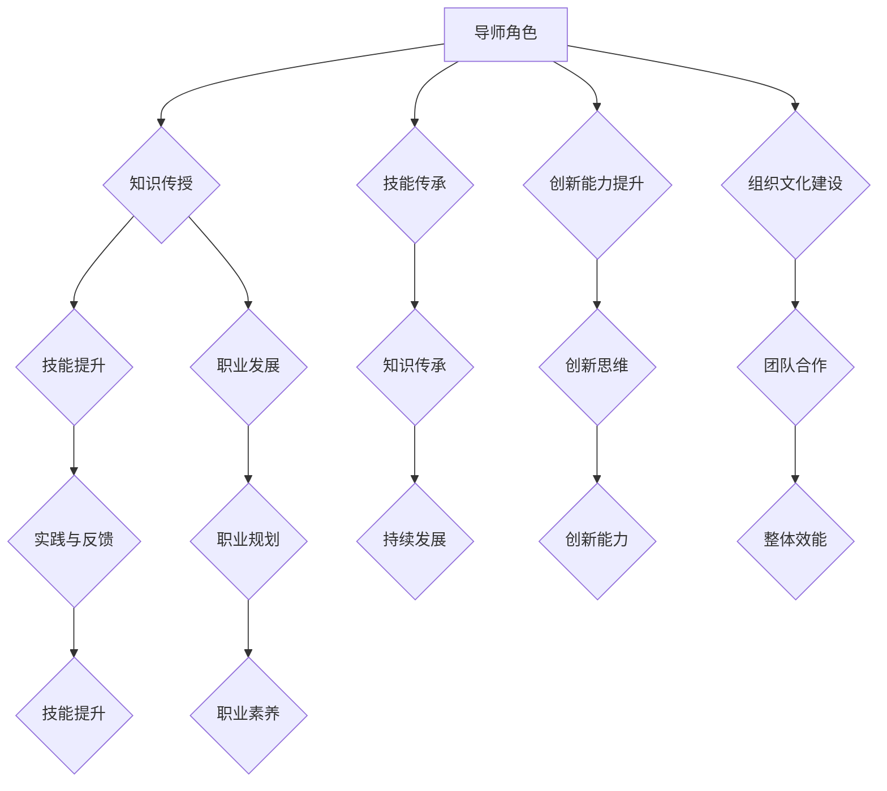
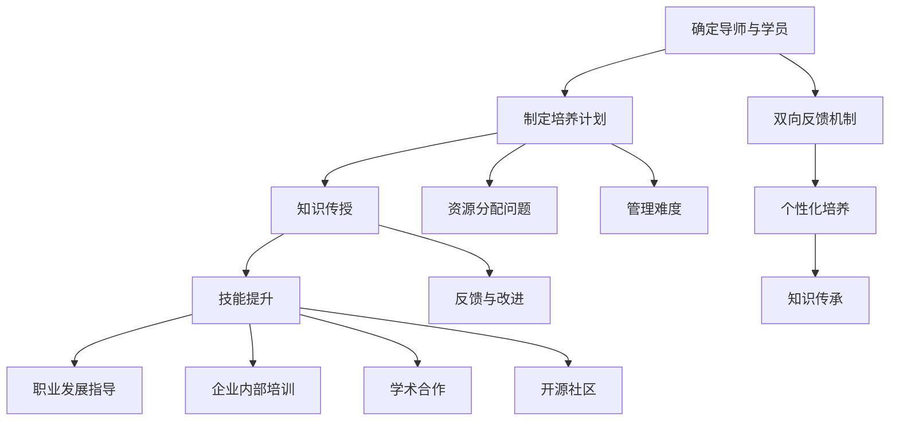

                 

关键词：技术mentoring、影响力、收益、IT行业、职业发展

> 摘要：本文深入探讨技术mentoring在IT行业中的重要性，分析其对于个人职业发展和组织文化建设的深远影响。通过具体案例分析，本文揭示了技术mentoring带来的实际收益，并提出了有效的实施策略。

## 1. 背景介绍

随着全球信息技术的迅猛发展，IT行业已经成为推动社会进步和经济发展的关键力量。在这个高速变化的领域中，技术人才的需求与日俱增，但人才培养却面临诸多挑战。为了解决这一矛盾，技术mentoring作为一种有效的培养机制，逐渐受到了广泛关注。

技术mentoring，即技术导师制，是一种通过资深技术人员指导和支持新人的培养模式。它不仅帮助新手快速掌握专业知识，提升技能，还能在职业发展和个人成长方面产生深远影响。本文将从以下几个方面探讨技术mentoring的收益与影响力：

- 技术mentoring的定义与核心概念
- 技术mentoring的历史与发展
- 技术mentoring在IT行业中的重要性
- 技术mentoring与组织文化建设的联系

## 2. 核心概念与联系

### 2.1 技术mentoring的定义与核心概念

技术mentoring是一种基于知识传授和经验分享的培养机制，通常涉及以下几个方面：

- **导师-学员关系**：导师作为经验丰富的技术专家，对学员提供指导、支持和反馈。学员通常是新手或新手技术人员。
- **知识传授**：导师通过分享个人经验和专业知识，帮助学员快速掌握技术技能。
- **技能提升**：学员在导师的指导下，通过实践和反复练习，不断提升自己的技术水平。
- **职业发展**：技术mentoring不仅关注技能的提升，更注重学员的职业发展，帮助他们规划职业生涯，提升职业素养。

### 2.2 技术mentoring的历史与发展

技术mentoring并非新兴概念，它在古代手工艺行业和现代医疗行业中都有悠久的历史。然而，随着信息技术的发展，技术mentoring逐渐在IT行业得到广泛应用。20世纪末，许多大型科技公司开始实施技术导师制，以提升员工的技术能力和创新能力。

近年来，随着开源社区和企业内部培训计划的兴起，技术mentoring的形式更加多样化，不仅限于企业内部，也涵盖了开源社区和学术界的合作。

### 2.3 技术mentoring在IT行业中的重要性

在IT行业中，技术mentoring的重要性体现在以下几个方面：

- **技能传承**：技术mentoring帮助新手快速掌握专业知识，确保技术知识的传承和延续。
- **创新能力提升**：通过导师的指导和启发，学员能够拓展思维，提升创新能力。
- **职业发展**：技术mentoring不仅关注技能的提升，还帮助学员规划职业发展，提升职业竞争力。
- **组织文化建设**：技术mentoring有助于构建积极向上的组织文化，促进团队合作和知识共享。

### 2.4 技术mentoring与组织文化建设的联系

技术mentoring不仅对个人职业发展有重要影响，还与组织文化建设密切相关。通过技术mentoring，组织能够：

- **增强员工归属感**：导师与学员之间的互动有助于增强员工的归属感，提高员工的忠诚度。
- **提升团队合作能力**：技术mentoring鼓励知识共享和团队合作，有助于提高组织的整体效能。
- **促进知识传承**：技术mentoring确保了组织内部知识的高效传承，为组织持续发展提供动力。

### 2.5 Mermaid 流程图

下面是技术mentoring的核心概念和流程的Mermaid流程图：



## 3. 核心算法原理 & 具体操作步骤

### 3.1 算法原理概述

技术mentoring的核心在于构建一个有效的知识传授和经验分享体系。这个体系的实现依赖于以下几个关键原理：

- **双向反馈**：导师和学员之间的双向反馈是技术mentoring成功的关键。导师需要及时给予学员反馈，学员也需要主动向导师请教问题。
- **个性化培养**：技术mentoring应根据学员的个人需求和职业目标进行个性化培养，确保学员能够快速提升技能。
- **持续学习**：技术mentoring不仅仅是一次性的培训，而是一个持续的学习过程。导师和学员都需要保持学习的态度，不断更新知识和技能。

### 3.2 算法步骤详解

技术mentoring的步骤可以概括为以下几个阶段：

- **确定导师与学员**：根据学员的技术背景和职业目标，为学员分配合适的导师。
- **制定培养计划**：导师和学员共同制定详细的培养计划，包括学习目标、学习内容和学习进度。
- **知识传授**：导师通过讲解、演示和实践等多种方式，向学员传授专业知识。
- **技能提升**：学员在导师的指导下，通过实际操作和项目参与，不断提升技能水平。
- **反馈与改进**：导师和学员定期进行反馈交流，根据反馈结果对培养计划进行调整。
- **职业发展指导**：导师在学员的职业发展过程中提供指导和建议，帮助学员制定职业规划。

### 3.3 算法优缺点

技术mentoring具有以下几个优点：

- **个性化培养**：技术mentoring能够根据学员的个人需求和职业目标进行个性化培养，提高学习效果。
- **双向反馈**：技术mentoring的双向反馈机制有助于提高学员的学习积极性和导师的指导质量。
- **知识传承**：技术mentoring有助于实现技术知识的传承和延续，为组织发展提供动力。

然而，技术mentoring也存在一些缺点：

- **资源分配问题**：导师和学员的匹配可能存在困难，特别是对于大型组织，导师资源可能无法满足所有学员的需求。
- **管理难度**：技术mentoring需要投入大量时间和精力进行管理，对于组织来说可能存在一定的管理难度。

### 3.4 算法应用领域

技术mentoring在以下领域具有广泛应用：

- **企业内部培训**：许多大型企业通过技术mentoring机制提升员工的技术能力和创新能力。
- **学术合作**：学术界通过技术mentoring培养研究生和博士后，帮助他们快速掌握专业知识。
- **开源社区**：开源社区通过技术mentoring培养新手开发者，推动开源项目的持续发展。

### 3.5 Mermaid 流程图

下面是技术mentoring算法的具体操作步骤的Mermaid流程图：



## 4. 数学模型和公式 & 详细讲解 & 举例说明

### 4.1 数学模型构建

为了更好地理解和量化技术mentoring的收益，我们可以构建一个数学模型。该模型包括以下几个关键参数：

- **技能提升速率**（\( r \)）：表示学员在导师指导下技能提升的速度。
- **知识积累量**（\( K \)）：表示学员在培养过程中积累的知识总量。
- **学习成本**（\( C \)）：表示学员在学习过程中所需投入的成本，包括时间、金钱等。
- **职业发展收益**（\( R \)）：表示学员通过技术mentoring获得的职业发展收益。

### 4.2 公式推导过程

我们可以通过以下公式来推导技术mentoring的收益：

\[ R = r \times K - C \]

其中：

- \( r \times K \) 表示学员通过技术mentoring获得的技能提升收益。
- \( C \) 表示学员在学习过程中所需投入的成本。

### 4.3 案例分析与讲解

为了更好地说明这个数学模型，我们可以通过一个实际案例进行分析。

假设一个新手程序员（学员）在导师的指导下，每月技能提升速率 \( r \) 为 10%，每月学习成本 \( C \) 为 1000元。经过6个月的技术mentoring，学员的技能积累量 \( K \) 达到 6000点。

根据上述公式，我们可以计算出学员在这段时间内的职业发展收益：

\[ R = 0.1 \times 6000 - 1000 = 500 \]

这意味着，学员在这6个月的技术mentoring过程中，通过技能提升获得的收益为5000元，扣除学习成本后，净收益为5000 - 1000 = 4000元。

### 4.4 模型扩展与优化

为了使模型更具普适性和实用性，我们可以对其进行扩展和优化。例如，考虑以下因素：

- **导师的指导质量**：导师的指导质量直接影响学员的技能提升速率。我们可以引入一个参数 \( q \) 表示导师的指导质量，\( r \) 可以表示为 \( r = q \times r_0 \)，其中 \( r_0 \) 为基础技能提升速率。
- **职业发展渠道**：学员在技术mentoring过程中，可能通过多种渠道获得职业发展收益，如晋升、奖金等。我们可以将这些渠道的收益分别计算，并汇总到总收益 \( R \) 中。

通过这些扩展和优化，我们可以使模型更加贴近实际，为技术mentoring的收益评估提供更科学的依据。

## 5. 项目实践：代码实例和详细解释说明

### 5.1 开发环境搭建

为了演示技术mentoring的实际应用，我们选择了一个简单的编程项目：实现一个基于Python的简单博客系统。以下是搭建开发环境所需的步骤：

1. **安装Python**：从官方网站下载并安装Python 3.8或更高版本。
2. **安装依赖库**：使用pip命令安装以下依赖库：
   ```bash
   pip install Flask
   pip install SQLAlchemy
   pip install WTForms
   ```
3. **创建项目目录**：在本地计算机上创建一个名为`blog`的项目目录，并在其中创建一个名为`app.py`的主文件。

### 5.2 源代码详细实现

以下是`app.py`的源代码实现：

```python
from flask import Flask, render_template, request, redirect, url_for
from flask_sqlalchemy import SQLAlchemy

app = Flask(__name__)
app.config['SQLALCHEMY_DATABASE_URI'] = 'sqlite:///blog.db'
db = SQLAlchemy(app)

class Post(db.Model):
    id = db.Column(db.Integer, primary_key=True)
    title = db.Column(db.String(100))
    content = db.Column(db.Text)

@app.route('/')
def index():
    posts = Post.query.all()
    return render_template('index.html', posts=posts)

@app.route('/create', methods=['GET', 'POST'])
def create_post():
    if request.method == 'POST':
        title = request.form['title']
        content = request.form['content']
        new_post = Post(title=title, content=content)
        db.session.add(new_post)
        db.session.commit()
        return redirect(url_for('index'))
    return render_template('create.html')

if __name__ == '__main__':
    db.create_all()
    app.run(debug=True)
```

### 5.3 代码解读与分析

下面是对源代码的详细解读：

- **数据库模型**：我们定义了一个名为`Post`的数据库模型，用于存储博客文章的信息，包括标题和内容。
- **路由和视图函数**：`index`函数负责渲染首页模板，显示所有博客文章。`create_post`函数处理创建新博客文章的请求，并在数据库中存储新文章的信息。
- **模板**：在项目的`templates`目录下，我们创建了两个HTML模板：`index.html`和`create.html`。`index.html`用于显示博客文章列表，`create.html`用于创建新博客文章的表单。

### 5.4 运行结果展示

运行`app.py`后，我们可以在浏览器中访问`http://127.0.0.1:5000/`，看到博客系统的首页，其中显示了一个空白的文章列表。通过点击“创建文章”按钮，我们可以进入创建新博客文章的页面，填写文章标题和内容后提交，即可在首页看到新创建的博客文章。

### 5.5 代码优化建议

虽然上述代码实现了一个简单的博客系统，但还存在一些可以优化的地方：

- **错误处理**：当前代码没有处理可能出现的数据库错误或表单验证错误，应添加相应的错误处理机制。
- **安全性**：当前代码使用明文存储用户输入的标题和内容，存在安全隐患。应使用加密技术对敏感信息进行保护。
- **模块化**：可以将视图函数、模型和模板等部分拆分为不同的模块，以提高代码的可读性和可维护性。

通过这些优化措施，我们可以使博客系统更加健壮和稳定。

## 6. 实际应用场景

技术mentoring在多个实际应用场景中展现出其独特的价值。以下是技术mentoring在几个典型应用场景中的具体实例和实际效果：

### 6.1 企业内部培训

许多大型企业通过技术mentoring机制，为新员工提供快速成长的机会。例如，谷歌（Google）就采用了“导师制”（Mentorship）来帮助新员工融入公司文化和提高技术水平。谷歌的导师制度包括以下步骤：

- **导师匹配**：新员工加入谷歌后，HR部门会根据新员工的技术背景和兴趣，为其分配一位经验丰富的导师。
- **定期交流**：导师和学员每月进行一次面对面的交流，讨论工作进展和学习心得。
- **技能培训**：导师为新员工提供专业技术培训，帮助他们掌握所需技能。
- **职业规划**：导师还为新员工提供职业发展建议，帮助他们制定个人成长计划。

通过这一系列措施，谷歌不仅提升了新员工的技术能力，还增强了员工的归属感和工作满意度。

### 6.2 开源社区合作

开源社区是技术mentoring的另一重要领域。开源项目往往需要大量贡献者，但新手贡献者可能缺乏经验和指导。以Python开源社区为例，社区通过以下方式引导新手贡献者：

- **新手引导**：Python官方文档提供了详细的贡献指南，帮助新手了解如何参与开源项目。
- **技术论坛**：Python社区设有专门的论坛，供新手提问和讨论技术问题。
- **导师分配**：对于有意愿贡献代码的新手，社区会为他们分配一位经验丰富的导师，提供一对一的技术指导。
- **代码评审**：导师对新手的代码进行评审，并提出改进建议，帮助新手提升代码质量。

通过这些措施，Python开源社区不仅培养了大量的技术人才，还推动了项目的持续发展。

### 6.3 创新创业

在创新创业领域，技术mentoring同样发挥着重要作用。许多初创企业通过导师制，帮助创始人快速掌握所需技能，降低创业风险。以下是一个具体的例子：

- **导师团队**：初创企业创始人可以加入创业孵化器，获得由经验丰富的企业家和专业人士组成的导师团队的指导。
- **战略规划**：导师帮助创始人制定商业战略，明确产品定位和市场策略。
- **技术支持**：导师为企业提供技术指导，帮助解决开发过程中遇到的技术难题。
- **资源链接**：导师可以为企业链接投资人和其他资源，提供资金支持和市场渠道。

通过这些措施，初创企业能够在竞争激烈的市场中站稳脚跟，实现快速发展。

### 6.4 教育领域

在教育领域，技术mentoring也被广泛应用于培养计算机科学专业人才。以下是一个具体的案例：

- **项目合作**：大学计算机科学系与科技公司合作，为本科生和研究生提供技术mentoring项目。
- **导师指导**：科技公司的技术专家担任导师，为学生提供专业知识和实际工作经验。
- **实习机会**：导师帮助学生获得实习机会，提升学生的实践能力。
- **就业指导**：导师为学生提供职业发展建议，帮助学生顺利步入职场。

通过这些措施，教育领域不仅提高了学生的就业竞争力，还为企业输送了大量高素质的人才。

## 7. 工具和资源推荐

为了更好地实施技术mentoring，以下是一些实用的工具和资源推荐：

### 7.1 学习资源推荐

- **在线课程**：Udemy、Coursera、edX等平台提供了丰富的编程和IT技能课程。
- **技术博客**：GitHub、Stack Overflow、Medium等平台上有大量的技术文章和开源项目。
- **电子书**：Amazon Kindle、O'Reilly等平台提供了大量高质量的IT专业书籍。

### 7.2 开发工具推荐

- **集成开发环境（IDE）**：如Visual Studio Code、PyCharm、Eclipse等。
- **代码版本控制工具**：如Git、GitHub、GitLab等。
- **持续集成/持续部署（CI/CD）**：如Jenkins、Travis CI、GitHub Actions等。

### 7.3 相关论文推荐

- **《Mentorship in Open Source Software Development》**：分析了开源社区中的技术mentoring机制。
- **《The Role of Mentoring in Employee Development》**：探讨了技术mentoring在组织中的重要作用。
- **《Mentoring in Technical Fields》**：总结了技术mentoring在不同技术领域的应用和效果。

## 8. 总结：未来发展趋势与挑战

### 8.1 研究成果总结

技术mentoring在近年来取得了显著的研究成果。研究发现，技术mentoring不仅有助于提升学员的技术能力和职业素养，还能促进组织的创新和知识传承。具体成果包括：

- **技能提升**：技术mentoring显著提高了学员的技术能力和实践经验。
- **职业发展**：技术mentoring有助于学员规划职业生涯，提升职业竞争力。
- **知识传承**：技术mentoring促进了技术知识的传承和延续，为组织发展提供动力。
- **组织文化**：技术mentoring有助于构建积极向上的组织文化，促进团队合作和知识共享。

### 8.2 未来发展趋势

展望未来，技术mentoring有望在以下几个方面取得进一步发展：

- **数字化与智能化**：随着人工智能和大数据技术的发展，技术mentoring将更加智能化和个性化。
- **跨界合作**：技术mentoring将拓展到更多领域，如教育、医疗、金融等，实现跨界合作。
- **全球化**：技术mentoring将跨越地域和国界，实现全球范围内的知识共享和技能传承。
- **可持续发展**：技术mentoring将更加注重可持续发展，关注环保和社会责任。

### 8.3 面临的挑战

尽管技术mentoring具有诸多优势，但在实际应用中仍面临以下挑战：

- **资源分配**：大型组织可能面临导师资源不足的问题，难以满足所有学员的需求。
- **管理难度**：技术mentoring需要投入大量时间和精力进行管理，对于组织来说可能存在一定的管理难度。
- **数据隐私**：在数字化和智能化的发展过程中，数据隐私保护将成为一个重要问题。
- **职业发展**：技术mentoring可能无法完全解决学员的职业发展问题，仍需其他辅助措施。

### 8.4 研究展望

未来，技术mentoring的研究将朝着以下几个方向展开：

- **智能化匹配**：研究如何通过人工智能技术实现导师与学员的智能化匹配，提高技术mentoring的效率和质量。
- **跨学科融合**：探讨技术mentoring在跨学科领域的应用，促进不同领域的知识融合和创新。
- **可持续发展**：研究如何通过技术mentoring实现可持续发展，关注环保和社会责任。
- **实证研究**：开展更多的实证研究，验证技术mentoring在不同场景下的效果和优势。

通过这些研究方向的探索，技术mentoring将在未来发挥更大的作用，推动IT行业的持续发展和进步。

## 9. 附录：常见问题与解答

### 9.1 技术mentoring的定义是什么？

技术mentoring是一种通过资深技术人员指导和支持新人的培养机制，旨在帮助新手快速掌握专业知识，提升技能，并在职业发展中获得指导和支持。

### 9.2 技术mentoring有哪些优势？

技术mentoring的优势包括：技能提升、职业发展、知识传承、组织文化建设、增强员工归属感、提升团队合作能力等。

### 9.3 技术mentoring如何实施？

技术mentoring的实施包括确定导师与学员、制定培养计划、知识传授、技能提升、反馈与改进、职业发展指导等步骤。

### 9.4 技术mentoring在哪些领域有应用？

技术mentoring在多个领域有应用，包括企业内部培训、开源社区合作、创新创业、教育领域等。

### 9.5 技术mentoring有哪些挑战？

技术mentoring面临的挑战包括资源分配问题、管理难度、数据隐私保护、职业发展问题等。

### 9.6 技术mentoring的未来发展趋势是什么？

技术mentoring的未来发展趋势包括数字化与智能化、跨界合作、全球化、可持续发展等。

### 9.7 如何进行技术mentoring的研究？

进行技术mentoring的研究可以从智能化匹配、跨学科融合、可持续发展、实证研究等方面展开。

---

### 作者署名

作者：禅与计算机程序设计艺术 / Zen and the Art of Computer Programming

