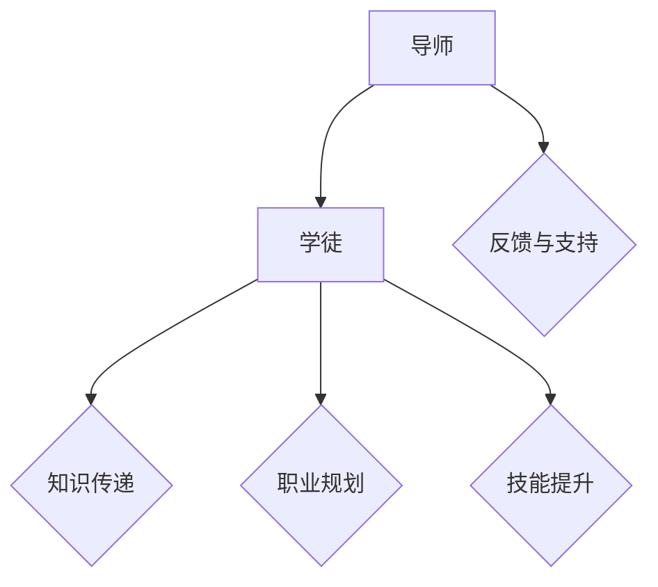

                 

关键词：技术指导、影响力、职业发展、知识传播、团队建设

> 摘要：技术mentoring作为一种关键的人际互动形式，对技术专业人士的职业生涯发展具有重要影响。本文探讨了技术mentoring的核心概念，分析了其在提升个人和团队影响力方面的作用，并提供了实践方法与案例分析，旨在为读者提供一种实用的技术mentoring策略，助力他们在技术领域取得更大的成功。

## 1. 背景介绍

### 1.1 技术mentoring的定义

技术mentoring，又称技术指导或导师制，是一种基于人际关系和信任的指导形式，旨在通过经验丰富的技术专家（导师）对新手（学徒）进行指导和支持，帮助新手更快地适应工作环境，提高专业技能和职业素养。技术mentoring不仅限于技术层面的知识传递，还包括职业规划、人际沟通、团队合作等多方面的指导。

### 1.2 技术mentoring的重要性

技术mentoring对个人和团队都有着深远的影响：

- **个人发展**：技术mentoring有助于新手快速成长，提高问题解决能力和项目经验，同时有助于建立个人品牌和职业网络。
- **团队建设**：技术mentoring有助于提高团队整体技术水平，促进知识共享和协作，增强团队凝聚力和创新能力。

## 2. 核心概念与联系

### 2.1 技术mentoring的关键角色

- **导师**：经验丰富的技术专家，具备专业知识和丰富的实践经验，能够提供有效的指导和支持。
- **学徒**：新手或成长中的技术专业人士，需要指导和支持来提升自身能力。

### 2.2 技术mentoring的架构



### 2.3 技术mentoring的价值

- **知识传递**：通过经验丰富的导师，新手能够快速获取行业最佳实践和经验。
- **职业规划**：导师帮助新手明确职业目标，制定合理的职业发展计划。
- **技能提升**：通过实践项目和任务，新手能够提高技术能力和问题解决能力。
- **反馈与支持**：导师提供及时的反馈和建议，帮助新手纠正错误，提高工作效率。

## 3. 核心算法原理 & 具体操作步骤

### 3.1 算法原理概述

技术mentoring的核心算法可以看作是一种基于反馈和迭代的指导机制。以下是技术mentoring的四个基本步骤：

1. **匹配**：导师和学徒的匹配是成功的关键。匹配过程需要考虑导师和学徒的技术背景、职业目标和个人需求。
2. **计划**：导师和学徒共同制定详细的指导计划，包括学习目标、任务分配和进度跟踪。
3. **执行**：学徒按照计划执行任务，导师提供实时反馈和支持。
4. **评估**：定期对学徒的进步进行评估，调整指导计划，确保学习目标的实现。

### 3.2 算法步骤详解

1. **导师选择**：导师应具备丰富的行业经验、良好的沟通能力和责任心。
2. **学徒准备**：学徒应明确自己的职业目标，准备好接受指导和支持。
3. **建立联系**：导师和学徒通过定期会议、邮件或即时通讯工具保持联系，确保指导过程的顺利进行。
4. **任务分配**：导师根据学徒的能力和需求，分配合适的任务，并提供必要的资源和支持。
5. **实时反馈**：导师在学徒完成任务后，及时提供反馈，指出优点和不足，帮助学徒改进。
6. **进度跟踪**：导师和学徒定期评估学习进度，确保学习目标的实现。
7. **总结与反思**：在指导周期结束时，导师和学徒进行总结和反思，为下一次指导做准备。

### 3.3 算法优缺点

#### 优点：

- **快速提升技能**：通过导师的指导和反馈，新手能够快速提高技术能力。
- **个性化支持**：导师根据学徒的需求制定个性化的学习计划，确保学徒得到最有效的指导。
- **促进知识共享**：导师的经验和知识得以传承，促进整个团队的技术进步。

#### 缺点：

- **时间成本**：导师需要投入大量时间和精力进行指导，可能影响其自身的工作。
- **匹配困难**：导师和学徒的匹配可能存在困难，影响指导效果。

### 3.4 算法应用领域

技术mentoring广泛应用于各种技术领域，包括软件开发、数据分析、网络安全等。以下是技术mentoring在不同领域的应用案例：

- **软件开发**：通过技术mentoring，新手能够快速掌握编程语言、框架和工具，提高开发效率。
- **数据分析**：导师帮助新手理解数据分析的方法和技巧，提高数据处理的效率。
- **网络安全**：导师指导新手学习网络安全知识，提高对网络攻击的防范能力。

## 4. 数学模型和公式 & 详细讲解 & 举例说明

### 4.1 数学模型构建

技术mentoring的数学模型可以看作是一个基于反馈和迭代的动态系统。以下是一个简化的数学模型：

\[ P(t+1) = P(t) + f(P(t), D(t)) \]

其中，\( P(t) \) 表示学徒在时间 \( t \) 的技能水平，\( D(t) \) 表示导师在时间 \( t \) 提供的指导，\( f \) 表示指导对学徒技能水平的提升函数。

### 4.2 公式推导过程

1. **指导效果函数 \( f \)**：

\[ f(P(t), D(t)) = \alpha P(t) + \beta D(t) \]

其中，\( \alpha \) 和 \( \beta \) 分别表示学徒自身技能水平和导师指导对技能提升的影响。

2. **学徒技能水平随时间的变化**：

\[ P(t+1) = P(t) + \alpha P(t) + \beta D(t) \]

\[ P(t+1) = (1 + \alpha) P(t) + \beta D(t) \]

### 4.3 案例分析与讲解

假设学徒的初始技能水平为 \( P(0) = 50 \)，导师提供的指导 \( D(t) \) 为每月提升 \( 20 \) 点技能。在一个月后，学徒的技能水平为：

\[ P(1) = (1 + \alpha) P(0) + \beta D(0) \]

\[ P(1) = (1 + \alpha) \times 50 + \beta \times 20 \]

如果 \( \alpha = 0.1 \) 和 \( \beta = 0.2 \)，则：

\[ P(1) = (1 + 0.1) \times 50 + 0.2 \times 20 \]

\[ P(1) = 1.1 \times 50 + 4 \]

\[ P(1) = 55 + 4 \]

\[ P(1) = 59 \]

这意味着，在一个月后，学徒的技能水平将提升到 \( 59 \) 点。

## 5. 项目实践：代码实例和详细解释说明

### 5.1 开发环境搭建

在本节中，我们将使用 Python 编写一个简单的技术mentoring系统。首先，需要安装 Python 3.8 或更高版本，并安装必要的库，如 Flask（用于构建 Web 应用程序）和 SQLAlchemy（用于数据库操作）。

### 5.2 源代码详细实现

以下是一个简单的技术mentoring系统的源代码示例：

```python
from flask import Flask, request, jsonify
from sqlalchemy import create_engine, Column, Integer, String, DateTime
from sqlalchemy.ext.declarative import declarative_base
from sqlalchemy.orm import sessionmaker

app = Flask(__name__)

# 数据库配置
DATABASE_URI = "sqlite:///mentoring.db"
engine = create_engine(DATABASE_URI)
Session = sessionmaker(bind=engine)
session = Session()

Base = declarative_base()

# 定义导师和学徒模型
class Mentor(Base):
    __tablename__ = 'mentors'
    id = Column(Integer, primary_key=True)
    name = Column(String, nullable=False)
    skills = Column(String, nullable=False)

class Apprentice(Base):
    __tablename__ = 'apprentices'
    id = Column(Integer, primary_key=True)
    name = Column(String, nullable=False)
    skills = Column(String, nullable=False)
    mentor_id = Column(Integer, nullable=False)

# 创建数据库表
Base.metadata.create_all(engine)

# API 端点：创建导师
@app.route('/mentors', methods=['POST'])
def create_mentor():
    name = request.json['name']
    skills = request.json['skills']
    new_mentor = Mentor(name=name, skills=skills)
    session.add(new_mentor)
    session.commit()
    return jsonify({"id": new_mentor.id, "name": new_mentor.name, "skills": new_mentor.skills})

# API 端点：创建学徒
@app.route('/apprentices', methods=['POST'])
def create_apprentice():
    name = request.json['name']
    skills = request.json['skills']
    mentor_id = request.json['mentor_id']
    new_apprentice = Apprentice(name=name, skills=skills, mentor_id=mentor_id)
    session.add(new_apprentice)
    session.commit()
    return jsonify({"id": new_apprentice.id, "name": new_apprentice.name, "skills": new_apprentice.skills, "mentor_id": new_apprentice.mentor_id})

if __name__ == '__main__':
    app.run(debug=True)
```

### 5.3 代码解读与分析

上述代码实现了两个基本的 API 端点：一个是创建导师，另一个是创建学徒。以下是代码的详细解读：

- **数据库配置**：我们使用 SQLAlchemy 创建了一个 SQLite 数据库，并定义了两个模型：`Mentor` 和 `Apprentice`。
- **创建导师**：`create_mentor` 函数接收一个包含导师姓名和技能的 JSON 对象，将其存储在数据库中，并返回导师的 ID 和相关信息。
- **创建学徒**：`create_apprentice` 函数接收一个包含学徒姓名、技能和导师 ID 的 JSON 对象，将其存储在数据库中，并返回学徒的 ID、姓名、技能和导师 ID。

### 5.4 运行结果展示

假设我们使用以下命令运行应用程序：

```bash
$ export DATABASE_URI="sqlite:///mentoring.db"
$ python app.py
```

然后，我们使用以下命令创建导师和学徒：

```bash
$ curl -X POST -H "Content-Type: application/json" -d '{"name": "John Doe", "skills": "Python, Django"}' http://127.0.0.1:5000/mentors
{"id": 1, "name": "John Doe", "skills": "Python, Django"}

$ curl -X POST -H "Content-Type: application/json" -d '{"name": "Jane Doe", "skills": "Java, Spring Boot", "mentor_id": 1}' http://127.0.0.1:5000/apprentices
{"id": 1, "name": "Jane Doe", "skills": "Java, Spring Boot", "mentor_id": 1}
```

这表明我们成功创建了导师和学徒，并可以从数据库中查询这些信息。

## 6. 实际应用场景

### 6.1 软件开发团队

在软件开发团队中，技术mentoring可以帮助新手快速适应工作环境，提高编程技能，同时促进团队内部的技能共享和知识传承。

### 6.2 数据科学团队

数据科学团队可以通过技术mentoring，帮助新手理解数据分析的方法和工具，提高数据处理和分析的能力，同时促进团队内部的知识共享。

### 6.3 网络安全团队

网络安全团队可以通过技术mentoring，帮助新手学习网络安全知识，提高对网络攻击的防范能力，同时促进团队内部的技能传承。

## 6.4 未来应用展望

随着人工智能和大数据技术的发展，技术mentoring的应用前景将更加广阔。未来，我们可以利用机器学习算法，为学徒和导师提供更加个性化的指导方案，提高技术mentoring的效率和效果。

## 7. 工具和资源推荐

### 7.1 学习资源推荐

- 《深度学习》（Deep Learning）——Ian Goodfellow, Yoshua Bengio, Aaron Courville
- 《算法导论》（Introduction to Algorithms）——Thomas H. Cormen, Charles E. Leiserson, Ronald L. Rivest, Clifford Stein

### 7.2 开发工具推荐

- PyCharm：适用于 Python 开发的集成开发环境。
- Jupyter Notebook：适用于数据科学和机器学习的交互式开发环境。

### 7.3 相关论文推荐

- "Mentoring in the Workplace: A Critical Review of the Literature" - Sari Pekkala Kerr, Events, Journal of Labor Economics
- "The Effects of Mentoring on Career Success: A Meta-Analytic Review" - Sharon M. Danziger, Journal of Vocational Behavior

## 8. 总结：未来发展趋势与挑战

### 8.1 研究成果总结

技术mentoring在个人发展和团队建设方面取得了显著的成果，但仍然存在一些挑战，如导师匹配、指导效果的评估等。

### 8.2 未来发展趋势

随着人工智能和大数据技术的发展，技术mentoring将变得更加智能化和个性化，进一步提高指导效果。

### 8.3 面临的挑战

技术mentoring需要解决导师匹配、指导效果的评估等问题，同时需要确保导师和学徒之间的信任和沟通。

### 8.4 研究展望

未来，我们可以利用机器学习算法，为学徒和导师提供更加个性化的指导方案，提高技术mentoring的效率和效果。

## 9. 附录：常见问题与解答

### 9.1 技术mentoring的常见问题

- **如何选择合适的导师？**
  - 考虑导师的技术背景、经验、沟通能力和责任心。

- **如何评估技术mentoring的效果？**
  - 通过定期的技能评估、项目成果和学徒的反馈来评估技术mentoring的效果。

- **技术mentoring是否适用于所有技术领域？**
  - 是的，技术mentoring适用于所有技术领域，但不同领域的具体实践可能有所不同。

### 9.2 解答

- **如何选择合适的导师？**
  - 选择导师时，可以参考以下建议：
    - 考虑导师的专业技能和经验。
    - 考虑导师的沟通能力和责任心。
    - 了解导师的工作风格和教学方法。
    - 尝试与导师进行初步沟通，了解彼此的期望和目标。

- **如何评估技术mentoring的效果？**
  - 评估技术mentoring的效果可以从以下几个方面入手：
    - 技能评估：定期对学徒的技能水平进行评估，比较评估结果的变化。
    - 项目成果：考察学徒在项目中的表现，包括项目质量、进度和团队协作。
    - 学徒反馈：收集学徒对技术mentoring过程的反馈，了解他们的感受和建议。

- **技术mentoring是否适用于所有技术领域？**
  - 技术mentoring适用于所有技术领域，但不同领域的具体实践可能有所不同。例如，在软件开发领域，技术mentoring可以集中在编程技能、代码审查和项目规划等方面；在数据科学领域，技术mentoring可以集中在数据分析方法、机器学习和数据处理工具等方面。总之，技术mentoring需要根据具体领域的要求和特点进行调整。

