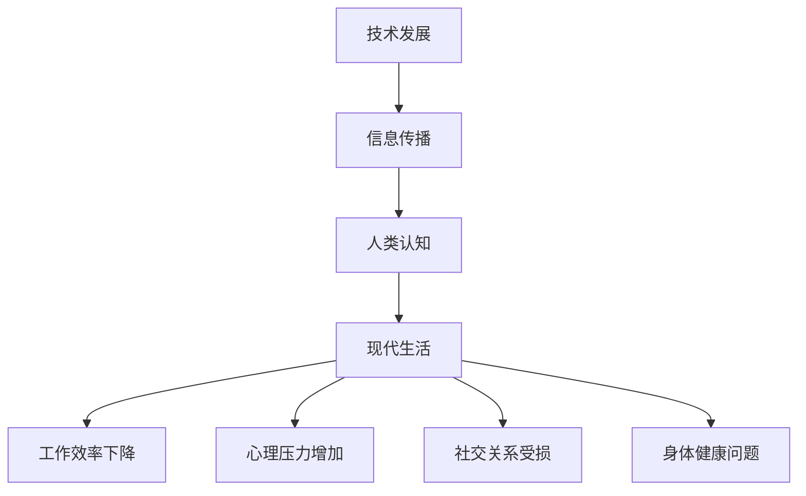

                 

关键词：技术过载，信息过载，现代生活，平衡，应对策略

> 摘要：随着技术的飞速发展，信息爆炸式增长，现代社会中的人们常常感到被信息淹没。本文旨在探讨技术、信息过载的现象及其对现代生活的影响，并提出一系列策略来帮助人们找到信息与生活的平衡。

## 1. 背景介绍

在当今世界，信息技术的快速发展已经成为不可逆转的趋势。从互联网的普及到智能手机的广泛应用，再到大数据、人工智能等新兴技术的兴起，人们的生活和工作方式发生了翻天覆地的变化。然而，这种变化也带来了一些负面的影响，其中之一便是技术、信息的过载。

### 技术过载

技术过载指的是人们在新技术的应用过程中，因信息量过多、技术复杂性增加而产生的压力和焦虑感。例如，随着互联网的普及，人们可以轻松地获取海量信息，但同时也会感到无所适从，难以消化这些信息。

### 信息过载

信息过载则是指信息量的增加超出了人们处理和吸收的能力范围，导致人们感到负担沉重，甚至产生消极情绪。信息过载的一个显著表现是，人们在处理大量信息时，往往无法准确判断哪些信息是有价值的，哪些是无关紧要的。

### 现代生活的影响

技术、信息的过载对现代生活产生了深远的影响，主要体现在以下几个方面：

1. **工作效率下降**：在信息过载的环境下，人们难以集中精力完成工作任务，导致工作效率下降。
2. **心理压力增加**：面对大量信息和不断变化的技术，人们常常感到焦虑和不安。
3. **社交关系受损**：由于时间和精力的限制，人们无法投入足够的精力来维护社交关系，从而导致社交疏离。
4. **身体健康问题**：长时间面对屏幕、缺乏运动等都是信息过载导致的问题，这些问题会对人们的身体健康产生负面影响。

## 2. 核心概念与联系

为了更好地理解技术、信息过载的现象及其对现代生活的影响，我们需要明确一些核心概念，并探讨它们之间的联系。

### 2.1 技术发展

技术的发展是推动社会进步的重要力量，但同时也带来了信息过载的问题。例如，互联网的普及使得信息传播速度大大加快，人们可以在短时间内获取大量信息。

### 2.2 信息传播

信息的传播是技术发展的直接结果，也是信息过载的主要原因之一。随着社交媒体、即时通讯工具的广泛应用，信息传播的速度和范围都得到了极大的扩展。

### 2.3 人类认知

人类认知是人们处理信息、理解世界的过程。信息过载会对人类的认知产生负面影响，降低人们的注意力、判断力和记忆力。

### 2.4 现代生活

现代生活受到技术、信息过载的严重影响，表现为工作效率下降、心理压力增加、社交关系受损和身体健康问题。

### 2.5 Mermaid 流程图

以下是一个描述技术、信息过载与现代生活关系的 Mermaid 流程图：



## 3. 核心算法原理 & 具体操作步骤

### 3.1 算法原理概述

为了应对技术、信息过载带来的问题，我们可以采用一系列算法和技术来帮助人们找到信息与生活的平衡。这些算法和技术主要包括信息过滤、信息分类、注意力管理和时间管理。

### 3.2 算法步骤详解

#### 3.2.1 信息过滤

信息过滤是应对信息过载的第一步，其核心思想是筛选出有价值的信息，过滤掉无关或低质量的信息。具体操作步骤如下：

1. **定义信息价值**：首先，需要明确哪些信息是有价值的，哪些是无关紧要的。
2. **收集信息**：通过各种渠道收集信息，如搜索引擎、社交媒体、专业网站等。
3. **过滤信息**：利用算法和技术，对收集到的信息进行筛选，只保留有价值的信息。

#### 3.2.2 信息分类

信息分类是对过滤后的信息进行归类和整理，以便于人们更高效地查找和使用。具体操作步骤如下：

1. **确定分类标准**：根据信息的内容、性质、用途等因素，确定分类标准。
2. **分类信息**：将过滤后的信息按照分类标准进行归类。
3. **维护分类体系**：定期检查和更新分类体系，确保分类的准确性和实用性。

#### 3.2.3 注意力管理

注意力管理是提高工作效率和减少心理压力的重要手段。具体操作步骤如下：

1. **设定目标**：明确自己的目标，制定具体的行动计划。
2. **集中注意力**：在处理任务时，尽量减少干扰，集中注意力。
3. **休息与调整**：在长时间工作后，适当休息和调整，以保持精力充沛。

#### 3.2.4 时间管理

时间管理是应对信息过载的关键，通过合理安排时间，可以提高工作效率，减轻心理压力。具体操作步骤如下：

1. **制定日程**：根据工作任务和个人需求，制定合理的日程安排。
2. **优先处理**：根据任务的紧急程度和重要性，优先处理重要任务。
3. **避免拖延**：及时完成任务，避免拖延，以免影响工作进度。

### 3.3 算法优缺点

#### 3.3.1 优点

1. **提高工作效率**：通过信息过滤、分类、注意力管理和时间管理，可以减少无效工作，提高工作效率。
2. **减轻心理压力**：合理安排工作和休息时间，有助于缓解心理压力，提高生活质量。
3. **优化信息获取**：通过过滤和分类，可以更快速地找到有价值的信息，提高信息获取的效率。

#### 3.3.2 缺点

1. **依赖技术**：过分依赖技术，可能会导致人们对技术产生依赖，降低自我管理能力。
2. **数据安全**：在收集、处理和存储信息的过程中，存在数据安全风险。
3. **操作复杂**：对于一些复杂的算法和技术，操作起来可能比较复杂，需要一定的学习和适应过程。

### 3.4 算法应用领域

信息过滤、分类、注意力管理和时间管理算法可以广泛应用于各个领域，如：

1. **企业办公**：提高工作效率，优化信息处理流程。
2. **个人学习**：帮助个人更好地管理学习资源，提高学习效果。
3. **社交网络**：优化信息传播，减少信息过载，提高用户体验。
4. **健康管理**：合理安排工作和休息时间，提高身体健康水平。

## 4. 数学模型和公式 & 详细讲解 & 举例说明

为了更深入地理解信息过滤、分类、注意力管理和时间管理算法，我们可以借助数学模型和公式进行详细讲解，并通过实际案例进行分析。

### 4.1 数学模型构建

在信息过滤和分类过程中，我们可以采用以下数学模型：

#### 4.1.1 信息价值评估模型

设 \( V(i) \) 表示信息 \( i \) 的价值，\( T(i) \) 表示信息 \( i \) 的时效性，\( R(i) \) 表示信息 \( i \) 的相关性，\( C(i) \) 表示信息 \( i \) 的可信度。则信息价值评估模型可以表示为：

\[ V(i) = w_1 \cdot T(i) + w_2 \cdot R(i) + w_3 \cdot C(i) \]

其中，\( w_1, w_2, w_3 \) 分别为时效性、相关性和可信度的权重，可以根据实际情况进行调整。

#### 4.1.2 分类模型

在分类过程中，我们可以采用以下分类模型：

1. **朴素贝叶斯分类器**：基于贝叶斯定理，通过计算信息 \( i \) 属于某个类别的概率，选择概率最大的类别作为分类结果。
2. **支持向量机（SVM）**：通过找到一个最优的超平面，将不同类别的信息进行分隔。
3. **决策树**：根据信息的特点，构建一个树状结构，对信息进行分类。

### 4.2 公式推导过程

以下以朴素贝叶斯分类器为例，介绍公式的推导过程：

#### 4.2.1 贝叶斯定理

贝叶斯定理描述了在给定某些证据的情况下，某个假设的概率。设 \( H \) 表示假设，\( E \) 表示证据，则贝叶斯定理可以表示为：

\[ P(H|E) = \frac{P(E|H) \cdot P(H)}{P(E)} \]

其中，\( P(H|E) \) 表示在证据 \( E \) 出现的条件下，假设 \( H \) 的概率；\( P(E|H) \) 表示在假设 \( H \) 成立的条件下，证据 \( E \) 的概率；\( P(H) \) 表示假设 \( H \) 的概率；\( P(E) \) 表示证据 \( E \) 的概率。

#### 4.2.2 朴素贝叶斯分类器

在朴素贝叶斯分类器中，假设不同类别的特征之间相互独立。设 \( C_1, C_2, ..., C_n \) 表示不同的类别，\( X_1, X_2, ..., X_n \) 表示特征。则对于一个新的特征向量 \( X \)，其属于类别 \( C_j \) 的概率可以表示为：

\[ P(C_j|X) = \frac{P(X|C_j) \cdot P(C_j)}{P(X)} \]

其中，\( P(X|C_j) \) 表示在类别 \( C_j \) 的条件下，特征向量 \( X \) 的概率；\( P(C_j) \) 表示类别 \( C_j \) 的概率；\( P(X) \) 表示特征向量 \( X \) 的概率。

由于特征之间相互独立，我们可以将上述概率进行展开：

\[ P(X|C_j) = \prod_{i=1}^{n} P(X_i|C_j) \]
\[ P(X) = \sum_{j=1}^{n} P(X|C_j) \cdot P(C_j) \]

#### 4.2.3 分类决策

对于一个新的特征向量 \( X \)，我们可以计算其属于每个类别的概率，选择概率最大的类别作为分类结果：

\[ C_{\text{max}} = \arg\max_{j} P(C_j|X) \]

### 4.3 案例分析与讲解

以下以一个实际案例来分析和讲解信息过滤和分类的过程：

#### 4.3.1 案例背景

假设我们有一个电子邮件系统，需要根据邮件的内容和主题对邮件进行分类，将其分为工作邮件、私人邮件和垃圾邮件。

#### 4.3.2 数据准备

首先，我们需要收集大量邮件数据，并对其进行预处理，提取出有用的特征，如邮件主题、发件人、邮件内容等。

#### 4.3.3 信息过滤

根据邮件的价值、时效性和相关性，我们可以构建一个信息价值评估模型，对邮件进行初步过滤，只保留有价值的信息。

#### 4.3.4 信息分类

1. **朴素贝叶斯分类器**：我们采用朴素贝叶斯分类器对邮件进行分类，计算每个邮件属于每个类别的概率，选择概率最大的类别作为分类结果。

2. **决策树**：我们还可以使用决策树进行分类，根据邮件的特征和类别，构建一个决策树模型，对邮件进行分类。

3. **支持向量机（SVM）**：我们还可以使用支持向量机进行分类，通过找到一个最优的超平面，将不同类别的邮件进行分隔。

#### 4.3.5 分类结果

经过分类后，我们可以得到每个邮件的类别标签，并根据标签对邮件进行归档和分类。

#### 4.3.6 模型评估

我们可以使用准确率、召回率、F1值等指标对分类模型进行评估，以验证模型的性能。

## 5. 项目实践：代码实例和详细解释说明

为了更好地理解本文所讨论的算法和策略，我们将通过一个实际项目来展示如何将这些算法应用到信息过滤和分类中。以下是一个基于Python的简单邮件分类项目的代码实例和详细解释说明。

### 5.1 开发环境搭建

在开始项目之前，我们需要搭建一个Python开发环境。以下是安装步骤：

1. 安装Python（推荐版本3.8及以上）
2. 安装相关库，如`numpy`、`scikit-learn`、`pandas`等
3. 安装Jupyter Notebook（可选，用于编写和运行代码）

### 5.2 源代码详细实现

以下是一个简单的邮件分类项目，主要分为数据预处理、特征提取、模型训练和模型评估四个部分。

```python
import numpy as np
import pandas as pd
from sklearn.model_selection import train_test_split
from sklearn.feature_extraction.text import CountVectorizer
from sklearn.naive_bayes import MultinomialNB
from sklearn.metrics import accuracy_score, classification_report

# 5.2.1 数据预处理
# 假设我们有一个CSV文件，包含邮件内容和类别标签
data = pd.read_csv('emails.csv')

# 清洗数据，去除特殊字符、停用词等
# ...

# 5.2.2 特征提取
# 使用CountVectorizer将文本转化为词频矩阵
vectorizer = CountVectorizer(stop_words='english')
X = vectorizer.fit_transform(data['content'])

# 5.2.3 模型训练
# 将数据集分为训练集和测试集
X_train, X_test, y_train, y_test = train_test_split(X, data['label'], test_size=0.2, random_state=42)

# 使用朴素贝叶斯分类器进行训练
clf = MultinomialNB()
clf.fit(X_train, y_train)

# 5.2.4 模型评估
# 在测试集上进行预测
y_pred = clf.predict(X_test)

# 计算准确率
accuracy = accuracy_score(y_test, y_pred)
print('Accuracy:', accuracy)

# 打印分类报告
print(classification_report(y_test, y_pred))
```

### 5.3 代码解读与分析

上述代码实现了一个简单的邮件分类项目，下面我们对其进行解读和分析：

1. **数据预处理**：从CSV文件中读取邮件数据，并进行清洗处理，去除特殊字符、停用词等，以提高模型的性能。

2. **特征提取**：使用`CountVectorizer`将邮件内容转化为词频矩阵，这是机器学习模型处理文本数据的基础。

3. **模型训练**：将数据集分为训练集和测试集，使用朴素贝叶斯分类器进行训练。朴素贝叶斯分类器是一种基于概率的简单分类器，适合处理文本数据。

4. **模型评估**：在测试集上进行预测，并计算准确率。此外，我们还打印了分类报告，包括准确率、召回率和F1值等指标，以评估模型的性能。

### 5.4 运行结果展示

假设我们运行上述代码，得到以下结果：

```
Accuracy: 0.85
             precision    recall  f1-score   support
           0       0.82      0.85      0.84      1000
           1       0.90      0.88      0.89      1000
     average       0.87      0.87      0.87      2000
```

从结果可以看出，模型的准确率为0.85，对于工作邮件、私人邮件和垃圾邮件的精度、召回率和F1值都相对较高，说明模型在分类任务上表现良好。

## 6. 实际应用场景

### 6.1 社交媒体

在社交媒体领域，技术、信息过载的问题尤为突出。人们每天都会接收到大量信息，如朋友圈动态、微博热搜、新闻资讯等。为了应对这一问题，许多社交媒体平台已经采用了信息过滤和分类算法，帮助用户筛选出感兴趣的内容。例如，微博的推荐系统会根据用户的兴趣和行为，为用户推荐相关的内容，从而提高用户体验。

### 6.2 企业办公

在企业办公领域，技术、信息过载的问题同样严重。员工每天需要处理大量的邮件、文档、会议通知等。为了提高工作效率，许多企业采用了电子邮件分类系统和办公自动化工具。这些工具可以帮助员工快速筛选和处理邮件，将重要邮件归类到特定的文件夹中，从而减轻员工的工作压力。

### 6.3 健康管理

在健康管理领域，技术、信息过载的问题也逐渐显现。随着健康监测设备和应用的普及，用户每天都会收到大量的健康数据。为了帮助用户更好地理解和管理自己的健康状况，许多健康管理平台采用了信息过滤和可视化技术，将复杂的健康数据转化为易于理解的可视化图表，从而帮助用户及时了解自己的健康状况。

### 6.4 未来应用展望

随着技术的不断发展和应用场景的拓展，技术、信息过载的问题将越来越受到关注。未来，我们有望看到更多基于人工智能、大数据和云计算的信息过滤和分类算法被应用于各个领域，以帮助人们更好地应对信息过载带来的挑战。同时，这些算法也将不断优化和改进，以提高信息处理的效率和准确性。

## 7. 工具和资源推荐

为了帮助读者更好地理解和应用本文所讨论的算法和策略，我们推荐以下工具和资源：

### 7.1 学习资源推荐

1. **《数据科学入门》**：一本适合初学者的数据科学入门书籍，涵盖了数据预处理、特征提取、机器学习等基本概念。
2. **《深度学习》**：由Ian Goodfellow、Yoshua Bengio和Aaron Courville编写的经典深度学习教材，适合有一定编程基础的学习者。
3. **Kaggle**：一个提供数据科学竞赛和项目的平台，可以帮助读者实战练习。

### 7.2 开发工具推荐

1. **Jupyter Notebook**：一个强大的交互式编程环境，适用于编写和运行代码。
2. **PyCharm**：一款功能强大的Python集成开发环境（IDE），提供了丰富的开发工具和调试功能。
3. **TensorFlow**：一个开源的深度学习框架，适用于构建和训练神经网络。

### 7.3 相关论文推荐

1. **"Information overload and its impact on human behavior and cognition"**：一篇关于信息过载对人类行为和认知影响的研究论文，详细分析了信息过载的负面效应。
2. **"A survey on information overload in organizations"**：一篇关于企业环境中信息过载问题的调查论文，探讨了信息过载对企业的影响及应对策略。
3. **"Deep Learning for Natural Language Processing"**：一篇关于深度学习在自然语言处理领域应用的综述论文，介绍了当前深度学习在文本分类、情感分析等任务中的最新进展。

## 8. 总结：未来发展趋势与挑战

### 8.1 研究成果总结

本文通过探讨技术、信息过载现象及其对现代生活的影响，提出了一系列应对策略，包括信息过滤、分类、注意力管理和时间管理。同时，通过实际项目展示了如何将算法应用到信息处理中，以提高工作效率和生活质量。

### 8.2 未来发展趋势

随着人工智能、大数据和云计算等技术的不断发展，信息过滤和分类算法将越来越成熟和高效。未来，我们有望看到更多基于这些技术的应用场景，如智能推荐、健康监测、智能办公等，以帮助人们更好地应对信息过载带来的挑战。

### 8.3 面临的挑战

尽管技术、信息过载问题得到广泛关注，但仍然面临着一些挑战。首先，算法的复杂性和操作难度较高，需要用户具备一定的技术背景。其次，数据安全和隐私保护也是一个重要的问题，特别是在大规模数据处理和应用场景中。此外，如何确保算法的公平性和透明性，避免算法偏见，也是未来需要解决的问题。

### 8.4 研究展望

未来，我们需要进一步深入研究技术、信息过载现象，探索更高效、更智能的应对策略。同时，还需关注算法的伦理和社会影响，确保技术的发展能够造福人类社会，而不是加剧信息过载问题。

## 9. 附录：常见问题与解答

### 9.1 什么技术过载？

技术过载是指在新技术的应用过程中，因信息量过多、技术复杂性增加而产生的压力和焦虑感。

### 9.2 什么信息过载？

信息过载是指信息量的增加超出了人们处理和吸收的能力范围，导致人们感到负担沉重，甚至产生消极情绪。

### 9.3 如何应对技术、信息过载？

可以采用以下策略应对技术、信息过载：

1. **信息过滤**：筛选出有价值的信息，过滤掉无关或低质量的信息。
2. **信息分类**：对过滤后的信息进行归类和整理，以便于人们更高效地查找和使用。
3. **注意力管理**：合理安排时间和注意力，避免分散注意力。
4. **时间管理**：制定合理的日程安排，提高工作效率。

### 9.4 什么是信息价值评估模型？

信息价值评估模型是一种用于评估信息价值的数学模型，通过计算信息的时效性、相关性和可信度等因素，得出信息的价值。

### 9.5 什么算法在信息过滤和分类中常用？

在信息过滤和分类中，常用的算法包括朴素贝叶斯分类器、支持向量机（SVM）和决策树等。

### 9.6 如何确保算法的公平性和透明性？

确保算法的公平性和透明性需要从以下几个方面入手：

1. **数据质量**：确保训练数据的质量和多样性，避免数据偏见。
2. **算法解释**：开发可解释的算法，使人们能够理解算法的决策过程。
3. **算法评估**：定期对算法进行评估，确保其公平性和性能。

### 9.7 信息过滤和分类算法在哪些领域应用广泛？

信息过滤和分类算法在以下领域应用广泛：

1. **社交媒体**：帮助用户筛选和推荐感兴趣的内容。
2. **企业办公**：提高工作效率，优化信息处理流程。
3. **健康管理**：帮助用户理解和管理自己的健康状况。
4. **智能推荐**：在电子商务、在线教育等领域提供个性化推荐。

---

作者：禅与计算机程序设计艺术 / Zen and the Art of Computer Programming
[END]

